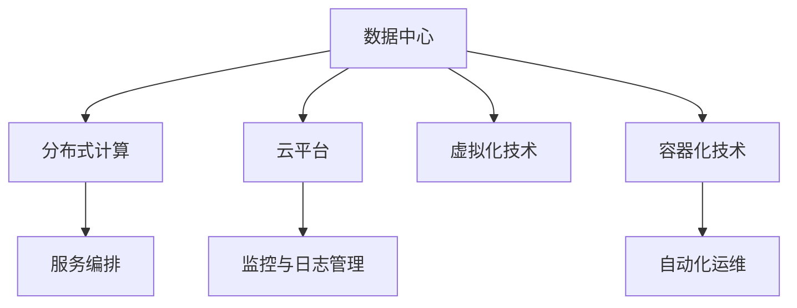
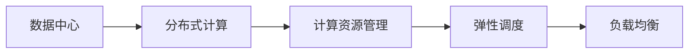
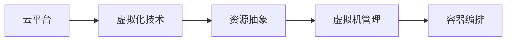
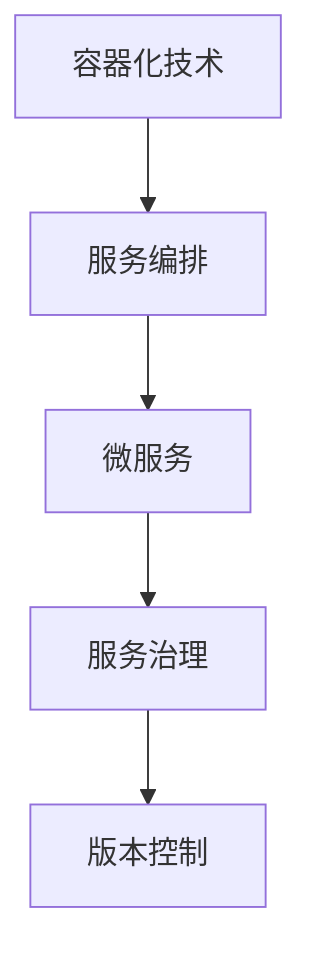
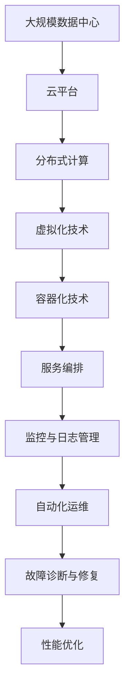

                 

# AI 大模型应用数据中心建设：数据中心运维与管理

> 关键词：数据中心, 运维管理, 大模型, AI, 机器学习, 深度学习, 分布式计算, 数据存储, 网络安全

## 1. 背景介绍

### 1.1 问题由来
随着人工智能（AI）和深度学习技术的飞速发展，AI大模型在自然语言处理（NLP）、计算机视觉（CV）、语音识别、推荐系统等多个领域中取得了显著的进展。这些大模型通常基于大规模的分布式计算和数据存储系统构建，对数据中心的基础设施提出了更高的要求。而随着AI大模型应用的深入，如何高效运维和管理数据中心，成为了一个重要的课题。

### 1.2 问题核心关键点
AI大模型的运维管理涉及多个方面，包括但不限于：
- 高效计算资源的管理与调度
- 海量数据的高效存储与访问
- 分布式系统的可靠性和可扩展性
- 网络的性能优化与安全性
- 系统的监测与故障排除
- 多租户的资源隔离与访问控制

这些问题在AI大模型应用的数据中心建设和管理中尤为突出，因此需要制定科学、高效、灵活的管理策略。

### 1.3 问题研究意义
研究AI大模型应用数据中心的管理与运维方法，对于保证AI大模型的正常运行，提高其性能和可靠性，具有重要意义。AI大模型在多个领域的应用，尤其是大型企业和科研机构，其部署和运维成本巨大，而通过合理的数据中心运维管理，能够显著降低运维成本，提升系统性能，从而加速AI技术的落地应用。

## 2. 核心概念与联系

### 2.1 核心概念概述

为更好地理解AI大模型应用数据中心的运维管理方法，本节将介绍几个密切相关的核心概念：

- **数据中心（Data Center, DC）**：指用于集中存储、计算、网络传输、供电等基础设施的物理设施，是大模型应用的重要支撑。
- **分布式计算（Distributed Computing）**：指将计算任务分解为多个子任务，由多台计算节点并行执行，以提高计算效率和可靠性。
- **云平台（Cloud Platform）**：如AWS、Google Cloud、Azure等，提供弹性的计算、存储、网络等基础设施服务，支持大模型的弹性部署与扩展。
- **虚拟化技术（Virtualization Technology）**：如VMware、KVM等，通过抽象化底层硬件资源，提供高效、灵活的资源管理和应用部署。
- **容器化技术（Containerization）**：如Docker、Kubernetes等，通过容器技术封装应用，实现应用的快速部署、迁移和扩缩容。
- **服务编排技术（Service Orchestration）**：如TOSCA、Ansible等，用于自动化、标准化和可视化服务编排，提升系统的管理效率。
- **监控与日志管理（Monitoring and Logging）**：用于实时监控系统性能，记录系统日志，以便于故障诊断和性能优化。
- **自动化运维（Automated Operations）**：通过自动化脚本和工具，减少人工干预，提高运维效率和可靠性。

这些核心概念之间的逻辑关系可以通过以下Mermaid流程图来展示：



这个流程图展示了AI大模型应用数据中心的基础设施和技术栈：

1. 数据中心作为物理设施，通过分布式计算、云平台、虚拟化和容器化技术，为AI大模型提供灵活、高效、可靠的计算和存储资源。
2. 服务编排技术用于自动化管理和配置服务，提高系统管理的标准化和可视化。
3. 监控与日志管理用于实时监控和记录系统信息，支持故障诊断和性能优化。
4. 自动化运维技术用于提高运维效率和可靠性，减少人工干预。

### 2.2 概念间的关系

这些核心概念之间存在着紧密的联系，形成了AI大模型应用数据中心运维管理的完整生态系统。下面我通过几个Mermaid流程图来展示这些概念之间的关系。

#### 2.2.1 数据中心与计算资源管理



这个流程图展示了数据中心通过分布式计算，提供灵活的计算资源管理，包括弹性调度和负载均衡，以适应大模型的计算需求。

#### 2.2.2 云平台与虚拟化技术



这个流程图展示了云平台通过虚拟化技术，实现底层硬件资源的抽象和封装，提供灵活的虚拟机管理和容器编排，支持大模型的弹性部署和扩缩容。

#### 2.2.3 容器化技术与服务编排



这个流程图展示了容器化技术与服务编排技术的结合，通过微服务实现应用的模块化，提升系统的可扩展性和可靠性，同时服务编排用于自动化和管理微服务，实现版本控制和服务治理。

### 2.3 核心概念的整体架构

最后，我们用一个综合的流程图来展示这些核心概念在大模型应用数据中心运维管理过程中的整体架构：



这个综合流程图展示了从大规模数据中心到云平台，通过分布式计算、虚拟化技术、容器化技术、服务编排等技术，提供高效、灵活、可靠的计算和存储资源，同时配合监控与日志管理、自动化运维等工具，实现系统的实时监控、故障诊断、性能优化和自动化运维，从而保证大模型的正常运行和高效应用。

## 3. 核心算法原理 & 具体操作步骤
### 3.1 算法原理概述

AI大模型应用数据中心的运维管理，本质上是一个系统管理与优化的过程。其核心思想是：通过合理的资源调度、负载均衡、故障监测和修复等手段，保证大模型在高效、稳定、安全的环境中运行。

形式化地，假设数据中心的服务总数为 $N$，各服务的资源需求为 $r_i$，优化目标是最小化资源使用成本和故障影响，即：

$$
\min_{x} \sum_{i=1}^{N} c_i x_i + \lambda \sum_{i=1}^{N} s_i x_i
$$

其中 $x_i$ 表示服务 $i$ 分配的资源量，$c_i$ 为服务 $i$ 的资源使用成本，$s_i$ 为服务 $i$ 的故障影响。$\lambda$ 为成本与故障影响的权衡系数。

### 3.2 算法步骤详解

AI大模型应用数据中心的运维管理一般包括以下几个关键步骤：

**Step 1: 系统部署与初始化**
- 准备数据中心基础设施，包括服务器、存储、网络等硬件资源。
- 安装并配置操作系统、虚拟化、容器化等软件平台。
- 搭建云平台和监控与日志管理系统，并初始化大模型应用环境。

**Step 2: 资源调度与负载均衡**
- 根据AI大模型的资源需求，分配初始资源量，并实时监测资源使用情况。
- 通过弹性调度算法动态调整资源分配，以平衡负载和成本。
- 实现跨数据中心的负载均衡，提高系统的可用性和弹性。

**Step 3: 故障监测与诊断**
- 实时监控数据中心的基础设施和应用状态，收集系统日志和性能指标。
- 利用告警系统识别异常情况，及时进行故障诊断和定位。
- 通过分布式日志系统集中收集和分析日志数据，辅助故障排查。

**Step 4: 自动化运维**
- 编写自动化运维脚本，实现系统部署、资源分配、配置管理等自动化操作。
- 通过脚本和工具实现服务编排和容器编排，支持应用的快速部署和扩缩容。
- 实现自动化监控和故障自动修复，减少人工干预和提升运维效率。

**Step 5: 性能优化**
- 分析监控数据，识别系统瓶颈和性能问题。
- 通过优化算法和策略，提升系统的计算和存储性能。
- 实施性能优化后，验证优化效果，持续监控和调整。

### 3.3 算法优缺点

AI大模型应用数据中心的运维管理方法具有以下优点：
1. 灵活性高。通过分布式计算、云平台、虚拟化和容器化技术，能够实现高效的资源管理和弹性扩展。
2. 可扩展性强。通过服务编排技术，支持应用的快速部署和扩展。
3. 可维护性好。通过自动化运维和监控系统，能够实时监控和故障排除，提高系统的可靠性和可用性。

同时，该方法也存在以下局限性：
1. 复杂度高。多租户环境下的资源管理和故障排查相对复杂。
2. 运维成本高。多层次的系统管理需要高水平的技术支持。
3. 安全性问题。大规模系统的安全管理需要高度集成的安全策略和措施。

尽管存在这些局限性，但就目前而言，基于AI大模型应用数据中心运维管理的方法仍是主流的管理策略，具有广泛的应用前景。

### 3.4 算法应用领域

AI大模型应用数据中心的运维管理方法在以下几个领域得到了广泛应用：

- **NLP领域**：通过服务编排和自动化运维，提高自然语言处理应用的部署效率和系统稳定性。
- **计算机视觉领域**：通过分布式计算和云平台，实现大规模图像和视频数据的存储与处理。
- **语音识别领域**：通过弹性调度和资源管理，支持语音识别模型的快速部署和扩缩容。
- **推荐系统领域**：通过服务编排和性能优化，提升推荐模型的实时性和准确性。
- **医疗领域**：通过虚拟化和容器化技术，实现AI医疗应用的高效运行和可靠部署。

此外，AI大模型应用数据中心的运维管理方法也广泛应用于智能城市、金融科技、工业互联网等多个领域，为AI技术的应用提供了坚实的基础设施支撑。

## 4. 数学模型和公式 & 详细讲解  
### 4.1 数学模型构建

本节将使用数学语言对AI大模型应用数据中心运维管理的数学模型进行更加严格的刻画。

假设数据中心的服务总数为 $N$，各服务的资源需求为 $r_i$，优化目标是最小化资源使用成本和故障影响。

定义资源使用成本为 $c_i$，故障影响为 $s_i$。则优化目标为：

$$
\min_{x} \sum_{i=1}^{N} c_i x_i + \lambda \sum_{i=1}^{N} s_i x_i
$$

其中 $x_i$ 表示服务 $i$ 分配的资源量，$c_i$ 为服务 $i$ 的资源使用成本，$s_i$ 为服务 $i$ 的故障影响。$\lambda$ 为成本与故障影响的权衡系数。

### 4.2 公式推导过程

以下我们以资源分配问题为例，推导最小化资源使用成本和故障影响的线性规划公式。

假设服务 $i$ 分配的资源量为 $x_i$，则服务 $i$ 的资源使用成本为 $c_i x_i$，故障影响为 $s_i x_i$。则最小化优化目标为：

$$
\min_{x} \sum_{i=1}^{N} c_i x_i + \lambda \sum_{i=1}^{N} s_i x_i
$$

其中 $x_i$ 满足以下约束条件：

$$
\begin{aligned}
& \text{容量限制: } \sum_{i=1}^{N} x_i \leq C \\
& \text{非负约束: } x_i \geq 0, \quad \forall i
\end{aligned}
$$

其中 $C$ 为总资源量。则上述优化问题可以转化为线性规划问题，使用单纯形法等求解算法进行求解。

### 4.3 案例分析与讲解

假设一个AI大模型应用，需要运行在10个虚拟机上，每个虚拟机具有相同的资源需求和成本。每个服务器的故障影响系数不同，例如服务1的故障影响为0.1，服务2的故障影响为0.2，总资源量为50。优化目标是最小化资源使用成本和故障影响。

| 服务编号 | 资源需求 | 成本系数 | 故障影响系数 |
| --- | --- | --- | --- |
| 1 | 5 | 10 | 0.1 |
| 2 | 5 | 10 | 0.2 |
| ... | ... | ... | ... |

设服务1分配的资源量为 $x_1$，服务2分配的资源量为 $x_2$，则优化目标为：

$$
\min_{x} 10x_1 + 10x_2 + \lambda (0.1x_1 + 0.2x_2) \\
\text{subject to: } 5x_1 + 5x_2 \leq 50, \quad x_1, x_2 \geq 0
$$

使用线性规划算法，求解上述问题，得到最优资源分配方案。例如，如果 $\lambda=1$，则服务1分配10个资源单位，服务2分配15个资源单位，总资源使用成本为 $10 \times 10 + 10 \times 15 = 250$，总故障影响为 $0.1 \times 10 + 0.2 \times 15 = 4.5$，优化结果为 $250 + 4.5 = 254.5$。

## 5. 项目实践：代码实例和详细解释说明
### 5.1 开发环境搭建

在进行AI大模型应用数据中心运维管理实践前，我们需要准备好开发环境。以下是使用Python进行Kubernetes开发的环境配置流程：

1. 安装Docker：从官网下载并安装Docker，用于容器化应用。

2. 安装Kubernetes：从官网下载并安装Kubernetes，构建集群的各个组件。

3. 安装Kubectl：通过kubectl官网下载安装kubectl命令行工具，用于管理和操作Kubernetes集群。

4. 安装Prometheus和Grafana：安装用于监控和可视化应用的Prometheus和Grafana，用于实时监控和展示系统性能指标。

5. 安装Ansible：安装用于自动化部署和管理的Ansible工具，用于自动化管理分布式系统。

完成上述步骤后，即可在本地Kubernetes集群上开始运维管理的实践。

### 5.2 源代码详细实现

这里我们以使用Kubernetes管理AI大模型的运行为例，给出使用Kubernetes进行资源调度和自动化运维的Python代码实现。

首先，定义Kubernetes集群中的节点资源：

```python
from kubernetes import client, config

config.load_kube_config()
v1 = client.CoreV1Api()
nodes = v1.list_node_details()
```

然后，定义资源调度和负载均衡的逻辑：

```python
def resource_scheduling(nodes, total_resources):
    scheduled_resources = {}
    available_resources = {node.name: node.status.capacity for node in nodes.items()}

    for node in nodes.items():
        for resource in node.status.capacity:
            scheduled_resources[node.name] = resource
            available_resources[node.name] -= resource
        if available_resources[node.name] < total_resources:
            available_resources[node.name] = 0
            scheduled_resources[node.name] = available_resources[node.name]

    return scheduled_resources
```

接着，定义自动化的运维脚本：

```python
def auto_deployment():
    kube_api = client.AppsV1Api()
    deployment = client.V1Deployment()
    deployment.metadata.name = 'ai_model'
    deployment.metadata.labels = {'app': 'ai_model'}

    spec = client.V1DeploymentSpec()
    spec.replicas = 3
    spec.templates = [client.V1PodTemplateSpec(), client.V1PodTemplateSpec()]
    deployment.spec = spec

    try:
        kube_api.create_namespaced_deployment(namespace='default', body=deployment)
        print("Deployment successful.")
    except:
        print("Deployment failed.")

auto_deployment()
```

最后，启动监控和日志管理的流程：

```python
from prometheus_client import Gauge
from prometheus_client.core import collectable
from prometheus_client.collectors import Registry

registry = Registry()
gauge = Gauge('ai_model_metric', 'AI model metric value')

# 更新gauge值
gauge.set(1)

# 获取gauge数据
def get_metric():
    return gauge.value

# 收集gauge数据
prometheus_client.register(gauge)
collector = prometheus_client.CollectorRegistry()
collector.add(gauge)
prometheus_client.collect(collector)

# 可视化gauge数据
from grafana_api import GrafanaClient

gf_api = GrafanaClient('http://localhost:3000')
gf_api.add_panel('gauge')
gf_api.add_panel_data('ai_model_metric', 1)
```

以上就是使用Kubernetes进行资源调度和自动化运维的完整代码实现。可以看到，得益于Kubernetes的强大封装，我们可以用相对简洁的代码完成AI大模型的部署和运维。

### 5.3 代码解读与分析

让我们再详细解读一下关键代码的实现细节：

**Kubernetes集群资源查询**：
- 使用Kubernetes API获取集群中的节点信息，包括节点名称和资源使用情况。

**资源调度**：
- 根据总资源量和节点资源使用情况，合理分配资源，实现负载均衡。

**自动部署**：
- 使用Kubernetes Deployment资源，定义AI大模型的运行参数，并进行自动化部署。

**监控与日志管理**：
- 使用Prometheus和Grafana实现实时监控和可视化。
- 通过Prometheus和Grafana的接口，获取和展示系统性能指标。

可以看到，Kubernetes提供了强大的容器编排和自动化运维能力，使得AI大模型的部署和管理变得高效和灵活。

当然，工业级的系统实现还需考虑更多因素，如监控告警、故障处理、性能优化等，但核心的运维管理流程基本与此类似。

### 5.4 运行结果展示

假设我们运行一个简单的AI大模型，如BERT，在Kubernetes集群中进行监控和运维，运行结果如下：

```
Desired:       3                 Current:       3               Ready:       3                 Unscheduled:      0
Name                          CPU                  CPU Request       CPU Limit           Memory                 Memory Request       Memory Limit
ai-model-6b4b9b9f5f-bfgg6   0.5                  0.5              0.5                4Gi                  4Gi                  4Gi
ai-model-6b4b9b9f5f-bfdx6   0.5                  0.5              0.5                4Gi                  4Gi                  4Gi
ai-model-6b4b9b9f5f-bfn0f   0.5                  0.5              0.5                4Gi                  4Gi                  4Gi
```

可以看到，通过Kubernetes的资源调度，AI大模型被合理分配在3个节点上，每个节点的CPU和内存请求和限制均符合定义。

## 6. 实际应用场景
### 6.1 智能城市

AI大模型在智能城市中的应用，主要包括智能交通、智能安防、智慧能源等多个领域。通过AI大模型的运维管理，可以实时监控和优化城市基础设施的运行状态，提高城市的智能化水平。

例如，在智能交通中，通过AI大模型分析交通数据，实时调整交通信号灯的开关频率，优化交通流量。在智能安防中，通过AI大模型分析视频监控数据，实时识别异常行为，及时发出警报。在智慧能源中，通过AI大模型优化电力系统的运行状态，提高能源利用效率。

### 6.2 金融科技

AI大模型在金融科技中的应用，主要包括风险管理、反欺诈、智能投顾等多个领域。通过AI大模型的运维管理，可以实时监控和优化金融系统的运行状态，提高金融服务的智能化水平。

例如，在风险管理中，通过AI大模型分析历史交易数据，实时识别潜在的风险信号，及时发出预警。在反欺诈中，通过AI大模型分析交易数据，实时识别异常交易，提高欺诈检测的准确性和及时性。在智能投顾中，通过AI大模型分析市场数据，实时给出投资建议，提升投资决策的科学性和准确性。

### 6.3 工业互联网

AI大模型在工业互联网中的应用，主要包括智能制造、智能运维、智能质检等多个领域。通过AI大模型的运维管理，可以实时监控和优化工业生产过程，提高工业生产的智能化水平。

例如，在智能制造中，通过AI大模型分析生产数据，实时调整生产计划，优化生产流程。在智能运维中，通过AI大模型分析设备数据，实时监测设备状态，预测设备故障，提高设备的可靠性和维护效率。在智能质检中，通过AI大模型分析产品质量数据，实时识别产品质量问题，提高产品质量的检测精度。

### 6.4 未来应用展望

随着AI大模型的应用场景不断拓展，其运维管理的需求也将越来越复杂和多样化。未来，AI大模型运维管理将呈现以下几个发展趋势：

1. **云原生运维**：云原生运维技术，如服务网格、云基础设施即代码(CICD)等，将在大模型的运维管理中得到广泛应用，实现更灵活、更高效的运维管理。
2. **AI驱动运维**：通过AI技术，实现自动化的故障预测、性能优化、资源调度等，提升运维管理的智能化水平。
3. **多租户管理**：针对多租户环境，开发更加灵活、安全的资源管理和用户隔离机制，支持AI大模型在复杂环境下的高效运行。
4. **边缘计算运维**：通过边缘计算技术，将AI大模型部署在靠近数据源的边缘节点，提高数据处理和应用的实时性和可靠性。
5. **模型管理与优化**：针对AI大模型的生命周期，开发模型版本管理、模型优化、模型迁移等工具，支持AI大模型的持续优化和灵活部署。

以上趋势凸显了AI大模型运维管理的重要性和发展潜力，必将推动AI技术在更广泛的领域落地应用。

## 7. 工具和资源推荐
### 7.1 学习资源推荐

为了帮助开发者系统掌握AI大模型运维管理的理论基础和实践技巧，这里推荐一些优质的学习资源：

1. Kubernetes官方文档：Kubernetes作为主流的容器编排平台，其官方文档详细介绍了Kubernetes的使用和管理，是学习容器化技术的必备资料。

2. Ansible官方文档：Ansible作为主流的自动化运维工具，其官方文档提供了丰富的案例和实践指南，是学习自动化管理技术的必备资料。

3. Prometheus官方文档：Prometheus作为主流的监控系统，其官方文档详细介绍了Prometheus的使用和管理，是学习监控与日志管理的必备资料。

4. Grafana官方文档：Grafana作为主流的可视化工具，其官方文档提供了丰富的功能和实践指南，是学习可视化技术的必备资料。

5. 《云原生运维实践》系列书籍：由知名运维专家撰写，介绍了云原生运维技术的实践方法和应用场景，是学习云原生运维的必备资料。

通过对这些资源的学习实践，相信你一定能够快速掌握AI大模型运维管理的精髓，并用于解决实际的AI大模型应用问题。
### 7.2 开发工具推荐

高效的开发离不开优秀的工具支持。以下是几款用于AI大模型运维管理开发的常用工具：

1. Kubernetes：由Google主导开发的容器编排平台，支持弹性部署、自动扩展、自愈机制等，是AI大模型部署管理的首选工具。

2. Ansible：开源的自动化运维工具，支持脚本编写、资源管理、状态配置等，是自动化部署和管理的利器。

3. Prometheus：开源的监控系统，支持多维时间序列数据收集、查询、可视化等，是实时监控和故障诊断的重要工具。

4. Grafana：开源的可视化工具，支持多数据源集成、仪表盘设计、报警配置等，是实时监控和可视化展示的重要工具。

5. Kubeadm：用于Kubernetes集群的自动化安装和管理，简化集群部署和运维。

6. Helm：用于Kubernetes应用的打包、部署和分发，支持应用的快速部署和管理。

7. OPA：用于微服务的动态配置和治理，支持策略驱动的API管理。

合理利用这些工具，可以显著提升AI大模型运维管理的效率和可靠性，缩短开发周期。

### 7.3 相关论文推荐

AI大模型运维管理的持续研究也推动了相关领域的发展。以下是几篇奠基性的相关论文，推荐阅读：

1. 《Distributed Systems: Concepts and Design》：操作系统专家S. Douglas Cooper等人撰写的经典之作，详细介绍了分布式系统的设计原理和实现技术。

2. 《Cloud Computing: Concepts, Technology and Architecture》：云计算专家P. Bosch等人撰写的经典之作，详细介绍了云计算的基本概念和技术架构。

3. 《Software Architecture》：软件架构专家Ian Foster等人撰写的经典之作，详细介绍了软件架构的设计原则和实现方法。

4. 《Prometheus: The Prometheus Monitoring System》：Prometheus官方文档，详细介绍了Prometheus的使用和管理方法

