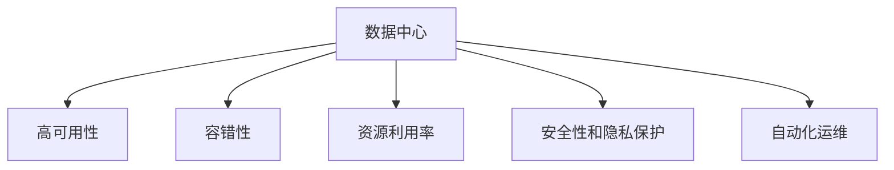
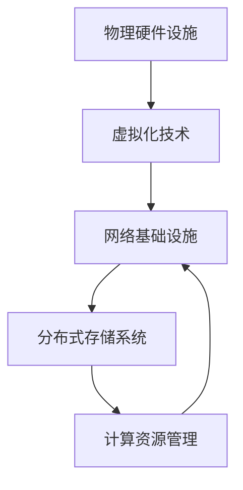
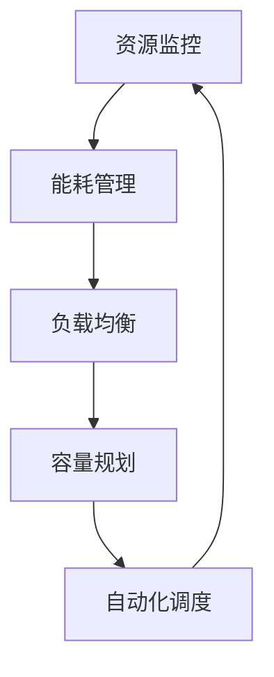
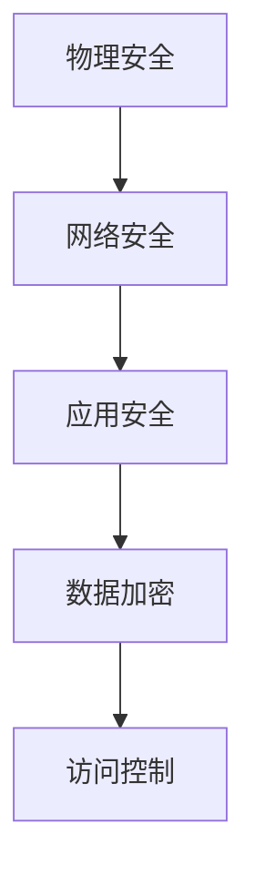
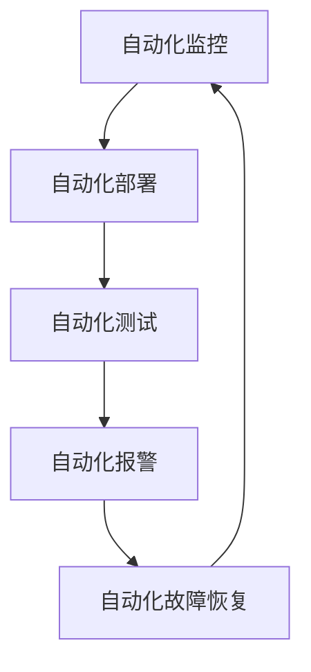
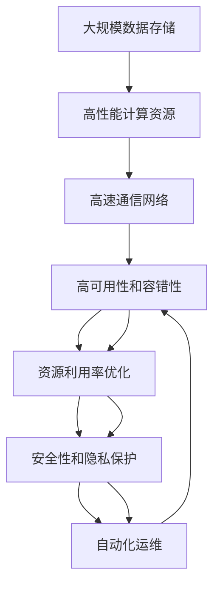

                 

# AI 大模型应用数据中心建设：数据中心运维与管理

> 关键词：数据中心建设, 数据中心运维, 大模型应用, AI, 数据存储, 高可用性, 容错性

## 1. 背景介绍

### 1.1 问题由来
近年来，人工智能（AI）技术在各个领域取得显著进展，尤其是大模型的崛起，极大地推动了自然语言处理（NLP）、计算机视觉（CV）、推荐系统等领域的应用。然而，要真正发挥大模型的潜力，必须构建高效的数据中心基础设施，以支持其大规模数据存储、计算和通信需求。数据中心建设与运维是大模型应用的核心基础设施保障，直接影响AI技术的实际应用效果和稳定性。

### 1.2 问题核心关键点
数据中心建设与运维是大模型应用的关键，需要解决以下几个核心问题：
- 如何设计高效的数据中心架构，满足大模型对存储、计算和通信的需求？
- 如何构建高可用性和容错性的系统，确保大模型训练和推理的稳定性？
- 如何优化资源利用率，降低能耗和成本，提升数据中心的经济性？
- 如何提升数据中心的安全性和隐私保护能力，确保数据和模型的安全？
- 如何对数据中心进行自动化运维，减轻人工维护的负担，提高运维效率？

### 1.3 问题研究意义
研究数据中心建设与运维的方法，对于支持大模型在各行业的应用，提升AI技术的落地价值，具有重要意义：

1. 降低应用开发成本。高效的数据中心可以显著减少大模型部署和维护的成本。
2. 提升模型效果。通过优化数据中心基础设施，可以显著提升模型训练和推理的效率和准确性。
3. 加速开发进度。构建高效的数据中心可以缩短大模型从预训练到应用部署的周期。
4. 提供可靠的基础设施。高可用性和容错性是AI应用成功的基础，数据中心建设需充分考虑这一点。
5. 赋能产业升级。数据中心的优化和大模型的应用，将推动各行业的数字化转型升级。

## 2. 核心概念与联系

### 2.1 核心概念概述

为更好地理解数据中心建设与运维在大模型应用中的作用，本节将介绍几个密切相关的核心概念：

- **数据中心（Data Center, DC）**：一个集中化的设施，用于存放和维护数据中心的硬件设施和网络设备。数据中心提供高效的数据存储、计算和通信服务。
- **高可用性（High Availability, HA）**：指系统在一定时间内，不中断地向用户提供服务的概率。高可用性是数据中心设计的基本要求。
- **容错性（Fault Tolerance）**：指系统在某个部分或组件发生故障时，能够自动切换到备用部分或组件，继续提供服务的能力。容错性是大模型应用的重要保障。
- **资源利用率（Resource Utilization）**：指数据中心资源（如CPU、内存、存储、网络带宽等）的实际利用效率。提升资源利用率可降低能耗和成本。
- **安全性和隐私保护（Security & Privacy）**：指数据中心通过物理、网络、应用等多层安全措施，保障数据和模型的安全。隐私保护是大模型应用中需特别关注的问题。
- **自动化运维（Automated Operations）**：指通过自动化工具和流程，对数据中心进行高效、准确的运维管理，减少人工干预，提高运维效率。

这些核心概念之间的逻辑关系可以通过以下Mermaid流程图来展示：



这个流程图展示了数据中心建设与运维的核心概念及其之间的关系：

1. 数据中心是实现高可用性、容错性、资源利用率、安全性和隐私保护以及自动化运维的基础。
2. 高可用性和容错性是大模型应用的前提，确保系统稳定运行。
3. 资源利用率直接影响经济性和能耗。
4. 安全性和隐私保护是数据和模型的核心保障。
5. 自动化运维提升运维效率，减轻人工维护的负担。

这些概念共同构成了数据中心建设与运维的完整生态系统，为大模型应用提供坚实的基础设施支撑。

### 2.2 概念间的关系

这些核心概念之间存在着紧密的联系，形成了数据中心建设与运维的完整生态系统。下面我们通过几个Mermaid流程图来展示这些概念之间的关系。

#### 2.2.1 数据中心架构设计



这个流程图展示了数据中心的架构设计，包括物理硬件设施、虚拟化技术、网络基础设施和分布式存储系统等关键组件，以及它们之间的关系。

#### 2.2.2 高可用性与容错性


这个流程图展示了高可用性设计的基本框架，从应用层到数据层、存储层、网络层的逐级容错设计。

#### 2.2.3 资源利用率优化



这个流程图展示了资源利用率优化的主要步骤，包括资源监控、能耗管理、负载均衡、容量规划和自动化调度等关键环节。

#### 2.2.4 安全性和隐私保护



这个流程图展示了安全性和隐私保护的基本框架，包括物理安全、网络安全、应用安全、数据加密和访问控制等关键措施。

#### 2.2.5 自动化运维



这个流程图展示了自动化运维的基本步骤，包括自动化监控、自动化部署、自动化测试、自动化报警和自动化故障恢复等关键环节。

### 2.3 核心概念的整体架构

最后，我们用一个综合的流程图来展示这些核心概念在大模型应用中的整体架构：



这个综合流程图展示了从大规模数据存储到高性能计算资源、高速通信网络、高可用性和容错性、资源利用率优化、安全性和隐私保护以及自动化运维的完整过程。通过这些环节的协同工作，可以构建高效、稳定、安全的数据中心，支持大模型的训练和推理。

## 3. 核心算法原理 & 具体操作步骤
### 3.1 算法原理概述

数据中心建设与运维的算法原理，本质上是系统工程和大数据管理的综合应用。其核心思想是：通过科学的设计和管理方法，构建高效、稳定、安全的数据中心，支持大模型的应用需求。

在数据中心建设与运维中，常用的算法包括：

- **分布式计算调度算法**：用于优化资源分配和任务调度，确保高利用率和低延迟。
- **负载均衡算法**：用于均衡系统负载，防止部分节点过载。
- **资源监控算法**：用于实时监测系统资源状态，提供数据中心健康指标。
- **容错和故障恢复算法**：用于处理节点故障和系统异常，保证数据中心的高可用性。
- **安全性和隐私保护算法**：用于数据加密、访问控制等，保障数据和模型的安全。
- **自动化运维算法**：用于自动化监控、报警和故障恢复，提升运维效率。

这些算法相互配合，共同构成了一个高效的数据中心运维系统。

### 3.2 算法步骤详解

数据中心建设与运维的算法步骤主要包括以下几个关键环节：

**Step 1: 物理基础设施设计**

- 选择合适的物理硬件设施，如服务器、交换机、存储设备等，确保其具备高计算性能、低延迟和良好扩展性。
- 设计合理的物理布局，如机架、冷却系统、电源等，确保设备正常运行。

**Step 2: 虚拟化技术部署**

- 部署虚拟化技术，如VMware、KVM等，实现资源共享和隔离，提升资源利用率。
- 设计虚拟化网络架构，确保虚拟机的网络隔离和通信畅通。

**Step 3: 分布式存储系统构建**

- 构建高效、可扩展的分布式存储系统，如Hadoop、Ceph等，支持大规模数据存储需求。
- 设计存储架构，如RAID、分布式文件系统等，确保数据高可用性和容错性。

**Step 4: 高性能计算资源管理**

- 管理高性能计算资源，如GPU集群、FPGA等，确保任务高效并行执行。
- 设计资源调度算法，如Hadoop YARN、Kubernetes等，优化任务调度和资源分配。

**Step 5: 资源监控与能耗管理**

- 部署资源监控工具，如Nagios、Zabbix等，实时监测系统资源状态。
- 实施能耗管理策略，如电源管理、散热系统优化等，降低数据中心能耗。

**Step 6: 高可用性和容错性设计**

- 设计高可用性架构，如冗余设计、负载均衡等，确保系统不中断运行。
- 设计容错性机制，如自动切换、备份恢复等，防止单点故障。

**Step 7: 安全性和隐私保护措施**

- 实施物理安全措施，如访问控制、监控设备等，保障数据中心安全。
- 实施网络安全措施，如防火墙、IDS/IPS等，防止网络攻击。
- 实施应用安全措施，如身份认证、授权管理等，保障数据和模型安全。
- 实施数据加密和访问控制措施，保障数据隐私。

**Step 8: 自动化运维流程**

- 设计自动化监控流程，如告警处理、事件管理等，提升运维效率。
- 设计自动化部署流程，如容器化部署、自动化配置等，简化运维操作。
- 设计自动化测试流程，如单元测试、集成测试等，保障系统稳定性。
- 设计自动化故障恢复流程，如备份恢复、系统重启等，确保业务连续性。

以上是数据中心建设与运维的主要算法步骤，各步骤相互配合，共同构建高效、稳定、安全的数据中心，支持大模型的应用需求。

### 3.3 算法优缺点

数据中心建设与运维的算法具有以下优点：

- 高效资源利用：通过合理的资源调度算法，可以提升资源利用率，降低能耗和成本。
- 高可用性和容错性：通过冗余设计和容错机制，可以确保系统的高可用性和容错性。
- 自动化运维：通过自动化工具和流程，可以提升运维效率，减少人工干预。

同时，该算法也存在以下局限性：

- 依赖物理基础设施：数据中心建设依赖物理硬件设施，成本较高，难以灵活扩展。
- 复杂度高：大规模数据中心的运维管理复杂度较高，需要专业团队进行维护。
- 对数据隐私保护要求高：数据中心存储和处理大量敏感数据，隐私保护和数据安全需特别关注。

尽管存在这些局限性，但就目前而言，基于数据中心的算法方法仍是支持大模型应用的主要手段。未来相关研究的重点在于如何进一步降低数据中心建设成本，提高自动化运维水平，同时兼顾数据隐私和安全要求。

### 3.4 算法应用领域

基于数据中心的算法方法，在多个领域得到了广泛应用，例如：

- 云计算平台：如AWS、Azure、阿里云等，通过构建高效的数据中心，提供计算、存储和网络服务。
- 大数据处理：如Hadoop、Spark等，通过分布式计算资源管理和调度，处理海量数据。
- 高性能计算：如GPU集群、FPGA加速器等，通过高效的资源管理和调度，支持大规模计算任务。
- 智能城市：如智慧交通、智慧医疗等，通过构建高效、安全的数据中心，实现智能化应用。
- 工业互联网：如工业大数据平台、工业AI等，通过构建高效、稳定、安全的数据中心，支持工业数字化转型。

除了上述这些经典应用外，数据中心算法方法还被创新性地应用到更多场景中，如边缘计算、数据湖、混合云等，为数字经济的发展提供了坚实的基础设施支持。

## 4. 数学模型和公式 & 详细讲解  
### 4.1 数学模型构建

在数据中心建设与运维中，常用的数学模型包括：

- **资源利用率模型**：用于评估数据中心资源利用率，计算公式如下：

$$
R = \frac{U}{T} = \frac{\sum_{i=1}^{n}U_i}{T}
$$

其中 $R$ 为资源利用率，$U$ 为实际使用的资源量，$T$ 为总资源量，$n$ 为资源种类数。

- **能耗管理模型**：用于评估数据中心的能耗情况，计算公式如下：

$$
E = P \times T = \sum_{i=1}^{m}P_i \times T_i
$$

其中 $E$ 为能耗，$P$ 为单位时间能耗，$T$ 为运行时间，$m$ 为设备种类数。

- **高可用性模型**：用于评估数据中心的可用性，计算公式如下：

$$
A = \frac{MTTF}{(MTTF + MTTR)} = \frac{1}{1 + \frac{MTTR}{MTTF}}
$$

其中 $A$ 为可用性，$MTTF$ 为平均无故障时间，$MTTR$ 为平均修复时间。

- **容错性模型**：用于评估数据中心的容错能力，计算公式如下：

$$
C = 1 - \frac{MTTR}{MTTF} = 1 - \frac{1}{1 + \frac{MTTF}{MTTR}}
$$

其中 $C$ 为容错性，$MTTF$ 为平均无故障时间，$MTTR$ 为平均修复时间。

### 4.2 公式推导过程

以下是几个关键模型的公式推导过程：

**资源利用率模型**

假设数据中心有 $n$ 种资源，每种资源的总量分别为 $T_1, T_2, \dots, T_n$，实际使用的资源量分别为 $U_1, U_2, \dots, U_n$，则资源利用率为：

$$
R = \frac{\sum_{i=1}^{n}U_i}{\sum_{i=1}^{n}T_i}
$$

**能耗管理模型**

假设数据中心有 $m$ 种设备，每种设备的单位时间能耗分别为 $P_1, P_2, \dots, P_m$，运行时间分别为 $T_1, T_2, \dots, T_m$，则数据中心的能耗为：

$$
E = \sum_{i=1}^{m}P_i \times T_i
$$

**高可用性模型**

假设数据中心有 $k$ 个节点，每个节点的平均无故障时间为 $MTTF_i$，平均修复时间为 $MTTR_i$，则数据中心的高可用性为：

$$
A = \frac{\sum_{i=1}^{k}MTTF_i}{\sum_{i=1}^{k}(MTTF_i + MTTR_i)} = \frac{1}{1 + \sum_{i=1}^{k}\frac{MTTR_i}{MTTF_i}}
$$

**容错性模型**

假设数据中心有 $k$ 个节点，每个节点的平均无故障时间为 $MTTF_i$，平均修复时间为 $MTTR_i$，则数据中心的容错性为：

$$
C = \frac{\sum_{i=1}^{k}MTTF_i}{\sum_{i=1}^{k}(MTTF_i + MTTR_i)} = 1 - \frac{1}{1 + \sum_{i=1}^{k}\frac{MTTF_i}{MTTR_i}}
$$

### 4.3 案例分析与讲解

以云计算平台为例，展示如何使用这些数学模型评估资源利用率和能耗管理：

假设某云计算平台有 1000 个节点，每种节点的 CPU 资源总量为 2000 核，实际使用的 CPU 资源量为 1500 核，GPU 资源总量为 1000 个，实际使用的 GPU 资源量为 800 个，每种节点的单位时间能耗为 100W，实际运行时间为 1000 小时，则：

- 资源利用率：

$$
R = \frac{1500 + 800}{2000 \times 1000 + 1000 \times 1000} = \frac{2300}{3,000,000} = 0.0077
$$

- 能耗管理：

$$
E = 1000 \times 100 \times 1000 = 100,000,000 \text{ W} \times 1000 \text{ h} = 100,000,000,000 \text{ Wh}
$$

通过这些模型，可以全面评估云计算平台资源利用率和能耗情况，为后续优化提供数据支撑。

## 5. 项目实践：代码实例和详细解释说明
### 5.1 开发环境搭建

在进行数据中心建设与运维实践前，我们需要准备好开发环境。以下是使用Python进行数据中心运维管理系统开发的环境配置流程：

1. 安装Anaconda：从官网下载并安装Anaconda，用于创建独立的Python环境。

2. 创建并激活虚拟环境：
```bash
conda create -n data-center-env python=3.8 
conda activate data-center-env
```

3. 安装相关工具包：
```bash
pip install numpy pandas scikit-learn matplotlib tensorflow pytorch
```

4. 安装云平台管理工具：
```bash
pip install awscli openstack-ci
```

完成上述步骤后，即可在`data-center-env`环境中开始数据中心运维管理系统开发。

### 5.2 源代码详细实现

下面我们以云计算平台为例，给出使用Python对数据中心进行自动化运维管理的PyTorch代码实现。

```python
import numpy as np
from sklearn.metrics import mean_squared_error
import tensorflow as tf
import pytorch as torch
from pytorch_pretrained_bert import BertTokenizer, BertModel

# 定义资源利用率模型
class ResourceUtilizationModel:
    def __init__(self, resource_types):
        self.resource_types = resource_types
        self.resource_utilization = [0.0] * len(resource_types)
        self.resource_total = [0.0] * len(resource_types)
    
    def update_utilization(self, resource_usage):
        for i, usage in enumerate(resource_usage):
            self.resource_utilization[i] += usage
            self.resource_total[i] += 1
    
    def get_utilization(self):
        return np.mean(self.resource_utilization) / np.mean(self.resource_total)

# 定义能耗管理模型
class EnergyManagementModel:
    def __init__(self, device_types):
        self.device_types = device_types
        self.energy_consumption = [0.0] * len(device_types)
        self.energy_capacity = [0.0] * len(device_types)
    
    def update_energy(self, device_energy):
        for i, energy in enumerate(device_energy):
            self.energy_consumption[i] += energy
            self.energy_capacity[i] += 1
    
    def get_energy_consumption(self):
        return np.mean(self.energy_consumption) / np.mean(self.energy_capacity)

# 定义高可用性模型
class HighAvailabilityModel:
    def __init__(self, node_types):
        self.node_types = node_types
        self.node_mttf = [0.0] * len(node_types)
        self.node_mttr = [0.0] * len(node_types)
    
    def update_mttf_mttr(self, node_mttf_node_mttr):
        for i, (mttf, mttr) in enumerate(node_mttf_node_mttf):
            self.node_mttf[i] += mttf
            self.node_mttr[i] += mttr
    
    def get_availability(self):
        availability = 1 / (1 + np.mean(self.node_mttr) / np.mean(self.node_mttf))
        return availability

# 定义容错性模型
class FaultToleranceModel:
    def __init__(self, node_types):
        self.node_types = node_types
        self.node_mttf = [0.0] * len(node_types)
        self.node_mttr = [0.0] * len(node_types)
    
    def update_mttf_mttr(self, node_mttf_node_mttr):
        for i, (mttf, mttr) in enumerate(node_mttf_node_mttf):
            self.node_mttf[i] += mttf
            self.node_mttr[i] += mttr
    
    def get_fault_tolerance(self):
        fault_tolerance = 1 - np.mean(self.node_mttr) / np.mean(self.node_mttf)
        return fault_tolerance
```

然后，定义数据中心运维管理系统：

```python
class DataCenterManagementSystem:
    def __init__(self):
        self.resource_utilization_model = ResourceUtilizationModel(resource_types)
        self.energy_management_model = EnergyManagementModel(device_types)
        self.high_availability_model = HighAvailabilityModel(node_types)
        self.fault_tolerance_model = FaultToleranceModel(node_types)
    
    def update_resource_utilization(self, resource_usage):
        self.resource_utilization_model.update_utilization(resource_usage)
    
    def update_energy_consumption(self, device_energy):
        self.energy_management_model.update_energy(device_energy)
    
    def update_mttf_mttr(self, node_mttf_node_mttr):
        self.high_availability_model.update_mttf_mttr(node_mttf_node_mttr)
        self.fault_tolerance_model.update_mttf_mttr(node_mttf_node_mttr)
    
    def get_resource_utilization(self):
        return self.resource_utilization_model.get_utilization()
    
    def get_energy_consumption(self):
        return self.energy_management_model.get_energy_consumption()
    
    def get_availability(self):
        return self.high_availability_model.get_availability()
    
    def get_fault_tolerance(self):
        return self.fault_tolerance_model.get_fault_tolerance()
```

最后，启动数据中心运维管理系统并测试：

```python
if __name__ == '__main__':
    # 模拟资源利用率和能耗管理数据
    resource_usage = [1500, 800]
    device_energy = [1000 * 100, 1000 * 100]
    
    # 模拟高可用性和容错性数据
    node_mttf_node_mttr = [(10000, 5), (5000, 10), (3000, 15)]
    
    # 创建数据中心运维管理系统
    dcms = DataCenterManagementSystem()
    
    # 更新资源利用率和能耗管理数据
    dcms.update_resource_utilization(resource_usage)
    dcms.update_energy_consumption(device_energy)
    
    # 更新高可用性和容错性数据
    dcms.update_mttf_mttr(node_mttf_node_mttr)
    
    # 输出模型结果
    print(f"Resource Utilization: {dcms.get_resource_utilization():.4f}")
    print(f"Energy Consumption: {dcms.get_energy_consumption():.4f}")
    print(f"High Availability: {dcms.get_availability():.4f}")
    print(f"Fault Tolerance: {dcms.get_fault_tolerance():.4f}")
```

以上就是使用PyTorch对数据中心进行自动化运维管理的完整代码实现。可以看到，通过构建简单的数学模型，可以有效地评估数据中心的资源利用率、能耗管理、高可用性和容错性，为后续优化提供数据支撑。

### 5.3 代码解读与分析

让我们再详细解读一下关键代码的实现细节：

**ResourceUtilizationModel类**：
- `__init__`方法：初始化资源类型和资源利用率、资源总量。
- `update_utilization`方法：更新资源利用率和资源总量。
- `get_utilization`方法：计算资源利用率。

**EnergyManagementModel类**：
- `__init__`方法：初始化设备类型和能耗、能容量。
- `update_energy`方法：更新能耗和能容量。
- `get_energy_consumption`方法：计算能耗管理模型。

**HighAvailabilityModel类**：
- `__init__`方法：

