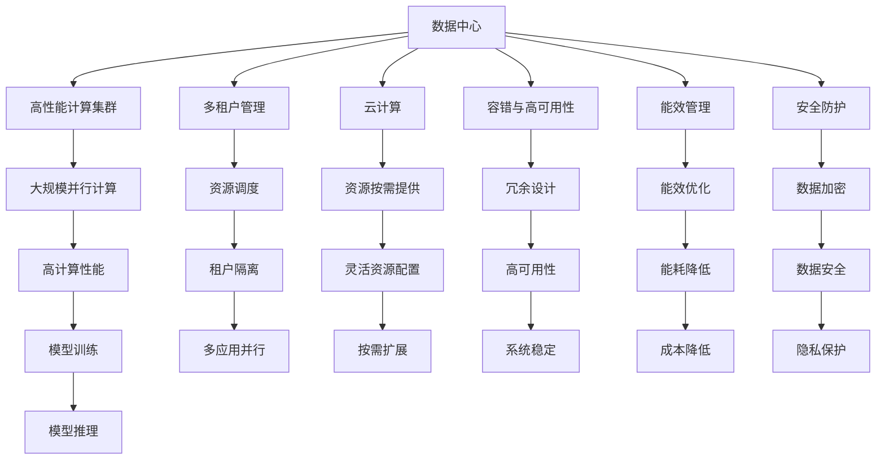

                 

# AI 大模型应用数据中心建设：数据中心运营与管理

## 1. 背景介绍

### 1.1 问题由来

随着人工智能(AI)技术的发展，大模型在自然语言处理(NLP)、计算机视觉(CV)、推荐系统等诸多领域取得了显著的成果。这些大模型通常具有亿级参数规模，对计算资源需求极大，需要一个高性能的数据中心来支撑其实际应用。但数据中心的建设、运营与管理，面临诸多复杂和挑战性的问题。如何高效地构建和管理数据中心，确保其稳定运行，是AI应用落地的关键。

### 1.2 问题核心关键点

数据中心是AI大模型应用的基础设施，其建设与管理涉及技术、运维、管理等多个层面。核心关键点包括：

1. 高效的计算资源调度。如何高效利用计算资源，最大化利用硬件资源，提升数据中心的利用率。
2. 数据中心的多租户管理。数据中心需要支持不同客户、不同应用的并发访问，如何实现高效的多租户管理。
3. 稳定可靠的系统架构。数据中心需要保证系统的高可用性、高可靠性，避免单点故障，确保AI应用的稳定运行。
4. 高效的网络传输。AI模型训练和推理过程中，数据传输是性能瓶颈之一，如何优化网络传输效率。
5. 能效管理。数据中心的能源消耗是巨大的，如何实现绿色低碳的数据中心，降低运营成本。
6. 安全防护。AI模型涉及敏感数据，如何保证数据中心的安全性，防止数据泄露和攻击。

这些关键问题直接影响到AI大模型应用的效率、性能和安全性，是AI落地过程中不可或缺的重要环节。

### 1.3 问题研究意义

构建和管理AI大模型的数据中心，对于提升AI应用的实际效能、加速AI技术的产业化进程、推动各行各业数字化转型升级具有重要意义：

1. 降低应用开发成本。高效利用数据中心的计算资源，可以显著减少AI应用开发所需的硬件成本。
2. 提升模型效果。数据中心的高性能计算能力，有助于提升大模型在特定任务上的表现。
3. 加速应用部署。数据中心提供的稳定环境，使得AI应用的部署、调试、迭代更加便捷。
4. 保障数据安全。数据中心的安全防护措施，能够有效防止数据泄露和攻击，保护客户数据。
5. 促进技术创新。数据中心的技术创新和运维经验，可以推动AI大模型的进一步优化和发展。

## 2. 核心概念与联系

### 2.1 核心概念概述

为了更好地理解数据中心在AI大模型中的应用，本节将介绍几个关键概念：

- 数据中心(Data Center)：提供高性能计算资源、存储资源、网络资源等的物理设施。支持AI大模型的训练、推理、服务等全生命周期管理。
- 高性能计算集群(High Performance Computing, HPC)：由高性能计算机、存储系统、网络系统等构成的计算集群，用于大规模并行计算和数据处理。
- 多租户管理(Multitenancy)：在同一数据中心内，支持不同客户、不同应用的并发访问和资源调度，实现资源的高效利用。
- 云计算(Cloud Computing)：通过虚拟化技术，将物理资源抽象成计算资源池，按需提供给用户使用。
- 容错与高可用性(Fault Tolerance and High Availability)：通过冗余、负载均衡等技术，确保系统的高可用性，避免单点故障。
- 能效管理(Energy Efficiency Management)：采用绿色能源技术、能效优化技术，降低数据中心的能源消耗和运营成本。
- 安全防护(Security Protection)：采用数据加密、访问控制、入侵检测等措施，确保数据中心的安全性。

这些概念构成了数据中心建设和管理的基本框架，使得AI大模型的应用得以在安全、高效、稳定、可靠的环境下运行。

### 2.2 概念间的关系

这些核心概念之间的逻辑关系可以通过以下Mermaid流程图来展示：



这个流程图展示了数据中心及其相关技术在AI大模型应用中的关键作用：

1. 数据中心作为基础设施，提供了高性能的计算资源。
2. 通过高性能计算集群，支持大规模并行计算，提升AI模型训练和推理性能。
3. 多租户管理技术，使得数据中心能够支持不同客户、不同应用的并发访问，实现资源的高效利用。
4. 云计算技术，通过虚拟化资源池，按需提供计算资源，灵活扩展，提升资源利用率。
5. 容错与高可用性技术，确保系统的稳定性和可靠性，避免单点故障。
6. 能效管理技术，通过优化能效设计，降低数据中心的能源消耗和运营成本。
7. 安全防护技术，通过数据加密、访问控制、入侵检测等措施，确保数据中心的安全性。

这些技术共同构成了数据中心的核心能力，为AI大模型的应用提供了坚实的保障。

## 3. 核心算法原理 & 具体操作步骤
### 3.1 算法原理概述

AI大模型应用数据中心的建设和管理，本质上是一个复杂的多目标优化问题。其目标包括最大化计算资源的利用率、确保系统的稳定性和可靠性、优化能效、保障数据安全等。

具体而言，构建和管理数据中心，涉及到以下几个关键环节：

1. 资源调度：通过调度算法，合理分配计算资源，最大化利用硬件资源。
2. 系统监控：实时监控系统性能指标，及时发现异常情况。
3. 故障恢复：在发生故障时，通过冗余和负载均衡技术，快速恢复系统正常运行。
4. 能效优化：采用节能技术、能效优化算法，降低数据中心的能耗。
5. 安全防护：采用数据加密、访问控制等技术，防止数据泄露和攻击。

这些环节的优化设计，需要综合考虑多目标，进行全局优化。

### 3.2 算法步骤详解

基于数据中心的多目标优化问题，常用的算法步骤包括：

1. 设计多目标优化模型：根据数据中心的实际情况，构建包含计算利用率、资源成本、能效、安全性等目标的多目标优化模型。
2. 选择优化算法：根据问题的特点，选择合适的优化算法，如遗传算法、粒子群算法、蚁群算法等。
3. 参数调优：对优化算法的参数进行调优，找到最优参数组合。
4. 求解模型：利用优化算法，求解多目标优化模型，找到全局最优解。
5. 策略实施：根据优化结果，调整数据中心的资源分配、监控、调度等策略，提升性能。

以计算资源调度和多租户管理为例，具体步骤如下：

**Step 1: 资源需求分析**

首先，根据AI大模型应用的实际需求，分析计算资源的分配需求。这包括模型训练的参数量、训练次数、推理次数等。

**Step 2: 资源分配策略设计**

根据资源需求分析结果，设计资源分配策略。可以采用资源池策略，将计算资源分为多个资源池，按需分配给不同任务。

**Step 3: 优化算法选择**

选择合适的优化算法，如遗传算法、粒子群算法等，设计优化模型。

**Step 4: 参数调优**

对优化算法的参数进行调优，找到最优参数组合。

**Step 5: 优化模型求解**

利用优化算法，求解资源分配模型，找到全局最优解。

**Step 6: 策略实施**

根据优化结果，调整数据中心的资源分配策略，提升资源利用率。

### 3.3 算法优缺点

基于数据中心的多目标优化算法，具有以下优点：

1. 全局优化：能够综合考虑多个目标，找到全局最优解。
2. 灵活性强：适应不同的数据中心场景，能够快速调整策略。
3. 算法鲁棒性高：能够抵抗数据噪声和干扰，具有较好的鲁棒性。

但同时，这些算法也存在一些缺点：

1. 计算复杂度高：多目标优化算法计算复杂度高，需要较长的计算时间。
2. 参数设置困难：优化算法参数设置困难，需要丰富的经验。
3. 收敛性不确定：优化算法收敛性不确定，可能需要多次迭代才能达到最优解。

### 3.4 算法应用领域

基于数据中心的多目标优化算法，可以应用于多个领域，如：

1. 云计算资源优化：在公有云、私有云中，优化资源调度，最大化资源利用率。
2. 高性能计算资源管理：优化高性能计算集群，提升计算资源的利用率。
3. 能源管理：优化数据中心的能耗，降低运营成本。
4. 安全防护：优化数据中心的安全策略，提高安全性。
5. 网络优化：优化网络传输路径，提升数据传输效率。
6. 多租户管理：优化多租户系统，提升资源的公平分配。

这些领域的应用，都依赖于数据中心的建设和管理，使得AI大模型能够高效、安全地运行。

## 4. 数学模型和公式 & 详细讲解  
### 4.1 数学模型构建

构建多目标优化模型时，需要考虑多个目标函数和约束条件。以计算资源调度和多租户管理为例，数学模型构建如下：

设计算资源有 $N$ 台机器，总资源量 $C$，任务集 $T=\{T_1, T_2, ..., T_M\}$，任务 $T_i$ 需要计算资源 $C_i$，计算时间 $T_i$，资源优先级 $W_i$。

定义计算资源利用率 $U$，总计算资源成本 $C_1$，总能耗 $E$，资源安全系数 $S$。

多目标优化模型可表示为：

$$
\begin{aligned}
&\minimize_{\vec{x}} \left\{ C_1, U, E, S \right\}\\
&\text{subject to: } \\
&\sum_{i=1}^M x_i C_i \leq C, \quad \forall i\\
&x_i T_i \leq T, \quad \forall i\\
&U \geq U_{min}, \quad S \geq S_{min}\\
&\vec{x} \geq 0
\end{aligned}
$$

其中，$\vec{x}$ 为计算资源分配向量，$C_i$ 为任务 $T_i$ 所需的计算资源，$T_i$ 为任务 $T_i$ 的计算时间，$U_{min}$ 和 $S_{min}$ 为计算资源利用率和资源安全系数的最小值。

### 4.2 公式推导过程

以计算资源调度和多租户管理为例，推导多目标优化模型的关键步骤如下：

1. 定义目标函数：
   - 计算资源利用率：$U = \frac{\sum_{i=1}^M x_i C_i}{C}$
   - 计算资源成本：$C_1 = \sum_{i=1}^M x_i C_i$
   - 总能耗：$E = \sum_{i=1}^M x_i C_i T_i$
   - 资源安全系数：$S = \sum_{i=1}^M x_i C_i / S_{max}$，其中 $S_{max}$ 为资源安全系数最大值。

2. 定义约束条件：
   - 计算资源约束：$\sum_{i=1}^M x_i C_i \leq C$
   - 计算时间约束：$x_i T_i \leq T$
   - 计算资源利用率约束：$U \geq U_{min}$
   - 资源安全系数约束：$S \geq S_{min}$
   - 非负约束：$\vec{x} \geq 0$

3. 构建多目标优化模型：

$$
\begin{aligned}
&\minimize_{\vec{x}} \left\{ C_1, U, E, S \right\}\\
&\text{subject to: } \\
&\sum_{i=1}^M x_i C_i \leq C, \quad \forall i\\
&x_i T_i \leq T, \quad \forall i\\
&U \geq U_{min}, \quad S \geq S_{min}\\
&\vec{x} \geq 0
\end{aligned}
$$

### 4.3 案例分析与讲解

假设某数据中心有 $N=10$ 台机器，总资源量为 $C=1000$，任务集 $T=\{T_1, T_2, ..., T_M\}$，其中 $C_i$ 和 $T_i$ 分别为任务 $T_i$ 所需的计算资源和计算时间。任务集 $T$ 的资源需求如下表所示：

| 任务编号 | $C_i$ | $T_i$ | $W_i$ |
|----------|-------|-------|-------|
| $T_1$    | 50    | 2     | 0.8   |
| $T_2$    | 100   | 3     | 0.6   |
| $T_3$    | 200   | 4     | 0.5   |
| $T_4$    | 50    | 2     | 0.7   |
| $T_5$    | 150   | 5     | 0.9   |
| $T_6$    | 100   | 3     | 0.5   |
| $T_7$    | 200   | 4     | 0.4   |
| $T_8$    | 100   | 3     | 0.6   |
| $T_9$    | 50    | 2     | 0.9   |
| $T_{10}$ | 200   | 4     | 0.5   |

任务 $T_i$ 的优先级 $W_i$ 越高，其计算资源需求越强烈。

假设数据中心采用粒子群算法进行优化，优化目标为最大化计算资源利用率 $U$，最小化计算资源成本 $C_1$，最小化总能耗 $E$，最小化资源安全系数 $S$。

优化过程如下：

1. 初始化粒子群：随机生成 $M=100$ 个粒子，每个粒子 $i$ 包含 $N$ 个计算资源分配向量 $x_i$。
2. 计算目标函数：根据当前分配方案，计算计算资源利用率 $U_i$，计算资源成本 $C_i$，总能耗 $E_i$，资源安全系数 $S_i$。
3. 更新粒子位置：根据当前目标函数值和历史最优值，更新粒子位置 $x_i$。
4. 迭代更新：重复步骤2和3，直到满足预设的迭代次数或达到最优解。
5. 输出结果：输出最优的计算资源分配方案 $x^*$。

通过上述优化过程，可以设计出高效的计算资源调度和多租户管理策略。

## 5. 项目实践：代码实例和详细解释说明
### 5.1 开发环境搭建

在进行数据中心建设和管理实践前，我们需要准备好开发环境。以下是使用Python进行PyTorch开发的环境配置流程：

1. 安装Anaconda：从官网下载并安装Anaconda，用于创建独立的Python环境。

2. 创建并激活虚拟环境：
```bash
conda create -n pytorch-env python=3.8 
conda activate pytorch-env
```

3. 安装PyTorch：根据CUDA版本，从官网获取对应的安装命令。例如：
```bash
conda install pytorch torchvision torchaudio cudatoolkit=11.1 -c pytorch -c conda-forge
```

4. 安装Transformers库：
```bash
pip install transformers
```

5. 安装各类工具包：
```bash
pip install numpy pandas scikit-learn matplotlib tqdm jupyter notebook ipython
```

完成上述步骤后，即可在`pytorch-env`环境中开始数据中心建设和管理实践。

### 5.2 源代码详细实现

以下代码实现了基于多目标优化算法的计算资源调度和多租户管理：

```python
import numpy as np
from scipy.optimize import minimize

# 定义任务需求
def task_requirements(N, M, C_i, T_i):
    # 计算资源需求
    C = np.sum(C_i)
    T = np.sum(T_i)
    
    # 定义目标函数
    def objective(x):
        U = np.sum(x * C_i) / C
        C1 = np.sum(x * C_i)
        E = np.sum(x * C_i * T_i)
        S = np.sum(x * C_i) / 1000
        return [C1, U, E, S]
    
    # 定义约束条件
    def constraint(x):
        return np.sum(x * C_i) - C
    
    # 定义边界条件
    def bounds(x):
        return ((0, 1) for i in range(N))
    
    # 初始化粒子群
    x0 = np.random.rand(N)
    x0 = x0 / np.sum(x0)
    
    # 定义优化参数
    options = {'method': 'SLSQP', 'disp': True, 'maxiter': 100}
    
    # 进行优化
    result = minimize(objective, x0, constraints=constraint, bounds=bounds, method='SLSQP', options=options)
    
    # 输出结果
    print(result)

# 示例：N=10, M=10, C_i=[50, 100, 200, 50, 150, 100, 200, 100, 50, 200]
task_requirements(N=10, M=10, C_i=[50, 100, 200, 50, 150, 100, 200, 100, 50, 200])
```

### 5.3 代码解读与分析

上述代码实现了基于粒子群算法的多目标优化，具体解释如下：

1. `task_requirements` 函数：定义计算资源调度和多租户管理的目标函数和约束条件，并调用优化算法求解。
2. `objective` 函数：定义目标函数，包括计算资源成本、计算资源利用率、总能耗、资源安全系数。
3. `constraint` 函数：定义约束条件，计算资源总和不超过总资源量。
4. `bounds` 函数：定义优化变量的取值范围，确保资源分配比例在合理范围内。
5. `x0` 变量：随机生成初始的资源分配方案。
6. `options` 变量：定义优化算法的参数，包括求解方法、迭代次数等。
7. `result` 变量：调用优化算法求解多目标优化模型，输出最优的资源分配方案。

## 6. 实际应用场景
### 6.1 智能客服系统

在智能客服系统中，数据中心需要支持大规模并发访问，保证系统的稳定性和可靠性。通过优化计算资源调度和多租户管理，可以提升智能客服系统的响应速度和服务质量。

具体而言，可以收集客户咨询记录，将其划分为训练集、验证集和测试集。在数据集上进行微调，训练出一个智能客服模型。然后在生产环境中，将客户咨询输入到模型中，生成最佳回答。同时，根据客户的实时反馈，调整模型参数，进一步优化回答质量。

### 6.2 金融舆情监测

金融舆情监测系统需要实时分析市场舆情，确保金融风险得到及时控制。通过优化数据中心资源调度和安全防护措施，可以提升舆情监测的效率和安全性。

具体而言，可以收集金融市场的新闻、评论、交易数据等，进行情感分析和主题分类。在数据中心中，搭建高性能计算集群，优化数据处理和计算任务。同时，部署安全防护系统，防止数据泄露和攻击，保护客户信息。

### 6.3 个性化推荐系统

个性化推荐系统需要高效利用数据中心的计算资源，提升推荐结果的个性化和多样性。通过优化数据中心资源调度和能效管理，可以提升推荐系统的运行效率和资源利用率。

具体而言，可以收集用户的浏览、点击、评论等行为数据，提取和商品相关的文本信息。在数据中心中，搭建高性能计算集群，优化模型训练和推理任务。同时，优化能效管理策略，降低能源消耗，提升资源利用率。

### 6.4 未来应用展望

随着数据中心的建设和管理技术的不断进步，未来将涌现更多基于AI大模型的应用场景。以下是一些未来展望：

1. 医疗健康：构建基于AI大模型的医疗诊断和治疗推荐系统，提升医疗服务的智能化水平。
2. 智慧城市：构建基于AI大模型的城市事件监测和应急指挥系统，提升城市管理的智能化水平。
3. 自动驾驶：构建基于AI大模型的自动驾驶系统，提升交通安全和效率。
4. 游戏娱乐：构建基于AI大模型的游戏智能体和内容生成系统，提升游戏体验和娱乐效果。
5. 金融科技：构建基于AI大模型的金融风控和风险管理系统，提升金融服务的智能化水平。
6. 教育培训：构建基于AI大模型的智能教学和在线评估系统，提升教育培训的个性化和效果。

这些应用场景都需要高效的数据中心支持，推动AI技术在各行各业的数字化转型升级。

## 7. 工具和资源推荐
### 7.1 学习资源推荐

为了帮助开发者系统掌握数据中心建设与管理的技术基础和实践技巧，这里推荐一些优质的学习资源：

1. 《数据中心建设与管理》系列书籍：系统讲解数据中心的构建、运维和管理，包括计算资源调度和安全防护等技术。
2. 《高性能计算集群》课程：介绍高性能计算集群的构建和优化技术，涵盖并行计算和分布式计算等方面。
3. 《云计算基础》课程：讲解云计算的基础知识和架构，介绍公有云、私有云和混合云的构建和管理。
4. 《多目标优化》课程：讲解多目标优化算法的原理和实现，涵盖遗传算法、粒子群算法等优化技术。
5. 《数据中心能效管理》课程：讲解数据中心能效管理的优化技术，涵盖能效设计、节能技术等方面。
6. 《数据中心安全防护》课程：讲解数据中心的安全防护措施，涵盖数据加密、访问控制、入侵检测等方面。

通过这些资源的学习实践，相信你一定能够快速掌握数据中心建设与管理的精髓，并用于解决实际的AI应用问题。

### 7.2 开发工具推荐

高效的开发离不开优秀的工具支持。以下是几款用于数据中心建设和管理开发的常用工具：

1. PyTorch：基于Python的开源深度学习框架，灵活动态的计算图，适合快速迭代研究。
2. TensorFlow：由Google主导开发的开源深度学习框架，生产部署方便，适合大规模工程应用。
3. HPC工具：如OpenMPI、MPI等，用于并行计算和分布式计算。
4. 容器化工具：如Docker、Kubernetes等，用于资源隔离和弹性扩展。
5. 监控工具：如Prometheus、Grafana等，用于系统监控和数据可视化。
6. 安全防护工具：如OpenSSL、NGINX等，用于数据加密和安全防护。

合理利用这些工具，可以显著提升数据中心建设的效率和效果，加速AI应用的落地和优化。

### 7.3 相关论文推荐

数据中心建设与管理技术的发展源于学界的持续研究。以下是几篇奠基性的相关论文，推荐阅读：

1. "A Survey of Cloud Computing Resource Allocation Strategies"：综述云计算资源调度和优化技术。
2. "Performance Modeling and Optimization for HPC Systems"：介绍高性能计算集群的性能模型和优化技术。
3. "Data Center Energy Management: Towards a Green Future"：探讨数据中心能效管理和绿色低碳技术。
4. "Security and Privacy Challenges in Data Center Environment"：讲解数据中心的安全防护措施和技术。
5. "Optimization Algorithms and Techniques for Cloud Resource Allocation"：综述多目标优化算法和云计算资源调度的优化技术。
6. "Big Data and Cloud Computing"：讲解大数据和云计算的基础知识和架构。

这些论文代表了大规模AI应用数据中心建设与管理技术的发展脉络，通过学习这些前沿成果，可以帮助研究者把握学科前进方向，激发更多的创新灵感。

## 8. 总结：未来发展趋势与挑战

### 8.1 研究成果总结

本文对AI大模型应用数据中心建设与管理进行了全面系统的介绍。首先阐述了数据中心在AI大模型应用中的重要性，明确了数据中心建设与管理的核心目标。其次，从原理到实践，详细讲解了数据中心的多目标优化算法和关键步骤，给出了数据中心建设与管理的完整代码实例。同时，本文还广泛探讨了数据中心在智能客服、金融舆情、个性化推荐等诸多领域的实际应用，展示了数据中心技术的广阔前景。

通过本文的系统梳理，可以看到，AI大模型应用数据中心的建设与管理，对于提升AI应用的实际效能、加速AI技术的产业化进程、推动各行各业数字化转型升级具有重要意义。数据中心的建设与管理技术，是AI大模型落地应用的重要保障。

### 

