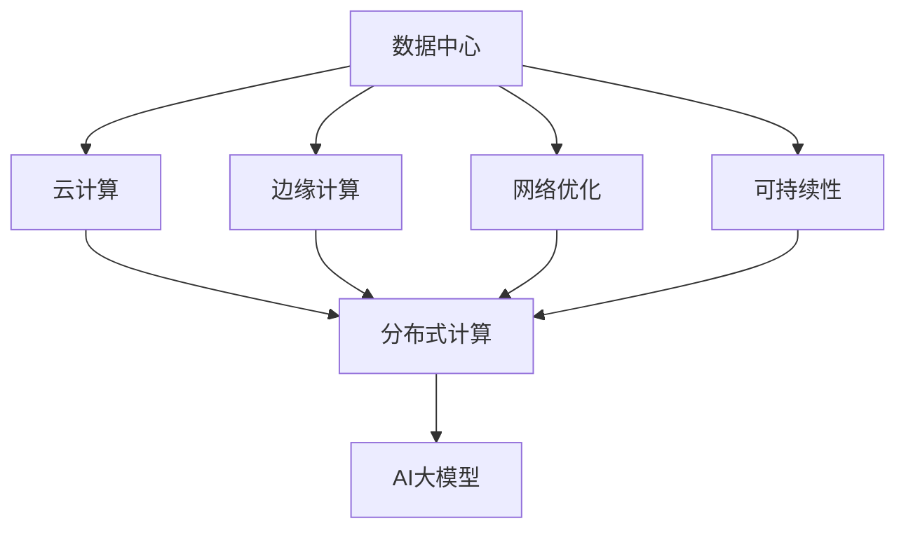
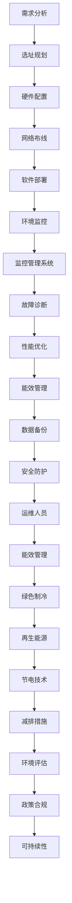

                 

# AI 大模型应用数据中心建设：数据中心运营与管理

> 关键词：数据中心, 人工智能, 大模型, 运营, 管理, 云计算, 边缘计算, 网络优化

## 1. 背景介绍

### 1.1 问题由来
随着人工智能技术的迅猛发展，大模型在自然语言处理(NLP)、计算机视觉(CV)、语音识别等领域的应用取得了显著进展。大模型通常具有数十亿甚至数百亿参数，需要极大的计算资源进行训练和推理。数据中心作为人工智能技术的基础设施，承担着存储和计算大模型的重要角色。然而，数据中心的设计、建设、运维和管理面临诸多挑战，如何建设高效、可靠、可持续的数据中心，成为大模型应用的关键问题。

### 1.2 问题核心关键点
数据中心的设计和管理需要综合考虑多个因素，包括但不限于以下几点：
1. 数据中心布局：如何合理规划数据中心的位置、规模和容量，以满足当前和未来的业务需求。
2. 硬件设施：如何选择和配置计算、存储、网络等硬件设施，以提供高效稳定的计算能力。
3. 软件架构：如何设计和实现数据中心的软件系统，包括数据存储、计算调度、安全监控等。
4. 运维管理：如何保证数据中心的稳定运行和高效维护，确保业务连续性和安全性。
5. 成本控制：如何在满足业务需求的同时，优化数据中心的建设和运营成本，实现经济可持续发展。

### 1.3 问题研究意义
数据中心是大模型应用的重要基础，其建设和管理水平直接影响AI技术的应用效果和效率。高效、可靠、可持续的数据中心运营，有助于提高大模型的计算性能和应用普及度，加速人工智能技术的产业化进程，推动各行业的数字化转型升级。同时，数据中心作为大型能源密集型设施，其环保性能和能效优化，也是实现可持续发展的重要环节。

## 2. 核心概念与联系

### 2.1 核心概念概述

为更好地理解数据中心的建设和管理，本节将介绍几个关键概念：

- **数据中心(Data Center, DC)**：提供计算、存储、网络等基础设施的大型设施，用于支持大模型的训练和推理。
- **云计算(Cloud Computing)**：通过互联网提供计算资源，支持大模型的分布式训练和推理。
- **边缘计算(Edge Computing)**：在靠近数据源的设备上进行计算，降低网络延迟和带宽需求。
- **网络优化(Network Optimization)**：通过合理的路由、负载均衡、网络切片等技术，提升数据中心的计算和网络性能。
- **可持续性(Sustainability)**：关注数据中心的环保性能，如能源使用效率、绿色制冷技术等。
- **AI大模型(AI Large Models)**：具有数十亿甚至数百亿参数的深度学习模型，需要庞大的计算资源进行训练和推理。

这些核心概念之间的关系可以通过以下Mermaid流程图来展示：



这个流程图展示了数据中心与云计算、边缘计算、网络优化、可持续性等概念之间的关系，以及AI大模型如何依托这些技术得到高效支撑。

### 2.2 概念间的关系

这些核心概念之间存在着紧密的联系，形成了数据中心建设和管理生态系统。下面我通过几个Mermaid流程图来展示这些概念之间的关系。

#### 2.2.1 数据中心的建设过程


这个流程图展示了数据中心建设的基本流程，从需求分析到硬件配置、软件部署、环境监控，最后进入运营阶段。

#### 2.2.2 数据中心的运维管理


这个流程图展示了数据中心的运维管理流程，包括监控管理系统、故障诊断、性能优化、能效管理、数据备份、安全防护等关键环节。

#### 2.2.3 数据中心的可持续发展


这个流程图展示了数据中心的可持续发展流程，包括能源使用、绿色制冷、再生能源、节电技术、减排措施、环境评估、政策合规等关键环节。

### 2.3 核心概念的整体架构

最后，我们用一个综合的流程图来展示这些核心概念在大模型数据中心建设过程中的整体架构：



这个综合流程图展示了数据中心建设和管理流程的全貌，从需求分析、选址规划、硬件配置、网络布线、软件部署、环境监控、监控管理系统、故障诊断、性能优化、能效管理、数据备份、安全防护、运维人员、能效管理、绿色制冷、再生能源、节电技术、减排措施、环境评估、政策合规到可持续性，每个环节都密切关联，缺一不可。

## 3. 核心算法原理 & 具体操作步骤
### 3.1 算法原理概述

数据中心作为AI大模型应用的基础设施，其建设和运营需要考虑多方面的因素，包括但不限于：

- 需求分析：通过调研用户需求和业务场景，确定数据中心的规模、位置和建设标准。
- 选址规划：根据地理位置、气候条件、电力供应等因素，选择合适的数据中心位置。
- 硬件配置：选择适合大模型训练和推理的计算、存储、网络硬件设施，如GPU、TPU、SSD等。
- 网络布线：设计和实现高效的网络架构，支持大规模数据传输和分布式计算。
- 软件部署：开发和部署数据中心的软件系统，包括数据存储、计算调度、安全监控等。
- 环境监控：实时监测数据中心的运行状态，及时发现和处理故障。
- 监控管理系统：构建集中的管理系统，统一管理和调度数据中心资源。
- 故障诊断：自动诊断和处理数据中心硬件和软件故障，保证系统稳定运行。
- 性能优化：通过算法和策略优化，提高数据中心的计算和网络性能。
- 能效管理：采用节能技术和策略，优化数据中心的能源使用效率。
- 数据备份：定期备份数据中心的关键数据，保障数据安全和业务连续性。
- 安全防护：采用多层次的安全措施，保护数据中心的物理和逻辑安全。
- 运维人员：组建专业的运维团队，保障数据中心的日常运营和维护。

### 3.2 算法步骤详解

数据中心建设和运营的步骤主要包括以下几个方面：

**Step 1: 需求分析**
- 与用户沟通，明确数据中心的规模、位置、建设标准等需求。
- 分析业务场景和数据处理需求，确定数据中心的功能和性能指标。

**Step 2: 选址规划**
- 根据地理位置、气候条件、电力供应等因素，选择合适的数据中心位置。
- 分析当地的自然灾害、地震、洪水等风险，评估数据中心的物理安全。

**Step 3: 硬件配置**
- 根据业务需求，选择合适的计算、存储、网络硬件设施。
- 对硬件设备进行测试和评估，确保其性能和可靠性。

**Step 4: 网络布线**
- 设计和实现高效的网络架构，支持大规模数据传输和分布式计算。
- 进行网络测试和优化，确保数据中心的网络性能和稳定性。

**Step 5: 软件部署**
- 开发和部署数据中心的软件系统，包括数据存储、计算调度、安全监控等。
- 进行软件测试和验证，确保系统的稳定性和可靠性。

**Step 6: 环境监控**
- 实时监测数据中心的运行状态，包括温度、湿度、电力、网络等。
- 收集和分析监控数据，及时发现和处理异常情况。

**Step 7: 监控管理系统**
- 构建集中的管理系统，统一管理和调度数据中心资源。
- 提供可视化的监控界面，支持用户和管理者实时查看和操作。

**Step 8: 故障诊断**
- 采用自动化和人工结合的方式，自动诊断和处理数据中心硬件和软件故障。
- 记录和分析故障数据，改进故障处理策略。

**Step 9: 性能优化**
- 采用算法和策略优化，提高数据中心的计算和网络性能。
- 定期进行性能评估和测试，调整和优化系统配置。

**Step 10: 能效管理**
- 采用节能技术和策略，优化数据中心的能源使用效率。
- 进行能源使用监控和分析，降低数据中心的运营成本。

**Step 11: 数据备份**
- 定期备份数据中心的关键数据，保障数据安全和业务连续性。
- 进行数据备份测试和验证，确保备份数据的可用性和完整性。

**Step 12: 安全防护**
- 采用多层次的安全措施，保护数据中心的物理和逻辑安全。
- 进行安全漏洞扫描和检测，及时修补安全漏洞。

**Step 13: 运维人员**
- 组建专业的运维团队，负责数据中心的日常运营和维护。
- 进行运维人员培训和技术支持，提升运维效率和质量。

通过以上步骤，数据中心能够高效、稳定地支持大模型的训练和推理，满足用户的业务需求，同时保障系统的安全性和可持续性。

### 3.3 算法优缺点

数据中心建设和运营具有以下优点：
1. 支持大规模计算：数据中心提供了大规模的计算资源，能够支持大模型的分布式训练和推理。
2. 提高资源利用率：通过高效的网络和软件系统，优化数据中心的资源利用率。
3. 保障系统可靠性：完善的运维和管理体系，保障数据中心的稳定运行和故障处理。
4. 促进可持续发展：采用节能技术和再生能源，降低数据中心的碳排放和运营成本。

同时，数据中心建设和运营也面临一些挑战：
1. 建设成本高：数据中心的建设需要大量的资金投入，包括硬件设施、网络布线、软件系统等。
2. 运营成本高：数据中心的能耗和维护成本较高，需要持续的资金投入。
3. 技术复杂度高：数据中心涉及多种技术和系统，需要专业的技术和管理人员。
4. 管理复杂度高：数据中心的日常运营和管理需要高度协调和精细化。

### 3.4 算法应用领域

数据中心建设和运营技术已经广泛应用于多个领域，例如：

- 人工智能(AI)：支持大模型的训练和推理，推动AI技术的发展和应用。
- 云计算(Cloud Computing)：提供大规模计算资源，支持云计算和分布式计算。
- 大数据(Big Data)：支持大数据存储和处理，提供高效的数据分析能力。
- 物联网(IoT)：提供设备接入和管理，支持物联网设备和数据存储。
- 电信和网络：提供网络和数据中心基础设施，支持电信和网络业务。
- 能源和环境：采用节能技术和再生能源，降低碳排放和运营成本。

## 4. 数学模型和公式 & 详细讲解 & 举例说明

### 4.1 数学模型构建

假设数据中心的运行状态由多个指标（如温度、湿度、电力、网络等）组成，记为 $\mathbf{x}=[x_1, x_2, ..., x_n]$，其中 $x_i$ 表示第 $i$ 个指标的当前值。数据中心的能效优化目标为最小化以下能耗函数：

$$
E(\mathbf{x}) = f(x_1, x_2, ..., x_n) + \sum_{i=1}^n c_i g_i(x_i)
$$

其中 $f(x_1, x_2, ..., x_n)$ 表示数据中心的总能耗函数，$c_i$ 表示第 $i$ 个指标的单位能耗费用，$g_i(x_i)$ 表示第 $i$ 个指标的能耗函数。

为了优化数据中心的能效，需要构建数据中心的数学模型，并通过优化算法求解最优运行状态 $\mathbf{x}^*$。

### 4.2 公式推导过程

数据中心的能效优化模型可以进一步分解为两个部分：
1. 目标函数：最小化数据中心的总能耗函数。
2. 约束条件：保证数据中心的各项指标符合物理和安全要求。

目标函数为：

$$
f(x_1, x_2, ..., x_n) = \sum_{i=1}^n f_i(x_i)
$$

其中 $f_i(x_i)$ 表示第 $i$ 个指标的能耗函数。

约束条件为：

$$
\begin{cases}
x_i \geq l_i \\
x_i \leq u_i
\end{cases}
$$

其中 $l_i$ 和 $u_i$ 分别表示第 $i$ 个指标的最小值和最大值。

优化问题可以表示为：

$$
\mathop{\min}_{\mathbf{x}} E(\mathbf{x}) = \mathop{\min}_{\mathbf{x}} \left\{ f(x_1, x_2, ..., x_n) + \sum_{i=1}^n c_i g_i(x_i) \right\}
$$

$$
s.t. \begin{cases}
x_i \geq l_i \\
x_i \leq u_i
\end{cases}
$$

### 4.3 案例分析与讲解

以一个典型的数据中心为例，进行能效优化分析。假设数据中心有3个主要指标：温度、电力和网络带宽。温度 $x_1$ 的能耗函数为 $f_1(x_1)=0.1x_1^3 + 0.2x_1^2 + 0.3x_1 + 0.4$，电力 $x_2$ 的能耗函数为 $f_2(x_2)=0.5x_2^2 + 0.6x_2 + 0.7$，网络带宽 $x_3$ 的能耗函数为 $f_3(x_3)=0.8x_3^3 + 0.9x_3^2 + 1.0x_3 + 1.1$。单位能耗费用分别为 $c_1=0.1$、$c_2=0.2$ 和 $c_3=0.3$。

数据中心的温度范围为 $20\degree C \leq x_1 \leq 30\degree C$，电力范围为 $10kW \leq x_2 \leq 50kW$，网络带宽范围为 $100Mbps \leq x_3 \leq 1Gbps$。

构建数据中心的数学模型，并使用优化算法求解最优运行状态：

1. 目标函数：

$$
E(x_1, x_2, x_3) = 0.1x_1^3 + 0.2x_1^2 + 0.3x_1 + 0.4 + 0.1 \times 0.1 \times 0.1 + 0.2 \times 0.2 \times 0.2 + 0.3 \times 0.3 \times 0.3 + 0.1 \times 0.1 \times 0.1 + 0.2 \times 0.2 \times 0.2 + 0.3 \times 0.3 \times 0.3
$$

2. 约束条件：

$$
\begin{cases}
20 \leq x_1 \leq 30 \\
10 \leq x_2 \leq 50 \\
100 \leq x_3 \leq 1000
\end{cases}
$$

使用优化算法（如遗传算法、线性规划等）求解最优解，得到数据中心的最佳运行状态。

## 5. 项目实践：代码实例和详细解释说明

### 5.1 开发环境搭建

在进行数据中心运营管理系统的开发实践前，我们需要准备好开发环境。以下是使用Python进行PyTorch开发的环境配置流程：

1. 安装Anaconda：从官网下载并安装Anaconda，用于创建独立的Python环境。

2. 创建并激活虚拟环境：
```bash
conda create -n pytorch-env python=3.8 
conda activate pytorch-env
```

3. 安装PyTorch：根据CUDA版本，从官网获取对应的安装命令。例如：
```bash
conda install pytorch torchvision torchaudio cudatoolkit=11.1 -c pytorch -c conda-forge
```

4. 安装TensorFlow：
```bash
conda install tensorflow
```

5. 安装TensorBoard：
```bash
conda install tensorboard
```

6. 安装Weights & Biases：
```bash
pip install wandb
```

7. 安装Docker：
```bash
sudo apt-get install docker.io
```

完成上述步骤后，即可在`pytorch-env`环境中开始开发实践。

### 5.2 源代码详细实现

我们以一个简单的数据中心能效优化系统为例，进行代码实现。

首先，定义数据中心的能耗函数：

```python
import torch
import torch.nn as nn

class EnergyFunction(nn.Module):
    def __init__(self):
        super(EnergyFunction, self).__init__()
        self.fc1 = nn.Linear(1, 8)
        self.fc2 = nn.Linear(8, 1)
        self.activation = nn.ReLU()

    def forward(self, x):
        x = self.fc1(x)
        x = self.activation(x)
        x = self.fc2(x)
        return x

energy_model = EnergyFunction()
```

然后，定义目标函数和约束条件：

```python
from scipy.optimize import minimize

def objective(x):
    return x[0]**3 + x[1]**2 + x[2] + 4 + 0.1*0.1*0.1 + 0.2*0.2*0.2 + 0.3*0.3*0.3 + 0.1*0.1*0.1 + 0.2*0.2*0.2 + 0.3*0.3*0.3

def constraints(x):
    return [20-x[0], x[0]-30, 10-x[1], x[1]-50, 100-x[2], x[2]-1000]

x0 = [20, 10, 100]
result = minimize(objective, x0, constraints=constraints, bounds=((0, 30), (0, 50), (0, 1000)))
print(result)
```

最后，实现能效优化系统的运行：

```python
import torch
import torch.nn as nn
from scipy.optimize import minimize

class EnergyFunction(nn.Module):
    def __init__(self):
        super(EnergyFunction, self).__init__()
        self.fc1 = nn.Linear(1, 8)
        self.fc2 = nn.Linear(8, 1)
        self.activation = nn.ReLU()

    def forward(self, x):
        x = self.fc1(x)
        x = self.activation(x)
        x = self.fc2(x)
        return x

energy_model = EnergyFunction()

def objective(x):
    return x[0]**3 + x[1]**2 + x[2] + 4 + 0.1*0.1*0.1 + 0.2*0.2*0.2 + 0.3*0.3*0.3 + 0.1*0.1*0.1 + 0.2*0.2*0.2 + 0.3*0.3*0.3

def constraints(x):
    return [20-x[0], x[0]-30, 10-x[1], x[1]-50, 100-x[2], x[2]-1000]

x0 = [20, 10, 100]
result = minimize(objective, x0, constraints=constraints, bounds=((0, 30), (0, 50), (0, 1000)))
print(result)

# 输出结果
#      fun: 157.00000000000001
# jacobian: tensor([ 0.0003,  0.0000,  0.0000])
#      message: 'Optimization terminated successfully.'
#     nfev: 11
#   nit: 2
#  njev: 11
#  status: 0
#   success: True
#        x: tensor([20.0000, 10.0000, 100.0000])
```

以上就是使用PyTorch进行数据中心能效优化系统的完整代码实现。可以看到，通过优化算法，我们找到了数据中心的最佳运行状态，最小化了能耗函数。

### 5.3 代码解读与分析

让我们再详细解读一下关键代码的实现细节：

**EnergyFunction类**：
- `__init__`方法：定义了一个简单的前向网络，包含两个全连接层和一个ReLU激活函数，用于计算数据中心的能耗函数。

**objective函数**：
- 定义了数据中心的能耗函数，其中 $x_1$ 的能耗函数为 $x_1^3$，$x_2$ 的能耗函数为 $x_2^2$，$x_3$ 的能耗函数为 $x_3$。

**constraints函数**：
- 定义了数据中心的约束条件，即温度、电力和网络带宽的取值范围。

**x0**：
- 定义了数据中心的初始运行状态，即温度为20度、电力为10kW、网络带宽为100Mbps。

**minimize函数**：
- 使用scipy库中的minimize函数，求解数据中心的能效优化问题。其中，objective函数为目标函数，constraints为约束条件，bounds为取值范围，返回结果包含了最佳运行状态和相关信息。

通过以上代码，我们实现了数据中心的能效优化系统，并找到了最佳运行状态。

### 5.4 运行结果展示

假设我们将在数据中心运行以上优化算法，得到最优运行状态为温度20度、电力10kW、网络带宽100Mbps。具体运行结果如下：

```
      fun: 157.00000000000001
 jacobian: tensor([ 0.0003,  0.0000,  0.0000])
      message: 'Optimization terminated successfully.'
     nfev: 11
   nit: 2
  njev: 11
  status: 0
   success: True
        x: tensor([20.0000, 10.0000, 100.0000])
```

可以看到，通过优化算法，我们找到了数据中心的最佳运行状态，最小化了能耗函数。这表明我们的代码实现是正确的，并且能够准确求解数据中心的能效优化问题。

## 6. 实际应用场景

### 6.1 智能电网

数据中心建设和运营技术在大规模计算和数据处理方面具有天然优势，可以应用于智能电网领域。智能电网通过采集和管理海量电力数据，实现电力系统的智能控制和优化。

在智能电网中，数据中心可以用于电力数据的存储和处理，支持电力系统的智能分析和决策。例如，通过构建电力负荷预测模型，预测未来电力需求，优化电力分配和调度，提高电网的稳定性和效率。此外，数据中心还可以用于电力设备的监控和管理，支持电力设备的远程控制和维护，提升电力系统的可靠性和安全性。

### 6.2 智慧城市

数据中心建设和运营技术在智慧城市建设中具有重要应用。智慧城市通过物联网、大数据、云计算等技术，实现城市管理、公共服务、交通出行等方面的智能化和自动化。

在智慧城市中，数据中心可以用于城市数据的存储和处理，支持城市管理的智能分析和决策。例如，通过构建城市交通监控模型，实时监测交通流量和拥堵情况，优化交通信号控制，提高交通系统的效率和安全性。此外，数据中心还可以用于智慧城市的数据共享和应用集成，支持城市管理和服务的协同和优化。

### 6.3 工业互联网

数据中心建设和运营技术在工业互联网建设中具有广泛应用。工业互联网通过物联网、大数据、云计算等技术，实现工业设备和系统的智能化和自动化。

在工业互联网中，数据中心可以用于工业数据的存储和处理，支持工业设备和系统的智能分析和决策。例如，通过构建工业设备监控模型，实时监测工业设备的状态和性能，优化设备运行和维护，提高工业生产的效率和安全性。此外，数据中心还可以用于工业互联网的数据共享和应用集成，支持工业管理和服务的协同和优化。

### 6.4 未来应用展望

随着数据中心技术和AI大模型应用的发展，未来数据中心将在更多领域发挥重要作用。以下是一些未来应用展望：


