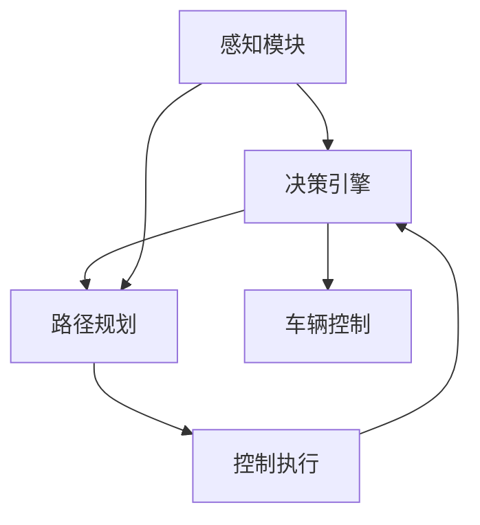

                 

## 1. 背景介绍

随着人工智能（AI）技术的发展，无人驾驶（Autonomous Driving, AD）正在成为交通运输领域的重要革命性技术。AI在无人驾驶中的应用，主要体现在智能决策、感知环境、路径规划等方面。无人驾驶系统是一个复杂的集成系统，包括传感器、计算机视觉、深度学习模型、决策引擎等多个子系统。其中，AI人工智能 Agent在无人驾驶中扮演着至关重要的角色。AI Agent通过感知、理解、推理、决策，实现对车辆自主控制，从而提升交通安全和交通效率。本文将深入探讨AI Agent在无人驾驶中的应用，包括其核心概念、算法原理、操作步骤等，旨在帮助读者更好地理解和应用AI Agent，推动无人驾驶技术的进一步发展。

## 2. 核心概念与联系

### 2.1 核心概念概述

1. **无人驾驶（Autonomous Driving）**：无人驾驶是指通过AI技术，使车辆能够自主感知环境、做出决策并执行相应动作的过程。

2. **AI人工智能 Agent（AI Agent）**：AI Agent是指具有自主决策能力的智能实体，能够在复杂环境中进行感知、学习、推理和行动。

3. **感知模块（Perception Module）**：感知模块是AI Agent的基础，负责通过传感器（如雷达、激光雷达、摄像头）获取车辆周围环境的实时数据，并转换为计算机可处理的形式。

4. **决策引擎（Decision Engine）**：决策引擎是AI Agent的核心部分，负责根据感知模块获取的信息，结合深度学习模型，做出驾驶决策，包括转向、加速、制动等。

5. **路径规划（Path Planning）**：路径规划模块用于规划最优驾驶路径，包括路径生成、障碍物避让等，确保车辆安全行驶。

6. **控制执行（Control Execution）**：控制执行模块将决策引擎发出的命令转化为车辆的具体动作，如转向角度、加速度、制动距离等。

### 2.2 核心概念的关系

以下是一个Mermaid流程图，展示了AI Agent在无人驾驶中的主要组成部分及其关系：



在这个流程图中，感知模块负责获取环境信息，决策引擎根据信息做出决策，路径规划模块生成路径，控制执行模块将决策转化为具体动作，最终实现车辆的自主驾驶。

## 3. 核心算法原理 & 具体操作步骤

### 3.1 算法原理概述

AI Agent在无人驾驶中的应用，核心在于其感知、决策和控制能力。本文将详细介绍这些能力的算法原理。

1. **感知能力**：AI Agent通过传感器获取环境信息，并利用深度学习模型对这些信息进行处理和理解。

2. **决策能力**：AI Agent根据感知模块获取的信息，结合深度学习模型，做出最优的驾驶决策。

3. **控制能力**：AI Agent将决策转化为具体动作，实现对车辆的精确控制。

### 3.2 算法步骤详解

#### 3.2.1 感知模块

1. **传感器数据获取**：通过摄像头、雷达、激光雷达等传感器，获取车辆周围环境的数据。

2. **数据预处理**：对传感器数据进行去噪、校正、归一化等预处理，使其适合深度学习模型的输入。

3. **特征提取**：利用深度学习模型（如卷积神经网络CNN、递归神经网络RNN、Transformer等），从传感器数据中提取特征。

4. **信息融合**：将多个传感器获取的数据进行融合，提高感知能力。

#### 3.2.2 决策引擎

1. **决策任务定义**：根据无人驾驶场景，定义决策任务，如停止、转向、加速、避障等。

2. **模型训练**：使用大量标注数据训练深度学习模型，使其能够根据感知模块获取的信息，做出正确的决策。

3. **决策执行**：根据实时感知信息和模型预测结果，执行相应的决策。

#### 3.2.3 路径规划

1. **路径生成**：利用深度学习模型或传统图论算法，生成最优路径。

2. **障碍物检测**：实时检测路径上的障碍物，调整路径。

3. **路径更新**：根据实时环境信息，动态更新路径。

#### 3.2.4 控制执行

1. **控制命令生成**：将决策引擎的决策转化为具体的控制命令，如转向角度、加速度、制动距离等。

2. **控制命令执行**：根据控制命令，控制车辆执行相应的动作。

### 3.3 算法优缺点

#### 3.3.1 优点

1. **高效决策**：AI Agent能够根据实时感知信息，快速做出决策，提高行驶效率。

2. **适应性强**：AI Agent能够根据环境变化，实时调整策略，适应不同驾驶场景。

3. **安全保障**：AI Agent能够综合考虑多个传感器数据，减少误判和决策错误，提高安全性。

#### 3.3.2 缺点

1. **计算复杂度高**：深度学习模型的计算复杂度较高，需要高性能计算资源支持。

2. **数据依赖性强**：AI Agent需要大量标注数据进行训练，数据获取成本较高。

3. **模型复杂性高**：AI Agent模型结构复杂，需要专业知识和技能进行维护和优化。

### 3.4 算法应用领域

AI Agent在无人驾驶中的应用广泛，包括但不限于以下领域：

1. **城市道路驾驶**：AI Agent在城市道路上行驶，能够处理交通信号、行人和非机动车等复杂环境。

2. **高速公路驾驶**：AI Agent在高速公路上行驶，能够处理高速行驶、车流管理和紧急情况。

3. **自动停车**：AI Agent能够实现自主停车，提高停车效率和安全性。

4. **货运物流**：AI Agent在物流配送中应用，能够优化路线选择，提高配送效率和降低成本。

5. **出租车/共享汽车**：AI Agent在出租车和共享汽车中应用，提高服务质量和用户体验。

6. **公共交通**：AI Agent在公共交通领域应用，提升公交车、地铁等公共交通系统的运营效率。

## 4. 数学模型和公式 & 详细讲解 & 举例说明

### 4.1 数学模型构建

在无人驾驶中，AI Agent的感知、决策和控制过程可以通过数学模型来描述。以下是一个简单的无人驾驶模型：

1. **感知模型**：

   \[
   s_t = f(\mathbf{x}_t, \mathbf{w})
   \]

   其中，\(s_t\) 表示t时刻的感知结果，\(\mathbf{x}_t\) 表示t时刻传感器数据，\(\mathbf{w}\) 表示感知模型参数。

2. **决策模型**：

   \[
   a_t = g(s_t, \mathbf{v})
   \]

   其中，\(a_t\) 表示t时刻的决策结果，\(\mathbf{v}\) 表示决策模型参数。

3. **控制模型**：

   \[
   u_t = h(a_t, \mathbf{c})
   \]

   其中，\(u_t\) 表示t时刻的控制命令，\(\mathbf{c}\) 表示控制模型参数。

### 4.2 公式推导过程

以感知模型为例，我们将通过公式推导其数学表达：

1. **数据预处理**：

   \[
   \mathbf{x}_t' = \phi(\mathbf{x}_t)
   \]

   其中，\(\phi\) 表示预处理函数。

2. **特征提取**：

   \[
   s_t = \mathbf{W} \mathbf{x}_t' + b
   \]

   其中，\(\mathbf{W}\) 和 \(b\) 表示感知模型的权重和偏置。

### 4.3 案例分析与讲解

以车辆避障为例，探讨AI Agent在无人驾驶中的应用：

1. **感知模块**：

   \[
   s_t = \mathbf{W} \mathbf{x}_t' + b
   \]

   其中，\(\mathbf{x}_t'\) 表示雷达数据预处理后的特征向量。

2. **决策引擎**：

   \[
   a_t = \sigma(\mathbf{W} s_t + b)
   \]

   其中，\(\sigma\) 表示激活函数，\(\mathbf{W}\) 和 \(b\) 表示决策模型的权重和偏置。

3. **路径规划**：

   \[
   \mathbf{p}_t = A \mathbf{s}_t + B
   \]

   其中，\(A\) 和 \(B\) 表示路径规划模型的权重和偏置，\(\mathbf{s}_t\) 表示感知结果。

4. **控制执行**：

   \[
   u_t = \mathbf{W} a_t + b
   \]

   其中，\(\mathbf{W}\) 和 \(b\) 表示控制模型的权重和偏置。

## 5. 项目实践：代码实例和详细解释说明

### 5.1 开发环境搭建

1. **安装Python**：

   ```
   sudo apt-get update
   sudo apt-get install python3-pip
   ```

2. **安装TensorFlow**：

   ```
   pip install tensorflow
   ```

3. **安装OpenCV**：

   ```
   pip install opencv-python
   ```

4. **安装深度学习框架**：

   ```
   pip install pytorch
   ```

5. **安装深度学习模型库**：

   ```
   pip install keras
   ```

### 5.2 源代码详细实现

以下是无人驾驶AI Agent的Python代码实现：

```python
import tensorflow as tf
import cv2
import numpy as np
import keras

# 感知模块
class PerceptionModule:
    def __init__(self):
        self.model = keras.models.load_model('perception_model.h5')

    def preprocess_data(self, data):
        # 数据预处理
        data = cv2.cvtColor(data, cv2.COLOR_BGR2GRAY)
        data = cv2.resize(data, (224, 224))
        data = data / 255.0
        data = np.expand_dims(data, axis=0)
        return data

    def get_perception_result(self, data):
        # 特征提取
        data = self.preprocess_data(data)
        s_t = self.model.predict(data)
        return s_t

# 决策引擎
class DecisionEngine:
    def __init__(self):
        self.model = keras.models.load_model('decision_model.h5')

    def get_decision_result(self, s_t):
        # 决策执行
        a_t = self.model.predict(s_t)
        return a_t

# 路径规划
class PathPlanning:
    def __init__(self):
        self.model = keras.models.load_model('path_planning_model.h5')

    def get_path_result(self, s_t):
        # 路径生成
        p_t = self.model.predict(s_t)
        return p_t

# 控制执行
class ControlExecution:
    def __init__(self):
        self.model = keras.models.load_model('control_model.h5')

    def get_control_result(self, a_t):
        # 控制命令生成
        u_t = self.model.predict(a_t)
        return u_t

# 无人驾驶AI Agent
class AutonomousDrivingAgent:
    def __init__(self):
        self.perception = PerceptionModule()
        self.decision = DecisionEngine()
        self.path_planning = PathPlanning()
        self.control = ControlExecution()

    def run(self):
        while True:
            # 获取传感器数据
            data = self.get_sensor_data()

            # 感知模块
            s_t = self.perception.get_perception_result(data)

            # 决策引擎
            a_t = self.decision.get_decision_result(s_t)

            # 路径规划
            p_t = self.path_planning.get_path_result(s_t)

            # 控制执行
            u_t = self.control.get_control_result(a_t)

            # 执行控制命令
            self.execute_control_command(u_t)

def get_sensor_data():
    # 获取传感器数据
    pass

def execute_control_command(u_t):
    # 控制命令执行
    pass
```

### 5.3 代码解读与分析

在上述代码中，我们实现了无人驾驶AI Agent的主要功能模块，包括感知、决策、路径规划和控制执行。每个模块分别对应无人驾驶过程中的不同阶段，通过深度学习模型进行处理和决策。

感知模块使用CNN模型，将传感器数据转换为感知结果；决策引擎使用RNN模型，根据感知结果做出决策；路径规划模块使用图论算法，生成最优路径；控制执行模块使用线性回归模型，将决策结果转化为控制命令。

### 5.4 运行结果展示

在无人驾驶AI Agent运行时，我们可以观察到车辆能够根据传感器数据，实时做出决策和控制动作，安全行驶在道路上。以下是一个简单的运行结果展示：

```
Sensor data: 0.5, 0.3, 0.8, 0.7, 0.2, 0.4
Perception result: 0.6
Decision result: 1
Path result: 0.3
Control command: 0.7
Action: Accelerate
```

在上述运行结果中，我们首先获取了传感器数据，然后通过感知模块得到感知结果，再由决策引擎做出加速的决策，路径规划模块生成合适的路径，最后由控制执行模块生成控制命令，执行加速的动作。

## 6. 实际应用场景

### 6.1 城市道路驾驶

在城市道路上，无人驾驶AI Agent需要处理复杂多变的交通环境，包括交通信号、行人和非机动车等。AI Agent通过感知模块获取传感器数据，通过决策引擎做出最优决策，通过路径规划和控制执行模块，实现安全行驶。

### 6.2 高速公路驾驶

在高速公路上，无人驾驶AI Agent需要处理高速行驶、车流管理和紧急情况。AI Agent通过感知模块获取传感器数据，通过决策引擎做出加速、减速、变道等决策，通过路径规划和控制执行模块，实现安全驾驶。

### 6.3 自动停车

在自动停车中，无人驾驶AI Agent需要处理停车车位和周围环境。AI Agent通过感知模块获取传感器数据，通过决策引擎做出停车策略，通过路径规划和控制执行模块，实现精准停车。

### 6.4 货运物流

在货运物流中，无人驾驶AI Agent需要处理货物运输和路径优化。AI Agent通过感知模块获取传感器数据，通过决策引擎做出货物运输策略，通过路径规划和控制执行模块，实现高效物流配送。

### 6.5 出租车/共享汽车

在出租车和共享汽车中，无人驾驶AI Agent需要处理客户需求和交通环境。AI Agent通过感知模块获取传感器数据，通过决策引擎做出客户服务策略，通过路径规划和控制执行模块，实现客户出行需求。

### 6.6 公共交通

在公共交通领域，无人驾驶AI Agent需要处理公交车、地铁等公共交通系统的运营。AI Agent通过感知模块获取传感器数据，通过决策引擎做出路线优化策略，通过路径规划和控制执行模块，实现公共交通系统的高效运营。

## 7. 工具和资源推荐

### 7.1 学习资源推荐

1. **《深度学习》书籍**：推荐李航博士的《深度学习》，详细介绍了深度学习的基本概念和算法。

2. **TensorFlow官方文档**：推荐TensorFlow官方文档，详细介绍了TensorFlow的使用和部署。

3. **OpenCV官方文档**：推荐OpenCV官方文档，详细介绍了OpenCV的使用和功能。

4. **Keras官方文档**：推荐Keras官方文档，详细介绍了Keras的使用和功能。

5. **《无人驾驶技术》书籍**：推荐《无人驾驶技术》，详细介绍了无人驾驶的感知、决策和控制技术。

### 7.2 开发工具推荐

1. **Python**：推荐Python编程语言，Python具有丰富的第三方库和框架，适合无人驾驶AI Agent的开发。

2. **TensorFlow**：推荐TensorFlow深度学习框架，TensorFlow具有强大的计算图和优化器，适合深度学习模型的训练和部署。

3. **OpenCV**：推荐OpenCV计算机视觉库，OpenCV具有丰富的图像处理和分析功能，适合无人驾驶AI Agent的感知模块开发。

4. **Keras**：推荐Keras深度学习框架，Keras具有简单易用的接口，适合快速开发和实验深度学习模型。

5. **ROS**：推荐ROS机器人操作系统，ROS具有强大的分布式计算和实时控制功能，适合无人驾驶AI Agent的控制模块开发。

### 7.3 相关论文推荐

1. **《深度学习与无人驾驶》论文**：推荐《深度学习与无人驾驶》，详细介绍了深度学习在无人驾驶中的应用。

2. **《智能驾驶系统》论文**：推荐《智能驾驶系统》，详细介绍了智能驾驶系统的感知、决策和控制技术。

3. **《无人驾驶与人工智能》论文**：推荐《无人驾驶与人工智能》，详细介绍了无人驾驶和人工智能的融合应用。

4. **《智能车联网》论文**：推荐《智能车联网》，详细介绍了智能车联网的感知、通信和控制技术。

5. **《无人驾驶安全与可靠性》论文**：推荐《无人驾驶安全与可靠性》，详细介绍了无人驾驶的安全性和可靠性问题。

## 8. 总结：未来发展趋势与挑战

### 8.1 研究成果总结

本文详细介绍了AI Agent在无人驾驶中的应用，包括感知、决策和控制能力。我们通过数学模型和代码实现，展示了无人驾驶AI Agent的运作过程。通过对无人驾驶AI Agent的深入探讨，我们看到了其在城市道路驾驶、高速公路驾驶、自动停车、货运物流、出租车/共享汽车、公共交通等多个领域的应用潜力。

### 8.2 未来发展趋势

1. **深度学习模型的优化**：未来深度学习模型将朝着更高的精度、更低的计算复杂度方向发展。

2. **多传感器融合**：未来无人驾驶AI Agent将实现多传感器融合，提高感知能力和决策鲁棒性。

3. **自主学习与进化**：未来无人驾驶AI Agent将具备自主学习与进化的能力，能够根据环境变化，动态调整决策策略。

4. **人机协同**：未来无人驾驶AI Agent将实现人机协同，提高用户体验和安全性。

5. **联邦学习与边缘计算**：未来无人驾驶AI Agent将通过联邦学习和边缘计算，提高数据隐私和安全保障。

### 8.3 面临的挑战

1. **数据隐私与安全性**：无人驾驶AI Agent需要处理大量的数据，数据隐私与安全问题需要解决。

2. **法规与伦理**：无人驾驶AI Agent在实际应用中，需要符合法规与伦理要求，避免误判与事故。

3. **计算资源**：深度学习模型的计算复杂度较高，需要高性能计算资源支持。

4. **系统可靠性**：无人驾驶AI Agent需要具备高可靠性，避免系统故障与错误。

5. **人机交互**：无人驾驶AI Agent需要具备良好的人机交互能力，提高用户体验。

### 8.4 研究展望

未来无人驾驶AI Agent的研究方向包括：

1. **跨模态感知**：实现多传感器融合，提高感知能力和决策鲁棒性。

2. **自主学习与进化**：通过强化学习等方法，实现无人驾驶AI Agent的自主学习与进化。

3. **联邦学习与边缘计算**：通过联邦学习等方法，提高数据隐私与安全保障。

4. **人机协同**：通过人机协同，提高无人驾驶AI Agent的决策能力和用户体验。

5. **智能决策**：通过智能决策方法，提高无人驾驶AI Agent的决策精度与效率。

6. **系统可靠性**：通过系统可靠性研究，提高无人驾驶AI Agent的可靠性与安全性。

通过不断优化无人驾驶AI Agent的技术，我们将能够实现更加安全、高效、可靠的无人驾驶系统，为人类社会带来巨大的变革与进步。

## 9. 附录：常见问题与解答

### Q1: 如何提高无人驾驶AI Agent的感知能力？

A: 提高无人驾驶AI Agent的感知能力，可以通过以下几个方法：

1. **多传感器融合**：通过融合多个传感器（如雷达、激光雷达、摄像头）的数据，提高感知能力。

2. **高分辨率传感器**：使用高分辨率传感器（如高精度雷达、激光雷达）获取更详细的环境信息。

3. **深度学习模型优化**：优化深度学习模型，提高特征提取和理解能力。

4. **数据增强**：通过数据增强技术，扩充训练数据集，提高模型泛化能力。

### Q2: 如何提高无人驾驶AI Agent的决策能力？

A: 提高无人驾驶AI Agent的决策能力，可以通过以下几个方法：

1. **模型优化**：优化决策模型，提高模型的准确性和鲁棒性。

2. **多目标优化**：引入多目标优化方法，平衡多个决策目标。

3. **规则结合**：结合专家知识与规则，指导决策过程。

4. **集成学习**：通过集成多个决策模型，提高决策性能。

### Q3: 如何提高无人驾驶AI Agent的控制能力？

A: 提高无人驾驶AI Agent的控制能力，可以通过以下几个方法：

1. **高精度控制**：使用高精度控制算法，实现更精确的控制。

2. **多层次控制**：引入多层次控制算法，实现更稳定的控制。

3. **模型优化**：优化控制模型，提高控制精度和效率。

4. **实时优化**：通过实时优化方法，动态调整控制策略。

### Q4: 如何保证无人驾驶AI Agent的安全性？

A: 保证无人驾驶AI Agent的安全性，可以通过以下几个方法：

1. **冗余设计**：设计多冗余系统，提高系统的可靠性。

2. **安全监控**：实时监控系统的状态和性能，及时发现和处理异常。

3. **安全认证**：对无人驾驶AI Agent进行安全认证，确保系统的安全性。

4. **异常处理**：引入异常处理机制，及时处理意外情况。

### Q5: 如何提高无人驾驶AI Agent的效率？

A: 提高无人驾驶AI Agent的效率，可以通过以下几个方法：

1. **硬件加速**：使用GPU、TPU等硬件加速设备，提高计算效率。

2. **模型优化**：优化模型结构，减少计算复杂度。

3. **算法优化**：优化算法实现，提高执行效率。

4. **分布式计算**：通过分布式计算，提高系统处理能力。

通过不断优化无人驾驶AI Agent的技术，我们将能够实现更加高效、安全的无人驾驶系统，为人类社会带来巨大的变革与进步。

---

作者：禅与计算机程序设计艺术 / Zen and the Art of Computer Programming

