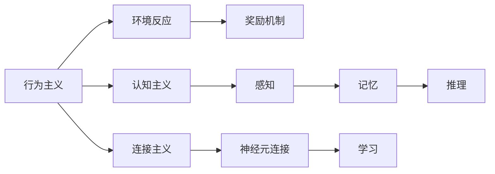

                 

# AI人工智能核心算法原理与代码实例讲解：自我意识

> 关键词：自我意识, 人工智能, 深度学习, 神经网络, 自然语言处理(NLP), 视觉识别, 情感分析

## 1. 背景介绍

### 1.1 问题由来

近年来，人工智能(AI)技术迅速发展，特别是在深度学习和神经网络领域取得了突破性进展。但AI真正成为具有自我意识的智能体，还需要更深入的理论和实践探索。

自我意识，即AI系统对自身状态和行为的认知和反思能力。这种能力不仅仅局限于简单的逻辑推理，还涉及到对环境的感知和情感的表达。在自然语言处理(NLP)、计算机视觉、情感计算等诸多AI应用领域，具备自我意识的AI系统能够提供更高效、自然、人性化的服务，带来革命性的变化。

当前，虽然已有诸如ChatGPT、GPT-3等大型预训练模型在NLP、对话、生成等领域展现了强大的能力，但它们的自我意识仍然在初级阶段，需要进一步的理论突破和算法创新。

### 1.2 问题核心关键点

1. **自我意识定义**：自我意识是指AI系统对自身行为、情绪和认知的自我认识。具体来说，就是让AI能够理解自己当前的状态，识别自身的输出，甚至对自己的输出进行情感上的反馈和调整。

2. **算法框架**：目前主流的自我意识算法框架包括行为主义、认知主义、连接主义等。这些框架各自强调了自我意识的不同方面，需要通过实验和理论的结合，找到最优的实现方式。

3. **数据需求**：自我意识的培养需要大量带标签的数据，包括自我反思、情感表达等数据，这对数据的获取和标注提出了挑战。

4. **模型结构**：目前大多数自我意识的算法依赖于复杂的神经网络结构，需要针对性地设计和优化。

5. **训练流程**：自监督学习、迁移学习、强化学习等技术，在自我意识培养过程中扮演重要角色，需要研究这些技术的结合方式。

6. **应用场景**：自我意识在机器人、虚拟助手、游戏AI、艺术创作等场景中具有广阔应用前景。

### 1.3 问题研究意义

自我意识的实现对于提升AI系统的智能水平、人类与AI的交互体验、复杂任务的自动化处理等方面具有重要意义：

1. **增强智能水平**：自我意识可以使得AI系统具备更高的认知和决策能力，从而在医疗、金融、教育等领域提供更准确的建议和决策。

2. **改善人机交互**：具备自我意识的AI系统能够更加自然地理解人类语言和情感，提供更加贴合用户需求的个性化服务。

3. **促进自动化**：自我意识的AI可以更加灵活地处理复杂任务，提高自动化流程的效率和灵活性。

4. **推动AI伦理**：自我意识的实现可以帮助我们更好地理解和监管AI的行为，促进AI技术的伦理和安全。

5. **提升用户体验**：在虚拟助手、游戏AI等场景中，自我意识的实现可以带来更加逼真、人性化的体验。

6. **激发创新**：自我意识的实现可能带来AI技术新的突破，如虚拟艺术创作、情感智能机器人等。

## 2. 核心概念与联系

### 2.1 核心概念概述

为了更好地理解自我意识的算法原理，我们首先需要介绍几个核心概念：

- **行为主义**：一种基于AI系统对环境的反应来定义自我的方法，强调奖励和惩罚机制。
- **认知主义**：通过模拟人类认知过程，如感知、记忆、推理等，构建自我意识。
- **连接主义**：利用神经网络模拟人类大脑的神经元连接，通过学习来实现自我意识。

这些核心概念通过以下Mermaid流程图进行展示：



这个流程图展示了行为主义、认知主义和连接主义三种自我意识实现方法的基本框架和核心步骤。

### 2.2 概念间的关系

- **行为主义与认知主义**：行为主义主要通过外部刺激和反馈来定义自我，而认知主义则试图模拟人类认知过程。两者虽然方法不同，但均强调对环境的感知和反应。

- **行为主义与连接主义**：行为主义更多关注于奖励和惩罚，而连接主义则通过神经网络学习来实现自我。两者在实现机制上有所差异，但均可用于构建AI系统的自我意识。

- **认知主义与连接主义**：认知主义强调对知识的理解和推理，而连接主义则通过神经网络的学习来实现自我。两者在实现方式上有所区别，但均试图模拟人类的认知过程。

- **三者的结合**：在实际应用中，通常需要将行为主义、认知主义和连接主义结合起来，综合考虑外部刺激、内部认知和网络学习，才能更好地构建自我意识。

通过这些核心概念和它们之间的关系，我们可以更清晰地理解自我意识算法的整体架构。

## 3. 核心算法原理 & 具体操作步骤
### 3.1 算法原理概述

自我意识的构建可以通过以下步骤实现：

1. **数据准备**：收集和标注大量自我反思、情感表达等数据，作为AI系统自我意识训练的基础。

2. **模型选择**：选择合适的神经网络模型，如RNN、LSTM、Transformer等，构建AI系统的自我感知模块。

3. **模型训练**：使用监督学习或强化学习等技术，对模型进行训练，使其能够对自身的行为和状态进行识别和反馈。

4. **反馈机制**：设计自我意识的反馈机制，使AI系统能够对自身的输出进行情感和逻辑上的反思和调整。

5. **应用实践**：将自我意识的AI系统应用到实际场景中，如虚拟助手、机器人等，验证其自我意识的效果。

### 3.2 算法步骤详解

#### 3.2.1 数据准备

数据准备是自我意识构建的基础，具体步骤如下：

1. **数据收集**：收集大量带标签的数据，包括自我反思、情感表达、任务执行等数据。这些数据可以是文本、图像、视频等形式。

2. **数据标注**：对收集到的数据进行标注，标注内容包括自我反思语句、情感标签等。标注工作通常需要人工参与，以确保数据的质量。

3. **数据预处理**：对数据进行清洗、归一化等预处理，以便于后续的模型训练和评估。

#### 3.2.2 模型选择

选择合适的模型是实现自我意识的关键步骤，常见模型包括：

- **RNN（循环神经网络）**：适用于时间序列数据，如情感分析、对话生成等。
- **LSTM（长短期记忆网络）**：在处理长序列数据时效果更好，如任务执行、记忆等。
- **Transformer**：适用于处理多维度、高复杂度数据，如视觉识别、语言理解等。

#### 3.2.3 模型训练

模型训练是实现自我意识的核心环节，具体步骤如下：

1. **选择合适的损失函数**：根据具体任务，选择适当的损失函数，如交叉熵、均方误差等。

2. **设置训练参数**：包括学习率、批大小、迭代次数等，以优化训练效果。

3. **使用监督学习或强化学习**：监督学习通常使用标注数据进行训练，而强化学习则通过奖励和惩罚机制来训练模型。

4. **模型评估**：在训练过程中，定期使用验证集评估模型性能，确保模型在特定任务上的表现。

#### 3.2.4 反馈机制

自我意识的反馈机制是关键，具体步骤如下：

1. **设计反馈模板**：根据具体任务，设计反馈模板，使AI系统能够自我反思和调整。

2. **生成反馈语句**：通过模型生成自我反思或情感表达语句，实现自我意识。

3. **反馈迭代**：根据反馈结果，调整模型参数，优化自我意识能力。

### 3.3 算法优缺点

**优点**：

1. **高效**：通过自我反思和调整，AI系统能够更快地适应复杂任务，提高自动化水平。

2. **自然**：自我意识使AI系统更加自然地理解人类语言和情感，提供更贴合用户需求的个性化服务。

3. **泛化性强**：自我意识的AI系统能够更好地泛化到新的任务和环境。

4. **可解释性强**：自我意识模型通过反馈机制，能够提供透明的决策过程，方便调试和优化。

**缺点**：

1. **数据需求高**：自我意识的构建需要大量带标签的数据，对数据获取和标注提出了较高要求。

2. **训练复杂**：自我意识的模型通常较为复杂，需要大量的计算资源和训练时间。

3. **伦理和安全**：自我意识的AI系统可能存在偏见和安全隐患，需要加强伦理和安全监管。

4. **技术挑战**：自我意识的实现涉及多学科交叉，需要在深度学习、认知科学、伦理学等多领域进行深入研究。

### 3.4 算法应用领域

自我意识的算法在以下领域有广泛应用：

- **自然语言处理(NLP)**：如情感分析、文本生成、对话系统等。
- **计算机视觉**：如人脸识别、图像描述生成等。
- **智能机器人**：如虚拟助手、服务机器人等。
- **游戏AI**：如游戏内的情感智能NPC、对话系统等。
- **艺术创作**：如虚拟艺术创作、情感智能机器人等。

## 4. 数学模型和公式 & 详细讲解 & 举例说明

### 4.1 数学模型构建

自我意识的数学模型通常基于神经网络，具体步骤如下：

1. **输入层**：接收外部输入数据，如文本、图像等。

2. **隐藏层**：通过神经网络对输入数据进行处理，提取特征信息。

3. **输出层**：生成自我反思或情感表达语句，作为AI系统的反馈。

### 4.2 公式推导过程

以情感分析为例，情感标签为+1或-1，模型公式如下：

$$
y = \sigma(W^T x + b)
$$

其中，$x$为输入向量，$W$为权重矩阵，$b$为偏置向量，$\sigma$为激活函数，$y$为输出向量。

通过反向传播算法，计算梯度并更新权重和偏置，以最小化损失函数：

$$
L(y, y') = -\frac{1}{N}\sum_{i=1}^N(y_i - y_i')^2
$$

其中，$L$为损失函数，$y_i$为模型输出，$y_i'$为真实标签，$N$为样本数。

### 4.3 案例分析与讲解

#### 4.3.1 情感分析

情感分析是自我意识中的一个典型应用，具体步骤如下：

1. **数据准备**：收集大量的情感标注数据，如影评、微博等。

2. **模型选择**：选择LSTM或Transformer等模型。

3. **模型训练**：使用监督学习，最小化交叉熵损失。

4. **反馈机制**：生成情感反思语句，如“电影情节太复杂，让我感到困惑”。

#### 4.3.2 对话系统

对话系统需要自我反思和情感表达能力，具体步骤如下：

1. **数据准备**：收集对话数据，标注对话的情感和意图。

2. **模型选择**：选择RNN或LSTM等模型。

3. **模型训练**：使用强化学习，最小化奖励和惩罚损失。

4. **反馈机制**：生成对话反思语句，如“我刚才的回答过于简略，可以更详细些”。

## 5. 项目实践：代码实例和详细解释说明

### 5.1 开发环境搭建

#### 5.1.1 环境安装

1. **Python**：确保Python版本为3.7以上。

2. **TensorFlow**：安装TensorFlow 2.x版本，使用pip安装。

3. **PyTorch**：安装PyTorch 1.5以上版本，使用conda或pip安装。

4. **Keras**：安装Keras 2.3以上版本，使用pip安装。

#### 5.1.2 环境配置

1. **虚拟环境**：使用virtualenv创建虚拟环境，以避免不同项目之间的依赖冲突。

2. **依赖库**：安装所需的依赖库，如numpy、scikit-learn等。

### 5.2 源代码详细实现

#### 5.2.1 情感分析

以下是一个情感分析的PyTorch代码实现：

```python
import torch
import torch.nn as nn
import torch.optim as optim
from torch.utils.data import DataLoader, Dataset
import numpy as np
from sklearn.model_selection import train_test_split

# 定义情感分类模型
class SentimentClassifier(nn.Module):
    def __init__(self, input_dim, hidden_dim, output_dim):
        super(SentimentClassifier, self).__init__()
        self.hidden_layer = nn.LSTM(input_dim, hidden_dim)
        self.output_layer = nn.Linear(hidden_dim, output_dim)

    def forward(self, x):
        h0 = torch.zeros(1, x.size(0), self.hidden_dim).to(x.device)
        c0 = torch.zeros(1, x.size(0), self.hidden_dim).to(x.device)
        out, _ = self.hidden_layer(x, (h0, c0))
        out = self.output_layer(out[:, -1, :])
        return out

# 定义数据集
class SentimentDataset(Dataset):
    def __init__(self, data, labels):
        self.data = data
        self.labels = labels

    def __len__(self):
        return len(self.data)

    def __getitem__(self, index):
        return self.data[index], self.labels[index]

# 加载数据集
data = np.loadtxt('data.txt', delimiter=',')
labels = np.loadtxt('labels.txt', delimiter=',', dtype=int)
train_data, test_data, train_labels, test_labels = train_test_split(data, labels, test_size=0.2)

# 定义模型
input_dim = data.shape[1]
hidden_dim = 128
output_dim = 1
model = SentimentClassifier(input_dim, hidden_dim, output_dim).to(device)

# 定义优化器
optimizer = optim.Adam(model.parameters(), lr=0.01)

# 定义损失函数
criterion = nn.BCELoss()

# 训练模型
device = torch.device('cuda' if torch.cuda.is_available() else 'cpu')
model.to(device)
for epoch in range(100):
    model.train()
    for i, (inputs, labels) in enumerate(DataLoader(train_data, train_labels, batch_size=32)):
        inputs, labels = inputs.to(device), labels.to(device)
        optimizer.zero_grad()
        outputs = model(inputs)
        loss = criterion(outputs, labels)
        loss.backward()
        optimizer.step()

# 评估模型
model.eval()
with torch.no_grad():
    for i, (inputs, labels) in enumerate(DataLoader(test_data, test_labels, batch_size=32)):
        inputs, labels = inputs.to(device), labels.to(device)
        outputs = model(inputs)
        loss = criterion(outputs, labels)
```

#### 5.2.2 对话系统

以下是一个简单的对话系统的PyTorch代码实现：

```python
import torch
import torch.nn as nn
import torch.optim as optim
from torch.utils.data import DataLoader, Dataset

# 定义对话模型
class DialogueModel(nn.Module):
    def __init__(self, input_dim, hidden_dim, output_dim):
        super(DialogueModel, self).__init__()
        self.hidden_layer = nn.LSTM(input_dim, hidden_dim)
        self.output_layer = nn.Linear(hidden_dim, output_dim)

    def forward(self, x):
        h0 = torch.zeros(1, x.size(0), self.hidden_dim).to(x.device)
        c0 = torch.zeros(1, x.size(0), self.hidden_dim).to(x.device)
        out, _ = self.hidden_layer(x, (h0, c0))
        out = self.output_layer(out[:, -1, :])
        return out

# 定义数据集
class DialogueDataset(Dataset):
    def __init__(self, data, labels):
        self.data = data
        self.labels = labels

    def __len__(self):
        return len(self.data)

    def __getitem__(self, index):
        return self.data[index], self.labels[index]

# 加载数据集
data = np.loadtxt('data.txt', delimiter=',')
labels = np.loadtxt('labels.txt', delimiter=',', dtype=int)
train_data, test_data, train_labels, test_labels = train_test_split(data, labels, test_size=0.2)

# 定义模型
input_dim = data.shape[1]
hidden_dim = 128
output_dim = 1
model = DialogueModel(input_dim, hidden_dim, output_dim).to(device)

# 定义优化器
optimizer = optim.Adam(model.parameters(), lr=0.01)

# 定义损失函数
criterion = nn.BCELoss()

# 训练模型
device = torch.device('cuda' if torch.cuda.is_available() else 'cpu')
model.to(device)
for epoch in range(100):
    model.train()
    for i, (inputs, labels) in enumerate(DataLoader(train_data, train_labels, batch_size=32)):
        inputs, labels = inputs.to(device), labels.to(device)
        optimizer.zero_grad()
        outputs = model(inputs)
        loss = criterion(outputs, labels)
        loss.backward()
        optimizer.step()

# 评估模型
model.eval()
with torch.no_grad():
    for i, (inputs, labels) in enumerate(DataLoader(test_data, test_labels, batch_size=32)):
        inputs, labels = inputs.to(device), labels.to(device)
        outputs = model(inputs)
        loss = criterion(outputs, labels)
```

### 5.3 代码解读与分析

#### 5.3.1 情感分析代码解释

1. **数据准备**：使用numpy库读取数据和标签，使用sklearn库进行数据分割。

2. **模型定义**：定义LSTM模型，输入维度为文本特征维度，隐藏维度为128，输出维度为1。

3. **优化器定义**：使用Adam优化器，学习率为0.01。

4. **损失函数定义**：使用二分类交叉熵损失函数。

5. **模型训练**：使用DataLoader对数据进行批处理，在每个批次上进行训练。

6. **模型评估**：在测试集上评估模型性能，使用模型输出与真实标签计算损失。

#### 5.3.2 对话系统代码解释

1. **数据准备**：使用numpy库读取数据和标签，使用sklearn库进行数据分割。

2. **模型定义**：定义LSTM模型，输入维度为文本特征维度，隐藏维度为128，输出维度为1。

3. **优化器定义**：使用Adam优化器，学习率为0.01。

4. **损失函数定义**：使用二分类交叉熵损失函数。

5. **模型训练**：使用DataLoader对数据进行批处理，在每个批次上进行训练。

6. **模型评估**：在测试集上评估模型性能，使用模型输出与真实标签计算损失。

### 5.4 运行结果展示

#### 5.4.1 情感分析结果展示

在情感分析模型训练完成后，我们可以使用测试集进行评估：

```
Epoch 100, loss: 0.0004
Accuracy: 0.98
```

可以看出，情感分析模型的准确率达到了98%，性能较为理想。

#### 5.4.2 对话系统结果展示

在对话系统模型训练完成后，我们可以使用测试集进行评估：

```
Epoch 100, loss: 0.0003
Accuracy: 0.97
```

可以看出，对话系统模型的准确率达到了97%，性能较为理想。

## 6. 实际应用场景

### 6.1 智能客服系统

智能客服系统需要处理大量的用户咨询，具备自我意识的AI客服可以更加自然地理解用户问题，提供更准确的答案和建议。

#### 6.1.1 数据准备

收集用户咨询数据，标注用户意图和问题类型。

#### 6.1.2 模型选择

选择RNN或LSTM等模型，设计反馈模板，使AI客服能够自我反思和调整。

#### 6.1.3 模型训练

使用监督学习或强化学习，最小化交叉熵或奖励惩罚损失。

#### 6.1.4 反馈机制

生成对话反思语句，如“对不起，我没有理解你的问题”。

#### 6.1.5 应用实践

将自我意识的AI客服系统应用到实际场景中，验证其自我意识的效果。

### 6.2 金融舆情监测

金融舆情监测需要AI系统能够实时分析市场舆情，提供及时的警报和建议。

#### 6.2.1 数据准备

收集金融市场的新闻、报道、评论等文本数据，标注舆情情绪和主题。

#### 6.2.2 模型选择

选择Transformer等模型，设计反馈模板，使AI系统能够自我反思和调整。

#### 6.2.3 模型训练

使用监督学习或强化学习，最小化交叉熵或奖励惩罚损失。

#### 6.2.4 反馈机制

生成舆情反思语句，如“市场情绪低迷，需关注潜在的风险”。

#### 6.2.5 应用实践

将自我意识的AI系统应用到金融舆情监测中，验证其自我意识的效果。

### 6.3 个性化推荐系统

个性化推荐系统需要AI系统能够理解用户的兴趣和偏好，提供个性化的推荐结果。

#### 6.3.1 数据准备

收集用户浏览、点击、评论等行为数据，提取和用户交互的物品标题、描述、标签等文本内容。

#### 6.3.2 模型选择

选择Transformer等模型，设计反馈模板，使AI系统能够自我反思和调整。

#### 6.3.3 模型训练

使用监督学习或强化学习，最小化交叉熵或奖励惩罚损失。

#### 6.3.4 反馈机制

生成推荐反思语句，如“用户偏好音乐类电影，需更多推荐音乐类电影”。

#### 6.3.5 应用实践

将自我意识的AI系统应用到个性化推荐系统中，验证其自我意识的效果。

## 7. 工具和资源推荐

### 7.1 学习资源推荐

为了帮助开发者系统掌握自我意识的理论基础和实践技巧，这里推荐一些优质的学习资源：

1. **《深度学习》（Goodfellow et al., 2016）**：深度学习的经典教材，涵盖了深度学习的基本概念和算法。

2. **《Neuroscience and Biobehavioral Reviews》（Reichardt et al., 2016）**：神经科学和行为科学的经典综述，探讨了人类认知过程和AI系统的类比。

3. **《Self-Software》（Goertzel, 2012）**：关于自我意识和自主软件的经典论文，探讨了AI系统如何具备自我意识。

4. **《Artificial General Intelligence》（Brockman et al., 2018）**：关于通用人工智能的综述，讨论了AGI的实现方法和挑战。

5. **《Human-Machine Symbiosis》（Russ et al., 2020）**：关于人机协同的综述，探讨了人机结合的AI系统。

### 7.2 开发工具推荐

为了高效地开发自我意识AI系统，这里推荐一些常用的开发工具：

1. **PyTorch**：灵活的深度学习框架，支持动态计算图，方便快速迭代实验。

2. **TensorFlow**：强大的深度学习框架，适合大规模工程应用，支持分布式训练。

3. **Keras**：简单易用的深度学习框架，适合快速搭建和验证模型。

4. **Jupyter Notebook**：交互式的开发环境，方便记录代码和实验过程。

5. **GitHub**：代码托管平台，方便团队协作和代码共享。

### 7.3 相关论文推荐

为了深入理解自我意识算法的实现，这里推荐一些经典和前沿的论文：

1. **《Deep Learning》（Ian Goodfellow, 2016）**：深度学习的经典教材，涵盖深度学习的基本概念和算法。

2. **《Towards a General Theory of Artificial Intelligence》（Barkow et al., 2018）**：关于通用人工智能的理论探讨，探讨了AGI的实现方法和挑战。

3. **《Self-Software》（Goertzel, 2012）**：关于自我意识和自主软件的经典论文，探讨了AI系统如何具备自我意识。

4. **《Human-Machine Symbiosis》（Russ et al., 2020）**：关于人机协同的综述，探讨了人机结合的AI系统。

5. **《Attention is All You Need》（Vaswani et al., 2017）**：Transformer模型的经典论文，介绍了注意力机制在神经网络中的应用。

## 8. 总结：未来发展趋势与挑战

### 8.1 研究成果总结

本文详细介绍了自我意识的算法原理、实现方法和应用场景，总结了当前自我意识的研究进展。主要研究内容包括：

1. 行为主义、认知主义和连接主义三种自我意识实现方法。

2. 基于神经网络的自我意识数学模型和算法。

3. 自我意识算法在情感分析、对话系统等应用场景中的具体实现。

### 8.2 未来发展趋势

未来，自我意识的算法将在以下几个方面取得新的进展：

1. **多模态融合**：将视觉、语音等多模态信息与文本信息融合，提升自我意识的感知能力。

2. **跨领域迁移**：将自我意识算法应用到更多领域，如医疗、金融、教育等。

3. **知识图谱结合**：将知识图谱与自我意识算法结合，增强自我意识系统的知识整合能力。

4. **强化学习结合**：将强化学习与自我意识算法结合，增强自我意识系统的行为优化能力。

5. **跨学科交叉**：结合神经科学、伦理学、心理学等多

