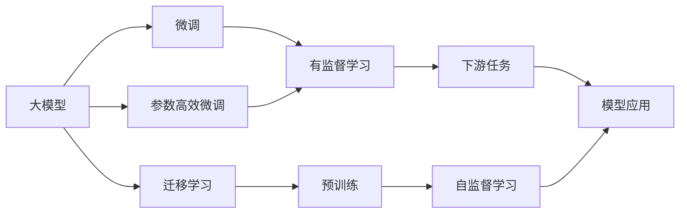
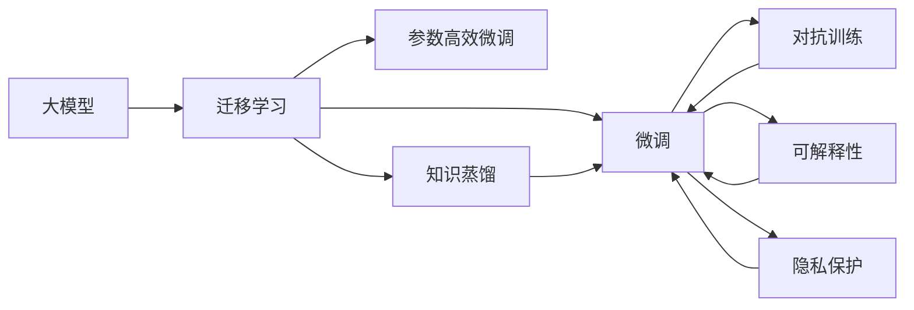

                 

# AI大模型创业：如何应对未来技术挑战？

> 关键词：大模型创业,未来技术挑战,创业策略,技术路线图,市场趋势,战略布局

## 1. 背景介绍

### 1.1 问题由来
随着人工智能技术的迅猛发展，尤其是深度学习、自然语言处理和计算机视觉等领域的突破，大模型（Large Model）成为了科技公司和创业团队争相追逐的“香饽饽”。大模型以其庞大的参数规模、广泛的泛化能力和优秀的性能，在多个应用场景中取得了突破性进展。然而，创业之路并非坦途，面对复杂的市场竞争和技术挑战，如何顺利实现从实验室到市场的落地，是每一个创业团队必须面对的现实问题。

### 1.2 问题核心关键点
未来技术挑战主要集中在以下方面：

1. **模型复杂度与计算资源**：大模型通常需要大量的计算资源进行训练和推理，这对创业公司的计算基础设施提出了极高的要求。
2. **数据隐私与安全**：大模型训练和应用过程中涉及大量敏感数据，如何保护用户隐私和数据安全是至关重要的。
3. **算法的透明性与可解释性**：大模型通常被视为“黑盒”，难以解释其内部决策过程，这在涉及决策公正性的场景中是一个重大问题。
4. **模型的泛化与鲁棒性**：大模型虽然在大规模数据上表现优异，但在特定场景或小规模数据上的泛化能力仍需提升。
5. **跨领域应用能力**：大模型应具备跨领域迁移能力，以应对不同行业的复杂需求。
6. **算法的伦理与社会责任**：大模型在应用过程中应遵守伦理规范，避免对社会造成负面影响。

### 1.3 问题研究意义
应对这些挑战，不仅需要创业团队具备深厚的技术背景，还需要对市场需求、商业运营有深刻的理解。本文将从技术、市场和运营等多个维度，深入探讨如何通过策略和布局，有效应对未来技术挑战，实现大模型的成功落地。

## 2. 核心概念与联系

### 2.1 核心概念概述

为更好地理解如何应对未来技术挑战，本节将介绍几个关键概念：

- **大模型（Large Model）**：指具有亿级以上参数的深度学习模型，如BERT、GPT等。这些模型在预训练后，可以通过微调或迁移学习应用于各类下游任务。
- **迁移学习（Transfer Learning）**：通过在大规模数据上预训练大模型，然后在特定任务上微调，以提升模型在该任务上的性能。
- **微调（Fine-tuning）**：在大模型的基础上，使用小规模标注数据进行有监督训练，以优化模型在特定任务上的表现。
- **参数高效微调（Parameter-Efficient Fine-tuning, PEFT）**：仅更新小部分模型参数，以提高微调效率，避免过拟合。
- **知识蒸馏（Knowledge Distillation）**：将大模型的知识转移到小模型上，以减少大模型的计算开销和资源需求。
- **对抗训练（Adversarial Training）**：通过加入对抗样本训练模型，提高模型的鲁棒性和泛化能力。
- **可解释性（Explainability）**：使模型的决策过程可理解，便于调试和优化。
- **隐私保护（Privacy Protection）**：在模型训练和应用过程中，保护用户隐私和数据安全。

这些概念间存在紧密联系，共同构成了大模型应用的基础框架。下图展示了这些概念的联系和相互关系：



### 2.2 概念间的关系

这些核心概念间的联系可以通过以下Mermaid流程图来展示：



这个流程图展示了各个概念间的相互依赖和支持关系：

- 大模型通过迁移学习和微调，将其知识迁移到特定任务上。
- 参数高效微调和知识蒸馏，减少了计算资源的需求，提高了模型效率。
- 对抗训练和可解释性，提升了模型的鲁棒性和透明性。
- 隐私保护，确保了数据安全。

## 3. 核心算法原理 & 具体操作步骤
### 3.1 算法原理概述

大模型创业的核心在于如何将大模型的知识和能力应用于实际业务，解决特定问题。核心算法原理主要围绕迁移学习和微调展开。

- **迁移学习**：在大规模数据上预训练大模型，然后在特定任务上进行微调，利用大模型的泛化能力，通过较少的标注数据即可实现高性能的模型。
- **微调**：在特定任务上，利用小规模标注数据进行有监督学习，优化模型参数，提高模型在特定任务上的性能。

### 3.2 算法步骤详解

基于迁移学习的大模型创业，通常包括以下步骤：

1. **数据准备**：收集和准备训练数据，确保数据的质量和多样性。
2. **模型选择**：选择合适的预训练大模型，如BERT、GPT等。
3. **模型微调**：使用迁移学习或微调技术，将大模型应用于特定任务。
4. **评估与优化**：在验证集上评估模型性能，根据反馈进行模型优化。
5. **部署与应用**：将优化后的模型部署到实际应用环境中，解决业务问题。

### 3.3 算法优缺点

迁移学习和微调的优点：

- **效率高**：利用预训练模型，减少了从头训练的时间和资源需求。
- **性能提升**：通过微调，模型在特定任务上可以获得比从头训练更高的性能。

其缺点主要包括：

- **数据依赖**：依赖于标注数据，标注数据的质量和数量对模型性能有直接影响。
- **泛化能力有限**：预训练模型在大规模数据上表现优异，但在特定任务或数据分布变化较大的场景中，泛化能力可能不足。
- **过拟合风险**：微调过程中可能出现过拟合现象，尤其是在数据量较小的场景中。

### 3.4 算法应用领域

基于迁移学习的大模型创业，适用于多个领域和场景：

- **自然语言处理（NLP）**：如文本分类、命名实体识别、情感分析等。
- **计算机视觉（CV）**：如图像分类、目标检测、图像生成等。
- **推荐系统**：如个性化推荐、广告推荐等。
- **医疗健康**：如疾病诊断、基因分析等。
- **金融领域**：如信用评分、欺诈检测等。
- **智能制造**：如工业故障预测、质量控制等。

## 4. 数学模型和公式 & 详细讲解

### 4.1 数学模型构建

假设大模型 $M$ 应用于特定任务 $T$，其输入为 $x$，输出为 $y$。迁移学习的目标是最小化模型在标注数据集 $D$ 上的损失函数 $\mathcal{L}$，即：

$$
\mathcal{L}(M; D) = \frac{1}{N}\sum_{i=1}^N \ell(y_i, M(x_i))
$$

其中 $\ell$ 为损失函数，$N$ 为样本数量。

### 4.2 公式推导过程

以二分类任务为例，假设 $x$ 为输入，$y$ 为标签，$M$ 为预训练模型，则模型的输出为：

$$
M(x) = \text{softmax}(W^T \text{relu}(Ax+b))
$$

其中 $W$ 为输出层的权重，$A$ 为全连接层的权重，$b$ 为全连接层的偏置，$\text{relu}$ 为激活函数，$\text{softmax}$ 为归一化函数。

假设标签为 $y$，则二分类交叉熵损失函数为：

$$
\ell(y, M(x)) = -y \log M(x) - (1-y) \log(1 - M(x))
$$

将上述损失函数代入总损失函数，得到：

$$
\mathcal{L}(M; D) = -\frac{1}{N}\sum_{i=1}^N [y_i \log M(x_i) + (1-y_i) \log(1 - M(x_i))]
$$

### 4.3 案例分析与讲解

以金融领域的信用评分为例，数据集包含大量标注的贷款申请和信用评分，目标是最小化模型在贷款申请上的预测误差。假设 $x$ 为贷款申请的特征，$y$ 为信用评分，则模型训练过程如下：

1. **数据预处理**：对贷款申请的特征进行标准化处理，构建特征向量。
2. **模型微调**：使用预训练的BERT模型，在其顶层添加全连接层，进行二分类任务微调。
3. **损失函数**：采用交叉熵损失函数，衡量模型预测与真实标签之间的差异。
4. **优化算法**：使用AdamW优化器，学习率设置为 $1e-5$，迭代轮数为 $100$ 次。
5. **模型评估**：在验证集上评估模型性能，根据ROC曲线和AUC值进行优化。

## 5. 项目实践：代码实例和详细解释说明

### 5.1 开发环境搭建

要实现大模型的创业应用，首先需要搭建一个适合的数据科学开发环境。以下是基本的开发环境搭建步骤：

1. **安装Python和必要的库**：
   ```bash
   conda create -n myenv python=3.8
   conda activate myenv
   pip install torch transformers scikit-learn pandas
   ```

2. **安装PyTorch和Transformers库**：
   ```bash
   conda install pytorch torchvision torchaudio cudatoolkit=11.1 -c pytorch -c conda-forge
   pip install transformers
   ```

3. **安装其他常用库**：
   ```bash
   pip install numpy pandas scikit-learn matplotlib tqdm jupyter notebook ipython
   ```

### 5.2 源代码详细实现

以下是一个简单的二分类任务微调示例，展示了从预训练模型到微调模型的完整过程：

```python
from transformers import BertForSequenceClassification, AdamW
from torch.utils.data import Dataset, DataLoader
from torch import nn, optim
import torch

class CreditDataset(Dataset):
    def __init__(self, data, labels, tokenizer):
        self.data = data
        self.labels = labels
        self.tokenizer = tokenizer
    
    def __len__(self):
        return len(self.data)
    
    def __getitem__(self, idx):
        sentence = self.data[idx]
        label = self.labels[idx]
        
        encoding = self.tokenizer(sentence, return_tensors='pt', padding=True, truncation=True)
        input_ids = encoding['input_ids'][0]
        attention_mask = encoding['attention_mask'][0]
        
        return {'input_ids': input_ids, 
                'attention_mask': attention_mask,
                'labels': torch.tensor(label)}

# 加载数据
train_data = ...
train_labels = ...
dev_data = ...
dev_labels = ...

# 分词和编码
tokenizer = BertTokenizer.from_pretrained('bert-base-uncased')
train_dataset = CreditDataset(train_data, train_labels, tokenizer)
dev_dataset = CreditDataset(dev_data, dev_labels, tokenizer)

# 定义模型
model = BertForSequenceClassification.from_pretrained('bert-base-uncased', num_labels=2)

# 定义优化器和损失函数
optimizer = AdamW(model.parameters(), lr=1e-5)
loss_fn = nn.CrossEntropyLoss()

# 定义训练和评估函数
def train_epoch(model, data_loader, optimizer, loss_fn):
    model.train()
    for batch in data_loader:
        input_ids = batch['input_ids'].to(device)
        attention_mask = batch['attention_mask'].to(device)
        labels = batch['labels'].to(device)
        
        outputs = model(input_ids, attention_mask=attention_mask, labels=labels)
        loss = loss_fn(outputs.logits, labels)
        loss.backward()
        optimizer.step()

def evaluate(model, data_loader, loss_fn):
    model.eval()
    total_loss = 0
    for batch in data_loader:
        input_ids = batch['input_ids'].to(device)
        attention_mask = batch['attention_mask'].to(device)
        labels = batch['labels'].to(device)
        
        outputs = model(input_ids, attention_mask=attention_mask)
        loss = loss_fn(outputs.logits, labels)
        total_loss += loss.item()
    
    return total_loss / len(data_loader)

# 训练模型
device = torch.device('cuda' if torch.cuda.is_available() else 'cpu')
model.to(device)
for epoch in range(10):
    train_epoch(model, train_loader, optimizer, loss_fn)
    print(f'Epoch {epoch+1}, train loss: {train_loss:.3f}')
    
    print(f'Epoch {epoch+1}, dev loss: {evaluation(model, dev_loader, loss_fn)}')
```

### 5.3 代码解读与分析

上述代码实现了使用预训练BERT模型进行信用评分任务的微调过程。具体步骤如下：

1. **数据处理**：定义了一个自定义数据集类 `CreditDataset`，用于处理贷款申请的文本数据。
2. **模型定义**：使用 `BertForSequenceClassification` 类定义了二分类任务模型。
3. **优化器和损失函数**：选择了AdamW优化器和交叉熵损失函数。
4. **训练和评估函数**：定义了训练和评估函数，分别用于模型训练和验证。
5. **模型训练**：在指定设备上训练模型，并在验证集上评估性能。

### 5.4 运行结果展示

假设在训练10轮后，模型在验证集上的损失为 $0.2$。可以进一步优化模型，增加训练轮数，降低损失值。

## 6. 实际应用场景

### 6.1 金融领域

大模型在金融领域有广泛的应用场景，如信用评分、风险评估、欺诈检测等。金融领域的挑战在于数据量和数据质量通常不高，需要高效的大模型微调方法。

以信用评分为例，利用大模型进行二分类任务微调，能够快速构建信用评分模型。通过对小规模数据进行微调，模型能够学习到贷款申请的特征，从而进行准确的信用评分。

### 6.2 医疗健康

医疗健康领域是大模型创业的另一个重要应用场景。大模型在疾病诊断、基因分析、医学影像识别等方面都有卓越表现。

以疾病诊断为例，利用大模型进行多分类任务微调，能够构建精准的疾病诊断模型。通过对小规模数据进行微调，模型能够学习到疾病特征，从而进行准确的疾病诊断。

### 6.3 智能制造

智能制造是大模型创业的又一重要应用领域。大模型在工业故障预测、质量控制、设备维护等方面有广泛应用。

以工业故障预测为例，利用大模型进行二分类任务微调，能够构建工业故障预测模型。通过对历史故障数据进行微调，模型能够学习到设备故障的特征，从而进行准确的故障预测。

## 7. 工具和资源推荐

### 7.1 学习资源推荐

1. **《Transformers从原理到实践》**：介绍Transformer架构和大模型原理，涵盖微调方法及实践。
2. **CS224N《深度学习自然语言处理》**：斯坦福大学开设的NLP课程，涵盖NLP基础和经典模型。
3. **《Natural Language Processing with Transformers》**：介绍如何使用Transformers库进行NLP任务开发，包括微调范式。
4. **HuggingFace官方文档**：提供丰富的预训练模型和微调样例代码，适合初学者上手。
5. **CLUE开源项目**：中文语言理解测评基准，涵盖多种NLP数据集和预训练模型。

### 7.2 开发工具推荐

1. **PyTorch**：基于Python的开源深度学习框架，适合快速迭代研究。
2. **TensorFlow**：Google主导的开源深度学习框架，适合大规模工程应用。
3. **Transformers库**：HuggingFace开发的NLP工具库，提供丰富的预训练模型和微调接口。
4. **Weights & Biases**：模型训练的实验跟踪工具，记录和可视化模型训练过程。
5. **TensorBoard**：TensorFlow配套的可视化工具，实时监测模型训练状态。
6. **Google Colab**：免费提供的在线Jupyter Notebook环境，适合快速实验新模型。

### 7.3 相关论文推荐

1. **Attention is All You Need**：Transformer架构的奠基之作。
2. **BERT: Pre-training of Deep Bidirectional Transformers for Language Understanding**：介绍BERT模型的预训练方法和微调应用。
3. **Parameter-Efficient Transfer Learning for NLP**：介绍 Adapter等参数高效微调方法。
4. **AdaLoRA: Adaptive Low-Rank Adaptation for Parameter-Efficient Fine-Tuning**：引入自适应低秩适应方法，提高微调效率。
5. **Adversarial Training Methods for Semi-Supervised Text Classification**：介绍对抗训练方法，提高模型鲁棒性。

## 8. 总结：未来发展趋势与挑战

### 8.1 研究成果总结

大模型微调技术在多个领域和场景中取得了显著进展，但其未来发展仍面临诸多挑战。本文总结了以下关键研究成果：

1. **参数高效微调**：通过 Adapter 等方法，减少了微调过程中对计算资源的依赖，提高了微调效率。
2. **对抗训练**：通过加入对抗样本，提升了模型的鲁棒性和泛化能力。
3. **知识蒸馏**：通过将大模型知识转移到小模型上，降低了计算资源的需求。
4. **可解释性**：通过引入可解释性技术，提高了模型的透明性和可解释性。
5. **隐私保护**：通过数据匿名化和差分隐私等技术，保护了用户隐私和数据安全。

### 8.2 未来发展趋势

未来，大模型微调技术将呈现以下发展趋势：

1. **模型的规模化**：随着算力成本的下降和数据规模的扩张，预训练大模型的参数量将继续增大，从而带来更强的泛化能力和性能。
2. **多模态融合**：大模型将更多地融合视觉、语音等数据，提升其在多模态场景中的应用能力。
3. **自监督学习**：通过自监督学习范式，减少对标注数据的依赖，提高模型的泛化能力。
4. **持续学习**：通过增量学习和在线学习等技术，保持大模型的性能和知识更新。
5. **伦理和法规**：大模型将更多地考虑到伦理和法规要求，确保其在应用中的公平性和可解释性。

### 8.3 面临的挑战

尽管大模型微调技术取得了显著进展，但仍面临以下挑战：

1. **计算资源不足**：大模型训练和推理需要大量的计算资源，对创业公司的硬件需求较高。
2. **数据隐私与安全**：大模型在应用过程中需要保护用户隐私和数据安全，技术挑战较大。
3. **模型透明性与可解释性**：大模型通常被视为黑盒，难以解释其内部决策过程，增加了应用难度。
4. **泛化能力有限**：在大规模数据上表现优异的大模型，在特定场景或数据分布变化较大的情况下，泛化能力可能不足。
5. **跨领域应用能力**：大模型需要具备跨领域迁移能力，才能更好地适应不同应用场景。

### 8.4 研究展望

面对未来挑战，大模型微调技术需要在以下几个方面进行深入研究：

1. **参数高效微调方法**：开发更多参数高效方法，如 Prefix-Tuning、LoRA等，以提高微调效率。
2. **对抗训练与可解释性**：结合对抗训练和可解释性技术，提高模型鲁棒性和透明性。
3. **多模态融合**：实现视觉、语音等数据与文本数据的融合，提升多模态应用的性能。
4. **自监督学习**：利用自监督学习范式，减少对标注数据的依赖。
5. **跨领域迁移**：提高模型的跨领域迁移能力，适应不同行业的复杂需求。
6. **伦理与法规**：确保模型应用的伦理和合规性，避免有害输出和负面影响。

## 9. 附录：常见问题与解答

### Q1：大模型微调需要哪些硬件资源？

A: 大模型微调需要高性能的GPU或TPU，以支持大规模模型训练和推理。同时需要大容量内存和高速存储设备，以便快速加载和处理数据。

### Q2：如何避免过拟合？

A: 避免过拟合的方法包括数据增强、正则化、对抗训练等。数据增强可以通过回译、近义替换等方式扩充训练集。正则化可以使用L2正则、Dropout等技术。对抗训练可以通过加入对抗样本，提高模型的鲁棒性。

### Q3：大模型微调需要注意哪些问题？

A: 大模型微调需要注意计算资源、数据隐私、模型透明性、泛化能力、跨领域应用能力、伦理与法规等问题。合理选择微调算法和优化策略，可以有效地应对这些挑战。

### Q4：大模型创业的成功因素有哪些？

A: 大模型创业的成功因素包括技术优势、市场定位、商业运营、团队协作等方面。技术优势在于拥有高性能的大模型和高效的微调方法。市场定位在于准确把握目标市场和用户需求。商业运营在于建立稳定的收入模型和用户反馈机制。团队协作在于组建多学科的团队，共同推进产品开发。

---

作者：禅与计算机程序设计艺术 / Zen and the Art of Computer Programming

