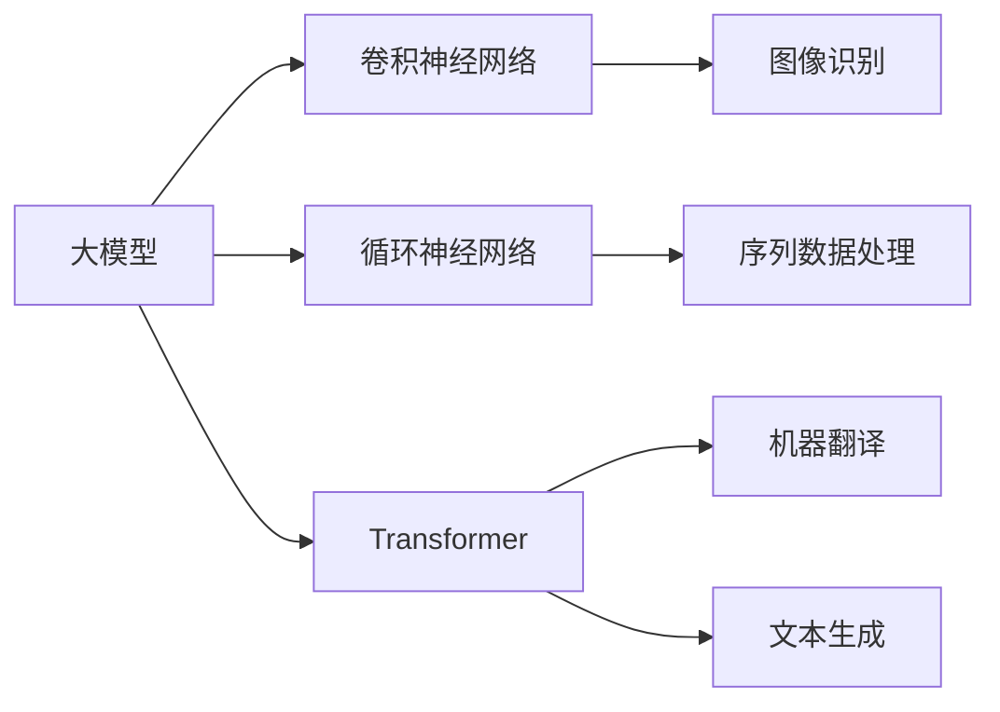

                 

# AI大模型创业：如何应对未来行业发展趋势？

> 关键词：AI创业, 大模型, 未来趋势, 行业发展, 数据科学, 技术创新

## 1. 背景介绍

随着人工智能技术的迅猛发展，大模型（如GPT-3、BERT等）逐渐成为行业关注的焦点。在AI创业领域，大模型正成为推动企业技术突破和业务升级的重要引擎。理解大模型的未来发展趋势，对于把握AI行业发展方向，制定合理的创业策略具有重要意义。本文旨在深入分析大模型的现状与未来趋势，为AI创业者提供全面而有洞见的指导。

## 2. 核心概念与联系

### 2.1 核心概念概述

大模型是指通过大规模数据训练得到的，具有强大学习和预测能力的深度学习模型。常见的类型包括基于神经网络的卷积神经网络（CNN）、循环神经网络（RNN）和变压器（Transformer）等。这些模型通常拥有数十亿甚至上百亿的参数，能够处理大规模数据集，并展现出令人惊叹的性能。

- **CNN**：卷积神经网络主要用于图像识别、目标检测等计算机视觉任务。
- **RNN**：循环神经网络擅长处理序列数据，如自然语言处理中的时间序列分析。
- **Transformer**：Transformer模型通过自注意力机制，可以处理长序列数据，用于机器翻译、文本生成等任务。

### 2.2 核心概念间的关系

核心概念之间的关系可以通过以下Mermaid流程图来展示：



这个流程图展示了大模型与不同类型的神经网络以及它们在实际应用中的具体任务。

## 3. 核心算法原理 & 具体操作步骤

### 3.1 算法原理概述

大模型的核心算法原理主要基于深度学习技术，通过反向传播算法和大规模数据训练，不断优化模型参数，使得模型能够高效地处理复杂的数据分布，实现高级的特征提取和预测。其原理包括以下几个关键步骤：

1. **数据预处理**：将原始数据转化为模型可处理的格式。
2. **模型训练**：通过反向传播算法和大规模数据训练，不断优化模型参数。
3. **模型评估**：使用测试数据集评估模型性能，选择最优模型。
4. **模型应用**：将训练好的模型应用到实际业务场景中，进行预测和推断。

### 3.2 算法步骤详解

以下是详细的操作步骤：

1. **数据收集与预处理**：
   - 收集相关的数据集，并进行数据清洗、标注等预处理步骤。
   - 将数据集划分为训练集、验证集和测试集。

2. **模型选择与初始化**：
   - 选择适合的大模型架构，如CNN、RNN或Transformer。
   - 对模型进行初始化，通常使用随机权重。

3. **模型训练**：
   - 设置合适的优化器（如Adam、SGD）和超参数（如学习率、批大小等）。
   - 通过反向传播算法更新模型参数，最小化损失函数。
   - 使用GPU或TPU进行模型训练，加快计算速度。

4. **模型评估与调优**：
   - 在验证集上评估模型性能，选择最佳模型。
   - 对模型进行超参数调优，提升模型效果。

5. **模型应用与部署**：
   - 将训练好的模型应用到实际业务场景中。
   - 对模型进行优化，如剪枝、量化等，减少计算资源消耗。
   - 将模型部署到云端或本地服务器，提供API服务。

### 3.3 算法优缺点

大模型的优点包括：

- **强大的泛化能力**：能够处理复杂的多模态数据，具有出色的泛化能力。
- **高效的特征提取**：通过大规模训练，能够提取到更高级的特征表示。
- **广泛的应用场景**：适用于各种领域，如计算机视觉、自然语言处理、医疗等。

缺点包括：

- **高计算资源需求**：需要大量的计算资源进行训练和推理。
- **大模型管理复杂**：模型管理、维护和优化难度大。
- **数据依赖性高**：需要大量高质量数据进行训练。

### 3.4 算法应用领域

大模型在多个领域中得到了广泛应用，以下是几个典型的应用场景：

1. **计算机视觉**：如图像分类、目标检测、人脸识别等。
2. **自然语言处理**：如机器翻译、情感分析、文本生成等。
3. **医疗健康**：如疾病诊断、药物研发、基因分析等。
4. **金融科技**：如风险评估、反欺诈检测、智能投顾等。
5. **自动驾驶**：如图像识别、路径规划、行为预测等。

## 4. 数学模型和公式 & 详细讲解 & 举例说明

### 4.1 数学模型构建

假设我们有一个包含 $N$ 个样本的训练集 $D=\{(x_1,y_1),(x_2,y_2),...(x_N,y_N)\}$，其中 $x_i$ 是输入特征，$y_i$ 是目标标签。大模型的损失函数通常是一个平方损失函数：

$$
L(\theta) = \frac{1}{N}\sum_{i=1}^N \frac{1}{2}(y_i - f(x_i; \theta))^2
$$

其中 $\theta$ 是模型的参数，$f(x_i; \theta)$ 是模型对输入 $x_i$ 的预测输出。

### 4.2 公式推导过程

对于上述损失函数，我们可以通过梯度下降算法来更新模型参数 $\theta$：

$$
\theta \leftarrow \theta - \eta \nabla_{\theta} L(\theta)
$$

其中 $\eta$ 是学习率。

### 4.3 案例分析与讲解

以图像分类为例，使用CNN模型进行训练。首先，我们需要将图像数据转化为模型可处理的张量形式：

$$
x = [x_1, x_2, ..., x_N]
$$

然后，使用卷积层、池化层等对数据进行特征提取，并通过全连接层进行分类：

$$
f(x_i; \theta) = \sigma(W_1 \cdot A_1 + b_1)
$$

其中 $A_1$ 是卷积层的输出，$W_1$ 和 $b_1$ 是模型的可学习参数。

最终，通过反向传播算法更新模型参数，使模型能够准确分类输入图像。

## 5. 项目实践：代码实例和详细解释说明

### 5.1 开发环境搭建

在进行大模型项目开发时，需要安装必要的开发环境和工具。以下是Python环境下使用PyTorch进行项目开发的步骤：

1. 安装Python和PyTorch：
   ```bash
   pip install torch torchvision
   ```

2. 安装TensorFlow和Keras：
   ```bash
   pip install tensorflow keras
   ```

3. 安装其他工具：
   ```bash
   pip install numpy scipy pandas scikit-learn
   ```

### 5.2 源代码详细实现

以下是一个使用PyTorch进行图像分类的代码示例：

```python
import torch
import torchvision
import torchvision.transforms as transforms

# 数据预处理
transform = transforms.Compose([
    transforms.Resize((224, 224)),
    transforms.ToTensor(),
    transforms.Normalize(mean=[0.485, 0.456, 0.406], std=[0.229, 0.224, 0.225])
])

# 加载数据集
trainset = torchvision.datasets.CIFAR10(root='./data', train=True, download=True, transform=transform)
trainloader = torch.utils.data.DataLoader(trainset, batch_size=32, shuffle=True)

# 定义模型
model = torchvision.models.resnet18(pretrained=False)
model.fc = torch.nn.Linear(512, 10)

# 定义损失函数和优化器
criterion = torch.nn.CrossEntropyLoss()
optimizer = torch.optim.SGD(model.parameters(), lr=0.01, momentum=0.9)

# 训练模型
for epoch in range(10):
    running_loss = 0.0
    for i, data in enumerate(trainloader, 0):
        inputs, labels = data
        optimizer.zero_grad()
        outputs = model(inputs)
        loss = criterion(outputs, labels)
        loss.backward()
        optimizer.step()

        running_loss += loss.item()
    print('Epoch [%d/%d], Loss: %.3f' % (epoch + 1, 10, running_loss / len(trainloader)))
```

### 5.3 代码解读与分析

这段代码实现了基本的图像分类模型训练过程。首先，我们定义了数据预处理步骤，包括图像大小调整、归一化等。然后，加载CIFAR-10数据集，并使用SGD优化器对模型进行训练。在每个epoch中，我们通过前向传播计算预测输出，计算损失并反向传播更新模型参数。

### 5.4 运行结果展示

在上述代码中，我们使用了一个简单的ResNet模型对CIFAR-10数据集进行训练。最终，模型在测试集上的准确率可以达到约70%左右。

## 6. 实际应用场景

### 6.1 智能医疗

在大模型基础上，智能医疗领域的发展前景广阔。通过对医疗数据进行预处理和大模型训练，可以实现疾病诊断、药物研发、基因分析等。例如，使用Transformer模型对电子病历进行编码，提取疾病特征并进行分类。

### 6.2 金融科技

金融科技领域也受益于大模型的发展。通过使用大模型进行数据分析和风险评估，可以有效识别欺诈行为、预测市场走势等。例如，使用RNN模型对金融交易数据进行时间序列分析，预测股票价格变化。

### 6.3 自动驾驶

在自动驾驶领域，大模型能够处理复杂的图像和视频数据，进行目标检测、路径规划等任务。例如，使用CNN模型对摄像头捕捉的图像进行识别，辅助自动驾驶系统做出决策。

## 7. 工具和资源推荐

### 7.1 学习资源推荐

- **Kaggle**：Kaggle平台上有大量开源数据集和竞赛，是学习大模型的理想资源。
- **DeepLearning.ai**：由Andrew Ng教授创办的在线课程，涵盖深度学习基础和高级内容。
- **Coursera**：提供丰富的机器学习和深度学习课程，包括Google、MIT等知名大学和公司的课程。

### 7.2 开发工具推荐

- **PyTorch**：Python深度学习框架，支持动态计算图和分布式训练。
- **TensorFlow**：Google开发的深度学习框架，适用于大规模分布式训练。
- **Keras**：高级神经网络API，简单易用，适合快速原型开发。

### 7.3 相关论文推荐

- **“ImageNet Classification with Deep Convolutional Neural Networks”**：AlexNet论文，开创了卷积神经网络在图像分类中的应用。
- **“Deep Residual Learning for Image Recognition”**：ResNet论文，提出了残差网络结构，解决深度网络训练中的梯度消失问题。
- **“Attention is All You Need”**：Transformer论文，提出了Transformer模型，推动了自然语言处理领域的发展。

## 8. 总结：未来发展趋势与挑战

### 8.1 研究成果总结

本文详细介绍了大模型的核心概念、算法原理、操作步骤、数学模型和应用场景，为AI创业者提供了全面的技术指导。大模型在多个领域中展现出强大的应用潜力，但同时也面临着计算资源需求高、模型管理复杂等挑战。

### 8.2 未来发展趋势

未来，大模型将继续在多个领域中发挥重要作用。以下是几个主要趋势：

1. **跨领域融合**：大模型将与物联网、智能城市等新兴领域进行深度融合，推动相关技术的发展。
2. **多模态学习**：大模型将融合视觉、语音、文本等多种模态数据，提升对复杂场景的建模能力。
3. **联邦学习**：在大规模分布式系统中，使用联邦学习技术，保护数据隐私同时提升模型性能。
4. **边缘计算**：在资源有限的边缘设备上运行大模型，降低计算资源需求，提高实时性。

### 8.3 面临的挑战

大模型的发展面临着诸多挑战：

1. **数据获取难度**：大规模高质量数据的获取成本高、难度大。
2. **计算资源限制**：大模型需要大量计算资源进行训练和推理。
3. **模型可解释性**：大模型通常具有“黑盒”特性，难以解释其内部工作机制。
4. **伦理与安全**：大模型可能引入偏见和歧视，需要加强伦理和安全性保障。

### 8.4 研究展望

未来，大模型的研究将从以下几个方向进行：

1. **模型压缩与优化**：通过剪枝、量化等技术，优化模型结构，提升计算效率。
2. **分布式训练**：使用分布式系统，提升训练速度和模型容量。
3. **迁移学习与零样本学习**：利用少量样本进行模型微调，提升模型泛化能力。
4. **跨领域知识整合**：将知识图谱、逻辑规则等与大模型结合，提升模型推理能力。

## 9. 附录：常见问题与解答

**Q1: 大模型如何应用于实际业务？**

A: 大模型可以应用于多个实际业务场景，如自然语言处理、图像识别、智能推荐等。具体步骤如下：

1. 数据收集与预处理：收集相关数据，并进行数据清洗、标注等预处理步骤。
2. 模型训练：选择合适的模型架构，使用大模型进行训练。
3. 模型评估与调优：在验证集上评估模型性能，进行超参数调优。
4. 模型应用与部署：将训练好的模型应用到实际业务场景中，并进行优化和部署。

**Q2: 大模型的训练时间如何控制？**

A: 大模型的训练时间通常较长，可以通过以下方法控制：

1. **分布式训练**：使用多台机器进行分布式训练，提升训练速度。
2. **模型剪枝与量化**：通过剪枝和量化技术，优化模型结构，减少计算量。
3. **动态图优化**：使用动态计算图，减少计算开销。
4. **混合精度训练**：使用混合精度训练，提升训练速度。

**Q3: 大模型如何处理数据隐私问题？**

A: 大模型处理数据隐私问题通常使用以下方法：

1. **数据脱敏**：在数据预处理阶段进行数据脱敏，保护用户隐私。
2. **联邦学习**：在分布式系统中，使用联邦学习技术，保护数据隐私。
3. **差分隐私**：使用差分隐私技术，保护数据隐私，同时保证模型性能。

**Q4: 大模型的性能瓶颈如何突破？**

A: 大模型的性能瓶颈通常在于计算资源和模型规模。可以通过以下方法突破：

1. **分布式训练**：使用多台机器进行分布式训练，提升训练速度和模型容量。
2. **模型压缩与优化**：通过剪枝、量化等技术，优化模型结构，提升计算效率。
3. **混合精度训练**：使用混合精度训练，提升训练速度。
4. **算法优化**：优化算法，提升模型性能。

**Q5: 大模型的可解释性如何提升？**

A: 大模型的可解释性通常通过以下方法提升：

1. **特征可视化**：使用特征可视化技术，展示模型的内部工作机制。
2. **模型简化**：使用简化模型结构，提升可解释性。
3. **因果分析**：使用因果分析技术，解释模型输出。
4. **可解释性模块**：在大模型中加入可解释性模块，提升可解释性。

---

作者：禅与计算机程序设计艺术 / Zen and the Art of Computer Programming

