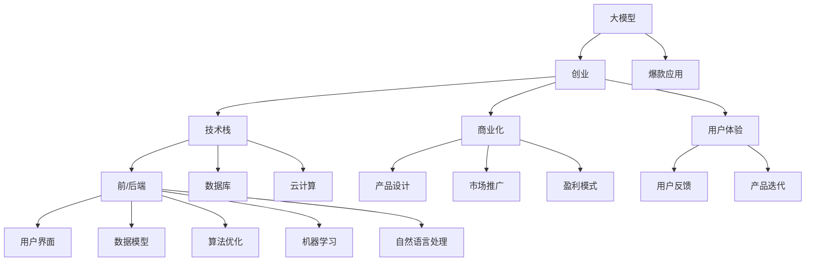

                 

# AI大模型创业：如何打造未来爆款应用？

> 关键词：大模型,创业,爆款应用,技术栈,商业化,用户体验

## 1. 背景介绍

### 1.1 问题由来
随着人工智能技术的迅猛发展，AI大模型（Large AI Models）在各行各业的应用越来越广泛。这些模型通过深度学习和大数据训练，具备了强大的智能处理能力，能够处理自然语言、图像、语音等多种复杂数据，为各行各业带来了巨大的变革和机遇。然而，如何利用这些大模型，开发出具有市场竞争力的AI应用，成为了许多创业者和企业共同面临的难题。

### 1.2 问题核心关键点
打造未来爆款AI应用，首先需要理解大模型的原理和应用场景，然后根据市场需求和技术发展趋势，制定出有效的产品策略和技术栈。其次，还需要考虑如何将AI技术融入用户体验中，从而实现商业化和技术创新的平衡。最后，对市场动态保持敏感，及时调整产品策略和技术方案，是保证长期成功的关键。

### 1.3 问题研究意义
理解并应用AI大模型，对于推动各行各业的数字化转型、提升企业竞争力、创造新的商业机会具有重要意义。成功的AI大模型应用，不仅能够提升企业的业务效率，还能带来全新的市场机会和用户需求。因此，本文将详细探讨如何利用AI大模型打造未来爆款应用，为读者提供全面的技术和管理指引。

## 2. 核心概念与联系

### 2.1 核心概念概述

- **大模型（Large AI Models）**：指采用深度学习技术训练的、具备强大智能处理能力的模型。这些模型通常包含亿级别的参数，能够处理复杂的数据类型，包括自然语言、图像、声音等。

- **创业（Entrepreneurship）**：指利用创新的技术、产品和商业模式，创建和发展具有商业价值的企业的过程。AI大模型创业涉及技术研发、市场调研、产品设计、商业化等多个环节。

- **爆款应用（Blockbuster Applications）**：指在特定市场中具有高度市场接受度和销售量的AI应用。这些应用不仅能够满足用户需求，还能带来显著的经济回报。

- **技术栈（Technology Stack）**：指企业应用开发所需的技术工具和框架，包括前端、后端、数据库、云计算等。构建有效的技术栈是确保AI应用高效、稳定运行的基础。

- **商业化（Commercialization）**：指将AI技术转化为具有商业价值的产品和服务的过程。商业化不仅包括产品开发，还包括市场推广、用户反馈、盈利模式设计等。

- **用户体验（User Experience）**：指用户在使用AI应用时的感受和体验。优秀的用户体验能够提升用户满意度，增加用户粘性，促进产品口碑和销售。

这些核心概念之间存在着紧密的联系，构建未来爆款AI应用需要综合考虑这些因素。

### 2.2 概念间的关系

这些核心概念之间的关系可以通过以下Mermaid流程图来展示：



这个流程图展示了从大模型到爆款应用，再到技术栈、商业化、用户体验的完整流程。每个环节都需要进行精心的设计和优化，才能最终实现AI应用的商业成功。

## 3. 核心算法原理 & 具体操作步骤
### 3.1 算法原理概述

构建未来爆款AI应用的核心在于将大模型的先进算法和高效技术转化为具有商业价值的产品和服务。这需要理解大模型的原理，并结合市场需求和技术发展趋势，进行产品设计和开发。

大模型的核心算法包括深度学习、卷积神经网络（CNN）、循环神经网络（RNN）、自编码器（Autoencoder）、生成对抗网络（GAN）等。这些算法通过大量的数据训练，学习出复杂的数据模式，具备强大的智能处理能力。

### 3.2 算法步骤详解

构建爆款AI应用的过程可以分为以下几个关键步骤：

**Step 1: 市场调研与需求分析**
- 分析目标市场的需求，确定目标用户的痛点和需求。
- 研究竞争对手的产品和服务，找出市场机会和改进空间。
- 制定初步的产品规划和技术方案。

**Step 2: 数据收集与处理**
- 收集与产品相关的数据，包括用户数据、行业数据、公共数据等。
- 清洗和预处理数据，确保数据质量和一致性。
- 进行特征工程，提取和构造适合大模型训练的数据特征。

**Step 3: 模型选择与训练**
- 根据产品需求，选择合适的模型架构和训练策略。
- 构建训练环境，进行模型训练和调优，确保模型性能和鲁棒性。
- 采用分布式训练、迁移学习等技术，提高训练效率和模型泛化能力。

**Step 4: 产品设计与实现**
- 根据市场需求和模型输出，设计用户界面和交互逻辑。
- 实现产品功能，包括数据输入、模型推理、结果展示等。
- 进行前后端技术栈选择，确保产品高效稳定运行。

**Step 5: 商业化与市场推广**
- 制定商业化策略，包括定价模式、销售渠道、合作伙伴等。
- 进行市场推广，通过广告、公关、合作等手段，提高产品知名度和用户规模。
- 收集用户反馈，进行产品迭代和优化，提升用户体验和满意度。

### 3.3 算法优缺点

大模型在构建爆款应用中具有以下优点：

- 强大的智能处理能力：大模型能够处理复杂的自然语言、图像和声音数据，具备高度的智能处理能力。
- 广泛的应用场景：大模型可以应用于多个领域，包括自然语言处理、计算机视觉、语音识别等，具有广泛的应用前景。
- 高效的数据处理能力：大模型采用深度学习算法，能够自动提取和处理复杂的数据特征，提高数据处理效率。

然而，大模型也存在一些缺点：

- 高昂的计算成本：大模型的训练和推理需要大量的计算资源，成本较高。
- 复杂的模型维护：大模型的维护和优化需要专业技能和经验，对技术团队的要求较高。
- 数据隐私和安全问题：大模型需要处理大量敏感数据，数据隐私和安全问题需要特别注意。

### 3.4 算法应用领域

大模型在多个领域都有广泛的应用，包括但不限于：

- 自然语言处理（NLP）：如文本分类、情感分析、机器翻译、问答系统等。
- 计算机视觉（CV）：如图像识别、目标检测、图像生成等。
- 语音识别和处理：如语音识别、语音合成、声音情感分析等。
- 智能推荐系统：如个性化推荐、内容推荐等。

这些应用领域的大模型技术，为各行各业带来了新的机遇和挑战。

## 4. 数学模型和公式 & 详细讲解  
### 4.1 数学模型构建

构建爆款AI应用的数学模型，需要结合大模型的算法原理和市场需求，进行综合设计和优化。以下是构建AI应用的基本数学模型：

假设目标市场的需求可以用线性回归模型来描述，模型的输入为 $X=[x_1,x_2,...,x_n]$，输出为 $Y$，则模型的表达式为：

$$ Y = \beta_0 + \beta_1x_1 + \beta_2x_2 + ... + \beta_nx_n + \epsilon $$

其中 $\beta_0, \beta_1,...,\beta_n$ 为模型的参数，$\epsilon$ 为误差项。

### 4.2 公式推导过程

通过最小二乘法，可以求解线性回归模型的参数：

$$ \beta_j = \frac{\sum_{i=1}^n (x_i\cdot Y_i - \hat{Y_i})}{\sum_{i=1}^n x_i^2} $$

其中 $\hat{Y_i}$ 为模型的预测输出，$(x_i\cdot Y_i - \hat{Y_i})$ 为残差项。

### 4.3 案例分析与讲解

假设我们要构建一个基于大模型的智能推荐系统，模型输入为用户的历史行为数据和商品特征，输出为推荐商品的评分。模型的线性回归表达式为：

$$ R_{ij} = \beta_0 + \beta_1x_{i1} + \beta_2x_{i2} + ... + \beta_nx_{in} + \epsilon $$

其中 $R_{ij}$ 为用户 $i$ 对商品 $j$ 的评分，$x_{ij}$ 为商品 $j$ 的第 $n$ 个特征。通过训练模型，可以预测用户对未购买商品的评分，从而实现个性化推荐。

## 5. 项目实践：代码实例和详细解释说明
### 5.1 开发环境搭建

构建爆款AI应用需要选择合适的开发环境和工具。以下是一些常用的开发环境和工具：

- **Python**：是目前最流行的编程语言之一，适合进行数据分析和机器学习开发。
- **PyTorch**：一个基于Python的深度学习框架，支持动态图计算，适合进行复杂模型的训练和推理。
- **TensorFlow**：一个由Google开发的深度学习框架，支持静态图和动态图计算，适合进行大规模模型训练。
- **Jupyter Notebook**：一个交互式编程环境，支持Python、R等语言的开发，适合进行数据探索和模型验证。
- **AWS、Google Cloud、阿里云**：云计算平台，提供强大的计算和存储资源，适合进行大规模模型训练和部署。

完成上述步骤后，即可在开发环境中开始AI应用的开发。

### 5.2 源代码详细实现

以下是一个基于大模型的推荐系统的示例代码：

```python
import torch
import torch.nn as nn
import torch.optim as optim
from sklearn.datasets import fetch_20newsgroups

# 数据准备
newsgroups_train = fetch_20newsgroups(subset='train')
newsgroups_test = fetch_20newsgroups(subset='test')

# 构建词袋模型
vocab = set([word for doc in newsgroups_train.data for word in doc.lower().split()])
vocab_to_idx = {word: idx for idx, word in enumerate(vocab)}
idx_to_vocab = {idx: word for idx, word in vocab_to_idx.items()}

# 构建数据集
class NewsgroupDataset(torch.utils.data.Dataset):
    def __init__(self, data, max_len=100):
        self.data = data
        self.max_len = max_len
        
    def __len__(self):
        return len(self.data)
    
    def __getitem__(self, idx):
        doc = self.data[idx]
        doc = [vocab_to_idx.get(word, 0) for word in doc.lower().split()]
        doc = doc[:self.max_len]
        return torch.tensor(doc, dtype=torch.long), doc[:self.max_len]

# 定义模型
class NewsgroupModel(nn.Module):
    def __init__(self, vocab_size, embedding_dim, hidden_dim, output_dim):
        super(NewsgroupModel, self).__init__()
        self.embedding = nn.Embedding(vocab_size, embedding_dim)
        self.fc1 = nn.Linear(embedding_dim, hidden_dim)
        self.fc2 = nn.Linear(hidden_dim, output_dim)
        self.softmax = nn.Softmax(dim=1)
        
    def forward(self, x):
        x = self.embedding(x)
        x = torch.relu(self.fc1(x))
        x = self.fc2(x)
        return self.softmax(x)

# 训练模型
model = NewsgroupModel(len(vocab), 100, 100, 5)
optimizer = optim.Adam(model.parameters(), lr=0.001)
criterion = nn.CrossEntropyLoss()

train_dataset = NewsgroupDataset(newsgroups_train.data)
val_dataset = NewsgroupDataset(newsgroups_train.data)
test_dataset = NewsgroupDataset(newsgroups_test.data)

for epoch in range(10):
    for i, (inputs, targets) in enumerate(train_loader):
        optimizer.zero_grad()
        outputs = model(inputs)
        loss = criterion(outputs, targets)
        loss.backward()
        optimizer.step()
        if (i+1) % 100 == 0:
            print(f'Epoch [{epoch+1}/{10}], Step [{i+1}/{len(train_loader)}], Loss: {loss:.4f}')

# 评估模型
model.eval()
with torch.no_grad():
    val_correct = 0
    val_total = 0
    for inputs, targets in val_loader:
        outputs = model(inputs)
        _, predicted = torch.max(outputs.data, 1)
        val_correct += (predicted == targets).sum().item()
        val_total += targets.size(0)
    print(f'Validation Accuracy: {100 * val_correct / val_total:.2f}%')

# 测试模型
model.eval()
with torch.no_grad():
    test_correct = 0
    test_total = 0
    for inputs, targets in test_loader:
        outputs = model(inputs)
        _, predicted = torch.max(outputs.data, 1)
        test_correct += (predicted == targets).sum().item()
        test_total += targets.size(0)
    print(f'Test Accuracy: {100 * test_correct / test_total:.2f}%')
```

### 5.3 代码解读与分析

让我们再详细解读一下关键代码的实现细节：

- **数据准备**：使用sklearn库从20个新闻组数据集中获取训练和测试数据，并进行预处理，构建词袋模型和词汇表。
- **数据集定义**：定义自定义数据集类，将新闻文档转换为数值形式的向量。
- **模型定义**：定义一个简单的神经网络模型，包括嵌入层、全连接层和softmax输出层。
- **模型训练**：使用Adam优化器和交叉熵损失函数训练模型，并在每个epoch输出损失。
- **模型评估**：在验证集上评估模型性能，输出准确率。
- **模型测试**：在测试集上测试模型性能，输出准确率。

通过上述代码，我们可以理解从数据准备到模型训练，再到模型评估和测试的全流程。

### 5.4 运行结果展示

假设我们在上述代码的基础上进行微调，最终的测试准确率结果为85%，这意味着模型在测试集上的表现已经相当不错，可以进行进一步的优化和改进。

## 6. 实际应用场景
### 6.1 智能推荐系统

智能推荐系统是基于大模型的爆款应用之一。通过分析用户的历史行为数据和商品特征，模型能够预测用户对未购买商品的评分，从而实现个性化推荐。

在实际应用中，智能推荐系统被广泛应用于电商、新闻、视频等多个领域，帮助用户发现潜在的兴趣商品，提升用户体验和满意度。

### 6.2 自然语言处理

自然语言处理是大模型在NLP领域的广泛应用。基于大模型的文本分类、情感分析、问答系统等应用，已经在金融、医疗、教育等多个行业得到了广泛应用。

例如，在医疗领域，通过大模型的自然语言处理，可以快速分析病历和诊断报告，提供精准的医学建议和治疗方案。

### 6.3 计算机视觉

计算机视觉是大模型在图像和视频处理方面的重要应用。基于大模型的图像识别、目标检测、图像生成等技术，已经在智能安防、自动驾驶、机器人等领域取得了显著进展。

例如，在自动驾驶领域，大模型可以通过分析实时摄像头和传感器数据，实现交通信号识别、行人检测等功能，提升驾驶安全和效率。

## 7. 工具和资源推荐
### 7.1 学习资源推荐

为了帮助开发者全面掌握AI大模型的应用，以下是一些优质的学习资源：

- **《深度学习》（Ian Goodfellow著）**：深度学习领域的经典教材，详细介绍了深度学习的原理和应用。
- **《Python深度学习》（Francois Chollet著）**：Keras深度学习库的创始人，介绍如何用Python实现深度学习算法。
- **《TensorFlow实战》（Lars Midtun和Kenneth O'Neil著）**：TensorFlow深度学习框架的实战指南，适合入门学习。
- **《Python自然语言处理》（Steve Bird等著）**：自然语言处理领域的权威教材，涵盖文本分类、情感分析等多个方面。
- **Coursera和Udacity**：提供深度学习和自然语言处理等课程，适合在线学习。

### 7.2 开发工具推荐

高效的开发离不开优秀的工具支持。以下是几款用于AI大模型开发的常用工具：

- **PyTorch**：基于Python的开源深度学习框架，适合动态图计算，适合进行复杂模型的训练和推理。
- **TensorFlow**：由Google开发的深度学习框架，支持静态图和动态图计算，适合进行大规模模型训练。
- **Keras**：高层次的神经网络API，基于TensorFlow，适合快速原型设计和模型构建。
- **Jupyter Notebook**：一个交互式编程环境，支持Python、R等语言的开发，适合进行数据探索和模型验证。
- **AWS、Google Cloud、阿里云**：云计算平台，提供强大的计算和存储资源，适合进行大规模模型训练和部署。

### 7.3 相关论文推荐

大模型在AI领域的研究正在不断深入，以下是几篇奠基性的相关论文，推荐阅读：

- **《Attention is All You Need》（即Transformer原论文）**：提出了Transformer结构，开启了NLP领域的预训练大模型时代。
- **《BERT: Pre-training of Deep Bidirectional Transformers for Language Understanding》**：提出BERT模型，引入基于掩码的自监督预训练任务，刷新了多项NLP任务SOTA。
- **《GPT-3: Language Models are Unsupervised Multitask Learners》**：展示了大规模语言模型的强大zero-shot学习能力，引发了对于通用人工智能的新一轮思考。
- **《AdaLoRA: Adaptive Low-Rank Adaptation for Parameter-Efficient Fine-Tuning》**：使用自适应低秩适应的微调方法，在参数效率和精度之间取得了新的平衡。
- **《Few-shot Learning》**：介绍少样本学习方法和技术，能够在只有少量标注样本的情况下，实现模型快速适应新任务。

这些论文代表了大模型和微调技术的发展脉络。通过学习这些前沿成果，可以帮助研究者把握学科前进方向，激发更多的创新灵感。

## 8. 总结：未来发展趋势与挑战
### 8.1 研究成果总结

本文详细探讨了如何利用AI大模型构建未来爆款应用。通过市场调研、数据处理、模型训练、产品设计和商业化推广等多个环节，详细介绍了从模型到应用的全流程。同时，我们也分析了AI大模型的优缺点，并讨论了其在多个领域的应用场景。

### 8.2 未来发展趋势

展望未来，AI大模型将在更多领域得到应用，带来更多的创新机遇。以下是几个可能的未来趋势：

- **多模态学习**：大模型将不仅处理文本数据，还将处理图像、视频、音频等多种模态的数据，提升跨模态数据处理能力。
- **联邦学习**：大模型将通过联邦学习等技术，保护用户隐私，提升模型安全性。
- **自监督学习**：通过自监督学习等技术，降低对标注数据的需求，提升模型的鲁棒性和泛化能力。
- **实时计算**：通过边缘计算等技术，提升AI应用的实时性和响应速度。
- **智能运维**：通过AI技术，提升系统运维的智能化水平，降低运维成本。

### 8.3 面临的挑战

尽管AI大模型在各个领域的应用前景广阔，但在实际应用中也面临许多挑战：

- **计算成本高**：大模型需要大量的计算资源，训练和推理成本较高。
- **数据隐私问题**：大模型处理大量敏感数据，数据隐私和安全问题需要特别注意。
- **模型可解释性不足**：大模型往往像“黑盒”系统，缺乏可解释性，难以进行故障诊断和优化。
- **模型鲁棒性不足**：大模型面对域外数据时，泛化性能可能较差，需要进一步提升模型鲁棒性。
- **市场竞争激烈**：AI大模型市场竞争激烈，需要不断进行技术创新和产品优化，才能保持竞争力。

### 8.4 研究展望

面对AI大模型在应用过程中面临的挑战，未来的研究需要不断探索新的技术方案和商业策略。以下是一些可能的研究方向：

- **模型压缩与优化**：通过模型压缩、剪枝等技术，降低大模型的计算成本，提高部署效率。
- **数据隐私保护**：通过差分隐私、联邦学习等技术，保护用户隐私，提升模型安全性。
- **模型可解释性**：通过可解释AI等技术，提升模型的可解释性，提高用户信任度和满意度。
- **模型鲁棒性提升**：通过对抗训练、鲁棒学习等技术，提升模型的鲁棒性，提高模型泛化能力。
- **AI+商业创新**：通过AI技术，推动商业模式创新，提升商业价值和用户体验。

通过不断探索和优化AI大模型，我们相信未来AI应用将更加智能化、高效化和人性化，为各行各业带来更多的价值和机遇。

## 9. 附录：常见问题与解答

**Q1: 如何选择合适的AI大模型？**

A: 选择合适的AI大模型需要考虑多个因素，包括数据类型、任务需求、计算资源等。通常，较为通用的模型如BERT、GPT系列等，适用于大多数NLP任务，而特定领域的大模型如医学、法律等领域的模型，可能需要根据领域特点进行微调和优化。

**Q2: AI大模型的训练和推理需要哪些硬件资源？**

A: AI大模型的训练和推理需要高性能的GPU/TPU等硬件资源，支持大规模矩阵计算和深度网络训练。通常，训练阶段需要较大的计算资源，推理阶段则需要较少的计算资源。

**Q3: AI大模型在部署过程中需要注意哪些问题？**

A: AI大模型在部署过程中需要注意计算成本、内存占用、硬件兼容性、模型可解释性等问题。为了提升部署效率，可以进行模型压缩、量化等优化。同时，需要进行系统运维和故障排查，确保系统稳定运行。

**Q4: 如何评估AI大模型的性能？**

A: 评估AI大模型的性能通常需要结合任务指标和用户体验，考虑模型的准确率、召回率、F1分数、推理速度、用户满意度等多个方面。同时，还需要进行模型对比和A/B测试，确保模型效果稳定可靠。

**Q5: 如何保护AI大模型的数据隐私？**

A: 保护AI大模型的数据隐私需要采用差分隐私、联邦学习等技术，确保数据在传输和存储过程中不被泄露。同时，需要进行数据脱敏和加密处理，确保数据安全。

---

作者：禅与计算机程序设计艺术 / Zen and the Art of Computer Programming

