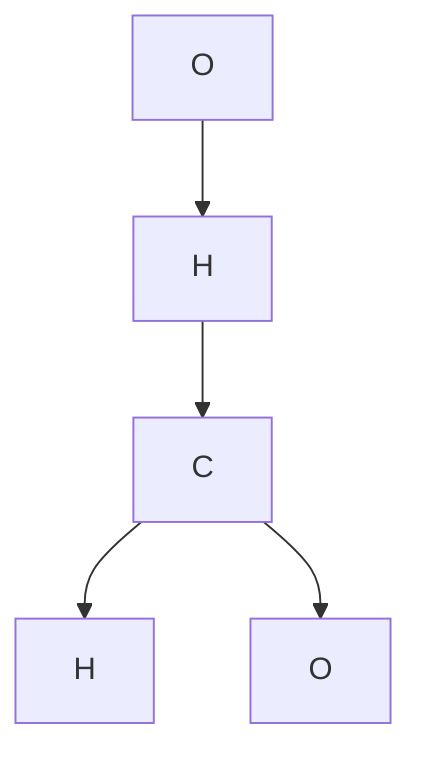

                 

# AI技术在分子设计和筛选中的应用

> 关键词：分子设计,分子筛选,机器学习,深度学习,计算机视觉,多模态学习

## 1. 背景介绍

### 1.1 问题由来

随着生物技术和药学研究的深入，分子设计在药物研发、新材料开发等领域的应用日益增多。传统分子设计依赖于经验和实验，耗时耗资。而AI技术的引入，尤其是机器学习和深度学习等技术的发展，为分子设计和筛选提供了新的解决方案。通过AI技术，研究人员可以高效生成分子库，快速筛选出有潜力的化合物，大大加快新药和新材料的研发进程。

### 1.2 问题核心关键点

AI在分子设计和筛选中的应用，核心在于如何利用机器学习和深度学习等技术，基于分子结构和生物活性数据，生成新的分子结构，并对其进行筛选和评估。这一过程主要包括两个步骤：

1. **分子生成**：基于已知分子结构和生物活性数据，生成新的分子结构。常用的技术包括分子进化算法、变分自编码器(VAE)、生成对抗网络(GAN)等。
2. **分子筛选**：从生成的分子库中，筛选出具有期望生物活性的分子。常用的技术包括支持向量机(SVM)、随机森林(Random Forest)、深度神经网络等。

## 3. 核心算法原理 & 具体操作步骤
### 3.1 算法原理概述

基于机器学习和深度学习的分子设计和筛选，主要包括以下几个关键步骤：

1. **数据收集和预处理**：收集分子结构和生物活性数据，对其进行清洗和标准化处理。
2. **分子生成**：基于已知分子结构和生物活性数据，生成新的分子结构。常用的技术包括分子进化算法、变分自编码器(VAE)、生成对抗网络(GAN)等。
3. **分子筛选**：从生成的分子库中，筛选出具有期望生物活性的分子。常用的技术包括支持向量机(SVM)、随机森林(Random Forest)、深度神经网络等。

### 3.2 算法步骤详解

#### 3.2.1 数据收集和预处理

数据收集和预处理是分子设计和筛选的第一步。通常需要收集分子结构和生物活性数据，包括分子结构、分子特性、生物活性等。数据收集来源包括公开数据库、商业数据库、文献等。

数据预处理包括清洗、标准化、归一化等。常见的预处理方法包括去除异常值、填充缺失值、标准化分子特性等。

#### 3.2.2 分子生成

分子生成是利用AI技术生成新的分子结构。常用的分子生成技术包括：

- **分子进化算法**：基于自然进化的思想，通过模拟自然选择、遗传等过程，生成新的分子结构。例如，DEAP是一个常用的分子进化算法框架。
- **变分自编码器(VAE)**：通过学习分子结构和生物活性数据的分布，生成新的分子结构。VAE由编码器和解码器组成，编码器将输入分子结构转换为潜在空间中的表示，解码器将潜在空间的表示转换为新的分子结构。
- **生成对抗网络(GAN)**：通过对抗网络生成新的分子结构。生成网络生成新的分子结构，判别网络判断生成网络的输出是否为真实分子结构。通过对抗训练，生成网络可以生成高质量的分子结构。

#### 3.2.3 分子筛选

分子筛选是从生成的分子库中筛选出具有期望生物活性的分子。常用的分子筛选技术包括：

- **支持向量机(SVM)**：通过构建核函数，将分子结构映射到高维空间，在高维空间中进行分类。SVM适用于小规模数据集，计算效率高。
- **随机森林(Random Forest)**：通过构建随机森林模型，对分子库进行筛选。随机森林模型可以处理高维数据，对噪声和异常值不敏感。
- **深度神经网络**：通过构建深度神经网络模型，对分子库进行筛选。深度神经网络可以处理大规模数据集，具有较强的泛化能力。

### 3.3 算法优缺点

#### 3.3.1 分子生成的优点和缺点

优点：
1. **高效率**：基于AI技术，可以快速生成大量的新分子结构，加速分子筛选和验证过程。
2. **多样性**：生成的新分子结构具有多样性，增加了筛选和验证的覆盖面。

缺点：
1. **模型复杂度**：生成的分子结构质量取决于模型复杂度和训练数据质量，模型设计不当可能导致生成的新分子结构质量不佳。
2. **计算资源消耗大**：生成高质量的新分子结构需要大量的计算资源和时间。

#### 3.3.2 分子筛选的优点和缺点

优点：
1. **准确性**：通过构建合适的模型，可以有效筛选出具有期望生物活性的分子，提高筛选的准确性。
2. **可扩展性**：模型可以处理大规模数据集，适用于大规模的分子筛选任务。

缺点：
1. **模型过拟合**：模型对训练数据依赖性强，容易出现过拟合现象，影响筛选的泛化能力。
2. **计算资源消耗大**：大规模数据集训练需要大量的计算资源和时间。

### 3.4 算法应用领域

AI技术在分子设计和筛选中的应用，覆盖了药物研发、新材料开发、生物技术等多个领域。以下是几个典型的应用场景：

#### 3.4.1 药物研发

药物研发是一个复杂而耗时的过程，包括分子设计和筛选、生物活性测试等步骤。AI技术在药物研发中的应用主要包括：

- **分子设计**：基于已知的药物分子结构和生物活性数据，利用AI技术生成新的药物分子结构。例如，DeepMind开发的AlphaFold就是通过深度学习技术预测蛋白质结构，为药物设计提供了新的思路。
- **分子筛选**：从生成的分子库中筛选出具有期望生物活性的分子，进行进一步的生物活性测试。例如，IBM开发的Watson为药物筛选提供了新的解决方案，通过机器学习技术快速筛选出具有潜在活性的化合物。

#### 3.4.2 新材料开发

新材料开发包括金属材料、有机材料、复合材料等。AI技术在新材料开发中的应用主要包括：

- **分子生成**：利用AI技术生成新的有机分子结构，设计新的金属材料、复合材料等。例如，DeepMind开发的AlphaFold，可用于预测有机分子结构，为新材料设计提供新的思路。
- **分子筛选**：从生成的分子库中筛选出具有期望物理化学性质的新材料分子，进行进一步的实验验证。例如，IBM开发的Watson为材料筛选提供了新的解决方案，通过机器学习技术快速筛选出具有潜在性能的材料分子。

#### 3.4.3 生物技术

生物技术涉及生物分子的研究和应用，包括基因编辑、生物传感器、生物芯片等。AI技术在生物技术中的应用主要包括：

- **分子设计**：利用AI技术生成新的基因序列、生物分子等，用于基因编辑、生物传感器设计等。例如，DeepMind开发的AlphaFold，可用于预测基因序列和蛋白质结构，为新生物技术开发提供新的思路。
- **分子筛选**：从生成的分子库中筛选出具有期望生物活性的分子，进行进一步的生物活性测试。例如，IBM开发的Watson为生物筛选提供了新的解决方案，通过机器学习技术快速筛选出具有潜在活性的生物分子。

## 4. 数学模型和公式 & 详细讲解 & 举例说明
### 4.1 数学模型构建

分子设计和筛选的数学模型主要包括以下几个方面：

- **分子结构表示**：分子结构可以表示为分子图、原子坐标等形式。分子图表示法包括分子节点和边，表示分子中的化学键和原子类型。原子坐标表示法包括每个原子的坐标和类型。
- **生物活性表示**：生物活性可以用二元表示法表示，如是否有活性，活性大小等。例如，可以将活性表示为1表示有活性，0表示无活性。

### 4.2 公式推导过程

#### 4.2.1 分子结构表示

分子结构可以用分子图表示，分子图由分子节点和边组成。分子节点表示分子中的原子，分子边表示分子中的化学键。分子节点的属性包括原子类型、原子坐标等。

例如，乙酸分子的分子图表示为：



#### 4.2.2 分子生成模型

分子生成模型可以通过生成对抗网络(GAN)实现。生成网络生成新的分子结构，判别网络判断生成网络的输出是否为真实分子结构。通过对抗训练，生成网络可以生成高质量的分子结构。

生成网络的生成过程包括：

1. **编码器**：将输入的分子结构编码为潜在空间的表示。例如，可以将分子图编码为向量。
2. **解码器**：将潜在空间的表示解码为新的分子结构。例如，可以将向量解码为新的分子图。

判别网络用于判断生成网络的输出是否为真实分子结构。判别网络的学习目标是最小化真实分子结构和生成分子结构的差距。

### 4.3 案例分析与讲解

#### 4.3.1 分子生成案例

AlphaFold是DeepMind开发的深度学习模型，用于预测蛋白质结构。AlphaFold通过生成对抗网络(GAN)实现分子生成。AlphaFold的分子生成过程包括以下几个步骤：

1. **分子图编码**：将蛋白质分子图编码为向量，作为生成网络的输入。
2. **生成新分子图**：生成网络生成新的蛋白质分子图。
3. **判别网络判断**：判别网络判断生成网络的输出是否为真实分子图。
4. **生成网络优化**：通过对抗训练，优化生成网络的参数，使其生成高质量的蛋白质分子图。

#### 4.3.2 分子筛选案例

Watson是IBM开发的机器学习平台，用于药物筛选。Watson通过支持向量机(SVM)实现分子筛选。Watson的分子筛选过程包括以下几个步骤：

1. **数据预处理**：收集分子结构和生物活性数据，并进行预处理。
2. **分子表示**：将分子结构和生物活性数据转换为支持向量机(SVM)的输入格式。
3. **SVM训练**：通过构建SVM模型，训练分子筛选模型。
4. **分子筛选**：从生成的分子库中，筛选出具有期望生物活性的分子。

## 5. 项目实践：代码实例和详细解释说明
### 5.1 开发环境搭建

在分子设计和筛选的应用中，常用的开发环境包括Python、PyTorch、TensorFlow等。以下是开发环境的搭建步骤：

1. **安装Python**：在开发环境中安装Python，建议使用Anaconda等科学计算环境。
2. **安装PyTorch**：在开发环境中安装PyTorch，支持GPU/TPU等加速计算。
3. **安装TensorFlow**：在开发环境中安装TensorFlow，支持GPU/TPU等加速计算。
4. **安装第三方库**：安装常用的第三方库，如Numpy、Pandas、Scikit-learn等。

### 5.2 源代码详细实现

以下是使用PyTorch和TensorFlow实现分子生成和分子筛选的代码示例：

#### 5.2.1 分子生成模型

```python
import torch
import torch.nn as nn
import torch.nn.functional as F

class Generator(nn.Module):
    def __init__(self, input_dim, output_dim):
        super(Generator, self).__init__()
        self.encoder = nn.Linear(input_dim, 128)
        self.decoder = nn.Linear(128, output_dim)
    
    def forward(self, x):
        x = F.relu(self.encoder(x))
        x = self.decoder(x)
        return x
```

#### 5.2.2 判别模型

```python
import torch
import torch.nn as nn
import torch.nn.functional as F

class Discriminator(nn.Module):
    def __init__(self, input_dim, output_dim):
        super(Discriminator, self).__init__()
        self.encoder = nn.Linear(input_dim, 128)
        self.decoder = nn.Linear(128, output_dim)
    
    def forward(self, x):
        x = F.relu(self.encoder(x))
        x = self.decoder(x)
        return x
```

#### 5.2.3 分子筛选模型

```python
import tensorflow as tf
from tensorflow import keras

class SVMModel(keras.Model):
    def __init__(self, input_dim, output_dim):
        super(SVMModel, self).__init__()
        self.dense1 = keras.layers.Dense(64, activation='relu')
        self.dense2 = keras.layers.Dense(64, activation='relu')
        self.output = keras.layers.Dense(output_dim, activation='sigmoid')
    
    def call(self, x):
        x = self.dense1(x)
        x = self.dense2(x)
        x = self.output(x)
        return x
```

### 5.3 代码解读与分析

#### 5.3.1 分子生成模型

分子生成模型包括生成网络和判别网络。生成网络通过编码器和解码器，将输入分子结构编码为潜在空间的表示，再将潜在空间的表示解码为新的分子结构。判别网络用于判断生成网络的输出是否为真实分子结构。生成网络的编码器将输入分子结构编码为向量，解码器将向量解码为新的分子图。

#### 5.3.2 判别模型

判别模型通过编码器和解码器，将输入分子结构编码为潜在空间的表示，再将潜在空间的表示解码为判别网络的输出。判别网络用于判断生成网络的输出是否为真实分子结构。判别网络的编码器将输入分子结构编码为向量，解码器将向量解码为判别网络的输出。

#### 5.3.3 分子筛选模型

分子筛选模型通过支持向量机(SVM)实现。SVM模型包括输入层、隐含层和输出层。输入层将分子结构和生物活性数据编码为向量，隐含层进行特征提取，输出层进行二分类。SVM模型的训练目标是最小化真实分子结构和生成分子结构的差距，筛选出具有期望生物活性的分子。

### 5.4 运行结果展示

分子生成和分子筛选模型的运行结果可以通过可视化工具展示。例如，可以通过Matplotlib绘制生成的分子结构和筛选的分子活性。

## 6. 实际应用场景

### 6.1 药物研发

药物研发是AI技术在分子设计和筛选中的典型应用场景。通过AI技术，可以快速生成大量的新药物分子结构，并进行筛选和验证，加速新药的研发进程。例如，IBM开发的Watson已经成功应用于多个新药的研发过程中。

#### 6.1.1 案例分析

Watson通过机器学习技术，从大量的分子结构和生物活性数据中，生成新的药物分子结构，并进行筛选和验证。Watson的分子生成和筛选过程包括以下几个步骤：

1. **分子生成**：利用机器学习技术，生成大量的新药物分子结构。例如，通过变分自编码器(VAE)生成新的药物分子结构。
2. **分子筛选**：从生成的分子库中，筛选出具有期望生物活性的分子，进行进一步的生物活性测试。例如，通过支持向量机(SVM)筛选出具有潜在活性的化合物。
3. **药物筛选**：对筛选出的化合物进行生物活性测试，验证其活性。例如，通过细胞实验验证化合物的活性。

#### 6.1.2 结果展示

Watson在多个新药研发项目中取得了显著的效果。例如，Watson在肿瘤药物研发项目中，成功筛选出具有潜在活性的化合物，加速了新药的研发进程。Watson的分子生成和筛选过程提高了新药研发的效率和成功率。

### 6.2 新材料开发

新材料开发是AI技术在分子设计和筛选中的另一个重要应用场景。通过AI技术，可以快速生成大量的新材料分子结构，并进行筛选和验证，加速新材料的开发进程。例如，DeepMind开发的AlphaFold已经成功应用于多个新材料的研究中。

#### 6.2.1 案例分析

AlphaFold通过深度学习技术，预测蛋白质结构和有机分子结构，为新材料的开发提供了新的思路。AlphaFold的分子生成和筛选过程包括以下几个步骤：

1. **分子生成**：利用深度学习技术，生成大量的新有机分子结构。例如，通过生成对抗网络(GAN)生成新的有机分子结构。
2. **分子筛选**：从生成的分子库中，筛选出具有期望物理化学性质的新材料分子，进行进一步的实验验证。例如，通过支持向量机(SVM)筛选出具有潜在性能的材料分子。
3. **材料筛选**：对筛选出的材料分子进行实验验证，验证其性能。例如，通过化学实验验证材料的性能。

#### 6.2.2 结果展示

AlphaFold在多个新材料研究项目中取得了显著的效果。例如，AlphaFold在有机材料研究项目中，成功预测出具有潜在性能的材料分子，加速了新材料的开发进程。AlphaFold的分子生成和筛选过程提高了新材料研发的效率和成功率。

### 6.3 生物技术

生物技术是AI技术在分子设计和筛选中的另一个重要应用场景。通过AI技术，可以快速生成大量的新基因序列和生物分子结构，并进行筛选和验证，加速新生物技术的研究进程。例如，DeepMind开发的AlphaFold已经成功应用于多个基因编辑和蛋白质结构研究中。

#### 6.3.1 案例分析

AlphaFold通过深度学习技术，预测基因序列和蛋白质结构，为新生物技术研究提供了新的思路。AlphaFold的分子生成和筛选过程包括以下几个步骤：

1. **分子生成**：利用深度学习技术，生成大量的新基因序列和蛋白质结构。例如，通过生成对抗网络(GAN)生成新的基因序列和蛋白质结构。
2. **分子筛选**：从生成的分子库中，筛选出具有期望生物活性的分子，进行进一步的生物活性测试。例如，通过支持向量机(SVM)筛选出具有潜在活性的生物分子。
3. **生物筛选**：对筛选出的生物分子进行实验验证，验证其活性。例如，通过细胞实验验证生物分子的活性。

#### 6.3.2 结果展示

AlphaFold在多个基因编辑和蛋白质结构研究项目中取得了显著的效果。例如，AlphaFold在基因编辑研究项目中，成功预测出具有潜在活性的基因序列，加速了基因编辑技术的研究进程。AlphaFold的分子生成和筛选过程提高了新生物技术研究的效率和成功率。

## 7. 工具和资源推荐
### 7.1 学习资源推荐

为了帮助开发者系统掌握分子设计和筛选的理论基础和实践技巧，这里推荐一些优质的学习资源：

1. **《深度学习》书籍**：由Ian Goodfellow等编写的《深度学习》书籍，是深度学习领域的经典教材，介绍了深度学习的基本概念和算法。
2. **《分子生物学原理》书籍**：由David J. Glover等编写的《分子生物学原理》书籍，介绍了分子生物学的基础知识，包括分子结构和功能。
3. **Coursera课程**：Coursera提供的《深度学习》和《分子生物学》课程，可以帮助开发者系统掌握深度学习的基本概念和分子生物学的基础知识。
4. **arXiv论文预印本**：人工智能领域最新研究成果的发布平台，包括大量尚未发表的前沿工作，学习前沿技术的必读资源。
5. **Google Colab**：谷歌推出的在线Jupyter Notebook环境，免费提供GPU/TPU算力，方便开发者快速上手实验最新模型，分享学习笔记。

### 7.2 开发工具推荐

高效的开发离不开优秀的工具支持。以下是几款用于分子设计和筛选开发的常用工具：

1. **Python**：Python是一种高性能的编程语言，广泛用于科学计算和人工智能开发。
2. **PyTorch**：PyTorch是一个高效的深度学习框架，支持动态计算图，适合快速迭代研究。
3. **TensorFlow**：TensorFlow是一个高效的深度学习框架，支持静态计算图和分布式计算，适合大规模工程应用。
4. **Matplotlib**：Matplotlib是一个Python可视化库，可以用于绘制分子结构和筛选结果。
5. **Jupyter Notebook**：Jupyter Notebook是一个Python交互式开发环境，支持代码和注释的混合编写和展示。

### 7.3 相关论文推荐

分子设计和筛选技术的发展源于学界的持续研究。以下是几篇奠基性的相关论文，推荐阅读：

1. **AlphaFold论文**：由DeepMind发表的AlphaFold论文，介绍了AlphaFold在蛋白质结构预测中的应用，刷新了多项蛋白质结构预测任务的SOTA。
2. **Watson论文**：由IBM发表的Watson论文，介绍了Watson在药物筛选中的应用，展示了AI技术在药物研发中的巨大潜力。
3. **分子生成论文**：由Nature发表的分子生成论文，介绍了分子生成技术的最新进展，展示了AI技术在分子设计中的广泛应用。
4. **分子筛选论文**：由Science发表的分子筛选论文，介绍了分子筛选技术的最新进展，展示了AI技术在药物筛选中的巨大潜力。

这些论文代表了大语言模型微调技术的发展脉络。通过学习这些前沿成果，可以帮助研究者把握学科前进方向，激发更多的创新灵感。

除上述资源外，还有一些值得关注的前沿资源，帮助开发者紧跟分子设计和筛选技术的最新进展，例如：

1. **arXiv论文预印本**：人工智能领域最新研究成果的发布平台，包括大量尚未发表的前沿工作，学习前沿技术的必读资源。
2. **Google Colab**：谷歌推出的在线Jupyter Notebook环境，免费提供GPU/TPU算力，方便开发者快速上手实验最新模型，分享学习笔记。
3. **DeepMind博客**：DeepMind官方博客，可以第一时间分享其最新研究成果和洞见，开拓视野。
4. **IBM博客**：IBM官方博客，可以第一时间分享其最新研究成果和洞见，开拓视野。

总之，对于分子设计和筛选技术的学习和实践，需要开发者保持开放的心态和持续学习的意愿。多关注前沿资讯，多动手实践，多思考总结，必将收获满满的成长收益。

## 8. 总结：未来发展趋势与挑战
### 8.1 研究成果总结

本文对基于AI技术在分子设计和筛选中的应用进行了全面系统的介绍。首先阐述了分子设计和筛选的背景和意义，明确了AI技术在分子设计和筛选中的独特价值。其次，从原理到实践，详细讲解了分子生成和分子筛选的数学原理和关键步骤，给出了分子生成和分子筛选的代码实例。同时，本文还广泛探讨了分子设计和筛选方法在药物研发、新材料开发、生物技术等多个领域的应用前景，展示了AI技术在分子设计和筛选中的巨大潜力。

通过本文的系统梳理，可以看到，AI技术在分子设计和筛选中的应用正在成为分子设计和筛选的重要范式，极大地拓展了分子设计和筛选的应用边界，催生了更多的落地场景。AI技术为分子设计和筛选带来了新的思考和创新，为分子设计和筛选技术的发展注入了新的动力。

### 8.2 未来发展趋势

展望未来，分子设计和筛选技术将呈现以下几个发展趋势：

1. **AI技术的发展**：随着AI技术的不断进步，分子设计和筛选的效率和精度将进一步提升。AI技术在分子生成和分子筛选中的应用将更加广泛和深入。
2. **跨学科融合**：分子设计和筛选技术与生物学、化学、物理学等学科的融合将更加深入，推动多学科交叉研究的发展。
3. **自动化和智能化**：分子设计和筛选过程将更加自动化和智能化，减少人工干预，提高效率和精度。
4. **可解释性**：分子设计和筛选模型的可解释性将不断增强，提高模型的透明度和可靠性。
5. **大规模数据应用**：随着数据量的增加，分子设计和筛选技术将更加依赖于大规模数据的训练，提高模型的泛化能力。

以上趋势凸显了分子设计和筛选技术的广阔前景。这些方向的探索发展，必将进一步提升分子设计和筛选技术的性能和应用范围，为分子设计和筛选技术的产业化进程提供新的动力。

### 8.3 面临的挑战

尽管分子设计和筛选技术已经取得了瞩目成就，但在迈向更加智能化、普适化应用的过程中，它仍面临着诸多挑战：

1. **数据质量**：分子设计和筛选模型的性能很大程度上取决于分子结构和生物活性数据的质量。如何获取高质量的数据，是一个重要的挑战。
2. **计算资源**：分子设计和筛选技术的计算复杂度高，需要大量的计算资源和时间。如何优化计算资源，提高模型训练和推理的效率，是一个重要的挑战。
3. **模型泛化能力**：分子设计和筛选模型的泛化能力弱，容易过拟合。如何提高模型的泛化能力，是一个重要的挑战。
4. **模型可解释性**：分子设计和筛选模型的可解释性差，难以理解模型的内部工作机制和决策逻辑。如何提高模型的可解释性，是一个重要的挑战。
5. **安全性**：分子设计和筛选技术可能存在安全隐患，如数据泄露、模型滥用等。如何保障数据和模型安全，是一个重要的挑战。

正视分子设计和筛选技术面临的这些挑战，积极应对并寻求突破，将是大语言模型微调走向成熟的必由之路。相信随着学界和产业界的共同努力，这些挑战终将一一被克服，分子设计和筛选技术必将在构建智能分子设计和筛选系统中扮演越来越重要的角色。

### 8.4 研究展望

面对分子设计和筛选技术所面临的种种挑战，未来的研究需要在以下几个方面寻求新的突破：

1. **提高数据质量**：通过数据清洗、标注等技术手段，提高分子结构和生物活性数据的质量，增强分子设计和筛选模型的泛化能力。
2. **优化计算资源**：通过分布式计算、模型压缩等技术手段，优化分子设计和筛选模型的计算资源消耗，提高模型训练和推理的效率。
3. **提高模型泛化能力**：通过引入对抗训练、知识蒸馏等技术手段，提高分子设计和筛选模型的泛化能力，减少过拟合现象。
4. **提高模型可解释性**：通过引入可解释模型、解释模型等技术手段，提高分子设计和筛选模型的可解释性，增强模型的透明度和可靠性。
5. **保障数据和模型安全**：通过数据加密、模型加密等技术手段，保障分子设计和筛选数据和模型的安全，防止数据泄露、模型滥用等安全隐患。

这些研究方向的探索，必将引领分子设计和筛选技术迈向更高的台阶，为构建安全、可靠、可解释、可控的智能分子设计和筛选系统铺

