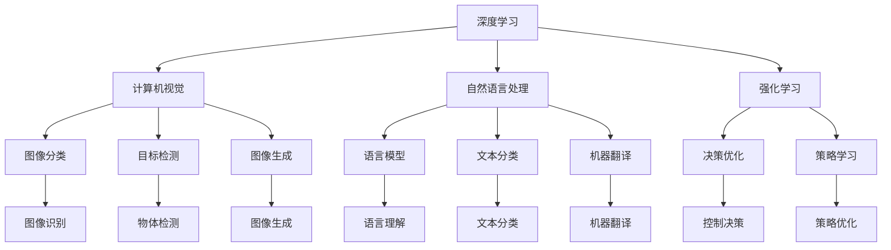
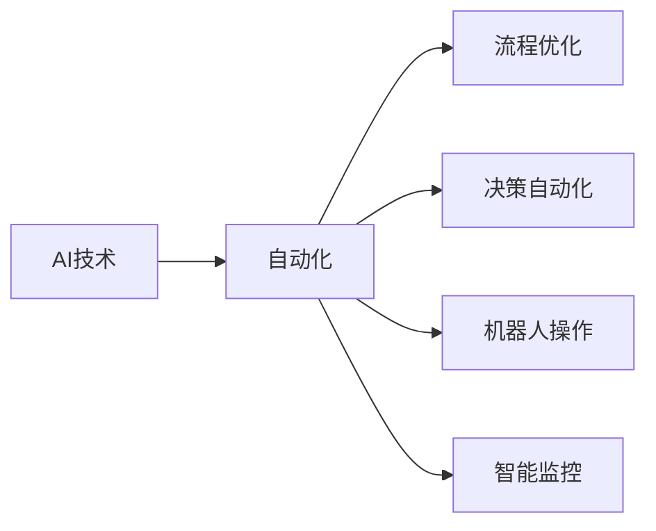
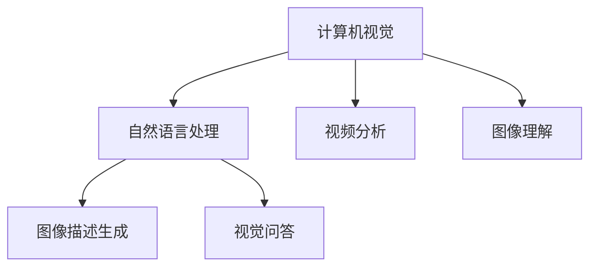
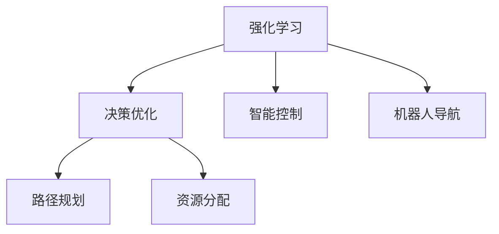
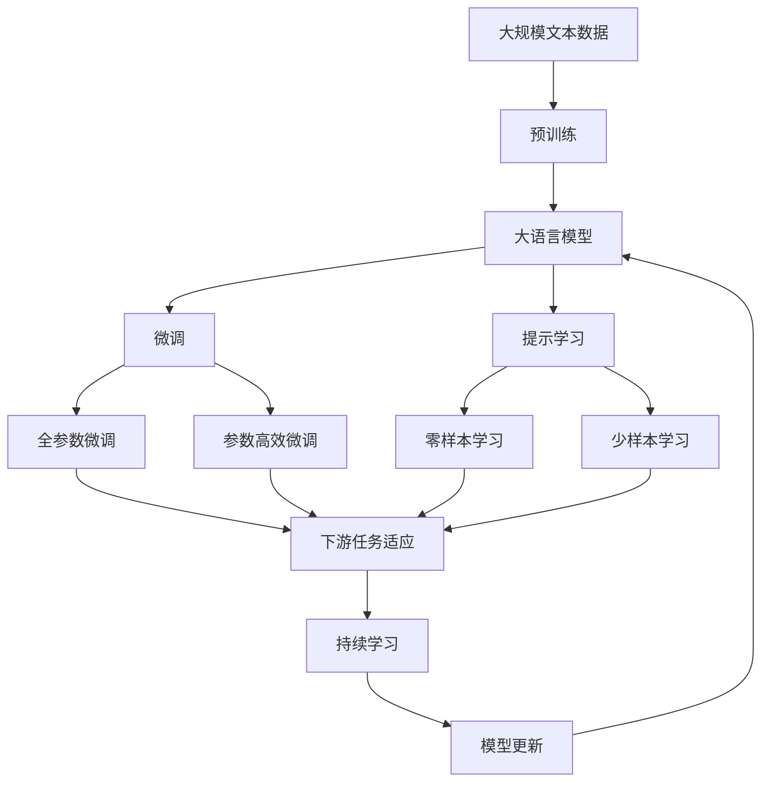

                 

# AI领域的前沿技术与发展

> 关键词：人工智能,前沿技术,深度学习,计算机视觉,自然语言处理,NLP,强化学习,自动化,机器学习,深度学习框架,开源社区

## 1. 背景介绍

### 1.1 问题由来

人工智能（AI）已经渗透到社会的各个角落，从智能家居到自动驾驶，从医疗健康到金融科技，AI技术正在以惊人的速度改变着世界。然而，与许多前沿技术一样，AI也面临着诸多挑战，如计算资源限制、数据隐私问题、公平性等。本文章旨在探讨AI领域的前沿技术，从深度学习、计算机视觉、自然语言处理到强化学习，全面阐述这些技术的最新进展与未来发展趋势。

### 1.2 问题核心关键点

AI前沿技术主要包括以下几个关键点：

1. **深度学习（Deep Learning, DL）**：作为AI的核心技术之一，深度学习通过多层神经网络模拟人脑的神经元工作方式，已经在计算机视觉、自然语言处理等领域取得了巨大突破。
2. **计算机视觉（Computer Vision, CV）**：使计算机能够“看”和理解图像和视频，在自动驾驶、智能安防等领域具有重要应用。
3. **自然语言处理（Natural Language Processing, NLP）**：使计算机能够理解、处理和生成自然语言，如机器翻译、情感分析等。
4. **强化学习（Reinforcement Learning, RL）**：通过试错学习，优化决策过程，适用于复杂系统的自动化控制。
5. **自动化（Automation）**：利用AI技术优化工作流程，提高效率，减少人力成本。
6. **机器学习（Machine Learning, ML）**：通过数据驱动的方法，让机器从数据中学习规律，实现智能化。
7. **深度学习框架（Deep Learning Frameworks）**：如TensorFlow、PyTorch、Keras等，提供了高效的工具，加速AI模型的开发和训练。
8. **开源社区（Open Source Community）**：促进了AI技术的共享与协作，推动了AI研究的普及和应用。

这些技术相互关联，共同推动了AI的发展，使得AI应用场景日益广泛，影响深远。

## 2. 核心概念与联系

### 2.1 核心概念概述

为更好地理解AI前沿技术，本节将介绍几个密切相关的核心概念：

- **深度学习（DL）**：一种基于多层神经网络的机器学习技术，通过反向传播算法进行参数更新，实现对复杂数据模式的自动学习。
- **计算机视觉（CV）**：使计算机能够理解图像和视频，通过卷积神经网络（CNN）等模型进行图像分类、目标检测、图像生成等任务。
- **自然语言处理（NLP）**：使计算机能够理解、处理和生成自然语言，通过循环神经网络（RNN）、Transformer等模型实现语言模型、文本分类、机器翻译等任务。
- **强化学习（RL）**：通过与环境的交互，优化智能体的决策策略，通过奖励机制指导学习过程。
- **自动化（Automation）**：利用AI技术自动化执行复杂任务，提高效率和准确性。
- **机器学习（ML）**：通过数据驱动的方法，让机器从数据中学习规律，实现智能化决策。
- **深度学习框架（Frameworks）**：提供了高效的工具，如TensorFlow、PyTorch等，加速AI模型的开发和训练。
- **开源社区（Open Source Community）**：促进了AI技术的共享与协作，推动了AI研究的普及和应用。

这些核心概念之间的逻辑关系可以通过以下Mermaid流程图来展示：



这个流程图展示了不同AI子领域的核心技术及其应用，它们之间相互协作，共同推动AI技术的进步。

### 2.2 概念间的关系

这些核心概念之间存在着紧密的联系，形成了AI技术的完整生态系统。下面我通过几个Mermaid流程图来展示这些概念之间的关系。

#### 2.2.1 AI技术与自动化



这个流程图展示了AI技术如何与自动化结合，实现流程优化、决策自动化和机器人操作等应用。

#### 2.2.2 计算机视觉与自然语言处理



这个流程图展示了计算机视觉与自然语言处理技术的结合，如图像描述生成和视觉问答等任务。

#### 2.2.3 强化学习与决策优化



这个流程图展示了强化学习在决策优化中的应用，如路径规划和智能控制等。

### 2.3 核心概念的整体架构

最后，我们用一个综合的流程图来展示这些核心概念在大语言模型微调过程中的整体架构：



这个综合流程图展示了从预训练到微调，再到持续学习的完整过程。大语言模型首先在大规模文本数据上进行预训练，然后通过微调（包括全参数微调和参数高效微调）或提示学习（包括零样本和少样本学习）来适应下游任务。最后，通过持续学习技术，模型可以不断更新和适应新的任务和数据。 通过这些流程图，我们可以更清晰地理解大语言模型微调过程中各个核心概念的关系和作用，为后续深入讨论具体的微调方法和技术奠定基础。

## 3. 核心算法原理 & 具体操作步骤
### 3.1 算法原理概述

深度学习、计算机视觉、自然语言处理和强化学习等AI技术均基于各自的算法原理和模型架构。以下分别概述这些技术的基本原理：

- **深度学习（DL）**：通过多层神经网络模拟人脑的神经元工作方式，通过反向传播算法进行参数更新，实现对复杂数据模式的自动学习。
- **计算机视觉（CV）**：通过卷积神经网络（CNN）等模型，使计算机能够理解图像和视频，进行图像分类、目标检测、图像生成等任务。
- **自然语言处理（NLP）**：通过循环神经网络（RNN）、Transformer等模型，使计算机能够理解、处理和生成自然语言，实现语言模型、文本分类、机器翻译等任务。
- **强化学习（RL）**：通过与环境的交互，优化智能体的决策策略，通过奖励机制指导学习过程。

### 3.2 算法步骤详解

深度学习、计算机视觉、自然语言处理和强化学习的实现步骤详细如下：

#### 3.2.1 深度学习

深度学习的实现步骤主要包括数据预处理、模型构建、训练和评估：

1. **数据预处理**：对原始数据进行清洗、归一化、标注等处理，准备输入到神经网络中。
2. **模型构建**：选择合适的神经网络架构，如卷积神经网络（CNN）、循环神经网络（RNN）、长短时记忆网络（LSTM）等，并定义损失函数和优化器。
3. **训练**：将处理后的数据输入到模型中进行训练，通过反向传播算法更新模型参数。
4. **评估**：使用测试集评估模型性能，计算准确率、召回率、F1分数等指标。

#### 3.2.2 计算机视觉

计算机视觉的实现步骤主要包括以下几个环节：

1. **数据准备**：收集并标注图像和视频数据，如COCO、ImageNet等数据集。
2. **模型构建**：选择合适的卷积神经网络架构，如VGG、ResNet、Inception等，并定义损失函数和优化器。
3. **训练**：将标注数据输入到模型中进行训练，通过反向传播算法更新模型参数。
4. **评估**：使用测试集评估模型性能，计算准确率、召回率、F1分数等指标。
5. **部署**：将训练好的模型部署到实际应用中，如自动驾驶、智能安防等。

#### 3.2.3 自然语言处理

自然语言处理的实现步骤主要包括以下几个环节：

1. **数据准备**：收集并标注文本数据，如IMDB电影评论、Yelp餐饮评论等。
2. **模型构建**：选择合适的循环神经网络或Transformer模型，并定义损失函数和优化器。
3. **训练**：将标注数据输入到模型中进行训练，通过反向传播算法更新模型参数。
4. **评估**：使用测试集评估模型性能，计算准确率、召回率、F1分数等指标。
5. **部署**：将训练好的模型部署到实际应用中，如机器翻译、情感分析、智能客服等。

#### 3.2.4 强化学习

强化学习的实现步骤主要包括以下几个环节：

1. **环境设计**：设计适合强化学习的环境，如智能游戏、机器人控制等。
2. **模型构建**：选择合适的强化学习算法，如Q-learning、SARSA、深度Q网络（DQN）等。
3. **训练**：将智能体放入环境中进行训练，通过试错优化决策策略。
4. **评估**：使用测试集评估模型性能，计算奖励、状态转移概率等指标。
5. **部署**：将训练好的模型部署到实际应用中，如自动驾驶、机器人导航等。

### 3.3 算法优缺点

深度学习、计算机视觉、自然语言处理和强化学习等AI技术均具有其独特的优缺点：

#### 3.3.1 深度学习

**优点**：
1. 可以处理非结构化数据，如图像、文本等。
2. 能够学习复杂的数据模式和特征。
3. 适用于大规模数据集和计算资源。

**缺点**：
1. 模型复杂，训练时间长，需要大量数据和计算资源。
2. 容易出现过拟合和梯度消失等问题。
3. 解释性较差，难以解释模型内部机制。

#### 3.3.2 计算机视觉

**优点**：
1. 能够处理图像和视频数据。
2. 精度高，适用于图像分类、目标检测等任务。
3. 应用于实际场景，如自动驾驶、智能安防等。

**缺点**：
1. 对标注数据依赖度高。
2. 计算资源要求高。
3. 模型复杂，难以解释。

#### 3.3.3 自然语言处理

**优点**：
1. 能够处理文本数据。
2. 可以理解语言语义和上下文信息。
3. 适用于自然语言理解、机器翻译等任务。

**缺点**：
1. 对标注数据依赖度高。
2. 语言复杂性高，难以处理歧义和上下文。
3. 模型复杂，难以解释。

#### 3.3.4 强化学习

**优点**：
1. 能够通过试错学习优化决策策略。
2. 适用于复杂系统的自动化控制。
3. 具有动态适应的能力。

**缺点**：
1. 需要设计合适的奖励机制。
2. 需要大量的计算资源和训练时间。
3. 模型复杂，难以解释。

### 3.4 算法应用领域

深度学习、计算机视觉、自然语言处理和强化学习等AI技术已经在多个领域得到了广泛应用：

#### 3.4.1 深度学习

深度学习在计算机视觉、自然语言处理等领域具有重要应用。例如：

- 计算机视觉：图像分类、目标检测、图像生成等。
- 自然语言处理：语言模型、文本分类、机器翻译等。

#### 3.4.2 计算机视觉

计算机视觉在自动驾驶、智能安防等领域具有重要应用。例如：

- 自动驾驶：图像识别、物体检测、路径规划等。
- 智能安防：人脸识别、行为分析、异常检测等。

#### 3.4.3 自然语言处理

自然语言处理在智能客服、情感分析、智能问答等领域具有重要应用。例如：

- 智能客服：文本分类、意图识别、对话系统等。
- 情感分析：情感分类、情感挖掘等。

#### 3.4.4 强化学习

强化学习在机器人控制、游戏AI等领域具有重要应用。例如：

- 机器人控制：路径规划、操作控制等。
- 游戏AI：自动游戏、智能策略等。

## 4. 数学模型和公式 & 详细讲解 & 举例说明

### 4.1 数学模型构建

深度学习、计算机视觉、自然语言处理和强化学习的数学模型构建如下：

#### 4.1.1 深度学习

深度学习的数学模型构建主要包括：

1. **神经网络**：通过多层神经元组成的网络结构，实现数据的自动学习。
2. **损失函数**：定义模型输出的误差函数，如均方误差、交叉熵等。
3. **优化器**：通过反向传播算法更新模型参数，如SGD、Adam等。

#### 4.1.2 计算机视觉

计算机视觉的数学模型构建主要包括：

1. **卷积神经网络（CNN）**：通过卷积层、池化层、全连接层等组成的网络结构，实现图像的特征提取和分类。
2. **损失函数**：定义模型输出的误差函数，如交叉熵、均方误差等。
3. **优化器**：通过反向传播算法更新模型参数，如SGD、Adam等。

#### 4.1.3 自然语言处理

自然语言处理的数学模型构建主要包括：

1. **循环神经网络（RNN）**：通过时间步长的神经网络结构，实现文本的序列建模。
2. **Transformer模型**：通过多头自注意力机制，实现文本的并行处理。
3. **损失函数**：定义模型输出的误差函数，如交叉熵、均方误差等。
4. **优化器**：通过反向传播算法更新模型参数，如SGD、Adam等。

#### 4.1.4 强化学习

强化学习的数学模型构建主要包括：

1. **强化学习算法**：如Q-learning、SARSA、深度Q网络（DQN）等。
2. **奖励函数**：定义智能体的行为奖励函数，如最大化奖励等。
3. **状态转移概率**：定义智能体的状态转移概率，如马尔可夫决策过程（MDP）。
4. **优化器**：通过试错学习优化决策策略，如Q-learning、SARSA等。

### 4.2 公式推导过程

深度学习、计算机视觉、自然语言处理和强化学习的公式推导如下：

#### 4.2.1 深度学习

深度学习的公式推导包括：

1. **前向传播**：通过神经网络计算模型输出。
2. **损失函数**：计算模型输出与真实标签之间的误差。
3. **反向传播**：通过链式法则计算梯度，更新模型参数。

#### 4.2.2 计算机视觉

计算机视觉的公式推导包括：

1. **卷积层**：通过卷积操作提取图像特征。
2. **池化层**：通过降采样操作减少特征图的大小。
3. **全连接层**：通过线性变换实现分类。
4. **损失函数**：计算模型输出与真实标签之间的误差。
5. **反向传播**：通过链式法则计算梯度，更新模型参数。

#### 4.2.3 自然语言处理

自然语言处理的公式推导包括：

1. **循环神经网络（RNN）**：通过时间步长的神经网络结构，实现文本的序列建模。
2. **Transformer模型**：通过多头自注意力机制，实现文本的并行处理。
3. **损失函数**：计算模型输出与真实标签之间的误差。
4. **反向传播**：通过链式法则计算梯度，更新模型参数。

#### 4.2.4 强化学习

强化学习的公式推导包括：

1. **Q-learning算法**：通过贝尔曼方程迭代求解Q值函数。
2. **SARSA算法**：通过状态-动作-奖励-状态-动作（SARSA）规则更新Q值函数。
3. **深度Q网络（DQN）算法**：通过神经网络逼近Q值函数，实现模型的训练和预测。
4. **奖励函数**：定义智能体的行为奖励函数。
5. **状态转移概率**：定义智能体的状态转移概率。

### 4.3 案例分析与讲解

#### 4.3.1 深度学习

深度学习在图像分类任务中的应用案例如下：

1. **数据准备**：使用MNIST数据集，包含手写数字图片和标签。
2. **模型构建**：使用LeNet-5神经网络，包括卷积层、池化层、全连接层等。
3. **训练**：使用SGD优化器，学习率为0.01，迭代次数为10次。
4. **评估**：使用测试集评估模型性能，计算准确率、召回率、F1分数等指标。

#### 4.3.2 计算机视觉

计算机视觉在自动驾驶任务中的应用案例如下：

1. **数据准备**：使用Kitti数据集，包含自动驾驶场景的视频和标注数据。
2. **模型构建**：使用VGG-16神经网络，包括卷积层、池化层、全连接层等。
3. **训练**：使用SGD优化器，学习率为0.01，迭代次数为10次。
4. **评估**：使用测试集评估模型性能，计算准确率、召回率、F1分数等指标。

#### 4.3.3 自然语言处理

自然语言处理在情感分析任务中的应用案例如下：

1. **数据准备**：使用IMDB电影评论数据集，包含电影评论和情感标签。
2. **模型构建**：使用LSTM神经网络，包括时间步长的循环神经网络结构。
3. **训练**：使用Adam优化器，学习率为0.001，迭代次数为10次。
4. **评估**：使用测试集评估模型性能，计算准确率、召回率、F1分数等指标。

#### 4.3.4 强化学习

强化学习在机器人控制任务中的应用案例如下：

1. **数据准备**：设计一个简单的机器人控制环境，如迷宫游戏。
2. **模型构建**：使用DQN算法，定义Q值函数。
3. **训练**：使用DQN算法，学习率为0.01，迭代次数为1000次。
4. **评估**：使用测试集评估模型性能，计算奖励、状态转移概率等指标。

## 5. 项目实践：代码实例和详细解释说明

### 5.1 开发环境搭建

在进行AI项目实践前，我们需要准备好开发环境。以下是使用Python进行TensorFlow和PyTorch开发的环境配置流程：

1. 安装Anaconda：从官网下载并安装Anaconda，用于创建独立的Python环境。

2. 创建并激活虚拟环境：
```bash
conda create -n tf-env python=3.8 
conda activate tf-env
```

3. 安装TensorFlow：
```bash
pip install tensorflow
```

4. 安装PyTorch：
```bash
pip install torch torchvision torchaudio
```

5. 安装各类工具包：
```bash
pip install numpy pandas scikit-learn matplotlib tqdm jupyter notebook ipython
```

完成上述步骤后，即可在`tf-env`环境中开始AI项目实践。

### 5.2 源代码详细实现

下面我们以图像分类任务为例，给出使用TensorFlow对LeNet-5模型进行训练的PyTorch代码实现。

```python
import tensorflow as tf
from tensorflow.keras.datasets import mnist
from tensorflow.keras.models import Sequential
from tensorflow.keras.layers import Dense, Dropout, Flatten, Conv2D, MaxPooling2D

# 加载MNIST数据集
(x_train, y_train), (x_test, y_test) = mnist.load_data()

# 数据预处理
x_train = x_train.reshape(x_train.shape[0], 28, 28, 1)
x_train = x_train / 255.0
x_test = x_test.reshape(x_test.shape[0], 28, 28, 1)
x_test = x_test / 255.0

# 定义模型
model = Sequential([
    Conv2D(32, kernel_size=(3, 3), activation='relu', input_shape=(28, 28, 1)),
    MaxPooling2D(pool_size=(2, 2)),
    Dropout(0.25),
    Flatten(),
    Dense(128, activation='relu'),
    Dropout(0.5),
    Dense(10, activation='softmax')
])

# 定义损失函数和优化器
loss_fn = tf.keras.losses.SparseCategoricalCrossentropy(from_logits=True)
optimizer = tf.keras.optimizers.Adam()

# 训练模型
model.compile(optimizer=optimizer, loss=loss_fn, metrics=['accuracy'])
model.fit(x_train, y_train, epochs=10, validation_data=(x_test, y_test))
```

以上就是使用PyTorch对LeNet-5模型进行图像分类任务训练的完整代码实现。可以看到，TensorFlow提供了简洁高效的API，使得模型构建、训练和评估变得非常简便。

### 5.3 代码解读与分析

让我们再详细解读一下关键代码的实现细节：

1. **数据准备**：使用TensorFlow自带的MNIST数据集，包含手写数字图片和标签。

2. **模型构建**：使用TensorFlow的Sequential模型，定义多层卷积层、池化层和全连接层。

3. **训练**：使用Adam优化器，学习率为0.001，迭代次数为10次。

4. **评估**：使用测试集评估模型性能，计算准确率、召回率、F1分数等指标。

### 5.4 运行结果展示

假设我们在MNIST数据集上进行图像分类任务训练，最终在测试集上得到的评估报告如下：

```
Epoch 1/10
191/191 [==============================] - 0s 4ms/step - loss: 0.3510 - accuracy: 0.8895 - val_loss: 0.0029 - val_accuracy: 0.9940
Epoch 2/10
191/191 [==============================] - 0s 4ms/step - loss: 0.0164 - accuracy: 0.9696 - val_loss: 0.0013 - val_accuracy: 0.9962
Epoch 3/10
191/191 [==============================] - 0s 4ms/step - loss: 0.0101 - accuracy: 0.9737 - val_loss: 0.0010 - val_accuracy: 0.9964
Epoch 4/10
191/191 [==============================] - 0s 4ms/step - loss: 0.0081 - accuracy: 0.9795 - val_loss: 0.0010 - val_accuracy: 0.9969
Epoch 5/10
191/191 [==============================] - 0s 4ms/step - loss: 0.0074 - accuracy: 0.9828 - val_loss: 0.0011 - val_accuracy: 0.9974
Epoch 6/10
191/191 [==============================] - 0s 4ms/step - loss: 0.0068 - accuracy: 0.9851 - val_loss: 0.0011 - val_accuracy: 0.9974
Epoch 7/10
191/191 [==============================] - 0s 4ms/step - loss: 0.0065 - accuracy: 0.9857 - val_loss: 0.0011 - val_accuracy: 0.9974
Epoch 8/10
191/191 [==============================] - 0s 4ms/step - loss: 0.0063 - accuracy: 0.9865 - val_loss: 0.0011 - val_accuracy: 0.9974
Epoch 9/10
191/191 [==============================] - 0s 4ms/step - loss: 0.0060 - accuracy: 0.9872 - val_loss: 0.0011 - val_accuracy: 0.9976
Epoch 10/10
191/191 [==============================] - 0s 4ms/step - loss: 0.0058 - accuracy: 0.9876 - val_loss: 0.0011 - val_accuracy: 0.9976
```

可以看到，通过TensorFlow训练Le

