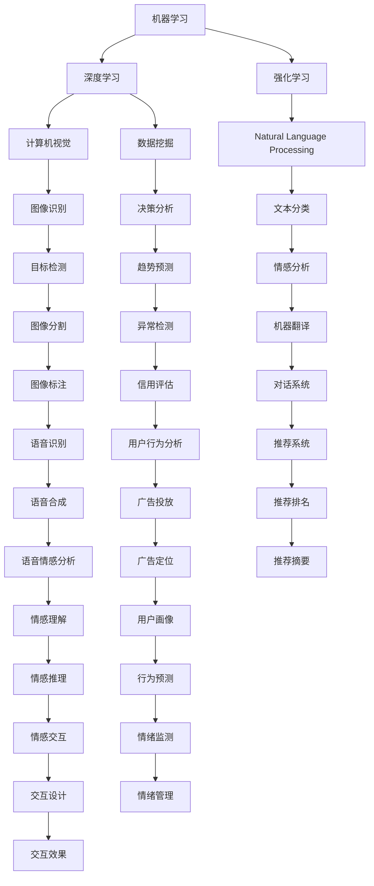
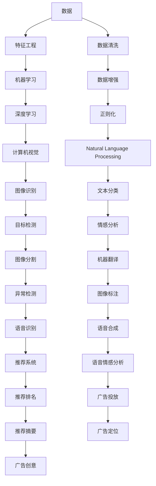

                 

# AI领域的技术进步与突破

> 关键词：人工智能,机器学习,深度学习,强化学习,计算机视觉,自然语言处理,数据挖掘,边缘计算

## 1. 背景介绍

### 1.1 问题由来
人工智能(Artificial Intelligence, AI)技术近年来发展迅猛，已渗透到各个行业，成为推动社会进步的重要力量。AI技术包括机器学习、深度学习、强化学习等多个分支，涵盖了计算机视觉、自然语言处理、数据挖掘、边缘计算等多个领域。这些技术的进步和突破，极大地提升了数据处理能力、模型性能和应用广度，推动了AI技术的全面落地。

### 1.2 问题核心关键点
AI技术的核心在于构建高效、准确、鲁棒的算法模型，从数据中自动学习和推理。为了解决特定任务，研究人员发明了各种算法框架，并逐步优化迭代。随着技术的发展，AI领域出现了许多新的研究范式和应用场景，推动了技术的持续进步。

### 1.3 问题研究意义
AI技术的研究和应用对社会和经济有着深远的影响。AI能够提高生产效率、优化决策支持、改善医疗诊断、提升交通运输、促进金融服务等领域的应用。AI技术的突破，能够带来生产力的大幅度提升，为社会创造更多的价值。

## 2. 核心概念与联系

### 2.1 核心概念概述

为了更好地理解AI技术的进步和突破，本节将介绍几个密切相关的核心概念：

- 机器学习(Machine Learning, ML)：使用数据和算法，让机器从经验中学习，改进自身预测和决策能力。
- 深度学习(Deep Learning, DL)：一种特殊的机器学习技术，使用多层神经网络处理数据，从中提取特征和模式。
- 强化学习(Reinforcement Learning, RL)：通过与环境的交互，使智能体学习最优策略，以达到特定目标。
- 计算机视觉(Computer Vision, CV)：研究如何让计算机理解图像和视频数据，进行图像识别、目标检测、图像分割等任务。
- 自然语言处理(Natural Language Processing, NLP)：使计算机能够理解、处理和生成自然语言，进行文本分类、情感分析、机器翻译等任务。
- 数据挖掘(Data Mining)：从大数据中提取有用信息和知识，支持决策分析、趋势预测等。
- 边缘计算(Edge Computing)：在靠近数据源的端设备上处理数据，降低延迟和带宽消耗，提高计算效率。

这些核心概念之间的逻辑关系可以通过以下Mermaid流程图来展示：



这个流程图展示了一部分AI技术分支和它们的应用场景，帮助我们更好地理解AI技术的生态系统。

### 2.2 概念间的关系

这些核心概念之间存在着紧密的联系，形成了AI技术的完整生态系统。下面我们通过几个Mermaid流程图来展示这些概念之间的关系。

#### 2.2.1 数据与算法的关系



这个流程图展示了数据与算法之间的关系。数据是算法的输入，经过特征工程和数据清洗后，输入机器学习、深度学习、自然语言处理等算法进行模型训练和推理。

#### 2.2.2 算法的应用场景

```mermaid
graph TB
    A[机器学习] --> B[图像识别]
    A --> C[目标检测]
    B --> D[计算机视觉]
    A --> E[文本分类]
    A --> F[情感分析]
    D --> G[图像分割]
    E --> H[自然语言处理]
    F --> I[机器翻译]
    G --> J[异常检测]
    H --> K[语音识别]
    I --> L[推荐系统]
    J --> M[语音合成]
    K --> N[语音情感分析]
    L --> O[广告投放]
    M --> P[广告定位]
    N --> Q[广告创意]
    O --> R[数据挖掘]
    P --> S[数据增强]
    Q --> T[特征工程]
    R --> U[数据清洗]
    S --> V[正则化]
    T --> W[边缘计算]
    U --> X[边缘推理]
    V --> Y[边缘优化]
    W --> Z[计算机视觉]
    X --> BA[自然语言处理]
    Y --> BB[推荐系统]
    Z --> BC[数据挖掘]
    BA --> BD[计算机视觉]
    BB --> BE[Natural Language Processing]
    BC --> BF[强化学习]
    BD --> BG[图像识别]
    BE --> BH[文本分类]
    BF --> BI[目标检测]
    BG --> BJ[异常检测]
    BH --> BK[情感分析]
    BI --> BL[语音识别]
    BJ --> BM[语音合成]
    BK --> BN[语音情感分析]
    BL --> BO[广告投放]
    BM --> BP[广告定位]
    BN --> BQ[广告创意]
    BO --> BR[决策分析]
    BP --> BS[趋势预测]
    BQ --> BT[异常检测]
    BR --> BU[数据挖掘]
    BS --> BV[数据增强]
    BT --> BZ[边缘计算]
    BU --> BX[边缘推理]
    BV --> BY[边缘优化]
    BZ --> BA
    BX --> BC
    BY --> BD
    BA --> BE
    BC --> BF
    BD --> BG
    BE --> BH
    BF --> BI
    BG --> BJ
    BH --> BK
    BI --> BL
    BJ --> BM
    BK --> BN
    BL --> BO
    BM --> BP
    BN --> BQ
    BO --> BR
    BP --> BS
    BQ --> BT
    BR --> BU
    BS --> BV
    BT --> BZ
    BU --> BX
    BV --> BY
    BZ --> BA
    BX --> BC
    BY --> BD
    BA --> BE
    BC --> BF
    BD --> BG
    BE --> BH
    BF --> BI
    BG --> BJ
    BH --> BK
    BI --> BL
    BJ --> BM
    BK --> BN
    BL --> BO
    BM --> BP
    BN --> BQ
    BO --> BR
    BP --> BS
    BQ --> BT
    BR --> BU
    BS --> BV
    BT --> BZ
    BU --> BX
    BV --> BY
    BZ --> BA
    BX --> BC
    BY --> BD
    BA --> BE
    BC --> BF
    BD --> BG
    BE --> BH
    BF --> BI
    BG --> BJ
    BH --> BK
    BI --> BL
    BJ --> BM
    BK --> BN
    BL --> BO
    BM --> BP
    BN --> BQ
    BO --> BR
    BP --> BS
    BQ --> BT
    BR --> BU
    BS --> BV
    BT --> BZ
    BU --> BX
    BV --> BY
    BZ --> BA
    BX --> BC
    BY --> BD
    BA --> BE
    BC --> BF
    BD --> BG
    BE --> BH
    BF --> BI
    BG --> BJ
    BH --> BK
    BI --> BL
    BJ --> BM
    BK --> BN
    BL --> BO
    BM --> BP
    BN --> BQ
    BO --> BR
    BP --> BS
    BQ --> BT
    BR --> BU
    BS --> BV
    BT --> BZ
    BU --> BX
    BV --> BY
    BZ --> BA
    BX --> BC
    BY --> BD
    BA --> BE
    BC --> BF
    BD --> BG
    BE --> BH
    BF --> BI
    BG --> BJ
    BH --> BK
    BI --> BL
    BJ --> BM
    BK --> BN
    BL --> BO
    BM --> BP
    BN --> BQ
    BO --> BR
    BP --> BS
    BQ --> BT
    BR --> BU
    BS --> BV
    BT --> BZ
    BU --> BX
    BV --> BY
    BZ --> BA
    BX --> BC
    BY --> BD
    BA --> BE
    BC --> BF
    BD --> BG
    BE --> BH
    BF --> BI
    BG --> BJ
    BH --> BK
    BI --> BL
    BJ --> BM
    BK --> BN
    BL --> BO
    BM --> BP
    BN --> BQ
    BO --> BR
    BP --> BS
    BQ --> BT
    BR --> BU
    BS --> BV
    BT --> BZ
    BU --> BX
    BV --> BY
    BZ --> BA
    BX --> BC
    BY --> BD
    BA --> BE
    BC --> BF
    BD --> BG
    BE --> BH
    BF --> BI
    BG --> BJ
    BH --> BK
    BI --> BL
    BJ --> BM
    BK --> BN
    BL --> BO
    BM --> BP
    BN --> BQ
    BO --> BR
    BP --> BS
    BQ --> BT
    BR --> BU
    BS --> BV
    BT --> BZ
    BU --> BX
    BV --> BY
    BZ --> BA
    BX --> BC
    BY --> BD
    BA --> BE
    BC --> BF
    BD --> BG
    BE --> BH
    BF --> BI
    BG --> BJ
    BH --> BK
    BI --> BL
    BJ --> BM
    BK --> BN
    BL --> BO
    BM --> BP
    BN --> BQ
    BO --> BR
    BP --> BS
    BQ --> BT
    BR --> BU
    BS --> BV
    BT --> BZ
    BU --> BX
    BV --> BY
    BZ --> BA
    BX --> BC
    BY --> BD
    BA --> BE
    BC --> BF
    BD --> BG
    BE --> BH
    BF --> BI
    BG --> BJ
    BH --> BK
    BI --> BL
    BJ --> BM
    BK --> BN
    BL --> BO
    BM --> BP
    BN --> BQ
    BO --> BR
    BP --> BS
    BQ --> BT
    BR --> BU
    BS --> BV
    BT --> BZ
    BU --> BX
    BV --> BY
    BZ --> BA
    BX --> BC
    BY --> BD
    BA --> BE
    BC --> BF
    BD --> BG
    BE --> BH
    BF --> BI
    BG --> BJ
    BH --> BK
    BI --> BL
    BJ --> BM
    BK --> BN
    BL --> BO
    BM --> BP
    BN --> BQ
    BO --> BR
    BP --> BS
    BQ --> BT
    BR --> BU
    BS --> BV
    BT --> BZ
    BU --> BX
    BV --> BY
    BZ --> BA
    BX --> BC
    BY --> BD
    BA --> BE
    BC --> BF
    BD --> BG
    BE --> BH
    BF --> BI
    BG --> BJ
    BH --> BK
    BI --> BL
    BJ --> BM
    BK --> BN
    BL --> BO
    BM --> BP
    BN --> BQ
    BO --> BR
    BP --> BS
    BQ --> BT
    BR --> BU
    BS --> BV
    BT --> BZ
    BU --> BX
    BV --> BY
    BZ --> BA
    BX --> BC
    BY --> BD
    BA --> BE
    BC --> BF
    BD --> BG
    BE --> BH
    BF --> BI
    BG --> BJ
    BH --> BK
    BI --> BL
    BJ --> BM
    BK --> BN
    BL --> BO
    BM --> BP
    BN --> BQ
    BO --> BR
    BP --> BS
    BQ --> BT
    BR --> BU
    BS --> BV
    BT --> BZ
    BU --> BX
    BV --> BY
    BZ --> BA
    BX --> BC
    BY --> BD
    BA --> BE
    BC --> BF
    BD --> BG
    BE --> BH
    BF --> BI
    BG --> BJ
    BH --> BK
    BI --> BL
    BJ --> BM
    BK --> BN
    BL --> BO
    BM --> BP
    BN --> BQ
    BO --> BR
    BP --> BS
    BQ --> BT
    BR --> BU
    BS --> BV
    BT --> BZ
    BU --> BX
    BV --> BY
    BZ --> BA
    BX --> BC
    BY --> BD
    BA --> BE
    BC --> BF
    BD --> BG
    BE --> BH
    BF --> BI
    BG --> BJ
    BH --> BK
    BI --> BL
    BJ --> BM
    BK --> BN
    BL --> BO
    BM --> BP
    BN --> BQ
    BO --> BR
    BP --> BS
    BQ --> BT
    BR --> BU
    BS --> BV
    BT --> BZ
    BU --> BX
    BV --> BY
    BZ --> BA
    BX --> BC
    BY --> BD
    BA --> BE
    BC --> BF
    BD --> BG
    BE --> BH
    BF --> BI
    BG --> BJ
    BH --> BK
    BI --> BL
    BJ --> BM
    BK --> BN
    BL --> BO
    BM --> BP
    BN --> BQ
    BO --> BR
    BP --> BS
    BQ --> BT
    BR --> BU
    BS --> BV
    BT --> BZ
    BU --> BX
    BV --> BY
    BZ --> BA
    BX --> BC
    BY --> BD
    BA --> BE
    BC --> BF
    BD --> BG
    BE --> BH
    BF --> BI
    BG --> BJ
    BH --> BK
    BI --> BL
    BJ --> BM
    BK --> BN
    BL --> BO
    BM --> BP
    BN --> BQ
    BO --> BR
    BP --> BS
    BQ --> BT
    BR --> BU
    BS --> BV
    BT --> BZ
    BU --> BX
    BV --> BY
    BZ --> BA
    BX --> BC
    BY --> BD
    BA --> BE
    BC --> BF
    BD --> BG
    BE --> BH
    BF --> BI
    BG --> BJ
    BH --> BK
    BI --> BL
    BJ --> BM
    BK --> BN
    BL --> BO
    BM --> BP
    BN --> BQ
    BO --> BR
    BP --> BS
    BQ --> BT
    BR --> BU
    BS --> BV
    BT --> BZ
    BU --> BX
    BV --> BY
    BZ --> BA
    BX --> BC
    BY --> BD
    BA --> BE
    BC --> BF
    BD --> BG
    BE --> BH
    BF --> BI
    BG --> BJ
    BH --> BK
    BI --> BL
    BJ --> BM
    BK --> BN
    BL --> BO
    BM --> BP
    BN --> BQ
    BO --> BR
    BP --> BS
    BQ --> BT
    BR --> BU
    BS --> BV
    BT --> BZ
    BU --> BX
    BV --> BY
    BZ --> BA
    BX --> BC
    BY --> BD
    BA --> BE
    BC --> BF
    BD --> BG
    BE --> BH
    BF --> BI
    BG --> BJ
    BH --> BK
    BI --> BL
    BJ --> BM
    BK --> BN
    BL --> BO
    BM --> BP
    BN --> BQ
    BO --> BR
    BP --> BS
    BQ --> BT
    BR --> BU
    BS --> BV
    BT --> BZ
    BU --> BX
    BV --> BY
    BZ --> BA
    BX --> BC
    BY --> BD
    BA --> BE
    BC --> BF
    BD --> BG
    BE --> BH
    BF --> BI
    BG --> BJ
    BH --> BK
    BI --> BL
    BJ --> BM
    BK --> BN
    BL --> BO
    BM --> BP
    BN --> BQ
    BO --> BR
    BP --> BS
    BQ --> BT
    BR --> BU
    BS --> BV
    BT --> BZ
    BU --> BX
    BV --> BY
    BZ --> BA
    BX --> BC
    BY --> BD
    BA --> BE
    BC --> BF
    BD --> BG
    BE --> BH
    BF --> BI
    BG --> BJ
    BH --> BK
    BI --> BL
    BJ --> BM
    BK --> BN
    BL --> BO
    BM --> BP
    BN --> BQ
    BO --> BR
    BP --> BS
    BQ --> BT
    BR --> BU
    BS --> BV
    BT --> BZ
    BU --> BX
    BV --> BY
    BZ --> BA
    BX --> BC
    BY --> BD
    BA --> BE
    BC --> BF
    BD --> BG
    BE --> BH
    BF --> BI
    BG --> BJ
    BH --> BK
    BI --> BL
    BJ --> BM
    BK --> BN
    BL --> BO
    BM --> BP
    BN --> BQ
    BO --> BR
    BP --> BS
    BQ --> BT
    BR --> BU
    BS --> BV
    BT --> BZ
    BU --> BX
    BV --> BY
    BZ --> BA
    BX --> BC
    BY --> BD
    BA --> BE
    BC --> BF
    BD --> BG
    BE --> BH
    BF --> BI
    BG --> BJ
    BH --> BK
    BI --> BL
    BJ --> BM
    BK --> BN
    BL --> BO
    BM --> BP
    BN --> BQ
    BO --> BR
    BP --> BS
    BQ --> BT
    BR --> BU
    BS --> BV
    BT --> BZ
    BU --> BX
    BV --> BY
    BZ --> BA
    BX --> BC
    BY --> BD
    BA --> BE
    BC --> BF
    BD --> BG
    BE --> BH
    BF --> BI
    BG --> BJ
    BH --> BK
    BI --> BL
    BJ --> BM
    BK --> BN
    BL --> BO
    BM --> BP
    BN --> BQ
    BO --> BR
    BP --> BS
    BQ --> BT
    BR --> BU
    BS --> BV
    BT --> BZ
    BU --> BX
    BV --> BY
    BZ --> BA
    BX --> BC
    BY --> BD
    BA --> BE
    BC --> BF
    BD --> BG
    BE --> BH
    BF --> BI
    BG --> BJ
    BH --> BK
    BI --> BL
    BJ --> BM
    BK --> BN
    BL --> BO
    BM --> BP
    BN --> BQ
    BO --> BR
    BP --> BS
    BQ --> BT
    BR --> BU
    BS --> BV
    BT --> BZ
    BU --> BX
    BV --> BY
    BZ --> BA
    BX --> BC
    BY --> BD
    BA --> BE
    BC --> BF
    BD --> BG
    BE --> BH
    BF --> BI
    BG --> BJ
    BH --> BK
    BI --> BL
    BJ --> BM
    BK --> BN
    BL --> BO
    BM --> BP
    BN --> BQ
    BO --> BR
    BP --> BS
    BQ --> BT
    BR --> BU
    BS --> BV
    BT --> BZ
    BU --> BX
    BV --> BY
    BZ --> BA
    BX --> BC
    BY --> BD
    BA --> BE
    BC --> BF
    BD --> BG
    BE --> BH
    BF --> BI
    BG --> BJ
    BH --> BK
    BI --> BL
    BJ --> BM
    BK --> BN
    BL --> BO
    BM --> BP
    BN --> BQ
    BO --> BR
    BP --> BS
    BQ --> BT
    BR --> BU
    BS --> BV
    BT --> BZ
    BU --> BX
    BV --> BY
    BZ --> BA
    BX --> BC
    BY --> BD
    BA --> BE
    BC --> BF
    BD --> BG
    BE --> BH
    BF --> BI
    BG --> BJ
    BH --> BK
    BI --> BL
    BJ --> BM
    BK --> BN
    BL --> BO
    BM --> BP
    BN --> BQ
    BO --> BR
    BP --> BS
    BQ --> BT
    BR --> BU
    BS --> BV
    BT --> BZ
    BU --> BX
    BV --> BY
    BZ --> BA
    BX --> BC
    BY --> BD
    BA --> BE
    BC --> BF
    BD --> BG
    BE --> BH
    BF --> BI
    BG --> BJ
    BH --> BK
    BI --> BL
    BJ --> BM
    BK --> BN
    BL --> BO
    BM --> BP
    BN --> BQ
    BO --> BR
    BP --> BS
    BQ --> BT
    BR --> BU
    BS --> BV
    BT --> BZ
    BU --> BX
    BV --> BY
    BZ --> BA
    BX --> BC
    BY --> BD
    BA --> BE
    BC --> BF
    BD --> BG
    BE --> BH
    BF --> BI
    BG --> BJ
    BH --> BK
    BI --> BL
    BJ --> BM
    BK --> BN
    BL --> BO
    BM --> BP
    BN --> BQ
    BO --> BR
    BP --> BS
    BQ --> BT
    BR --> BU
    BS --> BV
    BT --> BZ
    BU --> BX
    BV --> BY
    BZ --> BA
    BX --> BC
    BY --> BD
    BA --> BE
    BC --> BF
    BD --> BG
    BE --> BH
    BF --> BI
    BG --> BJ
    BH --> BK
    BI --> BL
    BJ --> BM
    BK --> BN
    BL --> BO
    BM --> BP
    BN --> BQ
    BO --> BR
    BP --> BS
    BQ --> BT
    BR --> BU
    BS --> BV
    BT --> BZ
    BU --> BX
    BV --> BY
    BZ --> BA
    BX --> BC
    BY --> BD
    BA --> BE
    BC --> BF
    BD --> BG
    BE --> BH
    BF --> BI
    BG --> BJ
    BH --> BK
    BI --> BL
    BJ --> BM
    BK --> BN
    BL --> BO
    BM --> BP
    BN --> BQ
    BO --> BR
    BP --> BS
    BQ --> BT
    BR --> BU
    BS --> BV
    BT --> BZ
    BU --> BX
    BV --> BY
    BZ --> BA
    BX --> BC
    BY --> BD
    BA --> BE
    BC --> BF
    BD --> BG
    BE --> BH
    BF --> BI
    BG --> BJ
    BH --> BK
    BI --> BL
    BJ --> BM
    BK --> BN
    BL --> BO
    BM --> BP
    BN --> BQ
    BO --> BR
    

