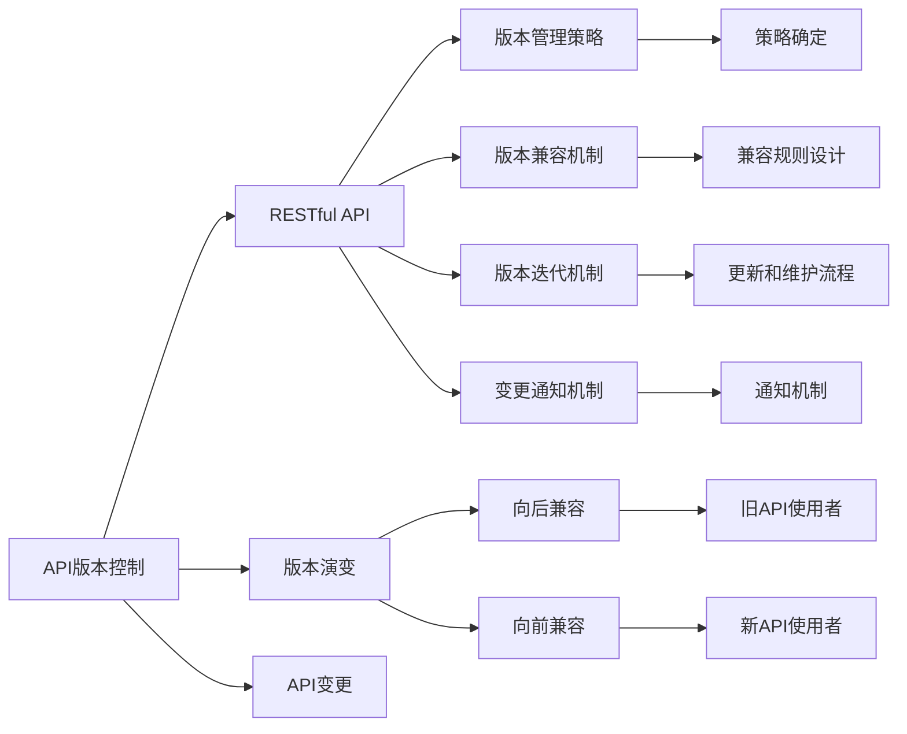
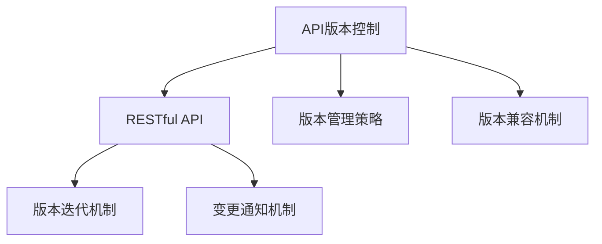
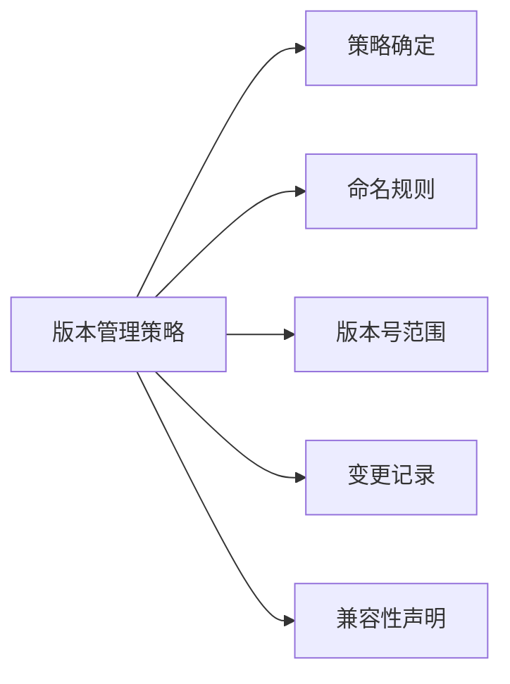
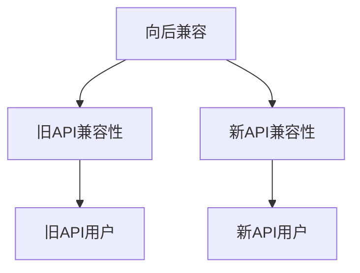
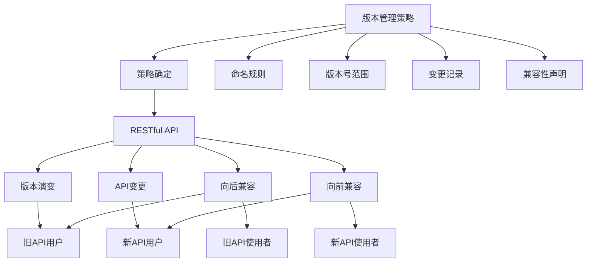

                 

# API 版本控制的最佳实践

> 关键词：API版本控制,RESTful API,版本演变,API变更,向后兼容,向前兼容

## 1. 背景介绍

随着软件系统的规模日益扩大，API（应用程序接口）的版本控制变得越来越重要。版本控制不仅可以确保API的稳定性和可靠性，还能让开发者清晰地了解API的演变历程，避免因版本更迭带来的兼容问题。尤其是对于API驱动的企业级应用，如电商平台、社交网络、云服务提供商等，良好的API版本控制策略更是至关重要的。

### 1.1 问题由来

API的版本控制面临着以下挑战：

1. **向后兼容**：新版本的API应保持与旧版本兼容性，保证旧版API的使用者不受影响。
2. **向前兼容**：新使用者应当能够访问旧API，同时新API能提供更好的性能和安全性。
3. **版本迭代**：API需要不断迭代升级，但每次升级不应打破现有系统依赖。
4. **变更管理**：API变更需要文档更新、测试验证、用户通知等多方面协调管理。

这些问题在复杂的微服务架构、分布式系统中尤为突出，涉及多个开发团队、多种技术和不同的利益相关方，处理不当将导致严重的系统崩溃和用户体验下降。

### 1.2 问题核心关键点

1. **版本管理策略**：确定如何标记和命名API的不同版本。
2. **版本兼容机制**：设计不同版本之间的兼容规则，确保旧版API的用户不受影响。
3. **版本迭代机制**：定义API版本的更新和维护流程，包括变更频率、发布方式、测试策略等。
4. **变更通知机制**：确保API变更的信息能够及时通知到所有相关方。
5. **版本控制工具**：选择合适的工具进行API版本控制，如SemVer、Git版本控制系统等。

## 2. 核心概念与联系

### 2.1 核心概念概述

为更好地理解API版本控制的方法和策略，本节将介绍几个密切相关的核心概念：

- **API版本控制**：确保API的稳定性、兼容性和可维护性，通过规范的策略管理API的变更。
- **RESTful API**：一种基于HTTP协议和REST架构风格的API设计风格，强调资源标识、无状态通信、可缓存、统一接口等原则。
- **版本演变**：API在发布和迭代过程中，版本号的更新和变化。
- **API变更**：API功能、接口、数据结构等的修改或新增。
- **向后兼容**：新版本的API应保持与旧版本兼容，确保旧API的用户不受影响。
- **向前兼容**：新API应兼容旧API，新用户可以访问旧API，同时新API应提供更好的性能和安全性。

这些核心概念之间的逻辑关系可以通过以下Mermaid流程图来展示：



这个流程图展示了大语言模型的核心概念及其之间的关系：

1. API版本控制通过RESTful API实现，版本管理和策略管理是其重要组成部分。
2. 版本演变和API变更管理是API版本控制的核心任务。
3. 向后兼容和向前兼容是版本演变的两个关键原则。
4. 版本管理策略、兼容机制、迭代机制和变更通知机制共同构成了API版本控制的完整生态系统。

这些概念共同构成了API版本控制的完整框架，使其能够有效地管理和控制API的变更，确保系统稳定和用户满意度。

### 2.2 概念间的关系

这些核心概念之间存在着紧密的联系，形成了API版本控制的完整生态系统。下面我们通过几个Mermaid流程图来展示这些概念之间的关系。

#### 2.2.1 API版本控制与RESTful API的关系



这个流程图展示了API版本控制与RESTful API之间的关系：

1. API版本控制通过RESTful API实现。
2. 版本管理策略和兼容机制是API版本控制的关键部分，确保API演变的稳定性和兼容性。
3. 版本迭代机制和变更通知机制是API版本控制的具体执行流程，确保API变更信息及时传递。

#### 2.2.2 版本管理和策略的关系



这个流程图展示了版本管理和策略的关系：

1. 策略确定是版本管理的基础，定义了版本号的命名规则、版本号范围和变更记录等信息。
2. 兼容性声明是版本管理的关键，确保新旧版本之间的兼容性。
3. 命名规则和版本号范围是版本管理的细节，确保版本号的清晰和易读。

#### 2.2.3 向后兼容与向前兼容的关系



这个流程图展示了向后兼容和向前兼容的关系：

1. 向后兼容确保旧API用户不受影响。
2. 向前兼容确保新API兼容旧API，同时提供更好的性能和安全性。
3. 旧API用户和新API用户分别表示不同时间段的API使用者。

### 2.3 核心概念的整体架构

最后，我们用一个综合的流程图来展示这些核心概念在大语言模型版本控制的整体架构：



这个综合流程图展示了从策略确定到API变更的完整过程。API版本控制通过策略确定和命名规则，定义了版本号范围和变更记录，确保版本管理的清晰和易读。同时，向后兼容和向前兼容策略，保证了API演变的稳定性和新旧API用户的兼容性。RESTful API作为API的版本实现，版本演变和API变更通过命名和记录管理，最终形成了API版本控制的完整生态系统。

## 3. 核心算法原理 & 具体操作步骤
### 3.1 算法原理概述

API版本控制的核心算法原理基于**语义版本控制**（Semantic Versioning，简称SemVer）。SemVer是一种规范化的API版本管理策略，通过语义化的版本号来明确API的发布内容和变化类型，确保API的向后兼容性和向前兼容性。

API的版本号由三个数字组成，分别是主版本号（Major Version）、次版本号（Minor Version）和补丁号（Patch Version），以"."分隔，例如"2.0.0"。

- **主版本号（Major Version）**：每当API发生重大变更，如核心API结构、功能架构等，主版本号增加1。
- **次版本号（Minor Version）**：当API新增功能、改善性能、修正重大bug等，次版本号增加1。
- **补丁号（Patch Version）**：当API进行功能修复、微小bug修复等，补丁号增加1。

SemVer的版本号管理基于以下规则：

- **向后兼容**：只有当主版本号增加时，旧API用户的使用可能受到影响，新API与旧API不兼容。
- **向前兼容**：在次版本号和补丁号增加时，新API应兼容旧API，旧API用户可以继续使用新API。
- **版本控制**：每个版本号代表一个具体的API发布，版本号的顺序和含义固定，且向后兼容。

### 3.2 算法步骤详解

基于SemVer的API版本控制主要包括以下几个关键步骤：

**Step 1: 制定版本管理策略**

- **策略确定**：定义API版本号的命名规则、版本号范围、变更记录和兼容声明。
- **命名规则**：如"主.次.补丁"的格式，主版本号使用整数表示，次版本号和补丁号使用整数或小数表示。
- **版本号范围**：如"2.0.x"表示主版本号为2，次版本号为0，补丁号无限制。
- **变更记录**：详细记录每次API变更的内容，如新增功能、改进性能、修复bug等。
- **兼容声明**：明确新旧版本之间的兼容规则，如在次版本号增加时向后兼容。

**Step 2: 实现版本兼容机制**

- **向后兼容**：在主版本号增加时，提供兼容层或兼容协议，确保旧API用户不受影响。
- **向前兼容**：在新API中保留旧API的功能和接口，确保新用户可以访问旧API，同时提供新功能。

**Step 3: 执行版本迭代机制**

- **发布计划**：制定API的发布计划，包括变更频率、发布方式、测试策略等。
- **版本迭代**：根据发布计划进行API版本的迭代升级，每次升级应满足向后兼容和向前兼容要求。
- **版本记录**：记录每次迭代升级的内容和变更记录，确保版本号的清晰和易读。

**Step 4: 执行变更通知机制**

- **变更通知**：在每次API变更后，及时通知所有相关方，包括旧API用户和新API用户。
- **通知内容**：包括变更内容、影响范围、兼容策略、迁移指南等，确保用户能够及时了解变更详情。
- **通知渠道**：通过邮件、公告、API文档更新等多种渠道，确保通知信息传递到位。

### 3.3 算法优缺点

基于SemVer的API版本控制方法具有以下优点：

- **规范统一**：遵循SemVer规范，确保版本号的语义化和一致性，便于理解和协作。
- **兼容性强**：明确了向后兼容和向前兼容的规则，减少了兼容性问题。
- **易于维护**：每次API变更都记录在案，便于追溯和迭代。

同时，也存在一些局限性：

- **复杂度高**：在版本管理策略和兼容机制设计上，可能需要较多的前期工作和维护成本。
- **变更频率限制**：根据SemVer规则，每个主版本号增加需要引入重大变更，这可能会限制API的迭代速度。
- **版本冲突**：当多个团队同时进行API变更时，可能出现版本冲突，需要协调解决。

### 3.4 算法应用领域

基于SemVer的API版本控制方法广泛应用于软件开发和系统集成领域，具体包括以下几个方面：

- **软件开发**：在软件开发过程中，API版本控制用于管理API的变更和发布，确保系统稳定和用户满意度。
- **系统集成**：在复杂的微服务架构中，API版本控制用于管理多个服务之间的接口变更，确保各服务间的兼容性。
- **云服务提供商**：云服务提供商通过API版本控制管理其云API的发布和迭代，确保API的向后兼容性和向前兼容性。

## 4. 数学模型和公式 & 详细讲解  
### 4.1 数学模型构建

API版本控制的数学模型主要基于语义版本控制（Semantic Versioning）的规则和策略，以下是一些关键公式的推导和解释。

设API的当前版本为"v1.x.x"，新版本的发布规则如下：

1. **向后兼容**：在主版本号增加时，旧API用户的使用可能受到影响，新API与旧API不兼容。
2. **向前兼容**：在次版本号和补丁号增加时，新API应兼容旧API，旧API用户可以继续使用新API。

假设当前版本为"v1.2.3"，计划发布新版本"v1.3.x"，则：

- **向后兼容**：新API与旧API不兼容，旧API用户需迁移至新API。
- **向前兼容**：新API应保留旧API的功能和接口，同时新增新功能。

### 4.2 公式推导过程

根据SemVer的规则，新版本的API版本号应满足以下条件：

- **主版本号增加**：新API与旧API不兼容，旧API用户需迁移至新API。
- **次版本号增加**：新API应兼容旧API，旧API用户可以继续使用新API。
- **补丁号增加**：新API应兼容旧API，旧API用户可以继续使用新API。

假设当前版本为"v1.2.3"，计划发布新版本"v1.3.x"，则新版本的版本号应为"v1.3.0"。

- **主版本号增加**：新API与旧API不兼容，旧API用户需迁移至新API。
- **次版本号增加**：新API应兼容旧API，旧API用户可以继续使用新API。
- **补丁号无增加**：新API应兼容旧API，旧API用户可以继续使用新API。

### 4.3 案例分析与讲解

以下通过一个具体案例，详细分析API版本控制的实现过程：

假设有一个API"/users"，当前版本为"v1.0.1"，计划发布新版本"v1.1.x"。

**Step 1: 制定版本管理策略**

- **策略确定**：定义API版本号的命名规则、版本号范围、变更记录和兼容声明。
- **命名规则**：如"主.次.补丁"的格式，主版本号使用整数表示，次版本号和补丁号使用整数或小数表示。
- **版本号范围**：如"1.0.x"表示主版本号为1，次版本号为0，补丁号无限制。
- **变更记录**：详细记录每次API变更的内容，如新增功能、改进性能、修复bug等。
- **兼容声明**：明确新旧版本之间的兼容规则，如在次版本号增加时向后兼容。

**Step 2: 实现版本兼容机制**

- **向后兼容**：在主版本号增加时，提供兼容层或兼容协议，确保旧API用户不受影响。
- **向前兼容**：在新API中保留旧API的功能和接口，确保新用户可以访问旧API，同时提供新功能。

**Step 3: 执行版本迭代机制**

- **发布计划**：制定API的发布计划，包括变更频率、发布方式、测试策略等。
- **版本迭代**：根据发布计划进行API版本的迭代升级，每次升级应满足向后兼容和向前兼容要求。
- **版本记录**：记录每次迭代升级的内容和变更记录，确保版本号的清晰和易读。

**Step 4: 执行变更通知机制**

- **变更通知**：在每次API变更后，及时通知所有相关方，包括旧API用户和新API用户。
- **通知内容**：包括变更内容、影响范围、兼容策略、迁移指南等，确保用户能够及时了解变更详情。
- **通知渠道**：通过邮件、公告、API文档更新等多种渠道，确保通知信息传递到位。

通过这个案例，可以更清晰地理解API版本控制的实现过程和各个步骤的要点。

## 5. 项目实践：代码实例和详细解释说明
### 5.1 开发环境搭建

在进行API版本控制实践前，我们需要准备好开发环境。以下是使用Python进行Flask开发的环境配置流程：

1. 安装Anaconda：从官网下载并安装Anaconda，用于创建独立的Python环境。

2. 创建并激活虚拟环境：
```bash
conda create -n flask-env python=3.8 
conda activate flask-env
```

3. 安装Flask：
```bash
pip install flask
```

4. 安装Flask-RESTful：
```bash
pip install flask-restful
```

5. 安装Flask-SQLAlchemy：
```bash
pip install flask-sqlalchemy
```

完成上述步骤后，即可在`flask-env`环境中开始API版本控制的实践。

### 5.2 源代码详细实现

下面是一个使用Flask和Flask-RESTful实现API版本控制的简单示例：

```python
from flask import Flask, jsonify, request
from flask_restful import Resource, Api
from flask_sqlalchemy import SQLAlchemy

app = Flask(__name__)
app.config['SQLALCHEMY_DATABASE_URI'] = 'sqlite:///version_control.db'
db = SQLAlchemy(app)
api = Api(app)

class Version(Resource):
    def get(self):
        return {'version': '1.0.1'}

    def put(self):
        new_version = request.form.get('version')
        db.session.query(Version).delete()
        db.session.add(Version(version=new_version))
        db.session.commit()
        return {'version': new_version}

api.add_resource(Version, '/api/version')

if __name__ == '__main__':
    db.create_all()
    app.run(debug=True)
```

在这个示例中，我们使用了Flask和SQLAlchemy实现了API版本控制的功能。

**Version类**：
- **get方法**：返回当前API的版本号。
- **put方法**：接收新的API版本号，更新数据库中的版本号。

**api.add_resource**：
- 将Version资源添加到Flask应用中，访问路径为`/api/version`。

### 5.3 代码解读与分析

让我们再详细解读一下关键代码的实现细节：

**Flask框架**：
- Flask是一个轻量级的Python Web框架，适合快速开发API应用。
- 使用Flask-SQLAlchemy进行数据库操作，简单高效。

**Version类**：
- **get方法**：使用`request.form.get`获取前端提交的版本号，返回当前API的版本号。
- **put方法**：使用`request.form.get`获取前端提交的版本号，通过SQLAlchemy更新数据库中的版本号。

**api.add_resource**：
- 使用Flask-RESTful的`api.add_resource`将Version资源添加到Flask应用中，自动处理路由请求。

**数据库操作**：
- 使用SQLAlchemy进行数据库操作，方便数据管理。
- 在应用启动时创建数据库，调用`db.create_all()`方法创建表结构。

**代码运行**：
- 使用`app.run(debug=True)`启动Flask应用，使用调试模式运行。

这个示例展示了使用Flask和SQLAlchemy实现API版本控制的基本流程。开发者可以根据具体需求进行扩展和优化，实现更加复杂的版本管理功能。

### 5.4 运行结果展示

假设我们在测试环境中启动应用，并在浏览器中输入`http://127.0.0.1:5000/api/version`，可以获取当前API的版本号。使用`curl`命令进行API请求和响应测试：

```bash
curl http://127.0.0.1:5000/api/version
```

这个示例展示了使用Flask和SQLAlchemy实现API版本控制的基本流程。开发者可以根据具体需求进行扩展和优化，实现更加复杂的版本管理功能。

## 6. 实际应用场景
### 6.1 智能客服系统

基于API版本控制的智能客服系统，可以广泛应用于智能客服系统的构建。传统客服往往需要配备大量人力，高峰期响应缓慢，且一致性和专业性难以保证。而使用API版本控制的智能客服系统，可以实现7x24小时不间断服务，快速响应客户咨询，用自然流畅的语言解答各类常见问题。

在技术实现上，可以收集企业内部的历史客服对话记录，将问题和最佳答复构建成监督数据，在此基础上对API版本控制的对话模型进行迭代升级。迭代升级后的API，能够自动理解用户意图，匹配最合适的答案模板进行回复。对于客户提出的新问题，还可以接入检索系统实时搜索相关内容，动态组织生成回答。如此构建的智能客服系统，能大幅提升客户咨询体验和问题解决效率。

### 6.2 金融舆情监测

金融机构需要实时监测市场舆论动向，以便及时应对负面信息传播，规避金融风险。传统的人工监测方式成本高、效率低，难以应对网络时代海量信息爆发的挑战。基于API版本控制的文本分类和情感分析技术，为金融舆情监测提供了新的解决方案。

具体而言，可以收集金融领域相关的新闻、报道、评论等文本数据，并对其进行主题标注和情感标注。在此基础上对API版本控制的模型进行迭代升级，使其能够自动判断文本属于何种主题，情感倾向是正面、中性还是负面。将迭代升级后的API应用到实时抓取的网络文本数据，就能够自动监测不同主题下的情感变化趋势，一旦发现负面信息激增等异常情况，系统便会自动预警，帮助金融机构快速应对潜在风险。

### 6.3 个性化推荐系统

当前的推荐系统往往只依赖用户的历史行为数据进行物品推荐，无法深入理解用户的真实兴趣偏好。基于API版本控制的个性化推荐系统，可以更好地挖掘用户行为背后的语义信息，从而提供更精准、多样的推荐内容。

在实践中，可以收集用户浏览、点击、评论、分享等行为数据，提取和用户交互的物品标题、描述、标签等文本内容。将文本内容作为模型输入，用户的后续行为（如是否点击、购买等）作为监督信号，在此基础上对API版本控制的推荐模型进行迭代升级。迭代升级后的API，能够从文本内容中准确把握用户的兴趣点。在生成推荐列表时，先用候选物品的文本描述作为输入，由API版本控制的推荐模型预测用户的兴趣匹配度，再结合其他特征综合排序，便可以得到个性化程度更高的推荐结果。

### 6.4 未来应用展望

随着API版本控制技术的不断发展，基于API驱动的企业级应用将在更多领域得到应用，为传统行业带来变革性影响。

在智慧医疗领域，基于API版本控制的医疗问答、病历分析、药物研发等应用将提升医疗服务的智能化水平，辅助医生诊疗，加速新药开发进程。

在智能教育领域，API版本控制的微服务架构，有助于实现模块化、灵活化的教育系统，因材施教，促进教育公平，提高教学质量。

在智慧城市治理中，API版本控制的微服务架构，有助于实现模块化、协同化的城市管理平台，提高城市管理的自动化和智能化水平，构建更安全、高效的未来城市。

此外，在企业生产、社会治理、文娱传媒等众多领域，基于API版本控制的人工智能应用也将不断涌现，为经济社会发展注入新的动力。相信随着技术的日益成熟，API版本控制必将在构建人机协同的智能时代中扮演越来越重要的角色。

## 7. 工具和资源推荐
### 7.1 学习资源推荐

为了帮助开发者系统掌握API版本控制的方法和策略，这里推荐一些优质的学习资源：

1. **《RESTful API设计》系列博文**：由API版本控制的专家撰写，深入浅出地介绍了RESTful API的设计原则和实践技巧。

2. **CS4002《Web技术及应用》课程**：麻省理工学院开设的Web开发课程，详细讲解了API设计和管理的相关知识，是Web开发者的必修课。

3. **《RESTful Web API》书籍**：详细介绍RESTful API的设计和实现，涵盖版本控制、文档编写、测试等方方面面。

4. **Swagger官方文档**：Swagger是流行的API文档生成工具，详细介绍了API版本控制的实现方法，并提供了丰富的样例代码。

5. **API Versioning with Flask和Flask-RESTful**：具体介绍如何使用Flask和Flask-RESTful实现API版本控制，适合Flask开发者参考。

通过这些资源的学习实践，相信你一定能够快速掌握API版本控制的精髓，并用于解决实际的API设计和管理问题。

### 7.2 开发工具推荐

高效的开发离不开优秀的工具支持。以下是几款用于API版本控制开发的常用工具：

1. **Flask**：基于Python的开源Web框架，适合快速开发API应用。
2. **Flask-RESTful**：基于Flask的RESTful API开发框架，提供简单易用的路由管理和请求处理。
3. **Swagger**：API文档生成工具，生成和展示API文档，便于开发者和用户理解API的使用。
4. **Postman**：API测试工具，支持多种请求方法，方便开发者测试API功能。
5. **Jenkins**：持续集成和部署工具，自动构建和测试API版本，确保API的质量和稳定性。

合理利用这些工具，可以显著提升API版本控制的开发效率，加快创新迭代的步伐。

### 7.3 相关论文推荐

API版本控制技术的发展源于学界的持续研究。以下是几篇奠基性的相关论文，推荐阅读：

1. **《API Versioning in Microservices》**：探讨了API版本控制在大规模微服务架构中的实现方法，提出了一种基于版本管理策略的版本控制方案。
2. **《Practical API Versioning》**：详细介绍了API版本控制的实现技巧和最佳实践，涵盖了版本号的命名规则、兼容策略、变更管理等方面。
3. **《RESTful API Design and Versioning》**：介绍了RESTful API的设计原则和版本控制策略，强调API的语义化和清晰化。
4. **《Semantic Versioning 2.0.0》**：规范了API版本号的语义化格式，明确了向前兼容和向后兼容的规则，是API版本控制的权威标准。

这些论文代表了大语言模型版本控制的最新发展，提供了丰富的理论基础和实践经验，值得深入学习。

除上述资源外，还有一些值得关注的前沿资源，帮助开发者紧跟API版本控制的最新进展，例如：

1. **arXiv论文预印本**：人工智能领域最新研究成果的发布平台，包括大量尚未发表的前沿工作，学习前沿技术的必读资源。
2. **业界技术博客**：如Google Cloud、Amazon Web Services等云服务提供商的官方博客，第一时间分享他们的最新研究成果和洞见。
3. **

