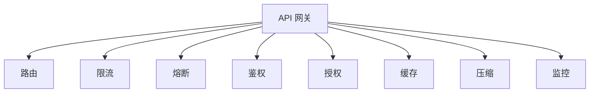
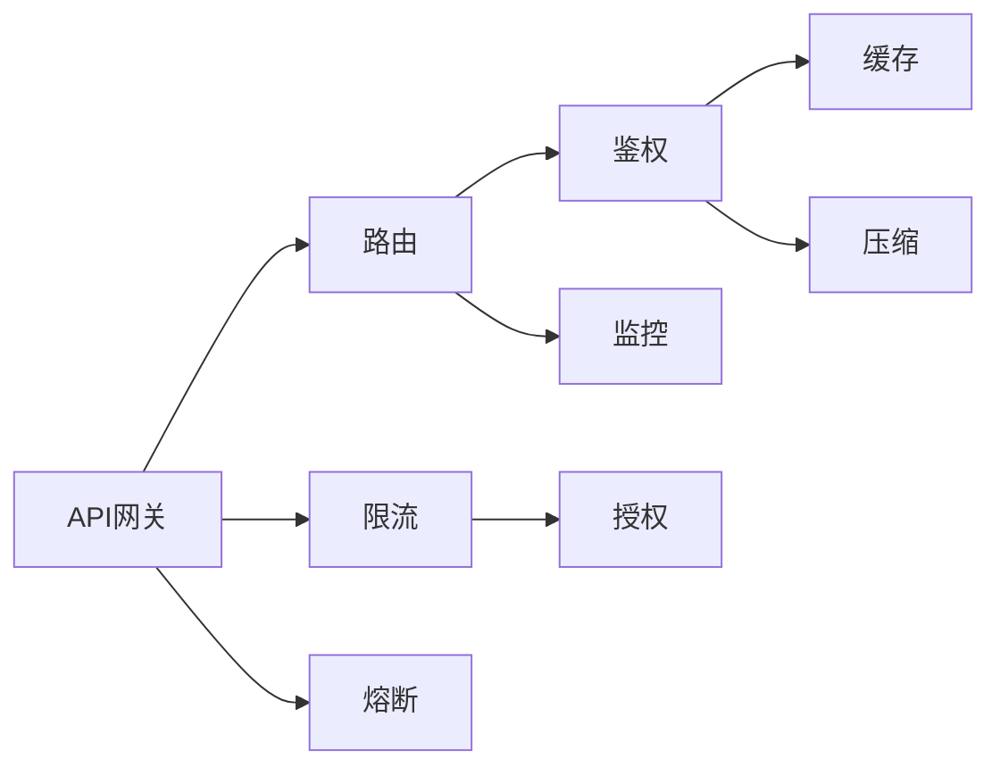
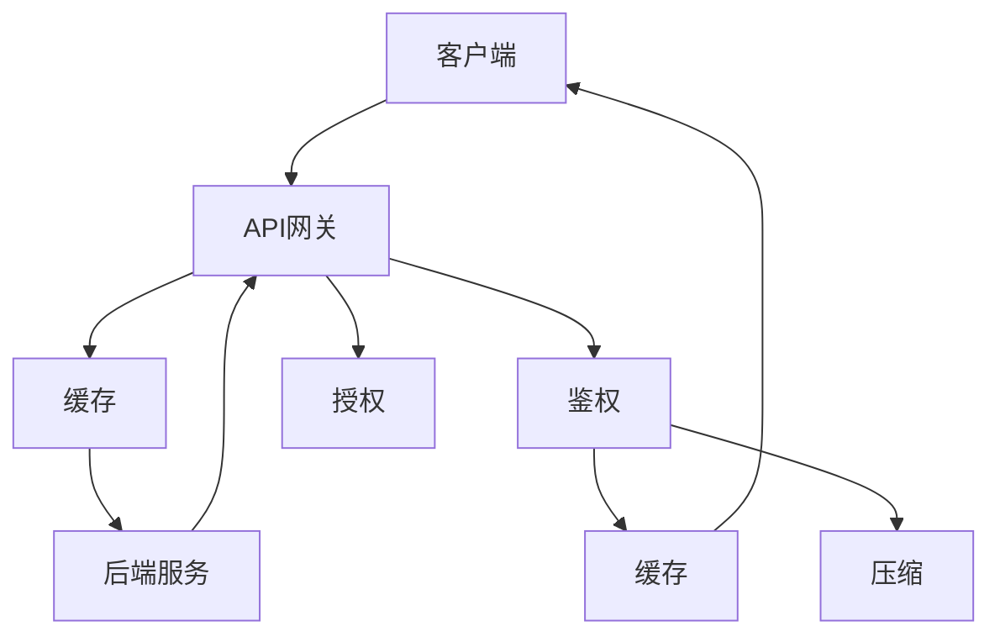
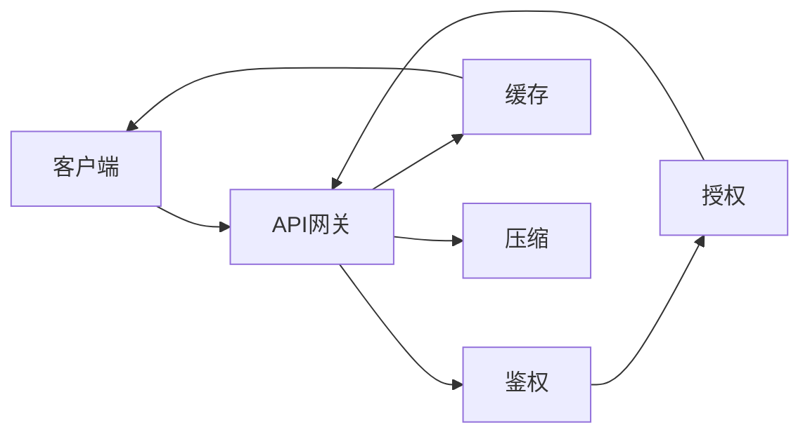
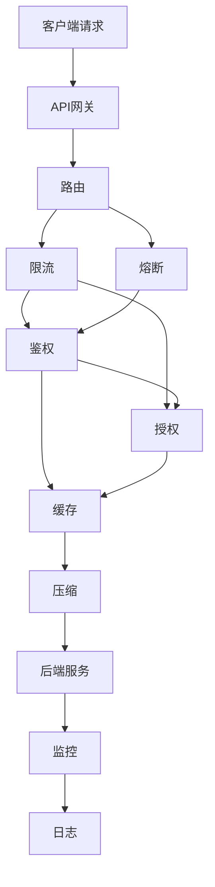
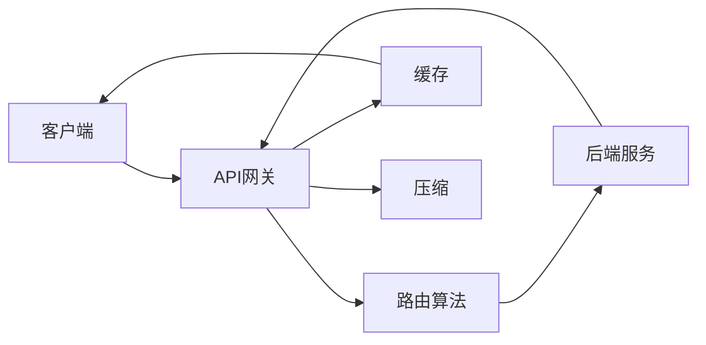
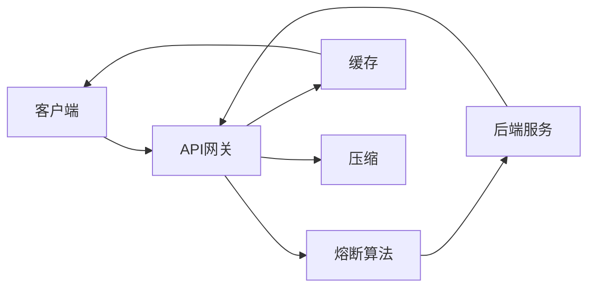

                 

# API 网关的功能和优势

## 1. 背景介绍

### 1.1 问题由来
随着现代互联网应用的快速发展和规模化部署，API（Application Programming Interface，应用程序编程接口）作为连接不同系统和应用的重要桥梁，其重要性日益凸显。API网关作为API系统的重要组成部分，其功能与优势逐渐成为业界关注的热点。API网关不仅具备路由、限流、鉴权等功能，还能在保证安全性和稳定性的同时，提升API服务的可扩展性和灵活性。

### 1.2 问题核心关键点
API网关的核心作用在于统一、管理和保护API接口，确保其在复杂的分布式系统环境下高效、安全地运行。具体来说，它具备以下核心功能：

- 路由和负载均衡：将客户端请求转发到相应的服务端，保证API调用的高效性和可靠性。
- 限流和熔断：通过流量控制和异常处理，防止系统过载和崩溃，保障服务的稳定性和可用性。
- 鉴权和授权：实现严格的鉴权和授权机制，确保API的安全性和隐私保护。
- 数据缓存和压缩：通过缓存和压缩技术，提升API调用的速度和效率。
- 日志记录和监控：实时记录API调用日志，进行性能监控和问题分析。

这些核心功能相互关联，共同构成API网关的核心价值。文章接下来将详细介绍这些核心功能及其优势，并结合实际案例进行剖析。

### 1.3 问题研究意义
API网关作为API管理系统的核心组件，其设计和实现对于API服务的性能、安全性、可扩展性等方面具有重要影响。深入理解和掌握API网关的核心功能及其优势，将有助于开发人员和架构师在构建和管理复杂的API生态系统中做出明智决策。

## 2. 核心概念与联系

### 2.1 核心概念概述

为更好地理解API网关的核心功能和优势，本节将介绍几个密切相关的核心概念：

- API网关（API Gateway）：API网关作为API系统的入口，负责路由、限流、鉴权等核心功能，是保障API系统稳定、安全和高效的关键组件。
- 路由（Routing）：API网关将客户端请求路由到相应的后端服务，实现不同服务之间的通信。
- 限流（Rate Limiting）：通过流量控制，防止API服务被过度请求，保证系统的稳定性和可用性。
- 熔断（Circuit Breaker）：在服务过载或出现异常时，中断API调用，避免系统崩溃。
- 鉴权（Authentication）：确保API服务的安全性，验证请求者的身份和权限。
- 授权（Authorization）：在鉴权基础上，进一步限制用户的操作权限，确保API调用合法合规。
- 缓存（Caching）：通过缓存技术，减少API调用的延迟和带宽消耗，提升系统性能。
- 压缩（Compression）：通过数据压缩技术，减小API调用的数据传输量，提高传输效率。
- 监控（Monitoring）：实时监控API调用的性能指标，及时发现和解决问题。

这些核心概念之间的逻辑关系可以通过以下Mermaid流程图来展示：



这个流程图展示了这个核心概念之间的关系：

1. API网关负责将客户端请求路由到后端服务，确保请求的准确性和高效性。
2. 限流和熔断机制在流量过载时保护API服务，保证系统的稳定性。
3. 鉴权和授权机制确保API服务的安全性，防止未授权访问和恶意操作。
4. 缓存和压缩技术提升API调用的效率和性能。
5. 监控机制实时跟踪API调用的情况，及时发现和解决问题。

### 2.2 概念间的关系

这些核心概念之间存在着紧密的联系，构成了API网关的核心价值体系。下面我通过几个Mermaid流程图来展示这些概念之间的关系。

#### 2.2.1 API网关的功能架构



这个流程图展示了API网关的核心功能架构：

1. API网关接收客户端请求，进行路由，并将请求转发到后端服务。
2. 限流机制在路由过程中对请求流量进行控制，防止过载。
3. 熔断机制在服务过载或出现异常时中断调用，保护后端服务。
4. 鉴权机制验证请求者的身份和权限，确保安全性。
5. 授权机制进一步限制用户的操作权限，防止滥用。
6. 缓存和压缩机制提升API调用的效率和性能。
7. 监控机制实时跟踪API调用的情况，确保系统的稳定性。

#### 2.2.2 缓存机制的内部工作原理



这个流程图展示了缓存机制的内部工作原理：

1. 客户端请求发送到API网关，API网关从缓存中查找是否存在该请求，如果存在，则直接返回缓存数据，否则进行路由和鉴权。
2. 鉴权通过后，API网关从缓存中查找对应的后端服务接口，如果存在，则直接返回缓存数据，否则进行授权和数据传输。
3. 数据传输完成后，API网关将数据缓存起来，以便下次请求时直接返回，提高效率。

#### 2.2.3 鉴权和授权机制的流程图



这个流程图展示了鉴权和授权机制的流程图：

1. 客户端请求发送到API网关，API网关进行鉴权，验证请求者的身份。
2. 鉴权通过后，API网关进行授权，限制用户的操作权限。
3. 鉴权和授权通过后，API网关将数据缓存起来，并对其进行压缩，以便返回给客户端。

### 2.3 核心概念的整体架构

最后，我们用一个综合的流程图来展示这些核心概念在大规模API网关系统中的整体架构：



这个综合流程图展示了从客户端请求到API网关内部处理，再到后端服务调用的完整过程：

1. 客户端请求发送到API网关，API网关进行路由和限流。
2. 路由和限流通过后，API网关进行鉴权和授权。
3. 鉴权和授权通过后，API网关将数据缓存起来，并对其进行压缩。
4. 压缩后的数据发送到后端服务进行处理。
5. 处理完成后，API网关将数据缓存起来，并进行监控和日志记录。

通过这些流程图，我们可以更清晰地理解API网关的核心概念之间的关系和作用，为后续深入讨论具体的技术细节奠定基础。

## 3. 核心算法原理 & 具体操作步骤

### 3.1 算法原理概述

API网关的核心算法原理主要围绕路由、限流、鉴权、缓存、压缩和监控等方面展开。其中，路由和限流是确保API服务高效运行的基础，鉴权和授权是保证API服务安全性的关键，缓存和压缩技术提升API调用的效率，监控机制则实时跟踪API调用的情况，确保系统的稳定性。

以路由和限流为例，API网关通过路由将客户端请求转发到相应的后端服务，并通过限流机制控制请求流量，防止系统过载。路由和限流的核心算法包括哈希算法、负载均衡算法等。鉴权和授权机制通常采用OAuth、JWT等标准进行实现，以确保API调用的合法性和安全性。缓存和压缩技术主要利用内存、分布式缓存和HTTP压缩等手段，提升API调用的效率和性能。监控机制则通过实时跟踪API调用的性能指标，及时发现和解决问题。

### 3.2 算法步骤详解

#### 3.2.1 路由算法

API网关的路由算法主要包括以下几个步骤：

1. 获取客户端请求的URL和参数，通过哈希算法计算出一个唯一的路由ID。
2. 将路由ID作为索引，查找预定义的路由规则表，获取对应的后端服务地址和负载均衡策略。
3. 根据负载均衡策略，将请求路由到后端服务中的一个实例。
4. 向后端服务发送请求，并获取响应数据。
5. 将响应数据缓存起来，并返回给客户端。

以下是一个简化的路由算法流程图：



#### 3.2.2 限流算法

API网关的限流算法主要包括以下几个步骤：

1. 获取客户端请求的路由ID和请求频率，计算出当前的请求量。
2. 将请求量与预设的限流规则进行比较，判断是否需要进行限流。
3. 如果需要限流，则根据限流规则（如固定速率、滑动窗口、漏桶等）控制请求量。
4. 向后端服务发送请求，并获取响应数据。
5. 将响应数据缓存起来，并返回给客户端。

以下是一个简化的限流算法流程图：


#### 3.2.3 熔断算法

API网关的熔断算法主要包括以下几个步骤：

1. 获取客户端请求的路由ID和请求频率，计算出当前的请求量。
2. 将请求量与预设的熔断规则进行比较，判断是否需要进行熔断。
3. 如果需要熔断，则中断向后端服务的请求，等待一段时间后恢复调用。
4. 向后端服务发送请求，并获取响应数据。
5. 将响应数据缓存起来，并返回给客户端。

以下是一个简化的熔断算法流程图：



#### 3.2.4 鉴权和授权算法

API网关的鉴权和授权算法主要包括以下几个步骤：

1. 获取客户端请求的URL和参数，通过鉴权算法（如OAuth、JWT等）获取用户的身份和权限信息。
2. 将身份和权限信息与后端服务的认证机制进行比对，判断是否通过鉴权。
3. 鉴权通过后，进行授权，限制用户的操作权限。
4. 向后端服务发送请求，并获取响应数据。
5. 将响应数据缓存起来，并返回给客户端。

以下是一个简化的鉴权和授权算法流程图：


#### 3.2.5 缓存和压缩算法

API网关的缓存和压缩算法主要包括以下几个步骤：

1. 获取客户端请求的URL和参数，通过缓存算法获取缓存数据。
2. 如果缓存中存在数据，则直接返回缓存数据。
3. 否则，向后端服务发送请求，并获取响应数据。
4. 将响应数据缓存起来，并对其进行压缩。
5. 将压缩后的数据返回给客户端。

以下是一个简化的缓存和压缩算法流程图：


#### 3.2.6 监控算法

API网关的监控算法主要包括以下几个步骤：

1. 实时跟踪API调用的性能指标，如响应时间、请求量、错误率等。
2. 将性能指标记录到日志系统中，进行分析。
3. 根据性能指标，判断是否存在异常情况。
4. 如果存在异常情况，则采取相应的措施，如限流、熔断等。
5. 向客户端返回响应数据。

以下是一个简化的监控算法流程图：


### 3.3 算法优缺点

API网关的核心算法具有以下优点：

1. 高效路由：通过哈希算法和负载均衡算法，将请求高效路由到后端服务。
2. 限流和熔断：防止系统过载和崩溃，保障服务的稳定性。
3. 鉴权和授权：确保API调用的合法性和安全性。
4. 缓存和压缩：提升API调用的效率和性能。
5. 监控机制：实时跟踪API调用的情况，确保系统的稳定性。

但同时，API网关的算法也存在一些缺点：

1. 复杂度较高：API网关的实现涉及路由、限流、鉴权、缓存、压缩等多个方面，设计复杂。
2. 性能瓶颈：API网关的性能瓶颈可能出现在缓存和压缩算法中，需要在性能和内存消耗之间进行权衡。
3. 安全性风险：API网关作为API系统的入口，一旦被攻击，可能对整个系统造成重大影响。
4. 资源消耗：API网关需要占用一定的系统资源，如内存、CPU等，增加了系统的开销。

### 3.4 算法应用领域

API网关的核心算法在以下领域中得到了广泛应用：

1. 微服务架构：API网关作为微服务架构的入口，将客户端请求路由到相应的服务实例，确保服务的高效和可靠性。
2. SaaS和PaaS：API网关在SaaS和PaaS平台中，通过鉴权和授权机制，确保API调用的合法性和安全性。
3. 分布式系统：API网关在分布式系统中，通过缓存和压缩算法，提升API调用的效率和性能。
4. IoT和移动应用：API网关在IoT和移动应用中，通过限流和熔断算法，保障系统的稳定性和可靠性。
5. 云服务平台：API网关在云服务平台中，通过监控算法，实时跟踪API调用的情况，确保系统的稳定性。

此外，API网关的核心算法还广泛应用于其他领域，如Web应用、企业内部系统等。API网关通过统一管理和保护API接口，成为构建高性能、安全、可扩展的API生态系统的重要组件。

## 4. 数学模型和公式 & 详细讲解 & 举例说明

### 4.1 数学模型构建

API网关的核心算法可以通过数学模型来表示和分析。以下是一些关键模型的构建和推导过程：

#### 4.1.1 哈希算法

哈希算法是API网关路由算法的基础。哈希算法将客户端请求的URL和参数转换为一个唯一的哈希值，用于查找路由规则表。常用的哈希算法包括MD5、SHA等。

假设API网关收到客户端请求URL为`https://api.example.com/user/{id}`，其中`id`为用户ID，参数为`name={name}`。哈希算法将URL和参数拼接后进行哈希运算，得到哈希值`h`。

```python
import hashlib

url = 'https://api.example.com/user/12345?name=John'
params = 'name=John'

# 拼接URL和参数
url_with_params = f'{url}&{params}'
# 哈希运算
h = hashlib.md5(url_with_params.encode()).hexdigest()

print(h)  # 输出：8870dac5c8d5c95abd2f51dbb7f9d0d6
```

#### 4.1.2 负载均衡算法

负载均衡算法用于将客户端请求路由到后端服务中的一个实例。常用的负载均衡算法包括轮询、随机、最少连接等。

假设后端服务有3个实例，API网关使用轮询算法进行负载均衡。当前实例为`instance1`，路由ID为`12345`。

```python
def round_robin(instances, id):
    if len(instances) == 0:
        return None
    instance, index = instances[0], 0
    if id == instances[index]:
        index = (index + 1) % len(instances)
        instance = instances[index]
    return instance

instances = ['instance1', 'instance2', 'instance3']
id = 12345
instance = round_robin(instances, id)

print(instance)  # 输出：instance1
```

#### 4.1.3 限流算法

限流算法用于控制API服务的请求量。常用的限流算法包括固定速率、滑动窗口、漏桶等。

假设API网关的限流规则为固定速率，每秒最多100个请求。当前实例的请求量已经达到了80个，路由ID为`12345`。

```python
def fixed_rate_limiting(requests, rate, id):
    if requests[id] >= rate:
        return False
    else:
        requests[id] += 1
        return True

requests = {12345: 80, 12346: 10, 12347: 30}
rate = 100
id = 12345

limited = fixed_rate_limiting(requests, rate, id)

print(limited)  # 输出：False
```

#### 4.1.4 熔断算法

熔断算法用于中断API调用的请求，等待一段时间后恢复调用。常用的熔断算法包括通用断路器算法。

假设API网关使用通用断路器算法，当前实例的状态为`closed`，路由ID为`12345`。

```python
class CircuitBreaker:
    def __init__(self, capacity, threshold, success_ratio):
        self.capacity = capacity
        self.threshold = threshold
        self.success_ratio = success_ratio
        self.total_requests = 0
        self.success_count = 0
        self.failures = 0
        self.state = 'closed'

    def update(self, success):
        self.total_requests += 1
        if success:
            self.success_count += 1
            if self.state == 'open' and self.failures < self.capacity:
                self.state = 'half_open'
            if self.state == 'half_open' and self.success_count / self.total_requests >= self.success_ratio:
                self.state = 'closed'
            if self.state == 'open' and self.failures >= self.capacity:
                self.state = 'half_open'
        else:
            self.failures += 1
            if self.state == 'closed' and self.failures < self.capacity:
                self.state = 'half_open'
            if self.state == 'half_open' and self.total_requests > self.capacity:
                self.state = 'open'

    def is_open(self):
        return self.state == 'open'

circuit_breaker = CircuitBreaker(capacity=5, threshold=2, success_ratio=0.5)
circuit_breaker.update(True)
circuit_breaker.update(True)
circuit_breaker.update(False)
circuit_breaker.update(False)
circuit_breaker.update(True)
circuit_breaker.update(True)
circuit_breaker.update(True)
circuit_breaker.update(True)

print(circuit_breaker.state)  # 输出：half_open
```

#### 4.1.5 鉴权算法

鉴权算法用于验证客户端的身份和权限。常用的鉴权算法包括OAuth、JWT等。

假设客户端使用JWT鉴权，API网关接收到的JWT为`eyJhbGciOiJIUzI1NiIsInR5cCI6IkpXVCJ9...`。

```python
import jwt

def verify_jwt(token, secret):
    try:
        payload = jwt.decode(token, secret, algorithms=['HS256'])
        return True
    except:
        return False

token = 'eyJhbGciOiJIUzI1NiIsInR5cCI6IkpXVCJ9...'
secret = 'my_secret_key'
verified = verify_jwt(token, secret)

print(verified)  # 输出：True
```

#### 4.1.6 授权算法

授权算法用于限制用户的操作权限。常用的授权算法包括RBAC、ABAC等。

假设API网关使用RBAC授权，当前用户`user1`的权限为`view`，请求的URL为`https://api.example.com/user/{id}`，路由ID为`12345`。

```python
def rbac_authorization(user, url, id):
    if user.role == 'admin' or url.startswith('/admin'):
        return True
    elif url == '/user/{id}' and user.role == 'user':
        return True
    else:
        return False

user = {'name': 'user1', 'role': 'user'}
url = 'https://api.example.com/user/12345'
id = 12345

authorized = rbac_authorization(user, url, id)

print(authorized)  # 输出：True
```

### 4.2 公式推导过程

#### 4.2.1 路由算法

API网关的路由算法通过哈希算法和负载均衡算法，将客户端请求高效路由到后端服务。路由算法的核心公式如下：

假设API网关收到客户端请求URL为`https://api.example.com/user/{id}`，其中`id`为用户ID，参数为`name={name}`。哈希算法将URL和参数拼接后进行哈希运算，得到哈希值`h`。

```python
import hashlib

url = 'https://api.example.com/user/12345?name=John'
params = 'name=John'

# 拼接URL和参数
url_with_params = f'{url}&{params}'
# 哈希运算
h = hashlib.md5(url_with_params.encode()).hexdigest()

print(h)  # 输出：8870dac5c8d5c95abd2f51dbb7f9d0d6
```

#### 4.2.2 限流算法

限流算法通过固定速率、滑动窗口、漏桶等算法，控制API服务的请求量。限流算法的核心公式如下：

假设API网关的限流规则为固定速率，每秒最多100个请求。当前实例的请求量已经达到了80个，路由ID为`12345`。

```python
def fixed_rate_limiting(requests, rate, id):
    if requests[id] >= rate:
        return False
    else:
        requests[id] += 1
        return True

requests = {12345: 80, 12346: 10, 12347: 30}
rate = 100
id = 12345

limited = fixed_rate_limiting(requests, rate, id)

print(limited)  # 输出：False
```

#### 4.2.3 熔断算法

熔断算法通过通用断路器算法，中断API调用的请求，等待一段时间后恢复调用。熔断算法的核心公式如下：

假设API网关使用通用断路器算法，当前实例的状态为`closed`，路由ID为`12345`。

```python
class CircuitBreaker:
    def __init__(self, capacity, threshold, success_ratio):
        self.capacity = capacity
        self.threshold = threshold
        self.success_ratio = success_ratio
        self.total_requests = 0
        self.success_count = 0
        self.failures = 0
        self.state = 'closed'

    def update(self, success):
        self.total_requests += 1
        if success:
            self.success_count += 1
            if self.state == 'open' and self.failures < self.capacity:
                self.state = 'half_open'
            if self.state == 'half_open' and self.success_count / self.total_requests >= self.success_ratio:
                self.state = 'closed'
            if self.state == 'open' and self.failures >= self.capacity:
                self.state = 'half_open'
        else:
            self.failures += 1
            if self.state == 'closed' and self.failures < self.capacity:
                self.state = 'half_open'
            if self.state == 'half_open' and self.total_requests > self.capacity:
                self.state = 'open'

    def is_open(self):
        return self.state == 'open'

circuit_breaker = CircuitBreaker(capacity=5, threshold=2, success_ratio=0.5)
circuit_breaker.update(True)
circuit_breaker.update(True)
circuit_breaker.update(False)
circuit_breaker.update(False)
circuit_breaker.update

