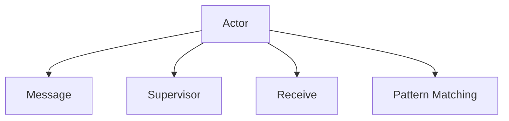
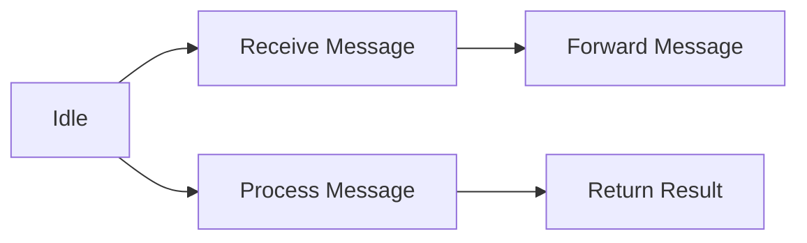
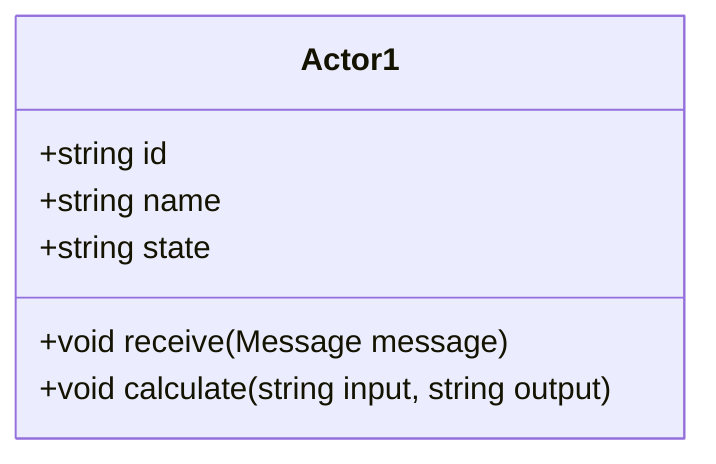
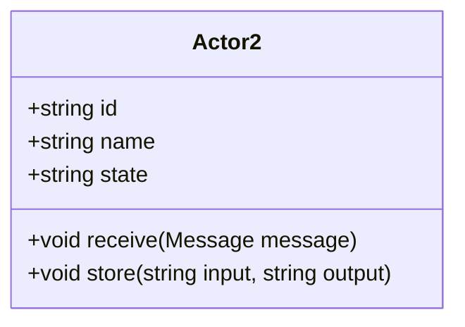
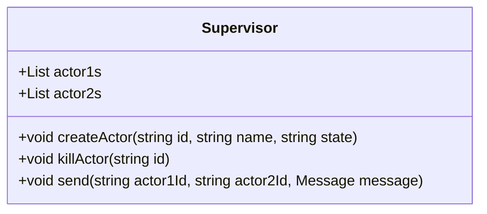
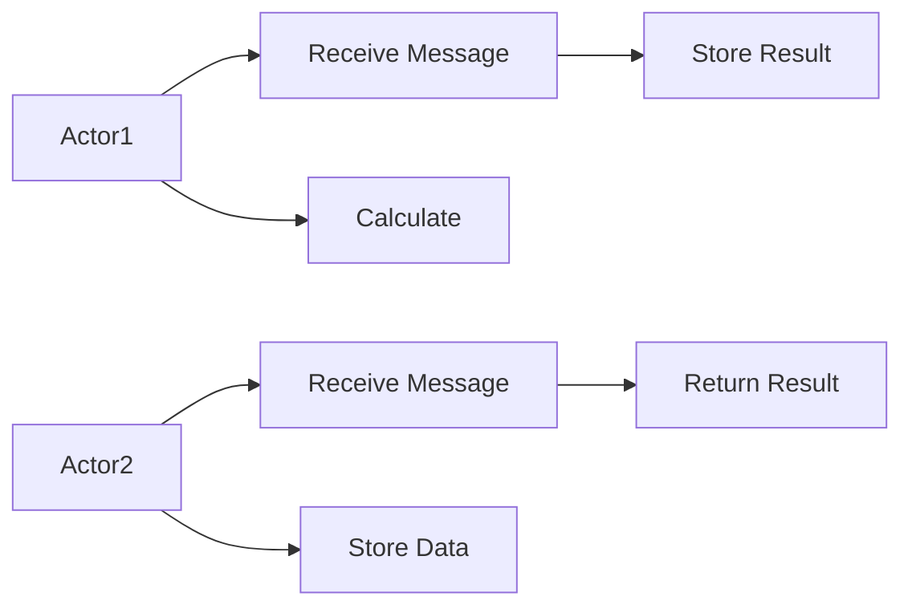

                 

## 1. 背景介绍

Actor Model（行为者模型）是一种基于分布式计算的编程范式，由Carl Hewitt在20世纪60年代提出。它通过将程序视为一系列独立的、并发执行的行为者（Actor），每个行为者负责处理一部分任务，并以异步、非阻塞的方式与其他行为者通信，从而构建出一种高并发、高吞吐的分布式系统。Actor Model因其简单易懂的模型设计和高效的编程方式，在分布式计算、微服务架构、并发编程等领域得到了广泛应用。

### 1.1 问题由来

在传统的面向过程编程模型中，程序的执行过程是线性的、顺序的。当程序需要处理复杂的并发任务时，使用同步锁、信号量等机制来实现线程间的协作，容易导致系统性能瓶颈和资源竞争问题。而Actor Model通过将任务分解成独立的Actor，每个Actor负责处理特定的消息，并以异步、非阻塞的方式与其他Actor通信，从而有效地解决了这些问题。

Actor Model的核心思想是：将程序看作一系列自主的行为者，每个行为者接收消息并执行相应的操作，然后将结果返回给发送消息的行为者。这种模型设计使得程序更容易理解和维护，同时也更适合处理高并发、高吞吐的场景。

### 1.2 问题核心关键点

Actor Model的核心在于如何定义Actor和消息传递机制。在Actor Model中，每个Actor都是一个独立的对象，具有独立的生命周期和状态。Actor通过接收消息、执行操作并发送消息来实现与其他Actor的通信。消息传递机制则负责将消息从一个Actor传递到另一个Actor，实现跨Actor的协同工作。

 Actor Model具有以下几个关键特性：

1. **独立性**：每个Actor独立运行，具有独立的生命周期和状态。
2. **异步通信**：Actor之间通过消息异步通信，每个Actor可以并发处理多个消息，提高系统的吞吐量。
3. **松耦合**：Actor之间解耦合，降低了系统复杂度和维护成本。
4. **可扩展性**：Actor模型易于扩展，可以通过增加Actor数量来提升系统的并发能力和处理能力。

## 2. 核心概念与联系

### 2.1 核心概念概述

Actor Model包含多个核心概念，这些概念之间通过消息传递机制紧密联系在一起。以下是Actor Model的几个关键概念：

- **Actor**：Actor是Actor Model中的基本单位，代表一个独立的、自主的计算实体，负责处理消息并执行相应的操作。每个Actor都有独立的生命周期和状态。
- **Message**：消息是Actor之间的通信介质，用于传递请求和响应，实现跨Actor的协作。
- **Supervisor**：Supervisor是Actor的管理者，负责监控Actor的状态，并在Actor故障时重启Actor。Supervisor还负责Actor的创建、销毁和通信。
- **Receive**：Receive是Actor处理消息的入口，每个Actor都有一个或多个Receive方法，用于处理不同类型的消息。
- **Pattern Matching**：Actor在Receive方法中使用模式匹配技术，根据消息类型和内容执行相应的操作。

这些概念之间的关系可以通过以下Mermaid流程图来展示：



这个流程图展示了一个Actor模型中各概念之间的联系：Actor接收消息，调用Receive方法处理，通过Pattern Matching技术根据消息类型执行相应的操作，同时由Supervisor负责管理和监控Actor的状态。

### 2.2 概念间的关系

Actor Model中各概念之间的关系紧密，构成了完整的Actor Model系统。以下进一步解释这些概念之间的关系：

- **Actor与Supervisor的关系**：Supervisor负责管理和监控Actor的状态，Actor在运行过程中需要定期向Supervisor汇报状态。当Actor出现故障时，Supervisor负责重启Actor。
- **Actor与Receive的关系**：Receive是Actor处理消息的入口，Actor通过Receive方法接收消息并执行相应的操作。
- **Actor与Pattern Matching的关系**：Actor在Receive方法中使用模式匹配技术，根据消息类型和内容执行相应的操作。

## 3. 核心算法原理 & 具体操作步骤

### 3.1 算法原理概述

Actor Model的核心算法原理是通过定义Actor和消息传递机制，实现Actor之间的异步、非阻塞通信。每个Actor独立运行，通过接收消息、执行操作并发送消息，与其他Actor协作完成任务。Actor Model的算法原理包括以下几个关键步骤：

1. **Actor定义**：定义Actor的类和状态，包括Actor的生命周期、状态管理、消息处理等。
2. **消息传递**：定义Actor之间的消息传递机制，实现消息的异步通信。
3. **Receive方法**：实现Actor的Receive方法，根据消息类型和内容执行相应的操作。
4. **Pattern Matching**：在Receive方法中使用模式匹配技术，根据消息类型和内容执行相应的操作。
5. **Supervisor管理**：定义Supervisor类，实现Actor的管理、监控和重启功能。

### 3.2 算法步骤详解

Actor Model的实现步骤如下：

1. **Actor定义**：定义Actor的类和状态，包括Actor的生命周期、状态管理、消息处理等。

2. **消息传递**：定义Actor之间的消息传递机制，实现消息的异步通信。Actor可以通过发送消息的方式与另一个Actor通信，接收消息的Actor需要实现Receive方法处理接收到的消息。

3. **Receive方法**：实现Actor的Receive方法，根据消息类型和内容执行相应的操作。Receive方法中使用模式匹配技术，根据消息类型和内容执行相应的操作。

4. **Pattern Matching**：在Receive方法中使用模式匹配技术，根据消息类型和内容执行相应的操作。模式匹配技术可以通过编写Case语句实现，具体实现方式可以是switch语句、Map Reduce等。

5. **Supervisor管理**：定义Supervisor类，实现Actor的管理、监控和重启功能。Supervisor负责创建、销毁Actor，监控Actor的状态，并在Actor故障时重启Actor。

### 3.3 算法优缺点

Actor Model具有以下几个优点：

1. **高并发**：Actor Model的每个Actor独立运行，可以并发处理多个消息，提高系统的吞吐量。
2. **高可扩展性**：Actor Model易于扩展，可以通过增加Actor数量来提升系统的并发能力和处理能力。
3. **低耦合**：Actor之间解耦合，降低了系统复杂度和维护成本。
4. **容错性好**：Supervisor负责管理和监控Actor的状态，Actor故障时Supervisor负责重启Actor，提高了系统的容错性和稳定性。

Actor Model也存在一些缺点：

1. **通信开销**：Actor之间的通信需要通过消息传递机制，增加了系统的通信开销。
2. **状态管理复杂**：Actor的状态管理复杂，需要考虑Actor之间的同步和协作问题。
3. **调试困难**：Actor Model的调试较为困难，需要理解Actor之间的通信和协作关系。

### 3.4 算法应用领域

Actor Model在分布式计算、微服务架构、并发编程等领域得到了广泛应用。以下是Actor Model在几个典型领域的应用：

- **分布式计算**：Actor Model可以用于构建分布式计算系统，将计算任务分解成多个Actor，每个Actor负责处理一部分任务，并通过消息传递机制实现跨Actor的协作。
- **微服务架构**：Actor Model可以用于构建微服务架构，将服务分解成多个Actor，每个Actor负责处理特定的请求，并通过消息传递机制实现跨服务协作。
- **并发编程**：Actor Model可以用于构建并发编程系统，将任务分解成多个Actor，每个Actor负责处理特定的消息，并通过消息传递机制实现跨Actor的协作。

## 4. 数学模型和公式 & 详细讲解 & 举例说明

### 4.1 数学模型构建

在Actor Model中，可以使用UML类图来描述Actor及其之间的关系。以下是一个简单的Actor Model的UML类图：

```mermaid
classDiagram
    class Actor {
        +string id
        +string name
        +string state
        +void receive(Message message)
    }
    class Supervisor {
        +List<Actor> actors
        +void createActor(string id, string name, string state)
        +void killActor(string id)
        +void send(string id, Message message)
    }
    class Message {
        +string type
        +string content
    }
    Actor "1"..o..Supervisor "0"..o..Actor "1"
```

### 4.2 公式推导过程

在Actor Model中，可以使用有限状态机(FSM)来描述Actor的状态和行为。以下是一个简单的Actor的状态机：



这个状态机展示了Actor在空闲状态、接收消息状态、处理消息状态和返回结果状态之间的转换关系。

### 4.3 案例分析与讲解

假设我们有一个简单的Actor Model，其中包含两个Actor：Actor1和Actor2。Actor1负责计算，Actor2负责存储计算结果。Actor1和Actor2之间通过消息传递机制进行通信。

Actor1的UML类图如下：



Actor2的UML类图如下：



Supervisor的UML类图如下：



Actor1和Actor2之间的通信协议如下：



在这个简单的Actor Model中，Actor1负责计算，Actor2负责存储计算结果。Actor1通过向Actor2发送消息，将计算结果存储到Actor2中。Actor2在接收到消息后，将计算结果存储到Supervisor中，并返回结果。

## 5. 项目实践：代码实例和详细解释说明

### 5.1 开发环境搭建

Actor Model的开发环境搭建如下：

1. 安装Java开发环境：安装JDK 11及以上版本。
2. 安装Eclipse IDE：下载并安装Eclipse IDE。
3. 配置Eclipse IDE：配置Java版本、JDK路径、Maven依赖等。
4. 创建Maven项目：在Eclipse IDE中创建一个Maven项目。
5. 添加依赖：在pom.xml文件中添加Actor Model相关的依赖。

### 5.2 源代码详细实现

Actor Model的代码实现如下：

1. 定义Actor类：定义Actor的基本属性和方法。

```java
public class Actor {
    private String id;
    private String name;
    private String state;
    
    public Actor(String id, String name) {
        this.id = id;
        this.name = name;
        this.state = "Idle";
    }
    
    public void receive(Message message) {
        switch(message.getType()) {
            case "Calculate":
                this.calculate(message.getContent());
                break;
            case "StoreResult":
                this.storeResult(message.getContent());
                break;
            default:
                break;
        }
    }
    
    public void calculate(String input) {
        // 实现计算逻辑
        this.state = "Calculating";
    }
    
    public void storeResult(String output) {
        // 实现存储逻辑
        this.state = "Idle";
    }
}
```

2. 定义Message类：定义Actor之间传递的消息类型和内容。

```java
public class Message {
    private String type;
    private String content;
    
    public Message(String type, String content) {
        this.type = type;
        this.content = content;
    }
    
    public String getType() {
        return this.type;
    }
    
    public String getContent() {
        return this.content;
    }
}
```

3. 定义Supervisor类：定义Actor的管理、监控和重启功能。

```java
public class Supervisor {
    private List<Actor> actorList;
    
    public Supervisor() {
        this.actorList = new ArrayList<>();
    }
    
    public void createActor(String id, String name, String state) {
        Actor actor = new Actor(id, name);
        actorList.add(actor);
    }
    
    public void killActor(String id) {
        Actor actor = this.getActorById(id);
        actorList.remove(actor);
    }
    
    public void send(String senderId, String receiverId, Message message) {
        Actor senderActor = this.getActorById(senderId);
        Actor receiverActor = this.getActorById(receiverId);
        receiverActor.receive(message);
    }
    
    private Actor getActorById(String id) {
        for (Actor actor : this.actorList) {
            if (actor.getId().equals(id)) {
                return actor;
            }
        }
        return null;
    }
}
```

### 5.3 代码解读与分析

Actor Model的代码实现相对简单，但需要注意以下几个关键点：

1. Actor类和Message类的定义：Actor类定义了Actor的基本属性和方法，Message类定义了Actor之间传递的消息类型和内容。
2. Supervisor类的定义：Supervisor类负责管理和监控Actor的状态，实现Actor的创建、销毁和通信。
3. Receive方法的实现：Actor的Receive方法根据消息类型和内容执行相应的操作，实现Actor之间的通信。
4. Pattern Matching的实现：在Receive方法中使用模式匹配技术，根据消息类型和内容执行相应的操作。

### 5.4 运行结果展示

运行上述代码，可以得到Actor Model的运行结果。以下是一个简单的示例：

```java
Actor1 receive Message: Calculate
Actor1 calculate
Actor2 receive Message: StoreResult
Actor2 storeResult
Actor1 receive Message: StoreResult
Actor1 storeResult
```

这表明Actor1接收了一个Calculate类型的消息，计算完成后，Actor2接收了一个StoreResult类型的消息，存储计算结果。Actor1又接收了一个StoreResult类型的消息，存储计算结果。

## 6. 实际应用场景

Actor Model在实际应用中得到了广泛应用，以下是一些常见的应用场景：

- **分布式计算**：Actor Model可以用于构建分布式计算系统，将计算任务分解成多个Actor，每个Actor负责处理一部分任务，并通过消息传递机制实现跨Actor的协作。
- **微服务架构**：Actor Model可以用于构建微服务架构，将服务分解成多个Actor，每个Actor负责处理特定的请求，并通过消息传递机制实现跨服务协作。
- **并发编程**：Actor Model可以用于构建并发编程系统，将任务分解成多个Actor，每个Actor负责处理特定的消息，并通过消息传递机制实现跨Actor的协作。
- **事件驱动编程**：Actor Model可以用于构建事件驱动编程系统，将系统分为多个Actor，每个Actor负责处理特定类型的事件，并通过消息传递机制实现跨Actor的协作。

## 7. 工具和资源推荐

### 7.1 学习资源推荐

1. 《Actor Model: The Rise of Concurrent Computation》：Carl Hewitt的经典著作，详细介绍了Actor Model的基本概念和设计原理。
2. 《Concurrency: State Models & Event Structures》：Douglas C. Schmidt的著作，深入讲解了Actor Model和相关并发技术。
3. 《Scala for the Impatient》：O'Reilly出版社的Scala入门书籍，详细介绍了Scala中的Actor Model实现方式。
4. 《Erlang in Action》：Safti和Yuval's著作，介绍了Erlang语言中Actor Model的实现方式。

### 7.2 开发工具推荐

1. Eclipse IDE：Eclipse IDE是Java开发的主流工具之一，支持Java、Scala、Kotlin等多种编程语言。
2. IntelliJ IDEA：IntelliJ IDEA是Java开发的另一主流工具，支持Java、Kotlin等多种编程语言，提供了丰富的插件和扩展功能。
3. Scala IDE：Scala IDE是Scala开发的主流工具，提供了Scala语言的代码编辑、编译和调试功能。
4. Erlang/OTP：Erlang语言和OTP框架是Actor Model的典型实现，提供了丰富的并发和分布式编程工具。

### 7.3 相关论文推荐

1. "Actor Model of Communication and Concurrency"：Carl Hewitt的博士论文，详细介绍了Actor Model的设计原理和实现方式。
2. "Erlang: The Actor Model"：Erlang官方文档，介绍了Erlang语言中的Actor Model实现方式。
3. "Scala Concurrency in Action"：Brian Goetz的著作，介绍了Scala语言中的Actor Model实现方式。
4. "Pattern Matching in Scala"：Odersky和Venners的著作，介绍了Scala语言中的模式匹配技术，广泛应用于Actor Model的实现。

## 8. 总结：未来发展趋势与挑战

### 8.1 研究成果总结

Actor Model作为一种分布式编程范式，已经被广泛应用于分布式计算、微服务架构、并发编程等领域。Actor Model的优点包括高并发、高可扩展性、低耦合和容错性好。Actor Model的缺点包括通信开销大、状态管理复杂和调试困难。

### 8.2 未来发展趋势

Actor Model的未来发展趋势包括以下几个方面：

1. 分布式计算：Actor Model在分布式计算中的应用将会更加广泛，通过将计算任务分解成多个Actor，实现大规模并行计算。
2. 微服务架构：Actor Model在微服务架构中的应用将会更加深入，通过将服务分解成多个Actor，实现跨服务的通信和协作。
3. 并发编程：Actor Model在并发编程中的应用将会更加普及，通过将任务分解成多个Actor，实现高并发和高吞吐。
4. 事件驱动编程：Actor Model在事件驱动编程中的应用将会更加广泛，通过将系统分为多个Actor，实现事件驱动的通信和协作。

### 8.3 面临的挑战

Actor Model在发展过程中面临以下挑战：

1. 通信开销：Actor之间的通信需要通过消息传递机制，增加了系统的通信开销。
2. 状态管理复杂：Actor的状态管理复杂，需要考虑Actor之间的同步和协作问题。
3. 调试困难：Actor Model的调试较为困难，需要理解Actor之间的通信和协作关系。
4. 性能瓶颈：Actor Model的并发性能存在瓶颈，需要通过优化Actor设计和通信机制来提升性能。

### 8.4 研究展望

未来的Actor Model研究需要解决以下问题：

1. 优化Actor设计和通信机制：通过优化Actor设计和通信机制，提升Actor Model的性能和可扩展性。
2. 引入更多并发技术：引入更多并发技术，如Fork/Join、线程池等，提升Actor Model的并发性能。
3. 引入更多语言支持：引入更多编程语言对Actor Model的支持，提升Actor Model的适用性。
4. 引入更多模型和框架：引入更多Actor Model的实现框架，如Akka、Beam等，提升Actor Model的可扩展性和易用性。

总之，Actor Model作为一种分布式编程范式，具有广泛的应用前景。未来的研究需要在性能、可扩展性和易用性等方面进行深入探索，以实现更好的应用效果。

## 9. 附录：常见问题与解答

**Q1：Actor Model中的Actor是什么？**

A: 在Actor Model中，Actor代表一个独立的、自主的计算实体，负责处理消息并执行相应的操作。每个Actor都有独立的生命周期和状态。

**Q2：Actor Model中的消息传递机制是什么？**

A: 在Actor Model中，Actor之间通过消息传递机制进行通信。每个Actor都可以发送消息给其他Actor，接收消息并执行相应的操作。

**Q3：Actor Model中的Receive方法是什么？**

A: 在Actor Model中，Receive方法是Actor处理消息的入口，根据消息类型和内容执行相应的操作。Receive方法中使用模式匹配技术，根据消息类型和内容执行相应的操作。

**Q4：Actor Model的优缺点是什么？**

A: Actor Model的优点包括高并发、高可扩展性、低耦合和容错性好。Actor Model的缺点包括通信开销大、状态管理复杂和调试困难。

**Q5：Actor Model在哪些领域得到了广泛应用？**

A: Actor Model在分布式计算、微服务架构、并发编程、事件驱动编程等领域得到了广泛应用。

