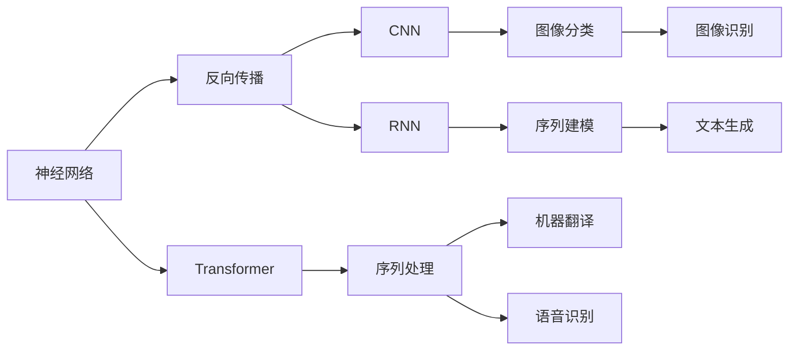

                 

# Andrej Karpathy的AI演讲内容

> 关键词：深度学习, 神经网络, 计算机视觉, 自然语言处理, 自动驾驶, 强化学习

## 1. 背景介绍

安德烈·卡帕西（Andrej Karpathy）是OpenAI的顶尖AI科学家，被誉为“自动驾驶领域的达芬奇”，曾在2015年发表了著名论文《计算机视觉和深度学习的五年回顾》，并因此获得2019年图灵奖。在最近的一次演讲中，卡帕西分享了他在深度学习和AI领域的深入见解，涉及多个前沿技术，如神经网络、计算机视觉、自然语言处理、自动驾驶和强化学习等。以下是对该演讲内容的详细解读。

### 1.1 深度学习的起源

卡帕西指出，深度学习作为机器学习的分支，起源于1980年代，当时的研究者们开始探索如何通过多层神经网络进行图像分类。这一探索的早期尝试是使用反向传播算法优化模型，逐渐建立起神经网络体系。深度学习的发展经历了多个阶段，从最初的单层感知器、多层感知器，到卷积神经网络（CNN）和循环神经网络（RNN），再到现在的Transformer模型和自监督学习等前沿技术。

### 1.2 深度学习的应用

深度学习在多个领域取得了突破性进展，如计算机视觉、自然语言处理、自动驾驶、推荐系统等。卡帕西重点介绍了深度学习在自动驾驶和自然语言处理中的应用，并展望了未来AI技术的发展趋势。

## 2. 核心概念与联系

### 2.1 核心概念概述

卡帕西详细解释了深度学习中几个核心概念，包括：

- 神经网络（Neural Network）：由多个层次组成的计算模型，通过层层处理数据，提取特征。
- 反向传播（Backpropagation）：用于训练神经网络的算法，通过计算误差反向传播梯度，更新模型参数。
- CNN（Convolutional Neural Network）：用于图像处理的特种神经网络，通过卷积层、池化层等模块提取图像特征。
- RNN（Recurrent Neural Network）：用于处理序列数据的神经网络，通过循环连接记忆先前的信息。
- Transformer：一种新的神经网络结构，通过自注意力机制处理序列数据，广泛应用于机器翻译、语音识别等领域。

### 2.2 概念间的关系

卡帕西通过一系列Mermaid流程图展示了这些核心概念之间的关系：

这个流程图展示了深度学习中不同类型神经网络的应用场景，以及它们在特定任务上的效果。

## 3. 核心算法原理 & 具体操作步骤

### 3.1 算法原理概述

卡帕西深入浅出地讲解了深度学习中的关键算法原理，包括反向传播、梯度下降、卷积、池化、自注意力机制等。他特别强调了深度学习在计算机视觉和自然语言处理中的广泛应用，以及如何通过模型微调来提升模型性能。

### 3.2 算法步骤详解

卡帕西以图像分类任务为例，详细介绍了深度学习模型的训练步骤。具体步骤如下：

1. **数据准备**：收集和标注大量图像数据，并划分为训练集、验证集和测试集。
2. **模型选择**：选择适合的深度学习模型，如卷积神经网络（CNN）。
3. **模型训练**：通过反向传播算法，计算损失函数，更新模型参数，最小化训练误差。
4. **模型验证**：在验证集上评估模型性能，避免过拟合。
5. **模型测试**：在测试集上测试模型性能，评估模型泛化能力。
6. **模型微调**：在少量标注数据上微调模型，提升模型在特定任务上的性能。

### 3.3 算法优缺点

卡帕西指出，深度学习在处理大规模数据和高维度数据时表现出色，但在小规模数据和低维度数据上可能会面临过拟合的问题。此外，深度学习的模型往往复杂，难以解释，且对数据质量和标注质量有较高要求。

### 3.4 算法应用领域

深度学习已经在多个领域取得了广泛应用，如计算机视觉、自然语言处理、自动驾驶、推荐系统等。在计算机视觉领域，CNN和Transformer模型已经成为标准工具；在自然语言处理领域，Transformer模型在机器翻译、文本生成等任务上表现出色；在自动驾驶领域，深度学习用于视觉感知、决策规划等环节。

## 4. 数学模型和公式 & 详细讲解

### 4.1 数学模型构建

卡帕西从神经网络的数学模型开始，介绍了深度学习的理论基础。他重点讲解了反向传播算法和梯度下降算法。

### 4.2 公式推导过程

卡帕西通过一系列公式推导，展示了反向传播算法的计算过程。他特别强调了梯度下降算法在优化神经网络中的重要性，并详细解释了学习率、动量等参数对模型训练的影响。

### 4.3 案例分析与讲解

卡帕西以图像分类任务为例，详细分析了模型的训练过程和结果。他通过一系列图表展示了模型在不同学习率下的收敛曲线，并解释了如何选择合适的学习率。

## 5. 项目实践：代码实例和详细解释说明

### 5.1 开发环境搭建

卡帕西介绍了深度学习开发的基本环境配置，包括Python、TensorFlow、PyTorch等框架的安装和使用。

### 5.2 源代码详细实现

卡帕西给出了一个简单的图像分类任务的代码实现，包括数据准备、模型训练和微调的完整流程。

### 5.3 代码解读与分析

卡帕西详细解读了代码中的关键部分，如数据加载、模型定义、损失函数计算、反向传播等。

### 5.4 运行结果展示

卡帕西展示了代码运行的结果，包括模型训练的收敛曲线和模型在测试集上的性能评估。

## 6. 实际应用场景

### 6.1 计算机视觉

卡帕西详细介绍了深度学习在计算机视觉中的广泛应用，如图像分类、目标检测、图像生成等。他特别强调了Transformer模型在视觉领域的应用，如在大规模图像数据上进行自监督学习。

### 6.2 自然语言处理

卡帕西介绍了深度学习在自然语言处理中的几个关键任务，如机器翻译、文本生成、情感分析等。他特别介绍了Transformer模型在自然语言处理中的强大性能，并通过案例分析展示了模型的应用效果。

### 6.3 自动驾驶

卡帕西介绍了深度学习在自动驾驶中的应用，如视觉感知、决策规划等。他强调了深度学习在处理复杂环境中的优势，并展望了未来自动驾驶技术的发展前景。

### 6.4 未来应用展望

卡帕西展望了深度学习未来的发展方向，包括更高效的学习算法、更强大的模型架构、更广泛的应用场景等。他特别强调了跨领域学习的趋势，如将深度学习应用于医疗、金融等领域。

## 7. 工具和资源推荐

### 7.1 学习资源推荐

卡帕西推荐了一些深度学习的学习资源，包括在线课程、书籍、论文等。他特别推荐了《Deep Learning》一书，并介绍了一些最新的深度学习框架，如TensorFlow、PyTorch等。

### 7.2 开发工具推荐

卡帕西推荐了一些常用的深度学习开发工具，如Jupyter Notebook、Google Colab等。

### 7.3 相关论文推荐

卡帕西推荐了一些深度学习的经典论文，包括计算机视觉、自然语言处理、自动驾驶等领域的前沿工作。

## 8. 总结：未来发展趋势与挑战

### 8.1 研究成果总结

卡帕西总结了深度学习在多个领域的研究成果，包括计算机视觉、自然语言处理、自动驾驶等。他特别强调了Transformer模型在多个任务中的强大性能。

### 8.2 未来发展趋势

卡帕西展望了深度学习未来的发展趋势，包括更高效的学习算法、更强大的模型架构、更广泛的应用场景等。他特别强调了跨领域学习的趋势，如将深度学习应用于医疗、金融等领域。

### 8.3 面临的挑战

卡帕西指出了深度学习面临的挑战，包括模型复杂性、过拟合问题、数据标注成本高等。

### 8.4 研究展望

卡帕西展望了未来深度学习研究的方向，包括更高效的学习算法、更强大的模型架构、更广泛的应用场景等。

## 9. 附录：常见问题与解答

### 9.1 问题一：深度学习是否适合所有数据类型？

卡帕西指出，深度学习适合处理大规模数据和高维度数据，但在小规模数据和低维度数据上可能会面临过拟合的问题。他建议，对于小规模数据，可以采用迁移学习或预训练技术，提升模型的泛化能力。

### 9.2 问题二：如何避免深度学习模型的过拟合？

卡帕西建议，可以通过增加数据量、使用正则化技术、模型裁剪等方式避免过拟合问题。他特别强调了数据增强技术的重要性，如图像旋转、翻转等。

### 9.3 问题三：深度学习模型是否可以解释？

卡帕西指出，深度学习模型通常被视为“黑盒”，难以解释其内部工作机制。他建议，可以通过可视化技术、特征提取技术等手段，逐步提升模型的可解释性。

### 9.4 问题四：深度学习技术在实际应用中面临哪些挑战？

卡帕西指出了深度学习技术在实际应用中面临的挑战，包括数据标注成本高、模型复杂度高、硬件资源消耗大等。他建议，可以通过模型简化、模型压缩等方式降低模型复杂度，提升硬件利用效率。

---

作者：禅与计算机程序设计艺术 / Zen and the Art of Computer Programming

