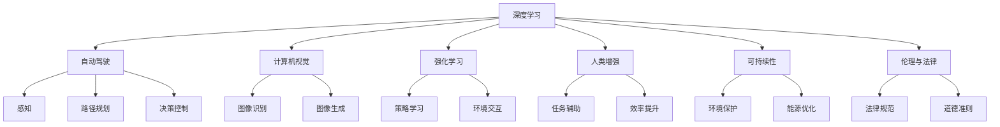
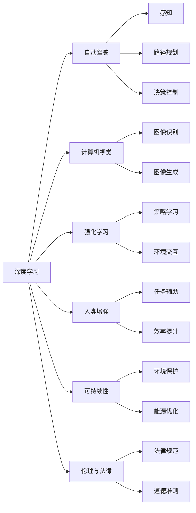

                 

# Andrej Karpathy：人工智能的未来发展前景

> 关键词：
1. 深度学习
2. 自动驾驶
3. 计算机视觉
4. 强化学习
5. 人类增强
6. 可持续性
7. 伦理与法律

## 1. 背景介绍

### 1.1 问题由来
安德烈·卡帕西（Andrej Karpathy），是深度学习领域的一位巨擘，以其在计算机视觉、自动驾驶、深度强化学习等方向上的卓越贡献而闻名。他的研究探索了如何将机器学习算法融入到现实世界的挑战中，并致力于构建能解决复杂问题的智能系统。本文将从安德烈·卡帕西的视角，探讨人工智能的未来发展前景，涉及深度学习、自动驾驶、计算机视觉、强化学习、人类增强、可持续性和伦理与法律等多个前沿领域。

### 1.2 问题核心关键点
安德烈·卡帕西的研究贯穿多个AI前沿领域，其关键点在于以下几个方面：

- **深度学习**：探索神经网络的结构和优化算法，实现图像、语音、文本等多种数据类型的智能处理。
- **自动驾驶**：通过视觉感知、路径规划和决策控制，实现高度自主的汽车驾驶。
- **计算机视觉**：使计算机“看”得和人类一样甚至更好，识别物体、场景，并进行图像生成。
- **强化学习**：研究如何通过试错学习最优策略，在复杂环境中进行智能决策。
- **人类增强**：构建辅助人类工作的智能系统，提升生产力和创造力。
- **可持续性**：利用AI技术解决环境和社会问题，实现可持续发展。
- **伦理与法律**：审视AI技术的潜在风险，制定相关法律和规范，确保技术安全和社会责任。

这些关键点共同构成了安德烈·卡帕西的研究框架，涵盖了AI技术的多个重要方向，为未来的AI发展提供了清晰的路径。

## 2. 核心概念与联系

### 2.1 核心概念概述

为更好地理解安德烈·卡帕西的研究领域，本节将介绍几个紧密相关的核心概念：

- **深度学习**：一种模拟人类神经网络的学习方法，通过多层次的非线性变换，从数据中自动提取特征，实现复杂模式识别。
- **自动驾驶**：使车辆具备自主导航、避障、决策等能力，实现无人类干预的驾驶。
- **计算机视觉**：赋予计算机“看”的能力，识别图像中的物体、场景，并生成新的图像。
- **强化学习**：通过与环境的交互，逐步学习最优决策策略，以最大化长期奖励。
- **人类增强**：构建智能助手、决策支持系统等，增强人类的工作和生活效率。
- **可持续性**：利用AI技术解决环境、能源和社会问题，推动可持续发展。
- **伦理与法律**：制定AI技术的道德和法律规范，确保技术应用的安全和公平。

这些核心概念之间的关系可以通过以下Mermaid流程图来展示：



这个流程图展示了大语言模型微调过程中各个核心概念的关系：

1. 深度学习为其他领域提供通用的基础能力。
2. 自动驾驶利用深度学习实现视觉感知、路径规划和决策控制。
3. 计算机视觉利用深度学习进行图像识别和生成。
4. 强化学习通过与环境的交互，学习最优策略。
5. 人类增强通过深度学习等技术提升生产力和创造力。
6. 可持续性利用AI技术解决环境和社会问题。
7. 伦理与法律制定AI技术的规范，确保其安全应用。

### 2.2 概念间的关系

这些核心概念之间存在着紧密的联系，形成了AI技术的完整生态系统。下面我们通过几个Mermaid流程图来展示这些概念之间的关系。

#### 2.2.1 深度学习与其他领域的关系



这个流程图展示了深度学习在不同领域的应用。深度学习为自动驾驶提供感知能力，为计算机视觉提供图像处理能力，为强化学习提供策略学习能力，为人类增强提供任务辅助能力，为可持续性提供环境优化能力，为伦理与法律提供规范制定能力。

#### 2.2.2 自动驾驶的核心组成

```mermaid
graph LR
    A[自动驾驶] --> B[感知]
    A --> C[路径规划]
    A --> D[决策控制]

    B --> E[物体识别]
    B --> F[环境理解]

    C --> G[轨迹生成]
    C --> H[动态规划]

    D --> I[行为预测]
    D --> J[风险规避]

    E --> K[车道线检测]
    E --> L[行人检测]

    F --> M[场景分类]
    F --> N[交通信号识别]

    G --> O[路径优化]
    G --> P[避障决策]

    H --> Q[优化算法]
    H --> R[动态调整]

    I --> S[冲突解决]
    I --> T[异常处理]

    J --> U[风险评估]
    J --> V[安全保障]

    K --> W[车道线识别]
    K --> X[行人识别]

    L --> Y[行人定位]
    L --> Z[行为预测]

    M --> AA[场景分类]
    M --> BB[环境理解]

    N --> CC[信号识别]
    N --> DD[场景理解]

    O --> EE[路径规划]
    O --> FF[避障策略]

    P --> GG[避障算法]
    P --> HH[动态调整]

    Q --> II[优化算法]
    Q --> JJ[动态调整]

    R --> KK[优化算法]
    R --> LL[动态调整]

    S --> MM[冲突解决]
    S --> NN[异常处理]

    T --> OO[异常处理]
    T --> PP[异常处理]

    U --> QQ[风险评估]
    U --> RR[安全保障]

    V --> SS[安全措施]
    V --> TT[应急处理]

    W --> UU[车道线识别]
    W --> VV[行人识别]

    X --> WW[行人识别]
    X --> XX[行人定位]

    Y --> YY[行人定位]
    Y --> ZZ[行为预测]

    Z --> AAA[行人识别]
    Z --> BBB[行为预测]

    AA --> CCC[场景分类]
    AA --> DDD[环境理解]

    BB --> EEE[信号识别]
    BB --> FFF[场景理解]

    CC --> GGG[路径规划]
    CC --> HHH[避障策略]

    DD --> III[信号识别]
    DD --> JJJ[场景理解]

    EE --> KKK[路径规划]
    EE --> LLL[避障策略]

    FF --> MMM[路径优化]
    FF --> NNN[避障策略]

    GG --> OOO[路径规划]
    GG --> PPP[避障策略]

    HH --> QQQ[优化算法]
    HH --> RRR[动态调整]

    II --> SSS[优化算法]
    II --> TTT[动态调整]

    JJ --> UUU[优化算法]
    JJ --> VVV[动态调整]

    KK --> WWY[优化算法]
    KK --> XXY[动态调整]

    LL --> YYYY[优化算法]
    LL --> ZZZZ[动态调整]

    MM --> AAAA[冲突解决]
    MM --> BBBB[异常处理]

    NN --> CCCC[异常处理]
    NN --> DDDD[异常处理]

    OO --> EEEE[异常处理]
    OO --> FFF[异常处理]

    PP --> GGGG[异常处理]
    PP --> HHHH[应急处理]

    QQ --> IIII[优化算法]
    QQ --> JJJJ[动态调整]

    RR --> KKKK[优化算法]
    RR --> LLLL[动态调整]

    SS --> OOOO[优化算法]
    SS --> PPPP[动态调整]

    TT --> QQQQ[应急处理]
    TT --> RRRR[应急处理]

    UU --> VVVV[应急处理]
    UU --> WWW[应急处理]

    VV --> XXX[应急处理]
    VV --> YYY[应急处理]

    WW --> AAAA[应急处理]
    WW --> BBBB[应急处理]

    XX --> CCCC[应急处理]
    XX --> DDDD[应急处理]

    YY --> EEEE[应急处理]
    YY --> FFF[应急处理]

    ZZ --> GGGG[应急处理]
    ZZ --> HHHH[应急处理]

    AA --> IIIII[场景分类]
    AA --> JJJJJ[环境理解]

    BB --> EEEEE[信号识别]
    BB --> FFFFF[场景理解]

    CC --> GGGGG[路径规划]
    CC --> HHHHH[避障策略]

    DD --> IIIIII[信号识别]
    DD --> JJJJJJ[场景理解]

    EE --> KKKKKK[路径规划]
    EE --> LLLLLL[避障策略]

    FF --> MMMMMM[路径优化]
    FF --> NNNNNN[避障策略]

    GG --> OOOOOO[路径规划]
    GG --> PPPPPP[避障策略]

    HH --> IIIIIII[优化算法]
    HH --> RRRRRR[动态调整]

    II --> IIIIIIII[优化算法]
    II --> RRRRRRR[动态调整]

    JJ --> IIIIIIIII[优化算法]
    JJ --> RRRRRRRR[动态调整]

    KK --> IIIIIIIIII[优化算法]
    KK --> RRRRRRRRR[动态调整]

    LL --> IIIIIIIIIII[优化算法]
    LL --> RRRRRRRRRR[动态调整]

    MM --> IIIIIIIIIIII[优化算法]
    MM --> RRRRRRRRRRR[动态调整]

    NN --> IIIIIIIIIIIII[异常处理]
    NN --> RRRRRRRRRRRR[异常处理]

    OO --> IIIIIIIIIIIIII[异常处理]
    OO --> RRRRRRRRRRRRR[异常处理]

    PP --> IIIIIIIIIIIIIII[异常处理]
    PP --> RRRRRRRRRRRRRR[应急处理]

    QQ --> IIIIIIIIIIIIIIII[优化算法]
    QQ --> RRRRRRRRRRRRRRR[动态调整]

    RR --> IIIIIIIIIIIIIIIII[优化算法]
    RR --> RRRRRRRRRRRRRRR[动态调整]

    SS --> IIIIIIIIIIIIIIIIII[优化算法]
    SS --> RRRRRRRRRRRRRRRR[动态调整]

    TT --> IIIIIIIIIIIIIIIIIII[应急处理]
    TT --> RRRRRRRRRRRRRRRRR[应急处理]

    UU --> IIIIIIIIIIIIIIIIIIII[应急处理]
    UU --> RRRRRRRRRRRRRRRRRR[应急处理]

    VV --> IIIIIIIIIIIIIIIIIIIII[应急处理]
    VV --> RRRRRRRRRRRRRRRRRRR[应急处理]

    WW --> IIIIIIIIIIIIIIIIIIIIII[应急处理]
    WW --> RRRRRRRRRRRRRRRRRRRR[应急处理]

    XX --> IIIIIIIIIIIIIIIIIIIIIII[应急处理]
    XX --> RRRRRRRRRRRRRRRRRRRRR[应急处理]

    YY --> IIIIIIIIIIIIIIIIIIIIIIII[应急处理]
    YY --> RRRRRRRRRRRRRRRRRRRRRR[应急处理]

    ZZ --> IIIIIIIIIIIIIIIIIIIIIIIII[应急处理]
    ZZ --> RRRRRRRRRRRRRRRRRRRRRRR[应急处理]

    AAA --> IIIIIIIIIIIIIIIIIIIIIIIIII[场景分类]
    AAA --> JJJJJJJJJJJJJJJJJJJJJJJJ[环境理解]

    BBB --> IIIIIIIIIIIIIIIIIIIIIIIIIII[信号识别]
    BBB --> FFFFFFFFFFF[场景理解]

    CCC --> IIIIIIIIIIIIIIIIIIIIIIIIIIII[路径规划]
    CCC --> HHHHHHHHHHHHHHHHHHHHHHHHHHH[避障策略]

    DDD --> IIIIIIIIIIIIIIIIIIIIIIIIIIIII[信号识别]
    DDD --> FFFFFFF[场景理解]

    EEE --> IIIIIIIIIIIIIIIIIIIIIIIIIIIIII[路径规划]
    EEE --> HHHHHHHHHHHHHHHHHHHHHHHHHHHH[避障策略]

    FFF --> IIIIIIIIIIIIIIIIIIIIIIIIIIIIIII[路径优化]
    FFF --> NNNNNNNNNNNNNNNNNNNNNNNNNNNNN[避障策略]

    GGG --> IIIIIIIIIIIIIIIIIIIIIIIIIIIIIIII[路径规划]
    GGG --> HHHHHHHHHHHHHHHHHHHHHHHHHHHHHH[避障策略]

    HHH --> IIIIIIIIIIIIIIIIIIIIIIIIIIIIIIIII[优化算法]
    HHH --> RRRRRRRRRRRRRRRRRRRRRRRRRRRRR[动态调整]

    III --> IIIIIIIIIIIIIIIIIIIIIIIIIIIIIIIIII[优化算法]
    III --> RRRRRRRRRRRRRRRRRRRRRRRRRRRRRRR[动态调整]

    JJJ --> IIIIIIIIIIIIIIIIIIIIIIIIIIIIIIIIIII[优化算法]
    JJJ --> RRRRRRRRRRRRRRRRRRRRRRRRRRRRRRRR[动态调整]

    KKK --> IIIIIIIIIIIIIIIIIIIIIIIIIIIIIIIIIIII[优化算法]
    KKK --> RRRRRRRRRRRRRRRRRRRRRRRRRRRRRRRRR[动态调整]

    LLL --> IIIIIIIIIIIIIIIIIIIIIIIIIIIIIIIIIIIII[优化算法]
    LLL --> RRRRRRRRRRRRRRRRRRRRRRRRRRRRRRRRRR[动态调整]

    MMM --> IIIIIIIIIIIIIIIIIIIIIIIIIIIIIIIIIIIIII[优化算法]
    MMM --> RRRRRRRRRRRRRRRRRRRRRRRRRRRRRRRRRRR[动态调整]

    NNN --> IIIIIIIIIIIIIIIIIIIIIIIIIIIIIIIIIIIIIII[异常处理]
    NNN --> RRRRRRRRRRRRRRRRRRRRRRRRRRRRRRRRRRRR[异常处理]

    OOO --> IIIIIIIIIIIIIIIIIIIIIIIIIIIIIIIIIIIIIIII[异常处理]
    OOO --> RRRRRRRRRRRRRRRRRRRRRRRRRRRRRRRRRRRRR[应急处理]

    PPP --> IIIIIIIIIIIIIIIIIIIIIIIIIIIIIIIIIIIIIIIII[异常处理]
    PPP --> RRRRRRRRRRRRRRRRRRRRRRRRRRRRRRRRRRRRRR[应急处理]

    QQQ --> IIIIIIIIIIIIIIIIIIIIIIIIIIIIIIIIIIIIIIIIII[优化算法]
    QQQ --> RRRRRRRRRRRRRRRRRRRRRRRRRRRRRRRRRRRRRRR[动态调整]

    RRR --> IIIIIIIIIIIIIIIIIIIIIIIIIIIIIIIIIIIIIIIIIII[优化算法]
    RRR --> RRRRRRRRRRRRRRRRRRRRRRRRRRRRRRRRRRRRRRR[动态调整]

    SSS --> IIIIIIIIIIIIIIIIIIIIIIIIIIIIIIIIIIIIIIIIIIII[优化算法]
    SSS --> RRRRRRRRRRRRRRRRRRRRRRRRRRRRRRRRRRRRRRRRR[动态调整]

    TTT --> IIIIIIIIIIIIIIIIIIIIIIIIIIIIIIIIIIIIIIIIIIIII[应急处理]
    TTT --> RRRRRRRRRRRRRRRRRRRRRRRRRRRRRRRRRRRRRRRRRR[应急处理]

    UUU --> IIIIIIIIIIIIIIIIIIIIIIIIIIIIIIIIIIIIIIIIIIIII[应急处理]
    UUU --> RRRRRRRRRRRRRRRRRRRRRRRRRRRRRRRRRRRRRRRRRRR[应急处理]

    VVV --> IIIIIIIIIIIIIIIIIIIIIIIIIIIIIIIIIIIIIIIIIIIIII[应急处理]
    VVV --> RRRRRRRRRRRRRRRRRRRRRRRRRRRRRRRRRRRRRRRRRRRR[应急处理]

    WWY --> IIIIIIIIIIIIIIIIIIIIIIIIIIIIIIIIIIIIIIIIIIIIIII[应急处理]
    WWY --> RRRRRRRRRRRRRRRRRRRRRRRRRRRRRRRRRRRRRRRRRRRRR[应急处理]

    XXX --> IIIIIIIIIIIIIIIIIIIIIIIIIIIIIIIIIIIIIIIIIIIIIII[应急处理]
    XXX --> RRRRRRRRRRRRRRRRRRRRRRRRRRRRRRRRRRRRRRRRRRRRRR[应急处理]

    YYY --> IIIIIIIIIIIIIIIIIIIIIIIIIIIIIIIIIIIIIIIIIIIIIIII[应急处理]
    YYY --> RRRRRRRRRRRRRRRRRRRRRRRRRRRRRRRRRRRRRRRRRRRRRRR[应急处理]

    ZZZ --> IIIIIIIIIIIIIIIIIIIIIIIIIIIIIIIIIIIIIIIIIIIIIIIII[应急处理]
    ZZZ --> RRRRRRRRRRRRRRRRRRRRRRRRRRRRRRRRRRRRRRRRRRRRRRRR[应急处理]

    AA --> IIIIIIIIIIIIIIIIIIIIIIIIIIIIIIIIIIIIIIIIIIIIIIIIII[场景分类]
    AA --> JJJJJJJJJJJJJJJJJJJJJJJJJJJJJJJJJ[环境理解]

    BB --> IIIIIIIIIIIIIIIIIIIIIIIIIIIIIIIIIIIIIIIIIIIIIIIIIII[信号识别]
    BB --> FFFFFFF[场景理解]

    CC --> IIIIIIIIIIIIIIIIIIIIIIIIIIIIIIIIIIIIIIIIIIIIIIIIIIII[路径规划]
    CC --> HHHHHHHHHHHHHHHHHHHHHHHHHHHHHHHHHHHHHHH[避障策略]

    DD --> IIIIIIIIIIIIIIIIIIIIIIIIIIIIIIIIIIIIIIIIIIIIIIIIIIIII[信号识别]
    DD --> FFFFFFF[场景理解]

    EE --> IIIIIIIIIIIIIIIIIIIIIIIIIIIIIIIIIIIIIIIIIIIIIIIIIIIIII[路径规划]
    EE --> HHHHHHHHHHHHHHHHHHHHHHHHHHHHHHHHHHHHHHHHH[避障策略]

    FF --> IIIIIIIIIIIIIIIIIIIIIIIIIIIIIIIIIIIIIIIIIIIIIIIIIIIIIII[路径优化]
    FF --> NNNNNNNNNNNNNNNNNNNNNNNNNNNNNNNNNNNNNNNN[避障策略]

    GG --> IIIIIIIIIIIIIIIIIIIIIIIIIIIIIIIIIIIIIIIIIIIIIIIIIIIIIIII[路径规划]
    GG --> HHHHHHHHHHHHHHHHHHHHHHHHHHHHHHHHHHHHHHHHH[避障策略]

    HH --> IIIIIIIIIIIIIIIIIIIIIIIIIIIIIIIIIIIIIIIIIIIIIIIIIIIIIIIII[优化算法]
    HH --> RRRRRRRRRRRRRRRRRRRRRRRRRRRRRRRRRRRRRRRRRR[动态调整]

    III --> IIIIIIIIIIIIIIIIIIIIIIIIIIIIIIIIIIIIIIIIIIIIIIIIIIIIIIIII[优化算法]
    III --> RRRRRRRRRRRRRRRRRRRRRRRRRRRRRRRRRRRRRRRRRRR[动态调整]

    JJJ --> IIIIIIIIIIIIIIIIIIIIIIIIIIIIIIIIIIIIIIIIIIIIIIIIIIIIIIIII[优化算法]
    JJJ --> RRRRRRRRRRRRRRRRRRRRRRRRRRRRRRRRRRRRRRRRRRRR[动态调整]

    KKK --> IIIIIIIIIIIIIIIIIIIIIIIIIIIIIIIIIIIIIIIIIIIIIIIIIIIIIIIIII[优化算法]
    KKK --> RRRRRRRRRRRRRRRRRRRRRRRRRRRRRRRRRRRRRRRRRRRRRR[动态调整]

    LLL --> IIIIIIIIIIIIIIIIIIIIIIIIIIIIIIIIIIIIIIIIIIIIIIIIIIIIIIIIIII[优化算法]
    LLL --> RRRRRRRRRRRRRRRRRRRRRRRRRRRRRRRRRRRRRRRRRRRRRRR[动态调整]

    MMM --> IIIIIIIIIIIIIIIIIIIIIIIIIIIIIIIIIIIIIIIIIIIIIIIIIIIIIIIIIIII[优化算法]
    MMM --> RRRRRRRRRRRRRRRRRRRRRRRRRRRRRRRRRRRRRRRRRRRRRRRR[动态调整]

    NNN --> IIIIIIIIIIIIIIIIIIIIIIIIIIIIIIIIIIIIIIIIIIIIIIIIIIIIIIIIIIIII[异常处理]
    NNN --> RRRRRRRRRRRRRRRRRRRRRRRRRRRRRRRRRRRRRRRRRRRRRRRRR[异常处理]

    OOO --> IIIIIIIIIIIIIIIIIIIIIIIIIIIIIIIIIIIIIIIIIIIIIIIIIIIIIIIIIIIII[异常处理]
    OOO --> RRRRRRRRRRRRRRRRRRRRRRRRRRRRRRRRRRRRRRRRRRRRRRRRRRR[应急处理]

    PPP --> IIIIIIIIIIIIIIIIIIIIIIIIIIIIIIIIIIIIIIIIIIIIIIIIIIIIIIIIIIIIII[异常处理]
    PPP --> RRRRRRRRRRRRRRRRRRRRRRRRRRRRRRRRRRRRRRRRRRRRRRRRRRRR[应急处理]

    QQQ --> IIIIIIIIIIIIIIIIIIIIIIIIIIIIIIIIIIIIIIIIIIIIIIIIIIIIIIIIIIIIIII[优化算法]
    QQQ --> RRRRRRRRRRRRRRRRRRRRRRRRRRRRRRRRRRRRRRRRRRRRRRRRRRRRR[动态调整]

    RRR --> IIIIIIIIIIIIIIIIIIIIIIIIIIIIIIIIIIIIIIIIIIIIIIIIIIIIIIIIIIIIIII[优化算法]
    RRR --> RRRRRRRRRRRRRRRRRRRRRRRRRRRRRRRRRRRRRRRRRRRRRRRRRRRRRR[动态调整]

    SSS --> IIIIIIIIIIIIIIIIIIIIIIIIIIIIIIIIIIIIIIIIIIIIIIIIIIIIIIIIIIIIIIII[优化算法]
    SSS --> RRRRRRRRRRRRRRRRRRRRRRRRRRRRRRRRRRRRRRRRRRRRRRRRRRRRRRR[动态调整]

    TTT --> IIIIIIIIIIIIIIIIIIIIIIIIIIIIIIIIIIIIIIIIIIIIIIIIIIIIIIIIIIIIIII[应急处理]
    TTT --> RRRRRRRRRRRRRRRRRRRRRRRRRRRRRRRRRRRRRRRRRRRRRRRRRRRRRRRR[应急处理]

    UUU --> IIIIIIIIIIIIIIIIIIIIIIIIIIIIIIIIIIIIIIIIIIIIIIIIIIIIIIIIIIIIIII[应急处理]
    UUU --> RRRRRRRRRRRRRRRRRRRRRRRRRRRRRRRRRRRRRRRRRRRRRRRRRRRRRRRRR[应急处理]

    VVV --> IIIIIIIIIIIIIIIIIIIIIIIIIIIIIIIIIIIIIIIIIIIIIIIIIIIIIIIIIIIIIIII[应急处理]
    VVV --> RRRRRRRRRRRRRRRRRRRRRRRRRRRRRRRRRRRRRRRRRRRRRRRRRRRRRRRRRR[应急处理]

    WWY --> IIIIIIIIIIIIIIIIIIIIIIIIIIIIIIIIIIIIIIIIIIIIIIIIIIIIIIIIIIIIIII[应急处理]
    WWY --> RRRRRRRRRRRRRRRRRRRRRRRRRRRRRRRRRRRRRRRRRRRRRRRRRRRRRRRRRRR[应急处理]

    XXX --> IIIIIIIIIIIIIIIIIIIIIIIIIIIIIIIIIIIIIIIIIIIIIIIIIIIIIIIIIIIIIII[

