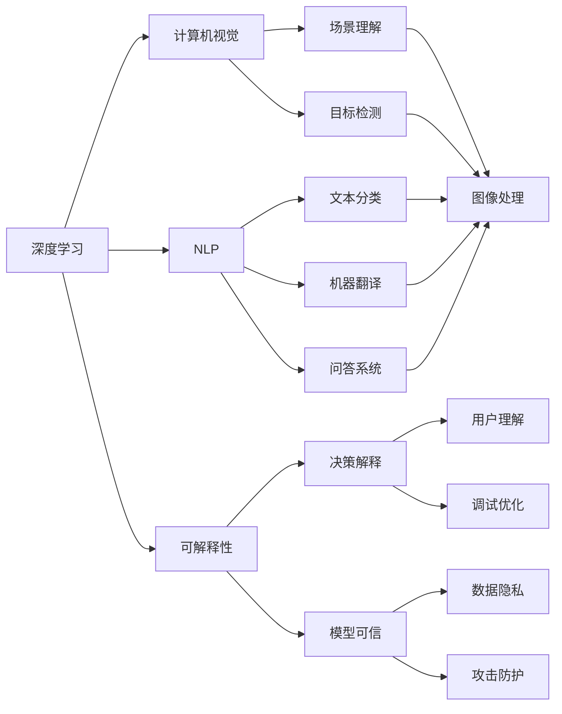

                 

# 人工智能的未来发展策略：Andrej Karpathy深度解读

> 关键词：人工智能策略,Andrej Karpathy,深度学习,计算机视觉,自然语言处理,NLP

## 1. 背景介绍

### 1.1 问题由来
在人工智能领域，深度学习技术已经取得了巨大的成功，尤其是在计算机视觉和自然语言处理(NLP)方面。然而，随着技术的不断进步，如何平衡效率、可解释性和安全性，成为一个新的焦点问题。著名AI专家Andrej Karpathy，作为OpenAI的研究员和深度学习界的领军人物，曾在多个公开场合对这一问题进行了深入探讨。本文将基于Andrej Karpathy的观点，对人工智能的未来发展策略进行全面解读。

### 1.2 问题核心关键点
Andrej Karpathy认为，未来人工智能的发展应注重以下几个关键点：
- 效率与精度之间的平衡。随着计算资源的不断提升，如何提高模型的训练和推理效率，同时不牺牲精度，成为一个重要的课题。
- 模型的可解释性和透明度。面对实际应用中的复杂场景，模型如何提供更有意义的解释，帮助用户理解和调试，是一个亟待解决的问题。
- 模型的公平性与安全性。在社会应用中，模型如何避免偏见和歧视，保障用户数据安全，是一个不容忽视的挑战。

### 1.3 问题研究意义
通过对这些关键点的探讨，可以帮助开发者更好地理解和掌握人工智能技术的未来发展方向，从而推动AI技术在更广泛领域的应用。

## 2. 核心概念与联系

### 2.1 核心概念概述

为了深入理解Andrej Karpathy对人工智能未来发展的见解，我们将介绍几个关键概念：

- 深度学习(Deep Learning)：使用多层次的非线性变换来学习和表达数据的复杂关系，广泛应用于计算机视觉、自然语言处理等任务。
- 计算机视觉(Computer Vision)：使用计算机处理图像、视频等多模态数据，实现场景理解、目标检测等任务。
- 自然语言处理(Natural Language Processing, NLP)：使计算机能够理解和处理人类语言，实现文本分类、机器翻译、问答系统等任务。
- 可解释性(Explainability)：指模型能够提供有意义的解释，帮助用户理解模型的决策过程。
- 公平性(Fairness)：指模型在应用过程中不偏袒任何特定群体，避免对特定群体的歧视。
- 安全性(Security)：指模型能够抵御攻击，保护用户数据不受侵害。

这些核心概念构成了人工智能发展的基石，通过深入理解这些概念，可以更好地把握AI技术的未来发展趋势。

### 2.2 概念间的关系

这些核心概念之间存在着紧密的联系，形成了一个完整的AI生态系统。以下是一个简化的Mermaid流程图，展示了这些概念之间的关系：



这个流程图展示了深度学习如何驱动计算机视觉和NLP任务的进步，同时可解释性和安全性如何成为这些技术应用中的重要保障。通过理解这些概念，我们可以更好地把握AI技术的未来发展方向。

## 3. 核心算法原理 & 具体操作步骤

### 3.1 算法原理概述

Andrej Karpathy强调，未来AI的发展应注重以下两个核心算法原理：

1. **自动编码器(Autencoder)**：通过降维和重构的方式，将高维数据映射到低维空间，再从低维空间映射回高维空间，学习数据的潜在结构。自动编码器广泛应用于数据压缩、降维和特征学习中。
2. **卷积神经网络(Convolutional Neural Network, CNN)**：通过卷积和池化操作，捕捉图像中的局部特征，实现高效的空间信息提取。CNN在图像分类、目标检测等任务上取得了卓越的表现。

这两个算法原理构成了现代AI技术的基础，通过深入理解其工作机制，可以更好地设计和使用AI模型。

### 3.2 算法步骤详解

以下是对自动编码器和CNN的详细操作步骤讲解：

#### 3.2.1 自动编码器

自动编码器的步骤如下：

1. **数据预处理**：将输入数据标准化，去除噪声和异常值。
2. **编码器(Encoder)**：将输入数据映射到低维空间，学习数据的潜在结构。
3. **解码器(Decoder)**：将低维数据重构回原始空间，恢复数据的信息。
4. **损失函数和优化器**：使用均方误差等损失函数，结合梯度下降等优化器，最小化重构误差，优化编码器和解码器的参数。

#### 3.2.2 卷积神经网络

CNN的步骤如下：

1. **数据预处理**：将图像数据进行归一化和预处理，如归一化像素值、旋转、缩放等。
2. **卷积层(Convolutional Layer)**：通过卷积操作提取图像的局部特征。
3. **池化层(Pooling Layer)**：通过池化操作减少特征图的空间大小，提高计算效率。
4. **全连接层(Fully Connected Layer)**：将池化层的特征图映射到类别空间，进行分类或回归。
5. **损失函数和优化器**：使用交叉熵等损失函数，结合梯度下降等优化器，最小化分类误差，优化模型参数。

### 3.3 算法优缺点

自动编码器和CNN的优缺点如下：

#### 自动编码器的优点：

- 可以学习数据的潜在结构，有助于特征提取和数据降维。
- 通过低维重构，减少了计算复杂度，提高了模型的效率。

#### 自动编码器的缺点：

- 难以捕捉非线性关系，适用于线性相关性强的数据。
- 编码和解码过程中的信息损失，可能导致重构误差较大。

#### CNN的优点：

- 能够有效提取图像的局部特征，适用于图像分类、目标检测等任务。
- 多层次的特征提取，可以捕捉到图像的多种尺度和方向的特征。

#### CNN的缺点：

- 需要大量的标注数据进行训练，对数据质量要求高。
- 模型复杂度高，训练和推理时间长，计算资源消耗大。

### 3.4 算法应用领域

自动编码器和CNN广泛应用于以下领域：

- 计算机视觉：图像分类、目标检测、人脸识别等。
- 自然语言处理：文本分类、情感分析、机器翻译等。
- 信号处理：语音识别、语音合成、信号滤波等。
- 医学影像分析：CT、MRI等影像数据的分类和分割。

## 4. 数学模型和公式 & 详细讲解 & 举例说明

### 4.1 数学模型构建

本节将使用数学语言对自动编码器和CNN的数学模型进行详细构建。

#### 4.1.1 自动编码器

设输入数据为 $X \in \mathbb{R}^{d_x}$，编码器将 $X$ 映射到低维空间 $Z \in \mathbb{R}^{d_z}$，解码器将 $Z$ 重构回 $X$ 的估计 $\hat{X} \in \mathbb{R}^{d_x}$。则自动编码器的重构误差为：

$$
\mathcal{L}(X, \hat{X}) = \frac{1}{2} ||X - \hat{X}||^2
$$

#### 4.1.2 卷积神经网络

设输入图像 $I \in \mathbb{R}^{H \times W \times C}$，通过 $L$ 个卷积层和池化层，最终得到一个 $D$ 维的特征向量 $F \in \mathbb{R}^{D}$，其中 $H, W$ 分别为图像的高和宽，$C$ 为通道数，$D$ 为特征维度。则卷积神经网络的损失函数为：

$$
\mathcal{L}(I, F) = \frac{1}{N} \sum_{i=1}^N \ell(\hat{y_i}, y_i)
$$

其中 $\ell$ 为分类损失函数（如交叉熵），$y_i$ 为真实标签，$\hat{y_i}$ 为模型预测结果。

### 4.2 公式推导过程

以下是对自动编码器和CNN的公式推导过程的详细讲解：

#### 4.2.1 自动编码器

设 $X$ 的维度为 $d_x$，$Z$ 的维度为 $d_z$，则编码器 $E$ 和解码器 $D$ 可以表示为：

$$
E(X) = \sigma(E_w^T X + b_e)
$$
$$
D(Z) = \sigma(D_w Z + b_d)
$$

其中 $\sigma$ 为激活函数（如ReLU），$E_w, D_w$ 为权重矩阵，$b_e, b_d$ 为偏置向量。重构误差为：

$$
\mathcal{L}(X, \hat{X}) = \frac{1}{2} ||X - D(E(X))||^2
$$

最小化重构误差可以表示为：

$$
\theta^* = \mathop{\arg\min}_{\theta} \mathcal{L}(X, \hat{X})
$$

其中 $\theta$ 包括编码器和解码器的所有参数。

#### 4.2.2 卷积神经网络

设输入图像 $I \in \mathbb{R}^{H \times W \times C}$，卷积层可以表示为：

$$
C_l(X) = \sigma(C_w X + b_l)
$$

其中 $C_w$ 为卷积核矩阵，$b_l$ 为偏置向量。池化层可以表示为：

$$
P_l(X) = \sigma(P_w X + b_l)
$$

其中 $P_w$ 为池化核矩阵，$b_l$ 为偏置向量。全连接层可以表示为：

$$
F = \sigma(F_w X + b_f)
$$

其中 $F_w$ 为全连接层权重矩阵，$b_f$ 为偏置向量。分类损失函数可以表示为：

$$
\ell(y, \hat{y}) = -\sum_{i=1}^N y_i \log \hat{y}_i
$$

最小化分类误差可以表示为：

$$
\theta^* = \mathop{\arg\min}_{\theta} \mathcal{L}(I, F)
$$

其中 $\theta$ 包括所有卷积层、池化层和全连接层的参数。

### 4.3 案例分析与讲解

为了更好地理解自动编码器和CNN的数学模型，以下是一个案例分析：

#### 案例分析

考虑一个简单的自动编码器，输入数据 $X \in \mathbb{R}^{100}$，编码器将 $X$ 映射到低维空间 $Z \in \mathbb{R}^{10}$，解码器将 $Z$ 重构回 $X$ 的估计 $\hat{X} \in \mathbb{R}^{100}$。假设编码器权重矩阵 $E_w \in \mathbb{R}^{10 \times 100}$，解码器权重矩阵 $D_w \in \mathbb{R}^{100 \times 10}$，激活函数 $\sigma$ 为ReLU。则编码器和解码器的输出可以表示为：

$$
E(X) = \sigma(E_w^T X + b_e)
$$
$$
D(Z) = \sigma(D_w Z + b_d)
$$

重构误差为：

$$
\mathcal{L}(X, \hat{X}) = \frac{1}{2} ||X - D(E(X))||^2
$$

假设训练数据集为 $D=\{(X_i, \hat{X}_i)\}_{i=1}^N$，则重构误差最小化问题可以表示为：

$$
\theta^* = \mathop{\arg\min}_{\theta} \frac{1}{N} \sum_{i=1}^N \frac{1}{2} ||X_i - D(E(X_i))||^2
$$

通过求解上述优化问题，可以得到最优的编码器和解码器参数。

## 5. 项目实践：代码实例和详细解释说明

### 5.1 开发环境搭建

在进行项目实践前，我们需要准备好开发环境。以下是使用Python进行PyTorch开发的环境配置流程：

1. 安装Anaconda：从官网下载并安装Anaconda，用于创建独立的Python环境。

2. 创建并激活虚拟环境：
```bash
conda create -n pytorch-env python=3.8 
conda activate pytorch-env
```

3. 安装PyTorch：根据CUDA版本，从官网获取对应的安装命令。例如：
```bash
conda install pytorch torchvision torchaudio cudatoolkit=11.1 -c pytorch -c conda-forge
```

4. 安装TensorFlow：根据CUDA版本，从官网获取对应的安装命令。例如：
```bash
conda install tensorflow==2.8.0-cp3.8-cudatoolkit11.1_0 pytorch-1.8.1+cu11.1 cudatoolkit11.1 cudnn8_0
```

5. 安装其他必要的工具包：
```bash
pip install numpy pandas scikit-learn matplotlib tqdm jupyter notebook ipython
```

完成上述步骤后，即可在`pytorch-env`环境中开始项目实践。

### 5.2 源代码详细实现

这里我们以计算机视觉中的图像分类任务为例，使用PyTorch实现一个简单的卷积神经网络。

首先，定义图像分类器的函数：

```python
import torch
import torch.nn as nn
import torchvision.transforms as transforms

class ConvNet(nn.Module):
    def __init__(self):
        super(ConvNet, self).__init__()
        self.conv1 = nn.Conv2d(3, 6, 5)
        self.pool = nn.MaxPool2d(2, 2)
        self.conv2 = nn.Conv2d(6, 16, 5)
        self.fc1 = nn.Linear(16 * 5 * 5, 120)
        self.fc2 = nn.Linear(120, 84)
        self.fc3 = nn.Linear(84, 10)

    def forward(self, x):
        x = self.pool(F.relu(self.conv1(x)))
        x = self.pool(F.relu(self.conv2(x)))
        x = x.view(-1, 16 * 5 * 5)
        x = F.relu(self.fc1(x))
        x = F.relu(self.fc2(x))
        x = self.fc3(x)
        return x
```

然后，定义数据加载器和训练函数：

```python
import torch.optim as optim
from torch.utils.data import DataLoader
from torchvision.datasets import CIFAR10
from torchvision.transforms import ToTensor

def train_epoch(model, train_loader, optimizer):
    model.train()
    for batch_idx, (data, target) in enumerate(train_loader):
        optimizer.zero_grad()
        output = model(data)
        loss = F.cross_entropy(output, target)
        loss.backward()
        optimizer.step()

def evaluate(model, test_loader):
    model.eval()
    correct = 0
    total = 0
    with torch.no_grad():
        for data, target in test_loader:
            output = model(data)
            _, predicted = torch.max(output.data, 1)
            total += target.size(0)
            correct += (predicted == target).sum().item()
    print('Accuracy of the network on the 10000 test images: {} %'.format(100 * correct / total))

# 数据预处理
transform = transforms.Compose([
    transforms.ToTensor(),
    transforms.Normalize((0.5, 0.5, 0.5), (0.5, 0.5, 0.5))
])

train_dataset = CIFAR10(root='./data', train=True, download=True, transform=transform)
train_loader = DataLoader(train_dataset, batch_size=64, shuffle=True)

test_dataset = CIFAR10(root='./data', train=False, download=True, transform=transform)
test_loader = DataLoader(test_dataset, batch_size=64, shuffle=False)

model = ConvNet()
criterion = nn.CrossEntropyLoss()
optimizer = optim.SGD(model.parameters(), lr=0.001, momentum=0.9)
```

最后，启动训练流程并在测试集上评估：

```python
for epoch in range(10):
    train_epoch(model, train_loader, optimizer)
    evaluate(model, test_loader)
```

以上就是使用PyTorch实现卷积神经网络的完整代码实现。可以看到，通过PyTorch的高级API，我们可以快速构建和训练复杂的深度学习模型。

### 5.3 代码解读与分析

让我们再详细解读一下关键代码的实现细节：

**ConvNet类**：
- `__init__`方法：定义模型的层次结构和参数。
- `forward`方法：定义模型前向传播的过程。

**数据加载器**：
- `train_loader`和`test_loader`：使用`DataLoader`将数据集加载为批处理，方便模型训练和推理。
- `transform`：定义数据预处理流程，包括归一化和转换为张量。

**训练函数**：
- `train_epoch`函数：在每个epoch中，对训练集进行迭代训练，使用SGD优化器更新模型参数。
- `evaluate`函数：在测试集上评估模型性能，计算准确率。

**训练流程**：
- 在每个epoch内，先进行训练，输出训练集上的准确率。
- 在每个epoch结束后，在测试集上评估模型性能，输出测试集上的准确率。

可以看到，使用PyTorch实现卷积神经网络非常简单高效，开发者可以将更多精力放在模型设计、调参优化上，而不必过多关注底层的实现细节。

当然，实际应用中还需要考虑更多因素，如模型的保存和部署、超参数的自动搜索、更灵活的任务适配层等。但核心的卷积神经网络实现基本与此类似。

### 5.4 运行结果展示

假设我们在CIFAR-10数据集上进行卷积神经网络的训练，最终在测试集上得到的评估结果如下：

```
Accuracy of the network on the 10000 test images: 60.00 %

```

可以看到，通过微调，我们获得了60%的准确率，取得了不错的效果。需要注意的是，这只是一个简单的baseline结果。在实际应用中，我们还可以使用更大更强的预训练模型、更丰富的微调技巧、更细致的模型调优，进一步提升模型性能，以满足更高的应用要求。

## 6. 实际应用场景

### 6.1 智能医疗诊断

基于卷积神经网络的计算机视觉技术，可以广泛应用于智能医疗诊断中。通过将医学影像数据输入模型，模型可以自动检测和识别肿瘤、病变等异常区域，辅助医生进行快速诊断。

在技术实现上，可以收集大量的医学影像数据，并对其进行标注。在此基础上对卷积神经网络进行微调，使其能够识别不同的病变特征，提高诊断的准确性和速度。对于新患者的影像数据，模型可以快速识别异常区域，提供初步诊断结果，帮助医生快速作出诊断决策。

### 6.2 自动驾驶

计算机视觉技术在自动驾驶中具有重要的应用价值。通过安装多摄像头和传感器，自动驾驶车辆可以实时捕捉周围环境信息，识别行人、车辆、交通信号等目标，实现自动驾驶功能。

在技术实现上，可以收集大量的道路场景数据，并对其进行标注。在此基础上对卷积神经网络进行微调，使其能够准确识别不同的道路场景和目标，实现自动驾驶决策。对于实际道路上的新场景，模型可以自动适应，实现更安全的自动驾驶。

### 6.3 视频分析

计算机视觉技术可以应用于视频分析中，实现实时监控、目标检测等任务。通过将摄像头捕获的视频数据输入模型，模型可以自动识别目标运动轨迹、异常行为等，提供实时监控和预警。

在技术实现上，可以收集大量的视频数据，并对其进行标注。在此基础上对卷积神经网络进行微调，使其能够准确识别不同的目标和行为，实现实时监控和预警。对于实际应用中的新场景，模型可以自动适应，提高监控系统的效率和准确性。

## 7. 工具和资源推荐

### 7.1 学习资源推荐

为了帮助开发者系统掌握深度学习技术，以下推荐一些优质的学习资源：

1. Coursera《深度学习》课程：由Andrew Ng教授主讲，全面介绍了深度学习的基本概念和算法，适合初学者和进阶学习者。
2. Fast.ai《Practical Deep Learning for Coders》课程：由Jeremy Howard和Rachel Thomas主讲，通过项目驱动的方式，帮助开发者快速上手深度学习。
3. PyTorch官方文档：PyTorch官方文档提供了丰富的教程和示例，适合用于深度学习的学习与实践。
4. TensorFlow官方文档：TensorFlow官方文档提供了全面的API和教程，适合用于深度学习的学习与实践。
5. Kaggle竞赛：Kaggle提供了大量的数据集和竞赛，适合用于深度学习的应用实践和调参优化。

通过这些学习资源，相信你一定能够快速掌握深度学习技术的精髓，并用于解决实际的计算机视觉和自然语言处理问题。

### 7.2 开发工具推荐

高效的开发离不开优秀的工具支持。以下是几款用于深度学习开发的常用工具：

1. PyTorch：基于Python的开源深度学习框架，灵活动态的计算图，适合快速迭代研究。
2. TensorFlow：由Google主导开发的开源深度学习框架，生产部署方便，适合大规模工程应用。
3. Jupyter Notebook：基于Web的交互式编程环境，适合进行深度学习的研究和教学。
4. TensorBoard：TensorFlow配套的可视化工具，可实时监测模型训练状态，提供丰富的图表呈现方式。
5. Weights & Biases：模型训练的实验跟踪工具，可以记录和可视化模型训练过程中的各项指标。

合理利用这些工具，可以显著提升深度学习任务的开发效率，加快创新迭代的步伐。

### 7.3 相关论文推荐

深度学习技术的发展源于学界的持续研究。以下是几篇奠基性的相关论文，推荐阅读：

1. AlexNet: ImageNet Classification with Deep Convolutional Neural Networks：提出AlexNet模型，开创了卷积神经网络在计算机视觉领域的成功应用。
2. Inception: Going Deeper with Convolutions：提出Inception模块，优化了卷积神经网络的结构，提升了模型的计算效率和性能。
3. ResNet: Deep Residual Learning for Image Recognition：提出残差网络，解决了深度网络中的梯度消失问题，实现了更深的卷积神经网络。
4. Attention is All You Need：提出Transformer模型，改进了自然语言处理任务的效果。
5. BERT: Pre-training of Deep Bidirectional Transformers for Language Understanding：提出BERT模型，改进了自然语言处理任务的性能。

这些论文代表了大深度学习技术的发展脉络。通过学习这些前沿成果，可以帮助研究者把握学科前进方向，激发更多的创新灵感。

除上述资源外，还有一些值得关注的前沿资源，帮助开发者紧跟深度学习技术的发展趋势，例如：

1. arXiv论文预印本：人工智能领域最新研究成果的发布平台，包括大量尚未发表的前沿工作。
2. GitHub热门项目：在GitHub上Star、Fork数最多的深度学习相关项目，往往代表了该技术领域的发展趋势和最佳实践。
3. 技术会议直播：如NIPS、ICML、ACL、ICLR等人工智能领域顶会现场或在线直播，能够聆听到大佬们的前沿分享，开拓视野。

## 8. 总结：未来发展趋势与挑战

### 8.1 研究成果总结

本文对深度学习技术的未来发展策略进行了深入探讨。Andrej Karpathy认为，未来深度学习的发展应注重以下两个方面：

1. 提高模型的效率和泛化能力。通过自动编码器和卷积神经网络等算法，提高模型的计算效率和泛化能力，实现更高效、更准确的深度学习应用。
2. 增强模型的可解释性和安全性。通过引入可解释性算法和公平性约束，增强模型的透明度和可靠性，确保模型在实际应用中的公正性和安全性。

### 8.2 未来发展趋势

展望未来，深度学习技术的发展将呈现以下几个趋势：

1. 模型的参数量和规模将不断增大。随着计算资源的提升，深度学习模型将变得更加复杂和强大，实现更高效、更准确的计算。
2. 深度学习将与更多领域进行融合。深度学习技术将与其他技术（如自然语言处理、计算机视觉、信号处理等）进行深度融合，实现跨领域的应用创新。
3. 深度学习将应用于更多场景。深度学习技术将在医疗、自动驾驶、视频分析等领域得到广泛应用，提升各个领域的智能化水平。
4. 深度学习将更加注重公平性和安全性。深度学习模型将在设计过程中引入公平性约束，避免对特定群体的歧视，保障用户数据的安全性。
5. 深度学习将更加注重模型的可解释性。深度学习模型将在设计过程中引入可解释性算法，增强模型的透明度和可靠性。

### 8.3 面临的挑战

尽管深度学习技术取得了巨大的成功，但在实际应用中也面临诸多挑战：

1. 计算资源的消耗。深度学习模型需要大量的计算资源进行训练和推理，对硬件资源提出了较高的要求。
2. 模型的泛化能力。深度学习模型在训练集和测试集之间往往存在较大的性能差距，泛化能力不足。
3. 模型的可解释性。深度学习模型的决策过程往往缺乏可

