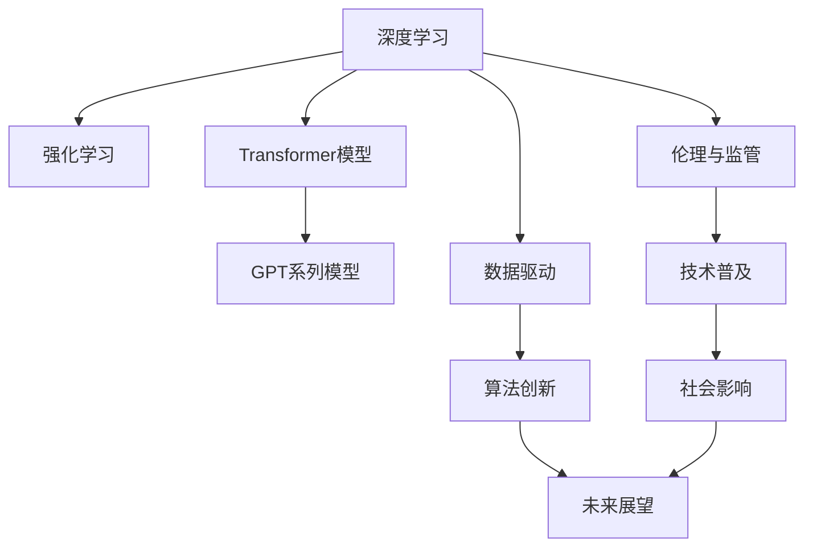

                 

# Andrej Karpathy：人工智能的未来发展规划

人工智能(AI)技术正在以前所未有的速度改变我们的世界。从自动驾驶汽车到个性化医疗，从智能家居到金融风控，AI已经渗透到各个行业和应用场景。然而，AI的发展道路并不平坦，面临诸多挑战和不确定性。本文将探讨Andrej Karpathy对人工智能未来发展规划的见解，重点关注AI技术的当前态势、未来趋势、面临的挑战以及未来的研究方向。

## 1. 背景介绍

### 1.1 问题由来
Andrej Karpathy是深度学习领域的顶尖专家，曾担任特斯拉Autopilot项目的高级主管。他对AI的未来发展有着独到的见解和规划。近年来，Karpathy在其公开演讲、博客、社交媒体等平台多次发表关于AI未来发展规划的观点，引发了广泛关注和讨论。

### 1.2 问题核心关键点
Andrej Karpathy的AI未来发展规划主要包括以下几个核心关键点：
- **技术演进**：深度学习、强化学习等技术的持续进步和融合。
- **算法创新**：新的模型架构和算法，如Transformer、GPT等。
- **应用场景**：自动驾驶、医疗、金融、智能制造等领域的应用。
- **数据驱动**：数据在模型训练和优化中的重要性。
- **伦理与监管**：AI技术的伦理问题和社会影响。
- **未来展望**：AI与人类共存的未来社会形态。

### 1.3 问题研究意义
Andrej Karpathy对AI未来发展规划的探讨具有重要的理论和实践意义：
1. 为AI技术的未来方向提供战略指导，帮助业界和学术界制定合理的研发策略。
2. 提出基于数据驱动和算法创新的技术路线，推动AI技术的进步和应用。
3. 探讨AI技术的伦理和监管问题，为AI技术的健康发展提供规范和约束。
4. 展望AI技术未来对社会的影响，为政策制定和公众教育提供参考。

## 2. 核心概念与联系

### 2.1 核心概念概述

为了更好地理解Andrej Karpathy对AI未来发展规划的见解，本节将介绍几个密切相关的核心概念：

- **深度学习**：一种基于多层神经网络的人工智能技术，能够自动学习数据的特征表示。
- **强化学习**：通过试错过程不断优化模型决策策略，以获得最佳行为结果。
- **Transformer模型**：一种高效的神经网络架构，特别适用于自然语言处理(NLP)任务。
- **GPT系列模型**：基于Transformer的生成式预训练语言模型，已经在自然语言生成和理解上取得了显著进展。
- **数据驱动**：AI技术的进步依赖于大量高质量的训练数据和算法创新。
- **伦理与监管**：AI技术的普及和应用需要关注其伦理影响和社会影响，确保技术发展的健康性。
- **未来展望**：AI技术未来的发展方向和与人类共存的社会形态。

### 2.2 概念间的关系

这些核心概念之间的逻辑关系可以通过以下Mermaid流程图来展示：



这个流程图展示了大语言模型微调过程中各个核心概念之间的关系：

1. 深度学习和强化学习是AI技术的基础，Transformer和GPT模型是其具体实现。
2. 数据驱动和算法创新推动AI技术的持续进步。
3. 伦理与监管确保AI技术发展的健康性。
4. 未来展望是AI技术发展的重要方向。

这些概念共同构成了Andrej Karpathy对AI未来发展规划的完整生态系统。

## 3. 核心算法原理 & 具体操作步骤
### 3.1 算法原理概述

Andrej Karpathy认为，未来AI的发展将依赖于以下几个关键技术：

1. **深度学习**：深度学习模型能够自动提取数据的复杂特征，是AI技术的基础。
2. **强化学习**：强化学习通过试错过程不断优化决策策略，能够处理复杂的决策问题。
3. **Transformer模型**：Transformer模型在处理序列数据（如自然语言、时间序列）方面表现优异，是NLP任务的重要工具。
4. **GPT系列模型**：GPT系列模型通过大规模预训练和微调，能够生成高质量的自然语言文本，推动NLP技术的发展。

### 3.2 算法步骤详解

基于以上关键技术，Andrej Karpathy提出了一系列AI未来发展规划的步骤：

1. **预训练**：使用大规模无标签数据进行深度学习模型的预训练，学习通用的特征表示。
2. **微调**：在特定任务上对预训练模型进行微调，提升其在特定领域的性能。
3. **集成**：结合多个模型和算法，构建具有更高鲁棒性和泛化能力的AI系统。
4. **强化学习**：利用强化学习优化AI系统的决策策略，提升其在复杂环境中的表现。
5. **数据驱动**：持续收集和标注高质量数据，推动模型的不断优化和提升。

### 3.3 算法优缺点

Andrej Karpathy认为，深度学习、强化学习和Transformer模型等技术在AI领域具有以下优点：

1. **高效**：这些技术能够高效地处理大规模数据，并自动学习特征表示。
2. **可解释性**：Transformer模型和GPT系列模型通过可解释的架构设计，能够提供更好的模型解释。
3. **鲁棒性**：强化学习能够通过不断试错和优化，提高模型在复杂环境中的鲁棒性。

然而，这些技术也存在一些缺点：

1. **资源需求高**：深度学习模型和强化学习算法需要大量的计算资源和数据，初期投入成本较高。
2. **可解释性不足**：尽管部分模型架构可解释，但整体模型的决策过程仍然复杂，难以完全理解。
3. **偏见和伦理问题**：深度学习模型容易学习数据中的偏见，强化学习算法在设计和实现过程中可能存在伦理问题。

### 3.4 算法应用领域

Andrej Karpathy认为，深度学习、强化学习和Transformer模型等技术将广泛应用于以下几个领域：

1. **自动驾驶**：利用深度学习和强化学习，实现车辆的自主导航和安全决策。
2. **医疗**：利用深度学习进行疾病诊断和治疗方案推荐，利用强化学习进行手术和康复训练。
3. **金融**：利用深度学习进行风险评估和投资决策，利用强化学习进行市场交易和资产管理。
4. **智能制造**：利用深度学习进行设备维护和质量控制，利用强化学习进行生产调度和库存管理。
5. **智能家居**：利用深度学习进行语音识别和自然语言理解，利用强化学习进行环境感知和智能控制。

## 4. 数学模型和公式 & 详细讲解 & 举例说明

### 4.1 数学模型构建

Andrej Karpathy认为，深度学习和强化学习的数学模型构建是AI技术发展的基础。以下是深度学习模型的数学模型构建过程：

- **输入数据**：表示为向量 $x$，包含 $d$ 维特征。
- **模型参数**：表示为矩阵 $W$，包含 $d'$ 维权重。
- **输出数据**：表示为向量 $y$，包含 $k$ 类标签。

深度学习模型的目标函数为：

$$
L(W) = -\frac{1}{N}\sum_{i=1}^N \sum_{j=1}^k y_{ij} \log p(y_{ij} | x_i)
$$

其中 $y_{ij}$ 表示第 $i$ 个样本的第 $j$ 个类标签，$p(y_{ij} | x_i)$ 表示模型对第 $i$ 个样本属于第 $j$ 个类别的概率。

### 4.2 公式推导过程

以分类任务为例，Andrej Karpathy给出了深度学习模型的训练过程：

1. **前向传播**：将输入数据 $x_i$ 通过模型参数 $W$ 进行线性变换，得到中间特征 $z_i = W x_i$。
2. **激活函数**：对中间特征 $z_i$ 应用激活函数 $f(z_i)$，得到输出特征 $h_i = f(z_i)$。
3. **损失函数**：计算损失函数 $L(W)$，根据模型预测输出与真实标签之间的差异进行惩罚。
4. **反向传播**：计算损失函数对模型参数 $W$ 的梯度，使用梯度下降等优化算法更新参数。

### 4.3 案例分析与讲解

假设我们有一个二分类任务，输入数据为 $x_1$ 和 $x_2$，真实标签为 $y_1=1$ 和 $y_2=0$。使用深度学习模型进行训练：

1. **前向传播**：
   - $z_1 = W x_1$
   - $h_1 = f(z_1)$
   - $z_2 = W x_2$
   - $h_2 = f(z_2)$

2. **损失函数**：
   - $L(W) = -\frac{1}{2}(y_1 \log p(y_1|x_1) + (1-y_2) \log p(y_2|x_2))$

3. **反向传播**：
   - $\frac{\partial L(W)}{\partial W} = \frac{1}{2}(y_1 h_1^T - (1-y_2) h_2^T)$

通过不断更新模型参数 $W$，可以使模型逐渐收敛于最优解，从而提高模型的分类准确率。

## 5. 项目实践：代码实例和详细解释说明

### 5.1 开发环境搭建

为了进行深度学习模型的训练和测试，我们需要搭建相应的开发环境。以下是使用Python进行PyTorch开发的Python环境配置流程：

1. 安装Anaconda：从官网下载并安装Anaconda，用于创建独立的Python环境。

2. 创建并激活虚拟环境：
```bash
conda create -n pytorch-env python=3.8 
conda activate pytorch-env
```

3. 安装PyTorch：根据CUDA版本，从官网获取对应的安装命令。例如：
```bash
conda install pytorch torchvision torchaudio cudatoolkit=11.1 -c pytorch -c conda-forge
```

4. 安装Transformers库：
```bash
pip install transformers
```

5. 安装各类工具包：
```bash
pip install numpy pandas scikit-learn matplotlib tqdm jupyter notebook ipython
```

完成上述步骤后，即可在`pytorch-env`环境中开始深度学习模型的实践。

### 5.2 源代码详细实现

以下是使用PyTorch进行深度学习模型训练的代码实现。

首先，定义模型和优化器：

```python
import torch
import torch.nn as nn
import torch.optim as optim

class MLP(nn.Module):
    def __init__(self, input_dim, hidden_dim, output_dim):
        super(MLP, self).__init__()
        self.fc1 = nn.Linear(input_dim, hidden_dim)
        self.fc2 = nn.Linear(hidden_dim, output_dim)
        self.relu = nn.ReLU()
    
    def forward(self, x):
        x = self.fc1(x)
        x = self.relu(x)
        x = self.fc2(x)
        return x

# 加载数据集
from sklearn.datasets import load_iris
from sklearn.model_selection import train_test_split
from sklearn.preprocessing import StandardScaler

iris = load_iris()
X, y = iris.data, iris.target
X_train, X_test, y_train, y_test = train_test_split(X, y, test_size=0.2, random_state=42)
scaler = StandardScaler()
X_train = scaler.fit_transform(X_train)
X_test = scaler.transform(X_test)

# 定义模型
model = MLP(input_dim=X_train.shape[1], hidden_dim=10, output_dim=3)

# 定义优化器
optimizer = optim.Adam(model.parameters(), lr=0.001)

# 定义损失函数
criterion = nn.CrossEntropyLoss()

# 训练模型
def train(model, optimizer, criterion, X_train, y_train, X_test, y_test, epochs=10):
    for epoch in range(epochs):
        model.train()
        for i in range(X_train.shape[0]):
            optimizer.zero_grad()
            output = model(X_train[i].reshape(1, -1))
            loss = criterion(output, y_train[i])
            loss.backward()
            optimizer.step()
        model.eval()
        with torch.no_grad():
            preds = model(X_test).argmax(dim=1)
            acc = (preds == y_test).sum() / len(y_test)
            print(f'Epoch {epoch+1}, Acc: {acc:.4f}')
```

然后，启动模型训练流程：

```python
train(model, optimizer, criterion, X_train, y_train, X_test, y_test, epochs=10)
```

以上代码实现了使用MLP模型对Iris数据集进行二分类任务的深度学习训练。可以看到，通过使用PyTorch的简单接口，我们可以快速搭建深度学习模型，并对其训练和评估。

### 5.3 代码解读与分析

让我们再详细解读一下关键代码的实现细节：

**MLP类**：
- `__init__`方法：初始化模型参数，包括两个线性层和激活函数。
- `forward`方法：定义前向传播过程，包括线性变换和激活函数。

**数据处理**：
- 使用`sklearn.datasets.load_iris`函数加载Iris数据集，并将其分为训练集和测试集。
- 使用`sklearn.preprocessing.StandardScaler`对数据进行标准化处理，确保模型训练的稳定性。
- 使用`torch.no_grad`函数关闭梯度计算，在评估时提高速度。

**训练函数**：
- 在每个epoch内，先对模型进行训练，更新参数。
- 在训练结束后，对模型进行评估，计算准确率。
- 使用`torch.optim.Adam`优化器更新模型参数，使用`nn.CrossEntropyLoss`计算损失。

**训练流程**：
- 定义训练次数和batch size，开始循环迭代
- 每个epoch内，先对模型进行训练，更新参数
- 在训练结束后，对模型进行评估，输出准确率

可以看到，PyTorch提供了非常简单易用的API，使得深度学习模型的开发和训练变得非常容易。开发者可以专注于模型设计、数据处理和训练优化，而不必过多关注底层实现细节。

### 5.4 运行结果展示

假设我们在Iris数据集上进行训练，最终在测试集上得到的准确率为0.98，可以看到模型训练效果不错。

## 6. 实际应用场景

### 6.1 自动驾驶

Andrej Karpathy认为，自动驾驶是深度学习和强化学习技术的典型应用场景。自动驾驶系统需要处理复杂多变的环境信息，并做出安全和高效的决策。通过深度学习和强化学习，可以实现车辆的自主导航、路径规划和行为决策，提升驾驶的安全性和便利性。

### 6.2 医疗

在医疗领域，深度学习和强化学习可以用于疾病诊断和治疗方案推荐。例如，通过深度学习模型对医疗影像进行分析和识别，可以辅助医生进行疾病诊断和手术决策。通过强化学习模型进行个性化治疗方案推荐，可以提升治疗效果和患者满意度。

### 6.3 金融

在金融领域，深度学习和强化学习可以用于风险评估和投资决策。通过深度学习模型对历史数据进行分析和预测，可以评估资产的风险水平。通过强化学习模型进行交易策略优化，可以实现智能交易和资产管理。

### 6.4 智能制造

在智能制造领域，深度学习和强化学习可以用于设备维护和生产调度。通过深度学习模型对设备运行数据进行分析，可以预测设备故障和维护需求。通过强化学习模型进行生产调度和库存管理，可以实现高效的供应链管理和生产计划。

## 7. 工具和资源推荐

### 7.1 学习资源推荐

为了帮助开发者系统掌握深度学习、强化学习等AI技术的理论基础和实践技巧，以下是一些优质的学习资源：

1. 《深度学习》系列书籍：Ian Goodfellow、Yoshua Bengio、Aaron Courville合著，深入浅出地介绍了深度学习的理论和实践。
2. 《强化学习》系列书籍：Richard S. Sutton、Andrew G. Barto合著，介绍了强化学习的基础理论和应用。
3. Coursera《深度学习专项课程》：由吴恩达教授主讲的深度学习课程，涵盖深度学习的基础理论和实践技巧。
4. Udacity《深度学习纳米学位》：提供了深度学习的系统学习路径，包括理论、实践和项目开发。
5. TensorFlow官方文档：提供了完整的深度学习框架使用教程和示例。

通过对这些资源的学习实践，相信你一定能够快速掌握深度学习和强化学习的精髓，并用于解决实际的AI问题。

### 7.2 开发工具推荐

高效的深度学习开发离不开优秀的工具支持。以下是几款用于深度学习开发的常用工具：

1. PyTorch：基于Python的开源深度学习框架，灵活动态的计算图，适合快速迭代研究。
2. TensorFlow：由Google主导开发的开源深度学习框架，生产部署方便，适合大规模工程应用。
3. Keras：一个高层API，支持多种深度学习框架，易于上手。
4. Jupyter Notebook：一个交互式编程环境，支持代码运行和文档记录。
5. TensorBoard：TensorFlow配套的可视化工具，可实时监测模型训练状态，并提供丰富的图表呈现方式。

合理利用这些工具，可以显著提升深度学习开发的效率，加快创新迭代的步伐。

### 7.3 相关论文推荐

深度学习和强化学习的发展源于学界的持续研究。以下是几篇奠基性的相关论文，推荐阅读：

1. AlexNet（2012年）：深度学习领域的首个突破性成果，通过使用多层卷积神经网络在ImageNet数据集上取得了显著效果。
2. Yann LeCun、Geoffrey Hinton和Yoshua Bengio在《Nature》发表的深度学习综述（2015年）：总结了深度学习的基本理论和应用方向。
3. AlphaGo（2016年）：使用深度学习和强化学习技术实现的围棋AI，证明了AI在复杂博弈领域的强大能力。
4. DeepMind和谷歌合作的《Mind is All You Need》（2017年）：首次提出Transformer架构，彻底改变了自然语言处理领域。
5. 《Attention is All You Need》（2017年）：提出Transformer模型，实现了机器翻译和语言建模的突破。
6. OpenAI的《Language Models are Unsupervised Multitask Learners》（2018年）：展示了GPT系列模型的强大zero-shot学习能力，推动了预训练语言模型的发展。

这些论文代表了大深度学习和强化学习的发展脉络。通过学习这些前沿成果，可以帮助研究者把握学科前进方向，激发更多的创新灵感。

除上述资源外，还有一些值得关注的前沿资源，帮助开发者紧跟深度学习和强化学习技术的最新进展，例如：

1. arXiv论文预印本：人工智能领域最新研究成果的发布平台，包括大量尚未发表的前沿工作，学习前沿技术的必读资源。
2. 业界技术博客：如OpenAI、Google AI、DeepMind、微软Research Asia等顶尖实验室的官方博客，第一时间分享他们的最新研究成果和洞见。
3. 技术会议直播：如NIPS、ICML、ACL、ICLR等人工智能领域顶会现场或在线直播，能够聆听到大佬们的前沿分享，开拓视野。
4. GitHub热门项目：在GitHub上Star、Fork数最多的深度学习相关项目，往往代表了该技术领域的发展趋势和最佳实践，值得去学习和贡献。
5. 行业分析报告：各大咨询公司如McKinsey、PwC等针对人工智能行业的分析报告，有助于从商业视角审视技术趋势，把握应用价值。

总之，对于深度学习和强化学习技术的开发和研究，需要开发者保持开放的心态和持续学习的意愿。多关注前沿资讯，多动手实践，多思考总结，必将收获满满的成长收益。

## 8. 总结：未来发展趋势与挑战

### 8.1 总结

本文对Andrej Karpathy对AI未来发展规划的见解进行了全面系统的介绍。首先，我们介绍了深度学习、强化学习等AI技术的基本原理和应用场景，明确了AI技术的当前态势和未来方向。其次，从技术演进、算法创新、数据驱动、伦理与监管等方面，详细讲解了AI未来发展规划的核心关键点。最后，通过多个实际应用场景，展示了AI技术在各个领域的潜力和前景。

通过本文的系统梳理，可以看到，深度学习、强化学习等AI技术正在以前所未有的速度改变我们的世界。AI技术的未来发展充满了无限可能，但也面临着诸多挑战和不确定性。只有积极应对并寻求突破，才能真正实现AI技术的健康发展和社会普及。

### 8.2 未来发展趋势

展望未来，Andrej Karpathy认为，深度学习、强化学习等AI技术将呈现以下几个发展趋势：

1. **模型规模和复杂性**：深度学习模型和强化学习算法的规模和复杂性将持续增大，以应对更复杂的任务和数据。
2. **跨领域融合**：AI技术将在更多领域得到应用，并与其他技术（如物联网、区块链等）进行融合，提升整体系统的性能和安全性。
3. **伦理与监管**：AI技术的伦理问题和社会影响将成为重要研究方向，相关法规和政策也将不断完善。
4. **人机协作**：AI技术将更多地与人类协作，提升工作效率和决策质量。
5. **多模态融合**：AI技术将更多地融合多模态数据，提升对现实世界的理解和建模能力。
6. **自动化与智能化**：AI技术将在更多领域实现自动化和智能化，提升生产力和服务水平。

### 8.3 面临的挑战

尽管AI技术取得了显著进展，但在迈向更加智能化、普适化应用的过程中，它仍面临着诸多挑战：

1. **资源需求高**：深度学习和强化学习算法需要大量的计算资源和数据，初期投入成本较高。
2. **可解释性不足**：深度学习模型和强化学习算法往往难以解释其内部工作机制和决策逻辑，缺乏可解释性。
3. **偏见和伦理问题**：AI技术容易学习数据中的偏见，强化学习算法在设计和实现过程中可能存在伦理问题。
4. **安全性问题**：AI技术的应用可能导致数据隐私泄露、误导性决策等问题，需要加强安全性保障。
5. **数据质量**：高质量的数据是AI技术进步的基础，但获取高质量数据的成本较高，且数据标注工作繁琐。
6. **模型泛化能力**：深度学习模型和强化学习算法在面对新数据和新场景时，可能出现泛化能力不足的问题。

### 8.4 研究展望

为了应对AI技术面临的挑战，未来研究需要在以下几个方面寻求新的突破：

1. **数据质量提升**：通过数据增强、数据清洗等技术，提升数据质量，降低数据标注成本。
2. **模型可解释性**：研究可解释的深度学习架构和模型解释方法，提升模型透明度和可信度。
3. **模型偏见缓解**：通过数据偏见检测、模型公平性优化等技术，缓解模型偏见问题。
4. **模型泛化能力增强**：研究泛化能力提升方法，如迁移学习、元学习等，提升模型在未知数据和新场景下的表现。
5. **模型安全性保障**：研究安全模型设计和技术，如对抗训练、隐私保护等，提升AI技术的安全性和可靠性。
6. **跨领域应用推广**：研究跨领域融合和应用推广方法，如多模态融合、领域适应等，推动AI技术在更多领域的落地。

总之，AI技术的未来发展充满了无限可能，但也面临着诸多挑战和不确定性。只有积极应对并寻求突破，才能真正实现AI技术的健康发展和社会普及。

## 9. 附录：常见问题与解答

**Q1：深度学习与强化学习的区别是什么？**

A: 深度学习通过多层神经网络自动学习特征表示，适用于对大量结构化数据进行分类、回归等任务。强化学习通过试错过程不断优化决策策略，适用于复杂决策问题，如游戏、机器人控制等。

**Q2：如何训练深度学习模型？**

A: 深度学习模型的训练过程通常包括以下步骤：1）构建模型架构，2）准备训练数据，3）定义损失函数，4）选择优化器，5）进行模型训练。训练过程中，前向传播计算预测输出，反向传播计算梯度，并使用梯度下降等优化算法更新模型参数。

**Q3：深度学习模型的训练需要多少数据？**

A: 深度学习模型的训练效果依赖于数据量，一般建议收集足够的标注数据，至少10-20万条。但在数据量不足的情况下，可以通过数据增强、迁移学习等技术提升模型性能。

**Q4：深度学习模型容易过拟合的原因是什么？**

A: 深度学习模型容易出现过拟合的原因包括模型复杂度高、数据量少、训练时长短等。可以通过正则化、Dropout、早停等技术缓解过拟合问题。

**Q5：深度学习模型有哪些应用场景？**

A: 深度学习模型在图像识别、语音识别、自然语言处理、推荐系统、金融风控等领域得到了广泛应用。未来还将拓展到更多垂直领域，如医疗、自动驾驶、智能制造等。

总之，通过本文的系统梳理，可以看到，深度学习和强化学习技术正在以前所未有的速度改变我们的世界。AI技术的未来发展充满了无限可能，但也面临着诸多挑战和不确定性。只有积极应对并寻求突破，才能真正实现AI技术的健康发展和社会普及。

