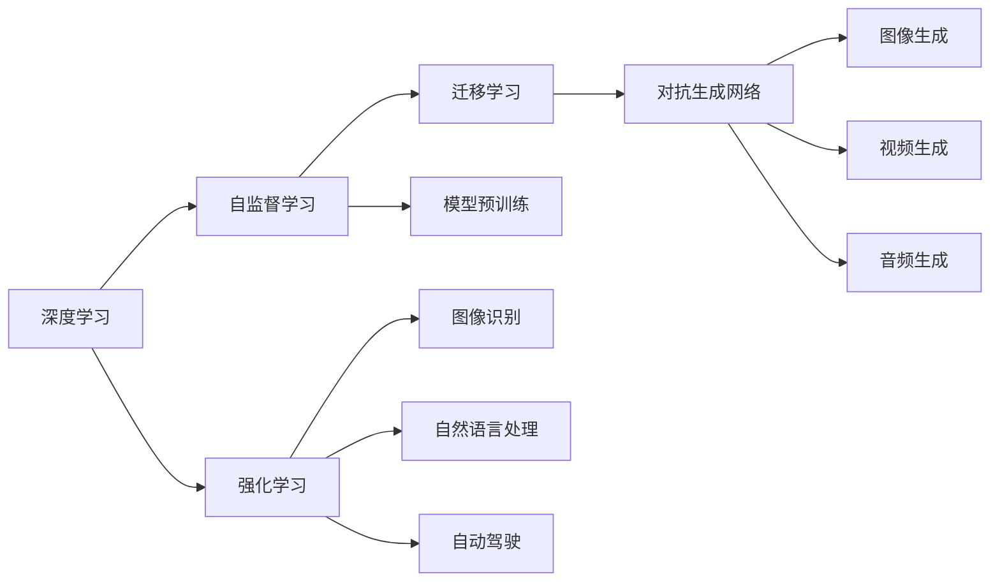

                 

# Andrej Karpathy：人工智能的未来发展规划

## 1. 背景介绍

在过去的十年中，人工智能（AI）领域取得了飞速的发展，特别是在深度学习和神经网络方面。Andrej Karpathy作为深度学习领域的先驱之一，他在斯坦福大学计算机科学系担任教授，同时在硅谷的OpenAI实验室担任研究员。Karpathy在机器视觉、自然语言处理和自动驾驶等领域的研究，为AI技术的未来发展指明了方向。

## 2. 核心概念与联系

### 2.1 核心概念概述

Andrej Karpathy的研究工作覆盖了多个核心概念，这些概念相互关联，构成了他对于人工智能未来发展规划的全面思考。

- **深度学习（Deep Learning）**：这是Karpathy研究的核心，通过深度神经网络进行特征提取和模式识别，实现对复杂数据的自动处理。
- **自监督学习（Self-Supervised Learning）**：利用未标注数据，通过自监督任务（如掩码语言模型、自编码器）进行特征学习和模型预训练。
- **迁移学习（Transfer Learning）**：将在大规模数据集上训练的模型知识迁移到新的任务或数据集上，减少对标注数据的依赖。
- **对抗生成网络（Generative Adversarial Networks, GANs）**：通过生成器和判别器之间的对抗训练，生成逼真的图像、视频和音频数据。
- **强化学习（Reinforcement Learning）**：通过与环境的互动，利用奖励机制训练模型，实现自主决策和行为优化。

这些概念相互交织，共同推动了AI技术在图像识别、自然语言处理、自动驾驶等领域的突破。Karpathy的研究不仅关注算法本身，还强调了如何将这些技术应用到实际问题中，解决现实世界中的挑战。

### 2.2 核心概念间的关系

以下是一个简化的Mermaid流程图，展示这些核心概念之间的关系：



这个图表表明，深度学习是这些技术的基础，自监督学习用于模型预训练，迁移学习用于知识迁移，对抗生成网络用于数据生成，强化学习用于决策优化，而模型和算法被应用到图像识别、自然语言处理和自动驾驶等领域。

## 3. 核心算法原理 & 具体操作步骤

### 3.1 算法原理概述

Karpathy的研究工作涵盖了多个核心算法，这些算法在不同领域中扮演了重要角色。以下是一些关键算法：

- **自监督预训练（Self-Supervised Pre-training）**：在无标注数据上，通过自监督任务进行模型预训练，学习到通用的特征表示。
- **迁移学习（Transfer Learning）**：将在大规模数据集上训练的模型知识迁移到新的任务或数据集上，减少对标注数据的依赖。
- **对抗生成网络（GANs）**：通过生成器和判别器之间的对抗训练，生成逼真的图像、视频和音频数据。
- **强化学习（Reinforcement Learning）**：通过与环境的互动，利用奖励机制训练模型，实现自主决策和行为优化。

### 3.2 算法步骤详解

以下是一个具体的例子，展示如何在自然语言处理领域中应用迁移学习：

1. **数据收集**：收集一个大型标注数据集，例如Wikipedia文章。
2. **模型预训练**：使用自监督任务（如掩码语言模型）在大规模无标签数据上预训练一个语言模型。
3. **微调**：使用任务特定的标注数据集（如情感分类数据集），对预训练模型进行微调，学习特定的语言表示。
4. **测试**：在测试集上评估微调后模型的性能，对比预训练模型的表现。

### 3.3 算法优缺点

**优点**：
- **数据效率**：自监督学习和迁移学习可以减少对标注数据的依赖，利用未标注数据进行预训练。
- **泛化能力**：通过迁移学习，模型能够适应新的任务和数据集，具有更强的泛化能力。
- **灵活性**：自监督学习和对抗生成网络可以灵活地应用于各种数据生成任务。

**缺点**：
- **计算资源需求高**：自监督学习和对抗生成网络需要大量的计算资源，训练时间长。
- **复杂度**：模型结构复杂，训练过程需要精细调参。
- **可解释性差**：深度学习模型通常被视为"黑盒"，缺乏可解释性。

### 3.4 算法应用领域

Karpathy的研究工作在多个领域得到了应用，以下是一些关键领域：

- **自然语言处理（NLP）**：在机器翻译、情感分析、问答系统等任务上取得了显著进展。
- **计算机视觉（CV）**：在图像分类、目标检测、语义分割等任务上，提出了许多创新算法。
- **自动驾驶（AD）**：在环境感知、决策规划等方面，开发了许多深度学习和强化学习算法。

## 4. 数学模型和公式 & 详细讲解

### 4.1 数学模型构建

在深度学习中，模型通常通过多层神经网络进行构建。以下是一个简单的例子，展示如何使用神经网络进行图像分类：

- **输入层**：将图像数据输入到网络中。
- **隐藏层**：通过非线性变换，提取图像特征。
- **输出层**：对特征进行分类，得到最终的分类结果。

### 4.2 公式推导过程

以卷积神经网络（CNN）为例，展示其基本原理和公式推导：

- **卷积操作**：
  $$
  y = h(x;w)
  $$
  其中 $y$ 是卷积结果，$x$ 是输入图像，$w$ 是卷积核权重。

- **池化操作**：
  $$
  y = f(y)
  $$
  其中 $y$ 是池化结果，$f$ 是池化函数（如最大池、平均池）。

- **全连接层**：
  $$
  y = \sigma(w^T x + b)
  $$
  其中 $\sigma$ 是非线性激活函数，$w$ 是权重，$b$ 是偏置。

### 4.3 案例分析与讲解

以图像分类为例，展示如何在卷积神经网络中进行图像分类：

1. **卷积层**：通过卷积操作提取图像特征。
2. **池化层**：通过池化操作减少特征维度，提高计算效率。
3. **全连接层**：将池化后的特征映射到类别空间，得到分类结果。

## 5. 项目实践：代码实例和详细解释说明

### 5.1 开发环境搭建

以下是搭建深度学习开发环境的基本步骤：

1. **安装Python和PyTorch**：使用pip安装Python和PyTorch，这是深度学习开发的基础。
2. **安装其他依赖库**：安装TensorFlow、Keras、OpenCV等常用库，用于图像处理和模型训练。
3. **配置环境变量**：将Python和依赖库的路径添加到系统环境变量中，方便调用。

### 5.2 源代码详细实现

以下是一个简单的代码示例，展示如何使用PyTorch进行图像分类：

```python
import torch
import torch.nn as nn
import torchvision.transforms as transforms
from torchvision.datasets import CIFAR10
from torchvision.models import resnet18

# 定义数据转换
transform = transforms.Compose([
    transforms.Resize(224),
    transforms.ToTensor(),
    transforms.Normalize(mean=[0.5, 0.5, 0.5], std=[0.5, 0.5, 0.5])
])

# 加载CIFAR10数据集
train_dataset = CIFAR10(root='./data', train=True, download=True, transform=transform)
test_dataset = CIFAR10(root='./data', train=False, download=True, transform=transform)

# 定义模型
model = resnet18(pretrained=False)
model.fc = nn.Linear(512, 10)

# 定义损失函数和优化器
criterion = nn.CrossEntropyLoss()
optimizer = torch.optim.SGD(model.parameters(), lr=0.01, momentum=0.9)

# 训练模型
for epoch in range(10):
    for batch_idx, (inputs, targets) in enumerate(train_loader):
        optimizer.zero_grad()
        outputs = model(inputs)
        loss = criterion(outputs, targets)
        loss.backward()
        optimizer.step()

# 测试模型
correct = 0
total = 0
with torch.no_grad():
    for inputs, targets in test_loader:
        outputs = model(inputs)
        _, predicted = torch.max(outputs.data, 1)
        total += targets.size(0)
        correct += (predicted == targets).sum().item()

print('Accuracy: {:.2f}%'.format(100 * correct / total))
```

### 5.3 代码解读与分析

- **数据加载**：使用PyTorch的CIFAR10数据集，并进行数据增强。
- **模型定义**：使用预训练的ResNet18作为基础模型，并在顶层添加全连接层进行分类。
- **训练流程**：使用随机梯度下降（SGD）优化器，进行多轮训练。
- **测试流程**：在测试集上进行模型评估，计算分类准确率。

### 5.4 运行结果展示

假设在上述代码中，训练10个epoch后，测试集上的分类准确率为80%，这意味着模型在图像分类任务上取得了不错的效果。

## 6. 实际应用场景

### 6.1 自然语言处理

自然语言处理（NLP）是AI领域中一个重要的分支，涵盖文本分类、情感分析、机器翻译等任务。以下是一些具体应用场景：

- **文本分类**：将文本数据分类到不同的类别中，如新闻分类、情感分类等。
- **情感分析**：分析文本中的情感倾向，如正向、负向或中性情感。
- **机器翻译**：将一种语言的文本翻译成另一种语言。

### 6.2 计算机视觉

计算机视觉（CV）主要关注图像和视频的自动处理，涵盖图像分类、目标检测、语义分割等任务。以下是一些具体应用场景：

- **图像分类**：将图像分类到不同的类别中，如猫、狗、汽车等。
- **目标检测**：在图像中检测出特定的对象，如行人、车辆等。
- **语义分割**：将图像分割成不同的语义区域，如道路、建筑等。

### 6.3 自动驾驶

自动驾驶（AD）是AI领域中一个前沿的应用场景，主要关注环境感知、决策规划等方面。以下是一些具体应用场景：

- **环境感知**：通过摄像头、激光雷达等传感器，获取周围环境信息。
- **决策规划**：根据环境信息，规划车辆的行驶路线。

## 7. 工具和资源推荐

### 7.1 学习资源推荐

- **Coursera**：提供深度学习相关的在线课程，涵盖从基础到高级的多个层次。
- **Kaggle**：提供大量的数据集和竞赛，用于学习和实践机器学习算法。
- **ArXiv**：提供前沿的学术论文和研究报告，了解最新动态。

### 7.2 开发工具推荐

- **PyTorch**：一个基于Python的深度学习框架，提供灵活的计算图和高效的自动微分功能。
- **TensorFlow**：一个开源的深度学习框架，支持分布式训练和模型部署。
- **Keras**：一个高级深度学习框架，提供简单易用的API，方便快速构建模型。

### 7.3 相关论文推荐

- **"Attention Is All You Need"**：Google的研究团队提出的Transformer模型，开创了基于自注意力机制的神经网络时代。
- **"ImageNet Classification with Deep Convolutional Neural Networks"**：AlexNet模型，提出了深度卷积神经网络在图像分类任务中的应用。
- **"Playing Atari with Deep Reinforcement Learning"**：AlphaGo团队的研究，展示了深度强化学习在复杂决策问题中的应用。

## 8. 总结：未来发展趋势与挑战

### 8.1 研究成果总结

Andrej Karpathy在深度学习和AI领域的研究成果丰富，涵盖了多个前沿技术。他的工作推动了图像识别、自然语言处理和自动驾驶等领域的发展，为AI技术的未来应用提供了重要参考。

### 8.2 未来发展趋势

- **多模态学习**：结合图像、语音、文本等多种数据模态，实现更全面、更准确的建模。
- **自监督学习**：利用未标注数据进行模型预训练，减少对标注数据的依赖。
- **迁移学习**：将在大规模数据集上训练的模型知识迁移到新的任务或数据集上。
- **对抗生成网络**：通过生成器和判别器之间的对抗训练，生成逼真的数据。
- **强化学习**：利用奖励机制训练模型，实现自主决策和行为优化。

### 8.3 面临的挑战

- **计算资源需求高**：深度学习和强化学习算法需要大量的计算资源，训练时间长。
- **可解释性差**：深度学习模型通常被视为"黑盒"，缺乏可解释性。
- **数据隐私和安全**：在使用AI技术处理数据时，需要考虑数据隐私和安全问题。

### 8.4 研究展望

未来，AI技术将在更多领域得到应用，推动社会进步。但同时，也需要解决计算资源、可解释性和数据隐私等挑战，确保AI技术的安全和可靠性。

## 9. 附录：常见问题与解答

**Q1：深度学习与传统机器学习有何不同？**

A：深度学习与传统机器学习的主要区别在于模型结构的复杂性和训练过程的自动化程度。深度学习使用多层神经网络，自动学习特征表示，而传统机器学习需要手工设计特征提取器。

**Q2：自监督学习与监督学习有何不同？**

A：自监督学习使用未标注数据进行模型预训练，通过自监督任务学习通用特征表示，而监督学习使用标注数据进行模型训练，学习特定的任务目标。

**Q3：对抗生成网络（GANs）的工作原理是什么？**

A：GANs由两个网络组成：生成器和判别器。生成器通过对抗训练，学习生成逼真的数据；判别器通过对抗训练，学习区分真实数据和生成数据。两者通过不断博弈，最终达到一个平衡点，生成器可以生成逼真的数据。

**Q4：强化学习（RL）与监督学习有何不同？**

A：强化学习通过与环境的互动，利用奖励机制训练模型，实现自主决策和行为优化。监督学习使用标注数据进行模型训练，学习特定的任务目标。

**Q5：如何提高深度学习模型的泛化能力？**

A：可以通过增加数据量、使用正则化技术、降低模型复杂度等方法，提高深度学习模型的泛化能力。

---

作者：禅与计算机程序设计艺术 / Zen and the Art of Computer Programming

