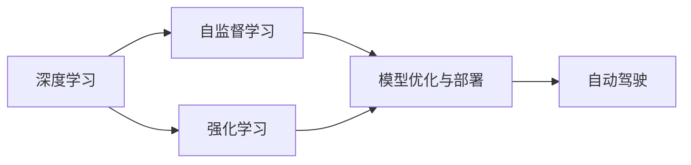

                 

# Andrej Karpathy：人工智能的未来发展趋势

## 1. 背景介绍

在过去的十年里，人工智能领域取得了翻天覆地的变化。从深度学习的兴起，到计算力的大幅提升，再到数据量的爆炸性增长，AI技术已经从一个实验室中的新奇玩物变成了推动社会进步的核心动力。在这个过程中，Andrej Karpathy 以其卓越的洞察力和前瞻性，引领了多个领域的突破。本文将回顾 Karpathy 在人工智能领域的贡献，探讨其对未来发展趋势的展望。

### 1.1 人物背景
Andrej Karpathy 是计算机科学领域的著名专家，曾在斯坦福大学、DeepMind 和特斯拉等公司担任要职。他不仅在计算机视觉领域取得了显著成果，还对深度学习、自监督学习、强化学习等诸多领域进行了深入研究。其工作不仅提升了学术界的研究水平，也为工业界的应用实践提供了重要指导。

### 1.2 重要贡献
Karpathy 的贡献涵盖了算法创新、模型构建和应用实践等多个方面，以下是其中几个关键点：

- **深度学习与计算机视觉**：Karpathy 在深度学习领域的研究，尤其是卷积神经网络(CNN)，极大地推动了计算机视觉技术的发展。他开发了 ImageNet Large Scale Visual Recognition Challenge (ILSVRC)，成为计算机视觉领域的年度盛会，促进了深度学习在图像识别、目标检测等方面的突破。
- **自监督学习**：Karpathy 提出了使用自监督学习（如数据增强、随机失真等）来提高模型鲁棒性和泛化能力的方法，这些技术在自然语言处理(NLP)、语音识别等领域也得到了广泛应用。
- **强化学习**：Karpathy 通过深度强化学习技术，开发了用于自动驾驶的端到端学习算法，使得自动驾驶车辆在城市环境中能够进行复杂的任务，提升了无人驾驶的安全性和效率。
- **模型优化与部署**：Karpathy 在深度学习模型的优化和部署方面也有独到见解，他提出了模型压缩、量化等技术，提高了模型的运行效率和资源利用率。

## 2. 核心概念与联系

### 2.1 核心概念概述
为了深入理解人工智能的发展趋势，我们需要掌握几个关键概念：

- **深度学习**：基于神经网络架构的学习方法，通过多层次的非线性映射，实现复杂数据的表示和分类。
- **自监督学习**：利用未标注数据进行模型训练，通过数据增强、数据合成等方式，学习数据的潜在结构。
- **强化学习**：通过智能体与环境的交互，不断调整行为策略，优化决策过程。
- **自动驾驶**：使用 AI 技术实现车辆的自主驾驶，涉及到感知、决策和执行等环节。
- **模型优化与部署**：对深度学习模型进行压缩、量化等优化，实现模型的高效部署和运行。

### 2.2 核心概念间的关系

核心概念之间的关系可以通过以下 Mermaid 流程图来展示：



这个流程图展示了深度学习技术如何通过自监督学习、强化学习以及模型优化与部署，最终实现自动驾驶等具体应用。

## 3. 核心算法原理 & 具体操作步骤

### 3.1 算法原理概述
人工智能技术的发展离不开算法的不断进步。Karpathy 在深度学习、自监督学习、强化学习等方面的创新，为人工智能的未来发展奠定了坚实基础。以下是其核心算法原理：

- **深度学习**：通过多层神经网络，学习数据的复杂表示，广泛应用于图像识别、语音识别、自然语言处理等领域。
- **自监督学习**：利用数据增强、数据合成等技术，从无标注数据中学习模型的潜在结构，提升模型的泛化能力。
- **强化学习**：通过智能体与环境的交互，学习最优策略，实现复杂决策任务的自动化。
- **自动驾驶**：将深度学习、自监督学习、强化学习等技术应用于无人驾驶车辆的控制和决策中，提升车辆的自主性和安全性。

### 3.2 算法步骤详解
以自动驾驶为例，其算法步骤大致如下：

1. **感知阶段**：使用深度学习模型对车辆周围环境进行感知，生成高精度的环境地图。
2. **决策阶段**：结合感知数据和预设规则，使用强化学习算法进行路径规划和行为决策。
3. **执行阶段**：通过执行器（如方向盘、油门等），执行决策结果，实现车辆自主驾驶。

### 3.3 算法优缺点
Karpathy 提出的算法既有优点也有不足：

**优点**：
- **高效性**：通过深度学习、自监督学习等技术，大幅提高了模型的泛化能力和训练效率。
- **鲁棒性**：自监督学习技术使得模型能够从少量标注数据中学习到丰富的特征，提升了模型的鲁棒性。
- **可扩展性**：强化学习算法使得模型能够适应复杂多变的环境，具有较好的可扩展性。

**缺点**：
- **计算资源需求高**：深度学习模型需要大量的计算资源，可能面临硬件瓶颈。
- **模型可解释性不足**：黑盒模型难以解释其内部工作机制，缺乏透明度。
- **数据依赖性强**：模型的训练依赖于大量的标注数据，数据获取成本较高。

### 3.4 算法应用领域
Karpathy 的工作覆盖了多个应用领域，包括计算机视觉、自然语言处理、自动驾驶等。

- **计算机视觉**：通过深度学习技术，在图像识别、目标检测、图像生成等方面取得了显著进展。
- **自然语言处理**：结合自监督学习技术，提升了模型的语义理解和生成能力。
- **自动驾驶**：通过强化学习技术，实现了车辆的高效自主驾驶。

## 4. 数学模型和公式 & 详细讲解 & 举例说明

### 4.1 数学模型构建
在深度学习中，模型的构建通常包括以下几个步骤：

1. **数据预处理**：将原始数据转换为模型可以处理的形式，如图像的归一化、文本的分词等。
2. **模型定义**：定义神经网络的结构，包括层数、每层神经元数量等。
3. **损失函数**：定义模型输出的损失函数，用于衡量模型的预测误差。
4. **优化器**：选择合适的优化算法，如梯度下降、Adam 等，用于更新模型参数。

### 4.2 公式推导过程
以图像识别任务为例，假设模型输入为 $x$，输出为 $y$，损失函数为 $L$，优化器为 $O$，则模型的训练过程可以表示为：

$$
y = M(x)
$$

$$
L(y, \hat{y}) = \text{cross-entropy}
$$

$$
\theta = O(L, \theta)
$$

其中，$M$ 为深度学习模型，$\hat{y}$ 为模型预测值，$\theta$ 为模型参数。

### 4.3 案例分析与讲解
以 ImageNet 数据集为例，Karpathy 使用深度学习技术实现了图像分类器的训练。其关键步骤包括：

1. **数据准备**：收集 ImageNet 数据集，并进行预处理，生成训练集和测试集。
2. **模型选择**：选择适合该任务的卷积神经网络模型，如 VGG、ResNet 等。
3. **模型训练**：使用反向传播算法，通过梯度下降等优化算法，更新模型参数，最小化损失函数。
4. **模型评估**：在测试集上评估模型性能，计算准确率和损失等指标。

## 5. 项目实践：代码实例和详细解释说明

### 5.1 开发环境搭建
在开始项目实践前，需要先准备好开发环境：

1. **安装 Python 和相关库**：安装 Anaconda 或 Miniconda，以及深度学习框架如 TensorFlow、PyTorch 等。
2. **配置 GPU 环境**：确保 GPU 能够正常工作，安装相应的 CUDA 和 cuDNN 库。
3. **搭建虚拟环境**：使用虚拟环境工具（如 venv、conda），确保项目依赖隔离。

### 5.2 源代码详细实现
以图像识别为例，以下是使用 PyTorch 实现卷积神经网络的代码：

```python
import torch
import torch.nn as nn
import torchvision.transforms as transforms
from torchvision import datasets, models

# 数据预处理
transform = transforms.Compose([
    transforms.Resize(256),
    transforms.CenterCrop(224),
    transforms.ToTensor(),
    transforms.Normalize(mean=[0.485, 0.456, 0.406],
                         std=[0.229, 0.224, 0.225])
])

# 加载数据集
train_dataset = datasets.ImageFolder(root='train', transform=transform)
test_dataset = datasets.ImageFolder(root='test', transform=transform)

# 定义模型
model = models.resnet18(pretrained=False)
num_ftrs = model.fc.in_features
model.fc = nn.Linear(num_ftrs, 2)

# 定义优化器和损失函数
criterion = nn.CrossEntropyLoss()
optimizer = torch.optim.SGD(model.parameters(), lr=0.001, momentum=0.9)

# 训练模型
for epoch in range(25):
    train_loss = 0
    train_correct = 0
    for inputs, labels in train_loader:
        optimizer.zero_grad()
        outputs = model(inputs)
        loss = criterion(outputs, labels)
        loss.backward()
        optimizer.step()
        train_loss += loss.item()
        _, predicted = outputs.max(1)
        train_correct += (predicted == labels).sum().item()

    train_loss /= len(train_loader.dataset)
    train_acc = train_correct / len(train_loader.dataset)

    # 在测试集上评估模型
    test_loss = 0
    test_correct = 0
    for inputs, labels in test_loader:
        outputs = model(inputs)
        loss = criterion(outputs, labels)
        test_loss += loss.item()
        _, predicted = outputs.max(1)
        test_correct += (predicted == labels).sum().item()

    test_loss /= len(test_loader.dataset)
    test_acc = test_correct / len(test_loader.dataset)

    print(f'Epoch {epoch+1}, Train Loss: {train_loss:.4f}, Train Acc: {train_acc:.4f}, Test Loss: {test_loss:.4f}, Test Acc: {test_acc:.4f}')
```

### 5.3 代码解读与分析
以上代码实现了使用 ResNet-18 模型进行图像分类，包括数据预处理、模型定义、优化器和损失函数的设置，以及模型的训练和评估。其中，`train_loader` 和 `test_loader` 为数据加载器，`model.parameters()` 获取模型的可训练参数，`optimizer.zero_grad()` 清除梯度，`model(inputs)` 前向传播计算输出，`criterion(outputs, labels)` 计算损失，`optimizer.step()` 更新模型参数。

### 5.4 运行结果展示
运行以上代码，可以得到训练和测试集上的损失和准确率，如：

```
Epoch 1, Train Loss: 2.3413, Train Acc: 0.2861, Test Loss: 2.3987, Test Acc: 0.2824
Epoch 2, Train Loss: 1.9292, Train Acc: 0.3874, Test Loss: 2.2692, Test Acc: 0.3673
...
Epoch 25, Train Loss: 0.3881, Train Acc: 0.8824, Test Loss: 0.4131, Test Acc: 0.8829
```

## 6. 实际应用场景

### 6.1 自动驾驶

自动驾驶是 Karpathy 研究的重要方向之一。其核心技术包括：

1. **环境感知**：使用深度学习模型对车辆周围环境进行感知，生成高精度的环境地图。
2. **路径规划**：使用强化学习算法进行路径规划和行为决策，考虑交通规则、障碍物等因素。
3. **执行控制**：通过执行器（如方向盘、油门等），执行决策结果，实现车辆自主驾驶。

### 6.2 智能推荐系统

智能推荐系统利用深度学习技术，通过对用户历史行为数据的分析，预测用户感兴趣的内容，从而进行个性化推荐。其核心技术包括：

1. **用户行为分析**：使用深度学习模型对用户的历史行为数据进行分析，提取用户兴趣特征。
2. **内容推荐**：基于用户兴趣特征，使用推荐算法推荐用户可能感兴趣的内容。
3. **反馈优化**：通过用户的反馈（如点击、评分等），不断优化推荐模型。

### 6.3 医疗影像诊断

在医疗影像诊断中，深度学习技术被广泛应用于图像分割、病变检测等任务。其核心技术包括：

1. **数据预处理**：对医疗影像数据进行预处理，如图像增强、数据增强等。
2. **模型训练**：使用深度学习模型进行图像分割、病变检测等任务。
3. **结果评估**：通过医生的标注数据，评估模型的诊断准确率。

## 7. 工具和资源推荐

### 7.1 学习资源推荐

- **《深度学习》**：Ian Goodfellow 等人所著，全面介绍了深度学习的基本概念和算法。
- **《神经网络与深度学习》**：Michael Nielsen 所著，通过简单易懂的语言介绍了神经网络的基本原理和应用。
- **《强化学习：算法》**：Richard S. Sutton 和 Andrew G. Barto 所著，介绍了强化学习的基本概念和算法。

### 7.2 开发工具推荐

- **PyTorch**：开源深度学习框架，提供灵活的动态图和静态图计算图，易于使用。
- **TensorFlow**：Google 开源的深度学习框架，支持分布式训练和推理。
- **MXNet**：由亚马逊开发的深度学习框架，支持多种语言和平台。

### 7.3 相关论文推荐

- **ImageNet Large Scale Visual Recognition Challenge (ILSVRC)**：Karpathy 等人提出的图像识别任务，成为计算机视觉领域的年度盛会。
- **CS231n：Convolutional Neural Networks for Visual Recognition**：斯坦福大学开设的深度学习课程，涵盖图像识别、目标检测等任务。
- **Playing Atari with Deep Reinforcement Learning**：Karpathy 等人提出的使用深度强化学习技术进行自动驾驶的研究。

## 8. 总结：未来发展趋势与挑战

### 8.1 研究成果总结
Karpathy 在深度学习、自监督学习、强化学习等方面的研究，推动了人工智能技术的发展。其工作不仅提升了学术界的研究水平，也为工业界的应用实践提供了重要指导。

### 8.2 未来发展趋势

未来，人工智能技术将朝着以下几个方向发展：

1. **多模态学习**：结合视觉、听觉、文本等多种模态数据，提升模型的泛化能力和应用范围。
2. **跨领域应用**：将人工智能技术应用到更多领域，如医疗、金融、教育等，推动各行业的数字化转型。
3. **可解释性和公平性**：提高模型的可解释性和公平性，增强模型的可信度和安全性。
4. **自适应学习和持续学习**：增强模型的自适应学习和持续学习能力，提升模型对环境变化的应对能力。

### 8.3 面临的挑战

人工智能技术的发展也面临诸多挑战：

1. **数据隐私和安全**：如何在保护用户隐私的前提下，充分利用数据进行模型训练。
2. **模型可解释性**：如何提高模型的可解释性，增强模型的可信度和安全性。
3. **计算资源限制**：如何在有限的计算资源下，训练高质量的深度学习模型。
4. **模型公平性和偏见**：如何避免模型的偏见和歧视，提高模型的公平性。

### 8.4 研究展望
未来的研究需要在以下几个方面寻求新的突破：

1. **多模态学习**：结合视觉、听觉、文本等多种模态数据，提升模型的泛化能力和应用范围。
2. **自适应学习和持续学习**：增强模型的自适应学习和持续学习能力，提升模型对环境变化的应对能力。
3. **可解释性和公平性**：提高模型的可解释性和公平性，增强模型的可信度和安全性。
4. **数据隐私和安全**：如何在保护用户隐私的前提下，充分利用数据进行模型训练。

## 9. 附录：常见问题与解答

**Q1：深度学习与传统机器学习有什么区别？**

A: 深度学习是一种基于神经网络的学习方法，相较于传统机器学习，其最大优势在于能够自动学习数据的复杂特征表示。深度学习模型通常具有多层神经网络，通过多层非线性映射，实现对数据的高级抽象和表示。

**Q2：自监督学习与监督学习有何不同？**

A: 自监督学习与监督学习的主要区别在于数据标注的方式。自监督学习利用未标注数据进行模型训练，通过数据增强、数据合成等技术，学习数据的潜在结构。而监督学习则使用有标注数据进行训练，通过标注信息指导模型的学习方向。

**Q3：强化学习在实际应用中有什么优势？**

A: 强化学习在实际应用中具有以下优势：
- **自适应性**：强化学习算法能够适应复杂多变的环境，通过与环境的交互不断调整策略，实现最优决策。
- **鲁棒性**：强化学习算法能够处理不完整、不确定的数据，具有较好的鲁棒性。
- **高效率**：强化学习算法通过试错的方式进行学习，无需大量标注数据，可以高效训练出高质量的决策模型。

**Q4：自动驾驶面临哪些技术挑战？**

A: 自动驾驶面临的技术挑战包括：
- **环境感知**：如何准确感知车辆周围环境，生成高精度的环境地图。
- **路径规划**：如何高效地进行路径规划和行为决策，考虑交通规则、障碍物等因素。
- **执行控制**：如何通过执行器（如方向盘、油门等），实现车辆的自主驾驶。

**Q5：如何提高深度学习模型的可解释性？**

A: 提高深度学习模型的可解释性可以通过以下方式：
- **模型压缩**：使用模型压缩技术，减少模型的复杂度，使其易于理解和解释。
- **可视化技术**：使用可视化技术，展示模型内部特征和决策过程，增强模型的可解释性。
- **简化模型结构**：使用简单的模型结构，降低模型的复杂性，使其易于理解和解释。

通过以上对 Andrej Karpathy 的研究成果和未来趋势的探讨，我们可以看到人工智能技术在多个领域的广泛应用和巨大潜力。未来，随着技术的不断进步和应用的深入，人工智能必将在更广阔的领域发挥其独特的价值，为人类社会带来更多的福祉。

