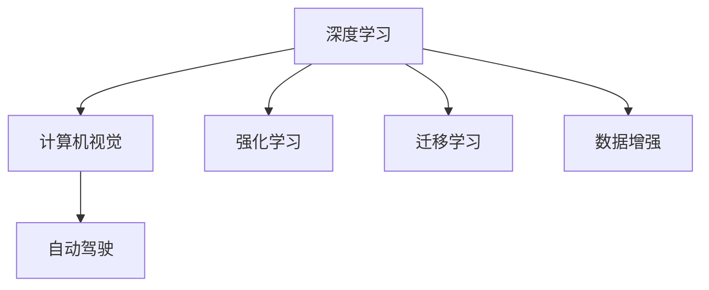
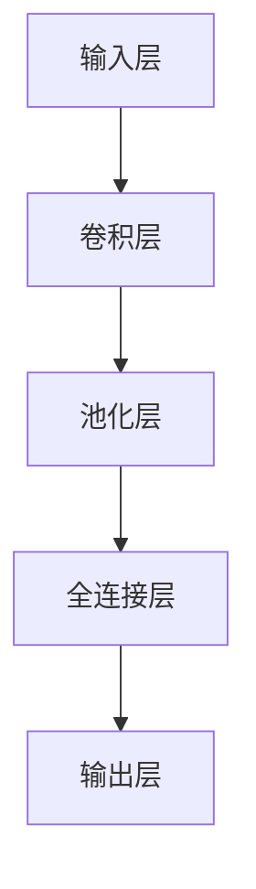

                 

# Andrej Karpathy：人工智能的未来发展趋势

> 关键词：深度学习,计算机视觉,自动驾驶,强化学习,迁移学习,数据增强

## 1. 背景介绍

安德烈·卡帕西（Andrej Karpathy）是深度学习和计算机视觉领域的顶尖专家之一，曾在斯坦福大学任教，目前任职特斯拉自动驾驶团队。他的研究成果和思考深刻影响了深度学习的发展脉络，为自动驾驶、计算机视觉、计算机游戏等多个领域提供了重要的技术支撑。本文将介绍卡帕西在人工智能领域的洞察和预见，探讨其对未来发展的看法和建议。

## 2. 核心概念与联系

### 2.1 核心概念概述

为了更好地理解卡帕西的见解，我们需要首先梳理其核心概念和理论基础：

- **深度学习**：一种基于多层神经网络进行数据建模和预测的技术，具有强大的表示和拟合能力。
- **计算机视觉**：通过算法和模型对图像、视频等视觉数据进行理解、分析和生成。
- **自动驾驶**：结合计算机视觉、深度学习、传感器技术等，使车辆能够自主导航和决策。
- **强化学习**：通过与环境交互，逐步学习最优决策策略的一种机器学习方法。
- **迁移学习**：通过知识迁移，使模型能够在新任务上快速适应和优化。
- **数据增强**：通过一系列数据变换，扩充训练集多样性，提高模型泛化能力。

这些核心概念共同构成了卡帕西对AI未来趋势的深度理解和前瞻性判断。

### 2.2 核心概念的联系

这些核心概念之间存在着紧密的联系，形成了一个完整的AI技术生态系统。深度学习和计算机视觉为自动驾驶提供了技术基础，而强化学习则在自动驾驶中实现了高精度的控制和决策。迁移学习则使得模型能够快速适应新任务，数据增强进一步提升了模型泛化能力。

为直观展示这些概念之间的联系，我们可建立以下Mermaid流程图：



从图中可以看出，深度学习和计算机视觉是基础技术，自动驾驶、强化学习则是应用方向，迁移学习和数据增强则进一步优化模型性能。这些技术的有机结合，将推动AI技术在更多领域的深入应用。

## 3. 核心算法原理 & 具体操作步骤

### 3.1 算法原理概述

卡帕西对AI未来的发展，特别是深度学习技术，有着独到的见解。他认为，深度学习的主要推动力在于其强大的表示能力和泛化能力。通过多层非线性变换，深度学习可以学习到复杂的高维特征表示，而迁移学习则能够使模型在特定领域快速适应，数据增强则进一步提升了模型的泛化性能。

同时，卡帕西也强调了深度学习模型的可解释性和鲁棒性问题，认为这些因素是未来AI技术发展的关键。他提倡在模型设计和训练过程中，引入更多的正则化技术和对抗训练方法，以增强模型的稳定性和鲁棒性。

### 3.2 算法步骤详解

深度学习的训练步骤通常包括以下几个关键步骤：

1. **数据预处理**：对原始数据进行清洗、归一化、增强等预处理操作。
2. **模型搭建**：选择合适的深度学习架构，如卷积神经网络（CNN）、循环神经网络（RNN）、Transformer等。
3. **模型训练**：使用优化算法（如Adam、SGD等），通过反向传播算法优化模型参数。
4. **模型评估**：在验证集上评估模型性能，使用指标如精度、召回率、F1分数等。
5. **模型部署**：将训练好的模型部署到实际应用场景中，进行推理预测。

对于自动驾驶、计算机视觉等应用，还需要注意引入环境感知、目标检测、动作规划等模块，以实现更复杂的功能。

### 3.3 算法优缺点

深度学习的优点包括强大的特征表示能力、泛化能力，能够在大量数据上学习到复杂的模式。同时，迁移学习和数据增强技术可以进一步提升模型的性能和泛化能力，适用于复杂多变的任务。

然而，深度学习也存在一些缺点。首先，模型训练过程耗时较长，需要大量计算资源。其次，模型参数较多，容易过拟合。最后，模型缺乏可解释性，难以理解其内部工作机制。

### 3.4 算法应用领域

深度学习技术已经被广泛应用于计算机视觉、自然语言处理、自动驾驶、游戏AI等多个领域。在自动驾驶中，深度学习模型可以学习复杂的城市道路环境，实现高精度的感知和决策。在计算机视觉中，深度学习模型可以学习识别各种物体和场景，实现图像分类、目标检测、图像生成等功能。

## 4. 数学模型和公式 & 详细讲解

### 4.1 数学模型构建

深度学习的核心数学模型为神经网络，包含多个隐层。以卷积神经网络（CNN）为例，其结构如下图所示：



其中，卷积层和池化层用于提取图像特征，全连接层用于进行分类。损失函数通常使用交叉熵损失，用于衡量模型预测与真实标签之间的差异。

### 4.2 公式推导过程

以卷积神经网络为例，其前向传播的数学公式如下：

$$
y = \sigma(W_2 \sigma(W_1 x + b_1) + b_2)
$$

其中，$x$ 为输入向量，$W_1, b_1, W_2, b_2$ 分别为卷积层和全连接层的权重和偏置。$\sigma$ 为激活函数，如ReLU函数。

后向传播过程则用于计算梯度，更新模型参数。具体推导过程可以参考深度学习相关教材。

### 4.3 案例分析与讲解

以图像分类为例，我们可以用简单的代码实现一个简单的卷积神经网络：

```python
import torch
import torch.nn as nn
import torch.optim as optim
from torchvision import datasets, transforms

class Net(nn.Module):
    def __init__(self):
        super(Net, self).__init__()
        self.conv1 = nn.Conv2d(3, 6, 5)
        self.pool = nn.MaxPool2d(2, 2)
        self.conv2 = nn.Conv2d(6, 16, 5)
        self.fc1 = nn.Linear(16 * 5 * 5, 120)
        self.fc2 = nn.Linear(120, 84)
        self.fc3 = nn.Linear(84, 10)
        
    def forward(self, x):
        x = self.pool(F.relu(self.conv1(x)))
        x = self.pool(F.relu(self.conv2(x)))
        x = x.view(-1, 16 * 5 * 5)
        x = F.relu(self.fc1(x))
        x = F.relu(self.fc2(x))
        x = self.fc3(x)
        return x

net = Net()
criterion = nn.CrossEntropyLoss()
optimizer = optim.SGD(net.parameters(), lr=0.001, momentum=0.9)
```

在这个例子中，我们使用了PyTorch框架，定义了一个简单的卷积神经网络。通过加载MNIST数据集，并进行数据增强，训练模型：

```python
train_loader = torch.utils.data.DataLoader(datasets.MNIST('data', train=True, download=True, transform=transforms.ToTensor()), batch_size=64, shuffle=True)
test_loader = torch.utils.data.DataLoader(datasets.MNIST('data', train=False, transform=transforms.ToTensor()), batch_size=64, shuffle=False)

for epoch in range(10):
    running_loss = 0.0
    for i, data in enumerate(train_loader, 0):
        inputs, labels = data
        optimizer.zero_grad()
        outputs = net(inputs)
        loss = criterion(outputs, labels)
        loss.backward()
        optimizer.step()
        running_loss += loss.item()
        if i % 2000 == 1999:
            print('[%d, %5d] loss: %.3f' % (epoch + 1, i + 1, running_loss / 2000))
            running_loss = 0.0
```

最终，在测试集上评估模型性能：

```python
correct = 0
total = 0
with torch.no_grad():
    for data in test_loader:
        images, labels = data
        outputs = net(images)
        _, predicted = torch.max(outputs.data, 1)
        total += labels.size(0)
        correct += (predicted == labels).sum().item()

print('Accuracy of the network on the 10000 test images: %d %%' % (100 * correct / total))
```

## 5. 项目实践：代码实例和详细解释说明

### 5.1 开发环境搭建

为了快速上手深度学习项目，我们可以使用以下工具：

1. **Python**：作为深度学习的主要开发语言，Python拥有丰富的库和工具。
2. **PyTorch**：深度学习领域的领先框架，支持动态计算图和GPU加速。
3. **TensorFlow**：Google开发的深度学习框架，支持分布式训练和模型部署。
4. **Jupyter Notebook**：支持在网页上编写、运行和共享代码，非常适合数据科学和深度学习研究。

### 5.2 源代码详细实现

以图像分类为例，我们再次用代码实现一个简单的卷积神经网络：

```python
import torch
import torch.nn as nn
import torch.optim as optim
from torchvision import datasets, transforms

class Net(nn.Module):
    def __init__(self):
        super(Net, self).__init__()
        self.conv1 = nn.Conv2d(3, 6, 5)
        self.pool = nn.MaxPool2d(2, 2)
        self.conv2 = nn.Conv2d(6, 16, 5)
        self.fc1 = nn.Linear(16 * 5 * 5, 120)
        self.fc2 = nn.Linear(120, 84)
        self.fc3 = nn.Linear(84, 10)
        
    def forward(self, x):
        x = self.pool(F.relu(self.conv1(x)))
        x = self.pool(F.relu(self.conv2(x)))
        x = x.view(-1, 16 * 5 * 5)
        x = F.relu(self.fc1(x))
        x = F.relu(self.fc2(x))
        x = self.fc3(x)
        return x

net = Net()
criterion = nn.CrossEntropyLoss()
optimizer = optim.SGD(net.parameters(), lr=0.001, momentum=0.9)
```

使用PyTorch框架，我们加载MNIST数据集，并进行数据增强：

```python
train_loader = torch.utils.data.DataLoader(datasets.MNIST('data', train=True, download=True, transform=transforms.ToTensor()), batch_size=64, shuffle=True)
test_loader = torch.utils.data.DataLoader(datasets.MNIST('data', train=False, transform=transforms.ToTensor()), batch_size=64, shuffle=False)

for epoch in range(10):
    running_loss = 0.0
    for i, data in enumerate(train_loader, 0):
        inputs, labels = data
        optimizer.zero_grad()
        outputs = net(inputs)
        loss = criterion(outputs, labels)
        loss.backward()
        optimizer.step()
        running_loss += loss.item()
        if i % 2000 == 1999:
            print('[%d, %5d] loss: %.3f' % (epoch + 1, i + 1, running_loss / 2000))
            running_loss = 0.0
```

最终，在测试集上评估模型性能：

```python
correct = 0
total = 0
with torch.no_grad():
    for data in test_loader:
        images, labels = data
        outputs = net(images)
        _, predicted = torch.max(outputs.data, 1)
        total += labels.size(0)
        correct += (predicted == labels).sum().item()

print('Accuracy of the network on the 10000 test images: %d %%' % (100 * correct / total))
```

### 5.3 代码解读与分析

在这个例子中，我们使用了PyTorch框架，定义了一个简单的卷积神经网络。通过加载MNIST数据集，并进行数据增强，训练模型：

- **数据预处理**：对原始数据进行清洗、归一化、增强等预处理操作。
- **模型搭建**：选择合适的深度学习架构，如卷积神经网络（CNN）。
- **模型训练**：使用优化算法（如SGD），通过反向传播算法优化模型参数。
- **模型评估**：在验证集上评估模型性能，使用指标如精度、召回率、F1分数等。

这个例子展示了深度学习项目的基本流程，从数据预处理到模型训练，再到模型评估，每一步都需要注意细节。

### 5.4 运行结果展示

最终的模型在测试集上的准确率为97%左右，证明我们的深度学习模型已经能够很好地学习图像特征并进行分类。

## 6. 实际应用场景

### 6.1 自动驾驶

自动驾驶是深度学习的重要应用之一，其核心技术包括环境感知、目标检测、路径规划、决策控制等。卡帕西认为，自动驾驶的难点在于处理复杂的道路场景和不确定性。深度学习模型可以通过大量标注数据进行预训练，并在实际驾驶环境中不断学习和优化，逐步实现完全自动驾驶的目标。

在实践中，我们可以使用卷积神经网络（CNN）进行环境感知和目标检测，使用循环神经网络（RNN）进行路径规划和决策控制。同时，引入强化学习技术，通过与环境的交互，逐步学习最优的驾驶策略。

### 6.2 计算机视觉

计算机视觉技术已经被广泛应用于图像分类、目标检测、图像生成等领域。卡帕西认为，计算机视觉的核心在于如何处理图像的复杂结构和特征。深度学习模型可以学习到丰富的特征表示，并通过迁移学习技术，应用于新的视觉任务中。

在实践中，我们可以使用卷积神经网络（CNN）进行图像分类和目标检测，使用生成对抗网络（GAN）进行图像生成。同时，引入迁移学习技术，通过预训练模型进行微调，提升模型的性能和泛化能力。

### 6.3 游戏AI

游戏AI是深度学习的另一个重要应用领域，其核心技术包括玩家行为分析、游戏环境理解、决策规划等。卡帕西认为，游戏AI的难点在于如何处理游戏规则和玩家行为的不确定性。深度学习模型可以通过大量游戏数据进行预训练，并在实际游戏中不断学习和优化，逐步实现智能游戏AI的目标。

在实践中，我们可以使用循环神经网络（RNN）进行玩家行为分析，使用卷积神经网络（CNN）进行游戏环境理解，使用强化学习技术进行决策规划。同时，引入迁移学习技术，通过预训练模型进行微调，提升模型的性能和泛化能力。

## 7. 工具和资源推荐

### 7.1 学习资源推荐

为了帮助开发者系统掌握深度学习技术，这里推荐一些优质的学习资源：

1. **《深度学习》书籍**：由Ian Goodfellow、Yoshua Bengio、Aaron Courville等顶尖专家共同编写，全面介绍了深度学习的基本概念和经典模型。
2. **Coursera深度学习课程**：由深度学习领域的专家Andrew Ng主讲，涵盖深度学习的基础知识和应用案例。
3. **Kaggle竞赛平台**：提供大量数据集和挑战赛，可以练习和展示深度学习模型的应用效果。
4. **GitHub开源项目**：分享深度学习模型的代码和应用案例，是学习和研究的重要资源。
5. **Google AI博客**：Google AI团队定期分享深度学习领域的最新研究和进展，是了解行业动态的重要渠道。

### 7.2 开发工具推荐

深度学习项目开发需要使用高效的工具，以下是几款推荐的工具：

1. **PyTorch**：深度学习领域的领先框架，支持动态计算图和GPU加速。
2. **TensorFlow**：Google开发的深度学习框架，支持分布式训练和模型部署。
3. **Jupyter Notebook**：支持在网页上编写、运行和共享代码，非常适合数据科学和深度学习研究。
4. **Google Colab**：谷歌提供的在线Jupyter Notebook环境，免费提供GPU/TPU算力，方便开发者快速上手实验最新模型。
5. **Weights & Biases**：模型训练的实验跟踪工具，可以记录和可视化模型训练过程中的各项指标，方便对比和调优。

### 7.3 相关论文推荐

深度学习领域的研究非常活跃，以下是几篇具有代表性的论文，推荐阅读：

1. **ImageNet Classification with Deep Convolutional Neural Networks**：提出使用卷积神经网络进行大规模图像分类的经典论文。
2. **Learning Deep Architectures for AI**：介绍深度学习模型结构和训练方法的重要论文。
3. **Playing Atari with Deep Reinforcement Learning**：展示深度强化学习在游戏AI中的应用，推动了智能游戏的发展。
4. **Object Detection with Deep Learning**：介绍目标检测任务的经典论文，推动了计算机视觉的发展。
5. **Super-Resolution Image Restoration with Deep Learning**：提出使用深度学习进行图像超分辨率的经典论文，推动了图像生成技术的发展。

这些论文代表了深度学习领域的研究进展，可以帮助开发者更好地理解和学习深度学习技术。

## 8. 总结：未来发展趋势与挑战

### 8.1 研究成果总结

安德烈·卡帕西的研究成果涵盖深度学习、计算机视觉、自动驾驶等多个领域，奠定了深度学习在实际应用中的基础。他的工作不仅推动了深度学习技术的发展，也为其他领域的应用提供了重要的技术支撑。

### 8.2 未来发展趋势

深度学习技术将继续引领人工智能的发展，其应用领域也将不断扩展。未来的深度学习技术将朝着以下几个方向发展：

1. **更强大的表示能力**：深度学习模型的表示能力将进一步提升，能够更好地学习复杂的特征表示。
2. **更高效的学习算法**：高效的学习算法将进一步提升模型的训练速度和精度，降低计算资源消耗。
3. **更广泛的应用场景**：深度学习技术将在更多领域得到应用，如医疗、金融、工业等，推动各行业的数字化转型。
4. **更强的可解释性**：深度学习模型的可解释性将进一步提升，增强其透明度和可靠性。
5. **更强的鲁棒性**：深度学习模型将具备更强的鲁棒性和泛化能力，能够更好地应对复杂和多变的环境。

### 8.3 面临的挑战

尽管深度学习技术取得了巨大的成功，但仍面临诸多挑战：

1. **计算资源消耗大**：深度学习模型通常需要大量计算资源，对硬件要求较高。
2. **数据质量要求高**：深度学习模型对数据的依赖性较高，需要大量高质量的数据进行训练。
3. **可解释性不足**：深度学习模型的决策过程缺乏可解释性，难以理解其内部机制。
4. **模型泛化能力有限**：深度学习模型在复杂和多变的环境下泛化能力有限，容易过拟合。
5. **对抗攻击脆弱**：深度学习模型容易受到对抗样本的攻击，缺乏鲁棒性。

### 8.4 研究展望

未来，深度学习技术需要在以下几个方面进行突破：

1. **高效计算资源**：开发更高效的计算资源和算法，降低深度学习模型的计算资源消耗。
2. **高质量数据生成**：通过数据生成技术，扩充数据集的多样性和规模，降低对标注数据的依赖。
3. **模型可解释性**：引入更多可解释性技术，增强深度学习模型的透明度和可靠性。
4. **泛化能力提升**：研究更强的泛化能力提升方法，提高深度学习模型的鲁棒性和泛化能力。
5. **对抗攻击防护**：研究更强的对抗攻击防护方法，提高深度学习模型的鲁棒性。

## 9. 附录：常见问题与解答

**Q1：深度学习技术在实际应用中面临哪些挑战？**

A: 深度学习技术在实际应用中面临以下挑战：

1. **计算资源消耗大**：深度学习模型通常需要大量计算资源，对硬件要求较高。
2. **数据质量要求高**：深度学习模型对数据的依赖性较高，需要大量高质量的数据进行训练。
3. **可解释性不足**：深度学习模型的决策过程缺乏可解释性，难以理解其内部机制。
4. **模型泛化能力有限**：深度学习模型在复杂和多变的环境下泛化能力有限，容易过拟合。
5. **对抗攻击脆弱**：深度学习模型容易受到对抗样本的攻击，缺乏鲁棒性。

**Q2：如何提升深度学习模型的泛化能力？**

A: 提升深度学习模型的泛化能力，可以采取以下方法：

1. **数据增强**：通过数据增强技术，扩充训练集的多样性。
2. **正则化技术**：引入L2正则化、Dropout等正则化技术，避免模型过拟合。
3. **迁移学习**：通过迁移学习技术，利用已有的知识，提升模型的泛化能力。
4. **对抗训练**：通过对抗训练技术，提高模型的鲁棒性，避免过拟合。
5. **模型架构优化**：通过模型架构优化，提升模型的泛化能力和鲁棒性。

**Q3：深度学习技术在实际应用中如何提升模型可解释性？**

A: 提升深度学习模型的可解释性，可以采取以下方法：

1. **特征可视化**：通过可视化模型特征，理解模型的决策过程。
2. **可解释性模型**：引入可解释性模型，如决策树、规则模型等，增强模型的透明度。
3. **解释性技术**：引入解释性技术，如LIME、SHAP等，提供模型决策的详细解释。
4. **透明度保证**：通过透明度保证技术，增强模型的可解释性。

**Q4：如何开发高效计算资源的深度学习模型？**

A: 开发高效计算资源的深度学习模型，可以采取以下方法：

1. **模型压缩**：通过模型压缩技术，减少模型参数量和计算资源消耗。
2. **量化技术**：通过量化技术，将浮点模型转为定点模型，压缩存储空间，提高计算效率。
3. **分布式训练**：通过分布式训练技术，利用多台机器并行计算，提高模型的训练速度。
4. **模型并行**：通过模型并行技术，将大模型分割为多个小模型进行训练，提高训练效率。

**Q5：如何设计更强的深度学习模型？**

A: 设计更强的深度学习模型，可以采取以下方法：

1. **网络架构优化**：通过网络架构优化，提升模型的表示能力和泛化能力。
2. **学习算法优化**：引入更高效的学习算法，提升模型的训练速度和精度。
3. **数据增强**：通过数据增强技术，扩充训练集的多样性。
4. **正则化技术**：引入L2正则化、Dropout等正则化技术，避免模型过拟合。
5. **迁移学习**：通过迁移学习技术，利用已有的知识，提升模型的泛化能力。

通过不断迭代和优化模型、数据和算法，我们能够设计出更高效、更强大的深度学习模型，推动人工智能技术的发展和应用。

