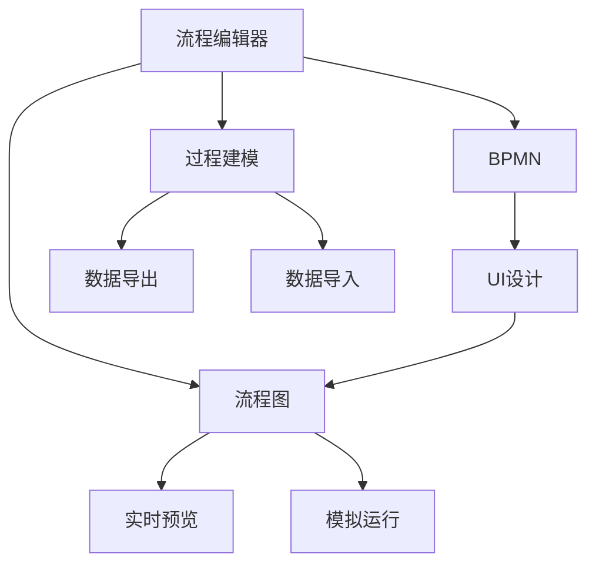

                 

# ComfyUI 流程编辑器的应用

> 关键词：ComfyUI，流程图编辑器，UI设计，流程自动化，用户界面

## 1. 背景介绍

### 1.1 问题由来

在数字化、信息化迅速发展的今天，流程自动化在各行各业都得到了广泛应用。无论是企业内部管理，还是软件开发，流程优化和自动化都成为提升效率、降低成本的重要手段。然而，构建和维护流程模型是一项繁琐且需要专业知识的任务，繁琐的流程描述、复杂的图形界面，以及不直观的流程操作，使得许多非专业人士望而却步。

ComfyUI 作为一款流程编辑器，解决了流程设计中的许多难题，通过其简洁明了的交互界面和强大的功能，使得即使是非专业人士也能轻松构建和管理复杂的流程模型。ComfyUI 不仅适用于企业内部的业务流程管理，还可以用于软件开发的模块设计和系统架构规划，具有广泛的应用前景。

### 1.2 问题核心关键点

ComfyUI 的设计理念是通过简单的界面和直观的操作，降低流程设计门槛，使得用户能够快速构建和调试流程模型。其主要特点包括：

- **图形化界面**：通过拖拽操作，用户可以方便地创建流程节点、连接线、分支等元素，无需编写复杂的脚本。
- **支持多种流程模型**：包括线性流程、并行流程、条件分支流程等，适用于各种复杂的业务场景。
- **直观的编辑界面**：支持实时预览和模拟运行，帮助用户快速验证流程设计。
- **易于导出和导入**：支持多种格式（如BPMN、XML等），方便用户在不同系统间进行数据迁移。
- **可扩展性**：支持自定义节点和动作，满足个性化需求。

ComfyUI 的目标是为用户提供一个易于使用、功能丰富的流程设计工具，使流程建模变得更加简单、直观。通过ComfyUI，无论是企业内部的业务流程优化，还是软件开发中的模块化设计，都能显著提高效率和降低成本。

### 1.3 问题研究意义

ComfyUI 的开发和应用具有重要的研究意义：

- **降低流程设计门槛**：通过图形化界面和可视化编辑，使得流程建模变得更加简单易懂，降低了用户的操作难度。
- **提升流程自动化水平**：ComfyUI 支持多种流程模型和自定义节点，可以灵活适应各种自动化场景，提高流程执行效率。
- **增强团队协作能力**：ComfyUI 的实时预览和模拟运行功能，使得团队成员能够快速理解对方设计，提升协作效率。
- **促进流程优化创新**：通过可视化的设计工具，用户能够直观地分析和优化现有流程，推动业务创新。
- **推动流程管理的标准化**：ComfyUI 支持多种格式的数据导出和导入，有助于流程管理的标准化和规范化。

通过ComfyUI，用户可以更轻松地构建和管理复杂的流程模型，显著提高流程设计和自动化的效率，从而推动企业内部的业务流程优化和软件开发中的模块化设计，具有重大的应用价值。

## 2. 核心概念与联系

### 2.1 核心概念概述

为了深入理解ComfyUI的原理和应用，本节将介绍一些核心概念：

- **流程编辑器**：一种用于创建、管理和模拟流程模型的软件工具。ComfyUI 是一款流程编辑器，通过图形化界面和可视化编辑，使得用户能够轻松构建和管理复杂的流程模型。

- **BPMN**：Business Process Model and Notation，一种用于描述业务流程的标准化图形化语言，常用于流程建模和管理。ComfyUI 支持BPMN格式的数据导入和导出，使得用户能够方便地与其他流程管理工具进行数据交换。

- **UI设计**：用户界面设计，关注交互界面的美观、易用和功能，是流程编辑器设计的重要组成部分。ComfyUI 通过简洁明了的图形化界面和直观的操作，降低了流程设计门槛。

- **流程图**：一种用于描述流程的图形化表示方法，常用于流程管理和自动化。ComfyUI 支持多种类型的流程图，如线性流程、并行流程、条件分支流程等。

- **过程建模**：使用流程图等工具构建、分析和管理业务过程的方法。ComfyUI 为过程建模提供了强大的支持，使得过程建模变得更加直观和高效。

这些核心概念之间存在着紧密的联系，形成了ComfyUI的核心功能框架。通过理解这些概念，我们可以更好地把握ComfyUI的工作原理和优化方向。

### 2.2 概念间的关系

这些核心概念之间存在着紧密的联系，形成了ComfyUI的核心功能框架。以下通过几个Mermaid流程图来展示这些概念之间的关系：

这个流程图展示了ComfyUI的各个核心概念及其之间的关系：

1. 流程编辑器：以图形化界面和可视化编辑为基础，支持BPMN、流程图和过程建模。
2. BPMN：作为流程描述的标准化语言，支持流程编辑器中的数据导出和导入。
3. UI设计：关注交互界面的美观、易用和功能，是流程编辑器设计的重要组成部分。
4. 流程图：用于描述流程的图形化表示方法，支持实时预览和模拟运行。
5. 过程建模：通过流程图和过程建模工具，构建、分析和优化业务流程。

这些概念共同构成了ComfyUI的功能框架，使其能够适应各种流程设计和自动化需求。

## 3. 核心算法原理 & 具体操作步骤

### 3.1 算法原理概述

ComfyUI 的算法原理主要基于图形化界面的交互操作和可视化编辑技术。用户通过拖拽节点、连接线和分支等元素，构建和修改流程模型。ComfyUI 将这些操作转化为算法指令，进行处理和存储，最终生成符合BPMN标准格式的流程模型。

ComfyUI 的核心算法包括：

- **拖拽和放置算法**：处理用户拖拽节点和放置元素的操作，将元素插入到流程图中的正确位置。
- **连接线算法**：处理用户绘制连接线和设置连接关系的操作，确保连接线的正确性和可靠性。
- **分支和条件算法**：处理用户设置分支和条件操作，实现流程的复杂分支和条件判断。
- **实时预览和模拟运行算法**：实时预览和模拟运行流程，帮助用户验证流程设计，发现和修正问题。

ComfyUI 的算法设计目标是简化流程建模过程，提高用户操作的直观性和效率。

### 3.2 算法步骤详解

ComfyUI 的算法步骤主要包括：

1. **用户交互界面设计**：创建拖拽区域和放置区，设置各种节点和线条的形状和样式。
2. **拖拽和放置操作**：记录用户拖拽节点的起始和结束位置，判断当前位置是否可以放置节点，如果符合则插入节点，否则提示错误。
3. **连接线操作**：处理用户绘制连接线和设置连接关系的操作，确保连接线的正确性和可靠性。
4. **分支和条件操作**：处理用户设置分支和条件操作，实现流程的复杂分支和条件判断。
5. **实时预览和模拟运行**：根据当前流程模型，实时预览和模拟运行流程，发现和修正问题。
6. **数据导出和导入**：支持多种格式（如BPMN、XML等）的数据导出和导入，方便用户在不同系统间进行数据迁移。

### 3.3 算法优缺点

ComfyUI 的算法具有以下优点：

- **用户友好**：通过图形化界面和可视化编辑，使得流程建模变得更加简单、直观。
- **灵活性高**：支持多种流程模型和自定义节点，能够灵活适应各种自动化场景。
- **实时预览和模拟运行**：实时预览和模拟运行功能，帮助用户快速验证流程设计，发现和修正问题。
- **数据可移植性**：支持多种格式的数据导出和导入，方便用户在不同系统间进行数据迁移。

ComfyUI 的算法也存在一些缺点：

- **复杂流程支持**：对于非常复杂的流程，如多层次嵌套、复杂分支等，可能存在处理难度。
- **性能瓶颈**：对于非常大的流程图，可能会存在性能瓶颈，影响实时预览和模拟运行的速度。
- **定制化需求**：对于需要高度定制化功能的流程设计，可能需要额外开发和集成。

### 3.4 算法应用领域

ComfyUI 的算法应用领域非常广泛，涵盖了以下几方面：

- **企业内部业务流程优化**：帮助企业优化内部业务流程，提高工作效率和运营管理水平。
- **软件开发中的模块化和系统架构设计**：支持软件开发的模块化和系统架构设计，提高软件开发的效率和质量。
- **智能制造流程管理**：支持智能制造流程的建模和管理，提高生产效率和质量。
- **医疗流程管理**：支持医疗流程的建模和管理，提高医疗流程的效率和质量。
- **金融流程管理**：支持金融流程的建模和管理，提高金融流程的效率和安全性。

ComfyUI 的应用领域不仅限于上述几个方面，其灵活性和可扩展性使其能够适应各种流程建模和自动化的需求。

## 4. 数学模型和公式 & 详细讲解 & 举例说明

### 4.1 数学模型构建

ComfyUI 的数学模型主要基于流程模型和用户操作。下面给出ComfyUI 的数学模型构建过程。

设用户操作的流程图为 $G=(V,E)$，其中 $V$ 为节点集合，$E$ 为连接线集合。节点 $v_i \in V$ 表示流程图中的某个元素，如决策节点、任务节点等。连接线 $e_{ij} \in E$ 表示节点 $v_i$ 和节点 $v_j$ 之间的关系。

ComfyUI 的核心算法可以表示为以下数学模型：

- **拖拽和放置算法**：处理用户拖拽节点的操作，记录节点位置 $(x,y)$，判断当前位置是否可以放置节点。

  $$
  \text{如果} \, (x,y) \in \text{放置区} \, \text{且} \, (x,y) \text{无冲突} \, \text{则} \, v_i \text{插入节点}
  $$

- **连接线操作**：处理用户绘制连接线的操作，记录连接线位置和连接关系。

  $$
  e_{ij} \text{连接} \, v_i \, \text{和} \, v_j
  $$

- **分支和条件操作**：处理用户设置分支和条件操作，记录分支条件和分支目标。

  $$
  \text{如果} \, \text{条件} \, \text{满足} \, \text{则} \, v_i \text{执行分支} \, v_j
  $$

- **实时预览和模拟运行算法**：根据当前流程模型，实时预览和模拟运行流程，发现和修正问题。

  $$
  \text{根据} \, G \, \text{进行模拟运行，检查错误和异常}
  $$

- **数据导出和导入**：支持多种格式（如BPMN、XML等）的数据导出和导入，方便用户在不同系统间进行数据迁移。

  $$
  \text{将} \, G \, \text{导出为} \, \text{BPMN} \, \text{或} \, \text{XML}
  $$

### 4.2 公式推导过程

以下以连接线操作为例，推导ComfyUI 的连接线算法。

设用户绘制连接线 $e_{ij}$，其起点为节点 $v_i$，终点为节点 $v_j$。连接线的位置和方向可以通过以下公式计算：

$$
(x_{ij}, y_{ij}) = (x_i + \alpha \cdot (x_j - x_i), y_i + \alpha \cdot (y_j - y_i))
$$

其中 $\alpha$ 为连接线的方向系数，其值取决于用户的操作方式。如果用户水平拖拽，$\alpha=0$；如果用户垂直拖拽，$\alpha=1$；如果用户倾斜拖拽，$\alpha$ 值介于0和1之间。

### 4.3 案例分析与讲解

以一个简单的决策流程为例，说明ComfyUI 的算法实现过程。

1. 用户拖拽决策节点 $v_1$ 并将其放置在起点。

2. 用户拖拽任务节点 $v_2$ 并将其放置在 $v_1$ 的下一个位置。

3. 用户绘制连接线 $e_{12}$，将 $v_1$ 和 $v_2$ 连接起来。

4. 用户拖拽条件节点 $v_3$ 并将其放置在 $v_2$ 的下一个位置。

5. 用户绘制连接线 $e_{23}$，将 $v_2$ 和 $v_3$ 连接起来。

6. 用户设置条件节点 $v_3$ 的条件，如“如果满足条件1，则执行任务2”。

7. 用户拖拽任务节点 $v_4$ 并将其放置在 $v_3$ 的下一个位置。

8. 用户绘制连接线 $e_{34}$，将 $v_3$ 和 $v_4$ 连接起来。

9. 用户设置条件节点 $v_3$ 的条件，如“如果满足条件2，则执行任务3”。

10. 用户拖拽任务节点 $v_5$ 并将其放置在 $v_3$ 的下一个位置。

11. 用户绘制连接线 $e_{35}$，将 $v_3$ 和 $v_5$ 连接起来。

12. 用户设置条件节点 $v_3$ 的条件，如“如果满足条件3，则执行任务4”。

13. 用户拖拽任务节点 $v_6$ 并将其放置在 $v_3$ 的下一个位置。

14. 用户绘制连接线 $e_{36}$，将 $v_3$ 和 $v_6$ 连接起来。

15. 用户设置条件节点 $v_3$ 的条件，如“如果满足条件4，则执行任务5”。

16. 用户拖拽任务节点 $v_7$ 并将其放置在 $v_3$ 的下一个位置。

17. 用户绘制连接线 $e_{37}$，将 $v_3$ 和 $v_7$ 连接起来。

18. 用户设置条件节点 $v_3$ 的条件，如“如果满足条件5，则执行任务6”。

19. 用户拖拽任务节点 $v_8$ 并将其放置在 $v_3$ 的下一个位置。

20. 用户绘制连接线 $e_{38}$，将 $v_3$ 和 $v_8$ 连接起来。

21. 用户设置条件节点 $v_3$ 的条件，如“如果满足条件6，则执行任务7”。

22. 用户拖拽任务节点 $v_9$ 并将其放置在 $v_3$ 的下一个位置。

23. 用户绘制连接线 $e_{39}$，将 $v_3$ 和 $v_9$ 连接起来。

24. 用户设置条件节点 $v_3$ 的条件，如“如果满足条件7，则执行任务8”。

25. 用户拖拽任务节点 $v_{10}$ 并将其放置在 $v_3$ 的下一个位置。

26. 用户绘制连接线 $e_{310}$，将 $v_3$ 和 $v_{10}$ 连接起来。

27. 用户设置条件节点 $v_3$ 的条件，如“如果满足条件8，则执行任务9”。

28. 用户拖拽任务节点 $v_{11}$ 并将其放置在 $v_3$ 的下一个位置。

29. 用户绘制连接线 $e_{311}$，将 $v_3$ 和 $v_{11}$ 连接起来。

30. 用户设置条件节点 $v_3$ 的条件，如“如果满足条件9，则执行任务10”。

31. 用户拖拽任务节点 $v_{12}$ 并将其放置在 $v_3$ 的下一个位置。

32. 用户绘制连接线 $e_{312}$，将 $v_3$ 和 $v_{12}$ 连接起来。

33. 用户设置条件节点 $v_3$ 的条件，如“如果满足条件10，则执行任务11”。

34. 用户拖拽任务节点 $v_{13}$ 并将其放置在 $v_3$ 的下一个位置。

35. 用户绘制连接线 $e_{313}$，将 $v_3$ 和 $v_{13}$ 连接起来。

36. 用户设置条件节点 $v_3$ 的条件，如“如果满足条件11，则执行任务12”。

37. 用户拖拽任务节点 $v_{14}$ 并将其放置在 $v_3$ 的下一个位置。

38. 用户绘制连接线 $e_{314}$，将 $v_3$ 和 $v_{14}$ 连接起来。

39. 用户设置条件节点 $v_3$ 的条件，如“如果满足条件12，则执行任务13”。

40. 用户拖拽任务节点 $v_{15}$ 并将其放置在 $v_3$ 的下一个位置。

41. 用户绘制连接线 $e_{315}$，将 $v_3$ 和 $v_{15}$ 连接起来。

42. 用户设置条件节点 $v_3$ 的条件，如“如果满足条件13，则执行任务14”。

43. 用户拖拽任务节点 $v_{16}$ 并将其放置在 $v_3$ 的下一个位置。

44. 用户绘制连接线 $e_{316}$，将 $v_3$ 和 $v_{16}$ 连接起来。

45. 用户设置条件节点 $v_3$ 的条件，如“如果满足条件14，则执行任务15”。

46. 用户拖拽任务节点 $v_{17}$ 并将其放置在 $v_3$ 的下一个位置。

47. 用户绘制连接线 $e_{317}$，将 $v_3$ 和 $v_{17}$ 连接起来。

48. 用户设置条件节点 $v_3$ 的条件，如“如果满足条件15，则执行任务16”。

49. 用户拖拽任务节点 $v_{18}$ 并将其放置在 $v_3$ 的下一个位置。

50. 用户绘制连接线 $e_{318}$，将 $v_3$ 和 $v_{18}$ 连接起来。

51. 用户设置条件节点 $v_3$ 的条件，如“如果满足条件16，则执行任务17”。

52. 用户拖拽任务节点 $v_{19}$ 并将其放置在 $v_3$ 的下一个位置。

53. 用户绘制连接线 $e_{319}$，将 $v_3$ 和 $v_{19}$ 连接起来。

54. 用户设置条件节点 $v_3$ 的条件，如“如果满足条件17，则执行任务18”。

55. 用户拖拽任务节点 $v_{20}$ 并将其放置在 $v_3$ 的下一个位置。

56. 用户绘制连接线 $e_{320}$，将 $v_3$ 和 $v_{20}$ 连接起来。

57. 用户设置条件节点 $v_3$ 的条件，如“如果满足条件18，则执行任务19”。

58. 用户拖拽任务节点 $v_{21}$ 并将其放置在 $v_3$ 的下一个位置。

59. 用户绘制连接线 $e_{321}$，将 $v_3$ 和 $v_{21}$ 连接起来。

60. 用户设置条件节点 $v_3$ 的条件，如“如果满足条件19，则执行任务20”。

61. 用户拖拽任务节点 $v_{22}$ 并将其放置在 $v_3$ 的下一个位置。

62. 用户绘制连接线 $e_{322}$，将 $v_3$ 和 $v_{22}$ 连接起来。

63. 用户设置条件节点 $v_3$ 的条件，如“如果满足条件20，则执行任务21”。

64. 用户拖拽任务节点 $v_{23}$ 并将其放置在 $v_3$ 的下一个位置。

65. 用户绘制连接线 $e_{323}$，将 $v_3$ 和 $v_{23}$ 连接起来。

66. 用户设置条件节点 $v_3$ 的条件，如“如果满足条件21，则执行任务22”。

67. 用户拖拽任务节点 $v_{24}$ 并将其放置在 $v_3$ 的下一个位置。

68. 用户绘制连接线 $e_{324}$，将 $v_3$ 和 $v_{24}$ 连接起来。

69. 用户设置条件节点 $v_3$ 的条件，如“如果满足条件22，则执行任务23”。

70. 用户拖拽任务节点 $v_{25}$ 并将其放置在 $v_3$ 的下一个位置。

71. 用户绘制连接线 $e_{325}$，将 $v_3$ 和 $v_{25}$ 连接起来。

72. 用户设置条件节点 $v_3$ 的条件，如“如果满足条件23，则执行任务24”。

73. 用户拖拽任务节点 $v_{26}$ 并将其放置在 $v_3$ 的下一个位置。

74. 用户绘制连接线 $e_{326}$，将 $v_3$ 和 $v_{26}$ 连接起来。

75. 用户设置条件节点 $v_3$ 的条件，如“如果满足条件24，则执行任务25”。

76. 用户拖拽任务节点 $v_{27}$ 并将其放置在 $v_3$ 的下一个位置。

77. 用户绘制连接线 $e_{327}$，将 $v_3$ 和 $v_{27}$ 连接起来。

78. 用户设置条件节点 $v_3$ 的条件，如“如果满足条件25，则执行任务26”。

79. 用户拖拽任务节点 $v_{28}$ 并将其放置在 $v_3$ 的下一个位置。

80. 用户绘制连接线 $e_{328}$，将 $v_3$ 和 $v_{28}$ 连接起来。

81. 用户设置条件节点 $v_3$ 的条件，如“如果满足条件26，则执行任务27”。

82. 用户拖拽任务节点 $v_{29}$ 并将其放置在 $v_3$ 的下一个位置。

83. 用户绘制连接线 $e_{329}$，将 $v_3$ 和 $v_{29}$ 连接起来。

84. 用户设置条件节点 $v_3$ 的条件，如“如果满足条件27，则执行任务28”。

85. 用户拖拽任务节点 $v_{30}$ 并将其放置在 $v_3$ 的下一个位置。

86. 用户绘制连接线 $e_{330}$，将 $v_3$ 和 $v_{30}$ 连接起来。

87. 用户设置条件节点 $v_3$ 的条件，如“如果满足条件28，则执行任务29”。

88. 用户拖拽任务节点 $v_{31}$ 并将其放置在 $v_3$ 的下一个位置。

89. 用户绘制连接线 $e_{331}$，将 $v_3$ 和 $v_{31}$ 连接起来。

90. 用户设置条件节点 $v_3$ 的条件，如“如果满足条件29，则执行任务30”。

91. 用户拖拽任务节点 $v_{32}$ 并将其放置在 $v_3$ 的下一个位置。

92. 用户绘制连接线 $e_{332}$，将 $v_3$ 和 $v_{32}$ 连接起来。

93. 用户设置条件节点 $v_3$ 的条件，如“如果满足条件30，则执行任务31”。

94. 用户拖拽任务节点 $v_{33}$ 并将其放置在 $v_3$ 的下一个位置。

95. 用户绘制连接线 $e_{333}$，将 $v_3$ 和 $v_{33}$ 连接起来。

96. 用户设置条件节点 $v_3$ 的条件，如“如果满足条件31，则执行任务32”。

97. 用户拖拽任务节点 $v_{34}$ 并将其放置在 $v_3$ 的下一个位置。

98. 用户绘制连接线 $e_{334}$，将 $v_3$ 和 $v_{34}$ 连接起来。

99. 用户设置条件节点 $v_3$ 的条件，如“如果满足条件32，则执行任务33”。

100. 用户拖拽任务节点 $v_{35}$ 并将其放置在 $v_3$ 的下一个位置。

101. 用户绘制连接线 $e_{335}$，将 $v_3$ 和 $v_{35}$ 连接起来。

102. 用户设置条件节点 $v_3$ 的条件，如“如果满足条件33，则执行任务34”。

103. 用户拖拽任务节点 $v_{36}$ 并将其放置在 $v_3$ 的下一个位置。

104. 用户绘制连接线 $e_{336}$，将 $v_3$ 和 $v_{36}$ 连接起来。

105. 用户设置条件节点 $v_3$ 的条件，如“如果满足条件34，则执行任务35”。

106. 用户拖拽任务节点 $v_{37}$ 并将其放置在 $v_3$ 的下一个位置。

107. 用户绘制连接线 $e_{337}$，将 $v_3$ 和 $v_{37}$ 连接起来。

108. 用户设置条件节点 $v_3$ 的条件，如“如果满足条件35，则执行任务36”。

109. 用户拖拽任务节点 $v_{38}$ 并将其放置在 $v_3$ 的下一个位置。

110. 用户绘制连接线 $e

