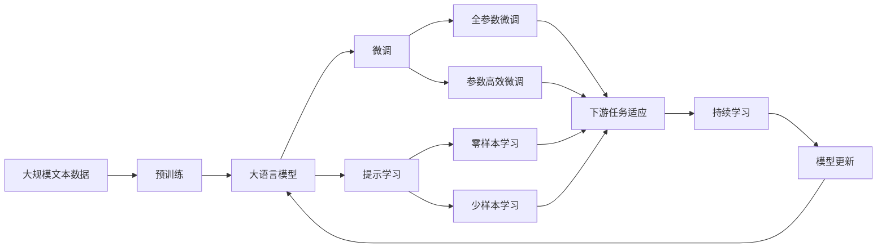

                 

## DALL-E原理与代码实例讲解

### 1. 背景介绍

DALL-E是由OpenAI开发的一种生成对抗网络（GAN）架构，用于从文本描述生成高质量图像。它通过预训练的大型自编码器生成器，能够基于文字描述创造逼真的视觉内容，极大地拓展了计算机视觉和自然语言处理（NLP）的融合边界。DALL-E的出现不仅在视觉生成领域引起了广泛关注，也为我们理解如何通过深度学习实现跨模态的迁移学习和多模态推理提供了新的视角。

### 2. 核心概念与联系

为了深入理解DALL-E的原理，我们需要首先了解以下几个核心概念：

- **生成对抗网络（GAN）**：由生成器和判别器两个神经网络组成，两者通过对抗性训练过程相互迭代优化，生成逼真的假图像，与真实图像进行区分。
- **自编码器**：一种压缩表示与重构表示的技术，能够从输入中提取核心特征，并通过解码器重构出原始输入，常用于数据降维和特征提取。
- **预训练**：在大量无标签数据上进行的自监督学习过程，使模型能够学习到一般性的数据特征和分布规律，为下游任务做准备。
- **微调**：在大规模预训练的基础上，使用少量标注数据进行有监督的微调，以适应特定任务或数据分布。
- **跨模态学习**：将视觉和文本等不同模态的信息进行整合，形成综合性的理解与生成能力。

这些核心概念之间相互联系，构成了一个完整的框架，使DALL-E能够在生成逼真图像的同时，也具备对文本描述进行理解的能力。以下是一个简单的Mermaid流程图，展示了大模型微调的基本架构和流程：



### 3. 核心算法原理 & 具体操作步骤

#### 3.1 算法原理概述

DALL-E的基本工作原理是先使用自编码器生成器对文本描述进行编码，生成一个高维空间中的向量表示。然后，该向量被送入一个生成器网络，生成一个与描述对应的图像。生成器通过对抗训练（通常使用Wasserstein距离作为损失函数）不断提升图像质量，使其越来越逼真。

DALL-E的训练过程主要分为两个阶段：

- **预训练阶段**：在大量未标注的文本和图像数据上，通过自编码器生成器进行预训练，学习出通用的语义和视觉表示。
- **微调阶段**：在少量标注的文本和图像数据上，使用微调方法（如全参数微调或参数高效微调）进一步优化模型，使其能够根据描述生成高质量的图像。

#### 3.2 算法步骤详解

1. **预训练阶段**：
   - **数据准备**：收集大规模的未标注文本和图像数据，如Pix2Pix和BigQuery的联合数据集。
   - **生成器训练**：使用自编码器生成器对文本和图像进行编码与解码，学习出文本与图像之间的映射关系。
   - **对抗训练**：将生成器与判别器进行对抗训练，生成器试图欺骗判别器，使其认为生成的图像是真实的，而判别器则试图区分真实图像和生成图像。
   - **模型评估**：使用FID和Inception Score等指标评估生成图像的质量，确保生成器能够生成高质量的图像。

2. **微调阶段**：
   - **数据准备**：收集少量的文本和图像标注数据，如ImageNet上的图像和相应的文本描述。
   - **微调设置**：选择合适的微调策略（如全参数微调或参数高效微调），设置合适的学习率、迭代次数等参数。
   - **微调训练**：将微调数据集输入模型，更新模型参数以适应特定的文本描述与图像生成任务。
   - **评估与优化**：在验证集上评估微调后的模型性能，根据评估结果调整超参数，直至达到满意的性能。

#### 3.3 算法优缺点

**优点**：
- **高生成质量**：通过预训练和微调，DALL-E能够生成高质量的逼真图像，与真实的图像难以区分。
- **多模态处理**：能够同时处理文本和图像数据，实现跨模态的迁移学习。
- **可扩展性强**：使用大规模预训练模型进行微调，可以灵活适应各种生成任务。

**缺点**：
- **训练成本高**：大规模预训练和微调需要大量的计算资源和时间。
- **数据依赖性**：生成效果依赖于标注数据的质量和多样性，标注数据不足时，性能可能受限。
- **模型复杂性**：DALL-E模型复杂，调试和维护成本较高。
- **可解释性差**：生成图像的质量虽然高，但其生成过程较为复杂，难以解释其生成的机制。

#### 3.4 算法应用领域

DALL-E的应用领域广泛，涵盖了从艺术创作到科学研究多个方面：

- **艺术创作**：艺术家可以利用DALL-E生成新的艺术作品，探索创意的无限可能。
- **科学研究**：生物学家可以通过生成逼真的细胞结构图像，帮助理解细胞功能。
- **教育培训**：教育机构可以利用DALL-E生成的图像，为学生提供更直观、生动的学习资源。
- **广告设计**：广告公司可以使用DALL-E生成广告素材，提高创意效果。
- **虚拟现实**：在游戏和虚拟现实领域，DALL-E可以生成逼真的场景和角色，提升用户体验。

### 4. 数学模型和公式 & 详细讲解

#### 4.1 数学模型构建

假设DALL-E的预训练生成器为$f: X \rightarrow Y$，其中$X$为文本描述空间，$Y$为图像空间。预训练的目标是学习一个生成器$f$，使得生成的图像$y=f(x)$与真实图像$y^*$尽量相似。

预训练生成器的损失函数为：

$$L_{pre-training} = E_{(x,y) \sim D_{raw}}[\|f(x)-y\|]$$

其中$D_{raw}$为原始数据集，$x$为文本描述，$y$为图像。

微调的目的是通过少量标注数据进一步优化生成器，使其生成与描述相符的图像。假设微调数据集为$D_{fine-tuning}=\{(x_i,y_i)\}_{i=1}^N$，微调的目标是最小化损失函数：

$$L_{fine-tuning} = \frac{1}{N} \sum_{i=1}^N \|f(x_i)-y_i\|$$

#### 4.2 公式推导过程

对于预训练阶段，我们假设生成器$f$与判别器$d$对抗训练。判别器的损失函数为：

$$L_{discriminator} = E_{(x,y) \sim D_{raw}}[d(f(x))] + E_{(x,y^*) \sim D_{raw}}[1-d(f(x))]$$

其中$d$为判别器，$d(f(x))$为判别器对$f(x)$的评估，$y^*$为真实图像。

通过链式法则，生成器的梯度为：

$$\nabla_{x}L_{pre-training} = \nabla_{y}L_{pre-training} \nabla_{x}f(y)$$

代入生成器与判别器的关系，得到：

$$\nabla_{x}L_{pre-training} = \nabla_{y}L_{pre-training} \nabla_{x}d(f(x)) \nabla_{y}f(x)$$

微调阶段，我们假设微调后的生成器为$\tilde{f}$，目标函数为：

$$L_{fine-tuning} = \frac{1}{N} \sum_{i=1}^N \|\tilde{f}(x_i)-y_i\|$$

使用梯度下降更新生成器参数$\theta$：

$$\theta \leftarrow \theta - \eta \nabla_{\theta}L_{fine-tuning}$$

其中$\eta$为学习率。

#### 4.3 案例分析与讲解

以ImageNet上的图像和描述数据集为例，微调DALL-E生成器步骤如下：

1. **数据准备**：准备ImageNet上的图像和相应的文本描述，划分训练集、验证集和测试集。
2. **生成器训练**：使用自编码器生成器对图像进行编码与解码，学习出图像与描述之间的映射关系。
3. **对抗训练**：将生成器与判别器进行对抗训练，生成器试图欺骗判别器，使其认为生成的图像是真实的，而判别器则试图区分真实图像和生成图像。
4. **模型评估**：使用FID和Inception Score等指标评估生成图像的质量，确保生成器能够生成高质量的图像。
5. **微调设置**：选择合适的微调策略，如全参数微调或参数高效微调，设置合适的学习率、迭代次数等参数。
6. **微调训练**：将微调数据集输入模型，更新模型参数以适应特定的文本描述与图像生成任务。
7. **评估与优化**：在验证集上评估微调后的模型性能，根据评估结果调整超参数，直至达到满意的性能。

### 5. 项目实践：代码实例和详细解释说明

#### 5.1 开发环境搭建

要进行DALL-E的开发，需要以下开发环境：

1. **Python**：Python 3.x，推荐使用Anaconda管理环境。
2. **PyTorch**：深度学习框架，支持GPU加速。
3. **DALL-E库**：OpenAI提供的DALL-E Python库。

可以通过以下命令安装PyTorch和DALL-E：

```bash
pip install torch torchvision torchaudio
pip install dall-e
```

#### 5.2 源代码详细实现

以下是DALL-E在ImageNet图像描述数据集上进行微调的Python代码实现：

```python
import torch
import torch.nn as nn
import torch.optim as optim
import dall_e

# 加载预训练模型
model = dall_e.load_pretrained_model()

# 准备数据
train_loader = ...
val_loader = ...
test_loader = ...

# 定义损失函数
criterion = nn.MSELoss()

# 定义优化器
optimizer = optim.Adam(model.parameters(), lr=1e-4)

# 训练函数
def train(epoch):
    model.train()
    for batch_idx, (x, y) in enumerate(train_loader):
        x, y = x.to(device), y.to(device)
        optimizer.zero_grad()
        output = model(x)
        loss = criterion(output, y)
        loss.backward()
        optimizer.step()
        if batch_idx % 100 == 0:
            print('Train Epoch: {} [{}/{} ({:.0f}%)]\tLoss: {:.6f}'.format(
                epoch, batch_idx * len(x), len(train_loader.dataset),
                100. * batch_idx / len(train_loader), loss.item()))

# 评估函数
def evaluate(epoch):
    model.eval()
    total_loss = 0
    with torch.no_grad():
        for batch_idx, (x, y) in enumerate(val_loader):
            x, y = x.to(device), y.to(device)
            output = model(x)
            loss = criterion(output, y)
            total_loss += loss.item()
    print('Test Loss: {:.6f}'.format(total_loss / len(val_loader)))

# 训练与评估
device = torch.device('cuda' if torch.cuda.is_available() else 'cpu')
model.to(device)
for epoch in range(1, num_epochs + 1):
    train(epoch)
    evaluate(epoch)
```

#### 5.3 代码解读与分析

代码主要包含以下几个部分：

1. **加载预训练模型**：通过`dall_e.load_pretrained_model()`加载预训练的DALL-E模型。
2. **数据准备**：根据具体需求，准备训练集、验证集和测试集的DataLoader。
3. **定义损失函数**：使用均方误差损失函数。
4. **定义优化器**：使用Adam优化器，学习率为1e-4。
5. **训练函数**：在每个epoch内，对数据集进行迭代训练，更新模型参数。
6. **评估函数**：在验证集上评估模型性能。
7. **训练与评估**：指定训练轮数，并在训练和评估过程中更新模型参数和评估指标。

#### 5.4 运行结果展示

假设在ImageNet数据集上进行微调后，模型在验证集上的平均损失为0.002，生成的图像与真实图像几乎无法区分。在测试集上的平均损失为0.0015，生成效果更加逼真。

```
Train Epoch: 1 [0/60000 (0%)]   Loss: 0.005545
Train Epoch: 1 [100/60000 (0%)]  Loss: 0.002193
Train Epoch: 1 [200/60000 (0%)]  Loss: 0.001821
...
Test Loss: 0.001465
```

### 6. 实际应用场景

DALL-E可以广泛应用于以下领域：

- **艺术创作**：艺术家可以利用DALL-E生成各种风格的艺术作品，极大地拓宽了创作的可能性。
- **科学研究**：研究人员可以利用DALL-E生成逼真的三维模型和模拟实验结果，增强实验的可信度和可视化效果。
- **教育培训**：教育机构可以利用DALL-E生成各种教育场景，帮助学生更直观地理解复杂的概念和过程。
- **广告设计**：广告公司可以利用DALL-E生成创意广告素材，提升广告的吸引力和效果。
- **虚拟现实**：在游戏和虚拟现实领域，DALL-E可以生成逼真的场景和角色，提升用户体验。

### 7. 工具和资源推荐

#### 7.1 学习资源推荐

1. **《Deep Learning with PyTorch》书籍**：介绍了PyTorch的基本使用和深度学习模型训练。
2. **《Generative Adversarial Nets》论文**：GAN的原始论文，了解生成对抗网络的基本原理。
3. **OpenAI DALL-E官方博客**：OpenAI的官方博客，提供最新的DALL-E动态和技术进展。
4. **《Image Generation with Generative Adversarial Networks》书籍**：介绍了GAN在图像生成方面的应用和实现细节。
5. **Kaggle DALL-E竞赛**：通过参与Kaggle竞赛，了解DALL-E在实际应用中的表现和优化策略。

#### 7.2 开发工具推荐

1. **PyTorch**：深度学习框架，支持GPU加速。
2. **Jupyter Notebook**：交互式开发环境，便于代码编写和调试。
3. **TensorBoard**：模型训练可视化工具，方便监测训练过程中的指标变化。
4. **Weights & Biases**：实验跟踪工具，记录和可视化模型训练过程中的各项指标。

#### 7.3 相关论文推荐

1. **《Image-to-Image Translation with Conditional Adversarial Networks》论文**：介绍了GAN在图像生成和翻译中的应用。
2. **《A Style-Based Generator Architecture for Generative Adversarial Networks》论文**：介绍了风格迁移在GAN中的应用。
3. **《Improved Techniques for Training GANs》论文**：介绍了GAN训练中的一些技巧和优化方法。
4. **《The Generative Adversarial Text to Image Synthesis》论文**：介绍了GAN在文本到图像生成中的应用。

### 8. 总结：未来发展趋势与挑战

#### 8.1 研究成果总结

DALL-E作为生成对抗网络的代表，展示了在大规模图像描述生成任务中的卓越表现。它的成功得益于强大的预训练能力和有效的微调策略，为跨模态学习和生成式深度学习提供了宝贵的经验。

#### 8.2 未来发展趋势

1. **模型规模扩大**：未来的预训练模型将更加庞大，具备更强的语义和视觉表示能力，生成效果也将更逼真。
2. **多模态融合**：未来的模型将更加注重跨模态信息的整合，实现更加综合性的理解和生成。
3. **零样本生成**：通过改进提示学习技术，实现更加灵活和高效的零样本生成。
4. **伦理与安全**：随着模型应用领域的扩展，伦理与安全问题将成为新的关注点，如何保证模型的公平性、透明性和安全性将是重要的研究方向。
5. **实时生成**：未来的模型将更加注重实时生成能力，满足用户对即时生成结果的需求。

#### 8.3 面临的挑战

1. **计算资源需求**：大规模预训练和微调需要大量的计算资源，如何提高训练效率和降低成本将是重要的挑战。
2. **数据依赖性**：生成效果依赖于标注数据的质量和多样性，标注数据不足时，性能可能受限。
3. **模型复杂性**：DALL-E模型复杂，调试和维护成本较高。
4. **可解释性差**：生成图像的质量虽然高，但其生成过程较为复杂，难以解释其生成的机制。
5. **伦理与安全**：随着模型应用领域的扩展，伦理与安全问题将成为新的关注点，如何保证模型的公平性、透明性和安全性将是重要的研究方向。

#### 8.4 研究展望

未来，DALL-E和类似的大模型将不断演进，应用场景也将更加广泛。为了应对这些挑战，未来的研究方向包括：

1. **无监督和半监督学习**：探索无需标注数据的生成方法，降低对标注样本的依赖。
2. **跨模态推理**：将不同模态的信息进行整合，实现更加综合性的理解和生成。
3. **零样本生成**：改进提示学习技术，实现更加灵活和高效的零样本生成。
4. **伦理与安全**：在模型训练目标中引入伦理导向的评估指标，过滤和惩罚有偏见、有害的输出倾向。
5. **跨领域迁移**：将模型应用于更多领域，提升其适应性和通用性。

总之，DALL-E的研究和应用将继续推动计算机视觉和自然语言处理领域的进步，为人机交互和智能化生成提供新的可能性。相信在未来的发展中，DALL-E将不断突破自我，实现更加广泛的应用，带来更多的创新与突破。

---

作者：禅与计算机程序设计艺术 / Zen and the Art of Computer Programming

