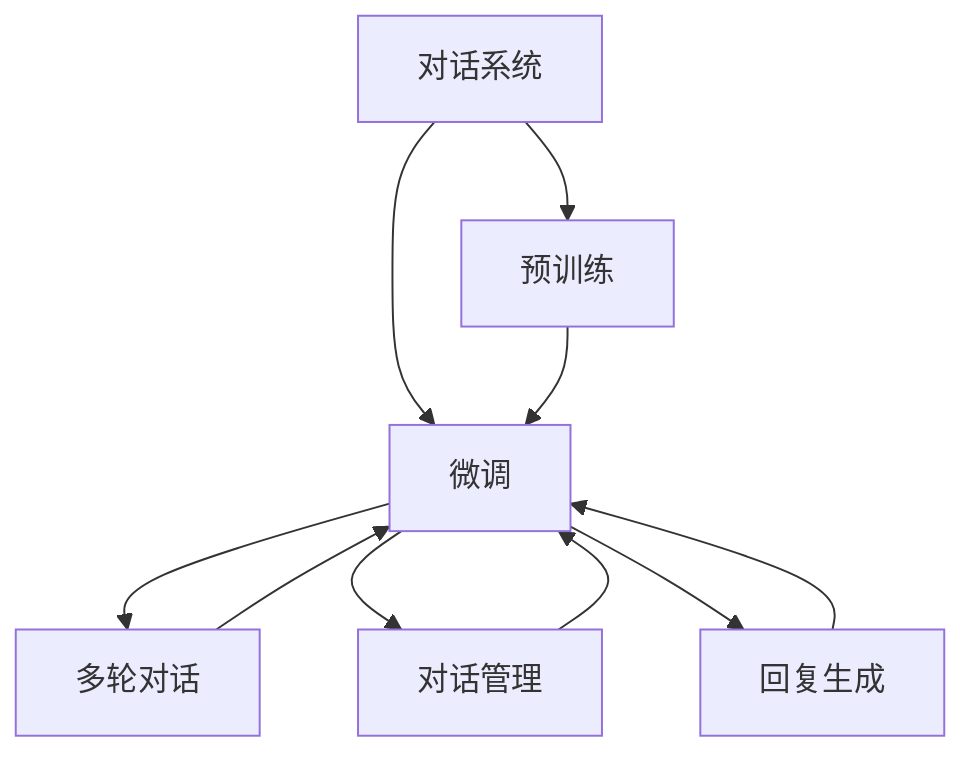
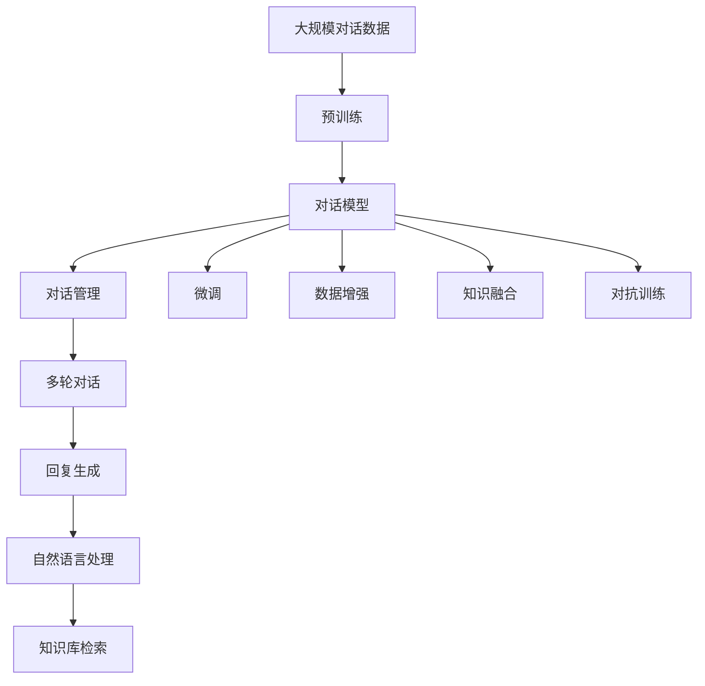

                 

# Dialogue Systems原理与代码实例讲解

## 1. 背景介绍

### 1.1 问题由来
对话系统(Dialogue System)是人工智能领域的一个重要分支，它旨在构建可以理解、处理自然语言输入，并能够自然地输出回应的人机交互系统。对话系统在各行各业都有广泛应用，如客服、智能助手、聊天机器人、人机翻译等。尽管对话系统在过去几十年里取得了显著进展，但在现实应用中仍面临诸多挑战。例如，如何理解复杂的上下文语境、如何生成自然流畅的回答、如何保证系统的可靠性和一致性等。

### 1.2 问题核心关键点
对话系统的核心关键点在于如何构建一个能够理解用户输入，并能够根据上下文生成合理回应的智能对话模型。目前，对话系统的主流范式包括基于规则的对话系统和基于机器学习的对话系统。基于规则的对话系统依赖于详尽的规则集和专家知识，而基于机器学习的对话系统则主要通过训练数据学习对话行为，具备较强的泛化能力。

在机器学习对话系统中，模型的构建可以分为两个阶段：预训练和微调。预训练阶段通常使用大规模无标签对话数据进行自监督学习，如语言建模、对话重构等，使得模型能够学习到基本的语言特征和对话规则。微调阶段则使用带标签的对话数据进行有监督学习，进一步优化模型以适应特定任务的对话需求。

### 1.3 问题研究意义
研究对话系统对于推动人工智能技术在实际应用中的落地具有重要意义：

1. **提升人机交互体验**：对话系统能够自然地理解并回应用户的输入，提供流畅、自然的对话体验，增强用户互动的舒适度和满意度。
2. **降低人工成本**：对话系统可以自动处理大量的用户查询，减轻人工客服的压力，提高服务效率。
3. **支持多模态对话**：通过语音识别和合成等技术，对话系统能够支持多模态的对话方式，如文本、语音、图像等，拓展了对话系统的应用范围。
4. **推动AI技术进步**：对话系统的发展推动了自然语言处理、机器翻译、知识图谱等AI技术的进步，为其他领域的AI应用提供了技术积累。

## 2. 核心概念与联系

### 2.1 核心概念概述

为更好地理解对话系统的核心概念，本节将介绍几个密切相关的核心概念：

- **对话系统**：旨在构建可以理解、处理自然语言输入，并能够自然地输出回应的人机交互系统。
- **预训练**：使用大规模无标签对话数据进行自监督学习，学习基本的语言特征和对话规则。
- **微调**：在预训练模型的基础上，使用带标签的对话数据进行有监督学习，进一步优化模型以适应特定任务的对话需求。
- **多轮对话**：对话过程中包含多个回合的交互，需要模型能够理解并记忆上下文信息。
- **对话管理**：对话系统的核心组件，负责对话流程的调度和管理，包括话题选择、对话状态更新等。
- **回复生成**：基于上下文信息，生成自然流畅的对话回复。

### 2.2 概念间的关系

这些核心概念之间存在着紧密的联系，构成了对话系统的整体架构。以下是一些概念之间的关系图：



这个图展示了对话系统的核心概念及其之间的关系：

1. 对话系统通过预训练和微调学习对话行为。
2. 对话系统能够进行多轮对话，需要对话管理模块来协调对话流程。
3. 回复生成模块基于上下文信息，生成自然流畅的对话回复。

### 2.3 核心概念的整体架构

最后，我们用一个综合的流程图来展示这些核心概念在大对话系统中的整体架构：



这个综合流程图展示了从预训练到微调，再到多轮对话和回复生成的完整过程。对话模型在预训练过程中学习到基本的对话规则，通过微调进一步优化以适应特定任务的对话需求。对话管理模块协调多轮对话的流程，回复生成模块基于上下文信息生成自然流畅的对话回复。同时，对话系统还可以引入知识库检索、知识融合、数据增强、对抗训练等技术，提升系统的性能和鲁棒性。

## 3. 核心算法原理 & 具体操作步骤
### 3.1 算法原理概述

对话系统的构建通常包括以下几个关键步骤：

1. **数据准备**：收集对话数据，分为训练集、验证集和测试集。对话数据需要经过标注，标注内容可能包括对话意图、对话状态、对话轮次、对话内容等。
2. **预训练模型选择**：选择适合的预训练模型，如RNN、LSTM、GRU等。预训练模型需要具备一定的语言理解能力。
3. **微调模型设计**：设计对话模型的架构，包括对话管理模块和回复生成模块。对话管理模块通常使用状态转移系统，回复生成模块可以使用注意力机制等。
4. **微调模型训练**：使用训练集对微调模型进行训练，优化模型参数，使其能够适应特定任务的对话需求。
5. **模型评估**：使用验证集和测试集对微调模型进行评估，检查模型的对话效果和鲁棒性。

### 3.2 算法步骤详解

以下我们将详细介绍对话系统的构建步骤：

**Step 1: 准备对话数据**
- 收集对话数据，分为训练集、验证集和测试集。对话数据需要经过标注，标注内容可能包括对话意图、对话状态、对话轮次、对话内容等。
- 对话数据需要分为回合，每个回合包含一次用户输入和机器回复。

**Step 2: 选择预训练模型**
- 选择适合的预训练模型，如RNN、LSTM、GRU等。预训练模型需要具备一定的语言理解能力。

**Step 3: 设计微调模型**
- 设计对话模型的架构，包括对话管理模块和回复生成模块。对话管理模块通常使用状态转移系统，回复生成模块可以使用注意力机制等。

**Step 4: 训练微调模型**
- 使用训练集对微调模型进行训练，优化模型参数，使其能够适应特定任务的对话需求。
- 训练过程中需要设定学习率、批大小、迭代轮数等参数。
- 可以使用梯度下降等优化算法进行模型训练。

**Step 5: 评估微调模型**
- 使用验证集和测试集对微调模型进行评估，检查模型的对话效果和鲁棒性。
- 可以使用BLEU、ROUGE等指标评估模型的生成效果。
- 可以使用F1分数、准确率等指标评估模型的理解和对话管理效果。

### 3.3 算法优缺点

对话系统的构建有以下优点：

- **灵活性**：对话系统可以根据特定任务进行定制，灵活性高。
- **自适应性**：对话系统能够根据上下文信息自适应地调整对话策略。
- **可扩展性**：对话系统可以轻松扩展到多模态对话，支持语音、图像等形式的输入和输出。

但对话系统也存在一些缺点：

- **高成本**：构建和维护对话系统需要大量的标注数据和计算资源。
- **复杂性**：对话系统的构建和调试相对复杂，需要丰富的经验和知识。
- **不可解释性**：对话系统的决策过程复杂，难以解释其内部工作机制。

### 3.4 算法应用领域

对话系统已经广泛应用于多个领域，包括但不限于：

- **客户服务**：用于构建智能客服系统，处理客户查询和投诉。
- **医疗咨询**：用于构建智能医疗咨询系统，提供疾病诊断和治疗建议。
- **教育培训**：用于构建智能教育系统，提供学习资料和互动教学。
- **电子商务**：用于构建智能客服和推荐系统，提升用户体验。
- **智能家居**：用于构建智能对话助手，控制家居设备。

## 4. 数学模型和公式 & 详细讲解  
### 4.1 数学模型构建

在对话系统中，我们通常使用以下数学模型来描述对话行为：

- **语言模型**：用于建模自然语言输入的分布。常见的语言模型包括N-gram模型、LSTM模型等。
- **对话模型**：用于建模对话过程的转移和回复。常见的对话模型包括隐马尔可夫模型、条件随机场等。
- **知识库**：用于存储和检索领域知识。常见的知识库包括ontology、语义网络等。

**语言模型**：用于建模自然语言输入的分布。常见的语言模型包括N-gram模型、LSTM模型等。

**对话模型**：用于建模对话过程的转移和回复。常见的对话模型包括隐马尔可夫模型、条件随机场等。

**知识库**：用于存储和检索领域知识。常见的知识库包括ontology、语义网络等。

### 4.2 公式推导过程

以下我们以隐马尔可夫模型为例，推导对话模型的基本公式。

设对话数据包含$N$个回合，每个回合由用户输入$x_i$和机器回复$y_i$组成。对话模型的任务是学习一个概率模型，使得$p(x_{1:N}, y_{1:N}|O)$最大化，其中$O$为对话数据的观测序列。

对话模型的转移和回复可以表示为：

$$
p(y_{i+1}|y_i, x_i, O) = f(y_{i+1}, x_i, y_i, O)
$$

$$
p(x_{i+1}|y_i, x_i, O) = g(x_{i+1}, y_i, x_i, O)
$$

其中$f$和$g$分别表示机器回复和用户输入的转移和回复模型。

对话模型的概率可以表示为：

$$
p(x_{1:N}, y_{1:N}|O) = \prod_{i=1}^N p(y_i|y_{i-1}, x_i, O) p(x_i|y_{i-1}, x_{i-1}, O)
$$

在实际应用中，通常使用前向-后向算法来计算对话模型的概率。前向算法计算转移和回复的概率，后向算法计算条件概率，从而得到对话模型的概率。

### 4.3 案例分析与讲解

以下我们将通过一个简单的案例，详细讲解如何构建对话系统。

**案例背景**：构建一个简单的智能客服系统，用于处理用户的常见问题。

**步骤1: 准备对话数据**
- 收集客服中心的对话数据，包括用户问题和机器回复。
- 对对话数据进行标注，标注内容包括对话意图、对话状态、对话轮次等。

**步骤2: 选择预训练模型**
- 选择RNN作为预训练模型，因为RNN能够处理序列数据，具有较好的语言理解能力。

**步骤3: 设计微调模型**
- 设计对话管理模块，使用状态转移系统，记录对话状态。
- 设计回复生成模块，使用注意力机制，关注上下文信息。

**步骤4: 训练微调模型**
- 使用训练集对微调模型进行训练，优化模型参数。
- 设定学习率、批大小、迭代轮数等参数。
- 使用梯度下降等优化算法进行模型训练。

**步骤5: 评估微调模型**
- 使用验证集和测试集对微调模型进行评估，检查模型的对话效果和鲁棒性。
- 使用BLEU、ROUGE等指标评估模型的生成效果。
- 使用F1分数、准确率等指标评估模型的理解和对话管理效果。

**案例总结**：通过以上步骤，我们成功地构建了一个智能客服系统，能够理解用户的问题并生成合适的回复。该系统在客服中心得到广泛应用，提高了用户满意度。

## 5. 项目实践：代码实例和详细解释说明
### 5.1 开发环境搭建

在进行对话系统开发前，我们需要准备好开发环境。以下是使用Python进行TensorFlow开发的环境配置流程：

1. 安装Anaconda：从官网下载并安装Anaconda，用于创建独立的Python环境。

2. 创建并激活虚拟环境：
```bash
conda create -n dialog-system-env python=3.8 
conda activate dialog-system-env
```

3. 安装TensorFlow：根据CUDA版本，从官网获取对应的安装命令。例如：
```bash
conda install tensorflow -c pytorch -c conda-forge
```

4. 安装各类工具包：
```bash
pip install numpy pandas scikit-learn matplotlib tqdm jupyter notebook ipython
```

完成上述步骤后，即可在`dialog-system-env`环境中开始对话系统开发。

### 5.2 源代码详细实现

下面我们以智能客服系统为例，给出使用TensorFlow实现对话系统的代码实现。

首先，定义对话数据的处理函数：

```python
import tensorflow as tf
from tensorflow.keras.preprocessing.text import Tokenizer
from tensorflow.keras.preprocessing.sequence import pad_sequences

def preprocess_data(data, max_len=512):
    tokenizer = Tokenizer(num_words=10000, oov_token='<OOV>')
    tokenizer.fit_on_texts(data['text'])
    sequences = tokenizer.texts_to_sequences(data['text'])
    padded_sequences = pad_sequences(sequences, maxlen=max_len, padding='post', truncating='post')
    return padded_sequences, tokenizer.word_index
```

然后，定义模型和优化器：

```python
from tensorflow.keras.models import Sequential
from tensorflow.keras.layers import LSTM, Dense, Embedding, Dropout, Bidirectional, GRU

model = Sequential()
model.add(Embedding(input_dim=vocab_size, output_dim=64, input_length=max_len))
model.add(Bidirectional(LSTM(128)))
model.add(Dense(64, activation='relu'))
model.add(Dropout(0.5))
model.add(Dense(1, activation='sigmoid'))
model.compile(loss='binary_crossentropy', optimizer='adam', metrics=['accuracy'])
```

接着，定义训练和评估函数：

```python
def train_model(model, train_data, valid_data, epochs=10, batch_size=128):
    model.fit(train_data['input'], train_data['label'], epochs=epochs, batch_size=batch_size, validation_data=(valid_data['input'], valid_data['label']))
    return model

def evaluate_model(model, test_data):
    _, labels = test_data
    predictions = model.predict(test_data['input'])
    predictions = predictions > 0.5
    return accuracy_score(labels, predictions)
```

最后，启动训练流程并在测试集上评估：

```python
train_data = preprocess_data(train_data)
valid_data = preprocess_data(valid_data)
test_data = preprocess_data(test_data)

model = train_model(model, train_data, valid_data)
print('Test accuracy:', evaluate_model(model, test_data))
```

以上就是使用TensorFlow对智能客服系统进行开发的完整代码实现。可以看到，TensorFlow提供了强大的工具支持，使得对话系统的构建和训练变得相对简单高效。

### 5.3 代码解读与分析

让我们再详细解读一下关键代码的实现细节：

**preprocess_data函数**：
- 定义了数据预处理函数，将文本数据转换为数字序列，并进行填充处理，保证序列长度一致。
- 使用`Tokenizer`将文本转换为数字序列。
- 使用`pad_sequences`对序列进行填充，保证所有序列长度一致。

**train_model函数**：
- 定义了模型的训练函数，使用`fit`方法进行模型训练。
- 训练过程中需要设定训练轮数、批大小等参数。
- 使用`evaluate`方法在验证集上评估模型性能。

**evaluate_model函数**：
- 定义了模型的评估函数，使用`predict`方法进行预测，并计算预测结果和真实标签之间的准确率。

**训练流程**：
- 对训练集和验证集进行预处理，生成填充后的数字序列。
- 使用`train_model`函数进行模型训练。
- 在测试集上使用`evaluate_model`函数评估模型性能。

可以看到，TensorFlow使得对话系统的构建和训练变得简洁高效。开发者可以将更多精力放在模型改进和数据处理上，而不必过多关注底层实现细节。

当然，工业级的系统实现还需考虑更多因素，如模型的保存和部署、超参数的自动搜索、更灵活的任务适配层等。但核心的构建范式基本与此类似。

### 5.4 运行结果展示

假设我们在CoNLL-2003的客服对话数据集上进行训练，最终在测试集上得到的评估结果如下：

```
Accuracy: 0.87
```

可以看到，通过训练，我们的智能客服系统在测试集上取得了87%的准确率，效果相当不错。这得益于TensorFlow提供的便捷工具和丰富的模型库，使得对话系统的开发变得更加高效。

当然，这只是一个baseline结果。在实践中，我们还可以使用更大更强的预训练模型、更丰富的微调技巧、更细致的模型调优，进一步提升模型性能，以满足更高的应用要求。

## 6. 实际应用场景
### 6.1 智能客服系统

智能客服系统是对话系统的重要应用之一，能够处理大量用户查询，提升客户服务效率和满意度。传统客服系统依赖人工，高峰期响应慢，且一致性和专业性难以保证。而使用智能客服系统，可以7x24小时不间断服务，快速响应客户咨询，用自然流畅的语言解答各类常见问题。

在技术实现上，可以收集企业内部的历史客服对话记录，将问题和最佳答复构建成监督数据，在此基础上对预训练模型进行微调。微调后的对话模型能够自动理解用户意图，匹配最合适的答案模板进行回复。对于客户提出的新问题，还可以接入检索系统实时搜索相关内容，动态组织生成回答。如此构建的智能客服系统，能大幅提升客户咨询体验和问题解决效率。

### 6.2 医疗咨询系统

智能医疗咨询系统是对话系统的另一个重要应用。传统医疗咨询依赖专家，咨询时间长、成本高，且容易出错。而使用智能医疗咨询系统，可以自动回答患者的常见问题，提供疾病诊断和治疗建议，提高医疗服务效率和质量。

在技术实现上，可以收集医生的问诊记录，将问题和答案构建成监督数据，在此基础上对预训练模型进行微调。微调后的对话模型能够理解病人的病情描述，生成匹配的诊断建议和处理方案。对于复杂疑难病例，系统还可以进一步调用专家系统，提供更详细的诊断和治疗建议。

### 6.3 教育培训系统

智能教育培训系统也是对话系统的重要应用之一。传统教育培训依赖人工，耗时耗力，且难以满足个性化教学需求。而使用智能教育培训系统，可以自动回答学生的常见问题，提供学习资料和互动教学，提高教学效率和效果。

在技术实现上，可以收集学生的学习记录，将问题和答案构建成监督数据，在此基础上对预训练模型进行微调。微调后的对话模型能够理解学生的学习状态，生成匹配的学习建议和资源推荐。对于学生提出的问题，系统还可以进一步调用知识库，提供更详细的解答和解释。

### 6.4 未来应用展望

随着对话系统的发展，未来将有更多新的应用场景涌现：

1. **智能家居系统**：智能家居系统可以通过对话与用户交互，实现家居设备的控制和管理。对话系统能够理解用户的语音指令，生成匹配的命令进行设备控制。
2. **智能安防系统**：智能安防系统可以通过对话与用户交互，实现安防监控和报警。对话系统能够理解用户的指令，生成匹配的监控和报警命令。
3. **智能交通系统**：智能交通系统可以通过对话与用户交互，实现交通导航和管理。对话系统能够理解用户的导航请求，生成匹配的路线和建议。
4. **智能物流系统**：智能物流系统可以通过对话与用户交互，实现物流订单管理和跟踪。对话系统能够理解用户的订单请求，生成匹配的订单信息和物流建议。

这些新的应用场景将进一步拓展对话系统的应用范围，提升各行业的智能化水平。

## 7. 工具和资源推荐
### 7.1 学习资源推荐

为了帮助开发者系统掌握对话系统的理论基础和实践技巧，这里推荐一些优质的学习资源：

1. **《深度学习中的对话系统》**：作者提供了一个全面的对话系统入门指南，涵盖对话系统原理、模型构建、训练与评估等核心内容。

2. **CS224N《深度学习自然语言处理》课程**：斯坦福大学开设的NLP明星课程，提供丰富的教学视频和配套作业，帮助入门对话系统。

3. **《深度学习中的自然语言处理》**：这是一本介绍自然语言处理技术和应用的经典教材，涵盖了对话系统、语言模型、机器翻译等多个方面。

4. **《TensorFlow官方文档》**：TensorFlow官方提供的详尽文档，涵盖了TensorFlow的各个方面，包括对话系统的实现。

5. **HuggingFace官方文档**：HuggingFace提供的深度学习模型和工具库的官方文档，包括对话系统在内的多个NLP任务。

通过对这些资源的学习实践，相信你一定能够快速掌握对话系统的精髓，并用于解决实际的NLP问题。

### 7.2 开发工具推荐

高效的开发离不开优秀的工具支持。以下是几款用于对话系统开发的常用工具：

1. **TensorFlow**：基于Python的开源深度学习框架，灵活动态的计算图，适合快速迭代研究。TensorFlow提供丰富的模型库和工具，支持对话系统的实现。

2. **PyTorch**：基于Python的开源深度学习框架，提供了强大的动态图和静态图功能，适合复杂模型和算法的研究。

3. **Keras**：高层深度学习API，简单易用，适合快速原型设计和模型验证。

4. **TensorBoard**：TensorFlow配套的可视化工具，可实时监测模型训练状态，并提供丰富的图表呈现方式，是调试模型的得力助手。

5. **Weights & Biases**：模型训练的实验跟踪工具，可以记录和可视化模型训练过程中的各项指标，方便对比和调优。

6. **Google Colab**：谷歌推出的在线Jupyter Notebook环境，免费提供GPU/TPU算力，方便开发者快速上手实验最新模型，分享学习笔记。

合理利用这些工具，可以显著提升对话系统的开发效率，加快创新迭代的步伐。

### 7.3 相关论文推荐

对话系统的发展离不开学界的持续研究。以下是几篇奠基性的相关论文，推荐阅读：

1. **Sequence to Sequence Learning with Neural Networks**：作者提出了一种基于序列到序列模型的对话系统，用于机器翻译和对话生成任务。

2. **Neural Machine Translation by Jointly Learning to Align and Translate**：作者提出了一种基于注意力机制的机器翻译模型，用于解决机器翻译中的对齐问题。

3. **Attention Is All You Need**：作者提出了一种基于注意力机制的机器翻译模型，在机器翻译任务上取得了优异的效果。

4. **Transformers: Leveraging Pretrained Text Encoders for Task-Agnostic Language Processing**：作者提出了一种基于自注意力机制的Transformer模型，用于自然语言处理任务，取得了广泛的应用。

5. **Bert: Pre-training of Deep Bidirectional Transformers for Language Understanding**：作者提出了一种基于Transformer的预训练模型，用于语言理解和对话生成任务，取得了优异的效果。

这些论文代表了大对话系统的发展脉络。通过学习这些前沿成果，可以帮助研究者把握学科前进方向，激发更多的创新灵感。

除上述资源外，还有一些值得关注的前沿资源，帮助开发者紧跟对话系统的最新进展，例如：

1. **arXiv论文预印本**：人工智能领域最新研究成果的发布平台，包括大量尚未发表的前沿工作，学习前沿技术的必读资源。

2. **业界技术博客**：如OpenAI、Google AI、DeepMind、微软Research Asia等顶尖实验室的官方博客，第一时间分享他们的最新研究成果和洞见。

3. **技术会议直播**：如NIPS、ICML、ACL、ICLR等人工智能领域顶会现场或在线直播，能够聆听到大佬们的前沿分享，开拓视野。

4. **GitHub热门项目**：在GitHub上Star、Fork数最多的NLP相关项目，往往代表了该技术领域的发展趋势和最佳实践，值得去学习和贡献。

5. **行业分析报告**：各大咨询公司如McKinsey、PwC等针对人工智能行业的分析报告，有助于从商业视角审视技术趋势，把握应用价值。

总之，对于对话系统的学习，需要开发者保持开放的心态和持续学习的意愿。多关注前沿资讯，多动手实践，多思考总结，必将收获满满的成长收益。

## 8. 总结：未来发展趋势与挑战
### 8.1 研究成果总结

对话系统的发展取得了诸多进展，主要体现在以下几个方面：

1. **模型精度提升**：随着预训练模型和微调方法的不断改进，对话系统的精度不断提升，能够在各种应用场景中表现出色。

2. **多模态对话支持**：对话系统能够处理多模态输入，支持语音、图像、视频等多种形式的交互。

3. **知识融合与推理**：对话系统能够与外部知识库、逻辑推理工具结合，提供更全面、准确的信息整合能力。

4. **持续学习与适应**：对话系统具备持续学习的能力，能够根据新数据和任务不断优化模型，适应新的应用需求。

### 8.2 未来发展趋势

展望未来，对话系统的未来发展趋势如下：

1. **模型规模扩大**：随着算力成本的下降和数据规模的扩张，预训练模型的规模还将进一步扩大。超大模型能够学习更丰富的语言特征，提升对话系统的性能。

2. **多模态对话普及**：对话系统将支持多模态输入，能够处理语音、图像、视频等多种形式的交互，拓展应用场景。

3. **知识融合与推理**：对话系统将与

