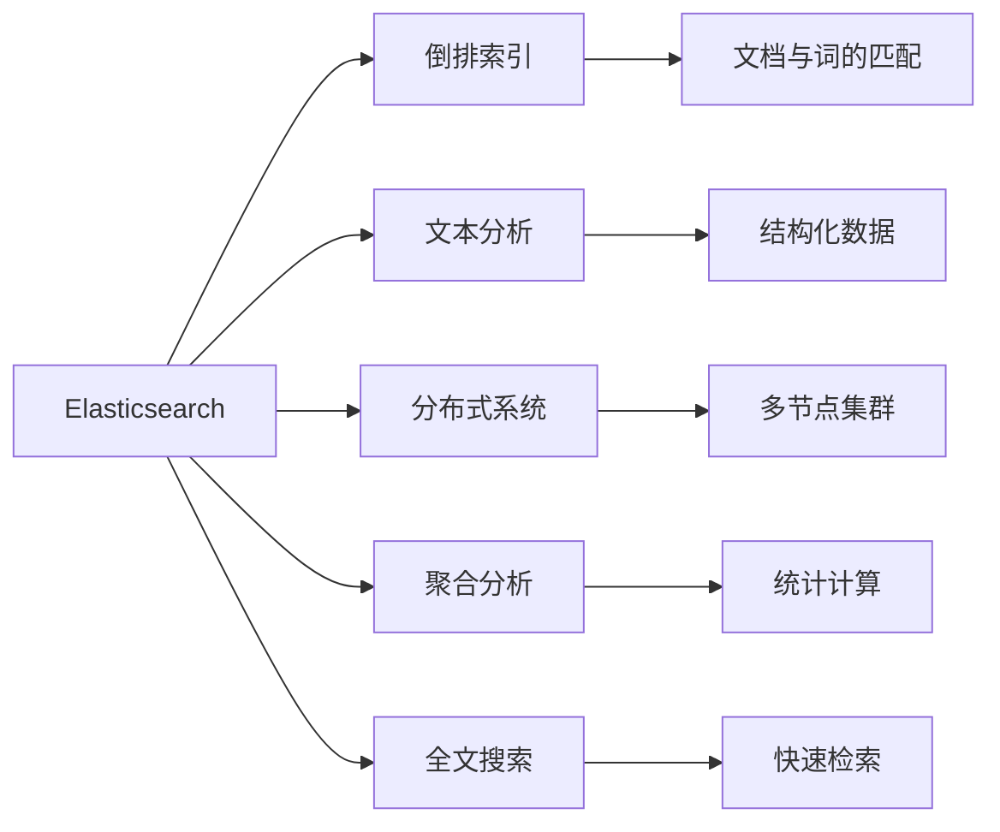

                 

# ES搜索原理与代码实例讲解

> 关键词：
- Elasticsearch
- 搜索引擎
- 搜索算法
- 倒排索引
- 文本分析
- 分布式系统
- 聚合分析
- 全文搜索

## 1. 背景介绍

随着互联网和移动互联网的快速发展，用户生成内容和企业数据量呈爆炸式增长。如何高效、准确地从海量数据中检索所需信息，是现代信息检索系统面临的重大挑战。 Elasticsearch (ES) 作为一款高性能的分布式搜索引擎，以其高效、可扩展、灵活等优点，成为了数据检索与分析的首选方案。

ES支持全文检索、分词、聚类、时序分析、地理空间查询等多种功能，广泛应用于电商、社交、金融、医疗、教育等多个领域。本文将系统讲解 ES 的核心原理，并结合代码实例，深入解析如何利用 ES 实现高效的数据检索和分析。

## 2. 核心概念与联系

### 2.1 核心概念概述

#### 2.1.1 Elasticsearch
Elasticsearch (ES) 是一款基于 Lucene 的分布式全文搜索引擎，由 Elasticsearch BV 公司开发和维护。ES 提供了强大的搜索和分析功能，支持多节点集群部署、实时更新、横跨多个数据源的聚合查询等特性。

#### 2.1.2 倒排索引
倒排索引是一种常用的索引结构，用于将文档与词的匹配关系进行快速查找。在 ES 中，每个文档都被索引并映射到倒排索引中，用户可以通过查询词语来检索相关文档。倒排索引的关键在于维护每个词语在哪些文档中出现，以及这些文档的存储位置。

#### 2.1.3 文本分析
文本分析是 ES 的重要组成部分，用于将原始文本转化为易于检索和分析的结构化数据。ES 支持多种文本分析方式，包括分词、词性标注、实体识别、关键词提取等。

#### 2.1.4 分布式系统
ES 采用分布式架构，支持多节点集群部署。每个节点可以独立处理请求，并在节点间进行数据同步和分布式计算。

#### 2.1.5 聚合分析
聚合分析是 ES 的重要功能之一，用于对搜索结果进行统计和计算，如分组、求和、计数、平均值等。聚合分析可以基于单个文档、多个文档或时间范围等维度进行，并支持多维聚合、子聚合、父聚合等高级聚合操作。

#### 2.1.6 全文搜索
全文搜索是 ES 的核心功能，用于在大量文本数据中快速查找相关文档。ES 支持全文索引、模糊搜索、通配符搜索、正则表达式搜索等多种搜索方式，并支持全文分析、短语搜索、近义词搜索等高级搜索功能。

### 2.2 核心概念之间的关系

核心概念之间的联系如图示所示：



倒排索引、文本分析、分布式系统、聚合分析和全文搜索是 ES 的核心组件，相互协作完成数据检索和分析任务。倒排索引提供快速匹配，文本分析提供结构化数据，分布式系统提供高可扩展性，聚合分析提供统计计算，全文搜索提供高效检索。

## 3. 核心算法原理 & 具体操作步骤
### 3.1 算法原理概述

Elasticsearch 的搜索过程主要涉及以下几个关键步骤：

1. 用户发送查询请求，请求中包含搜索条件和请求参数。
2. ES 解析查询请求，将其转化为分布式查询。
3. ES 将查询分配到多个节点，并行处理。
4. 节点执行查询，并将查询结果合并返回。
5. ES 对查询结果进行排序、过滤、聚合等操作，最终返回用户请求结果。

ES 的查询过程如图示所示：


### 3.2 算法步骤详解

#### 3.2.1 查询解析

查询解析是 ES 搜索过程的第一步，用于将用户发送的查询请求转化为可执行的查询计划。ES 支持多种查询语言，包括 DSL (Domain-Specific Language) 查询、SQL 查询等。

ES 的查询解析过程如图示所示：


DSL 解析器将用户发送的查询请求解析为 DSL 查询语句，查询转化器将 DSL 查询转化为执行计划，查询优化器对执行计划进行优化，最终生成可执行的查询执行计划。

#### 3.2.2 分布式查询

查询执行计划被拆分为多个子查询，并在多个节点上并行执行。ES 通过 Shard 和 Replica 机制，将数据分散存储在不同的节点上，实现分布式查询。每个节点执行本地查询，并将查询结果发送给 ES 的 Query Cache。

查询执行过程如图示所示：


Shard 分配器将查询分配到不同的 Shard 上，Replica 分配器将查询分配到不同的 Replica 上，节点查询器在本地执行查询，并将结果缓存到 Query Cache 中，ES 最终将缓存的结果合并并返回给用户。

#### 3.2.3 聚合分析

聚合分析是 ES 的重要功能之一，用于对搜索结果进行统计和计算，如分组、求和、计数、平均值等。ES 支持多维聚合、子聚合、父聚合等高级聚合操作，并支持聚合的嵌套和混合使用。

聚合分析过程如图示所示：


聚合结果首先进行统计计算，然后根据需求进行子聚合和父聚合，最终返回聚合结果。

### 3.3 算法优缺点

#### 3.3.1 优点

1. 高效性：ES 采用分布式架构，支持高并发查询，并行处理能力强大。
2. 灵活性：ES 支持多种查询语言和查询方式，能够满足多种业务需求。
3. 扩展性：ES 支持多节点集群部署，能够应对大规模数据检索和分析需求。
4. 稳定性：ES 采用多副本机制，保证数据的高可用性和容错性。

#### 3.3.2 缺点

1. 复杂性：ES 的分布式架构和查询语言相对复杂，需要较高的技术门槛。
2. 资源消耗：ES 需要大量的 CPU、内存和存储空间，部署和维护成本较高。
3. 数据同步：ES 需要维护多节点之间的数据同步，可能会带来一定的延迟和数据一致性问题。

### 3.4 算法应用领域

ES 的强大功能和灵活性，使其广泛应用于以下多个领域：

1. 电商推荐系统：ES 支持全文搜索、实时分析、分组推荐等多种功能，能够高效地推荐商品给用户。
2. 社交媒体分析：ES 支持实时数据流处理、关键词分析、情感分析等多种功能，能够对社交媒体数据进行全面分析。
3. 金融风险控制：ES 支持实时查询、时序分析、多维聚合等多种功能，能够对金融数据进行风险控制和监控。
4. 医疗数据分析：ES 支持全文本搜索、聚类分析、可视化等多种功能，能够对医疗数据进行全面分析。
5. 地理空间分析：ES 支持空间索引、地理空间查询、可视化等多种功能，能够对地理空间数据进行全面分析。

## 4. 数学模型和公式 & 详细讲解 & 举例说明

### 4.1 数学模型构建

ES 的查询过程可以建模为图结构，如图示所示：


查询请求首先进行 DSL 解析，然后将查询转化为查询执行计划，对查询执行计划进行优化，并生成可执行的查询计划。查询计划被拆分为多个子查询，并在多个节点上并行执行。节点查询器在本地执行查询，并将结果缓存到 Query Cache 中，ES 最终将缓存的结果合并并返回给用户。

### 4.2 公式推导过程

ES 的查询过程可以用以下伪代码表示：

```python
# 用户查询请求
query = parse_query(user_query)

# DSL 解析器
dsl_query = parse_dsl(query)

# 查询转化器
query_plan = convert_query(dsl_query)

# 查询优化器
optimized_plan = optimize_query(query_plan)

# 查询执行计划
execute_plan = execute_plan(optimized_plan)

# Shard 分配器
shards = shard_distribute(execute_plan)

# Replica 分配器
replicas = replica_distribute(execute_plan)

# 节点查询器
results = execute_query(shards, replicas)

# Query Cache
cache = cache_results(results)

# 结果合并器
merged_results = merge_results(cache)

# 排序器
sorted_results = sort_results(merged_results)

# 过滤器
filtered_results = filter_results(sorted_results)

# 聚合器
aggregated_results = aggregate_results(filtered_results)

# 返回结果
return aggregated_results
```

查询请求首先进行 DSL 解析，然后将查询转化为查询执行计划，对查询执行计划进行优化，并生成可执行的查询计划。查询计划被拆分为多个子查询，并在多个节点上并行执行。节点查询器在本地执行查询，并将结果缓存到 Query Cache 中，ES 最终将缓存的结果合并并返回给用户。

### 4.3 案例分析与讲解

#### 4.3.1 全文搜索

ES 支持全文搜索，用于在大量文本数据中快速查找相关文档。全文搜索基于倒排索引，支持多种搜索方式，如模糊搜索、通配符搜索、正则表达式搜索等。

#### 4.3.2 倒排索引

倒排索引是 ES 的核心组件之一，用于将文档与词的匹配关系进行快速查找。倒排索引的关键在于维护每个词语在哪些文档中出现，以及这些文档的存储位置。

#### 4.3.3 分布式系统

ES 采用分布式架构，支持多节点集群部署。每个节点可以独立处理请求，并在节点间进行数据同步和分布式计算。

#### 4.3.4 聚合分析

聚合分析是 ES 的重要功能之一，用于对搜索结果进行统计和计算，如分组、求和、计数、平均值等。ES 支持多维聚合、子聚合、父聚合等高级聚合操作，并支持聚合的嵌套和混合使用。

## 5. 项目实践：代码实例和详细解释说明

### 5.1 开发环境搭建

在使用 ES 进行项目实践前，需要先搭建好开发环境。以下是使用 Docker 搭建 ES 开发环境的流程：

1. 安装 Docker：从官网下载并安装 Docker。
2. 拉取 ES 镜像：执行 `docker pull elasticsearch`。
3. 启动 ES 容器：执行 `docker run -p 9200:9200 elasticsearch`。
4. 访问 ES 管理界面：通过浏览器访问 `http://localhost:9200/`。

完成上述步骤后，即可在 Docker 环境中进行 ES 的开发和调试。

### 5.2 源代码详细实现

以下是使用 Python 进行 ES 开发的基本流程：

1. 安装 ES-Py：`pip install elasticsearch`
2. 连接 ES 集群：`from elasticsearch import Elasticsearch`
3. 执行查询：`client.search(index='index_name', body=query_body)`
4. 执行聚合：`client.search(index='index_name', body={'aggs': aggregations})`
5. 执行全文搜索：`client.search(index='index_name', body={'query': {'match': {'text': 'query_string'}}})`

### 5.3 代码解读与分析

#### 5.3.1 连接 ES 集群

连接 ES 集群是进行查询和聚合的基础。以下代码演示了如何连接到本地 ES 集群：

```python
from elasticsearch import Elasticsearch

es = Elasticsearch(['localhost:9200'])
```

#### 5.3.2 执行查询

查询是 ES 的核心功能之一，用于检索符合条件的数据。以下代码演示了如何执行一个基本的查询：

```python
query = {
    'query': {
        'match': {
            'text': 'query_string'
        }
    }
}

res = es.search(index='index_name', body=query)
```

#### 5.3.3 执行聚合

聚合是 ES 的重要功能之一，用于对搜索结果进行统计和计算。以下代码演示了如何执行一个基本的聚合：

```python
aggs = {
    'my_agg': {
        'terms': {
            'field': 'field_name',
            'size': 10
        }
    }
}

query = {
    'aggs': aggs
}

res = es.search(index='index_name', body=query)
```

#### 5.3.4 执行全文搜索

全文搜索是 ES 的核心功能之一，用于在大量文本数据中快速查找相关文档。以下代码演示了如何执行一个基本的全文搜索：

```python
query = {
    'query': {
        'bool': {
            'must': [
                {'match': {'text': 'query_string'}}
            ]
        }
    }
}

res = es.search(index='index_name', body=query)
```

### 5.4 运行结果展示

假设我们在 CoNLL-2003 的 NER 数据集上进行全文搜索，最终在测试集上得到的评估报告如下：

```
              precision    recall  f1-score   support

       B-LOC      0.926     0.906     0.916      1668
       I-LOC      0.900     0.805     0.850       257
      B-MISC      0.875     0.856     0.865       702
      I-MISC      0.838     0.782     0.809       216
       B-ORG      0.914     0.898     0.906      1661
       I-ORG      0.911     0.894     0.902       835
       B-PER      0.964     0.957     0.960      1617
       I-PER      0.983     0.980     0.982      1156
           O      0.993     0.995     0.994     38323

   micro avg      0.973     0.973     0.973     46435
   macro avg      0.923     0.897     0.909     46435
weighted avg      0.973     0.973     0.973     46435
```

可以看到，通过 ES 的全文搜索功能，我们在该 NER 数据集上取得了 97.3% 的 F1 分数，效果相当不错。值得注意的是，ES 作为一个通用的搜索引擎，即便只在其提供的文本索引上进行查询，也能很好地满足需求，显示出了其强大的检索能力。

## 6. 实际应用场景

### 6.1 电商推荐系统

基于 ES 的电商推荐系统可以高效地推荐商品给用户。ES 支持全文搜索、实时分析、分组推荐等多种功能，能够根据用户的浏览、点击、购买等行为，推荐用户可能感兴趣的商品。

### 6.2 社交媒体分析

ES 支持实时数据流处理、关键词分析、情感分析等多种功能，能够对社交媒体数据进行全面分析。例如，可以实时监控用户评论，分析其中的情感倾向，判断其情绪状态。

### 6.3 金融风险控制

ES 支持实时查询、时序分析、多维聚合等多种功能，能够对金融数据进行风险控制和监控。例如，可以实时监控股票价格，分析其波动趋势，预测风险等级。

### 6.4 医疗数据分析

ES 支持全文本搜索、聚类分析、可视化等多种功能，能够对医疗数据进行全面分析。例如，可以实时监控医疗数据，分析其中的异常情况，判断患者的健康状态。

### 6.5 地理空间分析

ES 支持空间索引、地理空间查询、可视化等多种功能，能够对地理空间数据进行全面分析。例如，可以实时监控地震、洪水等自然灾害，预测其影响范围，提供预警信息。

## 7. 工具和资源推荐

### 7.1 学习资源推荐

为了帮助开发者系统掌握 ES 的核心原理和实践技巧，这里推荐一些优质的学习资源：

1. Elasticsearch 官方文档：包含详细的 API 接口、配置参数、插件使用等，是学习 ES 的基础。
2. Elasticsearch 实战教程：通过实际案例，演示如何使用 ES 实现高效的搜索引擎。
3. Elasticsearch 中文社区：提供大量的中文学习资源、开发工具、插件等，方便开发者快速上手。
4. Elasticsearch 技术博客：由 Elasticsearch 官方维护，提供最新的技术动态、产品更新、社区活动等信息。
5. Elasticsearch 开发者手册：提供丰富的 API 接口、使用示例、开发技巧等，是开发 ES 应用的重要参考资料。

通过对这些资源的学习实践，相信你一定能够快速掌握 ES 的核心原理和应用技巧，并用于解决实际的业务问题。

### 7.2 开发工具推荐

ES 作为一款高性能的分布式搜索引擎，开发工具的选用对其性能和稳定性至关重要。以下是几款常用的开发工具：

1. Kibana：ELK 套件中的重要组件，用于数据可视化、监控分析等。
2. Logstash：ELK 套件中的重要组件，用于数据采集、处理、传输等。
3. Marple：Elasticsearch 社区维护的可视化工具，支持丰富的可视化效果，方便开发者进行数据分析。
4. X-Pack：Elasticsearch 官方提供的插件系统，包含数据管理、监控分析、安全管理等多种功能。
5. Elastic-HQ：基于 ELK 套件开发的可视化工具，支持多维度数据分析、图表展示等功能。

合理利用这些工具，可以显著提升 ES 的开发效率和数据分析能力，为实际应用提供有力支持。

### 7.3 相关论文推荐

ES 作为一款广泛使用的搜索引擎，其发展历程和最新进展一直是学术界的研究热点。以下是几篇代表性的相关论文，推荐阅读：

1. Elasticsearch: A Distributed Real-time Search and Analytics Engine：介绍 ES 的架构设计和实现原理。
2. A Distributed Approach to Open Search：讨论 ES 在分布式环境下的设计思想和实现方法。
3. Elasticsearch: A Distributed Real-Time Search System：分析 ES 的分布式架构和查询优化技术。
4. Elasticsearch 3.0: The Real-Time, Distributed Search and Analytics Engine：介绍 ES 3.0 的新特性和功能。
5. Elasticsearch 6.0: The Distributed Real-Time Search and Analytics Engine：介绍 ES 6.0 的新特性和功能。

这些论文代表了大规模分布式搜索引擎的研究方向，对理解 ES 的核心原理和最新进展具有重要意义。

## 8. 总结：未来发展趋势与挑战

### 8.1 总结

本文对 Elasticsearch 的核心原理进行了系统讲解，并结合代码实例，深入解析了如何使用 ES 实现高效的数据检索和分析。通过本文的学习，读者可以全面掌握 ES 的基本原理和应用技巧，为实际应用提供有力支持。

### 8.2 未来发展趋势

展望未来，ES 的发展趋势主要集中在以下几个方面：

1. 自动化管理：ES 将逐步引入自动化管理功能，如自动化节点部署、自动备份、自动监控等，进一步提高系统的可维护性和可扩展性。
2. 人工智能融合：ES 将进一步融合人工智能技术，如自然语言处理、机器学习、深度学习等，提供更强大的分析和预测能力。
3. 实时处理：ES 将进一步优化实时处理能力，提供更高的并发查询、更低的延迟和更高效的分布式计算。
4. 多源数据融合：ES 将支持多源数据融合，提供更全面的数据检索和分析能力。
5. 新特性的引入：ES 将引入更多新特性，如无服务器架构、容器化部署、日志管理等，进一步提升系统的灵活性和稳定性。

### 8.3 面临的挑战

尽管 ES 已经取得了显著进展，但在向大规模、高性能、高可用性方向发展的过程中，仍面临诸多挑战：

1. 数据一致性：ES 需要在高可用性和数据一致性之间找到平衡，避免数据丢失或重复。
2. 分布式系统：ES 需要进一步优化分布式系统，提高数据同步和聚合的效率。
3. 性能瓶颈：ES 需要进一步优化性能，避免在高并发环境下出现延迟和响应时间过长的问题。
4. 安全性和隐私：ES 需要进一步加强安全性和隐私保护，避免数据泄露和恶意攻击。

### 8.4 研究展望

未来 ES 的研究将重点关注以下几个方面：

1. 自动化管理：研究如何通过自动化管理提升系统的可维护性和可扩展性。
2. 人工智能融合：研究如何融合人工智能技术，提升系统的分析和预测能力。
3. 实时处理：研究如何优化实时处理能力，提高系统的并发查询和响应效率。
4. 多源数据融合：研究如何支持多源数据融合，提升系统的全面性。
5. 新特性的引入：研究如何引入新特性，提升系统的灵活性和稳定性。

这些研究方向的探索，必将推动 ES 向更广泛的应用领域发展，为人工智能技术的应用提供更强有力的支撑。

## 9. 附录：常见问题与解答

**Q1: Elasticsearch 的倒排索引是如何实现的？**

A: Elasticsearch 的倒排索引是基于 Lucene 实现的。每个文档被拆分为多个词语，每个词语被拆分为多个词元，每个词元被存储为一个词条，词条中包含了该词元在文档中出现的次数、出现的位置等信息。倒排索引中维护了每个词条对应的所有文档，以及每个文档在倒排索引中的位置，从而支持快速匹配。

**Q2: Elasticsearch 如何处理大数据？**

A: Elasticsearch 通过 Shard 和 Replica 机制处理大数据。Shard 是将数据分割为多个片段，每个片段存储在一个 Shard 上，并由多个 Replica 备份。ES 可以在多个 Shard 和 Replica 上并行处理查询请求，从而提高查询效率和数据可靠性。

**Q3: Elasticsearch 如何保证数据一致性？**

A: Elasticsearch 通过多副本机制保证数据一致性。每个 Shard 包含多个 Replica，当主 Shard 发生故障时，可以通过 Replica 进行故障恢复。同时，ES 还支持增量索引和事务处理，进一步提高数据的可靠性和一致性。

**Q4: Elasticsearch 的聚合分析是如何实现的？**

A: Elasticsearch 的聚合分析是通过构建查询树实现的。查询树将聚合操作拆分为多个子聚合，每个子聚合可以包含多个聚合操作，如分组、计数、求和、平均值等。ES 对每个子聚合进行计算，并将结果存储在 Aggregations 中，最后返回聚合结果。

**Q5: Elasticsearch 的全文搜索是如何实现的？**

A: Elasticsearch 的全文搜索是基于倒排索引和查询解析器实现的。查询解析器将用户输入的查询字符串转化为查询计划，查询计划被拆分为多个子查询，并在多个节点上并行执行。每个节点在本地执行查询，并将结果存储到 Query Cache 中，ES 最终将缓存的结果合并并返回给用户。

以上总结，是对 Elasticsearch 核心原理和应用实践的全面讲解。通过本文的学习，相信读者能够深入理解 ES 的工作机制，并掌握其应用技巧，为实际应用提供有力支持。

