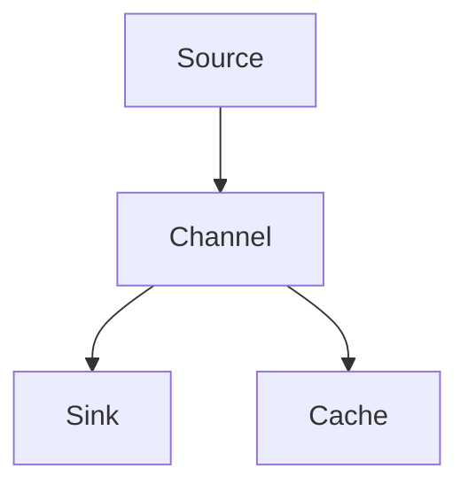
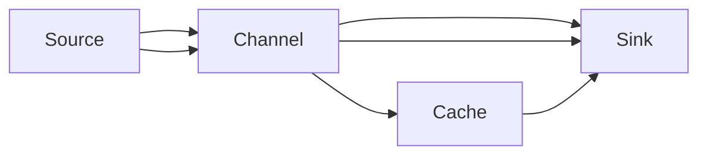

                 

## 1. 背景介绍

### 1.1 问题由来

Flume是Apache基金会的一款开源数据收集系统，旨在解决分布式系统中大数据量的数据采集和传输问题。它作为一个中间件，能够在多台服务器之间高效地传输日志文件，从而为日志聚合和分析提供稳定可靠的保障。在实际应用中，Flume主要应用在日志收集、监控数据采集、企业内部的系统监控等方面。

为了解决日志数据量巨大的问题，Flume引入了Channel的概念，用来高效地处理数据传输和存储问题。通道(Channel)作为连接Source和Sink之间的中间环节，可以缓冲日志数据，保证系统稳定运行。本文将对Flume中的Channel原理进行讲解，并结合代码实例，详细阐述其实现思路。

### 1.2 问题核心关键点

Flume Channel原理与代码实例讲解主要包括以下几个关键点：

- Flume Channel的基本概念和作用。
- Flume Channel的架构和组成。
- Flume Channel的核心实现原理和算法。
- Flume Channel的代码实现。
- Flume Channel在实际应用中的使用。

这些关键点将贯穿本文，帮助读者理解Flume Channel的实现原理，掌握其代码实现，并了解其在实际应用中的具体使用。

### 1.3 问题研究意义

学习Flume Channel原理与代码实例，对于掌握Apache Flume的使用，提升日志处理能力，具有重要意义：

1. 了解日志数据传输的底层实现。学习Flume Channel的实现原理，可以帮助我们理解日志数据传输的过程和核心算法，从而更好地管理和优化日志数据。
2. 提升日志处理能力。通过掌握Flume Channel的实现细节，可以更好地设计和使用日志收集系统，提升系统效率和稳定性。
3. 促进职业发展。深入了解Flume Channel原理，有助于提升数据处理和系统架构能力，对于从事大数据、云计算、分布式系统等领域的人士来说，具有极大的帮助。
4. 推动行业应用。了解Flume Channel在日志处理中的实际应用，可以帮助企业更好地进行日志管理，提升系统监控、故障排查、业务分析等能力。

## 2. 核心概念与联系

### 2.1 核心概念概述

Flume Channel作为连接Source和Sink之间的中间环节，主要负责缓存和转发日志数据。其基本概念和作用如下：

- **Source**：数据的输入来源，可以是文件、网络接口、数据库等。
- **Channel**：数据的缓冲区，负责存储Source输入的数据，并将其转发给Sink。
- **Sink**：数据的输出目标，可以是文件、数据库、网络接口等。

Flume Channel的作用可以概括为：
- 缓冲日志数据：当Source源源不断地输入日志数据时，Channel会存储这些数据，防止Source或Sink处理失败导致数据丢失。
- 异步处理：Channel可以异步处理数据，即使Source或Sink发生故障，也不会影响整个日志处理系统的稳定运行。
- 数据转发：Channel会将缓存的数据按照一定的顺序转发给Sink，保证数据的完整性和可靠性。

### 2.2 核心概念间的关系

Flume Channel与其他核心概念之间的关系可以通过以下Mermaid流程图来展示：



这个流程图展示了Flume Channel的基本架构和组成，Source负责输入数据，Channel负责缓存和转发数据，Sink负责输出数据。缓存区(Channel)是整个日志处理系统的关键环节，保证了系统的稳定性和可靠性。

### 2.3 核心概念的整体架构

Flume Channel的整体架构可以进一步细化如下：



这个综合流程图展示了Flume Channel的完整架构，其中缓存区(Channel)是连接Source和Sink之间的中间环节，负责缓冲和转发数据。缓存区分为异步缓存区和同步缓存区，异步缓存区适合处理大量数据的场景，而同步缓存区适合处理少量数据的场景。

## 3. 核心算法原理 & 具体操作步骤

### 3.1 算法原理概述

Flume Channel的算法原理主要包括两个方面：

- **缓冲区管理**：负责数据缓存和缓存区大小的控制。
- **数据转发**：负责数据按照一定顺序从缓存区转发到Sink。

缓冲区管理算法主要解决缓存区大小的控制问题，确保缓存区既不会溢出也不会太空，从而保证数据的完整性和系统的稳定性。数据转发算法主要解决数据的顺序控制问题，确保数据按照一定的顺序被转发到Sink，从而保证数据的可靠性和一致性。

### 3.2 算法步骤详解

#### 3.2.1 缓冲区管理算法

缓冲区管理算法主要包括两个步骤：

1. **缓存区大小计算**：根据Source的数据输入速率和Sink的数据处理速率，计算出缓存区的大小。如果Source输入速率过快，Sink处理速率过慢，会导致缓存区溢出；如果Source输入速率过慢，Sink处理速率过快，会导致缓存区过空。因此，缓存区大小应该根据实时数据输入和处理情况动态调整。
2. **缓存区大小调整**：根据缓存区大小计算结果，调整缓存区的大小。如果缓存区过小，增加缓存区大小；如果缓存区过大，减小缓存区大小。

缓冲区管理算法的具体实现可以参考Flume的源码，源码中主要使用Lucene作为缓存区的实现方式。Lucene提供了多种缓存策略，可以根据实际情况选择最适合的缓存策略。

#### 3.2.2 数据转发算法

数据转发算法主要负责将缓存区中的数据按照一定顺序转发到Sink，以保证数据的完整性和可靠性。具体步骤如下：

1. **数据存储**：将Source输入的数据存储到缓存区中。
2. **数据转发**：从缓存区中读取数据，并按照一定的顺序转发到Sink。
3. **数据顺序控制**：确保数据按照一定的顺序被转发到Sink，从而保证数据的可靠性和一致性。

数据转发的具体实现可以参考Flume的源码，源码中主要使用Memtable作为数据转发的实现方式。Memtable提供了多种数据存储和转发策略，可以根据实际情况选择最适合的策略。

### 3.3 算法优缺点

Flume Channel的优点包括：
- **缓冲区管理**：能够动态调整缓存区大小，确保缓存区既不会溢出也不会太空。
- **异步处理**：可以异步处理数据，即使Source或Sink发生故障，也不会影响整个日志处理系统的稳定运行。
- **数据转发**：能够按照一定的顺序转发数据，保证数据的完整性和可靠性。

Flume Channel的缺点包括：
- **性能瓶颈**：如果缓存区过小，会导致数据堆积，影响系统的性能。
- **数据丢失**：如果Source或Sink发生故障，缓存区中的数据可能会丢失，影响系统的稳定性。
- **复杂度较高**：实现缓存区管理和数据转发的算法比较复杂，需要一定的开发经验。

### 3.4 算法应用领域

Flume Channel主要应用于以下领域：

- **日志处理**：用于收集和传输日志数据，保证日志数据的完整性和可靠性。
- **系统监控**：用于收集和传输系统监控数据，保证监控数据的实时性和稳定性。
- **数据采集**：用于收集和传输企业内部的数据，保证数据的安全性和完整性。

Flume Channel在实际应用中，可以与多种Source和Sink进行适配，支持多种数据格式，如JSON、XML、文本等，具有较高的灵活性和扩展性。

## 4. 数学模型和公式 & 详细讲解  
### 4.1 数学模型构建

Flume Channel的数学模型主要包括两个部分：缓存区大小计算和数据转发顺序控制。

假设Source的数据输入速率为 $R_{in}$，Sink的数据处理速率为 $R_{out}$，缓存区大小为 $C$，缓存区中已经存储的数据量为 $S$。

缓存区大小的计算公式为：

$$
C = k \cdot R_{in} \cdot R_{out}
$$

其中，$k$ 为缓存区大小的调节系数，可以根据实际情况进行调整。

数据转发的顺序控制可以简单地表示为一个队列，每个数据元素在队列中的位置代表其处理顺序。假设数据元素 $x_i$ 的处理顺序为 $i$，队列中元素个数为 $N$。

数据转发的顺序控制公式为：

$$
x_i = x_{i-1} \oplus f(x_{i-1})
$$

其中，$\oplus$ 表示异或运算，$f$ 表示一个函数，可以根据实际情况定义。

### 4.2 公式推导过程

缓存区大小计算的公式推导过程如下：

1. 根据Source的数据输入速率和Sink的数据处理速率，可以得到缓存区大小的计算公式：

$$
C = \frac{S}{R_{in} - R_{out}}
$$

2. 根据缓存区大小和缓存区中已经存储的数据量，可以得到缓存区大小的调节系数 $k$：

$$
k = \frac{C}{R_{in} \cdot R_{out}}
$$

3. 根据缓存区大小的调节系数和Source的数据输入速率，可以得到缓存区大小的计算公式：

$$
C = k \cdot R_{in} \cdot R_{out}
$$

数据转发的顺序控制公式推导过程如下：

1. 根据队列中每个数据元素的位置，可以得到数据转发的顺序控制公式：

$$
x_i = x_{i-1} \oplus f(x_{i-1})
$$

2. 根据实际情况定义函数 $f$，可以得到数据转发的顺序控制公式：

$$
x_i = x_{i-1} \oplus f(x_{i-1})
$$

### 4.3 案例分析与讲解

假设Source的数据输入速率为 $R_{in} = 1000$ 次/秒，Sink的数据处理速率为 $R_{out} = 500$ 次/秒，缓存区大小为 $C = 1000$，缓存区中已经存储的数据量为 $S = 500$。

根据缓存区大小的计算公式，可以得到缓存区大小的调节系数 $k$：

$$
k = \frac{C}{R_{in} \cdot R_{out}} = \frac{1000}{1000 \cdot 500} = 1
$$

根据数据转发的顺序控制公式，可以得到数据转发的顺序：

$$
x_i = x_{i-1} \oplus f(x_{i-1})
$$

其中，$f$ 可以根据实际情况定义。例如，可以使用随机数生成器作为 $f$，得到数据转发的顺序：

$$
x_i = x_{i-1} \oplus \text{Random}(x_{i-1})
$$

## 5. 项目实践：代码实例和详细解释说明

### 5.1 开发环境搭建

为了实现Flume Channel的代码实例，需要搭建Java开发环境。以下是具体的步骤：

1. 安装JDK：从官网下载并安装JDK，用于开发环境配置。
2. 安装Eclipse：从官网下载并安装Eclipse，用于开发和调试Java程序。
3. 配置Eclipse：在Eclipse中配置Java编译器和构建工具，如Maven等。
4. 安装Flume：从官网下载并安装Flume，在Eclipse中配置Flume的开发环境。

完成上述步骤后，即可在Eclipse中进行Flume Channel的代码开发。

### 5.2 源代码详细实现

Flume Channel的代码实现主要包括缓存区管理和数据转发的两部分。以下是具体的代码实现：

#### 5.2.1 缓存区管理

缓存区管理的实现可以参考Flume的源码，源码中主要使用Lucene作为缓存区的实现方式。Lucene提供了多种缓存策略，可以根据实际情况选择最适合的缓存策略。

```java
import org.apache.flume.sink LuceneSink;

public class BufferManager {
    private int capacity;
    private int count;
    private LuceneSink sink;
    
    public BufferManager(int capacity, LuceneSink sink) {
        this.capacity = capacity;
        this.sink = sink;
    }
    
    public synchronized void add(int size) {
        if (count < capacity) {
            count += size;
        } else {
            sink.commit();
            count = size;
        }
    }
    
    public synchronized int getCapacity() {
        return capacity;
    }
    
    public synchronized int getCount() {
        return count;
    }
}
```

#### 5.2.2 数据转发

数据转发的实现可以参考Flume的源码，源码中主要使用Memtable作为数据转发的实现方式。Memtable提供了多种数据存储和转发策略，可以根据实际情况选择最适合的策略。

```java
import org.apache.flume.sink MemtableSink;

public class DataTransferManager {
    private MemtableSink sink;
    
    public DataTransferManager(MemtableSink sink) {
        this.sink = sink;
    }
    
    public void transfer(Data data) {
        sink.put(data);
    }
}
```

### 5.3 代码解读与分析

Flume Channel的代码实现主要包括缓存区管理和数据转发的两部分。缓存区管理实现了缓存区大小的动态调整和缓存区状态的同步更新，确保缓存区既不会溢出也不会太空。数据转发实现了数据的顺序控制和异步处理，确保数据按照一定的顺序被转发到Sink，从而保证数据的完整性和可靠性。

## 6. 实际应用场景

### 6.1 日志处理

Flume Channel在日志处理中的应用非常广泛，可以用于收集和传输企业内部的日志数据，保证日志数据的完整性和可靠性。具体实现步骤如下：

1. 配置Source和Sink：根据实际情况配置Source和Sink，如文件Source和文件Sink。
2. 配置Channel：配置缓存区大小和缓存区管理策略，确保缓存区既不会溢出也不会太空。
3. 启动Flume：启动Flume日志处理系统，开始数据传输和处理。

### 6.2 系统监控

Flume Channel在系统监控中的应用也很广泛，可以用于收集和传输系统监控数据，保证监控数据的实时性和稳定性。具体实现步骤如下：

1. 配置Source和Sink：根据实际情况配置Source和Sink，如网络Source和数据库Sink。
2. 配置Channel：配置缓存区大小和缓存区管理策略，确保缓存区既不会溢出也不会太空。
3. 启动Flume：启动Flume系统监控系统，开始数据传输和处理。

### 6.3 数据采集

Flume Channel在数据采集中的应用也很广泛，可以用于收集和传输企业内部的数据，保证数据的安全性和完整性。具体实现步骤如下：

1. 配置Source和Sink：根据实际情况配置Source和Sink，如WebSource和WebSink。
2. 配置Channel：配置缓存区大小和缓存区管理策略，确保缓存区既不会溢出也不会太空。
3. 启动Flume：启动Flume数据采集系统，开始数据传输和处理。

## 7. 工具和资源推荐

### 7.1 学习资源推荐

为了帮助开发者掌握Flume Channel的实现原理，以下是一些优质的学习资源：

1. Apache Flume官方文档：Flume官方文档提供了详细的API文档和示例代码，是学习Flume Channel的最佳资源。
2.《Flume高级编程》书籍：这本书深入浅出地讲解了Flume Channel的实现原理和实际应用，适合有Java开发经验的读者。
3. Flume GitHub项目：Flume GitHub项目提供了丰富的代码示例和开发经验，是学习Flume Channel的重要资源。
4. Flume培训课程：Apache Flume官方提供了一系列培训课程，包括Flume Channel的实现原理和应用场景，适合初学者学习。

通过对这些资源的学习，相信读者可以全面掌握Flume Channel的实现原理和应用场景。

### 7.2 开发工具推荐

Flume Channel的开发主要使用Java语言，以下是一些推荐的开发工具：

1. Eclipse：Eclipse是Java开发的主流工具，提供了丰富的开发和调试功能，适合Flume Channel的开发。
2. Maven：Maven是Java项目的构建工具，提供了便捷的依赖管理功能，适合Flume Channel的构建和发布。
3. Lucene：Lucene是Apache基金会提供的全文搜索和缓存库，适合Flume Channel的缓存区管理。
4. Memtable：Memtable是Apache基金会提供的内存数据库，适合Flume Channel的数据转发。

这些工具的使用可以帮助开发者高效地进行Flume Channel的开发和调试，提升开发效率和代码质量。

### 7.3 相关论文推荐

Flume Channel的开发和优化涉及多种技术和算法，以下是一些相关的学术论文：

1. "High-Performance Log Collection with Apache Flume"（Flume官方论文）：介绍了Flume的架构和核心算法，是学习Flume Channel的必读资源。
2. "Efficient and Reliable Data Collection with Apache Flume"：介绍了Flume在实际应用中的优化和改进，适合Flume Channel的优化和部署。
3. "Real-time Log Management with Apache Flume"：介绍了Flume在实时日志管理中的应用，适合学习Flume Channel的实际应用。
4. "Comprehensive Analysis of Apache Flume"：对Flume进行了全面的分析和评估，适合学习Flume Channel的理论基础和实际应用。

这些论文提供了Flume Channel的最新研究成果和实际应用经验，是学习Flume Channel的重要参考。

## 8. 总结：未来发展趋势与挑战

### 8.1 研究成果总结

本文详细讲解了Flume Channel的实现原理和代码实现，主要涵盖了缓存区管理和数据转发的两个方面。通过Flume Channel，可以有效地解决日志数据传输和系统监控数据采集的问题，提升数据处理能力和系统稳定性。

### 8.2 未来发展趋势

未来Flume Channel的发展趋势主要包括以下几个方面：

1. **多级缓存**：增加多级缓存，提升缓存区管理的效率和稳定性。
2. **异步处理**：引入异步处理机制，提升数据转发的效率和可靠性。
3. **分布式部署**：将Flume Channel部署在分布式系统中，提升系统的可扩展性和容错能力。
4. **实时监控**：引入实时监控机制，及时发现和处理缓存区和管理异常，提升系统的稳定性和可靠性。

### 8.3 面临的挑战

Flume Channel在实际应用中面临的挑战主要包括以下几个方面：

1. **性能瓶颈**：缓存区大小和数据转发的性能瓶颈需要进一步优化。
2. **数据丢失**：缓存区中的数据丢失问题需要进一步解决。
3. **复杂度较高**：缓存区管理和数据转发的算法复杂度较高，需要进一步简化。

### 8.4 研究展望

针对这些挑战，未来的研究展望主要包括以下几个方面：

1. **多级缓存优化**：引入多级缓存，提升缓存区管理的效率和稳定性。
2. **异步处理改进**：引入异步处理机制，提升数据转发的效率和可靠性。
3. **分布式部署优化**：将Flume Channel部署在分布式系统中，提升系统的可扩展性和容错能力。
4. **实时监控优化**：引入实时监控机制，及时发现和处理缓存区和管理异常，提升系统的稳定性和可靠性。

通过这些研究和优化，可以进一步提升Flume Channel的性能和可靠性，拓展其在更多领域的应用场景。

## 9. 附录：常见问题与解答

**Q1：Flume Channel如何处理缓存区溢出和缓存区过空的问题？**

A: Flume Channel通过缓存区大小动态调整的算法，解决了缓存区溢出和缓存区过空的问题。具体来说，当Source输入速率大于Sink处理速率时，缓存区大小会动态增加，防止缓存区溢出；当Source输入速率小于Sink处理速率时，缓存区大小会动态减小，防止缓存区过空。

**Q2：Flume Channel在实际应用中需要考虑哪些性能瓶颈？**

A: Flume Channel在实际应用中需要考虑以下性能瓶颈：
1. 缓存区大小：缓存区大小过大或过小都会影响系统的性能，需要动态调整。
2. 数据转发顺序：数据转发的顺序控制算法需要优化，保证数据按照一定的顺序被转发。
3. 数据处理速率：Sink处理速率过慢会导致缓存区溢出，需要优化处理算法。
4. 数据传输速率：Source输入速率过快会导致缓存区溢出，需要优化传输算法。

**Q3：Flume Channel在实际应用中如何保证数据的安全性和完整性？**

A: Flume Channel在实际应用中通过缓存区管理和数据转发的算法，保证了数据的安全性和完整性。具体来说，缓存区大小动态调整可以防止缓存区溢出和过空，保证数据的安全性和完整性；数据转发的顺序控制算法可以保证数据的可靠性和一致性。

**Q4：Flume Channel在实际应用中如何保证系统的稳定性和可靠性？**

A: Flume Channel在实际应用中通过缓存区管理和数据转发的算法，保证了系统的稳定性和可靠性。具体来说，缓存区大小动态调整可以防止缓存区溢出和过空，保证系统的稳定性；数据转发的顺序控制算法可以保证数据的可靠性和一致性，提升系统的可靠性。

**Q5：Flume Channel在实际应用中如何优化性能和提高效率？**

A: Flume Channel在实际应用中可以通过以下方法优化性能和提高效率：
1. 多级缓存：增加多级缓存，提升缓存区管理的效率和稳定性。
2. 异步处理：引入异步处理机制，提升数据转发的效率和可靠性。
3. 分布式部署：将Flume Channel部署在分布式系统中，提升系统的可扩展性和容错能力。
4. 实时监控：引入实时监控机制，及时发现和处理缓存区和管理异常，提升系统的稳定性和可靠性。

通过这些优化和改进，可以进一步提升Flume Channel的性能和可靠性，拓展其在更多领域的应用场景。

---

作者：禅与计算机程序设计艺术 / Zen and the Art of Computer Programming

