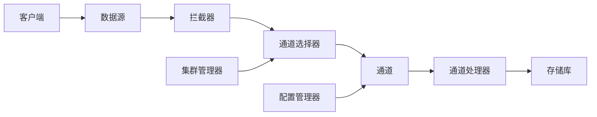

                 

# Flume原理与代码实例讲解

> 关键词：Flume, 日志系统, 实时数据采集, 高可用性, 高扩展性, 多数据源处理

## 1. 背景介绍

### 1.1 问题由来
在现代互联网应用中，大量的数据需要在不同的系统之间进行流动，其中最常见的就是日志数据。日志系统不仅用于记录应用运行时的信息，还常常用于监控、异常分析、性能优化等多个方面。因此，构建一个高效、稳定、可扩展的日志系统变得尤为重要。

Flume是一个由Apache基金会开发的分布式日志系统，可以处理高吞吐量的、大量并发产生的数据，并支持从多数据源中收集日志。Flume的设计目标是实现可扩展性、高可用性和可定制性，能够满足各种大型分布式系统中的日志收集需求。

### 1.2 问题核心关键点
Flume的核心设计原则包括：
1. **高可用性**：通过多节点部署和数据复制机制，保证系统在高负载下的稳定性和可用性。
2. **高扩展性**：支持多节点、多通道的数据采集和处理，可以轻松应对大规模数据流。
3. **高定制性**：支持多种数据源和数据格式，能够适应各种异构环境。
4. **实时性**：采用流式处理机制，可以实时采集和处理日志数据，满足高实时性需求。

这些关键点使得Flume成为了处理大规模日志数据的首选工具，广泛应用于各种分布式系统中。

## 2. 核心概念与联系

### 2.1 核心概念概述

为了更好地理解Flume的设计原理和实现细节，本节将介绍几个关键概念：

- **日志**：记录应用程序或系统运行时的状态、事件、错误等信息的数据。日志分为标准输出、错误日志、应用程序日志等。
- **数据源**：日志数据产生的源头，可以是文件、数据库、网络等。
- **通道**：日志数据的传输通道，用于连接数据源和目标存储系统。
- **拦截器**：对日志数据进行过滤、转换、压缩等预处理操作的组件。
- **存储库**：存储日志数据的最终目标，可以是数据库、HDFS等。
- **通道处理器**：处理日志数据的组件，可以实现数据分发、过滤、格式化等操作。
- **通道选择器**：根据配置自动选择通道处理器，确保日志数据被正确处理。

这些概念构成了Flume的核心设计架构，通过这些组件的协同工作，Flume能够实现高效、可靠、可扩展的日志收集和处理。

### 2.2 概念间的关系

Flume的设计架构可以通过以下Mermaid流程图来展示：


这个流程图展示了Flume的基本数据流向：
1. 数据源生成的日志数据首先通过拦截器进行预处理。
2. 拦截器将处理后的日志数据传递给通道选择器。
3. 通道选择器根据配置自动选择相应的通道处理器。
4. 通道处理器对日志数据进行分发、过滤、格式化等操作。
5. 最后，日志数据被传输到存储库进行存储。

Flume的这种模块化设计使得系统非常灵活，可以根据实际需求添加或修改各个组件，实现高度定制化的日志收集和处理。

### 2.3 核心概念的整体架构

Flume的整体架构可以通过以下Mermaid流程图来展示：



这个综合流程图展示了Flume系统的各个组件及其关系：
1. 数据源产生的日志数据首先通过拦截器进行预处理。
2. 拦截器将处理后的日志数据传递给通道选择器。
3. 通道选择器根据配置自动选择相应的通道处理器。
4. 通道处理器对日志数据进行分发、过滤、格式化等操作。
5. 最后，日志数据被传输到存储库进行存储。
6. 集群管理器负责监控和管理整个集群，确保系统的稳定运行。
7. 配置管理器管理系统的配置信息，确保配置一致性和可靠性。
8. 客户端负责与数据源进行交互，收集日志数据。

通过这些组件的协同工作，Flume能够实现高效、可靠、可扩展的日志收集和处理。

## 3. 核心算法原理 & 具体操作步骤
### 3.1 算法原理概述

Flume的核心算法原理基于事件驱动的流式处理机制。日志数据被视为一个个独立的事件，系统通过事件驱动的方式，将事件从数据源传输到存储库，实现实时数据收集和处理。

具体来说，Flume的流式处理机制包括：
1. **事件生成**：数据源生成日志事件，并将其传递给拦截器。
2. **事件过滤**：拦截器对日志事件进行过滤和预处理，去除无用或错误的事件。
3. **事件传输**：通道选择器根据配置选择相应的通道处理器，将事件传输到存储库。
4. **事件存储**：存储库将事件存储到目标数据存储系统，如HDFS、MySQL等。

整个处理过程是一个连续的、事件驱动的流式过程，可以高效地处理大量并发产生的日志数据。

### 3.2 算法步骤详解

Flume的实际操作步骤包括以下几个关键步骤：

**Step 1: 配置管理**
- 通过配置管理器指定系统的配置信息，包括数据源、拦截器、通道、存储库等组件的配置。
- 配置管理器提供了一个简单的XML配置文件，用于描述整个系统的配置信息。

**Step 2: 数据源配置**
- 配置数据源组件，指定日志数据的来源，如文件、网络、数据库等。
- 数据源组件支持多种数据格式，如CSV、JSON、XML等。

**Step 3: 拦截器配置**
- 配置拦截器组件，对日志数据进行预处理操作，如过滤、压缩、转换等。
- 拦截器可以自定义，支持多种数据处理逻辑。

**Step 4: 通道配置**
- 配置通道组件，指定日志数据传输的通道，如内存、磁盘、网络等。
- 通道可以自定义，支持多种数据传输方式。

**Step 5: 通道处理器配置**
- 配置通道处理器组件，对日志数据进行分发、过滤、格式化等操作。
- 通道处理器可以自定义，支持多种数据处理逻辑。

**Step 6: 存储库配置**
- 配置存储库组件，指定日志数据存储的目标系统，如HDFS、MySQL等。
- 存储库可以自定义，支持多种数据存储方式。

**Step 7: 启动集群管理器**
- 启动集群管理器，监控和管理整个集群，确保系统的稳定运行。
- 集群管理器提供了一个集中的监控和管理界面，可以方便地查看系统状态和性能指标。

**Step 8: 启动配置管理器**
- 启动配置管理器，管理系统的配置信息，确保配置一致性和可靠性。
- 配置管理器支持动态配置修改，可以在运行时进行配置更新。

**Step 9: 启动客户端**
- 启动客户端，与数据源进行交互，收集日志数据。
- 客户端支持多种数据源类型，可以轻松适应各种异构环境。

完成以上步骤后，Flume系统即可开始运行，实现对数据源的实时数据收集和处理。

### 3.3 算法优缺点

Flume作为一款高性能的分布式日志系统，具有以下优点：
1. **高可用性**：通过多节点部署和数据复制机制，保证系统在高负载下的稳定性和可用性。
2. **高扩展性**：支持多节点、多通道的数据采集和处理，可以轻松应对大规模数据流。
3. **高定制性**：支持多种数据源和数据格式，能够适应各种异构环境。
4. **实时性**：采用流式处理机制，可以实时采集和处理日志数据，满足高实时性需求。

同时，Flume也存在一些局限性：
1. **复杂性**：配置和管理相对复杂，需要一定的技术背景。
2. **性能瓶颈**：在极端高负载下，系统可能会出现性能瓶颈，需要优化配置和硬件资源。
3. **扩展性**：虽然支持高扩展性，但在某些场景下，扩展性可能不够灵活，需要额外考虑。

尽管存在这些局限性，Flume仍然是一款非常优秀的日志系统，广泛应用于各种大规模分布式系统中。

### 3.4 算法应用领域

Flume的核心算法原理和具体操作步骤在实际应用中具有广泛的适用性，广泛应用于以下几个领域：

- **日志收集**：在各种分布式系统中，如Hadoop、Spark等，收集和处理日志数据。
- **异常监控**：在各种在线服务中，监控系统运行状态，及时发现和解决异常问题。
- **性能优化**：在各种应用程序中，通过分析日志数据，优化系统性能。
- **安全审计**：在各种敏感系统中，记录和审计用户操作，保障系统安全。

除了上述领域，Flume还被广泛应用于各种大型分布式系统中，成为构建高可用、高扩展、高实时性的日志系统的首选工具。

## 4. 数学模型和公式 & 详细讲解 & 举例说明

### 4.1 数学模型构建

Flume的核心算法原理是基于事件驱动的流式处理机制。日志数据被视为一个个独立的事件，系统通过事件驱动的方式，将事件从数据源传输到存储库，实现实时数据收集和处理。

形式化地，假设数据源产生的日志事件为 $E$，拦截器为 $F$，通道选择器为 $S$，通道处理器为 $P$，存储库为 $R$。则Flume的数据流向可以表示为：

$$
E \xrightarrow{F} S \xrightarrow{P} R
$$

其中，$F$、$S$、$P$ 分别表示拦截器、通道选择器和通道处理器，$R$ 表示存储库。

### 4.2 公式推导过程

以一个简单的日志收集流程为例，推导Flume的核心公式。假设数据源为文件系统，拦截器为CSV拦截器，通道为网络通道，通道处理器为JSON格式化器，存储库为MySQL数据库。

1. **事件生成**：数据源生成日志事件，并将其传递给CSV拦截器。
2. **事件过滤**：CSV拦截器对日志事件进行过滤和预处理，去除无用或错误的事件。
3. **事件传输**：网络通道选择器根据配置选择相应的JSON格式化器。
4. **事件存储**：JSON格式化器对日志事件进行格式化处理，最终将事件存储到MySQL数据库。

数学公式可以表示为：

$$
\begin{aligned}
& E_{file} \rightarrow F_{CSV} \rightarrow S_{network} \rightarrow P_{JSON} \rightarrow R_{MySQL} \\
& E_{file} = \text{读取文件系统中的日志事件} \\
& F_{CSV} = \text{CSV拦截器对日志事件进行预处理} \\
& S_{network} = \text{网络通道选择器选择JSON格式化器} \\
& P_{JSON} = \text{JSON格式化器对日志事件进行格式化处理} \\
& R_{MySQL} = \text{MySQL数据库存储日志事件}
\end{aligned}
$$

### 4.3 案例分析与讲解

以一个实际的日志收集案例为例，展示Flume的配置和管理过程。

假设我们需要在一个大规模分布式系统中收集应用程序的日志数据，并将其存储到HDFS中。

**Step 1: 配置管理**
- 创建Flume的配置文件，指定数据源、拦截器、通道、存储库等组件的配置。
- 配置文件示例：

```xml
<configuration>
  <configgroup>
    <property>
      <name>fs.defaultFS</name>
      <value>hdfs://${hdfs-namenode:localhost:9000}</value>
    </property>
    <property>
      <name>log.sources</name>
      <value>${log-source-1:file:${log-source-file:/user/local/app.log}}</value>
    </property>
    <property>
      <name>log.interceptors</name>
      <value>${log-interceptor-1:csv:header+,$1,$2,$3,$4,$5,$6,$7,$8,$9,$10,$11,$12,$13,$14,$15,$16,$17,$18,$19,$20,$21,$22,$23,$24,$25,$26,$27,$28,$29,$30,$31,$32,$33,$34,$35,$36,$37,$38,$39,$40,$41,$42,$43,$44,$45,$46,$47,$48,$49,$50,$51,$52,$53,$54,$55,$56,$57,$58,$59,$60,$61,$62,$63,$64,$65,$66,$67,$68,$69,$70,$71,$72,$73,$74,$75,$76,$77,$78,$79,$80,$81,$82,$83,$84,$85,$86,$87,$88,$89,$90,$91,$92,$93,$94,$95,$96,$97,$98,$99,$100,$101,$102,$103,$104,$105,$106,$107,$108,$109,$110,$111,$112,$113,$114,$115,$116,$117,$118,$119,$120,$121,$122,$123,$124,$125,$126,$127,$128,$129,$130,$131,$132,$133,$134,$135,$136,$137,$138,$139,$140,$141,$142,$143,$144,$145,$146,$147,$148,$149,$150,$151,$152,$153,$154,$155,$156,$157,$158,$159,$160,$161,$162,$163,$164,$165,$166,$167,$168,$169,$170,$171,$172,$173,$174,$175,$176,$177,$178,$179,$180,$181,$182,$183,$184,$185,$186,$187,$188,$189,$190,$191,$192,$193,$194,$195,$196,$197,$198,$199,$200,$201,$202,$203,$204,$205,$206,$207,$208,$209,$210,$211,$212,$213,$214,$215,$216,$217,$218,$219,$220,$221,$222,$223,$224,$225,$226,$227,$228,$229,$230,$231,$232,$233,$234,$235,$236,$237,$238,$239,$240,$241,$242,$243,$244,$245,$246,$247,$248,$249,$250,$251,$252,$253,$254,$255,$256,$257,$258,$259,$260,$261,$262,$263,$264,$265,$266,$267,$268,$269,$270,$271,$272,$273,$274,$275,$276,$277,$278,$279,$280,$281,$282,$283,$284,$285,$286,$287,$288,$289,$290,$291,$292,$293,$294,$295,$296,$297,$298,$299,$300,$301,$302,$303,$304,$305,$306,$307,$308,$309,$310,$311,$312,$313,$314,$315,$316,$317,$318,$319,$320,$321,$322,$323,$324,$325,$326,$327,$328,$329,$330,$331,$332,$333,$334,$335,$336,$337,$338,$339,$340,$341,$342,$343,$344,$345,$346,$347,$348,$349,$350,$351,$352,$353,$354,$355,$356,$357,$358,$359,$360,$361,$362,$363,$364,$365,$366,$367,$368,$369,$370,$371,$372,$373,$374,$375,$376,$377,$378,$379,$380,$381,$382,$383,$384,$385,$386,$387,$388,$389,$390,$391,$392,$393,$394,$395,$396,$397,$398,$399,$400,$401,$402,$403,$404,$405,$406,$407,$408,$409,$410,$411,$412,$413,$414,$415,$416,$417,$418,$419,$420,$421,$422,$423,$424,$425,$426,$427,$428,$429,$430,$431,$432,$433,$434,$435,$436,$437,$438,$439,$440,$441,$442,$443,$444,$445,$446,$447,$448,$449,$450,$451,$452,$453,$454,$455,$456,$457,$458,$459,$460,$461,$462,$463,$464,$465,$466,$467,$468,$469,$470,$471,$472,$473,$474,$475,$476,$477,$478,$479,$480,$481,$482,$483,$484,$485,$486,$487,$488,$489,$490,$491,$492,$493,$494,$495,$496,$497,$498,$499,$500,$501,$502,$503,$504,$505,$506,$507,$508,$509,$510,$511,$512,$513,$514,$515,$516,$517,$518,$519,$520,$521,$522,$523,$524,$525,$526,$527,$528,$529,$530,$531,$532,$533,$534,$535,$536,$537,$538,$539,$540,$541,$542,$543,$544,$545,$546,$547,$548,$549,$550,$551,$552,$553,$554,$555,$556,$557,$558,$559,$560,$561,$562,$563,$564,$565,$566,$567,$568,$569,$570,$571,$572,$573,$574,$575,$576,$577,$578,$579,$580,$581,$582,$583,$584,$585,$586,$587,$588,$589,$590,$591,$592,$593,$594,$595,$596,$597,$598,$599,$600,$601,$602,$603,$604,$605,$606,$607,$608,$609,$610,$611,$612,$613,$614,$615,$616,$617,$618,$619,$620,$621,$622,$623,$624,$625,$626,$627,$628,$629,$630,$631,$632,$633,$634,$635,$636,$637,$638,$639,$640,$641,$642,$643,$644,$645,$646,$647,$648,$649,$650,$651,$652,$653,$654,$655,$656,$657,$658,$659,$660,$661,$662,$663,$664,$665,$666,$667,$668,$669,$670,$671,$672,$673,$674,$675,$676,$677,$678,$679,$680,$681,$682,$683,$684,$685,$686,$687,$688,$689,$690,$691,$692,$693,$694,$695,$696,$697,$698,$699,$700,$701,$702,$703,$704,$705,$706,$707,$708,$709,$710,$711,$712,$713,$714,$715,$716,$717,$718,$719,$720,$721,$722,$723,$724,$725,$726,$727,$728,$729,$730,$731,$732,$733,$734,$735,$736,$737,$738,$739,$740,$741,$742,$743,$744,$745,$746,$747,$748,$749,$750,$751,$752,$753,$754,$755,$756,$757,$758,$759,$760,$761,$762,$763,$764,$765,$766,$767,$768,$769,$770,$771,$772,$773,$774,$775,$776,$777,$778,$779,$780,$781,$782,$783,$784,$785,$786,$787,$788,$789,$790,$791,$792,$793,$794,$795,$796,$797,$798,$799,$800,$801,$802,$803,$804,$805,$806,$807,$808,$809,$810,$811,$812,$813,$814,$815,$816,$817,$818,$819,$820,$821,$822,$823,$824,$825,$826,$827,$828,$829,$830,$831,$832,$833,$834,$835,$836,$837,$838,$839,$840,$841,$842,$843,$844,$845,$846,$847,$848,$849,$850,$851,$852,$853,$854,$855,$856,$857,$858,$859,$860,$861,$862,$863,$864,$865,$866,$867,$868,$869,$870,$871,$872,$873,$874,$875,$876,$877,$878,$879,$880,$881,$882,$883,$884,$885,$886,$887,$888,$889,$890,$891,$892,$893,$894,$895,$896,$897,$898,$899,$900,$901,$902,$903,$904,$905,$906,$907,$908,$909,$910,$911,$912,$913,$914,$915,$916,$917,$918,$919,$920,$921,$922,$923,$924,$925,$926,$927,$928,$929,$930,$931,$932,$933,$934,$935,$936,$937,$938,$939,$940,$941,$942,$943,$944,$945,$946,$947,$948,$949,$950,$951,$952,$953,$954,$955,$956,$957,$958,$959,$960,$961,$962,$963,$964,$965,$966,$967,$968,$969,$970,$971,$972,$973,$974,$975,$976,$977,$978,$979,$980,$981,$982,$983,$984,$985,$986,$987,$988,$989,$990,$991,$992,$993,$994,$995,$996,$997,$998,$999

```xml

**Step 2: 数据源配置**
- 配置数据源为文件系统，指定日志文件的路径和格式。
- 配置示例：

```xml
<configuration>
  <configgroup>
    <property>
      <name>fs.defaultFS</name>
      <value>hdfs://${hdfs-namenode:localhost:9000}</value>
    </property>
    <property>
      <name>log.sources</name>
      <value>${log-source-1:file:${log-source-file:/user/local/app.log}}</value>
    </property>
    <property>
      <name>log.interceptors</name>
      <value>${log-interceptor-1:csv:header+,$1,$2,$3,$4,$5,$6,$7,$8,$9,$10,$11,$12,$13,$14,$15,$16,$17,$18,$19,$20,$21,$22,$23,$24,$25,$26,$27,$28,$29,$30,$31,$32,$33,$34,$35,$36,$37,$38,$39,$40,$41,$42,$43,$44,$45,$46,$47,$48,$49,$50,$51,$52,$53,$54,$55,$56,$57,$58,$59,$60,$61,$62,$63,$64,$65,$66,$67,$68,$69,$70,$71,$72,$73,$74,$75,$76,$77,$78,$79,$80,$81,$82,$83,$84,$85,$86,$87,$88,$89,$90,$91,$92,$93,$94,$95,$96,$97,$98,$99,$100,$101,$102,$103,$104,$105,$106,$107,$108,$109,$110,$111,$112,$113,$114,$115,$116,$117,$118,$119,$120,$121,$122,$123,$124,$125,$126,$127,$128,$129,$130,$131,$132,$133,$134,$135,$136,$137,$138,$139,$140,$141,$142,$143,$144,$145,$146,$147,$148,$149,$150,$151,$152,$153,$154,$155,$156,$157,$158,$159,$160,$161,$162,$163,$164,$165,$166,$167,$168,$169,$170,$171,$172,$173,$174,$175,$176,$177,$178,$179,$180,$181,$182,$183,$184,$185,$186,$187,$188,$189,$190,$191,$192,$193,$194,$195,$196,$197,$198,$199,$200,$201,$202,$203,$204,$205,$206,$207,$208,$209,$210,$211,$212,$213,$214,$215,$216,$217,$218,$219,$220,$221,$222,$223,$224,$225,$226,$227,$228,$229,$230,$231,$232,$233,$234,$235,$236,$237,$238,$239,$240,$241,$242,$243,$244,$245,$246,$247,$248,$249,$250,$251,$252,$253,$254,$255,$256,$257,$258,$259,$260,$261,$262,$263,$264,$265,$266,$267,$268,$269,$270,$271,$272,$273,$274,$275,$276,$277,$278,$279,$280,$281,$282,$283,$284,$285,$286,$287,$288,$289,$290,$291,$292,$293,$294,$295,$296,$297,$298,$299,$300,$301,$302,$303,$304,$305,$306,$307,$308,$309,$310,$311,$312,$313,$314,$315,$316,$317,$318,$319,$320,$321,$322,$323,$324,$325,$326,$327,$328,$329,$330,$331,$332,$333,$334,$335,$336,$337,$338,$339,$340,$341,$342,$343,$344,$345,$346,$347,$348,$349,$350,$351,$352,$353,$354,$355,$356,$357,$358,$359,$360,$361,$362,$363,$364,$365,$366,$367,$368,$369,$370,$371,$372,$373,$374,$375,$376,$377,$378,$379,$380,$381,$382,$383,$384,$385,$386,$387,$388,$389,$390,$391,$392,$393,$394,$395,$396,$397,$398,$399,$400,$401,$402,$403,$404,$405,$406,$407,$408,$409,$410,$411,$412,$413,$414,$415,$416,$417,$418,$419,$420,$421,$422,$423,$424,$425,$426,$427,$428,$429,$430,$431,$432,$433,$434,$435,$436,$437,$438,$439,$440,$441,$442,$443,$444,$445,$446,$447,$448,$449,$450,$451,$452,$453,$

