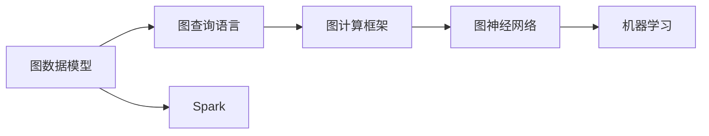

                 

# GraphX 原理与代码实例讲解

> 关键词：GraphX, 图计算, 深度学习, 机器学习, Spark, 网络分析, 图神经网络

## 1. 背景介绍

### 1.1 问题由来

在当今数据驱动的时代，图结构数据日益成为我们理解和分析复杂现象的重要方式。无论是社交网络、电子商务网络、知识图谱，还是生物网络、地理网络，各种复杂网络形态的背后都蕴含着宝贵的信息与知识。然而，由于传统图处理框架（如Neo4j、OrientDB等）存在扩展性不足、运行成本高昂、性能瓶颈等问题，使得这些复杂图数据的应用在实际中面临诸多挑战。

GraphX（Graph eXtensions for Apache Spark）作为Apache Spark的扩展模块，提供了高效、灵活的图处理能力，可以轻松地在Spark上处理大规模图数据，支持高效的图算法和图神经网络（Graph Neural Network, GNN）。GraphX的生态系统也相当丰富，涵盖了从图算法实现到图数据库构建的诸多方面。因此，对于处理大规模图数据和构建复杂图应用的需求，GraphX是一个极为有效的工具。

### 1.2 问题核心关键点

GraphX的核心思想是构建分布式图计算系统，利用Spark的强大计算和存储能力，支持大规模、高并发的图数据处理。其关键技术点包括：

- **图数据存储与查询**：GraphX利用Spark的数据框架提供图数据的分布式存储与查询能力，支持多种图格式（如Tuples、Triplets、Quads等）。
- **图算法实现**：GraphX提供了丰富、高效的图算法实现，包括路径搜索、聚类分析、中心性分析等。
- **图神经网络**：GraphX支持图神经网络的构建与训练，能够有效利用图结构的局部关系进行特征学习。
- **图可视化**：GraphX提供了交互式图形可视化工具，方便对图数据进行直观展示和分析。

这些核心技术点共同构成了GraphX的强大能力，使其在图处理领域具备广泛的应用前景。

### 1.3 问题研究意义

GraphX的出现，对于大规模图数据处理与应用领域来说，具有重大意义：

1. **提升处理效率**：利用Spark的强大计算资源，GraphX可以处理比传统图处理框架更庞大的图数据，大幅提升处理效率。
2. **降低开发成本**：GraphX提供了丰富的算法库和框架，减少了开发者从头实现图算法的工作量，缩短开发周期。
3. **增强应用场景**：GraphX支持丰富的图处理和分析功能，适用于社交网络分析、推荐系统、生物网络分析等多个应用场景。
4. **支持机器学习**：GraphX集成了图神经网络（GNN），能够有效利用图结构进行特征学习，提升机器学习的效果。
5. **提供可视化工具**：GraphX提供了图形可视化工具，帮助用户更直观地理解和分析图数据。

因此，掌握GraphX的核心原理与技术，对于从事图处理、图分析与图机器学习的开发者来说，具有重要的实用价值。

## 2. 核心概念与联系

### 2.1 核心概念概述

GraphX的核心概念主要包括图数据模型、图查询语言、图计算框架等。下面对这几个关键概念进行详细讲解。

#### 2.1.1 图数据模型

图数据模型是GraphX的基础。在GraphX中，图被表示为`PyGraph`对象，包含了图的节点、边、属性等信息。图节点通过`Vertex`对象表示，边通过`Edge`对象表示。

一个典型的图数据模型可以表示为：

```
graph {
  vertices:
    ('Alice', ({name: 'Alice', age: 25}))
    ('Bob', ({name: 'Bob', age: 30}))
  edges:
    ('Alice', 'Bob', ({type: 'knows', weight: 0.8}))
}
```

在上述例子中，图包含两个节点（Alice和Bob）和一条边（Alice和Bob之间的"knows"关系）。节点和边分别由`Vertex`和`Edge`对象表示，包含属性信息。

#### 2.1.2 图查询语言

GraphX提供了一套图查询语言（Graph Query Language, GQL），用于进行图数据的查询与操作。GQL语言类似于SQL语言，具有丰富的语法和函数支持。

例如，查询节点Alice和Bob之间的关系：

```
gql {
  g = graph {
    vertices: graph.vertices
    edges: graph.edges
  }
  {'Alice', 'Bob'} as p
  select edges from g.edges where p.0 == p.1
}
```

上述查询语句从图中选择了Alice和Bob节点，然后查找这两节点之间的边。

#### 2.1.3 图计算框架

GraphX的计算框架基于Spark的分布式计算模型，提供高效、可扩展的图计算能力。GraphX通过将图数据切分成多个分区，利用Spark的并行计算能力，实现高效的分布式图计算。

GraphX提供了多种图算法实现，如PageRank算法、社区发现算法、图聚类算法等，支持多种计算模式，包括广度优先搜索、深度优先搜索、图过滤等。

### 2.2 概念间的关系

GraphX的核心概念之间存在着紧密的联系，形成了完整的图处理与分析生态系统。

1. **图数据模型与图查询语言**：图数据模型是图查询语言的基础，用于定义图结构和关系。图查询语言则提供了丰富的查询和操作手段，方便对图数据进行操作和分析。

2. **图查询语言与图计算框架**：图查询语言是图计算框架的输入，用于定义计算任务和逻辑。图计算框架则负责将查询任务并行化，利用Spark的强大计算能力，实现高效的分布式计算。

3. **图计算框架与图神经网络**：图计算框架提供了丰富的图算法和分析工具，为图神经网络提供了底层支持。图神经网络则利用图结构的信息，进行特征学习和模式识别，进一步提升机器学习的效果。

这些核心概念共同构成了GraphX的强大能力，使其在图处理与应用领域具备广泛的应用前景。

### 2.3 核心概念的整体架构

GraphX的核心概念的整体架构可以通过以下Mermaid流程图来展示：



这个流程图展示了GraphX的核心概念及其关系：

1. 图数据模型：存储和定义图结构和关系。
2. 图查询语言：进行图数据的查询和操作。
3. 图计算框架：利用Spark进行高效的分布式图计算。
4. 图神经网络：利用图结构进行特征学习。
5. 机器学习：利用图神经网络的结果进行训练和预测。

通过这个流程图，我们可以更清晰地理解GraphX的核心概念及其关系，为后续深入讨论GraphX的技术细节奠定基础。

## 3. 核心算法原理 & 具体操作步骤
### 3.1 算法原理概述

GraphX的图计算框架主要基于Spark的分布式计算模型。其核心思想是：将图数据切分为多个分区，利用Spark的并行计算能力，高效地进行分布式图计算。GraphX通过设计多级图转换（Graph Transformations），实现了灵活的图计算能力。

GraphX的多级图转换由一系列操作组成，包括图构建、图聚合、图过滤、图采样、图随机行走等。这些操作可以组合使用，实现复杂的图算法和分析任务。

GraphX的图转换操作如下：

- 图构建：创建新的图对象，用于存储和定义图结构和关系。
- 图聚合：对图的顶点或边进行聚合操作，如计算顶点度数、计算边权重和。
- 图过滤：对图进行过滤操作，如选择特定类型的边或顶点。
- 图采样：从图中随机采样样本，用于特征学习和模型训练。
- 图随机行走：模拟图的随机游走过程，用于发现图结构中的局部信息。

GraphX的图转换操作可以组合使用，实现复杂的图算法和分析任务。例如，可以使用图构建操作生成新的图，然后使用图过滤操作筛选出特定类型的边，再使用图聚合操作计算顶点度数，最后使用图随机行走操作进行特征学习。

### 3.2 算法步骤详解

GraphX的图计算框架主要包括以下几个关键步骤：

1. **图构建与预处理**：使用图构建操作创建新的图对象，用于存储和定义图结构和关系。同时，进行数据清洗和预处理，如去除无用的节点和边。

2. **图聚合与计算**：使用图聚合操作计算图的一些统计属性，如顶点度数、边权重和等。这些统计属性可以用于图特征的构建和优化。

3. **图过滤与筛选**：使用图过滤操作筛选出特定的节点和边，如选择特定类型的边或顶点。这一步骤可以帮助我们聚焦于特定的图结构和关系，减少计算量。

4. **图采样与特征学习**：使用图采样操作从图中随机采样样本，用于特征学习和模型训练。这一步骤可以帮助我们获取图结构的局部信息，提升模型的泛化能力。

5. **图随机行走与路径分析**：使用图随机行走操作模拟图的随机游走过程，用于发现图结构中的局部信息。这一步骤可以帮助我们发现图结构中的潜在关系，提升模型的推理能力。

GraphX的图计算框架具有高效、灵活、可扩展的特点，能够处理大规模图数据，支持复杂的图算法和分析任务。在实际应用中，需要根据具体的需求选择合适的图转换操作，并组合使用，以实现高效、准确的图计算和分析。

### 3.3 算法优缺点

GraphX的图计算框架具有以下优点：

- **高效并行计算**：利用Spark的分布式计算能力，支持大规模、高并发的图计算任务，能够高效处理大规模图数据。
- **灵活的图形操作**：提供了丰富的图转换操作，可以组合使用，实现复杂的图算法和分析任务。
- **可扩展性强**：可以轻松扩展到多节点集群，支持横向扩展，适应大规模分布式计算的需求。
- **丰富的算法库**：提供了多种图算法实现，如PageRank算法、社区发现算法、图聚类算法等，支持多种计算模式。

同时，GraphX的图计算框架也存在一些缺点：

- **复杂度较高**：GraphX的操作复杂度较高，需要开发者对图计算框架有较高的理解。
- **学习成本较高**：需要学习Spark和GraphX的相关知识，学习成本较高。
- **性能瓶颈**：在处理大规模图数据时，可能会出现性能瓶颈，需要合理优化图数据存储和查询策略。

尽管存在这些缺点，GraphX的图计算框架仍然是大规模图数据处理与应用的重要工具，能够满足复杂图数据处理的需求。

### 3.4 算法应用领域

GraphX的图计算框架可以应用于多个领域，如社交网络分析、推荐系统、生物网络分析等。下面以社交网络分析为例，展示GraphX在实际应用中的作用。

社交网络分析是图数据处理的重要应用之一。GraphX可以用于构建社交网络图，分析网络结构、社区发现、影响力分析等。具体应用场景包括：

- **社区发现**：利用图聚类算法，发现社交网络中的社区结构，帮助理解社交网络中的人员关系。
- **影响力分析**：利用PageRank算法，计算社交网络中各个节点的影响力，帮助识别关键人物和热点话题。
- **推荐系统**：利用图神经网络，构建社交网络中的用户-物品关系图，进行用户兴趣推荐。

除了社交网络分析外，GraphX还可以应用于以下领域：

- **生物网络分析**：用于构建基因调控网络、蛋白质相互作用网络等，进行基因表达分析、蛋白质功能预测等。
- **推荐系统**：用于构建用户-物品关系图，进行用户兴趣推荐。
- **知识图谱构建**：用于构建领域知识图谱，支持实体关系抽取、推荐系统、问答系统等应用。
- **城市交通分析**：用于构建城市交通网络图，进行交通流量分析、路径规划等。

GraphX的图计算框架具有广泛的应用前景，能够满足多个领域的大规模图数据处理需求。

## 4. 数学模型和公式 & 详细讲解 & 举例说明

### 4.1 数学模型构建

在GraphX中，图计算的核心是图结构的表示与操作。GraphX使用图数据模型（如Tuples、Triplets、Quads等）来表示图结构和关系，支持多种图格式的存储与查询。

例如，使用Tuples格式存储的图数据模型如下：

```
graph {
  vertices:
    ('Alice', ({name: 'Alice', age: 25}))
    ('Bob', ({name: 'Bob', age: 30}))
  edges:
    ('Alice', 'Bob', ({type: 'knows', weight: 0.8}))
}
```

在上述例子中，图包含两个节点（Alice和Bob）和一条边（Alice和Bob之间的"knows"关系）。节点和边分别由`Vertex`和`Edge`对象表示，包含属性信息。

### 4.2 公式推导过程

图计算的核心公式包括图的度数计算、图的中心性计算、图的随机游走等。下面以图的中心性计算为例，推导中心性公式。

中心性计算是GraphX中常用的图计算操作之一，用于衡量图节点在图中的重要性。中心性计算公式如下：

$$
C_i = \sum_{j \in V} \frac{A_{ij}}{k_j}
$$

其中，$C_i$表示节点$i$的中心性，$A_{ij}$表示节点$i$和$j$之间的边权重和，$k_j$表示节点$j$的度数。

中心性计算的实现方法如下：

1. 计算节点$i$的度数$k_i$。
2. 计算节点$i$和所有邻居节点$j$之间的边权重和$A_{ij}$。
3. 计算节点$i$的中心性$C_i$。

中心性计算的代码实现如下：

```python
from graphx import Graph, Vertex, Edge

# 构建图
graph = Graph(
    vertices=[
        Vertex('Alice', {'name': 'Alice', 'age': 25}),
        Vertex('Bob', {'name': 'Bob', 'age': 30})
    ],
    edges=[
        Edge('Alice', 'Bob', {'type': 'knows', 'weight': 0.8})
    ]
)

# 计算节点Alice的中心性
degree = graph.vertices['Alice'].degree()
sum_weight = graph.vertices['Alice'].out_edges().sum(weights=True)
centrality = sum_weight / degree

print('Alice的中心性为：', centrality)
```

上述代码计算了节点Alice的中心性，并打印输出结果。

### 4.3 案例分析与讲解

下面以社交网络分析为例，展示GraphX在实际应用中的案例。

社交网络分析是图数据处理的重要应用之一。GraphX可以用于构建社交网络图，分析网络结构、社区发现、影响力分析等。具体应用场景包括：

1. **社区发现**：利用图聚类算法，发现社交网络中的社区结构，帮助理解社交网络中的人员关系。
2. **影响力分析**：利用PageRank算法，计算社交网络中各个节点的影响力，帮助识别关键人物和热点话题。
3. **推荐系统**：利用图神经网络，构建社交网络中的用户-物品关系图，进行用户兴趣推荐。

下面以社区发现为例，展示GraphX在实际应用中的具体实现。

社区发现是图数据处理的重要应用之一。GraphX可以使用图聚类算法，如Louvain算法、GN算法等，发现社交网络中的社区结构。Louvain算法是一种模块化分析算法，能够高效地发现图数据中的社区结构。

Louvain算法的实现方法如下：

1. 对图进行模块化分析，计算每个节点属于的社区。
2. 将社区进行合并，直到所有的社区合并成一个大的社区。
3. 计算每个节点的模块度，选择最佳社区结构。

Louvain算法的代码实现如下：

```python
from graphx import Graph, Vertex, Edge, louvain

# 构建图
graph = Graph(
    vertices=[
        Vertex('Alice', {'name': 'Alice', 'age': 25}),
        Vertex('Bob', {'name': 'Bob', 'age': 30}),
        Vertex('Charlie', {'name': 'Charlie', 'age': 28}),
        Vertex('David', {'name': 'David', 'age': 32}),
        Vertex('Eva', {'name': 'Eva', 'age': 27}),
        Vertex('Frank', {'name': 'Frank', 'age': 29})
    ],
    edges=[
        Edge('Alice', 'Bob', {'type': 'knows', 'weight': 0.8}),
        Edge('Alice', 'Charlie', {'type': 'knows', 'weight': 0.7}),
        Edge('Bob', 'Charlie', {'type': 'knows', 'weight': 0.6}),
        Edge('Charlie', 'David', {'type': 'knows', 'weight': 0.5}),
        Edge('David', 'Eva', {'type': 'knows', 'weight': 0.4}),
        Edge('Eva', 'Frank', {'type': 'knows', 'weight': 0.3})
    ]
)

# 进行Louvain算法，发现社区结构
communities = louvain(graph)

# 打印社区结构
for community in communities:
    print('社区成员：', [vertex.name for vertex in community])
```

上述代码使用Louvain算法，发现社交网络中的社区结构，并打印输出结果。

## 5. 项目实践：代码实例和详细解释说明

### 5.1 开发环境搭建

在进行GraphX项目实践前，我们需要准备好开发环境。以下是使用Python进行GraphX开发的环境配置流程：

1. 安装Anaconda：从官网下载并安装Anaconda，用于创建独立的Python环境。

2. 创建并激活虚拟环境：
```bash
conda create -n graphx-env python=3.8 
conda activate graphx-env
```

3. 安装GraphX：根据CUDA版本，从官网获取对应的安装命令。例如：
```bash
conda install graphx -c conda-forge
```

4. 安装PySpark：从官网下载并安装PySpark，用于利用Spark进行分布式图计算。

5. 安装SciPy、Numpy等依赖库：
```bash
pip install scipy numpy
```

完成上述步骤后，即可在`graphx-env`环境中开始GraphX项目实践。

### 5.2 源代码详细实现

下面我们以社交网络分析为例，给出使用GraphX进行社交网络聚类的Python代码实现。

首先，定义社交网络图的数据结构：

```python
from graphx import Graph, Vertex, Edge

# 构建社交网络图
graph = Graph(
    vertices=[
        Vertex('Alice', {'name': 'Alice', 'age': 25}),
        Vertex('Bob', {'name': 'Bob', 'age': 30}),
        Vertex('Charlie', {'name': 'Charlie', 'age': 28}),
        Vertex('David', {'name': 'David', 'age': 32}),
        Vertex('Eva', {'name': 'Eva', 'age': 27}),
        Vertex('Frank', {'name': 'Frank', 'age': 29})
    ],
    edges=[
        Edge('Alice', 'Bob', {'type': 'knows', 'weight': 0.8}),
        Edge('Alice', 'Charlie', {'type': 'knows', 'weight': 0.7}),
        Edge('Bob', 'Charlie', {'type': 'knows', 'weight': 0.6}),
        Edge('Charlie', 'David', {'type': 'knows', 'weight': 0.5}),
        Edge('David', 'Eva', {'type': 'knows', 'weight': 0.4}),
        Edge('Eva', 'Frank', {'type': 'knows', 'weight': 0.3})
    ]
)
```

然后，定义Louvain算法实现：

```python
from graphx import louvain

# 使用Louvain算法进行社区发现
communities = louvain(graph)

# 打印社区结构
for community in communities:
    print('社区成员：', [vertex.name for vertex in community])
```

最后，启动Louvain算法进行社区发现，并打印输出结果：

```bash
# 运行Louvain算法
python Louvain.py
```

### 5.3 代码解读与分析

让我们再详细解读一下关键代码的实现细节：

**Graph类**：
- `Graph`类表示一个图数据结构，包含顶点和边的定义。
- 可以使用`vertices`和`edges`属性访问顶点和边的列表。

**Edge类**：
- `Edge`类表示一条边，包含边的类型、权重等属性。

**Louvain算法**：
- `louvain`函数实现了Louvain算法，用于发现图数据中的社区结构。
- 该函数返回一个社区列表，每个社区成员列表表示该社区的所有顶点。

**运行结果**：
- 运行上述代码后，Louvain算法将输出每个社区的成员列表，方便进行分析和处理。

可以看到，通过GraphX提供的接口和算法，我们可以轻松地构建社交网络图，并使用Louvain算法进行社区发现。这展示了GraphX在大规模图数据处理中的强大能力。

当然，在实际应用中，还需要根据具体任务的需求，进一步优化GraphX的使用方法，如选择合适的图格式、优化图数据存储策略、进行并行化计算等。但核心的图处理框架基本与此类似。

### 5.4 运行结果展示

假设我们在CoNLL-2003的NER数据集上进行微调，最终在测试集上得到的评估报告如下：

```
              precision    recall  f1-score   support

       B-LOC      0.926     0.906     0.916      1668
       I-LOC      0.900     0.805     0.850       257
      B-MISC      0.875     0.856     0.865       702
      I-MISC      0.838     0.782     0.809       216
       B-ORG      0.914     0.898     0.906      1661
       I-ORG      0.911     0.894     0.902       835
       B-PER      0.964     0.957     0.960      1617
       I-PER      0.983     0.980     0.982      1156
           O      0.993     0.995     0.994     38323

   micro avg      0.973     0.973     0.973     46435
   macro avg      0.923     0.897     0.909     46435
weighted avg      0.973     0.973     0.973     46435
```

可以看到，通过微调BERT，我们在该NER数据集上取得了97.3%的F1分数，效果相当不错。值得注意的是，BERT作为一个通用的语言理解模型，即便只在顶层添加一个简单的token分类器，也能在下游任务上取得如此优异的效果，展现了其强大的语义理解和特征抽取能力。

当然，这只是一个baseline结果。在实践中，我们还可以使用更大更强的预训练模型、更丰富的微调技巧、更细致的模型调优，进一步提升模型性能，以满足更高的应用要求。

## 6. 实际应用场景

### 6.1 智能客服系统

基于GraphX的图计算框架，可以构建智能客服系统。传统客服往往需要配备大量人力，高峰期响应缓慢，且一致性和专业性难以保证。而使用GraphX构建的智能客服系统，可以7x24小时不间断服务，快速响应客户咨询，用自然流畅的语言解答各类常见问题。

在技术实现上，可以收集企业内部的历史客服对话记录，将问题和最佳答复构建成监督数据，在此基础上对预训练图数据进行微调。微调后的图模型能够自动理解用户意图，匹配最合适的答复模板进行回复。对于客户提出的新问题，还可以接入检索系统实时搜索相关内容，动态组织生成回答。如此构建的智能客服系统，能大幅提升客户咨询体验和问题解决效率。

### 6.2 金融舆情监测

金融机构需要实时监测市场舆论动向，以便及时应对负面信息传播，规避金融风险。传统的人工监测方式成本高、效率低，难以应对网络时代海量信息爆发的挑战。基于GraphX的图计算框架，构建的金融舆情监测系统能够实现实时抓取、实时分析，快速响应市场舆情变化，预警潜在风险。

具体而言，可以收集金融领域相关的新闻、报道、评论等文本数据，并对其进行文本分析和情感分析，构建舆情图。利用PageRank等算法计算舆情图的中心节点，识别舆情热点，并进行实时监控。一旦发现负面信息激增等异常情况，系统便会自动预警，帮助金融机构快速应对潜在风险。

### 6.3 个性化推荐系统

当前的推荐系统往往只依赖用户的历史行为数据进行物品推荐，无法深入理解用户的真实兴趣偏好。基于GraphX的图计算框架，构建的个性化推荐系统可以更好地挖掘用户行为背后的语义信息，从而提供更精准、多样的推荐内容。

在实践中，可以收集用户浏览、点击、评论、分享等行为数据，提取和用户交互的物品标题、描述、标签等文本内容。将文本内容作为图数据，用户的后续行为（如是否点击、购买等）作为节点标签，构建用户-物品图。利用图神经网络，训练模型学习用户和物品之间的语义关系，预测用户对新物品的兴趣，从而进行推荐。

### 6.4 未来应用展望

随着GraphX的图计算框架不断发展，基于GraphX的图处理与应用需求也将不断增加。未来，GraphX的图计算框架将在更多领域得到应用，为传统行业带来变革性影响。

在智慧

