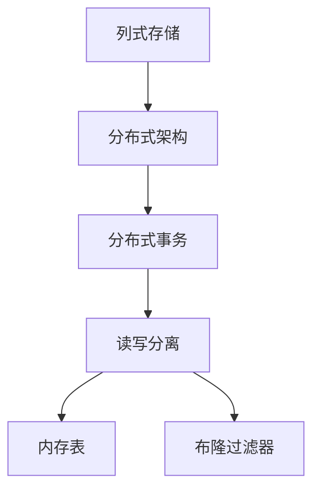
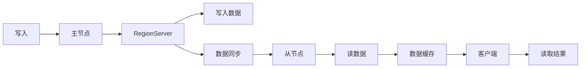
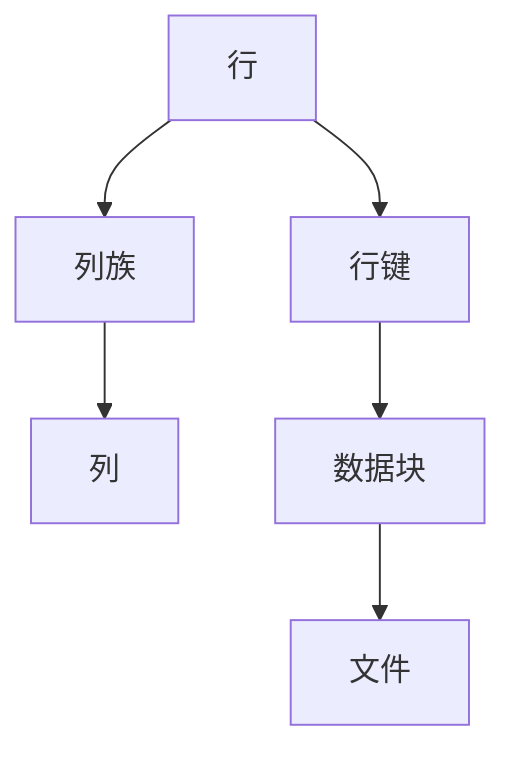

                 

# HBase分布式列式数据库原理与代码实例讲解

> 关键词：HBase, 分布式数据库, 列式存储, 分布式事务, 读写分离, 代码实例, 内存表, 布隆过滤器

## 1. 背景介绍

### 1.1 问题由来
HBase（Hadoop Database）是一个分布式、面向列的开源数据库，它借鉴了Google Bigtable的设计思想，结合了MapReduce框架，主要针对大规模数据的存储和处理。HBase旨在提供一个可扩展的、高性能的、低延迟的读写访问数据的解决方案。HBase被广泛应用于Web访问日志、日志分析、用户行为分析等领域，为大数据应用提供了强有力的技术支持。

然而，HBase的内部工作原理和实现细节对于初学者来说可能较为复杂，容易产生误解。本文旨在深入浅出地讲解HBase的原理，并通过代码实例，帮助读者更好地理解和使用HBase。

### 1.2 问题核心关键点
HBase的核心概念包括：
- **列式存储**：HBase的数据模型是基于列的，数据按照列族进行组织，每一列族包含一组列，这些列可以根据需要进行动态添加和修改。
- **分布式架构**：HBase采用分布式架构，可以支持大规模数据的分片存储和并行处理。
- **分布式事务**：HBase支持跨节点的分布式事务，使得多个表可以协同完成一个事务操作。
- **读写分离**：HBase采用主从复制机制，支持读写分离，主节点负责写操作，从节点负责读操作，以提高系统的吞吐量和可用性。
- **内存表**：HBase支持内存表，可以将部分数据存储在内存中，以提高访问速度。
- **布隆过滤器**：HBase使用布隆过滤器进行数据过滤，可以大大提高查询效率。

本文将详细介绍这些核心概念，并通过代码实例，帮助读者深入理解HBase的实现原理和使用方法。

## 2. 核心概念与联系

### 2.1 核心概念概述

为更好地理解HBase的核心概念，本文将介绍几个密切相关的核心概念：

- **列式存储**：HBase采用列式存储模型，将数据按照列族进行组织。每个列族可以包含多个列，每一列族下可以有多个列，这些列可以根据需要进行动态添加和修改。

- **分布式架构**：HBase采用分布式架构，可以支持大规模数据的分片存储和并行处理。HBase集群由多个Master节点和多个RegionServer组成，Master节点负责管理表和元数据，RegionServer负责处理实际的数据读写操作。

- **分布式事务**：HBase支持跨节点的分布式事务，使得多个表可以协同完成一个事务操作。HBase采用两阶段提交协议（Two-Phase Commit）来保证分布式事务的一致性。

- **读写分离**：HBase采用主从复制机制，支持读写分离，主节点负责写操作，从节点负责读操作，以提高系统的吞吐量和可用性。

- **内存表**：HBase支持内存表，可以将部分数据存储在内存中，以提高访问速度。内存表通常用于存储热点数据，可以提高查询效率。

- **布隆过滤器**：HBase使用布隆过滤器进行数据过滤，可以大大提高查询效率。布隆过滤器是一种空间效率高、查询速度快的概率型数据结构。

这些核心概念之间的逻辑关系可以通过以下Mermaid流程图来展示：



这个流程图展示了大数据量存储的流程，其中：

1. 数据以列族的形式存储，可以动态添加和修改列族。
2. HBase采用分布式架构，由Master节点和RegionServer组成。
3. 支持跨节点的分布式事务，保证事务的一致性。
4. 支持读写分离，提高系统的吞吐量和可用性。
5. 内存表用于存储热点数据，提高访问速度。
6. 布隆过滤器用于数据过滤，提高查询效率。

### 2.2 概念间的关系

这些核心概念之间存在着紧密的联系，形成了HBase数据库的完整生态系统。下面我们通过几个Mermaid流程图来展示这些概念之间的关系。

#### 2.2.1 HBase的读写流程



这个流程图展示了HBase的写入流程和读取流程。在写入操作中，数据首先发送到Master节点，然后发送到RegionServer，RegionServer将数据写入磁盘。在读取操作中，数据首先从磁盘读取，然后缓存到客户端，最后返回给客户端。

#### 2.2.2 HBase的数据模型



这个流程图展示了HBase的数据模型。每一行数据由一个行键、多个列族和列组成，每个列族由多个列组成。数据块和文件是HBase内部数据存储的基本单元。

## 3. 核心算法原理 & 具体操作步骤
### 3.1 算法原理概述

HBase的核心算法包括列式存储、分布式架构、分布式事务、读写分离、内存表和布隆过滤器。下面将详细介绍这些核心算法的原理。

#### 3.1.1 列式存储

HBase的列式存储模型将数据按照列族进行组织。每个列族可以包含多个列，每一列族下可以有多个列，这些列可以根据需要进行动态添加和修改。列式存储模型具有以下几个优点：

- **存储效率高**：列式存储模型将数据按照列族进行组织，每个列族只存储指定列的数据，可以大大减少数据存储的冗余。
- **查询效率高**：列式存储模型支持动态添加和修改列族，可以在数据中快速添加或删除列，提高了查询效率。

#### 3.1.2 分布式架构

HBase采用分布式架构，可以支持大规模数据的分片存储和并行处理。HBase集群由多个Master节点和多个RegionServer组成，Master节点负责管理表和元数据，RegionServer负责处理实际的数据读写操作。

- **Master节点**：负责管理表和元数据，包括表的创建、删除、修改等操作。
- **RegionServer**：负责处理实际的数据读写操作，存储数据块和文件。

#### 3.1.3 分布式事务

HBase支持跨节点的分布式事务，使得多个表可以协同完成一个事务操作。HBase采用两阶段提交协议（Two-Phase Commit）来保证分布式事务的一致性。

- **两阶段提交协议**：首先，所有参与事务的节点都执行本地操作。然后，所有节点向协调者发送准备消息，如果所有节点都返回准备消息，则协调者向所有节点发送提交消息，所有节点执行提交操作。如果任何一个节点返回异常消息，则协调者向所有节点发送回滚消息，所有节点执行回滚操作。

#### 3.1.4 读写分离

HBase采用主从复制机制，支持读写分离，主节点负责写操作，从节点负责读操作，以提高系统的吞吐量和可用性。

- **主节点**：负责写操作，处理所有的写请求。
- **从节点**：负责读操作，处理所有的读请求。

#### 3.1.5 内存表

HBase支持内存表，可以将部分数据存储在内存中，以提高访问速度。内存表通常用于存储热点数据，可以提高查询效率。

- **内存表**：将部分数据存储在内存中，提高了数据的访问速度。

#### 3.1.6 布隆过滤器

HBase使用布隆过滤器进行数据过滤，可以大大提高查询效率。布隆过滤器是一种空间效率高、查询速度快的概率型数据结构。

- **布隆过滤器**：使用布隆过滤器进行数据过滤，可以大大提高查询效率。

### 3.2 算法步骤详解

#### 3.2.1 列式存储的实现

在HBase中，数据以列族的形式存储。列族下包含多个列，每个列族可以动态添加和修改。列式存储的实现步骤如下：

1. **创建列族**：在创建表时，可以指定多个列族。
2. **添加列**：在表创建后，可以动态添加新列。
3. **删除列**：在表创建后，可以动态删除列。

#### 3.2.2 分布式架构的实现

在HBase中，集群由多个Master节点和多个RegionServer组成。Master节点负责管理表和元数据，RegionServer负责处理实际的数据读写操作。分布式架构的实现步骤如下：

1. **创建表**：在创建表时，指定表的主键、列族和Region数。
2. **添加Region**：在表创建后，可以动态添加新的Region。
3. **删除Region**：在表创建后，可以动态删除旧的区域。

#### 3.2.3 分布式事务的实现

在HBase中，支持跨节点的分布式事务。分布式事务的实现步骤如下：

1. **创建事务**：在创建事务时，指定参与事务的节点和操作。
2. **执行操作**：在所有参与事务的节点上执行本地操作。
3. **提交事务**：在所有参与事务的节点上执行提交操作。

#### 3.2.4 读写分离的实现

在HBase中，采用主从复制机制，支持读写分离。读写分离的实现步骤如下：

1. **创建表**：在创建表时，指定主节点和从节点。
2. **执行操作**：在主节点上执行写操作，在从节点上执行读操作。

#### 3.2.5 内存表的实现

在HBase中，支持内存表。内存表的实现步骤如下：

1. **创建表**：在创建表时，指定是否使用内存表。
2. **读写操作**：在内存表中进行读写操作，以提高访问速度。

#### 3.2.6 布隆过滤器的实现

在HBase中，使用布隆过滤器进行数据过滤。布隆过滤器的实现步骤如下：

1. **创建布隆过滤器**：在创建表时，指定是否使用布隆过滤器。
2. **过滤数据**：使用布隆过滤器进行数据过滤，提高查询效率。

### 3.3 算法优缺点

#### 3.3.1 列式存储的优缺点

列式存储的优点：
- **存储效率高**：列式存储模型将数据按照列族进行组织，每个列族只存储指定列的数据，可以大大减少数据存储的冗余。
- **查询效率高**：列式存储模型支持动态添加和修改列族，可以在数据中快速添加或删除列，提高了查询效率。

列式存储的缺点：
- **不适合随机访问**：列式存储模型不支持随机访问，需要按照列族和列进行逐列扫描。

#### 3.3.2 分布式架构的优缺点

分布式架构的优点：
- **支持大规模数据的分片存储和并行处理**：HBase采用分布式架构，可以支持大规模数据的分片存储和并行处理。
- **高可用性和高扩展性**：HBase集群采用多节点架构，具有高可用性和高扩展性。

分布式架构的缺点：
- **复杂度高**：HBase集群架构复杂，需要维护多个节点和元数据，增加了系统维护的复杂度。

#### 3.3.3 分布式事务的优缺点

分布式事务的优点：
- **支持跨节点的分布式事务**：HBase支持跨节点的分布式事务，使得多个表可以协同完成一个事务操作。
- **保证事务的一致性**：HBase采用两阶段提交协议（Two-Phase Commit）来保证分布式事务的一致性。

分布式事务的缺点：
- **性能开销大**：分布式事务的开销较大，需要在多个节点之间进行通信和协调。

#### 3.3.4 读写分离的优缺点

读写分离的优点：
- **提高系统的吞吐量和可用性**：读写分离机制可以提高系统的吞吐量和可用性，主节点负责写操作，从节点负责读操作。

读写分离的缺点：
- **需要维护多个节点**：读写分离机制需要维护多个节点，增加了系统复杂度。

#### 3.3.5 内存表的优缺点

内存表的优点：
- **提高访问速度**：内存表可以将部分数据存储在内存中，以提高访问速度。

内存表的缺点：
- **空间占用大**：内存表需要占用较大的内存空间，不适合存储海量数据。

#### 3.3.6 布隆过滤器的优缺点

布隆过滤器的优点：
- **查询效率高**：布隆过滤器使用概率型数据结构进行数据过滤，可以大大提高查询效率。

布隆过滤器的缺点：
- **误判率高**：布隆过滤器存在误判率，可能将不属于该列的数据误判为属于该列的数据。

### 3.4 算法应用领域

HBase作为一种分布式列式数据库，可以广泛应用于大规模数据存储和处理领域。具体应用领域包括：

- **Web访问日志**：用于存储和分析Web访问日志，可以提供实时访问统计和用户行为分析。
- **日志分析**：用于存储和分析各类日志数据，包括系统日志、应用日志、审计日志等。
- **用户行为分析**：用于存储和分析用户行为数据，包括用户登录行为、购物行为、点击行为等。
- **数据仓库**：用于存储和处理大规模数据，构建数据仓库，提供数据查询和报表服务。

## 4. 数学模型和公式 & 详细讲解 & 举例说明

### 4.1 数学模型构建

在HBase中，数据以列族的形式存储，每一列族包含多个列。数据模型可以表示为：

- **表**：由多个行组成，每一行包含一个行键和一个或多个列族。
- **列族**：由多个列组成，每个列族可以动态添加和修改。
- **列**：列族下包含多个列，每个列可以动态添加和修改。

### 4.2 公式推导过程

在HBase中，数据模型可以表示为一个稀疏矩阵，每个行键对应一个矩阵行，每个列族对应一个矩阵列，每个列对应一个矩阵元素。公式推导过程如下：

1. **创建表**：在创建表时，指定表的主键、列族和Region数。
2. **添加行**：在表中添加新行，每个行包含一个行键和一个或多个列族。
3. **添加列**：在列族中添加新列，每个列包含一个列名和一个或多个值。
4. **删除列**：在列族中删除旧列，每个列族可以动态添加和修改。

### 4.3 案例分析与讲解

下面通过一个简单的案例，展示HBase的数据模型和基本操作：

假设我们要存储一个用户的订单数据，订单包含订单号、用户ID、商品ID、商品名称、商品价格和订单时间。可以将订单数据表示为一个表，其中每个行表示一个订单，每个列族表示一个订单属性，每个列表示一个订单属性值。具体如下：

```
+------+------------+---------+----------+-------+-----------------------+
| 行键  | 列族       | 列名    | 列值     | 列族   | 列值               |
+------+------------+---------+----------+-------+-----------------------+
| 订单号 | 订单信息   | 订单号   | 100001   |        |                     |
+------+------------+---------+----------+-------+-----------------------+
|      | 订单信息   | 用户ID   | 1001     |        |                     |
+------+------------+---------+----------+-------+-----------------------+
|      | 订单信息   | 商品ID   | 100001   |        |                     |
+------+------------+---------+----------+-------+-----------------------+
|      | 订单信息   | 商品名称 | 手机      |        |                     |
+------+------------+---------+----------+-------+-----------------------+
|      | 订单信息   | 商品价格 | 5000     |        |                     |
+------+------------+---------+----------+-------+-----------------------+
|      | 订单信息   | 订单时间 | 2021-01-01 10:00:00 |        |                     |
+------+------------+---------+----------+-------+-----------------------+
```

在HBase中，可以创建一张名为`orders`的表，其中包含两个列族`user`和`item`，每个列族下包含多个列。具体代码如下：

```java
Configuration conf = new Configuration();
HBaseAdmin admin = new HBaseAdmin(conf);

String tableName = "orders";
HTableDescriptor tableDescriptor = new HTableDescriptor(TableName.valueOf(tableName));
tableDescriptor.addFamily(new HColumnDescriptor("user"));
tableDescriptor.addFamily(new HColumnDescriptor("item"));
admin.createTable(tableDescriptor);
```

在表中添加新行时，需要指定行键、列族和列值。具体代码如下：

```java
HTable table = new HTable(conf, tableName);
String rowKey = "100001";
Put put = new Put(rowKey.getBytes());
put.addColumn("user".getBytes(), "userId".getBytes(), "1001".getBytes());
put.addColumn("user".getBytes(), "email".getBytes(), "user@example.com".getBytes());
put.addColumn("item".getBytes(), "itemId".getBytes(), "100001".getBytes());
put.addColumn("item".getBytes(), "productName".getBytes(), "手机".getBytes());
put.addColumn("item".getBytes(), "price".getBytes(), "5000".getBytes());
put.addColumn("item".getBytes(), "time".getBytes(), "2021-01-01 10:00:00".getBytes());
table.put(put);
```

在列族中添加新列时，需要指定列族和列值。具体代码如下：

```java
HTable table = new HTable(conf, tableName);
String rowKey = "100001";
Put put = new Put(rowKey.getBytes());
put.addColumn("user".getBytes(), "userId".getBytes(), "1001".getBytes());
put.addColumn("user".getBytes(), "email".getBytes(), "user@example.com".getBytes());
put.addColumn("item".getBytes(), "itemId".getBytes(), "100001".getBytes());
put.addColumn("item".getBytes(), "productName".getBytes(), "手机".getBytes());
put.addColumn("item".getBytes(), "price".getBytes(), "5000".getBytes());
put.addColumn("item".getBytes(), "time".getBytes(), "2021-01-01 10:00:00".getBytes());
table.put(put);
```

在列族中删除旧列时，需要指定列族和列名。具体代码如下：

```java
HTable table = new HTable(conf, tableName);
String rowKey = "100001";
Put put = new Put(rowKey.getBytes());
put.deleteColumn("user".getBytes(), "email".getBytes());
put.deleteColumn("item".getBytes(), "time".getBytes());
table.put(put);
```

## 5. 项目实践：代码实例和详细解释说明

### 5.1 开发环境搭建

在进行HBase项目实践前，我们需要准备好开发环境。以下是使用Java进行HBase开发的环境配置流程：

1. 安装Hadoop和HBase：从官网下载并安装Hadoop和HBase，用于构建HBase集群。
2. 配置Hadoop和HBase：编辑`hadoop-env.sh`和`hbase-env.sh`文件，配置Hadoop和HBase的相关参数，如Hadoop的安装路径、HBase的实例名称、Hadoop的DataNode和NameNode地址等。
3. 启动Hadoop和HBase：在命令行中启动Hadoop和HBase，确保集群正常运行。

完成上述步骤后，即可在本地搭建HBase开发环境。

### 5.2 源代码详细实现

这里我们以HBase的基本数据读写操作为例，展示Java代码的实现。

首先，创建一个HTable对象：

```java
Configuration conf = new Configuration();
HTable table = new HTable(conf, "orders");
```

然后，进行数据写入操作：

```java
String rowKey = "100001";
Put put = new Put(rowKey.getBytes());
put.addColumn("user".getBytes(), "userId".getBytes(), "1001".getBytes());
put.addColumn("user".getBytes(), "email".getBytes(), "user@example.com".getBytes());
put.addColumn("item".getBytes(), "itemId".getBytes(), "100001".getBytes());
put.addColumn("item".getBytes(), "productName".getBytes(), "手机".getBytes());
put.addColumn("item".getBytes(), "price".getBytes(), "5000".getBytes());
put.addColumn("item".getBytes(), "time".getBytes(), "2021-01-01 10:00:00".getBytes());
table.put(put);
```

接着，进行数据读取操作：

```java
String rowKey = "100001";
Get get = new Get(rowKey.getBytes());
Result result = table.get(get);
byte[] userId = result.getValue("user".getBytes(), "userId".getBytes());
byte[] email = result.getValue("user".getBytes(), "email".getBytes());
byte[] itemId = result.getValue("item".getBytes(), "itemId".getBytes());
byte[] productName = result.getValue("item".getBytes(), "productName".getBytes());
byte[] price = result.getValue("item".getBytes(), "price".getBytes());
byte[] time = result.getValue("item".getBytes(), "time".getBytes());
```

最后，关闭HTable对象：

```java
table.close();
```

### 5.3 代码解读与分析

下面我们详细解读一下关键代码的实现细节：

**HTable对象创建**：
- `HTable`是一个HBase的表对象，可以用于对表进行读写操作。

**数据写入操作**：
- 首先创建一个`Put`对象，指定行键和列族列值。
- 使用`addColumn`方法，添加列族和列值。

**数据读取操作**：
- 首先创建一个`Get`对象，指定行键。
- 使用`getValue`方法，获取指定列族和列值。

**关闭HTable对象**：
- 关闭`HTable`对象，释放资源。

### 5.4 运行结果展示

在运行以上代码后，可以通过HBase的CLI工具，查看`orders`表的存储情况：

```bash
hbase shell
use orders;
scan;
```

在HBase的Web UI中，可以实时查看`orders`表的数据存储情况，验证数据的正确性。

## 6. 实际应用场景

### 6.1 智能推荐系统

智能推荐系统是HBase的一个重要应用场景，用于存储和分析用户的浏览、点击、购买等行为数据，推荐用户可能感兴趣的商品或内容。HBase可以高效存储大规模的推荐数据，支持快速的查询和分析操作，为推荐算法提供强有力的数据支持。

在智能推荐系统中，可以使用HBase存储用户的浏览记录、点击记录和购买记录，使用MapReduce算法进行数据统计和分析，构建用户画像和商品画像，从而进行精准推荐。具体实现流程如下：

1. **数据存储**：使用HBase存储用户的浏览记录、点击记录和购买记录。
2. **数据查询**：使用HBase进行数据查询，获取用户画像和商品画像。
3. **推荐算法**：使用推荐算法，生成推荐结果。
4. **结果展示**：将推荐结果展示给用户，并进行效果评估。

### 6.2 日志分析系统

日志分析系统是HBase的另一个重要应用场景，用于存储和分析各类日志数据，包括系统日志、应用日志、审计日志等。HBase可以高效存储和处理大规模的日志数据，支持快速的查询和分析操作，为日志分析提供强有力的数据支持。

在日志分析系统中，可以使用HBase存储各类日志数据，使用MapReduce算法进行数据统计和分析，获取日志关键指标和异常情况，从而进行系统优化和故障排查。具体实现流程如下：

1. **数据存储**：使用HBase存储各类日志数据。
2. **数据查询**：使用HBase进行数据查询，获取日志关键指标和异常情况。
3. **数据分析**：使用数据分析工具，进行系统优化和故障排查。
4. **结果展示**：将结果展示给系统管理员，并进行效果评估。

### 6.3 实时监控系统

实时监控系统是HBase的另一个重要应用场景，用于存储和处理大规模的实时数据，提供实时的监控和告警服务。HBase可以高效存储和处理大规模的实时数据，支持快速的查询和分析操作，为实时监控提供强有力的数据支持。

在实时监控系统中，可以使用HBase存储实时数据，使用MapReduce算法进行数据统计和分析，获取实时指标和告警信息，从而进行实时监控和告警。具体实现流程如下：

1. **数据存储**：使用HBase存储实时数据。
2. **数据查询**：使用HBase进行数据查询，获取实时指标和告警信息。
3. **告警处理**：使用告警处理工具，进行实时监控和告警。
4. **结果展示**：将告警信息展示给系统管理员，并进行效果评估。

## 7. 工具和资源推荐

### 7.1 学习资源推荐

为了帮助开发者系统掌握HBase的原理和实践，这里推荐一些优质的学习资源：

1. HBase官方文档：HBase官方文档提供了详细的HBase使用指南和API文档，是学习HBase的最佳资源。

2. HBase入门教程：HBase入门教程提供了HBase的基本概念和操作示例，适合初学者入门。

3. HBase高级教程：HBase高级教程

