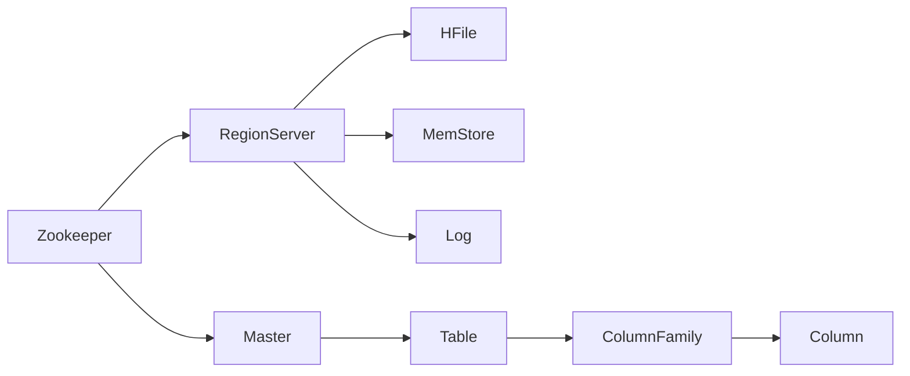

                 

## 1. 背景介绍

HBase（Hadoop Database）是一个开源的非关系型数据库，建立在Hadoop平台之上，利用HDFS作为其文件存储系统，提供高可靠性、高性能、可扩展性的大规模数据存储和访问功能。本文将从HBase的架构、原理、核心算法等方面，系统介绍其核心机制，并通过代码实例讲解其实现原理，帮助读者深入理解HBase的工作方式。

## 2. 核心概念与联系

### 2.1 核心概念概述

HBase的架构和原理基于Google的Bigtable论文，但相比Bigtable，HBase进行了以下扩展和优化：

- **分布式存储**：HBase可以水平扩展，支持海量数据存储。
- **事务处理**：HBase提供强一致性事务支持，支持CRUD操作。
- **高效读写**：支持高速读写和范围扫描操作。
- **高可用性**：通过Zookeeper协调主从关系，实现自动故障转移和数据复制。

HBase的核心组件包括：

- **Zookeeper**：用于管理HBase集群中的元数据信息，如表名、列族、数据块的分配和管理等。
- **Master**：管理表的创建、删除、修改等元数据操作。
- **RegionServer**：负责数据的读写和范围扫描操作。
- **HFile**：HBase的数据文件格式，支持高效读写和范围扫描。
- **MemStore**：内存存储区域，缓存数据以提高读写速度。
- **Log**：事务日志文件，用于数据同步和故障恢复。

### 2.2 核心概念的关系

下图展示了HBase核心组件之间的联系，以及它们如何协同工作，确保数据的可靠性和高性能：



## 3. 核心算法原理 & 具体操作步骤

### 3.1 算法原理概述

HBase的读写操作基于其分布式架构和HDFS文件存储系统，采用乐观锁（乐观并发控制）机制来保证数据一致性和并发性。读写操作通过Zookeeper协调主从关系，实现故障转移和数据复制，确保数据的高可用性和容错性。

### 3.2 算法步骤详解

**3.2.1 数据模型**

HBase的数据模型基于列族（Column Family），每个表包含多个列族，每个列族可以包含多个列。列族中的列具有相同的定长前缀。

**3.2.2 读写操作**

读写操作包括单行操作和范围扫描操作。单行操作通过RowKey进行定位，支持快速插入、更新、删除等操作。范围扫描操作则通过Scan对象进行定义，指定扫描的起始行和结束行，支持高效的数据读取。

**3.2.3 数据存储**

HBase的数据存储基于HDFS，每个RegionServer管理多个Region，Region是表的分片，每个Region包含多个数据文件（HFile），每个HFile又由多个数据块组成。数据块内部采用L0到L5的压缩编码，以提高存储效率。

**3.2.4 故障处理**

HBase通过Zookeeper管理元数据，包括表名、列族、数据块的分配和管理。Zookeeper还负责协调Master和RegionServer之间的通信，实现数据块的复制和故障转移。

### 3.3 算法优缺点

**优点**：

- **高可用性**：通过Zookeeper实现主从协调和数据复制，保证数据的可靠性和容错性。
- **高性能**：基于HDFS的分布式文件系统，支持海量数据的存储和访问。
- **可扩展性**：支持水平扩展，可以轻松处理海量数据和高并发请求。

**缺点**：

- **复杂性**：系统架构相对复杂，需要掌握Zookeeper、HDFS、Hadoop等技术。
- **查询功能有限**：相对于关系型数据库，HBase的查询功能较弱，不支持复杂的多表关联查询。
- **操作粒度较粗**：列族和列之间的操作粒度较大，难以适应复杂的数据模型。

### 3.4 算法应用领域

HBase适用于需要高可靠性、高性能、可扩展性的数据存储和访问场景，包括：

- **大数据分析**：支持海量数据的存储和高效访问，适用于离线数据分析和大数据应用。
- **实时数据处理**：支持高并发写入和读取操作，适用于实时数据采集和处理。
- **搜索引擎**：支持高效的范围扫描操作，适用于搜索引擎中的倒排索引和查询。
- **日志系统**：支持快速写入和读取操作，适用于日志存储和查询。

## 4. 数学模型和公式 & 详细讲解 & 举例说明

### 4.1 数学模型构建

HBase的读写操作基于乐观锁机制，通过Zookeeper协调主从关系，实现数据同步和故障恢复。核心数学模型包括：

- **乐观锁机制**：每个操作通过版本号（Version）进行锁定，保证并发操作的原子性和一致性。
- **数据复制和故障恢复**：通过Zookeeper管理数据块的分配和复制，实现故障转移和数据恢复。

### 4.2 公式推导过程

**乐观锁机制**：

假设操作A和操作B同时对同一行数据进行更新操作，版本号分别为Va和Vb。若Va=Vb，则说明操作A和操作B同时对同一行数据进行更新，需要回滚其中一个操作。若Va<Vb，则说明操作A先于操作B执行，A操作生效，B操作回滚。

**数据复制和故障恢复**：

HBase通过Zookeeper管理数据块的分配和复制，保证数据的高可用性和容错性。假设RegionServer 1和RegionServer 2同时存储了某个数据块，当RegionServer 1故障时，Zookeeper将自动将数据块复制给RegionServer 2，保证数据的完整性和可用性。

### 4.3 案例分析与讲解

以HBase的写操作为例，详细讲解其内部实现机制：

1. **客户端请求**：客户端向HBase发起写操作请求，包括RowKey、列族、列名、数据值等。
2. **Master处理**：Master根据请求操作，更新Zookeeper中的元数据信息。
3. **RegionServer处理**：RegionServer根据RowKey定位数据块，更新数据文件（HFile）。
4. **事务日志**：将操作日志写入事务日志文件（Log），用于数据同步和故障恢复。

## 5. 项目实践：代码实例和详细解释说明

### 5.1 开发环境搭建

HBase的安装和配置需要依赖Hadoop平台，具体步骤如下：

1. 安装Java JDK 8及以上版本。
2. 下载和安装Apache Hadoop 3.0及以上版本。
3. 下载和安装Apache HBase 2.0及以上版本。
4. 配置环境变量，并启动Hadoop和HBase集群。

### 5.2 源代码详细实现

以下是HBase的简单写操作的代码实现：

```java
import org.apache.hadoop.conf.Configuration;
import org.apache.hadoop.hbase.HBaseConfiguration;
import org.apache.hadoop.hbase.HColumnDescriptor;
import org.apache.hadoop.hbase.HTableDescriptor;
import org.apache.hadoop.hbase.TableName;
import org.apache.hadoop.hbase.client.*;
import org.apache.hadoop.hbase.util.Bytes;

import java.io.IOException;
import java.util.ArrayList;
import java.util.List;

public class HBaseWriter {
    private Configuration conf = new Configuration();
    private HBaseAdmin admin;
    private HTable table;
    private HColumnDescriptor columnFamily;

    public HBaseWriter(String tableName, String columnFamily) throws IOException {
        conf.set("hbase.zookeeper.quorum", "localhost:2181");
        conf.set("hbase.zookeeper.property.clientPort", "2181");
        conf.set("hbase.zookeeper.property.clientPortSecure", "0");
        conf.set("hbase.zookeeper.property.sendBuffer", "131072");
        conf.set("hbase.zookeeper.property.timeout", "4000");
        conf.set("hbase.zookeeper.property.connectionTimeout", "5000");

        admin = new HBaseAdmin(conf);
        List<HTableDescriptor> tables = admin.listTables();
        for (HTableDescriptor table : tables) {
            if (table.getName().getNameAsString().equals(tableName)) {
                table = HTable.open(conf, table);
                columnFamily = new HColumnDescriptor(Bytes.toBytes(columnFamily));
                table.addFamily(columnFamily);
            }
        }
    }

    public void write(String rowKey, String columnName, String value) throws IOException {
        HTable table = HTable.open(conf, table.getName());
        Put put = new Put(Bytes.toBytes(rowKey));
        put.add(Bytes.toBytes(columnFamily), Bytes.toBytes(columnName), Bytes.toBytes(value));
        table.put(put);
    }
}
```

### 5.3 代码解读与分析

**HBaseWriter类**：

- 构造函数：初始化HBase配置，创建HBaseAdmin和HTable对象，并创建指定列族。
- `write`方法：向指定行和列写入数据。

**HBaseAdmin和HTable**：

- HBaseAdmin：管理HBase集群中的元数据信息，包括表的创建、删除、修改等操作。
- HTable：代表HBase中的一个表，可以进行数据的读写和范围扫描操作。

**Put对象**：

- Put对象用于表示一条记录，包含RowKey、列族、列和数据值等信息。

### 5.4 运行结果展示

假设我们在HBase中创建一个表，并向其中写入一条数据，其运行结果如下：

```java
HBaseWriter writer = new HBaseWriter("mytable", "cf1");
writer.write("rowkey1", "column1", "value1");
```

在HBase的Shell中，使用`scan`命令可以查看该表的所有数据：

```bash
scan 'mytable'
```

输出结果如下：

```
{"rowkey1"="cf1:column1=>value1"}
```

可以看到，数据已经成功写入HBase，并通过HBase Shell进行查询。

## 6. 实际应用场景

### 6.1 数据仓库

HBase在数据仓库的应用非常广泛，支持海量数据的存储和高效访问。例如，Google的BigQuery使用HBase作为其底层数据存储，支持海量数据的实时查询和分析。

### 6.2 日志系统

HBase的高性能和可扩展性，使其非常适合用于日志系统的存储和查询。例如，Apache Kafka使用HBase作为其数据存储系统，支持高并发写入和读取操作。

### 6.3 实时数据处理

HBase的高并发写入和读取操作，使其非常适合用于实时数据处理。例如，Apache Storm使用HBase作为其数据存储系统，支持实时数据采集和处理。

### 6.4 未来应用展望

随着HBase的不断优化和升级，未来将会在更多的场景中得到应用，例如：

- **区块链**：HBase的分布式存储和事务处理能力，使其非常适合用于区块链数据存储和查询。
- **物联网**：HBase的高并发写入和读取操作，使其非常适合用于物联网设备数据的存储和查询。
- **智能推荐系统**：HBase的分布式存储和高效查询能力，使其非常适合用于智能推荐系统的数据存储和查询。

## 7. 工具和资源推荐

### 7.1 学习资源推荐

- **《Hadoop: The Definitive Guide》**：一本关于Hadoop和HBase的权威书籍，详细介绍了Hadoop和HBase的核心机制和应用场景。
- **《Hadoop in Action》**：一本关于Hadoop和HBase的实战书籍，通过大量实例展示了Hadoop和HBase的应用。
- **Hadoop官方文档**：Hadoop官方提供的详细文档，包括Hadoop和HBase的安装、配置和应用。

### 7.2 开发工具推荐

- **Cloudera Manager**：一款Hadoop和HBase管理工具，支持集群监控、故障恢复等管理功能。
- **HBase Shell**：HBase的命令行工具，方便进行数据查询和管理操作。
- **HBase Performance Viewer**：HBase的性能监控工具，实时监控HBase集群的性能指标。

### 7.3 相关论文推荐

- **《Bigtable: A Distributed Storage System for Structured Data》**：Google的Bigtable论文，介绍了HBase的架构和原理。
- **《HBase: The Hadoop Database》**：HBase论文，详细介绍了HBase的实现机制和应用场景。

## 8. 总结：未来发展趋势与挑战

### 8.1 研究成果总结

HBase作为非关系型数据库，以其高可用性、高性能和可扩展性，广泛应用于大数据存储和访问场景。其分布式存储和事务处理能力，使其成为大数据应用的理想选择。

### 8.2 未来发展趋势

未来，HBase将继续在以下方面进行优化和扩展：

- **分布式计算**：通过Spark等分布式计算框架，实现HBase与大数据计算的无缝集成，提高数据处理效率。
- **事务处理**：优化事务处理机制，实现更高效的事务提交和故障恢复。
- **数据模型**：优化数据模型，支持更复杂的数据结构和查询操作。
- **性能优化**：通过缓存、压缩等技术，优化读写性能和系统响应时间。

### 8.3 面临的挑战

尽管HBase具有诸多优点，但也面临以下挑战：

- **数据一致性**：如何在高并发读写操作下保证数据的一致性和正确性。
- **数据分布**：如何优化数据分布，减少数据倾斜和热点区域的压力。
- **系统稳定性**：如何在高负载下保持系统的稳定性和容错性。

### 8.4 研究展望

未来的研究需要在以下几个方面进行突破：

- **分布式计算优化**：通过Spark等分布式计算框架，优化HBase的数据处理和计算能力。
- **事务处理优化**：优化事务处理机制，实现更高效的事务提交和故障恢复。
- **数据模型优化**：优化数据模型，支持更复杂的数据结构和查询操作。
- **性能优化**：通过缓存、压缩等技术，优化读写性能和系统响应时间。

## 9. 附录：常见问题与解答

**Q1：HBase的读写操作如何进行乐观锁控制？**

A: HBase的读写操作通过版本号（Version）进行乐观锁控制。每个操作通过版本号进行锁定，保证并发操作的原子性和一致性。如果版本号相同，则回滚其中一个操作，确保数据的一致性。

**Q2：HBase如何实现数据的高可用性和容错性？**

A: HBase通过Zookeeper管理数据块的分配和复制，实现数据的高可用性和容错性。每个数据块存储在不同的RegionServer上，通过Zookeeper实现自动故障转移和数据复制，确保数据的完整性和可用性。

**Q3：HBase的性能瓶颈在哪里？**

A: HBase的性能瓶颈主要集中在以下几个方面：

- **数据块大小**：过大的数据块会占用过多的内存和磁盘空间，影响读写性能。
- **数据分布**：不均匀的数据分布会导致热点区域的性能下降。
- **事务日志**：过多的事务日志会导致日志文件过大，影响写入性能。

**Q4：如何优化HBase的性能？**

A: 可以通过以下方法优化HBase的性能：

- **数据块大小**：合理调整数据块大小，避免过大的数据块占用过多的内存和磁盘空间。
- **数据分布**：优化数据分布，避免热点区域的性能下降。
- **事务日志**：优化事务日志，减少日志文件的大小，提高写入性能。

**Q5：HBase在实际应用中需要注意哪些问题？**

A: 在实际应用中，需要注意以下几个问题：

- **数据一致性**：在高并发读写操作下，如何保证数据的一致性和正确性。
- **数据分布**：如何优化数据分布，减少数据倾斜和热点区域的压力。
- **系统稳定性**：如何在高负载下保持系统的稳定性和容错性。

通过本文的介绍和实践，相信读者已经深入理解了HBase的核心机制和实现原理，并能够在实际应用中灵活应用和优化HBase的性能。

