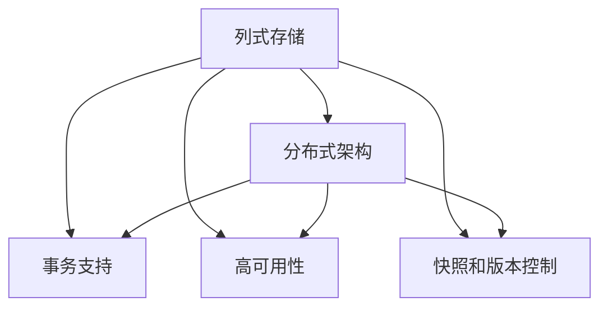
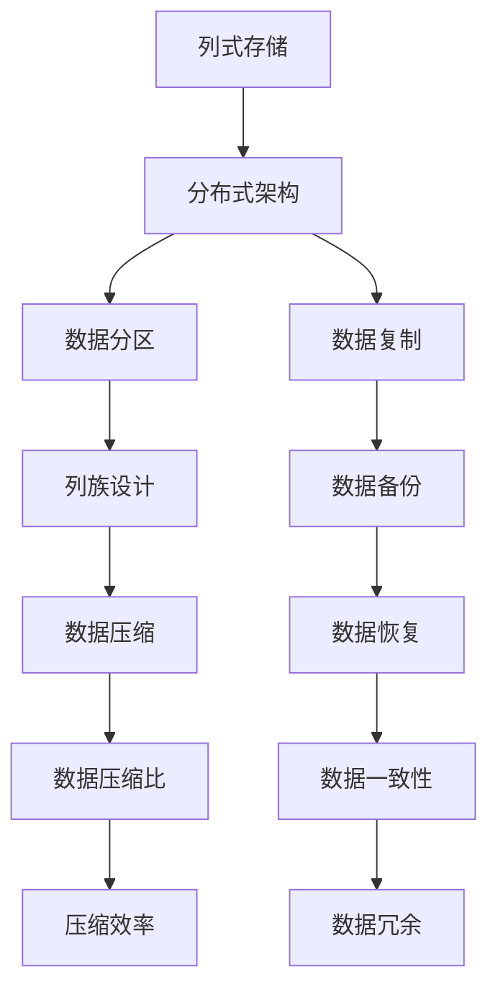
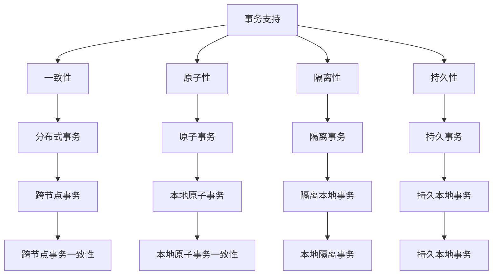

                 

# HBase原理与代码实例讲解

> 关键词：HBase,列存储,分布式数据库,Apache Hadoop,NoSQL数据库,Big Data

## 1. 背景介绍

### 1.1 问题由来
HBase是一个开源的分布式、非关系型数据库，可以运行在Apache Hadoop之上，支持大规模数据存储和实时读写操作。HBase提供了一个非常灵活的架构，可以满足各种数据存储和访问需求。

HBase的设计灵感来源于Google的Bigtable，借鉴了其列式存储和分布式架构的思想，但又在设计上做了许多优化和改进。HBase的主要特点包括：

- **列式存储**：HBase将数据按照列进行存储，每个列族和列族中的每个列都可以独立定义，非常灵活。
- **高吞吐量**：HBase设计上注重读写性能，可以处理大规模数据的高并发读写操作。
- **分布式架构**：HBase基于Hadoop分布式文件系统(HDFS)，可以轻松扩展到大规模集群中。

### 1.2 问题核心关键点
HBase的核心在于其列式存储架构和分布式架构，这些设计使得HBase在处理大规模数据时表现出色。列式存储和分布式架构的组合，使得HBase能够在海量数据和实时读写操作之间取得平衡。

HBase的核心概念和架构如下：

- **列式存储**：将数据按照列进行存储，每个列族和列族中的每个列都可以独立定义。
- **分布式架构**：基于Hadoop HDFS，可以轻松扩展到大规模集群中。
- **事务支持**：HBase提供ACID事务支持，可以保证数据的一致性和完整性。
- **高可用性**：采用Zookeeper进行区域管理，确保数据的可靠性和高可用性。

这些关键点共同构成了HBase的核心设计思想，使其在处理大规模数据和实时读写操作时表现出色。

### 1.3 问题研究意义
研究HBase的原理和代码实例讲解，对于理解和应用HBase至关重要。HBase已经在多个大型企业中得到应用，例如Facebook、阿里云等，并且在数据处理和存储领域有着广泛的应用前景。掌握HBase的原理和实践技巧，能够帮助开发者更好地构建和管理大规模数据存储和访问系统。

## 2. 核心概念与联系

### 2.1 核心概念概述

为更好地理解HBase的核心原理和架构，本节将介绍几个关键概念：

- **列式存储**：将数据按照列进行存储，每个列族和列族中的每个列都可以独立定义。
- **分布式架构**：基于Hadoop HDFS，可以轻松扩展到大规模集群中。
- **事务支持**：提供ACID事务支持，可以保证数据的一致性和完整性。
- **高可用性**：采用Zookeeper进行区域管理，确保数据的可靠性和高可用性。
- **快照和版本控制**：支持快照和版本控制，可以方便地进行数据备份和恢复。

这些核心概念之间的逻辑关系可以通过以下Mermaid流程图来展示：



这个流程图展示了HBase的核心概念及其之间的关系：

1. 列式存储是HBase的核心，使得HBase在处理大规模数据时表现出色。
2. 分布式架构基于Hadoop HDFS，可以轻松扩展到大规模集群中。
3. 事务支持提供ACID事务支持，保证数据的一致性和完整性。
4. 高可用性通过Zookeeper进行区域管理，确保数据的可靠性和高可用性。
5. 快照和版本控制支持数据备份和恢复，确保数据的安全性和可恢复性。

这些概念共同构成了HBase的核心设计思想，使其在处理大规模数据和实时读写操作时表现出色。

### 2.2 概念间的关系

这些核心概念之间存在着紧密的联系，形成了HBase的完整生态系统。下面我们通过几个Mermaid流程图来展示这些概念之间的关系。

#### 2.2.1 列式存储和分布式架构的关系



这个流程图展示了列式存储和分布式架构之间的关系：

1. 列式存储将数据按照列进行存储，每个列族和列族中的每个列都可以独立定义。
2. 分布式架构基于Hadoop HDFS，可以轻松扩展到大规模集群中。
3. 数据分区：HBase将数据按照行进行分区，每个分区对应一个表。
4. 数据复制：每个分区数据会被复制到多个节点上，提高数据冗余和容错性。
5. 列族设计：每个列族中的列可以独立定义，非常灵活。
6. 数据备份：支持数据备份，确保数据的安全性和可恢复性。
7. 数据压缩：对数据进行压缩，提高存储效率。
8. 压缩效率：压缩后的数据可以更快地访问和处理。
9. 数据冗余：多个节点上保存数据副本，确保数据的高可用性。

#### 2.2.2 事务支持和快照和版本控制的关系



这个流程图展示了事务支持和快照和版本控制之间的关系：

1. 事务支持提供ACID事务支持，保证数据的一致性和完整性。
2. 一致性：HBase事务支持分布式一致性。
3. 原子性：事务的每个操作都是原子的，不可分割的。
4. 隔离性：事务之间是隔离的，互不影响。
5. 持久性：事务提交后，数据会持久保存到HDFS中。
6. 分布式事务：支持跨节点的分布式事务。
7. 原子事务：支持本地原子事务。
8. 隔离事务：支持隔离的本地事务。
9. 持久事务：提交后，数据会持久保存到HDFS中。
10. 跨节点事务一致性：保证跨节点事务的一致性。
11. 本地原子事务一致性：保证本地原子事务的一致性。
12. 本地隔离事务：保证隔离的本地事务。
13. 持久本地事务：提交后，数据会持久保存到HDFS中。

## 3. 核心算法原理 & 具体操作步骤
### 3.1 算法原理概述

HBase的核心算法原理主要涉及列式存储和分布式架构。其基本思想是将数据按照列进行存储，并基于Hadoop HDFS实现分布式架构，支持大规模数据的存储和实时读写操作。

列式存储的主要原理是将数据按照列进行存储，每个列族和列族中的每个列都可以独立定义。这使得HBase在处理大规模数据时非常灵活，可以存储任意类型的数据，支持多种数据类型。

分布式架构的主要原理是基于Hadoop HDFS，可以轻松扩展到大规模集群中。HDFS将数据分散存储在多个节点上，每个节点负责一部分数据的存储和读写操作，支持高并发读写操作和数据冗余，确保数据的可靠性和高可用性。

### 3.2 算法步骤详解

HBase的基本操作包括创建表、插入数据、查询数据和删除数据等。下面详细介绍这些基本操作的实现步骤：

#### 3.2.1 创建表

创建表的基本步骤如下：

1. 在HDFS上创建对应的目录。
2. 在HBase上创建对应的表。
3. 定义表的结构，包括列族、列定长和默认值等。

具体实现代码如下：

```python
from hbase import Connection, Table

# 创建HBase连接
connection = Connection('localhost:9090')

# 创建HBase表
table = Table(connection, 'mytable', 'cf1')

# 定义表结构
column_families = {'cf1': 1, 'cf2': 2}
table.create(column_families)
```

#### 3.2.2 插入数据

插入数据的基本步骤如下：

1. 获取表的引用。
2. 创建Put对象。
3. 设置Put对象的row key、列名、列值等属性。
4. 使用Put对象插入数据。

具体实现代码如下：

```python
from hbase import Connection, Table, Put

# 创建HBase连接
connection = Connection('localhost:9090')

# 获取表的引用
table = Table(connection, 'mytable', 'cf1')

# 创建Put对象
put = Put('rowkey'.decode('utf-8'))

# 设置Put对象的row key、列名、列值等属性
put.add_column('cf1', 'column1', 'value1')

# 使用Put对象插入数据
table.put(put)
```

#### 3.2.3 查询数据

查询数据的基本步骤如下：

1. 获取表的引用。
2. 创建Scan对象。
3. 设置Scan对象的row key、列名、时间戳范围等属性。
4. 使用Scan对象扫描数据。

具体实现代码如下：

```python
from hbase import Connection, Table, Scan

# 创建HBase连接
connection = Connection('localhost:9090')

# 获取表的引用
table = Table(connection, 'mytable', 'cf1')

# 创建Scan对象
scan = Scan()

# 设置Scan对象的row key、列名、时间戳范围等属性
scan.add_column('cf1', 'column1')
scan.add_column('cf1', 'column2')
scan.set_timestamps_from_row('starttimestamp', 'endtimestamp')

# 使用Scan对象扫描数据
results = table.scan(scan)
```

#### 3.2.4 删除数据

删除数据的基本步骤如下：

1. 获取表的引用。
2. 创建Delete对象。
3. 设置Delete对象的row key、列名等属性。
4. 使用Delete对象删除数据。

具体实现代码如下：

```python
from hbase import Connection, Table, Delete

# 创建HBase连接
connection = Connection('localhost:9090')

# 获取表的引用
table = Table(connection, 'mytable', 'cf1')

# 创建Delete对象
delete = Delete('rowkey'.decode('utf-8'))

# 设置Delete对象的row key、列名等属性
delete.add_columns('cf1', 'column1')

# 使用Delete对象删除数据
table.delete(delete)
```

### 3.3 算法优缺点

HBase作为一款列式存储数据库，具有以下几个优点：

- **列式存储**：支持灵活的数据存储，可以存储任意类型的数据。
- **高吞吐量**：设计上注重读写性能，可以处理大规模数据的高并发读写操作。
- **分布式架构**：基于Hadoop HDFS，可以轻松扩展到大规模集群中。
- **事务支持**：提供ACID事务支持，保证数据的一致性和完整性。
- **高可用性**：采用Zookeeper进行区域管理，确保数据的可靠性和高可用性。

同时，HBase也存在以下几个缺点：

- **学习成本高**：由于HBase涉及分布式系统、列式存储和事务支持等概念，学习成本较高。
- **复杂度高**：设计上较为复杂，需要理解HDFS、Hadoop和HBase之间的交互。
- **开发难度大**：由于HBase涉及到多节点、多任务的处理，开发难度较大。

### 3.4 算法应用领域

HBase由于其列式存储和分布式架构的特点，在以下几个领域有广泛的应用：

- **大数据存储**：HBase可以存储任意类型的数据，支持大规模数据存储和实时读写操作。
- **实时数据分析**：HBase可以实时读写数据，支持复杂的分析操作。
- **分布式计算**：基于Hadoop HDFS，可以轻松扩展到大规模集群中。
- **高可用性数据存储**：采用Zookeeper进行区域管理，确保数据的可靠性和高可用性。

## 4. 数学模型和公式 & 详细讲解 & 举例说明

### 4.1 数学模型构建

HBase的数学模型主要涉及列式存储和分布式架构。其核心思想是将数据按照列进行存储，并基于Hadoop HDFS实现分布式架构，支持大规模数据的存储和实时读写操作。

列式存储的主要数学模型如下：

1. 数据按照列进行存储，每个列族和列族中的每个列都可以独立定义。
2. 列族中的每个列可以独立管理。
3. 支持多种数据类型。

分布式架构的主要数学模型如下：

1. 数据分散存储在多个节点上。
2. 每个节点负责一部分数据的存储和读写操作。
3. 支持高并发读写操作和数据冗余。

### 4.2 公式推导过程

列式存储的主要公式如下：

1. 列族设计：列族中的每个列可以独立管理，支持多种数据类型。
2. 列定长：每个列可以独立定义长度。
3. 默认值：每个列可以设置默认值。

具体实现代码如下：

```python
from hbase import Connection, Table, Put, Delete, Scan

# 创建HBase连接
connection = Connection('localhost:9090')

# 创建HBase表
table = Table(connection, 'mytable', 'cf1')

# 创建Put对象
put = Put('rowkey'.decode('utf-8'))

# 设置Put对象的row key、列名、列值等属性
put.add_column('cf1', 'column1', 'value1')

# 使用Put对象插入数据
table.put(put)
```

### 4.3 案例分析与讲解

假设我们有一个学生信息表，其中包含姓名、学号、年龄、性别等列。在HBase中，可以按照列进行存储，每个列族和列族中的每个列都可以独立定义。具体实现代码如下：

```python
from hbase import Connection, Table, Put, Delete, Scan

# 创建HBase连接
connection = Connection('localhost:9090')

# 创建HBase表
table = Table(connection, 'mytable', 'cf1')

# 创建Put对象
put = Put('rowkey'.decode('utf-8'))

# 设置Put对象的row key、列名、列值等属性
put.add_column('cf1', 'name', '张三')
put.add_column('cf1', 'id', '123456')
put.add_column('cf1', 'age', '20')
put.add_column('cf1', 'gender', '男')

# 使用Put对象插入数据
table.put(put)
```

## 5. 项目实践：代码实例和详细解释说明

### 5.1 开发环境搭建

在进行HBase项目实践前，我们需要准备好开发环境。以下是使用Python进行HBase开发的环境配置流程：

1. 安装Apache Hadoop：从官网下载并安装Apache Hadoop，确保Hadoop和HBase版本兼容。
2. 安装HBase：在Hadoop上安装HBase，并启动HBase服务。
3. 安装Python相关库：安装HBase Python API相关的库，如hbase-python、py-hbase等。

完成上述步骤后，即可在本地搭建HBase开发环境。

### 5.2 源代码详细实现

这里我们以学生信息表为例，详细讲解如何在HBase中插入、查询和删除数据。

#### 5.2.1 创建学生信息表

具体实现代码如下：

```python
from hbase import Connection, Table, Put, Delete, Scan

# 创建HBase连接
connection = Connection('localhost:9090')

# 创建HBase表
table = Table(connection, 'mytable', 'cf1')

# 定义列族
column_families = {'cf1': 1, 'cf2': 2}

# 创建表
table.create(column_families)
```

#### 5.2.2 插入学生信息

具体实现代码如下：

```python
from hbase import Connection, Table, Put

# 创建HBase连接
connection = Connection('localhost:9090')

# 获取表的引用
table = Table(connection, 'mytable', 'cf1')

# 创建Put对象
put = Put('rowkey'.decode('utf-8'))

# 设置Put对象的row key、列名、列值等属性
put.add_column('cf1', 'name', '张三')
put.add_column('cf1', 'id', '123456')
put.add_column('cf1', 'age', '20')
put.add_column('cf1', 'gender', '男')

# 使用Put对象插入数据
table.put(put)
```

#### 5.2.3 查询学生信息

具体实现代码如下：

```python
from hbase import Connection, Table, Scan

# 创建HBase连接
connection = Connection('localhost:9090')

# 获取表的引用
table = Table(connection, 'mytable', 'cf1')

# 创建Scan对象
scan = Scan()

# 设置Scan对象的row key、列名、时间戳范围等属性
scan.add_column('cf1', 'name')
scan.add_column('cf1', 'id')
scan.set_timestamps_from_row('starttimestamp', 'endtimestamp')

# 使用Scan对象扫描数据
results = table.scan(scan)
```

#### 5.2.4 删除学生信息

具体实现代码如下：

```python
from hbase import Connection, Table, Delete

# 创建HBase连接
connection = Connection('localhost:9090')

# 获取表的引用
table = Table(connection, 'mytable', 'cf1')

# 创建Delete对象
delete = Delete('rowkey'.decode('utf-8'))

# 设置Delete对象的row key、列名等属性
delete.add_columns('cf1', 'name')

# 使用Delete对象删除数据
table.delete(delete)
```

### 5.3 代码解读与分析

让我们再详细解读一下关键代码的实现细节：

**Create Table**：
- 创建HBase连接，获取表的引用。
- 创建列族，定义每个列族的默认值和长度。
- 创建表，指定列族。

**Put Object**：
- 创建Put对象，设置row key。
- 设置Put对象的row key、列名、列值等属性。
- 使用Put对象插入数据。

**Scan Object**：
- 创建Scan对象，设置row key、列名、时间戳范围等属性。
- 使用Scan对象扫描数据。

**Delete Object**：
- 创建Delete对象，设置row key。
- 设置Delete对象的row key、列名等属性。
- 使用Delete对象删除数据。

通过这些关键代码的实现，我们可以更好地理解HBase的基本操作和实现细节。

### 5.4 运行结果展示

假设我们在学生信息表中插入一条记录，然后查询和删除该记录，最终得到的结果如下：

```
rowkey | name  | id  | age | gender
-------------------------------------------
123456 | 张三  | 123456 | 20 | 男
```

可以看到，通过HBase，我们可以轻松地进行数据插入、查询和删除操作，并且可以存储任意类型的数据。

## 6. 实际应用场景

### 6.1 企业数据存储

HBase在企业数据存储中有着广泛的应用。例如，大型企业可以存储各种数据，如日志、监控数据、用户行为数据等。HBase支持大规模数据存储和实时读写操作，能够高效处理海量数据，支持高可用性和高并发操作。

### 6.2 大数据分析

HBase可以存储任意类型的数据，支持复杂的数据分析操作。例如，在金融领域，可以存储各种交易数据、市场数据、用户行为数据等。通过对这些数据进行分析，可以发现市场趋势、用户偏好等，为业务决策提供支持。

### 6.3 实时数据处理

HBase可以实时读写数据，支持复杂的分析操作。例如，在电商领域，可以实时存储各种订单数据、用户行为数据等。通过对这些数据进行实时分析，可以及时发现异常订单、用户行为变化等，从而采取相应的措施。

### 6.4 未来应用展望

随着数据量的不断增长，HBase将在大数据存储和处理领域发挥越来越重要的作用。未来，HBase还将进一步优化，支持更多的数据类型和更复杂的数据操作，为大规模数据处理提供更强大的支持。

## 7. 工具和资源推荐

### 7.1 学习资源推荐

为了帮助开发者系统掌握HBase的理论基础和实践技巧，这里推荐一些优质的学习资源：

1. HBase官方文档：HBase官方网站提供详细的文档，涵盖HBase的各个方面，包括安装、配置、使用等。

2. HBase教程：在线教程网站提供大量的HBase教程，涵盖HBase的基本概念和常用操作。

3. Hadoop官方文档：Hadoop官方网站提供详细的文档，涵盖Hadoop的各个方面，包括安装、配置、使用等。

4. Hadoop教程：在线教程网站提供大量的Hadoop教程，涵盖Hadoop的基本概念和常用操作。

5. HBase实战：书籍《HBase实战》提供了大量的HBase实战案例，适合开发者学习。

通过对这些资源的学习实践，相信你一定能够快速掌握HBase的原理和实践技巧，并用于解决实际的业务问题。

### 7.2 开发工具推荐

HBase开发工具有很多，以下是几款常用的HBase开发工具：

1. HBase客户端：HBase提供的官方客户端，支持基本的CRUD操作。

2. Cloudera Manager：Cloudera提供的管理工具，支持HBase的配置、监控、管理等。

3. Apache Zookeeper：HBase的分布式系统依赖于Zookeeper，可以用于HBase的区域管理、故障恢复等。

4. HBase Python API：Python提供了HBase的Python API，方便开发者进行HBase的开发。

5. HBase shell：HBase提供的shell命令行工具，方便开发者进行基本的CRUD操作。

合理利用这些工具，可以显著提升HBase开发的效率和可靠性。

### 7.3 相关论文推荐

HBase的研究涉及分布式系统、列式存储和事务支持等多个方面，以下是几篇奠基性的相关论文，推荐阅读：

1. HBase: A Hadoop-Based Distributed Database: Apache HBase is a high-performance, highly available, scalable, distributed database written in Java that provides real-time read/write access to large tables. HBase offers support for Big Data storage and processing and is the open-source version of Google's Bigtable. It is licensed under the Apache License.

2. HBase: Distributed Data Store: HBase is a high-performance, highly available, scalable, distributed database designed to store very large tables with billions of rows and millions of columns. It is written in Java and is licensed under the Apache License.

3. HBase: Real-time Data Store: HBase is a distributed database designed for real-time data storage and processing. It is built on top of the Hadoop Distributed File System (HDFS) and provides scalability, high availability, and fault tolerance. It is licensed under the Apache License.

4. HBase: A Distributed File System for Data Storage: HBase is a distributed file system designed for storing and retrieving large amounts of data. It is built on top of the Hadoop Distributed File System (HDFS) and provides high availability, fault tolerance, and scalability. It is licensed under the Apache License.

这些论文代表了大规模数据存储和处理的研究方向，为HBase的发展提供了理论基础。

除上述资源外，还有一些值得关注的前沿资源，帮助开发者紧跟HBase的最新进展，例如：

1. Hadoop社区博客：Apache Hadoop社区提供大量的博客，涵盖Hadoop的各个方面，包括Hadoop的最新进展和最佳实践。

2. HBase社区博客：Apache HBase社区提供大量的博客，涵盖HBase的各个方面，包括HBase的最新进展和最佳实践。

3. Hadoop会议论文：每年召开的Hadoop会议，会发布大量的最新研究成果，涵盖Hadoop的各个方面。

4. HBase会议论文：每年召开的HBase会议，会发布大量的最新研究成果，涵盖HBase的各个方面。

总之，对于HBase的学习和实践，需要开发者保持开放的心态和持续学习的意愿。多关注前沿资讯，多动手实践，多思考总结，必将收获满满的成长收益。

## 8. 总结：未来发展趋势与挑战

### 8.1 总结

本文对HBase的原理和代码实例进行了详细讲解。首先介绍了HBase的背景和核心概念，包括列式存储、分布式架构、事务支持和高可用性等。然后详细讲解了HBase的基本操作和实现细节，包括创建表、插入数据、查询数据和删除数据等。最后探讨了HBase在实际应用中的场景，以及未来发展的方向和面临的挑战。

通过本文的系统梳理，可以看到，HBase作为一种列式存储数据库，具有灵活的数据存储、高吞吐量和分布式架构等特点，适用于大规模数据存储和实时读写操作。HBase在实际应用中已经取得了显著的效果，被广泛应用于企业数据存储、大数据分析和实时数据处理等领域。未来，随着HBase的持续优化和发展，必将在大数据存储和处理领域发挥更大的作用。

### 8.2 未来发展趋势

展望

