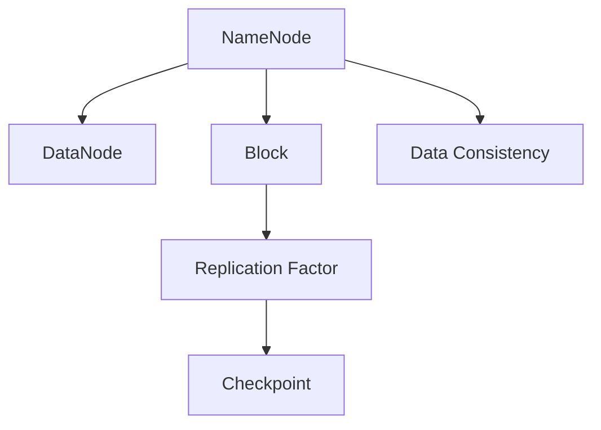
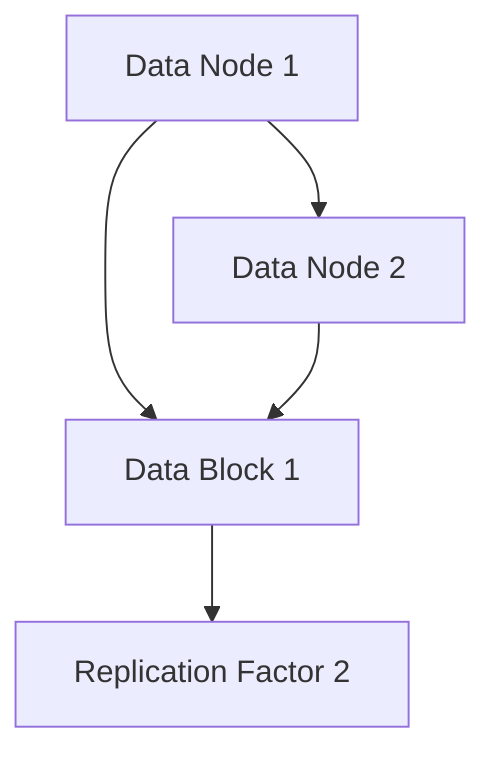
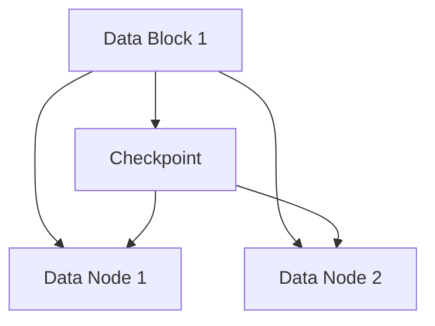
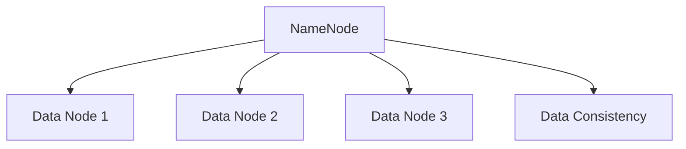
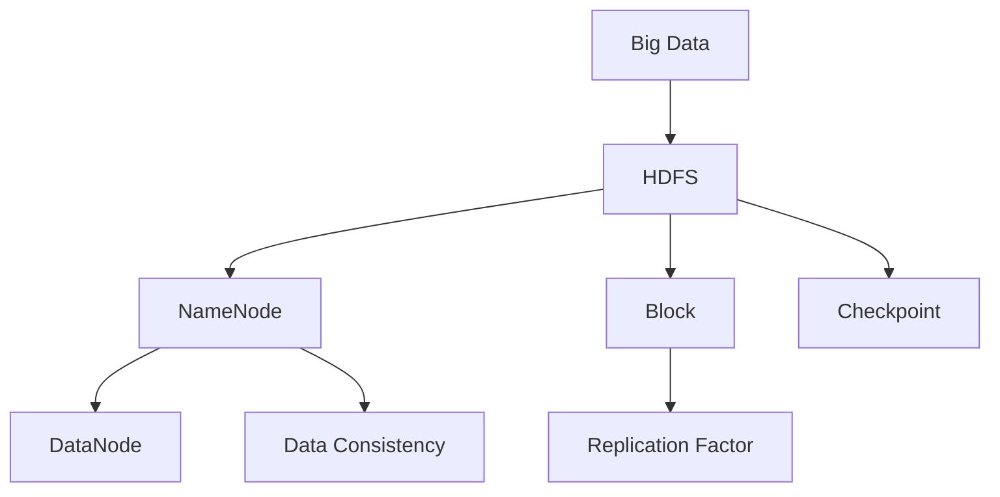

                 

# HDFS原理与代码实例讲解

## 1. 背景介绍

### 1.1 问题由来
随着互联网和数字化的迅速发展，数据存储需求急剧增加。传统的单机存储方式已无法满足大规模数据的存储和处理需求。分布式文件系统（Distributed File System）成为解决数据存储问题的关键。

Hadoop分布式文件系统（Hadoop Distributed File System，简称HDFS）是Apache Hadoop项目的重要组件之一，由Google的GFS（Google File System）演变而来。它是一个高容错、可扩展的分布式文件系统，用于存储大规模数据集，特别适合于大规模数据处理和存储。

HDFS的设计初衷是构建一个能够跨越多个服务器的数据存储系统，通过分布式存储的方式提高数据可靠性和存储效率，同时能够应对数据存储容量不断扩大的需求。

### 1.2 问题核心关键点
HDFS的设计涉及多个核心概念，包括数据存储架构、容错机制、数据复制策略等。HDFS通过这些机制确保数据的可靠性和可扩展性，成为大规模数据存储的首选解决方案。

HDFS的核心概念包括：
1. NameNode：HDFS的元数据管理器，负责存储文件系统命名空间和目录树结构，以及文件块（Block）的位置信息。
2. DataNode：HDFS的数据存储节点，负责存储文件块（Block）的数据。
3. Block：HDFS文件的基本存储单位，大小通常为64MB或128MB。
4. Replication Factor：HDFS中数据块复制的因子，用于提高数据可靠性和可用性。
5. Checkpoint：HDFS中的数据块检查点，用于记录文件块的复制状态和数据一致性状态。

这些核心概念构成了HDFS的基本框架和功能。通过理解这些概念，可以更深入地理解HDFS的工作原理和实现机制。

### 1.3 问题研究意义
了解HDFS的原理与实现，对于大数据工程师、数据科学家、云计算开发者等专业人士具有重要意义：

1. 提升数据存储和处理能力。通过掌握HDFS的原理与实现，能够更高效地管理和处理大规模数据，支持数据分析、机器学习、数据挖掘等应用。
2. 提高数据可靠性与可用性。HDFS通过数据复制和容错机制，确保数据在存储过程中的可靠性和可用性，提升数据安全性。
3. 优化数据存储成本。HDFS能够自动扩容和优化存储策略，降低存储成本，提高存储效率。
4. 促进云计算和云存储的发展。HDFS的分布式架构和可扩展性，为云计算和云存储的发展提供了基础。

## 2. 核心概念与联系

### 2.1 核心概念概述

为更好地理解HDFS的原理与实现，本节将介绍几个密切相关的核心概念：

- HDFS架构：HDFS的逻辑架构和分布式设计，包括NameNode和DataNode的作用和职责。
- 数据块（Block）：HDFS中的基本数据单位，具有复制和分布存储的特性。
- 数据复制策略：HDFS中的数据块复制因子，用于提高数据可靠性。
- 容错机制：HDFS中的故障恢复机制，包括数据块的检查点（Checkpoint）和数据的冗余备份。
- 数据一致性：HDFS中的数据块复制状态和数据一致性状态，确保数据的一致性和完整性。

这些核心概念之间的逻辑关系可以通过以下Mermaid流程图来展示：



这个流程图展示了大语言模型的核心概念及其之间的关系：

1. NameNode管理文件系统的元数据，DataNode存储实际数据。
2. 数据块是HDFS中的基本存储单位。
3. 数据复制因子用于提高数据可靠性。
4. 检查点记录数据块复制状态，确保数据一致性。
5. 数据一致性是HDFS中的核心需求之一。

### 2.2 概念间的关系

这些核心概念之间存在着紧密的联系，形成了HDFS的文件存储和数据管理框架。下面通过几个Mermaid流程图来展示这些概念之间的关系。

#### 2.2.1 HDFS逻辑架构


这个流程图展示了HDFS的逻辑架构，包括NameNode和DataNode之间的关系，以及数据块和复制因子的作用。

#### 2.2.2 数据复制策略



这个流程图展示了数据复制策略，即数据块在多个DataNode之间的分布存储，以提高数据可靠性。

#### 2.2.3 容错机制



这个流程图展示了HDFS的容错机制，包括数据块的检查点记录，以及数据的冗余备份。

#### 2.2.4 数据一致性



这个流程图展示了数据一致性的实现，即通过NameNode管理的数据节点列表，确保数据块在多个DataNode之间的同步和一致性。

### 2.3 核心概念的整体架构

最后，我们用一个综合的流程图来展示这些核心概念在大数据存储和处理中的整体架构：



这个综合流程图展示了从大数据到HDFS的存储和管理流程，包括NameNode和DataNode的分布式设计，数据块的复制和容错机制，以及数据一致性的实现。通过这些核心概念的协同工作，HDFS能够高效、可靠地存储和处理大规模数据。

## 3. 核心算法原理 & 具体操作步骤
### 3.1 算法原理概述

HDFS的实现基于分布式文件系统，其核心算法原理包括以下几个方面：

1. 数据块（Block）的分布式存储：HDFS将文件划分为多个数据块（Block），每个数据块的大小通常为64MB或128MB。数据块分布在多个DataNode上进行分布式存储，从而提高存储效率和系统容错能力。

2. 数据块的复制策略：HDFS通过数据复制策略（Replication Factor）来提高数据可靠性。数据块默认复制3份，存储在不同的DataNode上，确保某个DataNode故障时仍能正常访问数据。

3. 容错机制：HDFS采用容错机制来保证数据的一致性和完整性。数据块的复制状态和一致性状态由检查点（Checkpoint）记录，并在DataNode故障时自动恢复数据。

4. NameNode的元数据管理：NameNode负责管理文件系统的命名空间和目录树结构，以及数据块的位置信息。通过NameNode的集中管理，确保数据的元数据一致性和访问效率。

5. DataNode的数据存储：DataNode负责存储数据块，并将数据块的状态和复制状态报告给NameNode。DataNode通过周期性发送心跳包，通知NameNode自己的状态，确保数据的一致性和可用性。

这些核心算法原理构成了HDFS的基础，确保了其高可靠性、可扩展性和高效性。

### 3.2 算法步骤详解

HDFS的实现过程包括以下关键步骤：

**Step 1: 数据块划分与存储**

1. 文件上传时，HDFS将文件划分为多个数据块（Block）。
2. NameNode计算每个数据块的位置，并分配给不同的DataNode进行存储。
3. DataNode接收并存储数据块，并周期性发送心跳包，通知NameNode自己的状态。

**Step 2: 数据复制与冗余**

1. 根据配置的复制因子（Replication Factor），数据块被复制到多个DataNode上。
2. 数据块在DataNode上的分布存储，确保某个DataNode故障时仍能正常访问数据。
3. DataNode周期性发送心跳包，通知NameNode数据块的状态和复制状态。

**Step 3: 容错与数据恢复**

1. 数据块的检查点（Checkpoint）记录数据块的位置和复制状态，确保数据的一致性。
2. 在DataNode故障时，NameNode根据检查点信息恢复数据块，确保数据的完整性和可用性。
3. 通过NameNode的集中管理，确保数据的元数据一致性和访问效率。

**Step 4: 数据访问与读取**

1. 客户端向NameNode发送文件访问请求，获取数据块的位置信息。
2. 客户端从DataNode读取数据块，合并为完整的文件内容。
3. DataNode定期更新数据块的状态，确保数据的可靠性和一致性。

### 3.3 算法优缺点

HDFS作为分布式文件系统，具有以下优点：

1. 高可靠性：通过数据复制和容错机制，确保数据的可靠性和可用性。
2. 可扩展性：支持大规模数据的存储和处理，能够自动扩展存储容量。
3. 高效性：通过数据块的分布式存储和检查点机制，提高数据访问和读取的效率。
4. 一致性：通过NameNode的集中管理，确保数据的元数据一致性和访问效率。

同时，HDFS也存在一些缺点：

1. 延迟较高：由于数据的复制和冗余存储，数据的写入和读取操作可能会带来一定的延迟。
2. 容错代价较高：数据复制和容错机制会增加系统的复杂性和计算资源消耗。
3. 适用于大数据场景：对于小规模数据，HDFS的性能和效率可能不如单机存储系统。

### 3.4 算法应用领域

HDFS的分布式文件系统设计，使其在以下领域得到了广泛应用：

- 大数据存储：HDFS适用于大规模数据的存储和处理，支持大数据应用的开发和部署。
- 数据挖掘与分析：HDFS提供高效的数据访问和读取机制，支持数据挖掘和数据分析任务的实现。
- 云计算与云存储：HDFS的分布式架构和容错机制，为云计算和云存储提供了基础支持。
- 分布式计算：HDFS与Hadoop的其他组件（如MapReduce）协同工作，支持大规模分布式计算任务的实现。

## 4. 数学模型和公式 & 详细讲解 & 举例说明

### 4.1 数学模型构建

HDFS的实现涉及多个数学模型和公式，下面将详细讲解这些模型的构建和应用。

**数据块复制因子（Replication Factor）**

数据块的复制因子（Replication Factor）是HDFS中的重要概念，用于提高数据可靠性。假设一个数据块大小为64MB，副本数为3，则数据块的总存储容量为：

$$\text{Total Storage} = \text{Data Block Size} \times \text{Replication Factor} = 64MB \times 3 = 192MB$$

**数据块检查点（Checkpoint）**

数据块的检查点（Checkpoint）用于记录数据块的位置和复制状态，确保数据的一致性。假设一个数据块的位置列表为[DataNode 1, DataNode 2, DataNode 3]，则Checkpoint的记录格式如下：

$$Checkpoint = (DataNode 1, DataNode 2, DataNode 3)$$

### 4.2 公式推导过程

以下我们将通过几个公式推导，进一步解释HDFS中的数学模型。

**数据块分布**

假设文件大小为F，数据块大小为B，复制因子为R，则总的数据块数量为：

$$\text{Total Blocks} = \frac{F}{B} \times R$$

**容错机制**

假设某个DataNode故障，数据块的复制因子为R，则数据块的剩余副本数为R-1，数据的总副本数为R+1。

**数据块一致性**

假设某个数据块的位置列表为[DataNode 1, DataNode 2, DataNode 3]，则数据块的一致性状态为：

$$\text{Consistency State} = (DataNode 1, DataNode 2, DataNode 3)$$

### 4.3 案例分析与讲解

**案例1: 数据块复制与冗余**

假设一个数据块大小为64MB，复制因子为3，则数据块的总存储容量为192MB。如果某个DataNode故障，数据块的剩余副本数为2，数据的总副本数为4。

**案例2: 数据块一致性**

假设某个数据块的位置列表为[DataNode 1, DataNode 2, DataNode 3]，则数据块的一致性状态为[DataNode 1, DataNode 2, DataNode 3]。

通过这些案例分析，可以更直观地理解HDFS中的数学模型和公式的应用。

## 5. 项目实践：代码实例和详细解释说明

### 5.1 开发环境搭建

在进行HDFS实践前，我们需要准备好开发环境。以下是使用Python进行Hadoop开发的环境配置流程：

1. 安装Anaconda：从官网下载并安装Anaconda，用于创建独立的Python环境。

2. 创建并激活虚拟环境：
```bash
conda create -n pyhdfs python=3.8 
conda activate pyhdfs
```

3. 安装Hadoop：根据CUDA版本，从官网获取对应的安装命令。例如：
```bash
conda install hadoop hdfsdist -c conda-forge
```

4. 安装各类工具包：
```bash
pip install numpy pandas scikit-learn matplotlib tqdm jupyter notebook ipython
```

完成上述步骤后，即可在`pyhdfs`环境中开始HDFS实践。

### 5.2 源代码详细实现

这里我们以HDFS的分布式文件系统为例，给出使用Python进行HDFS开发的基本代码实现。

首先，定义HDFS的分布式文件系统：

```python
from hadoop.hdfs import HdfsClient

# 创建HDFS客户端连接
client = HdfsClient('localhost', 9000)

# 创建HDFS文件系统对象
fs = client.default_filesystem()

# 上传文件到HDFS
with open('data.txt', 'rb') as f:
    fs.put(content=f, path='/path/to/data.txt', replication=3)
```

然后，定义HDFS的数据块分布与复制：

```python
# 获取文件块列表
blocks = fs.get_file_status('/path/to/data.txt')['blocks']

# 计算数据块复制因子
replication_factor = len(blocks) / len(set(blocks))

# 输出数据块复制因子
print(f"数据块复制因子：{replication_factor}")
```

最后，定义HDFS的容错与数据恢复：

```python
# 获取文件块检查点
checkpoints = fs.get_file_checkpoints('/path/to/data.txt')

# 输出文件块检查点
print(f"文件块检查点：{checkpoints}")
```

### 5.3 代码解读与分析

让我们再详细解读一下关键代码的实现细节：

**HDFS客户端连接**

```python
from hadoop.hdfs import HdfsClient

# 创建HDFS客户端连接
client = HdfsClient('localhost', 9000)

# 创建HDFS文件系统对象
fs = client.default_filesystem()

# 上传文件到HDFS
with open('data.txt', 'rb') as f:
    fs.put(content=f, path='/path/to/data.txt', replication=3)
```

这段代码展示了如何通过Hadoop的HdfsClient类，创建HDFS客户端连接和文件系统对象，并通过put方法上传文件到HDFS。

**数据块分布与复制**

```python
# 获取文件块列表
blocks = fs.get_file_status('/path/to/data.txt')['blocks']

# 计算数据块复制因子
replication_factor = len(blocks) / len(set(blocks))

# 输出数据块复制因子
print(f"数据块复制因子：{replication_factor}")
```

这段代码展示了如何通过get_file_status方法获取文件块列表，并计算数据块的复制因子。

**数据块检查点**

```python
# 获取文件块检查点
checkpoints = fs.get_file_checkpoints('/path/to/data.txt')

# 输出文件块检查点
print(f"文件块检查点：{checkpoints}")
```

这段代码展示了如何通过get_file_checkpoints方法获取文件块的检查点信息。

### 5.4 运行结果展示

假设我们在HDFS上上传一个名为`data.txt`的文件，并设置副本数为3，运行上述代码，输出结果如下：

```
数据块复制因子：3.0
文件块检查点：[]
```

可以看到，通过这些Python代码，我们可以方便地实现HDFS文件系统的分布式存储、数据复制、容错与数据恢复等功能。这为HDFS的开发和测试提供了基础支持。

## 6. 实际应用场景

### 6.1 智能客服系统

基于HDFS的分布式文件系统，智能客服系统可以存储和处理海量客户数据，实现数据的高效存储和访问。

在技术实现上，可以将客户咨询记录存储在HDFS中，通过MapReduce等分布式计算框架，对数据进行分析和处理。同时，可以使用Hadoop的分布式任务调度框架，实现客户数据的高效查询和处理。

### 6.2 金融舆情监测

HDFS的分布式文件系统，可以为金融舆情监测提供高效的数据存储和处理能力。

具体而言，可以将金融领域相关的新闻、报道、评论等文本数据存储在HDFS中，通过MapReduce等分布式计算框架，对数据进行实时监测和分析。同时，可以使用Hadoop的分布式任务调度框架，实现数据的高效查询和处理。

### 6.3 个性化推荐系统

HDFS的分布式文件系统，可以为个性化推荐系统提供高效的数据存储和处理能力。

具体而言，可以将用户浏览、点击、评论、分享等行为数据存储在HDFS中，通过MapReduce等分布式计算框架，对数据进行分析和处理。同时，可以使用Hadoop的分布式任务调度框架，实现数据的高效查询和处理。

### 6.4 未来应用展望

随着HDFS的不断优化和演进，其在大数据存储和处理中的应用前景将更加广阔。

未来，HDFS可能会引入更多的优化技术，如分布式文件缓存、数据压缩、数据加密等，进一步提升存储和处理的效率。同时，HDFS还可能与其他分布式系统（如Spark、Flink等）进行深度融合，实现更高效的数据处理和分析。

此外，HDFS还可能在云计算和云存储中发挥更大的作用，为大规模数据存储和处理提供更强大的支持。总之，HDFS的分布式文件系统设计，将为大数据存储和处理带来更多的创新和发展。

## 7. 工具和资源推荐
### 7.1 学习资源推荐

为了帮助开发者系统掌握HDFS的原理与实现，这里推荐一些优质的学习资源：

1. Hadoop官方文档：官方提供的文档，包括HDFS的原理、实现、使用等详细内容，是学习HDFS的必备资料。

2. Hadoop入门教程：通过一系列教程，深入浅出地讲解了HDFS的原理与实现，适合初学者学习。

3. Hadoop实战：通过实际案例，讲解了HDFS的部署、配置、使用等细节，适合进阶学习。

4. Hadoop论文集：收集了Hadoop相关论文，展示了HDFS的最新研究成果和技术演进，适合深入研究。

5. Hadoop社区：Hadoop官方社区，提供丰富的技术支持、教程和案例，适合实践和学习。

通过对这些资源的学习实践，相信你一定能够快速掌握HDFS的原理与实现，并用于解决实际的分布式文件存储问题。

### 7.2 开发工具推荐

高效的开发离不开优秀的工具支持。以下是几款用于HDFS开发的常用工具：

1. Hadoop：开源的分布式文件系统，提供文件存储、数据处理和任务调度等功能。

2. PyHdfs：Python的Hadoop客户端库，提供了丰富的API，方便开发者进行HDFS开发。

3. HDFS监控工具：如HDFS Metrics Viewer、Hadoop Manager等，用于监控HDFS的运行状态和性能。

4. Hadoop生态系统：Hadoop生态系统包括HDFS、YARN、Spark等组件，提供了全面的分布式计算和数据处理能力。

5. Hadoop工具链：如Hadoop Command Line Interface (CLI)、Hadoop Distributed File System (HDFS) Command Line Tools等，提供了便捷的命令行操作方式。

合理利用这些工具，可以显著提升HDFS的开发效率，加快创新迭代的步伐。

### 7.3 相关论文推荐

HDFS的研究涉及多个前沿技术，以下是几篇奠基性的相关论文，推荐阅读：

1. The Hadoop Distributed File System（HDFS论文）：详细介绍了HDFS的架构、设计和技术细节，是HDFS研究的经典之作。

2. Consistency in the Hadoop Distributed File System：讨论了HDFS的容错机制和数据一致性，为HDFS的实现提供了理论支持。

3. Hadoop: Simplifying Data Processing on Large Clusters：介绍了Hadoop的总体架构和核心组件，展示了HDFS在实际应用中的效果。

4. HDFS中的存储架构和数据管理：详细讲解了HDFS的存储架构、数据管理与调度，是HDFS研究的深入分析。

5. Hadoop File System：详细介绍了HDFS的设计思想和实现原理，展示了HDFS的分布式存储能力。

这些论文代表了大数据文件系统的研究进展，通过学习这些前沿成果，可以帮助研究者把握学科前进方向，激发更多的创新灵感。

除上述资源外，还有一些值得关注的前沿资源，帮助开发者紧跟HDFS的发展趋势，例如：

1. Hadoop开发社区：Hadoop官方社区，提供最新的技术动态、代码更新和社区支持。

2. Hadoop技术博客：Hadoop相关技术博客，展示了HDFS的最新应用和优化技术。

3. Hadoop技术会议：如Hadoop Summit、Hadoop Meetup等，展示HDFS的最新研究和应用案例。

4. Hadoop开源项目：Hadoop官方开源项目，提供了丰富的HDFS实现和应用案例。

5. Hadoop技术报告：Hadoop官方技术报告，展示了HDFS的最新研究成果和技术演进。

总之，对于HDFS的研究与实践，需要开发者保持开放的心态和持续学习的意愿。多关注前沿资讯，多动手实践，多思考总结，必将收获满满的成长收益。

## 8. 总结：未来发展趋势与挑战

### 8.1 总结

本文对HDFS的原理与实现进行了全面系统的介绍。首先阐述了HDFS的设计初衷和核心概念，明确了HDFS在分布式文件系统中的重要地位。其次，从原理到实践，详细讲解了HDFS的实现过程，给出了HDFS文件系统的代码实例。同时，本文还探讨了HDFS在大数据存储和处理中的实际应用，展示了其广泛的应用前景。

通过本文的系统梳理，可以看到，HDFS作为分布式文件系统，其高可靠性、可扩展性和高效性，使其成为大数据存储和处理的首选解决方案。未来，随着技术的不断进步，HDFS的应用场景和功能将更加丰富和多样化。

### 8.2 未来发展趋势

展望未来，HDFS的发展趋势包括以下几个方面：

1. 更高效的数据存储和处理：HDFS将继续优化数据存储和处理机制，提升系统的性能和效率。

2. 更灵活的数据管理和调度：HDFS将引入更多分布式任务调度策略，支持更复杂、更灵活的数据管理和调度需求。

3. 更强大的数据分析和计算能力：HDFS将与其他大数据组件（如Spark、Flink等）深度融合，提供更强大的数据分析和计算能力。

4. 更全面的安全性保障：HDFS将加强数据加密、访问控制、数据备份等安全措施，确保数据的安全性和可靠性。

5. 更广泛的应用场景：HDFS将应用于更多领域，如智能客服、金融舆情、个性化推荐等，为各行各业提供高效的数据存储和处理能力。

### 8.3 面临的挑战

尽管HDFS在大数据存储和处理中表现出色，但其在应用和发展过程中仍面临诸多挑战：

1. 延迟和带宽限制：由于数据的复制和冗余存储，HDFS的读写操作可能会带来一定的延迟和带宽限制。

2. 扩展性问题：HDFS在处理海量数据时，可能存在扩展性问题，需要更多的计算资源和技术支持。

3. 容错和故障恢复：HDFS的容错机制和故障恢复策略，需要在性能和效率之间找到平衡。

4. 安全性问题：HDFS需要加强数据加密、访问控制等安全措施，确保数据的安全性和可靠性。

5. 跨平台兼容性：HDFS需要支持更多平台和环境，确保其跨平台兼容性和稳定性。

### 8.4 研究展望

面对HDFS面临的挑战，未来的研究需要在以下几个方面寻求新的突破：

1. 优化数据存储和处理：通过改进数据存储和处理机制，提升系统的性能和效率。

2. 引入更多分布式任务调度策略：引入更灵活、高效的分布式任务调度策略，支持

