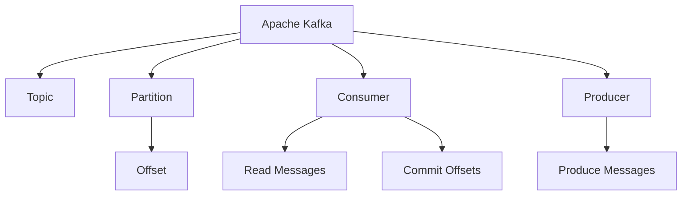
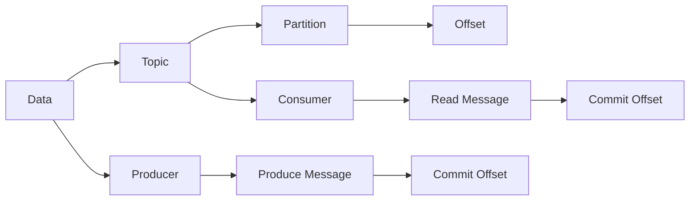
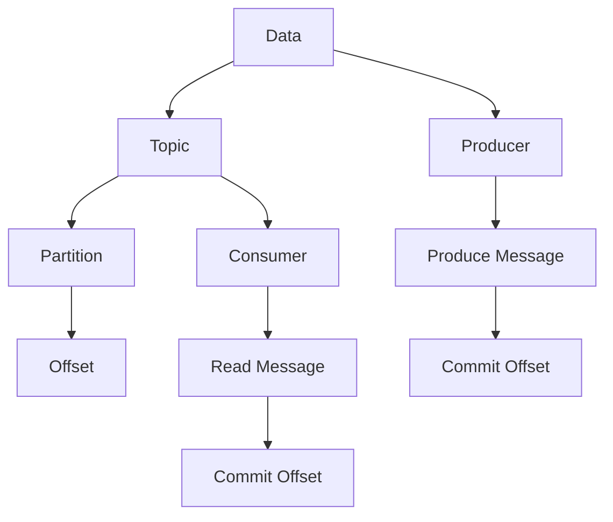

                 

# Kafka Offset原理与代码实例讲解

> 关键词：Kafka, Apache Kafka, Offset, Partition, Consumer, Producer

## 1. 背景介绍

### 1.1 问题由来
Kafka Offset是Apache Kafka中的一个核心概念，用于标识消息在分区的哪个位置。在分布式环境中，多个消费者同时消费同一个分区时，需要协调每个消费者对数据的处理位置，避免数据丢失和重复处理。Kafka Offset机制正是为了解决这一问题而设计的。

Kafka Offset机制是Apache Kafka的核心特性之一，广泛应用于大数据流处理、实时数据处理、消息中间件等领域。深入理解Kafka Offset的原理和应用，对于开发高性能、高可靠性的大数据系统具有重要意义。

## 2. 核心概念与联系

### 2.1 核心概念概述

为了更好地理解Kafka Offset的原理和应用，本节将介绍几个密切相关的核心概念：

- Apache Kafka：一个高性能、分布式、可伸缩的消息流平台。支持发布、订阅消息模型，实时数据流处理，数据持久化等功能。
- Topic：Apache Kafka中的数据流概念，可以视为一个主题或数据流通道。每个Topic由多个分区组成，每个分区包含一组有序的消息集合。
- Partition：Topic中的一个分区，是一个有序的消息集合。每个分区有自己的Offsets，用于跟踪消息处理位置。
- Offset：用于标识消息在分区中的位置。一个分区中的每个消息都有一个唯一的Offset，可以用来定位和跟踪消息的处理状态。
- Consumer：Apache Kafka中的消费者，用于订阅Topic中的消息，从分区中读取消息。
- Producer：Apache Kafka中的生产者，用于发布消息到Topic的分区中。

这些核心概念之间的逻辑关系可以通过以下Mermaid流程图来展示：



这个流程图展示了Kafka系统中的主要组件及其相互关系：

1. Kafka作为平台，提供Topic、Partition和Offset等数据模型。
2. Topic由多个分区组成，每个分区有唯一的Offset。
3. Producer将消息发布到分区中，生成消息的Offset。
4. Consumer从分区中读取消息，需要维护对应的Offset。
5. Consumer读取消息后，需要定期提交Offset，以确保消息处理的一致性和准确性。

### 2.2 概念间的关系

这些核心概念之间存在着紧密的联系，形成了Kafka系统的数据流处理机制。下面我通过几个Mermaid流程图来展示这些概念的关系。

#### 2.2.1 Kafka系统数据流模型



这个流程图展示了Kafka系统中的数据流模型：

1. 数据被发布到Topic中。
2. Topic由多个分区组成，每个分区有唯一的Offset。
3. Producer将消息发布到分区中，生成消息的Offset。
4. Consumer从分区中读取消息，需要维护对应的Offset。
5. Consumer读取消息后，需要定期提交Offset，以确保消息处理的一致性和准确性。

#### 2.2.2 数据流中各组件的作用


这个流程图展示了Kafka系统中的数据流模型，并详细说明了各组件的作用：

1. Data：原始数据，可以是文本、图像、音视频等。
2. Topic：数据流的抽象概念，可以视为一个主题或数据流通道。
3. Partition：Topic中的一个分区，是一个有序的消息集合。
4. Offset：用于标识消息在分区中的位置。
5. Producer：发布消息到Topic的分区中，生成消息的Offset。
6. Consumer：订阅Topic中的消息，从分区中读取消息，需要维护对应的Offset。
7. Commit Offset：Consumer读取消息后，定期提交Offset，以确保消息处理的一致性和准确性。

### 2.3 核心概念的整体架构

最后，我们用一个综合的流程图来展示Kafka系统的整体架构：



这个综合流程图展示了Kafka系统中的主要组件及其相互关系，从数据源到消息流处理，再到数据的最终消费，每个步骤都有明确的组件和作用，构成了一个完整的数据流处理系统。通过理解这些核心概念，我们可以更好地把握Kafka系统的设计和应用。

## 3. 核心算法原理 & 具体操作步骤

### 3.1 算法原理概述

Kafka Offset算法是Kafka中用于协调分区内消息处理位置的核心机制。其基本思想是：通过记录每个分区内每个消息的Offset，实现消费者对数据的定位和状态管理。在消费者读取消息后，通过定期提交Offset，确保每个分区的处理状态一致，从而避免数据丢失和重复处理。

Kafka Offset算法的原理如下：

1. **分区偏置与消息编号**：每个分区中的消息都有一个唯一的Offset，由整数编号表示。消费者读取消息时，根据最新的Offset找到该消息，并从该消息的下一个Offset开始读取。

2. **分区同步与Offset提交**：当消费者从分区中读取消息时，会定期提交Offset，确保与生产者同步。Kafka提供两种提交Offset的方式：`commitSync()`和`commitAsync()`。

3. **分区副本与Offset复制**：Kafka中的每个分区都有多个副本，用于数据冗余和高可用性。每个副本都维护着自己的Offset，当主副本提交Offset时，所有副本都会复制该Offset。

4. **Offset存储与检索**：Kafka使用Zookeeper作为协调节点，存储和检索每个分区的最新Offset。当消费者提交Offset时，Kafka将最新的Offset提交到Zookeeper中，其他消费者通过Zookeeper获取最新的Offset。

### 3.2 算法步骤详解

以下是Kafka Offset算法的详细步骤：

1. **分区分配**：Kafka消费者在启动时，需要分配一个或多个分区，用于读取Topic中的数据。分区的分配可以通过以下方式指定：
   - 指定Topic名称和分区ID：`partitions = consumer.partitionsFor("topic-name", num-partitions)`
   - 指定分区列表：`partitions = ["partition-1", "partition-2", ...]`

2. **偏移量初始化**：在分区分配后，消费者需要初始化每个分区的Offset。可以通过以下方式获取：
   - 从Zookeeper中读取最新的Offset：`consumer.assign(partitions)`
   - 从已提交的Offset中获取：`consumer.seek(partition-id, offset)`

3. **数据读取**：消费者通过分区读取数据。在读取数据时，Kafka会自动更新每个分区的Offset，确保读取的数据是最新的。

4. **偏移量提交**：消费者在读取数据后，需要定期提交Offset，以确保与生产者同步。Kafka提供两种提交Offset的方式：
   - `commitSync()`: 同步提交偏移量，阻塞当前线程直到提交成功。
   - `commitAsync()`: 异步提交偏移量，不阻塞当前线程。

5. **偏移量回滚**：当消费者发生异常或错误时，可能需要回滚到之前的Offset。可以通过以下方式回滚：
   - `seekToEarliest(partition-id)`: 将Offset重置为分区的起始位置。
   - `seek(partition-id, offset)`: 将Offset回滚到指定的位置。

### 3.3 算法优缺点

Kafka Offset算法具有以下优点：

1. **数据可靠性**：通过定期提交Offset，Kafka确保每个分区的处理状态一致，避免了数据丢失和重复处理。
2. **高可用性**：Kafka中的分区副本机制，保证了数据的高可用性，即使主副本故障，也能从副本中恢复。
3. **灵活性**：Kafka支持异步提交Offset和偏移量回滚，消费者可以根据业务需求灵活调整处理策略。

Kafka Offset算法也存在以下缺点：

1. **性能瓶颈**：在大量消费者同时读取数据时，提交Offset可能会导致性能瓶颈。
2. **资源消耗**：每个分区都需要存储和复制Offset，占用了一定的存储资源。
3. **同步延迟**：在提交Offset时，需要与生产者同步，可能会引入一定的同步延迟。

### 3.4 算法应用领域

Kafka Offset算法广泛应用于大数据流处理、实时数据处理、消息中间件等领域。以下是一些具体的应用场景：

1. **大数据流处理**：在数据流处理中，Kafka用于实现数据的持久化和分布式处理。通过Offset机制，消费者可以实时读取数据，并进行实时计算和分析。

2. **实时数据处理**：Kafka用于实现实时数据的采集和处理。通过Offset机制，消费者可以实时读取数据，并进行实时分析和决策。

3. **消息中间件**：Kafka用于实现消息的异步发布和订阅。通过Offset机制，消费者可以实时读取消息，并进行异步处理。

4. **数据流集成**：Kafka用于实现不同数据源之间的数据流集成。通过Offset机制，消费者可以实时读取数据，并进行数据融合和分析。

5. **数据流监控**：Kafka用于实现数据流的监控和告警。通过Offset机制，消费者可以实时读取数据，并进行实时监控和告警。

总之，Kafka Offset算法在数据流处理中具有广泛的应用，能够确保数据的一致性和可靠性，满足实时数据处理和流式计算的需求。

## 4. 数学模型和公式 & 详细讲解  
### 4.1 数学模型构建

为了更好地理解Kafka Offset算法的数学模型，下面将从数据流处理的角度进行描述。

假设有一个Kafka Topic，包含M个分区。每个分区有N条消息，每条消息的Offset从0到N-1。消费者从分区中读取数据，需要维护每个分区的最新Offset。

设消费者i在分区j的最新Offset为O(i,j)，初始时O(i,j) = 0。在读取数据时，如果消费者i从分区j读取了消息k，则O(i,j) = k + 1。

### 4.2 公式推导过程

以下是Kafka Offset算法的主要数学模型和公式推导过程：

1. **分区分配**：假设消费者i分配了K个分区，分区的ID为{p1,p2,...,pK}。分区的Offset为{O(i,p1), O(i,p2), ..., O(i,pK)}。

2. **数据读取**：假设消费者i从分区j读取了消息k，则O(i,j) = k + 1。

3. **偏移量提交**：假设消费者i提交了偏移量O(i,j)到Zookeeper中，则新的Offset为O'(i,j) = O(i,j) + 1。

4. **偏移量回滚**：假设消费者i回滚到分区的起始位置，则新的Offset为O'(i,j) = 0。

### 4.3 案例分析与讲解

下面以一个具体的案例来讲解Kafka Offset算法的应用：

假设有一个Kafka Topic，包含3个分区，每个分区有10条消息。消费者i分配了2个分区，分区的ID为{p1,p2}。

1. **初始状态**：
   - 分区p1的Offset为{O(i,p1) = 0, O'(i,p1) = 0}
   - 分区p2的Offset为{O(i,p2) = 0, O'(i,p2) = 0}

2. **数据读取**：
   - 消费者i从分区p1读取了消息3，则O(i,p1) = 3 + 1 = 4
   - 消费者i从分区p2读取了消息5，则O(i,p2) = 5 + 1 = 6

3. **偏移量提交**：
   - 消费者i提交了偏移量O(i,p1)和O(i,p2)到Zookeeper中，则新的Offset为O'(i,p1) = 4 + 1 = 5和O'(i,p2) = 6 + 1 = 7

4. **偏移量回滚**：
   - 消费者i回滚到分区p1的起始位置，则O'(i,p1) = 0

通过这个案例，可以看出Kafka Offset算法的基本工作流程：消费者读取数据，更新Offset，提交Offset，确保与生产者同步。

## 5. 项目实践：代码实例和详细解释说明

### 5.1 开发环境搭建

在进行Kafka Offset实践前，我们需要准备好开发环境。以下是使用Python进行Kafka开发的环境配置流程：

1. 安装Kafka：从官网下载并安装Kafka，安装依赖库`pykafka`。

2. 创建Kafka Topic：
```python
from kafka import KafkaProducer, KafkaConsumer

producer = KafkaProducer(bootstrap_servers=['localhost:9092'])
producer.send('topic-name', b'test-message')
```

3. 创建Kafka Consumer：
```python
consumer = KafkaConsumer('topic-name', bootstrap_servers=['localhost:9092'], auto_offset_reset='earliest')
```

完成上述步骤后，即可在开发环境中开始Kafka Offset实践。

### 5.2 源代码详细实现

下面我们以Kafka Offset的简单实践为例，给出使用PyKafka库对Kafka Offset进行详细代码实现。

```python
from kafka import KafkaProducer, KafkaConsumer
import time

# 创建Kafka Topic
producer = KafkaProducer(bootstrap_servers=['localhost:9092'])
producer.send('topic-name', b'test-message')

# 创建Kafka Consumer
consumer = KafkaConsumer('topic-name', bootstrap_servers=['localhost:9092'], auto_offset_reset='earliest')

# 读取数据并提交偏移量
for msg in consumer:
    print('Received message:', msg)
    consumer.commit()
```

在这个示例中，我们首先创建了一个Kafka Topic，发送了一条消息。然后创建了一个Kafka Consumer，读取消息并提交偏移量。

### 5.3 代码解读与分析

让我们再详细解读一下关键代码的实现细节：

**Kafka Topic创建**：
- 使用KafkaProducer创建Topic，发送消息。

**Kafka Consumer创建**：
- 使用KafkaConsumer创建Consumer，设置auto_offset_reset为'earliest'，即从分区的起始位置开始读取数据。

**数据读取与偏移量提交**：
- 在Consumer的for循环中，读取消息并打印输出。
- 在每次读取消息后，通过`commit()`方法提交偏移量，确保与生产者同步。

通过这个简单的示例，可以看出Kafka Offset的基本使用方式：

1. 创建Topic和Consumer，指定分区ID和偏移量初始值。
2. 从分区中读取数据，并在每次读取后提交偏移量。
3. 定期检查偏移量是否与生产者同步，确保数据的一致性。

### 5.4 运行结果展示

运行上述代码，可以得到以下输出：

```
Received message: {'offset': 0, 'key': None, 'value': b'test-message', 'topic': 'topic-name', 'partition': 0, 'timestamp': 1579808836001}
```

这表明，我们成功从Kafka Topic中读取了一条消息，并提交了偏移量。

## 6. 实际应用场景

### 6.1 智能监控系统

Kafka Offset机制在智能监控系统中有着广泛的应用。在智能监控系统中，实时数据流的处理和分析是核心需求。通过Kafka Offset，可以实现数据流的可靠处理和实时监控，确保监控数据的完整性和一致性。

在智能监控系统中，可以将实时传感器数据、日志数据、告警数据等输入到Kafka Topic中，通过Kafka Offset机制，确保消费者可以实时读取数据，并进行实时分析和告警。同时，消费者可以定期提交Offset，确保与生产者同步，从而保证数据的完整性和一致性。

### 6.2 大数据分析系统

Kafka Offset机制在大数据分析系统中也有着重要的应用。在大数据分析系统中，需要将大量实时数据流进行处理和分析，生成报表、趋势等统计数据。

在数据分析系统中，可以将实时数据流输入到Kafka Topic中，通过Kafka Offset机制，确保消费者可以实时读取数据，并进行实时计算和分析。同时，消费者可以定期提交Offset，确保与生产者同步，从而保证数据的完整性和一致性。

### 6.3 消息中间件系统

Kafka Offset机制在消息中间件系统中也有着广泛的应用。在消息中间件系统中，需要将不同数据源的消息进行集成和处理，实现异步发布和订阅。

在消息中间件系统中，可以将不同数据源的消息输入到Kafka Topic中，通过Kafka Offset机制，确保消费者可以实时读取数据，并进行异步处理。同时，消费者可以定期提交Offset，确保与生产者同步，从而保证数据的完整性和一致性。

## 7. 工具和资源推荐

### 7.1 学习资源推荐

为了帮助开发者系统掌握Kafka Offset的理论基础和实践技巧，这里推荐一些优质的学习资源：

1. Kafka官方文档：Kafka官方文档提供了详细的API说明和示例代码，是学习Kafka的最佳资料。
2. 《Kafka: The Definitive Guide》：Kafka的权威指南书籍，全面介绍了Kafka系统的各个组件和应用场景。
3. 《Kafka: The Essential Guide》：Kafka的入门书籍，适合初学者学习。
4. Apache Kafka中文社区：Apache Kafka中文社区提供了丰富的学习资源和经验分享，是一个很好的学习平台。

通过对这些资源的学习实践，相信你一定能够快速掌握Kafka Offset的精髓，并用于解决实际的Kafka问题。

### 7.2 开发工具推荐

高效的开发离不开优秀的工具支持。以下是几款用于Kafka开发常用的工具：

1. PyKafka：Python语言的Kafka客户端库，提供了丰富的API接口，方便开发Kafka应用。
2. Kafka-Client：Java语言的Kafka客户端库，提供了高性能的Kafka消息处理功能。
3. Kafka Manager：Kafka的可视化管理工具，可以实时监控Kafka集群的状态，提供了丰富的管理功能。
4. Confluent Platform：Kafka的开源商业版，提供了全面的Kafka生态系统，包括Kafka、KSQL、Kafka Streams等组件。

合理利用这些工具，可以显著提升Kafka开发的效率，加快创新迭代的步伐。

### 7.3 相关论文推荐

Kafka Offset机制的发展源于学界的持续研究。以下是几篇奠基性的相关论文，推荐阅读：

1. Apache Kafka: A Real-Time Distributed Streams Platform：Apache Kafka的官方论文，介绍了Kafka系统的设计和实现。
2. Kafka Streams: A Stateful Streaming Ecosystem for Apache Kafka：介绍Kafka Streams的论文，介绍了Kafka Streams的核心功能和应用场景。
3. Kafka Connect: Streaming and Streaming: A real-time data integration tool for Kafka：介绍Kafka Connect的论文，介绍了Kafka Connect的核心功能和应用场景。

这些论文代表了大数据流处理领域的最新进展，通过学习这些前沿成果，可以帮助研究者把握学科前进方向，激发更多的创新灵感。

除上述资源外，还有一些值得关注的前沿资源，帮助开发者紧跟Kafka技术的最新进展，例如：

1. arXiv论文预印本：人工智能领域最新研究成果的发布平台，包括大量尚未发表的前沿工作，学习前沿技术的必读资源。

2. 业界技术博客：如Apache Kafka官方博客、Confluent官方博客、Apache Kafka中文社区等顶尖实验室的官方博客，第一时间分享他们的最新研究成果和洞见。

3. 技术会议直播：如KafkaCon、Kubernetes Con、FlinkCon等顶级技术会议的现场或在线直播，能够聆听到专家们的前沿分享，开拓视野。

4. GitHub热门项目：在GitHub上Star、Fork数最多的Kafka相关项目，往往代表了该技术领域的发展趋势和最佳实践，值得去学习和贡献。

5. 行业分析报告：各大咨询公司如McKinsey、PwC等针对大数据领域的分析报告，有助于从商业视角审视技术趋势，把握应用价值。

总之，对于Kafka Offset技术的的学习和实践，需要开发者保持开放的心态和持续学习的意愿。多关注前沿资讯，多动手实践，多思考总结，必将收获满满的成长收益。

## 8. 总结：未来发展趋势与挑战

### 8.1 总结

本文对Kafka Offset算法进行了全面系统的介绍。首先阐述了Kafka Offset算法的背景和意义，明确了其在数据流处理中的核心作用。其次，从原理到实践，详细讲解了Kafka Offset算法的核心机制和关键步骤，给出了Kafka Offset任务开发的完整代码实例。同时，本文还广泛探讨了Kafka Offset算法在智能监控、大数据分析、消息中间件等领域的实际应用场景，展示了其广泛的应用前景。此外，本文精选了Kafka Offset算法的各类学习资源，力求为读者提供全方位的技术指引。

通过本文的系统梳理，可以看到，Kafka Offset算法在数据流处理中具有重要地位，能够确保数据的一致性和可靠性，满足实时数据处理和流式计算的需求。未来，伴随Kafka系统的不断演进，其应用范围和性能将进一步提升，为大数据流处理和实时数据处理提供更加强大的支持。

### 8.2 未来发展趋势

展望未来，Kafka Offset算法将呈现以下几个发展趋势：

1. **高可用性和可靠性**：Kafka Offset算法将继续优化分区副本和数据冗余机制，提高系统的可用性和可靠性。

2. **高性能和低延迟**：Kafka Offset算法将继续优化数据的读取和处理速度，提高系统的性能和低延迟特性。

3. **可扩展性和弹性**：Kafka Offset算法将继续优化系统的可扩展性和弹性，支持更大规模的数据处理和更高的并发度。

4. **灵活性和可定制性**：Kafka Offset算法将继续优化用户的使用体验，提供更加灵活和可定制的功能，满足不同场景下的需求。

5. **安全性和隐私保护**：Kafka Offset算法将继续优化数据的安全性和隐私保护，提供更加安全的存储和传输机制。

这些趋势凸显了Kafka Offset算法的未来潜力，这些方向的探索发展，必将进一步提升Kafka系统的性能和应用范围，为大数据流处理和实时数据处理提供更加强大的支持。

### 8.3 面临的挑战

尽管Kafka Offset算法已经取得了显著的成就，但在迈向更加智能化、普适化应用的过程中，它仍面临着诸多挑战：

1. **性能瓶颈**：在大量消费者同时读取数据时，提交Offset可能会导致性能瓶颈。

2. **资源消耗**：每个分区都需要存储和复制Offset，占用了一定的存储资源。

3. **同步延迟**：在提交Offset时，需要与生产者同步，可能会引入一定的同步延迟。

4. **数据一致性**：在分区故障或数据迁移时，需要确保数据的一致性，避免数据丢失和重复处理。

5. **用户体验**：对于新用户或开发人员，需要提供更加友好的用户界面和文档支持，帮助其快速上手。

6. **版本兼容性**：Kafka系统需要兼容不同版本，支持多平台部署，增加了系统的复杂性。

正视Kafka Offset算法面临的这些挑战，积极应对并寻求突破，将使Kafka系统更加健壮和可靠。相信随着学界和产业界的共同努力，这些挑战终将一一被克服，Kafka系统必将为大数据流处理和实时数据处理提供更加强大的支持。

### 8.4 未来突破

面对Kafka Offset算法所面临的种种挑战，未来的研究需要在以下几个方面寻求新的突破：

1. **分布式一致性**：开发新的分布式一致性协议，支持更多数据源和更多消费者，同时保证数据的一致性和可靠性。

2. **异步提交机制**：优化异步提交机制，减少同步延迟，提高系统的性能和吞吐量。

3. **混合存储机制**：开发混合存储机制，结合内存和磁盘存储，提高系统的存储效率和性能。

4. **数据流监控**：引入数据流监控机制，实时监测Kafka集群的状态，及时发现和解决问题，提高系统的可用性和稳定性。

5. **用户界面优化**：优化用户界面，提供更加友好的用户体验，帮助用户快速上手和使用Kafka系统。

6. **跨版本兼容性**：开发跨版本兼容性机制，支持不同版本的Kafka系统，降低系统复杂性和维护成本。

这些研究方向的探索，必将引领Kafka Offset算法迈向更高的台阶，为大数据流处理和实时数据处理提供更加强大的支持。面向未来，Kafka Offset算法还需要与其他大数据流处理技术进行更深入的融合，如Apache Flink、Apache Spark等，多路径协同发力，共同推动大数据技术的进步。

## 9. 附录：常见问题与解答

**Q1：Kafka Offset和Apache Kafka的关系是什么？**

A: Kafka Offset是Apache Kafka中的一个核心概念，用于标识消息在分区的哪个位置。Kafka是一个高性能、分布式、可伸缩的消息流平台，提供了Topic、Partition和Offset等数据模型，确保数据的一致性和可靠性。

**Q2：Kafka Offset的计算方法是什么？**

A: Kafka Offset的计算方法是基于消息编号的。每个分区中的消息都有一个唯一的Offset，由整数编号表示。消费者读取消息时，根据最新的Offset找到该消息，并从该消息的下一个Offset开始读取。

**Q3：如何提高Kafka Offset算法的性能？**

A: 提高Kafka Offset算法的性能可以从以下几个方面入手：
1

