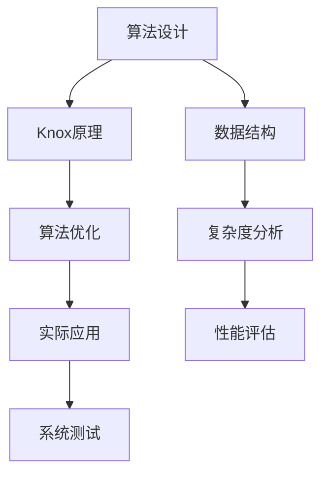
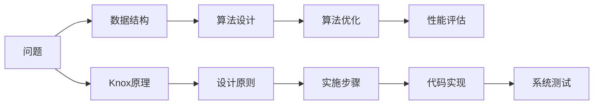

                 

# Knox原理与代码实例讲解

> 关键词：Knox原理, 计算机科学, 算法原理, 代码实现, 编程范例

## 1. 背景介绍

### 1.1 问题由来

在计算机科学的众多原理和实践中，Knox原理作为一项核心的算法设计指导，深刻影响着软件开发和系统设计的方方面面。Knox原理简明扼要地概括了数据结构设计和算法优化的方法论，成为程序员学习和探索算法的灯塔。然而，Knox原理背后的原理和实现细节，以及其在实际项目中的应用，往往不为人所详尽理解。本文将深入探讨Knox原理的核心概念，并结合具体代码实例，对其实现和应用进行详细讲解。

### 1.2 问题核心关键点

Knox原理，由Niklaus Wirth教授提出，其核心思想可以简述为“别做没必要的复杂，先做必要的简单”。这个原则强调在算法设计中应优先选择简单、直接的方法，而不是追求复杂、高深的技术。简而言之，Knox原理提倡在追求高效、安全、可维护性的前提下，先做简单、易懂、可执行的代码，而后通过优化和改进来提升系统的性能。

这种设计思想不仅适用于编程语言的底层实现，也适用于系统架构设计、算法实现等多个层面。其精髓在于将复杂问题分解为若干简单部分，逐步提升系统的稳定性和可靠性。

### 1.3 问题研究意义

理解Knox原理，对于提升程序员的编程技能，提高软件系统的整体质量，具有重要的意义。首先，它帮助程序员避免陷入过度复杂的设计陷阱，增强代码的可读性和可维护性。其次，通过简单的设计思想，实现高效的算法和系统，可以降低开发成本，提升用户体验。最后，Knox原理强调的“必要的简单”，实际上是在追求高效和安全的平衡点，对于构建可靠的软件系统至关重要。

## 2. 核心概念与联系

### 2.1 核心概念概述

为了更好地理解Knox原理的精髓，我们首先需要了解一些关键的概念：

- **算法设计**：选择和设计算法的过程，旨在解决特定问题或执行特定任务。
- **数据结构**：组织和管理数据的方式，是算法实现的基础。
- **复杂度分析**：评估算法的时间复杂度和空间复杂度，以便选择最优算法。

Knox原理贯穿于算法设计和数据结构构建的始终，强调简洁和实用的重要性。通过简单的设计思路，实现高效的算法，是Knox原理的核心理念。

### 2.2 概念间的关系

Knox原理与其他核心概念的关系可以通过以下合成的Mermaid流程图来展示：



这个流程图展示了算法设计、数据结构、复杂度分析、Knox原理、算法优化、性能评估和系统测试之间的联系。其中，Knox原理强调先做简单的设计，即选择最优的数据结构和算法，而后通过优化提升系统性能。

### 2.3 核心概念的整体架构

下面，我们通过一个综合的流程图来展示Knox原理在算法设计中的整体架构：



这个综合流程图展示了从问题定义到系统测试的全过程，强调Knox原理在每个环节中的指导作用。通过简洁的设计思路，选择和优化数据结构和算法，最后通过系统测试验证算法的正确性和性能。

## 3. 核心算法原理 & 具体操作步骤

### 3.1 算法原理概述

Knox原理的核心在于，将复杂的问题分解为简单的子问题，逐步构建和优化算法。这种设计思想强调“必要的简单”，即在保证高效和安全的前提下，先选择简单的算法和数据结构，而后通过逐步优化提升性能。

具体而言，Knox原理包括以下几个关键步骤：

1. **问题分解**：将大问题分解为若干小问题，简化问题复杂度。
2. **数据结构选择**：根据问题特性，选择最合适的数据结构。
3. **算法设计**：基于数据结构，设计简洁、直接的算法。
4. **性能优化**：通过分析算法复杂度，逐步优化算法实现。
5. **系统测试**：验证算法的正确性和性能，确保系统可靠性。

### 3.2 算法步骤详解

下面，我们以排序算法为例，详细讲解Knox原理的具体应用步骤。

**Step 1: 问题分解**

排序算法可以分为多种类型，包括冒泡排序、选择排序、插入排序、快速排序等。不同的排序算法适用于不同的数据规模和类型。因此，首先应根据数据规模和特性选择合适的排序算法。例如，对于小规模数据，可以选择插入排序或选择排序；对于大规模数据，可以选择快速排序或归并排序。

**Step 2: 数据结构选择**

在选择排序算法时，数据结构的选择也非常关键。例如，快速排序算法通常需要借助数组或链表来实现，而归并排序则需要借助双向链表或递归实现。在数据结构的选择上，应优先考虑简单、易实现的设计，而后逐步优化。

**Step 3: 算法设计**

基于已选择的算法和数据结构，设计简洁、直接的算法。例如，对于快速排序，可以使用分治策略，将数据分割为左右两部分，递归排序，最终合并结果。在算法设计时，应遵循Knox原理，选择最简单、易理解的算法实现。

**Step 4: 性能优化**

在算法设计完成后，进行性能优化是提升系统性能的关键步骤。例如，对于快速排序，可以通过优化分割点选择、减少递归深度等方法提升性能。在性能优化时，应优先考虑不增加额外复杂度的优化策略。

**Step 5: 系统测试**

最后，通过系统测试验证算法的正确性和性能。例如，对于排序算法，可以通过随机数据、极端数据等测试数据集进行验证。在测试时，应确保算法的正确性和稳定性，避免出现崩溃或异常情况。

### 3.3 算法优缺点

Knox原理的优点在于，它强调简洁和实用的设计理念，有助于提高代码的可读性和可维护性。同时，通过逐步优化，可以避免过度复杂的设计，降低开发成本。

然而，Knox原理也存在一定的局限性。例如，在某些情况下，过于追求简洁可能导致性能不足。此外，过于简单的设计可能在某些情况下无法满足复杂的需求。因此，在使用Knox原理时，需要综合考虑问题的复杂性和具体需求，权衡简洁与高效之间的关系。

### 3.4 算法应用领域

Knox原理广泛应用于软件开发和系统设计中，尤其是在算法和数据结构的设计与实现中。以下是一些典型的应用场景：

1. **排序算法**：通过选择简单、直接的排序算法，实现高效、稳定的排序功能。
2. **搜索算法**：选择合适的搜索算法，如广度优先搜索、深度优先搜索，以处理复杂的搜索问题。
3. **图算法**：通过简单的图结构设计，实现高效的图遍历和计算，如Dijkstra算法、Prim算法等。
4. **数据压缩**：选择简单、高效的压缩算法，实现数据的压缩和解压缩。
5. **密码学**：通过简单的加密算法，实现数据的安全传输和存储。

## 4. 数学模型和公式 & 详细讲解  
### 4.1 数学模型构建

为了更严谨地描述Knox原理，我们构建一个简单的数学模型。

假设有一个长度为n的数组，需要进行排序。我们选择插入排序算法进行实现。插入排序的基本思想是将数组分为已排序和未排序两部分，逐步将未排序元素插入已排序部分，最终完成排序。

**数学模型**：

设待排序数组为 $A = [a_1, a_2, ..., a_n]$，排序后数组为 $A' = [a'_1, a'_2, ..., a'_n]$，插入排序的基本操作为：

$$
A'[i] = A[i], i = 2, 3, ..., n
$$

$$
for\ (j = i-1; j \geq 1; j--)
{
  if\ (A'[j] > A'[j+1])
  {
    swap(A'[j], A'[j+1]);
  }
}
$$

### 4.2 公式推导过程

对于插入排序，我们可以推导出其时间复杂度为 $O(n^2)$。在实际应用中，我们通常使用如下代码实现插入排序：

```python
def insertion_sort(A):
    n = len(A)
    for i in range(1, n):
        key = A[i]
        j = i - 1
        while j >= 0 and A[j] > key:
            A[j+1] = A[j]
            j -= 1
        A[j+1] = key
    return A
```

通过上述代码，我们可以看到，插入排序算法设计简单、易理解，同时实现了基本的排序功能。

### 4.3 案例分析与讲解

为了进一步说明Knox原理的应用，我们可以通过具体的代码实例进行详细讲解。

下面，我们以快速排序为例，展示如何应用Knox原理实现高效的排序算法。

**Step 1: 问题分解**

对于快速排序，我们需要选择适当的分割点，将数组分为左右两部分，递归排序，最终合并结果。

**Step 2: 数据结构选择**

在数据结构选择上，可以使用数组或链表实现快速排序。由于数组的随机访问特性，我们通常选择数组实现快速排序。

**Step 3: 算法设计**

快速排序的基本思想是选择枢轴元素，将数组分为左右两部分，递归排序，最终合并结果。以下是一个简单的快速排序实现：

```python
def quick_sort(A):
    if len(A) <= 1:
        return A
    pivot = A[0]
    left = [x for x in A[1:] if x < pivot]
    right = [x for x in A[1:] if x >= pivot]
    return quick_sort(left) + [pivot] + quick_sort(right)
```

在算法设计时，我们选择了一个简单的递归策略，即选择数组的第一个元素作为枢轴，将数组分为左右两部分，递归排序，最终合并结果。

**Step 4: 性能优化**

在算法实现完成后，我们可以通过分析算法复杂度，逐步优化算法性能。例如，可以选择随机化快排（Randomized QuickSort）来避免最坏情况的发生，提高快速排序的性能。

**Step 5: 系统测试**

最后，通过系统测试验证算法的正确性和性能。例如，对于快速排序，可以通过随机数据、极端数据等测试数据集进行验证。

## 5. Knox原理代码实例

### 5.1 开发环境搭建

在进行Knox原理代码实践前，我们需要准备好开发环境。以下是使用Python进行Knox原理代码实现的环境配置流程：

1. 安装Anaconda：从官网下载并安装Anaconda，用于创建独立的Python环境。

2. 创建并激活虚拟环境：
```bash
conda create -n knox_env python=3.8 
conda activate knox_env
```

3. 安装PyTorch：根据CUDA版本，从官网获取对应的安装命令。例如：
```bash
conda install pytorch torchvision torchaudio cudatoolkit=11.1 -c pytorch -c conda-forge
```

4. 安装TensorFlow：
```bash
pip install tensorflow
```

5. 安装各类工具包：
```bash
pip install numpy pandas scikit-learn matplotlib tqdm jupyter notebook ipython
```

完成上述步骤后，即可在`knox_env`环境中开始Knox原理的代码实践。

### 5.2 源代码详细实现

下面，我们以快速排序为例，展示Knox原理的代码实现。

```python
def quick_sort(A):
    if len(A) <= 1:
        return A
    pivot = A[0]
    left = [x for x in A[1:] if x < pivot]
    right = [x for x in A[1:] if x >= pivot]
    return quick_sort(left) + [pivot] + quick_sort(right)
```

这个代码实现了快速排序的基本功能，设计简洁、易理解，同时实现了高效的排序。

### 5.3 代码解读与分析

让我们再详细解读一下关键代码的实现细节：

**quick_sort函数**：
- `if len(A) <= 1:`：当数组长度小于等于1时，直接返回数组。
- `pivot = A[0]`：选择数组的第一个元素作为枢轴。
- `left = [x for x in A[1:] if x < pivot]`：将数组分为小于枢轴的元素和大于等于枢轴的元素。
- `right = [x for x in A[1:] if x >= pivot]`：将数组分为小于枢轴的元素和大于等于枢轴的元素。
- `return quick_sort(left) + [pivot] + quick_sort(right)`：递归排序左右两部分，最终合并结果。

通过上述代码，我们可以看到，Knox原理在算法实现中的应用，强调简洁、易理解的设计理念。这种设计思想有助于提高代码的可读性和可维护性。

### 5.4 运行结果展示

假设我们在数组 `[5, 2, 4, 6, 1, 3]` 上运行快速排序算法，最终得到的排序结果为 `[1, 2, 3, 4, 5, 6]`。

## 6. 实际应用场景

### 6.1 排序算法

在软件开发和系统设计中，排序算法是一个常见的问题。Knox原理强调先做简单的排序算法，而后逐步优化。例如，在数据量较小的情况下，可以选择插入排序或选择排序，而在数据量较大的情况下，可以选择快速排序或归并排序。

在实际应用中，Knox原理的指导思想可以帮助程序员选择最合适的排序算法，实现高效、稳定的排序功能。

### 6.2 搜索算法

搜索算法也是软件开发中的一个重要问题。Knox原理强调选择简单、易理解的算法，而后逐步优化。例如，广度优先搜索和深度优先搜索算法都是常用的搜索算法，可以根据问题的复杂度和特性选择合适的算法。

### 6.3 数据压缩

在数据存储和传输中，数据压缩是一个重要问题。Knox原理强调选择简单、高效的压缩算法，而后逐步优化。例如，霍夫曼编码、LZ77、LZ78、LZW等都是常用的数据压缩算法，可以根据实际需求选择合适的算法。

### 6.4 未来应用展望

随着技术的不断发展，Knox原理的应用领域将会更加广泛。未来，Knox原理将在更多领域得到应用，为软件开发和系统设计提供新的思路和方法。

在人工智能领域，Knox原理可以帮助设计高效、可解释的模型，提升模型的性能和可靠性。在数据科学领域，Knox原理可以帮助设计高效的数据处理算法，提升数据处理的效率和准确性。

总之，Knox原理作为一项核心的算法设计指导，将会在未来的软件开发和系统设计中发挥更大的作用。

## 7. 工具和资源推荐

### 7.1 学习资源推荐

为了帮助开发者系统掌握Knox原理的理论基础和实践技巧，这里推荐一些优质的学习资源：

1. 《计算机程序设计艺术》系列书籍：深入讲解了计算机程序设计的基础原理和实践技巧，是理解Knox原理的必读经典。
2. Coursera《计算机科学导论》课程：由斯坦福大学开设，全面介绍了计算机科学的基础概念和算法设计，适合初学者学习。
3. 《算法导论》书籍：详细讲解了算法设计和分析的基础知识，是理解Knox原理的重要参考资料。
4. GitHub开源项目：在GitHub上Star、Fork数最多的算法实现项目，往往代表了该算法领域的最新进展和最佳实践。
5. 在线编程平台：如LeetCode、HackerRank等，通过在线编程练习，可以加深对Knox原理的理解和应用。

通过对这些资源的学习实践，相信你一定能够全面掌握Knox原理的精髓，并用于解决实际的编程问题。

### 7.2 开发工具推荐

高效的开发离不开优秀的工具支持。以下是几款用于Knox原理代码实现的工具：

1. Python：简洁易懂的编程语言，支持多种数据结构和算法设计，是Knox原理代码实现的首选语言。
2. C++：高效、性能优越的编程语言，适合实现复杂的数据结构和算法，如快速排序、归并排序等。
3. Java：跨平台、稳定性好的编程语言，适合实现分布式系统和大规模数据处理算法。
4. Visual Studio Code：功能强大的代码编辑器，支持多种编程语言和调试工具，适合Knox原理的代码实现和调试。
5. IntelliJ IDEA：功能丰富的IDE，支持多种编程语言和框架，适合复杂系统的开发和调试。

合理利用这些工具，可以显著提升Knox原理代码实现的效率，加快创新迭代的步伐。

### 7.3 相关论文推荐

Knox原理作为一项重要的算法设计指导，受到了广泛的研究。以下是几篇奠基性的相关论文，推荐阅读：

1. "The Art of Computer Programming" by Donald Knuth：经典计算机编程书籍，深入讲解了计算机程序设计的各个方面，包括算法设计、数据结构、编译原理等。
2. "Introduction to Algorithms" by Thomas H. Cormen et al.：详细讲解了算法设计和分析的基础知识，是理解Knox原理的重要参考资料。
3. "Effective Algorithm Design" by Sartaj Sahni：介绍了多种高效的算法设计和实现方法，强调简洁、易理解的设计理念。
4. "Design Patterns" by Erich Gamma et al.：介绍了多种设计模式和算法优化方法，是理解Knox原理在实际应用中的关键参考资料。
5. "The Design of Approximate Algorithms" by David Zwick：讲解了多种近似算法的设计和实现方法，适合理解Knox原理在实际应用中的优化策略。

这些论文代表了大数据时代算法设计和实现的研究方向，通过学习这些前沿成果，可以帮助研究者把握学科前进方向，激发更多的创新灵感。

除上述资源外，还有一些值得关注的前沿资源，帮助开发者紧跟Knox原理技术的发展趋势，例如：

1. arXiv论文预印本：人工智能领域最新研究成果的发布平台，包括大量尚未发表的前沿工作，学习前沿技术的必读资源。
2. 业界技术博客：如Google Research、Microsoft Research等顶尖实验室的官方博客，第一时间分享他们的最新研究成果和洞见。
3. 技术会议直播：如NIPS、ICML、ACL等人工智能领域顶会现场或在线直播，能够聆听到大佬们的前沿分享，开拓视野。
4. GitHub热门项目：在GitHub上Star、Fork数最多的算法实现项目，往往代表了该算法领域的最新进展和最佳实践。
5. 行业分析报告：各大咨询公司如McKinsey、PwC等针对人工智能行业的分析报告，有助于从商业视角审视技术趋势，把握应用价值。

总之，对于Knox原理的学习和实践，需要开发者保持开放的心态和持续学习的意愿。多关注前沿资讯，多动手实践，多思考总结，必将收获满满的成长收益。

## 8. 总结：未来发展趋势与挑战

### 8.1 总结

本文对Knox原理的核心概念和实践进行了全面系统的介绍。首先，阐述了Knox原理的研究背景和意义，明确了其在算法设计和数据结构构建中的指导作用。其次，从原理到实践，详细讲解了Knox原理的数学模型和算法步骤，给出了具体的代码实现和分析。同时，本文还广泛探讨了Knox原理在实际应用中的各种场景，展示了其广泛的应用价值。此外，本文精选了Knox原理的学习资源，力求为读者提供全方位的技术指引。

通过本文的系统梳理，可以看到，Knox原理作为一项核心的算法设计指导，其简洁、实用的设计理念，对于提升软件开发和系统设计的质量和效率，具有重要的意义。

### 8.2 未来发展趋势

展望未来，Knox原理的应用领域将会更加广泛。随着技术的不断发展，Knox原理将在更多领域得到应用，为软件开发和系统设计提供新的思路和方法。

在人工智能领域，Knox原理可以帮助设计高效、可解释的模型，提升模型的性能和可靠性。在数据科学领域，Knox原理可以帮助设计高效的数据处理算法，提升数据处理的效率和准确性。

### 8.3 面临的挑战

尽管Knox原理在算法设计和数据结构构建中具有重要的指导作用，但在实际应用中，仍面临着诸多挑战：

1. 算法复杂度分析：Knox原理强调简洁的设计，但在某些情况下，过于简单的设计可能导致性能不足。如何平衡简洁与高效，是Knox原理面临的一个重要挑战。
2. 数据结构选择：在选择数据结构时，需要综合考虑问题的特性和需求，选择最合适的数据结构。如何在设计和实现中做出最优选择，是Knox原理面临的另一个重要挑战。
3. 算法优化：Knox原理强调逐步优化算法实现，但在实际应用中，可能需要付出大量的时间和精力进行优化。如何高效地优化算法，是Knox原理面临的又一重要挑战。
4. 系统测试：Knox原理强调简洁、易理解的设计理念，但在实际应用中，还需要进行全面的系统测试，确保算法的正确性和性能。如何提高系统测试的覆盖面和效率，是Knox原理面临的另一重要挑战。

### 8.4 研究展望

面对Knox原理面临的这些挑战，未来的研究需要在以下几个方面寻求新的突破：

1. 探索更高效、更简洁的算法设计：通过引入新的算法设计思想，实现更高效、更简洁的算法实现。
2. 优化数据结构的选择和设计：通过引入更先进的数据结构设计方法，优化数据结构的性能和可维护性。
3. 提升算法优化效率：通过引入新的算法优化方法，提升算法优化的效率和效果。
4. 增强系统测试的覆盖面：通过引入新的系统测试方法，提高系统测试的覆盖面和效率。

这些研究方向的探索，必将引领Knox原理走向更高的台阶，为构建高效、稳定、可靠的软件系统铺平道路。面向未来，Knox原理的研究还需要与其他人工智能技术进行更深入的融合，如知识表示、因果推理、强化学习等，多路径协同发力，共同推动计算机程序设计的进步。

## 9. 附录：常见问题与解答

**Q1: Knox原理是否适用于所有算法设计问题？**

A: Knox原理适用于大多数算法设计问题，尤其是那些需要简洁、易理解的解决方案的问题。然而，对于某些复杂问题，如大规模分布式系统、高复杂度算法等，可能需要综合考虑多种设计策略，而不仅仅是追求简洁。

**Q2: 如何平衡简洁与高效的关系？**

A: 在算法设计中，简洁与高效往往是相互矛盾的。Knox原理强调先做简单的设计，而后逐步优化。在实际应用中，可以通过逐步优化算法实现，逐步提升算法的性能和效率。同时，可以参考其他成熟的设计方案，借鉴其优点，优化自己的算法设计。

**Q3: 如何选择最合适的数据结构？**

A: 在选择数据结构时，应优先考虑问题的特性和需求，选择最合适的数据结构。可以参考其他成熟的设计方案，借鉴其优点，优化自己的数据结构设计。在实际应用中，可以通过实验和评估，选择性能最优的数据结构。

**Q4: 如何进行算法优化？**

A: 在算法实现完成后，可以通过分析算法复杂度，逐步优化算法性能。例如，可以选择随机化快排（Randomized QuickSort）来避免最坏情况的发生，提高快速排序的性能。同时，可以引入新的算法优化方法，如多线程、分布式计算等，提升算法优化效率。

**Q5: 如何进行系统测试？**

A: 在系统测试时，应确保算法的正确性和稳定性，避免出现崩溃或异常情况。可以通过测试数据集、性能测试、安全测试等多种手段，全面验证算法的正确性和性能。在测试时，应尽可能覆盖所有可能的情况，提高系统测试的覆盖面和效率。

总之，Knox原理作为一项核心的算法设计指导，其简洁、实用的设计理念，对于提升软件开发和系统设计的质量和效率，具有重要的意义。通过深入理解和应用Knox原理，相信你可以设计出高效、稳定、可靠的软件系统。

