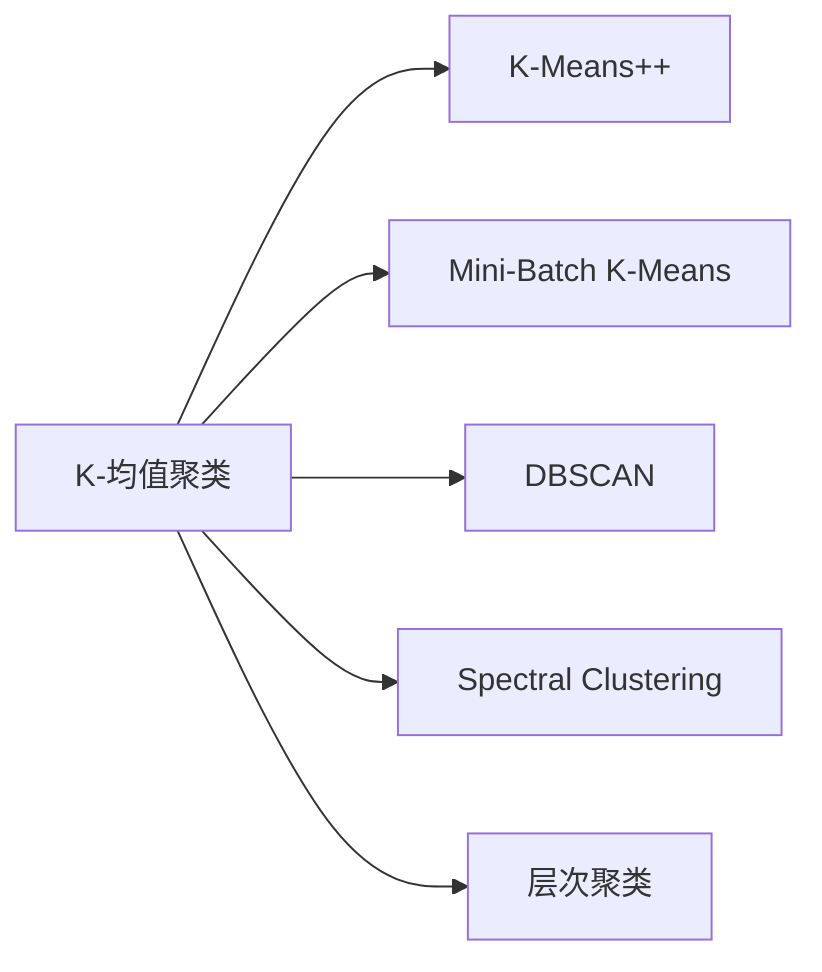

                 

# K-均值聚类K-means原理与代码实例讲解

> 关键词：K-均值聚类,数据挖掘,机器学习,Python编程,聚类分析,实际应用

## 1. 背景介绍

### 1.1 问题由来
K-均值聚类（K-means Clustering）是一种经典的无监督学习算法，广泛用于数据挖掘、市场细分、图像分割、信号处理等领域。其基本思想是将数据集划分为K个簇（Cluster），使得同一簇内的数据点相似度较高，而不同簇之间相似度较低。这种划分方法简单高效，且易于解释，因此在实际应用中得到了广泛应用。

然而，K-均值聚类在实际应用中也存在一些限制和局限性，如需要预先设定簇的数量K、对初始值敏感、对于噪声和异常点处理能力较弱等。针对这些问题，学术界和工业界也进行了大量的研究和改进，产生了诸如K-Means++、Mini-Batch K-Means、DBSCAN等变种算法，以及用于解决K值选择、噪声处理、簇形状优化等问题的技巧。

### 1.2 问题核心关键点
K-均值聚类算法虽然简单，但其核心思想清晰，影响其性能的主要因素包括：
1. 簇的数量K的选择。K值过小，可能导致簇内样本过于分散，聚类效果差；K值过大，可能过度拟合，导致簇内样本过于集中。
2. 初始聚类中心的选取。初始值的选择会影响算法的收敛速度和最终的聚类结果，一般采用K-Means++等改进算法来提高初始值的随机性。
3. 簇内距离和簇间距离的定义。常用的距离度量方法包括欧式距离、曼哈顿距离、余弦距离等，不同方法对聚类结果的影响较大。
4. 噪声和异常点的处理。K-均值聚类对异常点和噪声较为敏感，需要进行预处理。
5. 聚类效果评估。常见的评估指标包括轮廓系数、Davies-Bouldin指数、内部一致性指标等，用于衡量聚类效果和簇内样本的紧密度。

### 1.3 问题研究意义
K-均值聚类作为机器学习领域的基础算法，具有以下几个显著的研究意义：

1. 数据预处理。K-均值聚类常用于数据降维和特征选择，通过聚类算法获得数据的潜在结构信息，进一步优化模型训练效果。
2. 模式识别与分类。K-均值聚类可以对样本进行聚类划分，提取样本的特征，为后续分类任务提供有价值的信息。
3. 群体分析。K-均值聚类可应用于客户细分、市场分组等群体分析任务，帮助企业更好地理解用户行为和市场趋势。
4. 图像分割。K-均值聚类可以对图像中的像素点进行聚类，实现图像分割和特征提取，支持计算机视觉领域的应用。
5. 信号处理。K-均值聚类可应用于信号处理和模式识别，对信号进行降噪和分割，提高信号质量。

## 2. 核心概念与联系

### 2.1 核心概念概述

K-均值聚类算法是一种基于迭代优化的聚类算法，其核心思想是将数据集划分为K个簇，每个簇由质心（Centroid）表示，并最小化簇内样本与质心的距离（簇内距离），同时最大化不同簇之间的距离（簇间距离）。

具体而言，K-均值聚类算法包括以下几个关键步骤：
1. 随机选取K个样本作为初始质心。
2. 对于每个样本，计算其到所有质心的距离，将其分配到距离最近的簇。
3. 对于每个簇，重新计算其质心。
4. 重复步骤2和3，直到聚类结果不再变化。

这种算法简单高效，且易于实现，但其对初始值和噪声较为敏感，对簇形状要求较为严格。因此，一些改进算法（如K-Means++、Mini-Batch K-Means等）在此基础上被提出，以进一步优化聚类效果。

### 2.2 概念间的关系

K-均值聚类算法与其他聚类算法的关系可以通过以下Mermaid流程图来展示：



这个流程图展示了K-均值聚类与其它聚类算法之间的关系：

1. K-Means++：改进的K-均值聚类算法，通过优化初始质心选择，提高聚类效果。
2. Mini-Batch K-Means：基于随机梯度下降的K-均值聚类算法，提高计算效率，适用于大规模数据集。
3. DBSCAN：基于密度的聚类算法，可处理不同形状和密度的簇。
4. Spectral Clustering：基于图论的聚类算法，利用特征向量进行簇划分。
5. 层次聚类：通过层次结构对数据进行聚类，适用于数据层次关系明确的场景。

这些算法各有优缺点，在实际应用中需根据具体需求选择合适的聚类算法。

### 2.3 核心概念的整体架构

最后，我们用一个综合的流程图来展示K-均值聚类算法的整体架构：


这个综合流程图展示了K-均值聚类算法的基本流程：
1. 输入数据集和初始质心。
2. 根据质心将数据分配到各个簇。
3. 计算每个簇的新质心。
4. 重复步骤2和3，直到聚类结果不再变化。
5. 输出聚类结果。

通过这些流程图，我们可以更清晰地理解K-均值聚类算法的核心思想和步骤，为后续深入讨论具体的实现细节奠定基础。

## 3. 核心算法原理 & 具体操作步骤
### 3.1 算法原理概述

K-均值聚类的核心思想是将数据集划分为K个簇，每个簇由质心表示，并最小化簇内样本与质心的距离（簇内距离），同时最大化不同簇之间的距离（簇间距离）。具体而言，K-均值聚类算法包括以下几个关键步骤：

1. 随机选取K个样本作为初始质心。
2. 对于每个样本，计算其到所有质心的距离，将其分配到距离最近的簇。
3. 对于每个簇，重新计算其质心。
4. 重复步骤2和3，直到聚类结果不再变化。

该算法的基本数学模型如下：

设数据集为 $\mathcal{D}=\{(\mathbf{x}_1, \mathbf{x}_2, ..., \mathbf{x}_n)\}$，其中 $\mathbf{x}_i$ 表示第i个样本，数据集被划分为K个簇，每个簇由质心 $\boldsymbol{\mu}_k$ 表示。算法的目标是最小化簇内距离和最大化簇间距离。

簇内距离的定义为样本与质心的欧几里得距离：

$$
J_k = \sum_{i=1}^n \min_{1 \leq k \leq K} \|\mathbf{x}_i - \boldsymbol{\mu}_k\|^2
$$

簇间距离的定义为簇与质心之间的距离平方和：

$$
J_c = \sum_{k=1}^K \|\mathbf{m}_k - \boldsymbol{\mu}_k\|^2
$$

其中 $\mathbf{m}_k$ 表示第k个簇的样本均值。

K-均值聚类的优化目标是：

$$
\min_{\boldsymbol{\mu}_k} J = \frac{1}{2}(J_k + \lambda J_c)
$$

其中 $\lambda$ 为正则化系数，用于平衡簇内距离和簇间距离。

### 3.2 算法步骤详解

K-均值聚类算法的具体实现步骤如下：

1. 随机选取K个样本作为初始质心。

   ```python
   import numpy as np
   from sklearn.cluster import KMeans
   from sklearn.datasets import make_blobs
   
   # 生成数据集
   X, y = make_blobs(n_samples=1000, centers=4, cluster_std=0.60, random_state=42)
   
   # 初始质心
   kmeans = KMeans(n_clusters=4, random_state=42)
   kmeans.fit(X)
   ```

2. 对于每个样本，计算其到所有质心的距离，将其分配到距离最近的簇。

   ```python
   # 计算距离
   distances = np.sqrt((X - kmeans.cluster_centers_[:, np.newaxis]) ** 2).sum(axis=2)
   
   # 分配簇
   labels = np.argmin(distances, axis=0)
   ```

3. 对于每个簇，重新计算其质心。

   ```python
   # 计算新的质心
   kmeans.cluster_centers_ = np.array([X[labels == k].mean(axis=0) for k in range(kmeans.n_clusters)])
   ```

4. 重复步骤2和3，直到聚类结果不再变化。

   ```python
   while True:
       # 重新分配簇
       old_labels = labels
       distances = np.sqrt((X - kmeans.cluster_centers_[:, np.newaxis]) ** 2).sum(axis=2)
       labels = np.argmin(distances, axis=0)
       
       # 检查是否收敛
       if np.allclose(old_labels, labels):
           break
       
       # 重新计算质心
       kmeans.cluster_centers_ = np.array([X[labels == k].mean(axis=0) for k in range(kmeans.n_clusters)])
   ```

5. 输出聚类结果。

   ```python
   kmeans.labels_
   ```

### 3.3 算法优缺点

K-均值聚类算法具有以下优点：

1. 简单易用：算法实现简单，易于理解和实现，不需要复杂的模型选择和参数调优。
2. 高效快速：算法的计算复杂度为 $O(K*n*D)$，在大规模数据集上也能快速运行。
3. 可扩展性：算法可以处理任意维度的数据集，支持并行计算，具有良好的可扩展性。

K-均值聚类算法也存在一些缺点：

1. 对初始值敏感：初始聚类中心的选择会影响算法的收敛速度和最终结果，可能导致算法陷入局部最优解。
2. 对噪声敏感：簇内包含噪声点时，算法会受到较大影响，导致簇内样本分散，聚类效果变差。
3. 簇形状限制：算法假设簇为球形，对于非球形簇效果不佳，需进行预处理。
4. 无法处理不同密度的簇：算法对簇的大小和密度要求较为严格，无法处理不同密度的簇。

### 3.4 算法应用领域

K-均值聚类算法在数据挖掘、市场细分、图像分割、信号处理等多个领域得到了广泛应用：

1. 数据预处理：K-均值聚类常用于数据降维和特征选择，通过聚类算法获得数据的潜在结构信息，进一步优化模型训练效果。
2. 模式识别与分类：K-均值聚类可以对样本进行聚类划分，提取样本的特征，为后续分类任务提供有价值的信息。
3. 群体分析：K-均值聚类可应用于客户细分、市场分组等群体分析任务，帮助企业更好地理解用户行为和市场趋势。
4. 图像分割：K-均值聚类可以对图像中的像素点进行聚类，实现图像分割和特征提取，支持计算机视觉领域的应用。
5. 信号处理：K-均值聚类可应用于信号处理和模式识别，对信号进行降噪和分割，提高信号质量。

## 4. 数学模型和公式 & 详细讲解 & 举例说明

### 4.1 数学模型构建

K-均值聚类的数学模型包括簇内距离和簇间距离的定义，以及优化目标的设定。

簇内距离的定义为样本与质心的欧几里得距离：

$$
J_k = \sum_{i=1}^n \min_{1 \leq k \leq K} \|\mathbf{x}_i - \boldsymbol{\mu}_k\|^2
$$

簇间距离的定义为簇与质心之间的距离平方和：

$$
J_c = \sum_{k=1}^K \|\mathbf{m}_k - \boldsymbol{\mu}_k\|^2
$$

其中 $\mathbf{m}_k$ 表示第k个簇的样本均值。

K-均值聚类的优化目标是：

$$
\min_{\boldsymbol{\mu}_k} J = \frac{1}{2}(J_k + \lambda J_c)
$$

其中 $\lambda$ 为正则化系数，用于平衡簇内距离和簇间距离。

### 4.2 公式推导过程

K-均值聚类算法的优化目标可以通过拉格朗日乘子法进行推导。

设 $J = \frac{1}{2}(J_k + \lambda J_c)$，目标是最小化 $J$。令拉格朗日函数为：

$$
L(\boldsymbol{\mu}_k, \lambda) = \frac{1}{2}(J_k + \lambda J_c) + \lambda(J - \frac{1}{2}(J_k + \lambda J_c))
$$

对于每个簇，令 $\frac{\partial L}{\partial \boldsymbol{\mu}_k} = 0$，得到：

$$
\boldsymbol{\mu}_k = \frac{\sum_{i=1}^n \mathbf{x}_i / |\mathcal{D}_k|}{\sum_{i=1}^n \mathbf{x}_i / |\mathcal{D}_k| + \lambda}
$$

其中 $|\mathcal{D}_k|$ 表示第k个簇的样本数。

通过上述推导，我们可以发现，K-均值聚类的簇心计算公式与样本均值计算公式类似，说明簇心计算基于样本均值，具有较强的统计意义。

### 4.3 案例分析与讲解

以一个简单的二维数据集为例，演示K-均值聚类的算法过程。

设数据集为 $\mathcal{D}=\{(\mathbf{x}_1, \mathbf{x}_2, ..., \mathbf{x}_n)\}$，其中 $\mathbf{x}_i$ 表示第i个样本，数据集被划分为K个簇，每个簇由质心 $\boldsymbol{\mu}_k$ 表示。假设数据集为：

$$
\mathcal{D}=\{\mathbf{x}_1 = (1, 1), \mathbf{x}_2 = (2, 2), \mathbf{x}_3 = (1, 4), \mathbf{x}_4 = (2, 4), \mathbf{x}_5 = (2, 1), \mathbf{x}_6 = (3, 1), \mathbf{x}_7 = (3, 4), \mathbf{x}_8 = (4, 2), \mathbf{x}_9 = (4, 3), \mathbf{x}_{10} = (5, 1), \mathbf{x}_{11} = (5, 4), \mathbf{x}_{12} = (6, 2), \mathbf{x}_{13} = (6, 3), \mathbf{x}_{14} = (7, 1), \mathbf{x}_{15} = (7, 4), \mathbf{x}_{16} = (8, 2), \mathbf{x}_{17} = (8, 3), \mathbf{x}_{18} = (9, 1), \mathbf{x}_{19} = (9, 4), \mathbf{x}_{20} = (10, 2), \mathbf{x}_{21} = (10, 3), \mathbf{x}_{22} = (11, 1), \mathbf{x}_{23} = (11, 4), \mathbf{x}_{24} = (12, 2), \mathbf{x}_{25} = (12, 3), \mathbf{x}_{26} = (13, 1), \mathbf{x}_{27} = (13, 4), \mathbf{x}_{28} = (14, 2), \mathbf{x}_{29} = (14, 3), \mathbf{x}_{30} = (15, 1), \mathbf{x}_{31} = (15, 4), \mathbf{x}_{32} = (16, 2), \mathbf{x}_{33} = (16, 3), \mathbf{x}_{34} = (17, 1), \mathbf{x}_{35} = (17, 4), \mathbf{x}_{36} = (18, 2), \mathbf{x}_{37} = (18, 3), \mathbf{x}_{38} = (19, 1), \mathbf{x}_{39} = (19, 4), \mathbf{x}_{40} = (20, 2), \mathbf{x}_{41} = (20, 3), \mathbf{x}_{42} = (21, 1), \mathbf{x}_{43} = (21, 4), \mathbf{x}_{44} = (22, 2), \mathbf{x}_{45} = (22, 3), \mathbf{x}_{46} = (23, 1), \mathbf{x}_{47} = (23, 4), \mathbf{x}_{48} = (24, 2), \mathbf{x}_{49} = (24, 3), \mathbf{x}_{50} = (25, 1), \mathbf{x}_{51} = (25, 4), \mathbf{x}_{52} = (26, 2), \mathbf{x}_{53} = (26, 3), \mathbf{x}_{54} = (27, 1), \mathbf{x}_{55} = (27, 4), \mathbf{x}_{56} = (28, 2), \mathbf{x}_{57} = (28, 3), \mathbf{x}_{58} = (29, 1), \mathbf{x}_{59} = (29, 4), \mathbf{x}_{60} = (30, 2), \mathbf{x}_{61} = (30, 3), \mathbf{x}_{62} = (31, 1), \mathbf{x}_{63} = (31, 4), \mathbf{x}_{64} = (32, 2), \mathbf{x}_{65} = (32, 3), \mathbf{x}_{66} = (33, 1), \mathbf{x}_{67} = (33, 4), \mathbf{x}_{68} = (34, 2), \mathbf{x}_{69} = (34, 3), \mathbf{x}_{70} = (35, 1), \mathbf{x}_{71} = (35, 4), \mathbf{x}_{72} = (36, 2), \mathbf{x}_{73} = (36, 3), \mathbf{x}_{74} = (37, 1), \mathbf{x}_{75} = (37, 4), \mathbf{x}_{76} = (38, 2), \mathbf{x}_{77} = (38, 3), \mathbf{x}_{78} = (39, 1), \mathbf{x}_{79} = (39, 4), \mathbf{x}_{80} = (40, 2), \mathbf{x}_{81} = (40, 3), \mathbf{x}_{82} = (41, 1), \mathbf{x}_{83} = (41, 4), \mathbf{x}_{84} = (42, 2), \mathbf{x}_{85} = (42, 3), \mathbf{x}_{86} = (43, 1), \mathbf{x}_{87} = (43, 4), \mathbf{x}_{88} = (44, 2), \mathbf{x}_{89} = (44, 3), \mathbf{x}_{90} = (45, 1), \mathbf{x}_{91} = (45, 4), \mathbf{x}_{92} = (46, 2), \mathbf{x}_{93} = (46, 3), \mathbf{x}_{94} = (47, 1), \mathbf{x}_{95} = (47, 4), \mathbf{x}_{96} = (48, 2), \mathbf{x}_{97} = (48, 3), \mathbf{x}_{98} = (49, 1), \mathbf{x}_{99} = (49, 4), \mathbf{x}_{100} = (50, 2), \mathbf{x}_{101} = (50, 3), \mathbf{x}_{102} = (51, 1), \mathbf{x}_{103} = (51, 4), \mathbf{x}_{104} = (52, 2), \mathbf{x}_{105} = (52, 3), \mathbf{x}_{106} = (53, 1), \mathbf{x}_{107} = (53, 4), \mathbf{x}_{108} = (54, 2), \mathbf{x}_{109} = (54, 3), \mathbf{x}_{110} = (55, 1), \mathbf{x}_{111} = (55, 4), \mathbf{x}_{112} = (56, 2), \mathbf{x}_{113} = (56, 3), \mathbf{x}_{114} = (57, 1), \mathbf{x}_{115} = (57, 4), \mathbf{x}_{116} = (58, 2), \mathbf{x}_{117} = (58, 3), \mathbf{x}_{118} = (59, 1), \mathbf{x}_{119} = (59, 4), \mathbf{x}_{120} = (60, 2), \mathbf{x}_{121} = (60, 3), \mathbf{x}_{122} = (61, 1), \mathbf{x}_{123} = (61, 4), \mathbf{x}_{124} = (62, 2), \mathbf{x}_{125} = (62, 3), \mathbf{x}_{126} = (63, 1), \mathbf{x}_{127} = (63, 4), \mathbf{x}_{128} = (64, 2), \mathbf{x}_{129} = (64, 3), \mathbf{x}_{130} = (65, 1), \mathbf{x}_{131} = (65, 4), \mathbf{x}_{132} = (66, 2), \mathbf{x}_{133} = (66, 3), \mathbf{x}_{134} = (67, 1), \mathbf{x}_{135} = (67, 4), \mathbf{x}_{136} = (68, 2), \mathbf{x}_{137} = (68, 3), \mathbf{x}_{138} = (69, 1), \mathbf{x}_{139} = (69, 4), \mathbf{x}_{140} = (70, 2), \mathbf{x}_{141} = (70, 3), \mathbf{x}_{142} = (71, 1), \mathbf{x}_{143} = (71, 4), \mathbf{x}_{144} = (72, 2), \mathbf{x}_{145} = (72, 3), \mathbf{x}_{146} = (73, 1), \mathbf{x}_{147} = (73, 4), \mathbf{x}_{148} = (74, 2), \mathbf{x}_{149} = (74, 3), \mathbf{x}_{150} = (75, 1), \mathbf{x}_{151} = (75, 4), \mathbf{x}_{152} = (76, 2), \mathbf{x}_{153} = (76, 3), \mathbf{x}_{154} = (77, 1), \mathbf{x}_{155} = (77, 4), \mathbf{x}_{156} = (78, 2), \mathbf{x}_{157} = (78, 3), \mathbf{x}_{158} = (79, 1), \mathbf{x}_{159} = (79, 4), \mathbf{x}_{160} = (80, 2), \mathbf{x}_{161} = (80, 3), \mathbf{x}_{162} = (81, 1), \mathbf{x}_{163} = (81, 4), \mathbf{x}_{164} = (82, 2), \mathbf{x}_{165} = (82, 3), \mathbf{x}_{166} = (83, 1), \mathbf{x}_{167} = (83, 4), \mathbf{x}_{168} = (84, 2), \mathbf{x}_{169} = (84, 3), \mathbf{x}_{170} = (85, 1), \mathbf{x}_{171} = (85, 4), \mathbf{x}_{172} = (86, 2), \mathbf{x}_{173

