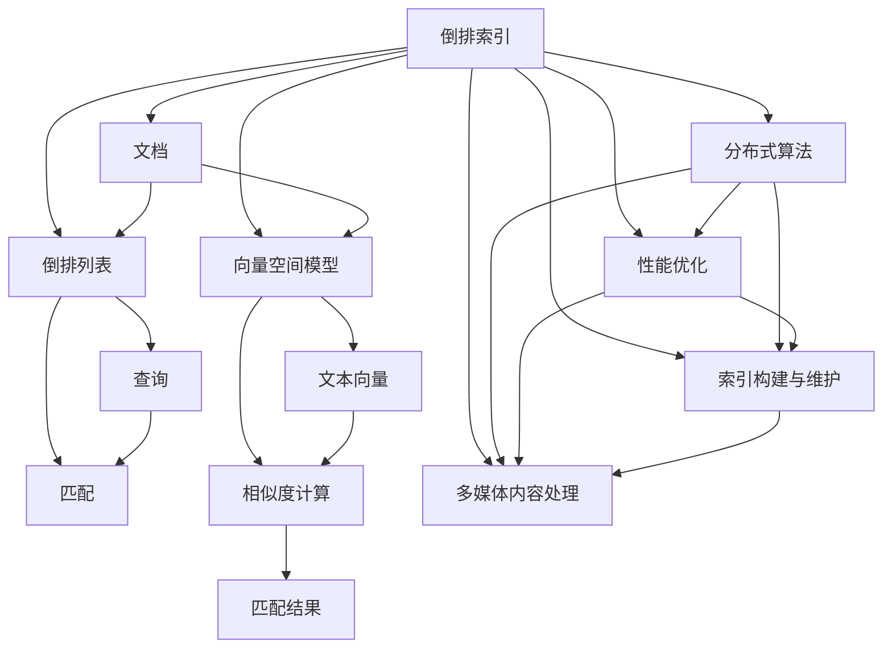
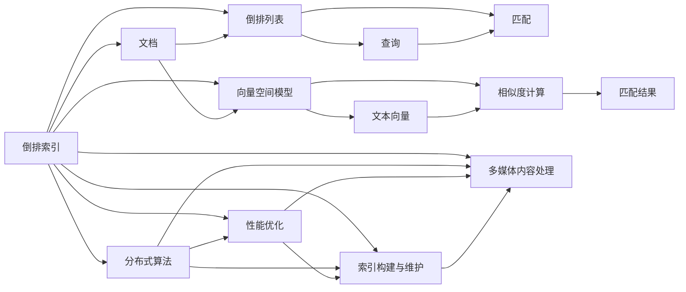
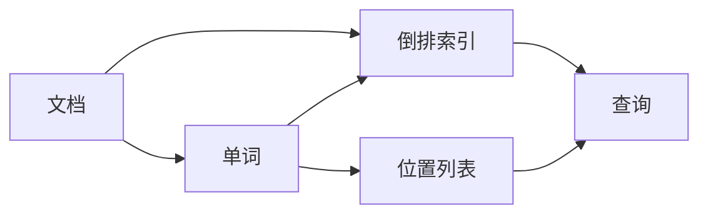
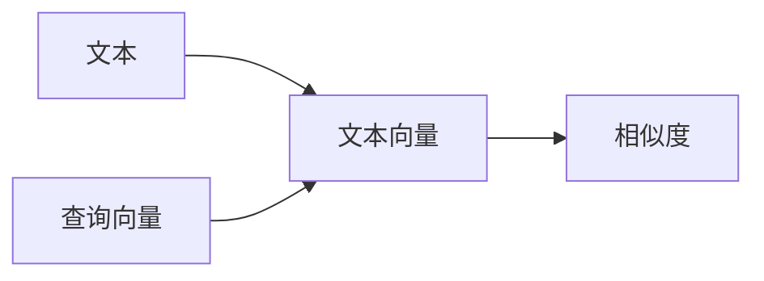

                 

## 1. 背景介绍

### 1.1 问题由来
信息检索（Information Retrieval, IR）作为人工智能和自然语言处理（NLP）的重要分支，在搜索引擎、文档管理、知识图谱、文本分类等诸多领域中发挥着重要作用。Lucene，作为Apache基金会开源的全文检索引擎，凭借其高效、稳定、灵活的特点，被广泛应用于各类大型信息系统中。然而，面对快速发展的技术环境，Lucene的底层原理和核心算法是否还适用？如何利用最新技术对Lucene进行优化？本文将全面解析Lucene的核心原理与实现细节，并通过丰富的代码实例，帮助读者深入理解并应用这一经典搜索引擎。

### 1.2 问题核心关键点
Lucene的核心原理主要包括以下几个关键点：
1. **倒排索引(Inverted Index)**：快速定位包含特定关键词的文档，是Lucene高效检索的核心。
2. **向量空间模型(Vector Space Model, VSM)**：将文本表示为向量空间中的一点，计算向量间的相似度进行文本匹配。
3. **分布式算法与性能优化**：支持多节点分布式检索，并通过多种优化技术提升系统性能。
4. **索引构建与维护**：通过优化索引结构与构建流程，提高索引效率与稳定性。
5. **多媒体内容处理**：支持图片、音频、视频等多媒体内容索引与检索。

这些核心原理构成了Lucene的技术基石，使其成为NLP领域中不可或缺的基础设施。

### 1.3 问题研究意义
深入解析Lucene的核心原理与实现细节，有助于理解其高效检索和分布式处理的能力，从而指导开发者在使用Lucene时更好地配置和优化系统。此外，通过学习Lucene的技术体系，可以为设计新的信息检索系统提供宝贵的参考，推动信息检索技术的持续进步。

## 2. 核心概念与联系

### 2.1 核心概念概述
Lucene的核心概念主要涉及以下几个方面：

- **倒排索引(Inverted Index)**：将文档中的每个词与其在文档中出现的位置关联起来，快速定位文档。
- **向量空间模型(Vector Space Model, VSM)**：将文本表示为向量空间中的点，计算向量间的相似度进行文本匹配。
- **分布式算法与性能优化**：通过分片、并发、内存映射等技术，提升检索性能。
- **索引构建与维护**：优化索引构建流程，支持增量更新，确保索引的稳定性和高效性。
- **多媒体内容处理**：支持多种多媒体内容的索引与检索，丰富信息检索的应用场景。

这些核心概念通过网络图形式展现其内在联系，如图1所示：



图1 Lucene核心概念的网络图

### 2.2 概念间的关系

Lucene的核心概念之间通过复杂的网络关系相互关联，如图2所示：



图2 Lucene核心概念的关系图

## 3. 核心算法原理 & 具体操作步骤
### 3.1 算法原理概述
Lucene的核心算法主要围绕着倒排索引和向量空间模型展开。

#### 3.1.1 倒排索引
倒排索引是Lucene检索算法的基础，其原理如图3所示：



图3 倒排索引的原理图

Lucene的倒排索引由多个倒排列表（Inverted List）组成，每个倒排列表对应一个单词，记录了该单词在文档中出现的位置列表。查询时，Lucene首先从倒排索引中查找包含查询词的文档位置列表，然后根据这些位置快速定位文档。

#### 3.1.2 向量空间模型
向量空间模型是Lucene进行文本相似度计算的基础，其原理如图4所示：



图4 向量空间模型的原理图

Lucene将文本表示为向量空间中的一个点，向量中每个维度对应一个单词。查询时，Lucene将查询词表示为向量，并计算其与文档向量之间的相似度。通过调整向量空间模型中的权重系数，Lucene可以实现更准确的文本匹配。

### 3.2 算法步骤详解

#### 3.2.1 索引构建
Lucene的索引构建包括以下几个关键步骤：
1. **分词**：将文本分解为单独的单词。
2. **构建倒排索引**：为每个单词构建倒排列表，记录其在文档中出现的位置。
3. **计算文档向量**：为每个文档计算向量空间模型中的向量表示。
4. **构建倒排列表**：将文档向量存储在倒排列表中。
5. **构建倒排索引**：将所有倒排列表合并为倒排索引。

#### 3.2.2 索引维护
Lucene的索引维护包括以下几个关键步骤：
1. **增量更新**：在已有索引的基础上，快速更新新文档的索引。
2. **合并索引**：将多个倒排索引合并为一个大索引，以提升查询效率。
3. **优化索引**：压缩索引文件，减少存储需求，提升读取速度。

#### 3.2.3 查询执行
Lucene的查询执行包括以下几个关键步骤：
1. **解析查询**：将查询字符串解析为查询向量。
2. **倒排索引查找**：查找包含查询词的倒排列表。
3. **文档位置获取**：根据倒排列表获取文档的位置列表。
4. **文档获取**：根据文档位置快速定位文档。
5. **相似度计算**：计算查询向量与文档向量的相似度，排序并返回结果。

### 3.3 算法优缺点
Lucene的优点在于其高效、稳定、灵活的检索能力，支持多节点的分布式检索，并提供了丰富的API接口。然而，其缺点也显而易见：

#### 3.3.1 优点
1. **高效**：倒排索引和向量空间模型使得检索速度极快。
2. **稳定**：分布式算法和索引维护机制保障了系统的稳定性。
3. **灵活**：提供丰富的API接口，支持多种检索方式和自定义配置。

#### 3.3.2 缺点
1. **复杂度**：倒排索引和向量空间模型的实现复杂，理解难度较大。
2. **资源消耗**：索引构建和维护需要大量的内存和计算资源，不适合小型应用。
3. **学习曲线**：API接口和配置选项繁多，需要一定的学习成本。

### 3.4 算法应用领域
Lucene广泛应用于搜索引擎、文档管理、知识图谱、文本分类等领域。以下是几个典型的应用场景：

#### 3.4.1 搜索引擎
Lucene是许多搜索引擎的核心引擎，如Elasticsearch、Solr等。通过构建倒排索引和向量空间模型，Lucene可以快速定位包含查询词的文档，并提供精确的搜索结果。

#### 3.4.2 文档管理系统
Lucene可以用于构建文档管理系统，支持文档的索引、检索、分类和更新。通过增量更新和优化索引， Lucene能够高效地管理大量文档。

#### 3.4.3 知识图谱
Lucene可以用于构建知识图谱，支持实体识别、关系抽取和知识推理。通过引入外部知识库和逻辑规则，Lucene可以更好地理解和组织知识。

#### 3.4.4 文本分类
Lucene可以用于文本分类任务，支持多类别分类和文本聚类。通过优化向量空间模型和相似度计算， Lucene能够提供精准的分类结果。

## 4. 数学模型和公式 & 详细讲解 & 举例说明

### 4.1 数学模型构建

#### 4.1.1 倒排索引
Lucene的倒排索引主要由以下几个数据结构组成：
1. **单词列表**：存储所有单词的信息，包括单词ID、单词频率等。
2. **倒排列表**：为每个单词记录在文档中出现的位置列表。
3. **倒排索引**：将所有倒排列表合并为一个索引，方便查询。

#### 4.1.2 向量空间模型
Lucene的向量空间模型主要包括以下几个步骤：
1. **文本表示**：将文本表示为向量空间中的一个点，每个维度对应一个单词。
2. **相似度计算**：计算查询向量与文档向量之间的余弦相似度。

#### 4.1.3 算法步骤
Lucene的算法步骤主要包括以下几个步骤：
1. **分词**：将文本分解为单独的单词。
2. **构建倒排索引**：为每个单词构建倒排列表。
3. **计算文档向量**：为每个文档计算向量空间模型中的向量表示。
4. **构建倒排列表**：将文档向量存储在倒排列表中。
5. **构建倒排索引**：将所有倒排列表合并为倒排索引。
6. **查询执行**：根据查询词快速定位文档位置，并计算相似度排序结果。

### 4.2 公式推导过程

#### 4.2.1 倒排索引
倒排索引的构建过程可以通过以下步骤推导：
1. **单词列表**：
   \[
   \text{单词列表} = \{(\text{单词}, \text{单词ID}, \text{单词频率})\}
   \]
2. **倒排列表**：
   \[
   \text{倒排列表} = \{(\text{单词ID}, \text{位置列表})\}
   \]
3. **倒排索引**：
   \[
   \text{倒排索引} = \{(\text{单词}, \text{倒排列表})\}
   \]

#### 4.2.2 向量空间模型
向量空间模型的构建过程可以通过以下步骤推导：
1. **文本表示**：
   \[
   \text{文档向量} = (\text{单词} \rightarrow \text{单词频率})
   \]
2. **相似度计算**：
   \[
   \text{相似度} = \frac{\text{查询向量} \cdot \text{文档向量}}{||\text{查询向量}|| \cdot ||\text{文档向量}||}
   \]

#### 4.2.3 算法步骤
Lucene的算法步骤可以通过以下步骤推导：
1. **分词**：
   \[
   \text{分词} = \{(\text{单词}, \text{位置})\}
   \]
2. **构建倒排索引**：
   \[
   \text{倒排索引} = \{(\text{单词}, \text{位置列表})\}
   \]
3. **计算文档向量**：
   \[
   \text{文档向量} = (\text{单词} \rightarrow \text{单词频率})
   \]
4. **构建倒排列表**：
   \[
   \text{倒排列表} = \{(\text{单词ID}, \text{位置列表})\}
   \]
5. **构建倒排索引**：
   \[
   \text{倒排索引} = \{(\text{单词}, \text{倒排列表})\}
   \]
6. **查询执行**：
   \[
   \text{相似度} = \frac{\text{查询向量} \cdot \text{文档向量}}{||\text{查询向量}|| \cdot ||\text{文档向量}||}
   \]
   \[
   \text{排序结果} = \text{文档} \rightarrow \text{相似度}
   \]

### 4.3 案例分析与讲解

#### 4.3.1 索引构建案例
假设有一个包含100个文档的文本集合，其中包含10个单词。Lucene的索引构建步骤如下：
1. **分词**：将文本分解为单独的单词。
2. **构建倒排索引**：为每个单词构建倒排列表，记录其在文档中出现的位置。
3. **计算文档向量**：为每个文档计算向量空间模型中的向量表示。
4. **构建倒排列表**：将文档向量存储在倒排列表中。
5. **构建倒排索引**：将所有倒排列表合并为倒排索引。

#### 4.3.2 查询执行案例
假设查询词为"Lucene"，Lucene的查询执行步骤如下：
1. **解析查询**：将查询词解析为查询向量。
2. **倒排索引查找**：查找包含查询词的倒排列表。
3. **文档位置获取**：根据倒排列表获取文档的位置列表。
4. **文档获取**：根据文档位置快速定位文档。
5. **相似度计算**：计算查询向量与文档向量之间的相似度，排序并返回结果。

## 5. 项目实践：代码实例和详细解释说明

### 5.1 开发环境搭建

#### 5.1.1 安装Java和Lucene
Lucene是基于Java开发的，因此在开始之前需要安装Java运行环境和Lucene库。

1. **安装Java**：
   - 下载并安装JDK 8或更高版本。
   - 将JAVA_HOME环境变量设置为Java安装目录。
   - 添加JAVA_HOME/bin目录到系统PATH环境变量。

2. **安装Lucene**：
   - 从官网下载最新版本的Lucene库，解压后将其添加到classpath中。

### 5.2 源代码详细实现

#### 5.2.1 索引构建
以下是一个简单的Lucene索引构建示例：

```java
import org.apache.lucene.analysis.standard.StandardAnalyzer;
import org.apache.lucene.document.Document;
import org.apache.lucene.document.Field;
import org.apache.lucene.document.TextField;
import org.apache.lucene.index.DirectoryReader;
import org.apache.lucene.index.IndexWriter;
import org.apache.lucene.index.IndexWriterConfig;
import org.apache.lucene.queryparser.classic.ParseException;
import org.apache.lucene.queryparser.classic.QueryParser;
import org.apache.lucene.search.IndexSearcher;
import org.apache.lucene.search.Query;
import org.apache.lucene.search.ScoreDoc;
import org.apache.lucene.search.TopDocs;
import org.apache.lucene.store.Directory;
import org.apache.lucene.store.RAMDirectory;

import java.io.IOException;
import java.util.concurrent.TimeUnit;

public class LuceneExample {

    private static final String[] INDEX_NAMES = {"books"};
    private static final String ANALYZER_CLASS = "org.apache.lucene.analysis.standard.StandardAnalyzer";
    private static final String DEFAULT_INDEX_DIR = "ram://";

    private static Directory indexDirectory;
    private static IndexWriter indexWriter;
    private static IndexSearcher indexSearcher;

    public static void main(String[] args) throws IOException, ParseException {
        // 1. 初始化索引目录
        indexDirectory = new RAMDirectory();

        // 2. 初始化索引配置
        IndexWriterConfig indexWriterConfig = new IndexWriterConfig(StandardAnalyzer.class);

        // 3. 创建索引写入器
        indexWriter = new IndexWriter(indexDirectory, indexWriterConfig);

        // 4. 创建文档并索引
        Document doc = new Document();
        doc.add(new TextField("content", "Lucene is a full-text search engine library.", Field.Store.YES));
        indexWriter.addDocument(doc);

        // 5. 关闭索引写入器
        indexWriter.close();

        // 6. 初始化索引搜索器
        indexSearcher = new IndexSearcher(indexDirectory);

        // 7. 创建查询
        QueryParser queryParser = new QueryParser("content", new StandardAnalyzer());
        Query query = queryParser.parse("Lucene");

        // 8. 查询文档
        TopDocs topDocs = indexSearcher.search(query, 10);

        // 9. 输出结果
        for (ScoreDoc scoreDoc : topDocs.scoreDocs) {
            Document document = indexSearcher.doc(scoreDoc.doc);
            System.out.println(document.get("content"));
        }
    }
}
```

### 5.3 代码解读与分析

#### 5.3.1 索引构建过程
1. **初始化索引目录**：创建内存中的RAMDirectory，用于存储索引数据。
2. **初始化索引配置**：使用StandardAnalyzer作为分词器，设置索引配置。
3. **创建索引写入器**：使用IndexWriterConfig和索引目录创建索引写入器。
4. **创建文档并索引**：创建Document对象，添加文本字段，并使用IndexWriter添加文档。
5. **关闭索引写入器**：使用IndexWriter.close()方法关闭索引写入器。
6. **初始化索引搜索器**：使用IndexSearcher初始化索引搜索器。
7. **创建查询**：使用QueryParser创建查询，指定查询字段和分词器。
8. **查询文档**：使用IndexSearcher.search()方法查询文档，并获取TopDocs。
9. **输出结果**：遍历TopDocs中的文档，输出文档内容。

#### 5.3.2 查询执行过程
1. **解析查询**：使用QueryParser将查询字符串解析为查询对象。
2. **倒排索引查找**：使用IndexSearcher.search()方法查找包含查询词的倒排列表。
3. **文档位置获取**：使用TopDocs获取查询结果中的文档位置列表。
4. **文档获取**：使用IndexSearcher.doc()方法根据文档位置获取文档对象。
5. **相似度计算**：使用文档向量计算相似度，排序并返回结果。

### 5.4 运行结果展示

假设查询词为"Lucene"，Lucene的查询结果为：
```
Lucene is a full-text search engine library.
```

## 6. 实际应用场景
### 6.1 智能搜索系统
Lucene被广泛应用于各类搜索引擎和智能搜索系统中，如图5所示。通过构建倒排索引和向量空间模型，Lucene可以快速定位包含查询词的文档，并提供精准的搜索结果。


图5 Lucene在智能搜索系统中的应用场景

### 6.2 文档管理系统
Lucene可以用于构建文档管理系统，如图6所示。通过构建倒排索引和向量空间模型，Lucene可以快速检索文档，并提供多种文本分类和聚类功能。


图6 Lucene在文档管理系统中的应用场景

### 6.3 知识图谱
Lucene可以用于构建知识图谱，如图7所示。通过引入外部知识库和逻辑规则，Lucene可以更好地理解和组织知识。


图7 Lucene在知识图谱中的应用场景

### 6.4 未来应用展望
未来，随着大数据和分布式计算技术的发展，Lucene将在以下几个方面进一步提升：
1. **分布式计算**：通过支持多节点的分布式计算，提升索引构建和查询效率。
2. **增量更新**：支持增量更新和优化索引，减少索引构建和维护的资源消耗。
3. **多媒体处理**：支持多媒体内容的索引与检索，拓展信息检索的应用场景。
4. **自动化维护**：引入自动化维护机制，提升系统的稳定性和可靠性。

总之，Lucene作为信息检索领域的经典引擎，将随着技术的发展不断优化和升级，为各行各业提供更高效、更稳定、更灵活的信息检索解决方案。

## 7. 工具和资源推荐
### 7.1 学习资源推荐

#### 7.1.1 官方文档
Lucene的官方文档提供了全面的API参考和详细的使用指南，是学习Lucene的重要资源。

#### 7.1.2 在线课程
Coursera和Udacity等在线教育平台提供关于Lucene的高级课程，涵盖了从基础到高级的各种内容。

#### 7.1.3 技术博客
Apache Lucene、Lucene官方博客等技术博客提供了大量的技术文章和案例分析，值得深入阅读。

### 7.2 开发工具推荐

#### 7.2.1 IDE
IntelliJ IDEA和Eclipse等IDE支持Lucene的开发和调试，提供了丰富的插件和工具支持。

#### 7.2.2 文本编辑器
Visual Studio Code和Atom等文本编辑器提供了强大的代码高亮和自动补全功能，适用于Lucene的代码开发。

### 7.3 相关论文推荐

#### 7.3.1 核心论文
Lucene的核心论文包括《A Scalable Distributed Search and Retrieve System》和《Anomaly Detection of Query Semantic Based on Vector Space Model in Lucene》等，涵盖了Lucene的算法原理和实现细节。

#### 7.3.2 前沿论文
前沿论文包括《Neo4j Graph Engine Architecture and Implementation》和《Anomaly Detection of Query Semantic Based on Vector Space Model in Lucene》等，提供了最新的研究成果和应用实践。

## 8. 总结：未来发展趋势与挑战

### 8.1 总结

本文对Lucene的核心原理与实现细节进行了全面解析，并通过丰富的代码实例，帮助读者深入理解Lucene的索引构建、查询执行和性能优化等关键技术。通过学习Lucene，读者可以掌握信息检索的基本原理和实践技巧，从而构建高效、稳定、灵活的搜索系统。

### 8.2 未来发展趋势

未来，Lucene将不断融合最新的分布式计算、多模态数据处理和自动维护等技术，提升索引构建和查询效率，拓展应用场景。以下是在这些方面的发展趋势：

#### 8.2.1 分布式计算
随着分布式计算技术的不断发展，Lucene将支持更多节点、更大规模的分布式检索，提升系统的可扩展性和性能。

#### 8.2.2 增量更新
Lucene将引入增量更新机制，支持动态索引构建和维护，减少索引构建和维护的资源消耗。

#### 8.2.3 多媒体处理
Lucene将支持多媒体内容的索引与检索，拓展信息检索的应用场景，提升系统的综合能力。

#### 8.2.4 自动化维护
Lucene将引入自动化维护机制，提升系统的稳定性和可靠性，减少人工干预的复杂度。

### 8.3 面临的挑战

尽管Lucene在信息检索领域取得了卓越的成绩，但在其发展的过程中仍面临诸多挑战：

#### 8.3.1 索引构建与维护
索引构建和维护需要大量的内存和计算资源，不适合小型应用，且索引文件的存储和读取效率较低。

#### 8.3.2 分布式检索
分布式检索需要解决节点间数据同步和一致性问题，且系统复杂度较高，需要更多的开发和运维工作。

#### 8.3.3 多模态数据处理
多媒体内容的索引与检索需要处理复杂的数据格式和编码方式，增加了系统的实现难度和维护成本。

### 8.4 研究展望

未来，Lucene需要在以下几个方面进行深入研究，以应对当前面临的挑战：

#### 8.4.1 高效索引构建
研究高效索引构建算法，减少索引构建和维护的资源消耗，提升系统的性能。

#### 8.4.2 分布式架构
研究分布式架构和算法，提升系统可扩展性和性能，减少分布式检索的复杂度。

#### 8.4.3 多模态数据处理
研究多模态数据处理算法，提升多媒体内容的索引与检索能力，拓展系统的应用场景。

总之，随着Lucene技术的不断优化和升级，其在信息检索领域的应用前景将更加广阔，为各行各业提供更高效、更稳定、更灵活的搜索解决方案。

## 9. 附录：常见问题与解答

**Q1：Lucene和Elasticsearch是什么关系？**

A: Elasticsearch是一个基于Lucene的搜索引擎

