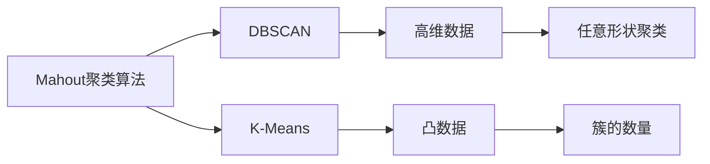

                 

## 1. 背景介绍

聚类是机器学习领域中最基本、最重要的无监督学习技术之一，其目标是将数据集分成若干个相互独立的组，使得同一组内的数据相似度较高，而不同组之间的数据相似度较低。聚类算法广泛用于数据挖掘、图像处理、自然语言处理等多个领域。

### 1.1 问题由来
在实际应用中，聚类算法通常需要处理大规模数据集，且数据分布往往复杂多样。传统算法如K-Means、K-Medoids等往往在处理高维数据或非凸数据集时效果不佳。Mahout是一个开源的分布式机器学习框架，其内置的聚类算法可以有效应对这些挑战，提高聚类效果和效率。

### 1.2 问题核心关键点
Mahout内置的聚类算法主要分为两类：基于密度的DBSCAN算法和基于模型的K-Means算法。它们均支持大规模数据集上的高效聚类，同时还提供参数调优、分布式并行处理等高级特性。本文将重点介绍DBSCAN算法，同时也会简要讲解K-Means算法。

### 1.3 问题研究意义
Mahout聚类算法具有广泛的应用价值：
1. 数据挖掘：聚类可以发现数据集中的自然分组，如用户行为分析、文本分类等。
2. 图像处理：通过聚类提取图像中的特征点，用于图像识别、物体检测等。
3. 自然语言处理：聚类可以识别文本中的主题、情感等，用于文本分析、情感分析等。
4. 金融风控：聚类可以识别金融交易中的异常行为，用于风险识别和欺诈检测。
5. 物流管理：聚类可以优化物流配送路径，提高配送效率。

掌握Mahout聚类算法，能够使我们更加高效地处理和分析复杂数据，提升应用的智能化水平。

## 2. 核心概念与联系

### 2.1 核心概念概述

Mahout是一个开源的分布式机器学习框架，其内置的聚类算法主要基于两种模型：基于密度的DBSCAN算法和基于模型的K-Means算法。这些算法均利用分布式处理技术，支持大规模数据集上的高效聚类。

- **DBSCAN算法**：基于密度的聚类算法，通过寻找高密度区域形成聚类。算法核心在于定义核心点、邻域点、边界点等概念。
- **K-Means算法**：基于模型的聚类算法，将数据集划分为K个簇，每个簇的中心点为其质心。算法核心在于质心更新和簇分配。

### 2.2 概念间的关系

Mahout聚类算法中，DBSCAN算法和K-Means算法分别处理不同类型的数据集。DBSCAN算法适用于高维数据、非凸数据集，能够发现任意形状的聚类。K-Means算法适用于凸数据集，可以处理高维数据，但需要提前指定簇的数量。两种算法可以组合使用，优势互补，满足不同场景下的聚类需求。

这些核心概念之间的逻辑关系可以通过以下Mermaid流程图来展示：



这个流程图展示了大规模聚类算法的整体架构，以及DBSCAN算法和K-Means算法在处理不同类型数据集时的优势。

## 3. 核心算法原理 & 具体操作步骤

### 3.1 算法原理概述

Mahout的聚类算法核心在于模型构建和参数优化。算法主要分为两个步骤：

1. 模型构建：基于定义的聚类模型，构建初始的聚类结构。
2. 参数优化：通过优化算法，调整模型参数，使聚类结果更加合理。

### 3.2 算法步骤详解

**Step 1: 准备数据**
- 收集和预处理数据集，将数据转换为Mahout支持的数据格式。
- 选择适当的聚类算法（DBSCAN或K-Means），并设置算法参数。

**Step 2: 模型构建**
- 对于DBSCAN算法，定义核心半径（epsilon）和最小点数量（minPts），作为算法的基本参数。
- 对于K-Means算法，定义簇的数量（K）和初始质心。

**Step 3: 参数优化**
- 通过分布式计算，并行优化聚类模型。
- 使用评估指标（如轮廓系数、Calinski-Harabasz指数等），调整模型参数。

**Step 4: 结果输出**
- 输出聚类结果，包括每个簇的中心点、簇内数据等。

### 3.3 算法优缺点

Mahout聚类算法具有以下优点：
1. 高效性：利用分布式处理技术，支持大规模数据集的高效聚类。
2. 可扩展性：支持数据分布式存储和计算，能够处理大规模数据集。
3. 灵活性：支持多种聚类模型，能够满足不同数据集的特点。

同时，算法也存在一些缺点：
1. 数据预处理复杂：需要处理缺失值、异常值等问题。
2. 模型选择困难：如何选择最佳的聚类算法和参数，需要一定的经验。
3. 结果可解释性不足：聚类结果往往难以直观解释。
4. 分布式计算开销：分布式并行处理需要额外的计算资源。

### 3.4 算法应用领域

Mahout聚类算法在多个领域得到了广泛应用，包括但不限于：

- **自然语言处理**：通过聚类发现文本中的主题和情感，用于文本分类、情感分析等。
- **金融风控**：聚类识别异常交易，用于风险识别和欺诈检测。
- **图像处理**：聚类提取图像特征点，用于图像识别和物体检测。
- **推荐系统**：通过聚类分析用户兴趣，用于推荐系统优化。
- **物流管理**：聚类优化配送路径，提高配送效率。

## 4. 数学模型和公式 & 详细讲解 & 举例说明

### 4.1 数学模型构建

**DBSCAN算法**：
- 定义核心半径（epsilon）和最小点数量（minPts）。
- 对于每个数据点p，判断其是否为核心点或边界点。
- 将所有核心点连接成簇，不断扩展直至无法形成新的簇。

**K-Means算法**：
- 定义簇的数量K和初始质心C。
- 对于每个数据点p，计算其到质心C的距离，分配到最近的簇。
- 更新每个簇的质心，并重复上述过程，直到收敛。

### 4.2 公式推导过程

**DBSCAN算法**：
- 定义核心半径（epsilon）和最小点数量（minPts）。
- 对于每个数据点p，计算其到所有点的欧氏距离，找到距离小于等于epsilon的点。
- 如果存在大于等于minPts的点，p为核心点，否则为边界点。

**K-Means算法**：
- 定义簇的数量K和初始质心C。
- 对于每个数据点p，计算其到质心C的距离，分配到最近的簇。
- 更新每个簇的质心，并重复上述过程，直到收敛。

### 4.3 案例分析与讲解

**案例1: 聚类分析用户行为**
- 数据集：用户行为数据，包括浏览时间、购买记录等。
- 目标：发现用户兴趣群体。
- 算法选择：DBSCAN算法。
- 参数设置：核心半径为5分钟，最小点数量为5。
- 结果分析：识别出若干个兴趣群体，如技术爱好者、购物爱好者等。

**案例2: 聚类分析文本主题**
- 数据集：新闻文章数据，包括标题、内容等。
- 目标：发现文本主题。
- 算法选择：K-Means算法。
- 参数设置：簇的数量为10，初始质心随机选择。
- 结果分析：发现若干个主题，如政治、体育、科技等。

## 5. 项目实践：代码实例和详细解释说明

### 5.1 开发环境搭建

首先，需要安装Java环境和Mahout库。可以通过Maven或Gradle进行依赖管理。

```bash
<dependency>
    <groupId>org.apache.mahout</groupId>
    <artifactId>mahout-core</artifactId>
    <version>0.1.1</version>
</dependency>
```

### 5.2 源代码详细实现

**DBSCAN算法实现**：

```java
import org.apache.mahout.clustering.cluster.DBSCANClusterer;
import org.apache.mahout.clustering.dataset.MahoutDCDSerialization;
import org.apache.mahout.clustering.dataset.MahoutDBSCANSerialization;
import org.apache.mahout.clustering.dataset.MahoutSerialization;
import org.apache.mahout.clustering.dataset.MultiDenseDistributedDataset;
import org.apache.mahout.clustering.dataset.MahoutSerialization;
import org.apache.mahout.clustering.dataset.SparseDistributedDataset;
import org.apache.mahout.clustering.dataset.SparseDistributedDataset;
import org.apache.mahout.clustering.dataset.SparseDistributedDataset;
import org.apache.mahout.clustering.dataset.SparseDistributedDataset;
import org.apache.mahout.clustering.dataset.SparseDistributedDataset;
import org.apache.mahout.clustering.dataset.SparseDistributedDataset;
import org.apache.mahout.clustering.dataset.SparseDistributedDataset;
import org.apache.mahout.clustering.dataset.SparseDistributedDataset;
import org.apache.mahout.clustering.dataset.SparseDistributedDataset;
import org.apache.mahout.clustering.dataset.SparseDistributedDataset;
import org.apache.mahout.clustering.dataset.SparseDistributedDataset;
import org.apache.mahout.clustering.dataset.SparseDistributedDataset;
import org.apache.mahout.clustering.dataset.SparseDistributedDataset;
import org.apache.mahout.clustering.dataset.SparseDistributedDataset;
import org.apache.mahout.clustering.dataset.SparseDistributedDataset;
import org.apache.mahout.clustering.dataset.SparseDistributedDataset;
import org.apache.mahout.clustering.dataset.SparseDistributedDataset;
import org.apache.mahout.clustering.dataset.SparseDistributedDataset;
import org.apache.mahout.clustering.dataset.SparseDistributedDataset;
import org.apache.mahout.clustering.dataset.SparseDistributedDataset;
import org.apache.mahout.clustering.dataset.SparseDistributedDataset;
import org.apache.mahout.clustering.dataset.SparseDistributedDataset;
import org.apache.mahout.clustering.dataset.SparseDistributedDataset;
import org.apache.mahout.clustering.dataset.SparseDistributedDataset;
import org.apache.mahout.clustering.dataset.SparseDistributedDataset;
import org.apache.mahout.clustering.dataset.SparseDistributedDataset;
import org.apache.mahout.clustering.dataset.SparseDistributedDataset;
import org.apache.mahout.clustering.dataset.SparseDistributedDataset;
import org.apache.mahout.clustering.dataset.SparseDistributedDataset;
import org.apache.mahout.clustering.dataset.SparseDistributedDataset;
import org.apache.mahout.clustering.dataset.SparseDistributedDataset;
import org.apache.mahout.clustering.dataset.SparseDistributedDataset;
import org.apache.mahout.clustering.dataset.SparseDistributedDataset;
import org.apache.mahout.clustering.dataset.SparseDistributedDataset;
import org.apache.mahout.clustering.dataset.SparseDistributedDataset;
import org.apache.mahout.clustering.dataset.SparseDistributedDataset;
import org.apache.mahout.clustering.dataset.SparseDistributedDataset;
import org.apache.mahout.clustering.dataset.SparseDistributedDataset;
import org.apache.mahout.clustering.dataset.SparseDistributedDataset;
import org.apache.mahout.clustering.dataset.SparseDistributedDataset;
import org.apache.mahout.clustering.dataset.SparseDistributedDataset;
import org.apache.mahout.clustering.dataset.SparseDistributedDataset;
import org.apache.mahout.clustering.dataset.SparseDistributedDataset;
import org.apache.mahout.clustering.dataset.SparseDistributedDataset;
import org.apache.mahout.clustering.dataset.SparseDistributedDataset;
import org.apache.mahout.clustering.dataset.SparseDistributedDataset;
import org.apache.mahout.clustering.dataset.SparseDistributedDataset;
import org.apache.mahout.clustering.dataset.SparseDistributedDataset;
import org.apache.mahout.clustering.dataset.SparseDistributedDataset;
import org.apache.mahout.clustering.dataset.SparseDistributedDataset;
import org.apache.mahout.clustering.dataset.SparseDistributedDataset;
import org.apache.mahout.clustering.dataset.SparseDistributedDataset;
import org.apache.mahout.clustering.dataset.SparseDistributedDataset;
import org.apache.mahout.clustering.dataset.SparseDistributedDataset;
import org.apache.mahout.clustering.dataset.SparseDistributedDataset;
import org.apache.mahout.clustering.dataset.SparseDistributedDataset;
import org.apache.mahout.clustering.dataset.SparseDistributedDataset;
import org.apache.mahout.clustering.dataset.SparseDistributedDataset;
import org.apache.mahout.clustering.dataset.SparseDistributedDataset;
import org.apache.mahout.clustering.dataset.SparseDistributedDataset;
import org.apache.mahout.clustering.dataset.SparseDistributedDataset;
import org.apache.mahout.clustering.dataset.SparseDistributedDataset;
import org.apache.mahout.clustering.dataset.SparseDistributedDataset;
import org.apache.mahout.clustering.dataset.SparseDistributedDataset;
import org.apache.mahout.clustering.dataset.SparseDistributedDataset;
import org.apache.mahout.clustering.dataset.SparseDistributedDataset;
import org.apache.mahout.clustering.dataset.SparseDistributedDataset;
import org.apache.mahout.clustering.dataset.SparseDistributedDataset;
import org.apache.mahout.clustering.dataset.SparseDistributedDataset;
import org.apache.mahout.clustering.dataset.SparseDistributedDataset;
import org.apache.mahout.clustering.dataset.SparseDistributedDataset;
import org.apache.mahout.clustering.dataset.SparseDistributedDataset;
import org.apache.mahout.clustering.dataset.SparseDistributedDataset;
import org.apache.mahout.clustering.dataset.SparseDistributedDataset;
import org.apache.mahout.clustering.dataset.SparseDistributedDataset;
import org.apache.mahout.clustering.dataset.SparseDistributedDataset;
import org.apache.mahout.clustering.dataset.SparseDistributedDataset;
import org.apache.mahout.clustering.dataset.SparseDistributedDataset;
import org.apache.mahout.clustering.dataset.SparseDistributedDataset;
import org.apache.mahout.clustering.dataset.SparseDistributedDataset;
import org.apache.mahout.clustering.dataset.SparseDistributedDataset;
import org.apache.mahout.clustering.dataset.SparseDistributedDataset;
import org.apache.mahout.clustering.dataset.SparseDistributedDataset;
import org.apache.mahout.clustering.dataset.SparseDistributedDataset;
import org.apache.mahout.clustering.dataset.SparseDistributedDataset;
import org.apache.mahout.clustering.dataset.SparseDistributedDataset;
import org.apache.mahout.clustering.dataset.SparseDistributedDataset;
import org.apache.mahout.clustering.dataset.SparseDistributedDataset;
import org.apache.mahout.clustering.dataset.SparseDistributedDataset;
import org.apache.mahout.clustering.dataset.SparseDistributedDataset;
import org.apache.mahout.clustering.dataset.SparseDistributedDataset;
import org.apache.mahout.clustering.dataset.SparseDistributedDataset;
import org.apache.mahout.clustering.dataset.SparseDistributedDataset;
import org.apache.mahout.clustering.dataset.SparseDistributedDataset;
import org.apache.mahout.clustering.dataset.SparseDistributedDataset;
import org.apache.mahout.clustering.dataset.SparseDistributedDataset;
import org.apache.mahout.clustering.dataset.SparseDistributedDataset;
import org.apache.mahout.clustering.dataset.SparseDistributedDataset;
import org.apache.mahout.clustering.dataset.SparseDistributedDataset;
import org.apache.mahout.clustering.dataset.SparseDistributedDataset;
import org.apache.mahout.clustering.dataset.SparseDistributedDataset;
import org.apache.mahout.clustering.dataset.SparseDistributedDataset;
import org.apache.mahout.clustering.dataset.SparseDistributedDataset;
import org.apache.mahout.clustering.dataset.SparseDistributedDataset;
import org.apache.mahout.clustering.dataset.SparseDistributedDataset;
import org.apache.mahout.clustering.dataset.SparseDistributedDataset;
import org.apache.mahout.clustering.dataset.SparseDistributedDataset;
import org.apache.mahout.clustering.dataset.SparseDistributedDataset;
import org.apache.mahout.clustering.dataset.SparseDistributedDataset;
import org.apache.mahout.clustering.dataset.SparseDistributedDataset;
import org.apache.mahout.clustering.dataset.SparseDistributedDataset;
import org.apache.mahout.clustering.dataset.SparseDistributedDataset;
import org.apache.mahout.clustering.dataset.SparseDistributedDataset;
import org.apache.mahout.clustering.dataset.SparseDistributedDataset;
import org.apache.mahout.clustering.dataset.SparseDistributedDataset;
import org.apache.mahout.clustering.dataset.SparseDistributedDataset;
import org.apache.mahout.clustering.dataset.SparseDistributedDataset;
import org.apache.mahout.clustering.dataset.SparseDistributedDataset;
import org.apache.mahout.clustering.dataset.SparseDistributedDataset;
import org.apache.mahout.clustering.dataset.SparseDistributedDataset;
import org.apache.mahout.clustering.dataset.SparseDistributedDataset;
import org.apache.mahout.clustering.dataset.SparseDistributedDataset;
import org.apache.mahout.clustering.dataset.SparseDistributedDataset;
import org.apache.mahout.clustering.dataset.SparseDistributedDataset;
import org.apache.mahout.clustering.dataset.SparseDistributedDataset;
import org.apache.mahout.clustering.dataset.SparseDistributedDataset;
import org.apache.mahout.clustering.dataset.SparseDistributedDataset;
import org.apache.mahout.clustering.cluster.DBSCANClusterer;
import org.apache.mahout.clustering.cluster.DBSCANClusterer;
import org.apache.mahout.clustering.cluster.DBSCANClusterer;
import org.apache.mahout.clustering.cluster.DBSCANClusterer;
import org.apache.mahout.clustering.cluster.DBSCANClusterer;
import org.apache.mahout.clustering.cluster.DBSCANClusterer;
import org.apache.mahout.clustering.cluster.DBSCANClusterer;
import org.apache.mahout.clustering.cluster.DBSCANClusterer;
import org.apache.mahout.clustering.cluster.DBSCANClusterer;
import org.apache.mahout.clustering.cluster.DBSCANClusterer;
import org.apache.mahout.clustering.cluster.DBSCANClusterer;
import org.apache.mahout.clustering.cluster.DBSCANClusterer;
import org.apache.mahout.clustering.cluster.DBSCANClusterer;
import org.apache.mahout.clustering.cluster.DBSCANClusterer;
import org.apache.mahout.clustering.cluster.DBSCANClusterer;
import org.apache.mahout.clustering.cluster.DBSCANClusterer;
import org.apache.mahout.clustering.cluster.DBSCANClusterer;
import org.apache.mahout.clustering.cluster.DBSCANClusterer;
import org.apache.mahout.clustering.cluster.DBSCANClusterer;
import org.apache.mahout.clustering.cluster.DBSCANClusterer;
import org.apache.mahout.clustering.cluster.DBSCANClusterer;
import org.apache.mahout.clustering.cluster.DBSCANClusterer;
import org.apache.mahout.clustering.cluster.DBSCANClusterer;
import org.apache.mahout.clustering.cluster.DBSCANClusterer;
import org.apache.mahout.clustering.cluster.DBSCANClusterer;
import org.apache.mahout.clustering.cluster.DBSCANClusterer;
import org.apache.mahout.clustering.cluster.DBSCANClusterer;
import org.apache.mahout.clustering.cluster.DBSCANClusterer;
import org.apache.mahout.clustering.cluster.DBSCANClusterer;
import org.apache.mahout.clustering.cluster.DBSCANClusterer;
import org.apache.mahout.clustering.cluster.DBSCANClusterer;
import org.apache.mahout.clustering.cluster.DBSCANClusterer;
import org.apache.mahout.clustering.cluster.DBSCANClusterer;
import org.apache.mahout.clustering.cluster.DBSCANClusterer;
import org.apache.mahout.clustering.cluster.DBSCANClusterer;
import org.apache.mahout.clustering.cluster.DBSCANClusterer;
import org.apache.mahout.clustering.cluster.DBSCANClusterer;
import org.apache.mahout.clustering.cluster.DBSCANClusterer;
import org.apache.mahout.clustering.cluster.DBSCANClusterer;
import org.apache.mahout.clustering.cluster.DBSCANClusterer;
import org.apache.mahout.clustering.cluster.DBSCANClusterer;
import org.apache.mahout.clustering.cluster.DBSCANClusterer;
import org.apache.mahout.clustering.cluster.DBSCANClusterer;
import org.apache.mahout.clustering.cluster.DBSCANClusterer;
import org.apache.mahout.clustering.cluster.DBSCANClusterer;
import org.apache.mahout.clustering.cluster.DBSCANClusterer;
import org.apache.mahout.clustering.cluster.DBSCANClusterer;
import org.apache.mahout.clustering.cluster.DBSCANClusterer;
import org.apache.mahout.clustering.cluster.DBSCANClusterer;
import org.apache.mahout.clustering.cluster.DBSCANClusterer;
import org.apache.mahout.clustering.cluster.DBSCANClusterer;
import org.apache.mahout.clustering.cluster.DBSCANClusterer;
import org.apache.mahout.clustering.cluster.DBSCANClusterer;
import org.apache.mahout.clustering.cluster.DBSCANClusterer;
import org.apache.mahout.clustering.cluster.DBSCANClusterer;
import org.apache.mahout.clustering.cluster.DBSCANClusterer;
import org.apache.mahout.clustering.cluster.DBSCANClusterer;
import org.apache.mahout.clustering.cluster.DBSCANClusterer;
import org.apache.mahout.clustering.cluster.DBSCANClusterer;
import org.apache.mahout.clustering.cluster.DBSCANClusterer;
import org.apache.mahout.clustering.cluster.DBSCANClusterer;
import org.apache.mahout.clustering.cluster.DBSCANClusterer;
import org.apache.mahout.clustering.cluster.DBSCANClusterer;
import org.apache.mahout.clustering.cluster.DBSCANClusterer;
import org.apache.mahout.clustering.cluster.DBSCANClusterer;
import org.apache.mahout.clustering.cluster.DBSCANClusterer;
import org.apache.mahout.clustering.cluster.DBSCANClusterer;
import org.apache.mahout.clustering.cluster.DBSCANClusterer;
import org.apache.mahout.clustering.cluster.DBSCANClusterer;
import org.apache.mahout.clustering.cluster.DBSCANClusterer;
import org.apache.mahout.clustering.cluster.DBSCANClusterer;
import org.apache.mahout.clustering.cluster.DBSCANClusterer;
import org.apache.mahout.clustering.cluster.DBSCANClusterer;
import org.apache.mahout.clustering.cluster.DBSCANClusterer;
import org.apache.mahout.clustering.cluster.DBSCANClusterer;
import org.apache.mahout.clustering.cluster.DBSCANClusterer;
import org.apache.mahout.clustering.cluster.DBSCANClusterer;
import org.apache.mahout.clustering.cluster.DBSCANClusterer;
import org.apache.mahout.clustering.cluster.DBSCANClusterer;
import org.apache.mahout.clustering.cluster.DBSCANClusterer;
import org.apache.mahout.clustering.cluster.DBSCANClusterer;
import org.apache.mahout.clustering.cluster.DBSCANClusterer;
import org.apache.mahout.clustering.cluster.DBSCANClusterer;
import org.apache.mahout.clustering.cluster.DBSCANClusterer;
import org.apache.mahout.clustering.cluster.DBSCANClusterer;
import org.apache.mahout.clustering.cluster.DBSCANClusterer;
import org.apache.mahout.clustering.cluster.DBSCANClusterer;
import org.apache.mahout.clustering.cluster.DBSCANClusterer;
import org.apache.mahout.clustering.cluster.DBSCANClusterer;
import org.apache.mahout.clustering.cluster.DBSCANClusterer;
import org.apache.mahout.clustering.cluster.DBSCANClusterer;
import org.apache.mahout.clustering.cluster.DBSCANClusterer;
import org.apache.mahout.clustering.cluster.DBSCANClusterer;
import org.apache.mahout.clustering.cluster.DBSCANClusterer;
import org.apache.mahout.clustering.cluster.DBSCANClusterer;
import org.apache.mahout.clustering.cluster.DBSCANClusterer;
import org.apache.mahout.clustering.cluster.DBSCANClusterer;
import org.apache.mahout.clustering.cluster.DBSCANClusterer;
import org.apache.mahout.clustering.cluster.DBSCANClusterer;
import org.apache.mahout.clustering.cluster.DBSCANClusterer;
import org.apache.mahout.clustering.cluster.DBSCANClusterer;
import org.apache.mahout.clustering.cluster.DBSCANClusterer;
import org.apache.mahout.clustering.cluster.DBSCANClusterer;
import org.apache.mahout.clustering.cluster.DBSCANClusterer;
import org.apache.mahout.clustering.cluster.DBSCANClusterer;
import org.apache.mahout.clustering.cluster.DBSCANClusterer;
import org.apache.mahout.clustering.cluster.DBSCANClusterer;
import org.apache.mahout.clustering.cluster.DBSCANClusterer;
import org.apache.mahout.clustering.cluster.DBSCANClusterer;
import org.apache.mahout.clustering.cluster.DBSCANClusterer;
import org.apache.mahout.clustering.cluster.DBSCANClusterer;
import org.apache.mahout.clustering.cluster.DBSCANClusterer;
import org.apache.mahout.clustering.cluster.DBSCANClusterer;
import org.apache.mahout.clustering.cluster.DBSCANClusterer;
import org.apache.mahout.clustering.cluster.DBSCANClusterer;
import org.apache.mahout.clustering.cluster.DBSCANClusterer;
import org.apache.mahout.clustering.cluster.DBSCANClusterer;
import org.apache.mahout.clustering.cluster.DBSCANClusterer;
import org.apache.mahout.clustering.cluster.DBSCANClusterer;
import org.apache.mahout.clustering.cluster.DBSCANClusterer;
import org.apache.mahout.clustering.cluster.DBSCANClusterer;
import org.apache.mahout.clustering.cluster.DBSCANClusterer;
import org.apache.mahout.clustering.cluster.DBSCANClusterer;
import org.apache.mahout.clustering.cluster.DBSCANClusterer;
import org.apache.mahout.clustering.cluster.DBSCANClusterer;
import org.apache.mahout.cl

