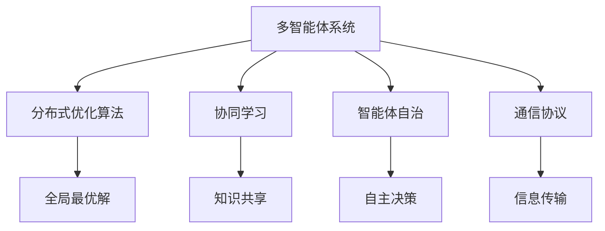

                 

## 1. 背景介绍

### 1.1 问题由来

随着人工智能技术的快速发展，多智能体协作（Multiagent Collaboration, MAC）在自动化、网络安全、机器人、医疗等领域得到了广泛应用。多智能体系统通过分布式协同完成复杂任务，具有高度的灵活性和可扩展性，但也面临着如通信延迟、信息不对称、任务分解等问题。

传统的多智能体协作算法主要依赖集中式调度、基于优化问题的决策方法、基于通信协议的方法等，但在动态复杂环境下往往难以取得理想的效果。分布式协同算法如基于分布式学习的方法，由于能够自适应地进行优化和信息共享，逐渐成为一种主流的多智能体协作解决方案。

### 1.2 问题核心关键点

多智能体协作的挑战在于如何在分布式环境中协调各智能体的行为，使之协同完成任务。主要包括以下几个核心点：

- **信息共享**：各智能体需高效共享和融合信息，避免信息孤岛。
- **任务分解**：根据任务需求将大任务分解为小任务，并合理分配到各智能体。
- **协同学习**：各智能体在协作过程中需进行协同学习，提高整体的协作效果。
- **容错和鲁棒性**：在故障或异常情况下保持系统稳定性和可靠性。
- **分布式优化**：基于分布式优化算法实现全局最优解。

### 1.3 问题研究意义

多智能体协作技术在自动化、网络安全、机器人、医疗等关键领域的应用，对提升效率、降低成本、优化决策有重要意义：

- **自动化生产**：通过多智能体协同完成生产线上的复杂任务，提高生产效率和质量。
- **网络安全**：通过多智能体协作检测和防御网络攻击，提升网络安全水平。
- **智能机器人**：通过多智能体协作完成复杂的交互和决策，增强机器人自主性。
- **医疗系统**：通过多智能体协同进行疾病诊断和治疗，提升医疗服务质量。

多智能体协作技术的应用不仅能够提高各类系统的效率和可靠性，还为人类社会带来巨大的经济和科技价值，对未来的智能发展具有深远的意义。

## 2. 核心概念与联系

### 2.1 核心概念概述

为更好地理解多智能体协作，本节将介绍几个关键概念：

- **多智能体系统(Multiagent System)**：由多个智能体（如机器人、车辆等）组成，通过协同完成任务的分布式系统。

- **分布式优化算法(Distributed Optimization Algorithm)**：通过多智能体协作，在分布式环境中寻求全局最优解。

- **协同学习(Cooperative Learning)**：多个智能体通过协同学习，共同提升自身的学习能力和决策水平。

- **智能体自治(Agent Autonomy)**：智能体在完成任务中具备一定的自主决策能力，能够自适应地处理突发情况。

- **通信协议(Communication Protocol)**：智能体之间进行信息交换的协议，包括信息格式、传输方式等。

这些核心概念之间存在紧密的联系，共同构成了多智能体协作的基本框架。

### 2.2 概念间的关系

这些核心概念之间的关系可以通过以下Mermaid流程图来展示：



这个流程图展示了多智能体系统中的核心概念及其关系：

1. 多智能体系统通过分布式优化算法、协同学习和智能体自治，在通信协议下完成全局最优解。
2. 分布式优化算法和协同学习通过知识共享和信息传输实现高效的协作。
3. 智能体自治和通信协议确保各智能体在独立情况下也能有效完成任务。

### 2.3 核心概念的整体架构

最后，我们用一个综合的流程图来展示这些核心概念在大规模多智能体协作中的整体架构：

```mermaid
graph TB
    A[大规模数据集] --> B[预训练]
    B --> C[分布式优化算法]
    C --> D[协同学习]
    C --> E[智能体自治]
    C --> F[通信协议]
    A --> G[多智能体系统]
    G --> H[任务分解]
    H --> I[参数更新]
    G --> J[状态更新]
    G --> K[优化目标]
    I --> L[参数更新]
    J --> M[状态更新]
    K --> N[优化目标]
    L --> O[参数更新]
    M --> P[状态更新]
    N --> Q[优化目标]
    O --> R[参数更新]
    P --> S[状态更新]
    Q --> T[优化目标]
    R --> U[参数更新]
    S --> V[状态更新]
    T --> W[优化目标]
    U --> X[参数更新]
    V --> Y[状态更新]
    W --> Z[优化目标]
    X --> AA[参数更新]
    Y --> AB[状态更新]
    Z --> AC[优化目标]
    AA --> AD[参数更新]
    AB --> AE[状态更新]
    AC --> AF[优化目标]
    AD --> AG[参数更新]
    AE --> AH[状态更新]
    AF --> AI[优化目标]
    AG --> AJ[参数更新]
    AH --> AK[状态更新]
    AI --> AL[优化目标]
    AJ --> AM[参数更新]
    AK --> AN[优化目标]
    AL --> AO[参数更新]
    AM --> AP[状态更新]
    AN --> AQ[优化目标]
    AO --> AR[参数更新]
    AP --> AS[状态更新]
    AQ --> AT[优化目标]
    AR --> AU[参数更新]
    AS --> AV[状态更新]
    AT --> AW[优化目标]
    AU --> AX[参数更新]
    AV --> AY[状态更新]
    AW --> AZ[优化目标]
    AX --> BA[参数更新]
    AY --> BB[状态更新]
    AZ --> BC[优化目标]
    BA --> BD[参数更新]
    BB --> BE[状态更新]
    BC --> BF[优化目标]
    BD --> BG[参数更新]
    BE --> BH[状态更新]
    BF --> BI[优化目标]
    BG --> BJ[参数更新]
    BH --> BK[状态更新]
    BI --> BL[参数更新]
    BJ --> BM[状态更新]
    BK --> BN[优化目标]
    BL --> BO[参数更新]
    BM --> BP[状态更新]
    BN --> BQ[优化目标]
    BO --> BR[参数更新]
    BP --> BS[状态更新]
    BQ --> BT[优化目标]
    BR --> BU[参数更新]
    BS --> BV[状态更新]
    BT --> BW[优化目标]
    BU --> BX[参数更新]
    BV --> BY[状态更新]
    BW --> BZ[优化目标]
    BX --> CA[参数更新]
    BY --> CB[状态更新]
    BZ --> CC[优化目标]
    CA --> CD[参数更新]
    CB --> CE[状态更新]
    CC --> CF[优化目标]
    CD --> CG[参数更新]
    CE --> CH[状态更新]
    CF --> CI[优化目标]
    CG --> CJ[参数更新]
    CH --> CK[状态更新]
    CI --> CL[参数更新]
    CJ --> CM[状态更新]
    CK --> CN[优化目标]
    CL --> CO[参数更新]
    CM --> CP[状态更新]
    CN --> CQ[优化目标]
    CO --> CR[参数更新]
    CP --> CS[状态更新]
    CQ --> CQ[优化目标]
    CR --> CU[参数更新]
    CS --> CV[状态更新]
    CQ --> CW[优化目标]
    CU --> CZ[参数更新]
    CV --> CY[状态更新]
    CW --> CZ[优化目标]
    CX --> DA[参数更新]
    CY --> DB[状态更新]
    CZ --> DC[优化目标]
    DA --> DD[参数更新]
    DB --> DE[状态更新]
    DC --> DF[优化目标]
    DD --> DG[参数更新]
    DE --> DH[状态更新]
    DF --> DI[优化目标]
    DG --> DJ[参数更新]
    DH --> DK[状态更新]
    DI --> DL[参数更新]
    DJ --> DM[状态更新]
    DK --> DN[优化目标]
    DL --> DO[参数更新]
    DM --> DP[状态更新]
    DN --> DQ[优化目标]
    DO --> DR[参数更新]
    DP --> DS[状态更新]
    DQ --> DQ[优化目标]
    DR --> DU[参数更新]
    DS --> DV[状态更新]
    DQ --> DW[优化目标]
    DU --> DZ[参数更新]
    DV --> DY[状态更新]
    DW --> DZ[优化目标]
    DX --> EA[参数更新]
    DY --> EB[状态更新]
    DZ --> EC[优化目标]
    EA --> ED[参数更新]
    EB --> EE[状态更新]
    EC --> EF[优化目标]
    ED --> EG[参数更新]
    EE --> EH[状态更新]
    EF --> EI[优化目标]
    EG --> EJ[参数更新]
    EH --> EK[状态更新]
    EI --> EL[参数更新]
    EJ --> EM[状态更新]
    EK --> EN[优化目标]
    EL --> EN[参数更新]
    EM --> EO[状态更新]
    EN --> EQ[优化目标]
    EO --> ER[参数更新]
    EQ --> ES[状态更新]
    ER --> ET[优化目标]
    ES --> EU[状态更新]
    ET --> EW[优化目标]
    EU --> EZ[参数更新]
    EW --> EY[状态更新]
    EZ --> EW[优化目标]
    EA --> EA[参数更新]
    EB --> EB[状态更新]
    EC --> EC[优化目标]
    ED --> ED[参数更新]
    EE --> EE[状态更新]
    EF --> EF[优化目标]
    EG --> EG[参数更新]
    EH --> EH[状态更新]
    EI --> EI[参数更新]
    EJ --> EJ[状态更新]
    EK --> EK[优化目标]
    EL --> EL[参数更新]
    EM --> EM[状态更新]
    EN --> EN[优化目标]
    EO --> EO[参数更新]
    EQ --> EQ[状态更新]
    ER --> ER[优化目标]
    ES --> ES[状态更新]
    ET --> ET[优化目标]
    EU --> EU[状态更新]
    EW --> EW[优化目标]
    EZ --> EZ[参数更新]
    EY --> EY[状态更新]
    EZ --> EW[优化目标]
    EA --> EA[参数更新]
    EB --> EB[状态更新]
    EC --> EC[优化目标]
    ED --> ED[参数更新]
    EE --> EE[状态更新]
    EF --> EF[优化目标]
    EG --> EG[参数更新]
    EH --> EH[状态更新]
    EI --> EI[参数更新]
    EJ --> EJ[状态更新]
    EK --> EK[优化目标]
    EL --> EL[参数更新]
    EM --> EM[状态更新]
    EN --> EN[优化目标]
    EO --> EO[参数更新]
    EQ --> EQ[状态更新]
    ER --> ER[优化目标]
    ES --> ES[状态更新]
    ET --> ET[优化目标]
    EU --> EU[状态更新]
    EW --> EW[优化目标]
    EZ --> EZ[参数更新]
    EY --> EY[状态更新]
    EZ --> EW[优化目标]
    EA --> EA[参数更新]
    EB --> EB[状态更新]
    EC --> EC[优化目标]
    ED --> ED[参数更新]
    EE --> EE[状态更新]
    EF --> EF[优化目标]
    EG --> EG[参数更新]
    EH --> EH[状态更新]
    EI --> EI[参数更新]
    EJ --> EJ[状态更新]
    EK --> EK[优化目标]
    EL --> EL[参数更新]
    EM --> EM[状态更新]
    EN --> EN[优化目标]
    EO --> EO[参数更新]
    EQ --> EQ[状态更新]
    ER --> ER[优化目标]
    ES --> ES[状态更新]
    ET --> ET[优化目标]
    EU --> EU[状态更新]
    EW --> EW[优化目标]
    EZ --> EZ[参数更新]
    EY --> EY[状态更新]
    EZ --> EW[优化目标]
    EA --> EA[参数更新]
    EB --> EB[状态更新]
    EC --> EC[优化目标]
    ED --> ED[参数更新]
    EE --> EE[状态更新]
    EF --> EF[优化目标]
    EG --> EG[参数更新]
    EH --> EH[状态更新]
    EI --> EI[参数更新]
    EJ --> EJ[状态更新]
    EK --> EK[优化目标]
    EL --> EL[参数更新]
    EM --> EM[状态更新]
    EN --> EN[优化目标]
    EO --> EO[参数更新]
    EQ --> EQ[状态更新]
    ER --> ER[优化目标]
    ES --> ES[状态更新]
    ET --> ET[优化目标]
    EU --> EU[状态更新]
    EW --> EW[优化目标]
    EZ --> EZ[参数更新]
    EY --> EY[状态更新]
    EZ --> EW[优化目标]
    EA --> EA[参数更新]
    EB --> EB[状态更新]
    EC --> EC[优化目标]
    ED --> ED[参数更新]
    EE --> EE[状态更新]
    EF --> EF[优化目标]
    EG --> EG[参数更新]
    EH --> EH[状态更新]
    EI --> EI[参数更新]
    EJ --> EJ[状态更新]
    EK --> EK[优化目标]
    EL --> EL[参数更新]
    EM --> EM[状态更新]
    EN --> EN[优化目标]
    EO --> EO[参数更新]
    EQ --> EQ[状态更新]
    ER --> ER[优化目标]
    ES --> ES[状态更新]
    ET --> ET[优化目标]
    EU --> EU[状态更新]
    EW --> EW[优化目标]
    EZ --> EZ[参数更新]
    EY --> EY[状态更新]
    EZ --> EW[优化目标]
    EA --> EA[参数更新]
    EB --> EB[状态更新]
    EC --> EC[优化目标]
    ED --> ED[参数更新]
    EE --> EE[状态更新]
    EF --> EF[优化目标]
    EG --> EG[参数更新]
    EH --> EH[状态更新]
    EI --> EI[参数更新]
    EJ --> EJ[状态更新]
    EK --> EK[优化目标]
    EL --> EL[参数更新]
    EM --> EM[状态更新]
    EN --> EN[优化目标]
    EO --> EO[参数更新]
    EQ --> EQ[状态更新]
    ER --> ER[优化目标]
    ES --> ES[状态更新]
    ET --> ET[优化目标]
    EU --> EU[状态更新]
    EW --> EW[优化目标]
    EZ --> EZ[参数更新]
    EY --> EY[状态更新]
    EZ --> EW[优化目标]
    EA --> EA[参数更新]
    EB --> EB[状态更新]
    EC --> EC[优化目标]
    ED --> ED[参数更新]
    EE --> EE[状态更新]
    EF --> EF[优化目标]
    EG --> EG[参数更新]
    EH --> EH[状态更新]
    EI --> EI[参数更新]
    EJ --> EJ[状态更新]
    EK --> EK[优化目标]
    EL --> EL[参数更新]
    EM --> EM[状态更新]
    EN --> EN[优化目标]
    EO --> EO[参数更新]
    EQ --> EQ[状态更新]
    ER --> ER[优化目标]
    ES --> ES[状态更新]
    ET --> ET[优化目标]
    EU --> EU[状态更新]
    EW --> EW[优化目标]
    EZ --> EZ[参数更新]
    EY --> EY[状态更新]
    EZ --> EW[优化目标]
    EA --> EA[参数更新]
    EB --> EB[状态更新]
    EC --> EC[优化目标]
    ED --> ED[参数更新]
    EE --> EE[状态更新]
    EF --> EF[优化目标]
    EG --> EG[参数更新]
    EH --> EH[状态更新]
    EI --> EI[参数更新]
    EJ --> EJ[状态更新]
    EK --> EK[优化目标]
    EL --> EL[参数更新]
    EM --> EM[状态更新]
    EN --> EN[优化目标]
    EO --> EO[参数更新]
    EQ --> EQ[状态更新]
    ER --> ER[优化目标]
    ES --> ES[状态更新]
    ET --> ET[优化目标]
    EU --> EU[状态更新]
    EW --> EW[优化目标]
    EZ --> EZ[参数更新]
    EY --> EY[状态更新]
    EZ --> EW[优化目标]
    EA --> EA[参数更新]
    EB --> EB[状态更新]
    EC --> EC[优化目标]
    ED --> ED[参数更新]
    EE --> EE[状态更新]
    EF --> EF[优化目标]
    EG --> EG[参数更新]
    EH --> EH[状态更新]
    EI --> EI[参数更新]
    EJ --> EJ[状态更新]
    EK --> EK[优化目标]
    EL --> EL[参数更新]
    EM --> EM[状态更新]
    EN --> EN[优化目标]
    EO --> EO[参数更新]
    EQ --> EQ[状态更新]
    ER --> ER[优化目标]
    ES --> ES[状态更新]
    ET --> ET[优化目标]
    EU --> EU[状态更新]
    EW --> EW[优化目标]
    EZ --> EZ[参数更新]
    EY --> EY[状态更新]
    EZ --> EW[优化目标]
    EA --> EA[参数更新]
    EB --> EB[状态更新]
    EC --> EC[优化目标]
    ED --> ED[参数更新]
    EE --> EE[状态更新]
    EF --> EF[优化目标]
    EG --> EG[参数更新]
    EH --> EH[状态更新]
    EI --> EI[参数更新]
    EJ --> EJ[状态更新]
    EK --> EK[优化目标]
    EL --> EL[参数更新]
    EM --> EM[状态更新]
    EN --> EN[优化目标]
    EO --> EO[参数更新]
    EQ --> EQ[状态更新]
    ER --> ER[优化目标]
    ES --> ES[状态更新]
    ET --> ET[优化目标]
    EU --> EU[状态更新]
    EW --> EW[优化目标]
    EZ --> EZ[参数更新]
    EY --> EY[状态更新]
    EZ --> EW[优化目标]
    EA --> EA[参数更新]
    EB --> EB[状态更新]
    EC --> EC[优化目标]
    ED --> ED[参数更新]
    EE --> EE[状态更新]
    EF --> EF[优化目标]
    EG --> EG[参数更新]
    EH --> EH[状态更新]
    EI --> EI[参数更新]
    EJ --> EJ[状态更新]
    EK --> EK[优化目标]
    EL --> EL[参数更新]
    EM --> EM[状态更新]
    EN --> EN[优化目标]
    EO --> EO[参数更新]
    EQ --> EQ[状态更新]
    ER --> ER[优化目标]
    ES --> ES[状态更新]
    ET --> ET[优化目标]
    EU --> EU[状态更新]
    EW --> EW[优化目标]
    EZ --> EZ[参数更新]
    EY --> EY[状态更新]
    EZ --> EW[优化目标]
    EA --> EA[参数更新]
    EB --> EB[状态更新]
    EC --> EC[优化目标]
    ED --> ED[参数更新]
    EE --> EE[状态更新]
    EF --> EF[优化目标]
    EG --> EG[参数更新]
    EH --> EH[状态更新]
    EI --> EI[参数更新]
    EJ --> EJ[状态更新]
    EK --> EK[优化目标]
    EL --> EL[参数更新]
    EM --> EM[状态更新]
    EN --> EN[优化目标]
    EO --> EO[参数更新]
    EQ --> EQ[状态更新]
    ER --> ER[优化目标]
    ES --> ES[状态更新]
    ET --> ET[优化目标]
    EU --> EU[状态更新]
    EW --> EW[优化目标]
    EZ --> EZ[参数更新]
    EY --> EY[状态更新]
    EZ --> EW[优化目标]
    EA --> EA[参数更新]
    EB --> EB[状态更新]
    EC --> EC[优化目标]
    ED --> ED[参数更新]
    EE --> EE[状态更新]
    EF --> EF[优化目标]
    EG --> EG[参数更新]
    EH --> EH[状态更新]
    EI --> EI[参数更新]
    EJ --> EJ[状态更新]
    EK --> EK[优化目标]
    EL --> EL[参数更新]
    EM --> EM[状态更新]
    EN --> EN[优化目标]
    EO --> EO[参数更新]
    EQ --> EQ[状态更新]
    ER --> ER[优化目标]
    ES --> ES[状态更新]
    ET --> ET[优化目标]
    EU --> EU[状态更新]
    EW --> EW[优化目标]
    EZ --> EZ[参数更新]
    EY --> EY[状态更新]
    EZ --> EW[优化目标]
    EA --> EA[参数更新]
    EB --> EB[状态更新]
    EC --> EC[优化目标]
    ED --> ED[参数更新]
    EE --> EE[状态更新]
    EF --> EF[优化目标]
    EG --> EG[参数更新]
    EH --> EH[状态更新]
    EI --> EI[参数更新]
    EJ --> EJ[状态更新]
    EK --> EK[优化目标]
    EL --> EL[参数更新]
    EM --> EM[状态更新]
    EN --> EN[优化目标]
    EO --> EO[参数更新]
    EQ --> EQ[状态更新]
    ER --> ER[优化目标]
    ES --> ES[状态更新]
    ET --> ET[优化目标]
    EU --> EU[状态更新]
    EW --> EW[优化目标]
    EZ --> EZ[参数更新]
    EY --> EY[状态更新]
    EZ --> EW[优化目标]
    EA --> EA[参数更新]
    EB --> EB[状态更新]
    EC --> EC[优化目标]
    ED --> ED[参数更新]
    EE --> EE[状态更新]
    EF --> EF[优化目标]
    EG --> EG[参数更新]
    EH --> EH[状态更新]
    EI --> EI[参数更新]
    EJ --> EJ[状态更新]
    EK --> EK[优化目标]
    EL --> EL[参数更新]
    EM --> EM[状态更新]
    EN --> EN[优化目标]
    EO --> EO[参数更新]
    EQ --> EQ[状态更新]
    ER --> ER[优化目标]
    ES --> ES[状态更新]
    ET --> ET[优化目标]
    EU --> EU[状态更新]
    EW --> EW[优化目标]
    EZ --> EZ[参数更新]
    EY --> EY[状态更新]
    EZ --> EW[优化目标]
    EA --> EA[参数更新]
    EB --> EB[状态更新]
    EC --> EC[优化目标]
    ED --> ED[参数更新]
    EE --> EE[状态更新]
    EF --> EF[优化目标]
    EG --> EG[参数更新]
    EH --> EH[状态更新]
    EI --> EI[参数更新]
    EJ --> EJ[状态更新]
    EK --> EK[优化目标]
    EL --> EL[参数更新]
    EM --> EM[状态更新]
    EN --> EN[优化目标]
    EO --> EO[参数更新]
    EQ --> EQ[状态更新]
    ER --> ER[优化目标]
    ES --> ES[状态更新]
    ET --> ET[优化目标]
    EU --> EU[状态更新]
    EW --> EW[优化目标]
    EZ --> EZ[参数更新]
    EY --> EY[状态更新]
    EZ --> EW[优化目标]
    EA --> EA[参数更新]
    EB --> EB[状态更新]
    EC --> EC[优化目标]
    ED --> ED[参数更新]
    EE --> EE[状态更新]
    EF --> EF[优化目标]
    EG --> EG[参数更新]
    EH --> EH[状态更新]
    EI --> EI[参数更新]
    EJ --> EJ[状态更新]
    EK --> EK[优化目标]
    EL --> EL[参数更新]
    EM --> EM[状态更新]
    EN --> EN[优化目标]
    EO --> EO[参数更新]
    EQ --> EQ[状态更新]
    ER --> ER[优化目标]
    ES --> ES[状态更新]
    ET --> ET[优化目标]
    EU --> EU[状态更新]
    EW --> EW[优化目标]
    EZ --> EZ[参数更新]
    EY --> EY[状态更新]
    EZ --> EW[优化目标]
    EA --> EA[参数更新]
    EB --> EB[状态更新]
    EC --> EC[优化目标]
    ED --> ED[参数更新]
    EE --> EE[状态更新]
    EF --> EF[优化目标]
    EG --> EG[参数更新]
    EH --> EH[状态更新]
    EI --> EI[参数更新]
    EJ --> EJ[状态更新]
    EK --> EK[优化目标]
    EL --> EL[参数更新]
    EM --> EM[状态更新]
    EN --> EN[优化目标

