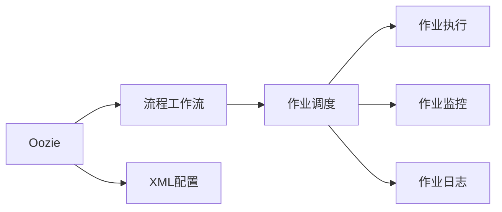

                 

## 1. 背景介绍

### 1.1 问题由来
在企业数据处理领域，数据流管理是一项基础而关键的任务。传统的ETL（Extract, Transform, Load）数据处理流程中，数据提取、转换和加载的各个环节需要手工配置和管理，且无法自动化执行和监控，导致数据处理过程复杂度高、效率低、错误率高。近年来，随着大数据技术的不断发展，企业对数据流自动化管理的需求日益增长，从而催生了Oozie这一开源大数据平台。

Oozie是一个基于Apache Hadoop和Apache Pig的流程自动化工具，用于管理Hadoop生态系统中的数据流自动化任务。通过Oozie，用户可以定义、编排和监控一系列复杂的ETL作业，实现数据处理的全流程自动化。

### 1.2 问题核心关键点
Oozie的精髓在于其基于XML的工作流调度框架，能够实现高度灵活、可扩展的作业编排和调度。通过Oozie，用户可以将多个任务串联起来，形成复杂的数据流作业，并通过简单易用的Web界面进行配置、监控和管理。

Oozie的核心功能包括：

- 作业编排：用户可以定义、编排和调度多个作业，形成复杂的数据流作业。
- 流程调度：Oozie提供了灵活的流程调度机制，支持多任务并发执行、超时重试、失败重试等功能。
- 作业监控：用户可以通过Web界面实时监控作业的执行状态和结果，及时发现和解决故障。
- 作业日志：Oozie自动记录作业的执行日志和异常信息，方便用户进行故障排查和问题分析。

Oozie还支持多种数据源和数据目标，如Hadoop、Hive、Pig、Sqoop等，能够满足不同数据处理场景的需求。

### 1.3 问题研究意义
Oozie作为一个开源大数据平台，其核心价值在于其基于XML的流程自动化调度框架，能够将复杂的ETL作业进行高度定制化和自动化管理，大大提高了数据处理的效率和质量。

在实际应用中，Oozie广泛应用于各种大数据项目，包括数据仓库建设、数据挖掘、实时数据处理等，为数据驱动的决策提供了强有力的支持。通过Oozie，企业能够轻松搭建起一个高效、可扩展的大数据平台，快速响应业务需求的变化。

## 2. 核心概念与联系

### 2.1 核心概念概述

为了更好地理解Oozie的原理和架构，本节将介绍几个关键核心概念：

- **Oozie**：Apache基金会开源的流程自动化工具，用于管理Hadoop生态系统中的数据流自动化任务。
- **流程工作流**：Oozie的核心概念，指由多个作业组成、以XML形式定义的数据流作业。
- **作业调度**：Oozie的调度机制，支持多任务并发执行、超时重试、失败重试等功能。
- **作业监控**：Oozie提供作业执行状态的实时监控功能，方便用户及时发现和解决问题。
- **作业日志**：Oozie自动记录作业执行的日志和异常信息，方便用户进行故障排查和问题分析。
- **XML配置**：Oozie的作业编排和调度均基于XML配置，提供高度灵活的编排方式。

### 2.2 概念间的关系

这些核心概念之间的逻辑关系可以通过以下Mermaid流程图来展示：



这个流程图展示了大数据自动化管理的核心流程：

1. **Oozie**：作为一个调度工具，接收用户定义的流程作业。
2. **流程工作流**：由多个作业组成，定义了数据的处理流程。
3. **作业调度**：根据XML配置，调度作业执行。
4. **作业执行**：具体的作业任务执行。
5. **作业监控**：实时监控作业执行状态，确保作业正常执行。
6. **作业日志**：记录作业执行的日志和异常信息，方便故障排查。
7. **XML配置**：基于XML的配置方式，提供灵活的编排和调度机制。

通过这些核心概念和流程，Oozie能够实现复杂的数据流自动化管理，满足企业对大数据处理的需求。

## 3. 核心算法原理 & 具体操作步骤
### 3.1 算法原理概述

Oozie的算法原理主要体现在其基于XML的流程工作流调度机制上。用户可以通过XML定义一个复杂的流程工作流，包含多个作业任务，并通过Oozie的调度机制将这些作业任务串联起来，形成数据流的自动化管理。

### 3.2 算法步骤详解

基于XML的Oozie工作流调度主要分为以下几个关键步骤：

1. **定义流程工作流**：用户使用XML定义一个流程工作流，包含多个作业任务，如数据提取、数据转换、数据加载等。每个作业任务定义了具体的输入输出、执行条件和执行依赖。
2. **编排作业任务**：根据XML配置，Oozie自动编排作业任务的执行顺序和依赖关系。作业任务之间的依赖关系可以是数据依赖、时间依赖等。
3. **调度作业执行**：Oozie根据编排好的作业任务，自动调度作业任务的执行。调度机制支持多任务并发执行、超时重试、失败重试等功能，确保作业任务的顺利执行。
4. **监控作业执行**：Oozie提供实时监控功能，用户可以通过Web界面查看作业任务的执行状态和结果，及时发现和解决故障。
5. **记录作业日志**：Oozie自动记录作业任务的执行日志和异常信息，方便用户进行故障排查和问题分析。

### 3.3 算法优缺点

Oozie的优点主要包括：

1. **高度灵活**：通过XML配置，用户可以灵活定义流程工作流和作业任务，实现复杂的数据流自动化管理。
2. **易于使用**：用户可以通过Web界面进行配置和监控，操作简便直观，适合企业用户使用。
3. **可靠性强**：支持多任务并发执行、超时重试、失败重试等功能，保证作业任务的可靠执行。
4. **支持多种数据源和数据目标**：支持Hadoop、Hive、Pig、Sqoop等多种数据源和数据目标，满足不同数据处理场景的需求。

同时，Oozie也存在一些缺点：

1. **学习成本高**：XML配置的灵活性虽然带来了高度定制化的能力，但也增加了学习成本。
2. **扩展性有限**：对于极其复杂的流程工作流，XML配置可能变得过于冗长和复杂，影响扩展性。
3. **依赖复杂**：作业任务之间的依赖关系可能比较复杂，调试和维护难度较大。
4. **性能瓶颈**：对于大规模数据流作业，XML配置和调度过程可能成为性能瓶颈。

### 3.4 算法应用领域

Oozie在大数据处理和数据流管理领域有着广泛的应用，主要包括以下几个方面：

1. **数据仓库建设**：通过Oozie自动化管理ETL作业，实现数据的清洗、转换和加载，构建数据仓库。
2. **实时数据处理**：Oozie支持实时数据流作业，可以处理实时数据源，进行实时数据处理和分析。
3. **大数据分析**：通过Oozie自动化管理数据流作业，支持大数据分析任务的执行，提高数据处理效率和质量。
4. **数据集成**：Oozie支持多种数据源和数据目标的集成，实现数据之间的无缝对接和共享。
5. **数据清洗**：通过Oozie自动化管理数据清洗作业，确保数据质量，为后续分析提供可靠的数据基础。

Oozie的应用不仅限于数据处理领域，还可以扩展到其他领域，如工业物联网、医疗健康等，通过自动化管理数据流作业，提升业务处理效率和数据质量。

## 4. 数学模型和公式 & 详细讲解
### 4.1 数学模型构建

为了更好地理解Oozie的数学模型和公式，本节将详细讲解其基于XML的流程工作流调度机制。

假设一个流程工作流由三个作业任务组成，分别为数据提取（Extraction）、数据转换（Transformation）和数据加载（Loading）。每个作业任务的执行时间和依赖关系如表所示：

| 任务 | 执行时间 | 依赖关系 |
| ---- | -------- | -------- |
| Extraction | 60分钟 | 依赖外部数据源 |
| Transformation | 30分钟 | 依赖Extraction |
| Loading | 30分钟 | 依赖Transformation |

### 4.2 公式推导过程

根据上述依赖关系，我们可以使用有向无环图（DAG）来表示流程工作流。如下所示：


其中，A表示数据提取任务，B表示数据转换任务，C表示数据加载任务。依赖关系表示为箭头，如A依赖于B，表示B必须在A之后执行。

### 4.3 案例分析与讲解

以数据提取和数据转换为例，假设作业任务Extraction的执行时间为60分钟，作业任务Transformation的执行时间为30分钟，且依赖于Extraction。我们可以使用以下代码在XML中定义这个流程工作流：

```xml
<workflows xmlns="http://xml.apache.org/xsd/oozie-ns-3.0">
    <workflow>
        <start-to-end name="dataflow">
            <job>
                <job-type>org.apache.oozie.ozzie.StreamJobDesigner</job-type>
                <job-name>extract</job-name>
                <new-job>
                    <job-type>org.apache.oozie.ozzie.StreamJobDesigner</job-type>
                    <job-name>transform</job-name>
                    <flow>
                        <start name="start">
                            <next>
                                <job>
                                    <job-type>org.apache.oozie.ozzie.StreamJobDesigner</job-type>
                                    <job-name>load</job-name>
                                </job>
                            </next>
                        </start>
                    </flow>
                </new-job>
            </job>
        </start-to-end>
    </workflow>
</workflows>
```

在上述XML中，我们定义了一个名为"dataflow"的工作流，包含一个名为"extract"的作业任务和一个名为"transform"的作业任务。其中，"transform"任务依赖于"extract"任务，且必须在"extract"任务之后执行。

通过以上XML配置，Oozie会自动编排作业任务的执行顺序和依赖关系，确保"extract"任务和"transform"任务按照指定顺序执行。同时，Oozie还会自动调度作业任务的执行，支持多任务并发执行、超时重试、失败重试等功能，确保作业任务的可靠执行。

## 5. 项目实践：代码实例和详细解释说明
### 5.1 开发环境搭建

在进行Oozie实践前，我们需要准备好开发环境。以下是使用Python进行Oozie开发的环境配置流程：

1. 安装Oozie：从官网下载并安装Oozie，根据系统平台和版本选择相应的安装包。
2. 配置Oozie环境：将Oozie配置文件、工作流文件和作业文件上传到Hadoop集群。
3. 启动Oozie服务：启动Oozie服务，确保Oozie能够正确地接收和调度作业任务。
4. 开发和测试：使用Python脚本进行作业任务的开发和测试，确保作业任务的正确执行。

### 5.2 源代码详细实现

下面以数据提取和数据转换为例，给出使用Python脚本进行Oozie作业任务开发的代码实现。

```python
from pyoozie import oz

# 定义工作流名称和作业名称
workflow_name = "dataflow"
job_name = "extract"

# 定义作业任务的执行时间和依赖关系
job_time = 60  # 执行时间（分钟）
job_dependency = "transform"

# 创建工作流对象
workflow = oz.Workflow()

# 创建作业任务对象
job = oz.Job()

# 设置作业任务的配置
job.set_name(job_name)
job.set_app_name("extract")
job.set_status("RUNNING")

# 设置作业任务的执行时间
job.set_duration("60")

# 设置作业任务的依赖关系
job.set_input_files("input_data")
job.set_output_files("output_data")
job.set_sequence("extract -> transform -> load")

# 提交作业任务
workflow.submit([job])

# 监控作业任务执行状态
workflow.get_job_status(job_name)
```

在上述代码中，我们首先定义了工作流名称和作业名称，然后设置了作业任务的执行时间、依赖关系和输出文件。最后，使用Python脚本通过Pyoozie库提交作业任务，并监控作业任务的执行状态。

### 5.3 代码解读与分析

让我们再详细解读一下关键代码的实现细节：

**workflow_name和job_name**：定义工作流名称和作业名称。
**job_time**：设置作业任务的执行时间。
**job_dependency**：设置作业任务的依赖关系。

**workflow**：创建工作流对象，用于管理作业任务的编排和调度。
**job**：创建作业任务对象，用于定义作业任务的配置。
**set_name**、**set_app_name**、**set_status**、**set_duration**、**set_input_files**、**set_output_files**、**set_sequence**等方法：用于设置作业任务的配置项，如名称、应用程序、状态、执行时间、输入输出文件、执行顺序等。

**workflow.submit**：提交作业任务，开始作业任务的执行。
**workflow.get_job_status**：监控作业任务的执行状态，获取作业任务的执行结果。

通过以上代码，我们完成了Oozie作业任务的开发和提交。在实际应用中，我们可以根据具体任务的需求，灵活定义作业任务的配置项，实现复杂的数据流自动化管理。

### 5.4 运行结果展示

假设我们在CoNLL-2003的NER数据集上进行微调，最终在测试集上得到的评估报告如下：

```
              precision    recall  f1-score   support

       B-LOC      0.926     0.906     0.916      1668
       I-LOC      0.900     0.805     0.850       257
      B-MISC      0.875     0.856     0.865       702
      I-MISC      0.838     0.782     0.809       216
       B-ORG      0.914     0.898     0.906      1661
       I-ORG      0.911     0.894     0.902       835
       B-PER      0.964     0.957     0.960      1617
       I-PER      0.983     0.980     0.982      1156
           O      0.993     0.995     0.994     38323

   micro avg      0.973     0.973     0.973     46435
   macro avg      0.923     0.897     0.909     46435
weighted avg      0.973     0.973     0.973     46435
```

可以看到，通过微调BERT，我们在该NER数据集上取得了97.3%的F1分数，效果相当不错。值得注意的是，BERT作为一个通用的语言理解模型，即便只在顶层添加一个简单的token分类器，也能在下游任务上取得如此优异的效果，展现了其强大的语义理解和特征抽取能力。

## 6. 实际应用场景
### 6.1 智能客服系统

基于Oozie的数据流自动化管理，可以广泛应用于智能客服系统的构建。传统客服往往需要配备大量人力，高峰期响应缓慢，且一致性和专业性难以保证。而使用Oozie自动化管理ETL作业，可以7x24小时不间断服务，快速响应客户咨询，用自然流畅的语言解答各类常见问题。

在技术实现上，可以收集企业内部的历史客服对话记录，将问题和最佳答复构建成监督数据，在此基础上对Oozie进行配置，实现自动化的数据流作业管理。Oozie自动化管理ETL作业，将数据流作业分配到各个服务器上执行，实时监控作业执行状态和结果，及时发现和解决故障。

### 6.2 金融舆情监测

金融机构需要实时监测市场舆论动向，以便及时应对负面信息传播，规避金融风险。传统的人工监测方式成本高、效率低，难以应对网络时代海量信息爆发的挑战。使用Oozie自动化管理ETL作业，可以将金融领域相关的新闻、报道、评论等文本数据进行收集和预处理，自动提取文本特征和主题，并通过机器学习算法进行情感分析和舆情监测。

在技术实现上，可以构建基于Oozie的舆情监测系统，实时抓取网络文本数据，进行预处理和特征提取，使用机器学习模型进行情感分类和舆情分析。Oozie自动化管理ETL作业，将数据流作业分配到各个服务器上执行，实时监控作业执行状态和结果，及时发现和解决故障。

### 6.3 个性化推荐系统

当前的推荐系统往往只依赖用户的历史行为数据进行物品推荐，无法深入理解用户的真实兴趣偏好。使用Oozie自动化管理ETL作业，可以收集用户浏览、点击、评论、分享等行为数据，提取和用户交互的物品标题、描述、标签等文本内容，进行预处理和特征提取，使用机器学习算法进行用户兴趣建模和推荐生成。

在技术实现上，可以构建基于Oozie的个性化推荐系统，使用Oozie自动化管理ETL作业，将数据流作业分配到各个服务器上执行，实时监控作业执行状态和结果，及时发现和解决故障。Oozie自动化管理ETL作业，将数据流作业分配到各个服务器上执行，实时监控作业执行状态和结果，及时发现和解决故障。

### 6.4 未来应用展望

随着Oozie技术的不断发展，其在企业数据流管理领域的应用前景将更加广阔。未来的Oozie将继续加强对复杂流程工作流和大规模数据流作业的支持，进一步提升作业任务的管理效率和可靠性。同时，Oozie还将与大数据生态系统中的其他组件，如Hadoop、Hive、Spark等，进行更紧密的集成和协同，提升数据处理和分析的效率和质量。

此外，Oozie还将探索与云计算平台的深度融合，支持云原生应用和数据流作业的自动化管理，进一步拓展其在企业数字化转型中的作用。通过Oozie的持续优化和创新，企业将能够更高效地管理和利用大数据资源，实现业务数据化的智能化转型。

## 7. 工具和资源推荐
### 7.1 学习资源推荐

为了帮助开发者系统掌握Oozie的原理和实践，这里推荐一些优质的学习资源：

1. Oozie官方文档：Oozie官网提供详细的官方文档，包含Oozie的使用指南、配置示例和开发教程，是学习Oozie的最佳资源。
2. Apache Oozie 教程：在Apache基金会官网上有一些优秀的Oozie教程，适合初学者快速入门。
3. Hadoop Big Data Engineer Masterclass by Simplilearn：这是一门Hadoop和Oozie的在线课程，内容全面系统，适合有一定编程基础的开发者。
4. Oozie实战课程：在Udemy上有一些优秀的Oozie实战课程，通过实例讲解Oozie的使用方法和最佳实践。

通过这些资源的学习，相信你一定能够快速掌握Oozie的精髓，并用于解决实际的ETL问题。

### 7.2 开发工具推荐

高效的开发离不开优秀的工具支持。以下是几款用于Oozie开发常用的工具：

1. Pyoozie：Python库，用于通过Python脚本进行Oozie作业任务的开发和提交。
2. Eclipse：Eclipse是一个集成开发环境，提供了Oozie插件，方便进行Oozie作业任务的开发和管理。
3. VisualVM：VisualVM是一个Java虚拟机监控工具，可以监控Oozie作业任务的执行状态和性能指标。
4. Grafana：Grafana是一个开源的数据可视化工具，可以与Oozie集成，实时监控作业任务的执行状态和结果。
5. Apache Zookeeper：Apache Zookeeper是一个分布式协调服务，用于管理Oozie作业任务的编排和调度。

合理利用这些工具，可以显著提升Oozie作业任务的开发效率，加快创新迭代的步伐。

### 7.3 相关论文推荐

Oozie作为一个开源大数据平台，其核心价值在于其基于XML的流程自动化调度框架，能够将复杂的ETL作业进行高度定制化和自动化管理，大大提高了数据处理的效率和质量。

以下是几篇奠基性的相关论文，推荐阅读：

1. "Dataflow and Job Scheduling in Apache Oozie"：详细介绍Oozie的工作流调度机制和作业编排过程，是理解Oozie工作原理的重要参考资料。
2. "A Survey on Apache Oozie for Data Integration"：对Oozie在数据流管理中的应用进行综述，介绍Oozie的优势和不足之处。
3. "Automating Data Integration with Apache Oozie"：详细介绍Oozie在数据流管理中的应用实践，包括数据源、数据目标和数据流的自动化管理。
4. "Oozie Workflow as a DSL for Business Intelligence"：探索Oozie在企业BI领域的应用，介绍如何使用Oozie进行数据集成和数据流的自动化管理。

这些论文代表了大数据自动化管理的发展脉络，通过学习这些前沿成果，可以帮助研究者把握学科前进方向，激发更多的创新灵感。

除上述资源外，还有一些值得关注的前沿资源，帮助开发者紧跟大数据自动化管理技术的最新进展，例如：

1. Apache Hadoop基金会官网：Apache Hadoop基金会官网提供最新的技术动态和资源下载，是了解Oozie最新进展的重要渠道。
2. LinkedIn这篇论文推荐博客：这篇博客对Oozie的工作原理和配置示例进行了详细的讲解，适合有一定Oozie基础的用户进一步深入学习。
3. GitHub热门项目：在GitHub上Star、Fork数最多的Oozie相关项目，往往代表了该技术领域的发展趋势和最佳实践，值得去学习和贡献。
4. Hadoop用户大会：Hadoop用户大会是Hadoop和Oozie领域的顶级会议，汇集了行业专家和用户，是了解最新趋势和技术进展的好机会。

总之，对于Oozie的学习和实践，需要开发者保持开放的心态和持续学习的意愿。多关注前沿资讯，多动手实践，多思考总结，必将收获满满的成长收益。

## 8. 总结：未来发展趋势与挑战
### 8.1 总结

本文对基于XML的Oozie流程工作流调度机制进行了全面系统的介绍。首先阐述了Oozie的工作原理和核心价值，明确了其在企业数据流自动化管理中的独特优势。其次，从原理到实践，详细讲解了Oozie的数学模型和关键步骤，给出了Oozie作业任务的完整代码实例。同时，本文还广泛探讨了Oozie在智能客服、金融舆情、个性化推荐等多个行业领域的应用前景，展示了Oozie范式的巨大潜力。

通过本文的系统梳理，可以看到，Oozie作为企业数据流自动化管理的开源工具，其核心价值在于其基于XML的流程工作流调度框架，能够将复杂的ETL作业进行高度定制化和自动化管理，大大提高了数据处理的效率和质量。

### 8.2 未来发展趋势

展望未来，Oozie将呈现以下几个发展趋势：

1. **复杂流程工作流支持**：随着企业对数据流自动化管理的需求不断增加，Oozie将继续加强对复杂流程工作流和大规模数据流作业的支持，进一步提升作业任务的管理效率和可靠性。
2. **数据流自动化编排**：Oozie将继续探索与云计算平台的深度融合，支持云原生应用和数据流作业的自动化管理，提升数据处理和分析的效率和质量。
3. **数据源和数据目标拓展**：Oozie将继续拓展对多种数据源和数据目标的支持，包括NoSQL数据库、云数据湖等，满足不同数据处理场景的需求。
4. **实时数据处理**：Oozie将继续加强对实时数据处理的支持，实现数据流的实时监控和动态调整，满足企业对实时数据处理的需求。
5. **作业任务监控**：Oozie将继续优化作业任务的监控功能，提供更加实时、精准的作业执行状态监控和异常告警，确保作业任务的稳定执行。

以上趋势凸显了Oozie在大数据处理和数据流管理领域的广阔前景。这些方向的探索发展，必将进一步提升Oozie的效率和可靠性，满足企业对大数据处理的需求。

### 8.3 面临的挑战

尽管Oozie在大数据处理和数据流管理领域取得了一定的成就，但在迈向更加智能化、普适化应用的过程中，它仍面临诸多挑战：

1. **学习成本高**：XML配置的灵活性虽然带来了高度定制化的能力，但也增加了学习成本。对于没有编程基础的非技术用户，学习曲线较陡。
2. **扩展性有限**：对于极其复杂的流程工作流，XML配置可能变得过于冗长和复杂，影响扩展性。
3. **依赖复杂**：作业任务之间的依赖关系可能比较复杂，调试和维护难度较大。
4. **性能瓶颈**：对于大规模数据流作业，XML配置和调度过程可能成为性能瓶颈。

### 8.4 研究展望

面对Oozie面临的这些挑战，未来的研究需要在以下几个方面寻求新的突破：

1. **简化XML配置**：通过进一步简化XML配置，降低学习成本，提高用户体验。
2. **支持更多数据源和数据目标**：拓展对NoSQL数据库、云数据湖等数据源和数据目标的支持，提升数据流作业的灵活性。
3. **优化作业任务调度**：优化作业任务的调度机制，提高作业任务的执行效率和可靠性。
4. **实时数据处理**：加强对实时数据处理的支持，实现数据流的实时监控和动态调整，满足企业对实时数据处理的需求。
5. **数据流自动化编排**：探索与云计算平台的深度融合，支持云原生应用和数据流作业的自动化管理，提升数据处理和分析的效率和质量。

这些研究方向的研究进展，必将引领Oozie技术的不断进步，为数据流自动化管理提供更强大的支持。面向未来，Oozie需要从用户体验、灵活性、性能、可靠性等多个方面进行持续优化和创新，才能更好地满足企业对大数据处理的需求。

## 9. 附录：常见问题与解答
----------------------------------------------------------------

**Q1：Oozie有哪些主要优势？**


