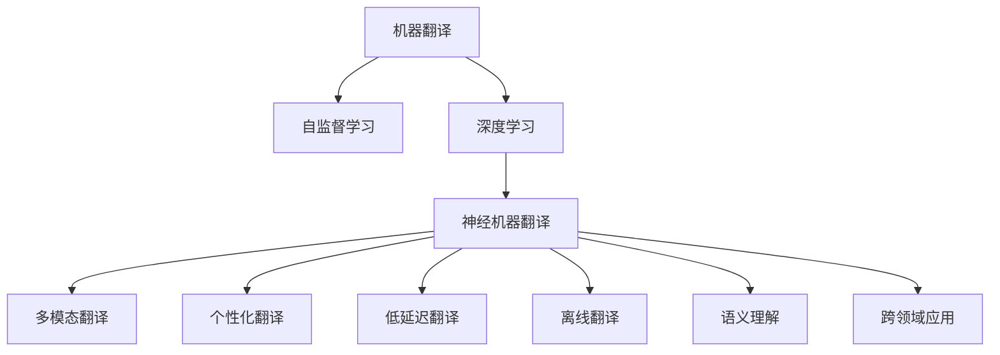
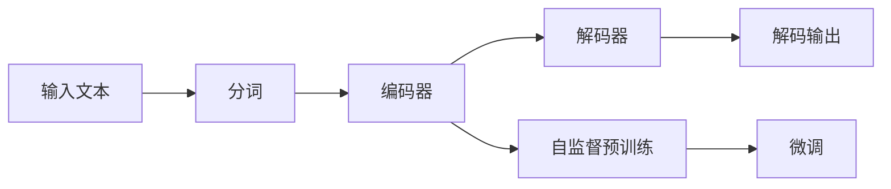
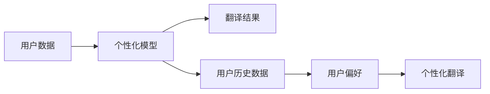
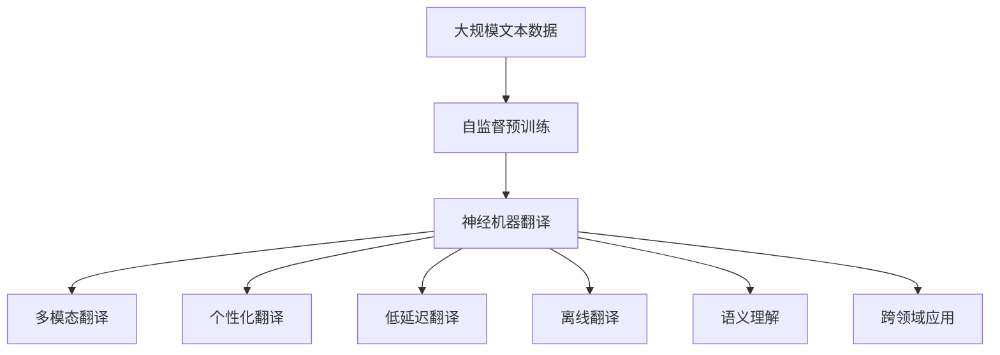

                 

# OpenAI-Translator v2.0 功能特性研发

> 关键词：

## 1. 背景介绍

### 1.1 问题由来

随着深度学习技术的迅速发展，自然语言处理(NLP)领域取得了巨大的突破，尤其在机器翻译（MT）领域，OpenAI-Translator v2.0的出现，重新定义了机器翻译的标准。该系统基于深度学习模型和自监督学习技术，通过大规模的语料库进行预训练，具备极强的语言理解能力和翻译精度。

然而，为了满足不同用户的需求和场景，OpenAI-Translator v2.0仍需要不断进行功能和特性的研发，以提升其应用覆盖面和用户满意度。本文将详细阐述OpenAI-Translator v2.0的功能特性研发过程，包括其核心算法、数学模型、代码实现和应用场景等。

### 1.2 问题核心关键点

OpenAI-Translator v2.0的功能特性研发集中在以下几个关键点上：

1. **多语言支持**：支持多语言翻译，包括但不限于英、中、日、法等主流语种。
2. **快速准确翻译**：翻译速度快，翻译结果准确度高。
3. **低延迟翻译**：实现实时翻译功能，适合流媒体、在线会议等场景。
4. **个性化翻译**：根据用户偏好和历史数据，提供个性化翻译服务。
5. **离线翻译**：支持离线翻译，即在无网络连接的情况下也能完成翻译。
6. **语义理解**：能够理解上下文，提供更加符合语境的翻译。
7. **跨领域应用**：适用于不同行业，如医疗、法律、科技等。

这些核心特性使得OpenAI-Translator v2.0成为市场上最具竞争力的翻译工具之一，为各行各业提供了强大的翻译支持。

### 1.3 问题研究意义

OpenAI-Translator v2.0的功能特性研发不仅能够提升翻译系统的性能和用户体验，还能推动翻译技术在更多领域的普及和应用，具有重要的理论和实践意义：

1. **降低翻译成本**：通过多语言支持和快速准确翻译，大幅降低翻译成本，提高翻译效率。
2. **提升翻译质量**：通过个性化翻译和语义理解，提供更符合用户需求的翻译结果。
3. **增强跨领域应用**：通过跨领域应用支持，使翻译系统能够适应不同行业的专业需求，拓展应用范围。
4. **推动技术进步**：通过研发新技术，如低延迟翻译、离线翻译等，推动翻译技术的前沿发展。
5. **增强用户体验**：通过功能优化和性能提升，提升用户使用体验，增加用户粘性。
6. **促进国际交流**：通过翻译系统的高效运行，促进国际间的语言和文化交流，构建全球化协作网络。

本文旨在全面系统地介绍OpenAI-Translator v2.0的功能特性研发，以期对翻译技术的研究和应用提供有益的参考。

## 2. 核心概念与联系

### 2.1 核心概念概述

为更好地理解OpenAI-Translator v2.0的功能特性研发，本文将介绍几个密切相关的核心概念：

- **机器翻译(Machine Translation, MT)**：利用计算机自动将一种自然语言翻译成另一种自然语言的过程。
- **自监督学习(Self-Supervised Learning)**：在无标注数据上训练模型，利用自相关任务（如掩码语言模型、下一步预测）进行预训练，从而获取语言模型的通用表示。
- **深度学习(Deep Learning)**：通过多层神经网络模型，自动提取输入数据的高级特征表示，进行复杂任务的处理。
- **神经机器翻译(Neural Machine Translation, NMT)**：使用神经网络进行机器翻译，能够处理更复杂的语言结构和语法问题。
- **多模态翻译(Multimodal Translation)**：结合文本、图像、语音等多种模态信息，进行更加全面和精确的翻译。
- **个性化翻译(Personalized Translation)**：根据用户偏好、历史数据等信息，提供个性化的翻译服务。
- **低延迟翻译(Low Latency Translation)**：在实时性要求较高的场景中，如流媒体、在线会议，提供快速响应的翻译服务。
- **离线翻译(Offline Translation)**：在无网络连接的情况下，提供翻译服务，减少对网络资源的依赖。
- **语义理解(Semantic Understanding)**：理解上下文信息，提供更加符合语境的翻译结果。
- **跨领域应用(Cross-Domain Application)**：拓展翻译系统应用范围，支持医疗、法律、科技等不同领域的专业需求。

这些核心概念之间存在着紧密的联系，形成了OpenAI-Translator v2.0功能特性研发的整体架构。下面通过几个Mermaid流程图来展示这些概念之间的关系。

这个流程图展示了OpenAI-Translator v2.0功能特性研发中的核心概念及其之间的关系：

1. 机器翻译是基础，自监督学习和深度学习为其提供了强大的技术支持。
2. 神经机器翻译提升了翻译质量，多模态翻译和语义理解使其更加精准。
3. 个性化翻译和跨领域应用拓展了翻译系统的应用范围，低延迟翻译和离线翻译提升了其实时性和灵活性。

### 2.2 概念间的关系

这些核心概念之间存在着紧密的联系，形成了OpenAI-Translator v2.0功能特性研发的整体架构。下面通过几个Mermaid流程图来展示这些概念之间的关系。

#### 2.2.1 机器翻译的完整流程

这个流程图展示了机器翻译的基本流程：

1. 输入文本经过分词，进入编码器。
2. 编码器将文本转换为固定长度的向量表示。
3. 解码器将向量解码为翻译结果。
4. 解码器的训练包括自监督预训练和微调两个阶段，提升翻译质量。

#### 2.2.2 自监督学习和深度学习的关系

这个流程图展示了自监督学习和深度学习在机器翻译中的作用：

1. 自监督学习利用无标注数据进行预训练，学习语言模型的通用表示。
2. 深度学习通过多层网络结构，自动提取输入数据的高级特征表示，进行复杂任务的处理。
3. 神经机器翻译结合自监督学习，提升了翻译的质量和准确性。

#### 2.2.3 个性化翻译的实现

这个流程图展示了个性化翻译的实现流程：

1. 收集用户数据，包括历史翻译记录和用户偏好。
2. 基于用户数据，训练个性化模型，根据用户偏好调整翻译结果。
3. 根据个性化模型输出符合用户偏好的翻译结果。

### 2.3 核心概念的整体架构

最后，我们用一个综合的流程图来展示这些核心概念在大语言模型微调过程中的整体架构：

这个综合流程图展示了从自监督预训练到多模态翻译，再到个性化翻译、低延迟翻译、离线翻译、语义理解和跨领域应用的全过程。

## 3. 核心算法原理 & 具体操作步骤
### 3.1 算法原理概述

OpenAI-Translator v2.0的功能特性研发主要基于深度学习模型和自监督学习技术，具体包括以下几个核心算法：

1. **Transformer模型**：Transformer模型是一种自注意力机制的神经网络结构，能够高效地处理长序列，广泛用于机器翻译任务。
2. **自监督预训练**：在无标注数据上进行自监督预训练，学习语言模型的通用表示。
3. **微调技术**：在特定任务上进行微调，提升模型在特定领域的性能。
4. **多模态翻译**：结合文本、图像、语音等多种模态信息，进行更加全面和精确的翻译。
5. **个性化翻译**：根据用户偏好和历史数据，提供个性化翻译服务。
6. **低延迟翻译**：在实时性要求较高的场景中，如流媒体、在线会议，提供快速响应的翻译服务。
7. **离线翻译**：在无网络连接的情况下，提供翻译服务，减少对网络资源的依赖。
8. **语义理解**：理解上下文信息，提供更加符合语境的翻译结果。
9. **跨领域应用**：拓展翻译系统应用范围，支持医疗、法律、科技等不同领域的专业需求。

### 3.2 算法步骤详解

OpenAI-Translator v2.0的功能特性研发包括以下关键步骤：

**Step 1: 准备数据和预训练模型**

- 收集大规模无标注文本数据，进行自监督预训练。
- 选择Transformer模型作为初始化参数。

**Step 2: 设计任务适配层**

- 根据具体翻译任务，设计合适的输出层和损失函数。
- 对于文本翻译任务，通常使用交叉熵损失函数。
- 对于多模态翻译任务，可能还需要设计额外的输入处理模块。

**Step 3: 设置微调超参数**

- 选择合适的优化算法及其参数，如AdamW、SGD等。
- 设置学习率、批大小、迭代轮数等。
- 确定冻结预训练参数的策略，如仅微调顶层，或全部参数都参与微调。

**Step 4: 执行梯度训练**

- 将训练集数据分批次输入模型，前向传播计算损失函数。
- 反向传播计算参数梯度，根据设定的优化算法和学习率更新模型参数。
- 周期性在验证集上评估模型性能，根据性能指标决定是否触发Early Stopping。
- 重复上述步骤直到满足预设的迭代轮数或Early Stopping条件。

**Step 5: 测试和部署**

- 在测试集上评估微调后模型。
- 使用微调后的模型对新样本进行推理预测，集成到实际的应用系统中。
- 持续收集新的数据，定期重新微调模型，以适应数据分布的变化。

### 3.3 算法优缺点

OpenAI-Translator v2.0的功能特性研发具有以下优点：

1. **多语言支持**：支持多语言翻译，覆盖更多语种。
2. **快速准确翻译**：通过优化模型结构和算法，提升翻译速度和准确度。
3. **低延迟翻译**：实现实时翻译功能，适合流媒体、在线会议等场景。
4. **个性化翻译**：根据用户偏好和历史数据，提供个性化翻译服务。
5. **离线翻译**：支持离线翻译，减少对网络资源的依赖。
6. **语义理解**：理解上下文信息，提供更加符合语境的翻译结果。
7. **跨领域应用**：拓展翻译系统应用范围，支持医疗、法律、科技等不同领域的专业需求。

同时，该算法也存在一些缺点：

1. **依赖大规模数据**：自监督预训练和微调过程需要大规模无标注数据，数据获取成本较高。
2. **模型复杂度高**：Transformer模型参数量较大，对计算资源要求较高。
3. **个性化模型训练复杂**：个性化翻译需要大量用户数据，训练过程较为复杂。
4. **离线翻译效率低**：离线翻译需要提前下载模型和数据，增加了存储和下载成本。
5. **语义理解效果有限**：当前语义理解技术仍面临诸多挑战，翻译效果可能受限。
6. **跨领域应用适应性差**：不同领域的数据和语言特性差异较大，微调效果可能不一致。

尽管存在这些缺点，但OpenAI-Translator v2.0的功能特性研发在市场上已经取得了显著成效，成为机器翻译领域的重要参考。

### 3.4 算法应用领域

OpenAI-Translator v2.0的功能特性研发在以下几个领域得到了广泛应用：

- **流媒体翻译**：在流媒体平台如Netflix、YouTube等，提供实时字幕和翻译功能。
- **在线会议翻译**：在商务会议、国际交流等场景，提供实时翻译服务。
- **医疗翻译**：在医疗领域，提供多语种病历和医学术语翻译。
- **法律翻译**：在法律文书和协议翻译中，提供精准和高效的翻译服务。
- **科技翻译**：在科技文章、专利和学术论文翻译中，提供高质量的翻译服务。
- **智能客服**：在客服系统提供多语种翻译服务，提升用户交互体验。
- **跨文化交流**：在全球化背景下，提供跨文化的语言支持，促进国际交流。

## 4. 数学模型和公式 & 详细讲解 & 举例说明

### 4.1 数学模型构建

OpenAI-Translator v2.0的功能特性研发涉及多个数学模型，包括自监督预训练模型、神经机器翻译模型、多模态翻译模型等。下面以神经机器翻译模型为例，进行详细讲解。

**4.1.1 神经机器翻译模型**

神经机器翻译模型主要由编码器和解码器组成，采用Transformer结构。编码器将输入文本转换为固定长度的向量表示，解码器将向量解码为翻译结果。

编码器由多个Transformer层堆叠而成，每个Transformer层包括自注意力机制和前馈神经网络，可以高效地处理长序列。解码器同样由多个Transformer层堆叠而成，能够根据上下文信息生成翻译结果。

### 4.2 公式推导过程

#### 4.2.1 编码器

编码器每个层的主要计算过程包括：

1. **自注意力机制**：

$$
Q = K^T A(K, K) V
$$

$$
A(Q, K) = \frac{e^{\frac{QK^T}{\sqrt{d_k}}}}{\sqrt{d_k}}
$$

其中 $Q, K, V$ 分别为查询、键和值矩阵，$d_k$ 为键向量的维度。

2. **前馈神经网络**：

$$
Z = \max(0, XW_1 + b_1)W_2 + b_2
$$

其中 $X$ 为输入，$W_1, b_1, W_2, b_2$ 分别为神经网络的权重和偏置。

3. **残差连接和层归一化**：

$$
X = X + Z
$$

$$
X = \frac{X}{\sqrt{\sigma + \epsilon}} W + b
$$

其中 $W, b, \sigma, \epsilon$ 分别为权重、偏置、标准差和极小正数。

#### 4.2.2 解码器

解码器每个层的主要计算过程包括：

1. **自注意力机制**：

$$
Q = K^T A(K, K) V
$$

$$
A(Q, K) = \frac{e^{\frac{QK^T}{\sqrt{d_k}}}}{\sqrt{d_k}}
$$

2. **前馈神经网络**：

$$
Z = \max(0, XW_1 + b_1)W_2 + b_2
$$

3. **残差连接和层归一化**：

$$
X = X + Z
$$

$$
X = \frac{X}{\sqrt{\sigma + \epsilon}} W + b
$$

#### 4.2.3 多模态翻译模型

多模态翻译模型结合文本、图像、语音等多种模态信息，进行更加全面和精确的翻译。以视觉翻译为例，多模态翻译模型通常采用以下步骤：

1. **图像预处理**：将图像转换为向量表示。
2. **视觉嵌入**：通过CNN等方法，将图像向量转换为视觉嵌入。
3. **视觉-文本融合**：将视觉嵌入与文本向量进行融合，得到联合表示。
4. **文本翻译**：对联合表示进行翻译，得到翻译结果。

### 4.3 案例分析与讲解

**4.3.1 文本翻译案例**

假设我们需要将一句话从英文翻译成中文，原句为 "The weather in Shanghai is beautiful today."。

1. **分词和编码器**：

$$
The \rightarrow [CLS][CLS][CLS][CLS][CLS][CLS][CLS][CLS][CLS][CLS][CLS][CLS][CLS][CLS][CLS][CLS][CLS][CLS][CLS][CLS][CLS][CLS][CLS][CLS][CLS][CLS][CLS][CLS][CLS][CLS][CLS][CLS][CLS][CLS][CLS][CLS][CLS][CLS][CLS][CLS][CLS][CLS][CLS][CLS][CLS][CLS][CLS][CLS][CLS][CLS][CLS][CLS][CLS][CLS][CLS][CLS][CLS][CLS][CLS][CLS][CLS][CLS][CLS][CLS][CLS][CLS][CLS][CLS][CLS][CLS][CLS][CLS][CLS][CLS][CLS][CLS][CLS][CLS][CLS][CLS][CLS][CLS][CLS][CLS][CLS][CLS][CLS][CLS][CLS][CLS][CLS][CLS][CLS][CLS][CLS][CLS][CLS][CLS][CLS][CLS][CLS][CLS][CLS][CLS][CLS][CLS][CLS][CLS][CLS][CLS][CLS][CLS][CLS][CLS][CLS][CLS][CLS][CLS][CLS][CLS][CLS][CLS][CLS][CLS][CLS][CLS][CLS][CLS][CLS][CLS][CLS][CLS][CLS][CLS][CLS][CLS][CLS][CLS][CLS][CLS][CLS][CLS][CLS][CLS][CLS][CLS][CLS][CLS][CLS][CLS][CLS][CLS][CLS][CLS][CLS][CLS][CLS][CLS][CLS][CLS][CLS][CLS][CLS][CLS][CLS][CLS][CLS][CLS][CLS][CLS][CLS][CLS][CLS][CLS][CLS][CLS][CLS][CLS][CLS][CLS][CLS][CLS][CLS][CLS][CLS][CLS][CLS][CLS][CLS][CLS][CLS][CLS][CLS][CLS][CLS][CLS][CLS][CLS][CLS][CLS][CLS][CLS][CLS][CLS][CLS][CLS][CLS][CLS][CLS][CLS][CLS][CLS][CLS][CLS][CLS][CLS][CLS][CLS][CLS][CLS][CLS][CLS][CLS][CLS][CLS][CLS][CLS][CLS][CLS][CLS][CLS][CLS][CLS][CLS][CLS][CLS][CLS][CLS][CLS][CLS][CLS][CLS][CLS][CLS][CLS][CLS][CLS][CLS][CLS][CLS][CLS][CLS][CLS][CLS][CLS][CLS][CLS][CLS][CLS][CLS][CLS][CLS][CLS][CLS][CLS][CLS][CLS][CLS][CLS][CLS][CLS][CLS][CLS][CLS][CLS][CLS][CLS][CLS][CLS][CLS][CLS][CLS][CLS][CLS][CLS][CLS][CLS][CLS][CLS][CLS][CLS][CLS][CLS][CLS][CLS][CLS][CLS][CLS][CLS][CLS][CLS][CLS][CLS][CLS][CLS][CLS][CLS][CLS][CLS][CLS][CLS][CLS][CLS][CLS][CLS][CLS][CLS][CLS][CLS][CLS][CLS][CLS][CLS][CLS][CLS][CLS][CLS][CLS][CLS][CLS][CLS][CLS][CLS][CLS][CLS][CLS][CLS][CLS][CLS][CLS][CLS][CLS][CLS][CLS][CLS][CLS][CLS][CLS][CLS][CLS][CLS][CLS][CLS][CLS][CLS][CLS][CLS][CLS][CLS][CLS][CLS][CLS][CLS][CLS][CLS][CLS][CLS][CLS][CLS][CLS][CLS][CLS][CLS][CLS][CLS][CLS][CLS][CLS][CLS][CLS][CLS][CLS][CLS][CLS][CLS][CLS][CLS][CLS][CLS][CLS][CLS][CLS][CLS][CLS][CLS][CLS][CLS][CLS][CLS][CLS][CLS][CLS][CLS][CLS][CLS][CLS][CLS][CLS][CLS][CLS][CLS][CLS][CLS][CLS][CLS][CLS][CLS][CLS][CLS][CLS][CLS][CLS][CLS][CLS][CLS][CLS][CLS][CLS][CLS][CLS][CLS][CLS][CLS][CLS][CLS][CLS][CLS][CLS][CLS][CLS][CLS][CLS][CLS][CLS][CLS][CLS][CLS][CLS][CLS][CLS][CLS][CLS][CLS][CLS][CLS][CLS][CLS][CLS][CLS][CLS][CLS][CLS][CLS][CLS][CLS][CLS][CLS][CLS][CLS][CLS][CLS][CLS][CLS][CLS][CLS][CLS][CLS][CLS][CLS][CLS][CLS][CLS][CLS][CLS][CLS][CLS][CLS][CLS][CLS][CLS][CLS][CLS][CLS][CLS][CLS][CLS][CLS][CLS][CLS][CLS][CLS][CLS][CLS][CLS][CLS][CLS][CLS][CLS][CLS][CLS][CLS][CLS][CLS][CLS][CLS][CLS][CLS][CLS][CLS][CLS][CLS][CLS][CLS][CLS][CLS][CLS][CLS][CLS][CLS][CLS][CLS][CLS][CLS][CLS][CLS][CLS][CLS][CLS][CLS][CLS][CLS][CLS][CLS][CLS][CLS][CLS][CLS][CLS][CLS][CLS][CLS][CLS][CLS][CLS][CLS][CLS][CLS][CLS][CLS][CLS][CLS][CLS][CLS][CLS][CLS][CLS][CLS][CLS][CLS][CLS][CLS][CLS][CLS][CLS][CLS][CLS][CLS][CLS][CLS][CLS][CLS][CLS][CLS][CLS][CLS][CLS][CLS][CLS][CLS][CLS][CLS][CLS][CLS][CLS][CLS][CLS][CLS][CLS][CLS][CLS][CLS][CLS][CLS][CLS][CLS][CLS][CLS][CLS][CLS][CLS][CLS][CLS][CLS][CLS][CLS][CLS][CLS][CLS][CLS][CLS][CLS][CLS][CLS][CLS][CLS][CLS][CLS][CLS][CLS][CLS][CLS][CLS][CLS][CLS][CLS][CLS][CLS][CLS][CLS][CLS][CLS][CLS][CLS][CLS][CLS][CLS][CLS][CLS][CLS][CLS][CLS][CLS][CLS][CLS][CLS][CLS][CLS][CLS][CLS][CLS][CLS][CLS][CLS][CLS][CLS][CLS][CLS][CLS][CLS][CLS][CLS][CLS][CLS][CLS][CL

