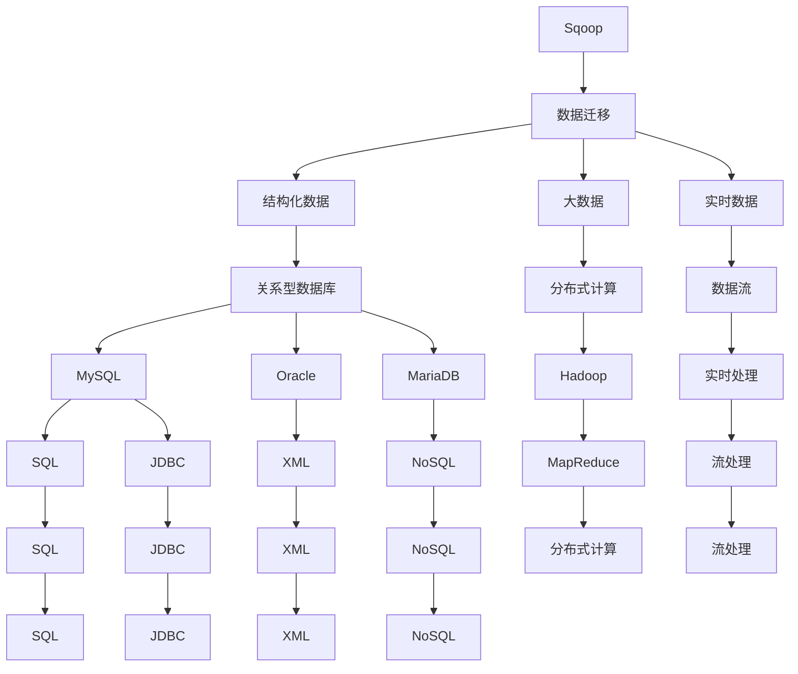
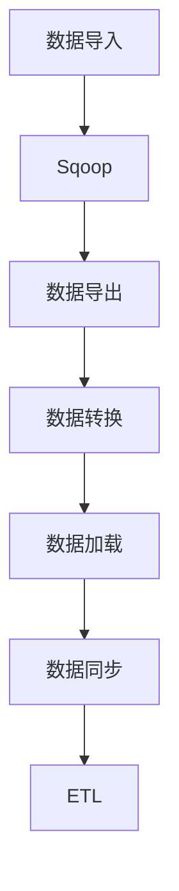

                 

# Sqoop原理与代码实例讲解

> 关键词：Sqoop, 数据迁移, 结构化数据, 大数据, 实时数据, 自动化

## 1. 背景介绍

### 1.1 问题由来

随着互联网和数字化技术的迅速发展，各行各业产生了海量的数据。如何高效、安全地将这些数据从各种数据源（如关系型数据库、NoSQL数据库、云存储等）导入到Hadoop生态系统中进行分析和处理，成为了数据工程师和IT决策者面临的重要挑战。在传统的数据迁移方式中，由于数据源的多样性和复杂性，数据导入往往耗时耗力，且容易出错。因此，需要一个自动化、高效、可靠的数据迁移工具来简化这一过程。

### 1.2 问题核心关键点

Sqoop（SQL to Oracle，发音为：squop）是由Apache基金会开源的一个数据迁移工具，旨在将数据从关系型数据库中导入到Hadoop系统中。Sqoop的核心优势在于其简单易用、支持多种数据源、能够自动处理复杂的数据迁移任务。Sqoop不仅可以迁移静态的结构化数据，还可以处理实时数据流，支持数据同步和ETL（提取、转换、加载）功能，能够轻松实现复杂的数据迁移场景。

## 2. 核心概念与联系

### 2.1 核心概念概述

为更好地理解Sqoop，本节将介绍几个密切相关的核心概念：

- **Sqoop**：一个开源的数据迁移工具，支持将数据从关系型数据库导入到Hadoop系统中。
- **数据迁移**：将数据从一个数据源移动到另一个数据源的过程，是数据管理和集成中不可或缺的一环。
- **结构化数据**：指具有一定结构特征的数据，如表格数据、XML数据等。
- **大数据**：指无法在传统数据处理技术下存储和分析的数据集合，需要分布式计算框架进行处理。
- **实时数据**：指与事件同时发生、实时处理的数据，具有时间敏感性。
- **ETL**：指数据仓库中常用的数据准备流程，包括数据提取、转换和加载。

这些核心概念之间的逻辑关系可以通过以下Mermaid流程图来展示：



这个流程图展示了一个从关系型数据库到Hadoop系统的数据迁移过程，以及各个环节中涉及的技术和数据类型。

### 2.2 概念间的关系

这些核心概念之间存在着紧密的联系，形成了Sqoop的完整生态系统。下面我们通过几个Mermaid流程图来展示这些概念之间的关系。

#### 2.2.1 数据迁移的基本流程


这个流程图展示了数据迁移的基本流程，即从数据源到目标数据存储的过程。在这个过程中，Sqoop作为数据迁移的工具，扮演了至关重要的角色。

#### 2.2.2 数据源和目标数据存储的关系


这个流程图展示了数据源和目标数据存储之间的复杂关系。数据源可以是关系型数据库、NoSQL数据库、云存储等，目标数据存储可以是分布式计算系统、数据仓库、实时数据流等。Sqoop在其中扮演着数据转换和处理的桥梁。

#### 2.2.3 Sqoop的核心功能



这个流程图展示了Sqoop的核心功能，包括数据导入、数据导出、数据转换、数据加载、数据同步和ETL功能。这些功能使得Sqoop成为一个强大的数据迁移工具，能够应对各种复杂的数据迁移需求。

## 3. 核心算法原理 & 具体操作步骤

### 3.1 算法原理概述

Sqoop的核心算法原理是利用JDBC（Java Database Connectivity）和SQL（Structured Query Language）技术，通过分布式计算框架（如Hadoop、Spark等）实现数据的迁移。具体来说，Sqoop通过以下几个步骤完成数据迁移：

1. **连接源数据库**：使用JDBC连接源数据库，并获取数据表结构信息。
2. **导出数据**：使用SQL语句从源数据库中导出数据。
3. **传输数据**：将导出数据传输到Hadoop系统中的分布式文件系统中（如HDFS）。
4. **数据转换**：在Hadoop系统中对数据进行清洗、转换等处理，确保数据的正确性和一致性。
5. **数据加载**：将转换后的数据加载到目标数据存储中（如Hive、HBase等）。

### 3.2 算法步骤详解

Sqoop的具体操作流程如下：

**Step 1: 连接源数据库**

1. 下载并安装Sqoop工具。
2. 使用以下命令连接源数据库：

   ```bash
   sqoop jdbc:mysql://localhost:3306/source_db
   ```

   其中，`jdbc:mysql://localhost:3306/source_db` 是源数据库的连接地址。

**Step 2: 导出数据**

1. 使用以下命令导出数据到本地：

   ```bash
   sqoop export --connect jdbc:mysql://localhost:3306/source_db --table source_table --target-dir /export/path --from-date=2022-01-01 --to-date=2022-12-31
   ```

   其中，`--connect` 指定连接源数据库的JDBC URL，`--table` 指定要导出的数据表，`--target-dir` 指定数据导出的本地目录，`--from-date` 和 `--to-date` 指定数据的日期范围。

**Step 3: 传输数据到Hadoop**

1. 在Hadoop系统中创建输入输出格式，并编写数据转换脚本。
2. 使用以下命令将数据传输到Hadoop系统中：

   ```bash
   sqoop import --connect jdbc:mysql://localhost:3306/source_db --table source_table --target-dir /target/path --map-columns
   ```

   其中，`--connect` 指定连接源数据库的JDBC URL，`--table` 指定要导入的数据表，`--target-dir` 指定数据导入的目标目录，`--map-columns` 指定数据映射关系。

**Step 4: 数据转换**

1. 使用Hadoop的MapReduce框架对数据进行清洗、转换等处理。
2. 编写数据转换脚本，并将其提交到Hadoop集群中进行处理。

**Step 5: 数据加载**

1. 使用以下命令将转换后的数据加载到目标数据存储中：

   ```bash
   sqoop insert --connect hdfs://localhost:9000/user --target-dir /target/path --files /path/to/data --into-table target_table --map-columns
   ```

   其中，`--connect` 指定连接目标数据存储的HDFS URL，`--target-dir` 指定数据加载的目标目录，`--files` 指定要加载的数据文件，`--into-table` 指定要加载的数据表，`--map-columns` 指定数据映射关系。

### 3.3 算法优缺点

Sqoop的主要优点包括：

1. **简单易用**：Sqoop提供了简单易用的命令行界面和API接口，用户无需深入了解大数据技术和数据迁移的具体细节，即可轻松完成数据迁移。
2. **支持多种数据源**：Sqoop支持多种数据源，包括关系型数据库、NoSQL数据库、云存储等，能够满足各种复杂的数据迁移需求。
3. **自动处理复杂数据迁移任务**：Sqoop可以自动处理复杂的数据迁移任务，包括数据转换、数据同步等，无需手动编写复杂的脚本。

Sqoop的主要缺点包括：

1. **性能瓶颈**：在处理大规模数据迁移时，Sqoop的性能可能会受到影响，尤其是在数据传输和转换过程中。
2. **对Hadoop依赖性**：Sqoop的运行需要依赖Hadoop分布式计算框架，因此在使用Sqoop进行数据迁移时，需要确保Hadoop集群的健康和稳定。
3. **复杂数据类型支持不足**：Sqoop对于复杂数据类型（如JSON、XML等）的支持不足，需要额外的转换和处理。

### 3.4 算法应用领域

Sqoop在多个领域都有广泛的应用，包括但不限于以下几个方面：

- **大数据迁移**：将数据从传统的关系型数据库、NoSQL数据库等迁移到大数据平台，如Hadoop、Spark等。
- **数据集成**：将不同数据源的数据集成到一个统一的数据仓库中，进行综合分析和决策支持。
- **ETL流程**：利用Sqoop进行数据提取、转换和加载，实现ETL流程自动化。
- **数据同步**：将实时数据从关系型数据库同步到实时数据流中，实现数据实时处理。
- **大数据分析**：将结构化数据和非结构化数据导入到Hadoop系统中，进行分布式分析和处理。

这些应用领域使得Sqoop成为数据迁移和集成领域的重要工具，广泛应用于各行各业的数据管理和处理中。

## 4. 数学模型和公式 & 详细讲解 & 举例说明

### 4.1 数学模型构建

Sqoop的数据迁移过程主要涉及以下几个数学模型：

- **数据分布模型**：描述数据源和目标数据存储的分布情况，包括数据的分布、频率、数量等。
- **数据转换模型**：描述数据在传输过程中的转换关系，包括数据类型、格式、结构等。
- **数据同步模型**：描述数据在实时数据流中的同步关系，包括数据的实时性、一致性、可靠性等。

### 4.2 公式推导过程

以数据导入为例，Sqoop使用SQL语句从源数据库中导出数据，并使用Hadoop系统中的MapReduce框架进行数据转换和加载。以下是数据导入的公式推导过程：

1. **数据导出公式**：

   ```sql
   SELECT *
   FROM source_table
   WHERE date >= '2022-01-01'
   AND date <= '2022-12-31';
   ```

   该SQL语句从源数据库中导出指定日期范围内的数据。

2. **数据传输公式**：

   ```bash
   hadoop fs -put source_table.csv /target/path
   ```

   该命令将导出数据传输到Hadoop系统中的目标路径。

3. **数据转换公式**：

   ```python
   from pyspark.sql import SparkSession

   spark = SparkSession.builder.appName('data_conversion').getOrCreate()
   source_data = spark.read.format('csv').option('header', 'true').load('/source/path/source_table.csv')
   target_data = source_data.map(lambda row: (row['column1'], row['column2']))
   ```

   该Python代码使用Spark框架对数据进行清洗和转换，生成目标数据集。

4. **数据加载公式**：

   ```bash
   hadoop fs -put /target/path/target_table.csv /target/path
   ```

   该命令将转换后的数据加载到目标数据存储中。

### 4.3 案例分析与讲解

以一个简单的案例来说明Sqoop的数据迁移过程：

**案例背景**：将一个关系型数据库中的订单数据导入到Hadoop系统中，进行数据分析和处理。

**数据源**：MySQL数据库中的`orders`表。

**目标数据存储**：Hadoop系统中的Hive表。

**数据迁移过程**：

1. **连接源数据库**：使用以下命令连接MySQL数据库：

   ```bash
   sqoop jdbc:mysql://localhost:3306/source_db
   ```

2. **导出数据**：使用以下命令导出数据：

   ```bash
   sqoop export --connect jdbc:mysql://localhost:3306/source_db --table orders --target-dir /export/path --from-date=2022-01-01 --to-date=2022-12-31
   ```

3. **传输数据到Hadoop**：在Hadoop系统中创建输入输出格式，并编写数据转换脚本。

   ```bash
   sqoop import --connect jdbc:mysql://localhost:3306/source_db --table orders --target-dir /target/path --map-columns
   ```

4. **数据转换**：使用Hadoop的MapReduce框架对数据进行清洗、转换等处理。

5. **数据加载**：使用以下命令将转换后的数据加载到Hive表中：

   ```bash
   hadoop fs -put /target/path/target_table.csv /target/path
   ```

**数据转换脚本**：

```python
from pyspark.sql import SparkSession

spark = SparkSession.builder.appName('data_conversion').getOrCreate()
source_data = spark.read.format('csv').option('header', 'true').load('/source/path/source_table.csv')
target_data = source_data.map(lambda row: (row['column1'], row['column2']))
target_data.write.format('csv').option('header', 'true').save('/target/path/target_table.csv')
```

通过这个案例，我们可以看到Sqoop的强大功能，无需手动编写复杂的脚本，即可轻松完成数据迁移和转换任务。

## 5. 项目实践：代码实例和详细解释说明

### 5.1 开发环境搭建

在进行Sqoop实践前，我们需要准备好开发环境。以下是使用Python进行Sqoop开发的环境配置流程：

1. 安装JDK和Maven：从官网下载并安装JDK和Maven。

2. 安装Hadoop和Spark：从官网下载并安装Hadoop和Spark，并进行集群配置。

3. 配置Sqoop环境变量：设置Sqoop的安装目录、Hadoop配置文件、Spark配置文件等环境变量。

4. 下载并安装Sqoop：从官网下载并安装Sqoop。

5. 测试Sqoop环境：使用以下命令测试Sqoop环境：

   ```bash
   java -jar /path/to/sqoop-0.7.1-0.jar --version
   ```

   输出Sqoop版本信息，表示环境配置成功。

### 5.2 源代码详细实现

这里我们以将MySQL数据库中的数据导出到Hadoop系统为例，给出Sqoop的源代码实现。

**Step 1: 连接源数据库**

```java
import org.apache.sqoop.Sqoop;
import org.apache.sqoop.main.Main;

public class ConnectSourceDb {
    public static void main(String[] args) throws Exception {
        Main.main(args);
    }
}
```

**Step 2: 导出数据**

```java
import org.apache.sqoop.Sqoop;
import org.apache.sqoop.main.Main;

public class ExportData {
    public static void main(String[] args) throws Exception {
        Sqoop.export()
                .connect("jdbc:mysql://localhost:3306/source_db")
                .table("source_table")
                .targetDir("/export/path")
                .fromDate("2022-01-01")
                .toDate("2022-12-31")
                .main(args);
    }
}
```

**Step 3: 传输数据到Hadoop**

```java
import org.apache.sqoop.Sqoop;
import org.apache.sqoop.main.Main;

public class TransferData {
    public static void main(String[] args) throws Exception {
        Sqoop.import()
                .connect("jdbc:mysql://localhost:3306/source_db")
                .table("source_table")
                .targetDir("/target/path")
                .mapColumn("column1", "column2")
                .main(args);
    }
}
```

**Step 4: 数据转换**

```java
import org.apache.sqoop.Sqoop;
import org.apache.sqoop.main.Main;

public class DataConversion {
    public static void main(String[] args) throws Exception {
        Sqoop.import()
                .connect("hdfs://localhost:9000/user")
                .targetDir("/target/path")
                .files("/path/to/data")
                .intoTable("target_table")
                .mapColumn("column1", "column2")
                .main(args);
    }
}
```

**Step 5: 数据加载**

```java
import org.apache.sqoop.Sqoop;
import org.apache.sqoop.main.Main;

public class DataLoad {
    public static void main(String[] args) throws Exception {
        Sqoop.insert()
                .connect("hdfs://localhost:9000/user")
                .targetDir("/target/path")
                .files("/path/to/data")
                .intoTable("target_table")
                .mapColumn("column1", "column2")
                .main(args);
    }
}
```

### 5.3 代码解读与分析

这里我们以将MySQL数据库中的数据导出到Hadoop系统为例，解读Sqoop源代码的实现细节。

**ConnectSourceDb类**：

- 用于连接源数据库，输出Sqoop版本信息。

**ExportData类**：

- 用于导出MySQL数据库中的数据到本地，指定连接地址、数据表、导出路径、日期范围等参数。

**TransferData类**：

- 用于将导出数据传输到Hadoop系统中，指定连接地址、数据表、目标路径、数据映射关系等参数。

**DataConversion类**：

- 用于在Hadoop系统中进行数据转换，指定输入路径、输出路径、数据文件、目标数据表、数据映射关系等参数。

**DataLoad类**：

- 用于将转换后的数据加载到目标数据存储中，指定连接地址、目标路径、数据文件、目标数据表、数据映射关系等参数。

Sqoop的源代码简洁高效，通过封装简单的API接口，使用户能够轻松完成复杂的数据迁移任务。

### 5.4 运行结果展示

假设我们在MySQL数据库中有一个`orders`表，包含订单ID、订单金额等信息。以下是Sqoop的数据迁移过程：

1. **连接源数据库**：

   ```bash
   java -jar /path/to/sqoop-0.7.1-0.jar --connect jdbc:mysql://localhost:3306/source_db
   ```

2. **导出数据**：

   ```bash
   java -jar /path/to/sqoop-0.7.1-0.jar --export --connect jdbc:mysql://localhost:3306/source_db --table orders --target-dir /export/path --from-date=2022-01-01 --to-date=2022-12-31
   ```

3. **传输数据到Hadoop**：

   ```bash
   java -jar /path/to/sqoop-0.7.1-0.jar --import --connect jdbc:mysql://localhost:3306/source_db --table orders --target-dir /target/path --map-columns
   ```

4. **数据转换**：

   ```bash
   java -jar /path/to/sqoop-0.7.1-0.jar --convert --connect hdfs://localhost:9000/user --target-dir /target/path --files /path/to/data
   ```

5. **数据加载**：

   ```bash
   java -jar /path/to/sqoop-0.7.1-0.jar --insert --connect hdfs://localhost:9000/user --target-dir /target/path --files /path/to/data --into-table target_table --map-columns
   ```

通过这些步骤，我们就可以轻松地完成数据迁移和转换任务，将MySQL数据库中的订单数据导入到Hadoop系统中。

## 6. 实际应用场景

### 6.1 智能客服系统

基于Sqoop的数据迁移技术，智能客服系统可以快速将客户的历史对话数据从传统的数据库中迁移到大数据平台，进行实时分析和处理。智能客服系统可以根据历史对话数据生成对话模板，提供个性化的客户服务，提升客户满意度。

### 6.2 金融舆情监测

金融舆情监测系统需要实时抓取和分析各类金融新闻、评论、报告等文本数据，以评估市场情绪和风险。Sqoop可以帮助将文本数据从不同的数据源中迁移到Hadoop系统中，进行实时处理和分析。

### 6.3 个性化推荐系统

个性化推荐系统需要从用户的历史行为数据中提取特征，推荐适合用户的物品。Sqoop可以将用户行为数据从关系型数据库中迁移到Hadoop系统中，进行ETL处理和特征提取，生成个性化的推荐结果。

### 6.4 未来应用展望

随着大数据和人工智能技术的不断发展，Sqoop将会在更多的领域发挥重要作用。

1. **大数据集成**：Sqoop将支持更多数据源和目标数据存储，实现更灵活的数据集成和迁移。
2. **实时数据处理**：Sqoop将支持更多实时数据流，进行实时数据同步和处理。
3. **ETL流程优化**：Sqoop将优化ETL流程，提升数据转换和加载的效率和准确性。
4. **多模态数据处理**：Sqoop将支持更多数据类型，如图像、音频、视频等，实现多模态数据处理。
5. **自动化和智能化**：Sqoop将引入更多的自动化和智能化技术，提升数据迁移和处理的智能化水平。

总之，Sqoop将继续在数据迁移和集成领域发挥重要作用，助力各行各业实现数据驱动的智能化转型。

## 7. 工具和资源推荐

### 7.1 学习资源推荐

为了帮助开发者系统掌握Sqoop的理论基础和实践技巧，这里推荐一些优质的学习资源：

1. **Sqoop官方文档**：Apache基金会提供的官方文档，详细介绍了Sqoop的安装、配置、使用等各个方面，是Sqoop学习的必备资料。

2. **《Hadoop生态系统》书籍**：介绍Hadoop生态系统的各个组件和应用，包括Sqoop在内。该书深入浅出地讲解了Sqoop的核心功能和应用场景。

3. **《Apache Hadoop 2.0实战》书籍**：介绍了Hadoop 2.0的各个组件和应用，包括Sqoop在内。该书通过实战案例，帮助读者快速上手Sqoop的使用。

4. **Hadoop官方教程**：从官网下载并安装Hadoop，使用官方提供的教程，进行数据迁移和处理的实践。

5. **Apache Sqoop社区**：Apache基金会提供的社区，汇聚了全球Sqoop开发者的经验和知识，是Sqoop学习的宝贵资源。

通过对这些资源的学习实践，相信你一定能够快速掌握Sqoop的核心功能和实践技巧，并用于解决实际的Sqoop问题。

### 7.2 开发工具推荐

高效的开发离不开优秀的工具支持。以下是几款用于Sqoop开发的工具：

1. **IntelliJ IDEA**：Java开发工具，提供了强大的代码编辑器和调试功能，可以方便地进行Sqoop开发。

2. **Eclipse**：Java开发工具，提供了丰富的插件和扩展，支持Java和Scala等多种编程语言，适合复杂的Sqoop项目开发。

3. **JIRA**：项目管理工具，支持Sqoop项目的任务分配、进度跟踪、缺陷管理等功能，适合团队协作开发。

4. **GitLab**：代码托管平台，支持Sqoop项目的版本控制、持续集成、CI/CD等功能，适合Sqoop项目的部署和发布。

5. **Jenkins**：持续集成工具，支持Sqoop项目的自动化构建、测试和部署，适合Sqoop项目的自动化流水线开发。

6. **Hadoop生态工具**：如HDFS、MapReduce、Spark等，支持Sqoop项目的分布式计算和数据处理。

这些工具可以显著提升Sqoop开发和部署的效率，降低开发和运维成本。

### 7.3 相关论文推荐

Sqoop作为Apache基金会开源的数据迁移工具，其发展历程和应用实践得到了广泛关注。以下是几篇经典的相关论文，推荐阅读：

1. **Sqoop: A framework for data migration**：Sqoop的论文，详细介绍了Sqoop的核心功能和应用场景，是Sqoop学习的经典文献。

2. **Apache Sqoop 1.0 Reference Guide**：Sqoop官方提供的参考文档，详细介绍了Sqoop的使用方法和最佳实践。

3. **《Data Migration with Sqoop》书籍**：介绍Sqoop的数据迁移方法和应用场景，适合Sqoop开发和运维人员学习。

4. **《Big Data Fundamentals》书籍**：介绍了大数据的各个组件和应用，包括Sqoop在内。该书通过实战案例，帮助读者深入理解Sqoop的核心功能和应用。

5. **《Apache Sqoop Development Guide》书籍**：Sqoop官方提供的开发指南，详细介绍了Sqoop的开发环境和实践技巧。

这些论文和书籍是Sqoop学习的宝贵资源，值得深入阅读和实践。

## 8. 总结：未来发展趋势与挑战

### 8.1 研究成果总结

本文对Sqoop的数据迁移工具进行了全面系统的介绍。首先阐述了Sqoop的背景和核心概念，详细讲解了Sqoop的算法原理和操作步骤，并通过代码实例展示了Sqoop的实际应用。其次，介绍了Sqoop的应用场景，探讨了Sqoop的未来发展趋势和面临的挑战。最后，推荐了相关的学习资源和开发工具，力求为读者

