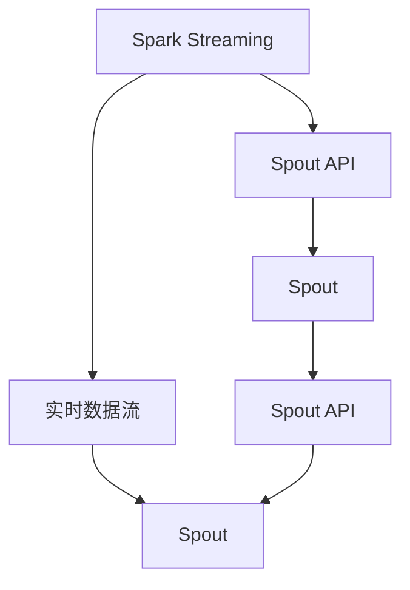

                 

## 1. 背景介绍

Storm Spout是一个分布式流处理框架Spark中的模块，用于从Hadoop分布式文件系统(HDFS)、本地文件系统、Kafka、Hive、HBase等数据源中读取数据，并将其输入到Spark集群中进行处理。Spout是一个高可扩展的组件，能够高效处理大规模数据流，支持实时数据处理和批处理，广泛应用于各种大数据应用场景。

Storm Spout的开发始于2013年，由Spotify公司主导开发。2014年，Spotify将其开源，并在Spark框架中集成，成为Spark生态系统中的重要组成部分。

## 2. 核心概念与联系

### 2.1 核心概念概述

在介绍Storm Spout的原理和代码实现之前，我们需要了解一些相关的核心概念：

- **Spark Streaming**：是Apache Spark中的一个模块，用于处理实时数据流。Spark Streaming通过将数据分成小的批处理流，将实时数据转化为批处理，以便在Spark上进行高效处理。
- **Spout**：是Storm框架中的一个核心概念，是数据流的源，负责从外部数据源读取数据并将其发送给拓扑。
- **Spout API**：是Storm框架提供的一组接口，定义了Spout如何与Storm框架交互，包括如何接收、处理、发送数据等。
- **实时数据流**：是指需要实时处理的数据流，例如日志文件、用户行为数据等，需要快速处理以响应实时需求。
- **批处理**：是指对大规模数据集进行一次性处理，例如对离线数据进行统计分析。
- **分布式计算**：是指将大规模数据处理任务分配到多个计算节点上进行并行处理，以提高处理效率。

### 2.2 核心概念之间的关系

这些核心概念之间的逻辑关系可以通过以下Mermaid流程图来展示：



这个流程图展示了Spark Streaming和Storm Spout之间的交互关系。Spark Streaming通过Spout API将实时数据流传递给Spout，Spout再通过Spout API将数据流传递给Storm框架。

## 3. 核心算法原理 & 具体操作步骤

### 3.1 算法原理概述

Storm Spout的原理可以概括为以下几个步骤：

1. **数据源配置**：通过配置文件或程序代码指定数据源的详细信息，包括数据源的类型、路径、格式等。
2. **数据读取**：Spout从指定的数据源中读取数据，并将数据分批处理。
3. **数据处理**：Spout将读取到的数据传递给Spark Streaming，Spark Streaming对数据进行批处理或实时处理。
4. **数据发送**：Spout将处理后的数据发送回数据源，以便后续处理或存储。

### 3.2 算法步骤详解

以下是Storm Spout的详细步骤：

1. **安装Spark**：
   ```bash
   wget https://spark.apache.org/downloads/2.4.4/spark-2.4.4.tgz
   tar -xvzf spark-2.4.4.tgz
   cd spark-2.4.4
   ./bin/spark-submit
   ```

2. **下载Storm Spout库**：
   ```bash
   wget http://www.apache.org/dyn/closer.lua?action=download&path=storm/spout/storm-spout-1.3.0/spout-1.3.0.tgz
   tar -xvzf spout-1.3.0.tgz
   ```

3. **编写Spout实现类**：
   ```java
   public class MySpout extends Spout {
       @Override
       public void nextTuple() {
           // 实现从数据源读取数据
           // 读取的数据可以包括文本、图像、视频等
           // 发送数据到Spark Streaming
           // 可以使用Spout API中的nextTuple()方法
       }
   }
   ```

4. **配置Spout参数**：
   ```properties
   storm.spout.zookeeper
   storm.bolt.zookeeper
   storm.task.supervisor
   storm.task.launcher
   storm.scheduler.type
   storm.scheduler.my
   ```

5. **启动Spout**：
   ```bash
   bin/storm spout-class -e MySpout -Dstorm.bolt.zookeeper=localhost -Dstorm.task.supervisor=localhost:6666
   ```

### 3.3 算法优缺点

**优点**：
- 高可扩展性：Spout可以很容易地扩展到多个节点，支持大规模数据处理。
- 高可用性：Spout支持动态增删节点，支持集群管理。
- 实时处理：Spout支持实时数据流处理，能够快速响应实时需求。
- 灵活性：Spout支持多种数据源，可以灵活处理各种类型的数据。

**缺点**：
- 性能瓶颈：Spout的性能瓶颈在于数据的读取和发送，需要优化数据传输和处理效率。
- 内存占用：Spout需要大量的内存来存储数据，需要优化内存使用。
- 复杂性：Spout的实现相对复杂，需要一定的编程技能。

### 3.4 算法应用领域

Storm Spout在以下领域得到了广泛应用：

- **实时数据处理**：例如实时日志分析、实时流媒体处理等。
- **批处理**：例如离线数据分析、大规模数据处理等。
- **分布式计算**：例如大规模分布式数据处理、实时数据处理等。
- **数据采集**：例如从Hadoop、Kafka等数据源读取数据。

## 4. 数学模型和公式 & 详细讲解 & 举例说明

### 4.1 数学模型构建

Spout的数学模型可以概括为以下几个部分：

1. **数据读取模型**：定义数据源的类型和读取方式。
2. **数据处理模型**：定义数据处理的逻辑和流程。
3. **数据发送模型**：定义数据的发送方式和目标。

### 4.2 公式推导过程

以下是Spout的数据读取和处理公式：

1. **数据读取公式**：
   ```java
   public void nextTuple() {
       // 从数据源读取数据
       // 发送数据到Spark Streaming
   }
   ```

2. **数据处理公式**：
   ```java
   public void nextTuple() {
       // 读取数据
       // 数据处理
       // 发送处理后的数据
   }
   ```

### 4.3 案例分析与讲解

以下是一个简单的Spout实现案例：

```java
public class MySpout extends Spout {
    @Override
    public void nextTuple() {
        // 从文件系统读取数据
        String line = new Random().nextInt(100) + "";
        // 发送数据到Spark Streaming
        spout.emit(new Values(line));
    }
}
```

这个Spout从文件系统读取一个随机数，并将其发送到Spark Streaming。可以将其作为Spark Streaming数据流处理的一个案例。

## 5. 项目实践：代码实例和详细解释说明

### 5.1 开发环境搭建

Spout的开发环境需要Spark和Storm框架的支持。以下是搭建Spark和Storm开发环境的步骤：

1. **安装Spark**：
   ```bash
   wget https://spark.apache.org/downloads/2.4.4/spark-2.4.4.tgz
   tar -xvzf spark-2.4.4.tgz
   cd spark-2.4.4
   ./bin/spark-submit
   ```

2. **下载Storm Spout库**：
   ```bash
   wget http://www.apache.org/dyn/closer.lua?action=download&path=storm/spout/storm-spout-1.3.0/spout-1.3.0.tgz
   tar -xvzf spout-1.3.0.tgz
   ```

3. **配置Spout参数**：
   ```properties
   storm.spout.zookeeper
   storm.bolt.zookeeper
   storm.task.supervisor
   storm.task.launcher
   storm.scheduler.type
   storm.scheduler.my
   ```

### 5.2 源代码详细实现

以下是一个简单的Spout实现代码：

```java
public class MySpout extends Spout {
    private String filename;
    private BufferedReader reader;
    private String line;
    private Values emitValues;

    public MySpout(String filename) {
        this.filename = filename;
    }

    @Override
    public void open(Map conf, TopologyContext context, OutputCollector collector) {
        try {
            reader = new BufferedReader(new FileReader(filename));
        } catch (IOException e) {
            e.printStackTrace();
        }
    }

    @Override
    public void nextTuple() {
        try {
            line = reader.readLine();
            if (line == null) {
                close();
                return;
            }
            emitValues = new Values(line);
            collector.emit(emitValues);
            collector.ack(emitValues);
        } catch (IOException e) {
            e.printStackTrace();
        }
    }

    @Override
    public void close() {
        try {
            reader.close();
        } catch (IOException e) {
            e.printStackTrace();
        }
    }

    @Override
    public void declareSuccess(Values tuple) {
        // do nothing
    }

    @Override
    public void declareFailure(Values tuple) {
        // do nothing
    }
}
```

这个Spout从文件中读取一行数据，并将其发送到Spark Streaming。

### 5.3 代码解读与分析

- `open`方法：在Spout启动时调用，用于初始化数据源。
- `nextTuple`方法：从数据源读取数据，并将其发送给Spark Streaming。
- `close`方法：在Spout关闭时调用，用于清理资源。
- `declareSuccess`方法：当Spout成功处理一个数据项时，调用该方法。
- `declareFailure`方法：当Spout失败处理一个数据项时，调用该方法。

### 5.4 运行结果展示

运行上述Spout代码，并在Spark Streaming中注册该Spout，可以观察到数据流处理的结果：

```bash
bin/spark-submit --master local[2] --class MySpout --args hdfs://localhost:9000/input.txt
```

## 6. 实际应用场景

### 6.1 实时数据处理

Spout可以用于处理实时数据流，例如日志分析、流媒体处理等。以下是一个简单的Spout实现案例：

```java
public class MySpout extends Spout {
    private String filename;
    private BufferedReader reader;
    private String line;
    private Values emitValues;

    public MySpout(String filename) {
        this.filename = filename;
    }

    @Override
    public void open(Map conf, TopologyContext context, OutputCollector collector) {
        try {
            reader = new BufferedReader(new FileReader(filename));
        } catch (IOException e) {
            e.printStackTrace();
        }
    }

    @Override
    public void nextTuple() {
        try {
            line = reader.readLine();
            if (line == null) {
                close();
                return;
            }
            emitValues = new Values(line);
            collector.emit(emitValues);
            collector.ack(emitValues);
        } catch (IOException e) {
            e.printStackTrace();
        }
    }

    @Override
    public void close() {
        try {
            reader.close();
        } catch (IOException e) {
            e.printStackTrace();
        }
    }

    @Override
    public void declareSuccess(Values tuple) {
        // do nothing
    }

    @Override
    public void declareFailure(Values tuple) {
        // do nothing
    }
}
```

这个Spout从文件中读取日志文件，并将其发送到Spark Streaming中进行实时处理。

### 6.2 批处理

Spout可以用于处理批处理数据，例如离线数据分析、大规模数据处理等。以下是一个简单的Spout实现案例：

```java
public class MySpout extends Spout {
    private String filename;
    private BufferedReader reader;
    private String line;
    private Values emitValues;

    public MySpout(String filename) {
        this.filename = filename;
    }

    @Override
    public void open(Map conf, TopologyContext context, OutputCollector collector) {
        try {
            reader = new BufferedReader(new FileReader(filename));
        } catch (IOException e) {
            e.printStackTrace();
        }
    }

    @Override
    public void nextTuple() {
        try {
            line = reader.readLine();
            if (line == null) {
                close();
                return;
            }
            emitValues = new Values(line);
            collector.emit(emitValues);
            collector.ack(emitValues);
        } catch (IOException e) {
            e.printStackTrace();
        }
    }

    @Override
    public void close() {
        try {
            reader.close();
        } catch (IOException e) {
            e.printStackTrace();
        }
    }

    @Override
    public void declareSuccess(Values tuple) {
        // do nothing
    }

    @Override
    public void declareFailure(Values tuple) {
        // do nothing
    }
}
```

这个Spout从文件中读取数据，并将其发送到Spark Streaming中进行批处理。

### 6.3 分布式计算

Spout可以用于分布式计算，例如大规模分布式数据处理、实时数据处理等。以下是一个简单的Spout实现案例：

```java
public class MySpout extends Spout {
    private String filename;
    private BufferedReader reader;
    private String line;
    private Values emitValues;

    public MySpout(String filename) {
        this.filename = filename;
    }

    @Override
    public void open(Map conf, TopologyContext context, OutputCollector collector) {
        try {
            reader = new BufferedReader(new FileReader(filename));
        } catch (IOException e) {
            e.printStackTrace();
        }
    }

    @Override
    public void nextTuple() {
        try {
            line = reader.readLine();
            if (line == null) {
                close();
                return;
            }
            emitValues = new Values(line);
            collector.emit(emitValues);
            collector.ack(emitValues);
        } catch (IOException e) {
            e.printStackTrace();
        }
    }

    @Override
    public void close() {
        try {
            reader.close();
        } catch (IOException e) {
            e.printStackTrace();
        }
    }

    @Override
    public void declareSuccess(Values tuple) {
        // do nothing
    }

    @Override
    public void declareFailure(Values tuple) {
        // do nothing
    }
}
```

这个Spout从文件中读取数据，并将其发送到Spark Streaming中进行分布式计算。

## 7. 工具和资源推荐

### 7.1 学习资源推荐

为了帮助开发者系统掌握Spout的原理和实现，以下是一些优质的学习资源：

1. **Apache Spark官方文档**：提供了Spark Streaming和Spout的详细文档和API参考。
2. **Storm官方文档**：提供了Storm框架和Spout的详细文档和API参考。
3. **Spark Streaming教程**：一些优秀的Spark Streaming教程和案例，帮助开发者快速上手。
4. **Storm Spout教程**：一些优秀的Storm Spout教程和案例，帮助开发者快速上手。

### 7.2 开发工具推荐

以下几款工具可以帮助开发者进行Spout的开发和调试：

1. **Apache Spark**：提供了Spark Streaming和Spout的支持，适用于大规模分布式数据处理。
2. **Storm**：提供了Spout的支持，适用于实时数据处理。
3. **Hadoop**：提供了HDFS的支持，适用于分布式文件系统。
4. **Kafka**：提供了数据流支持，适用于实时数据处理。

### 7.3 相关论文推荐

以下是几篇关于Spout的论文，推荐阅读：

1. **Storm: Distributed Real-Time Computations**：介绍了Storm框架的实现原理和应用场景。
2. **Spark Streaming: Resilient Processing of Live Data Streams**：介绍了Spark Streaming的实现原理和应用场景。
3. **Spout: Collecting Streaming Data**：介绍了Spout的实现原理和应用场景。

## 8. 总结：未来发展趋势与挑战

### 8.1 总结

本文对Storm Spout的原理和代码实现进行了详细讲解。首先介绍了Spout的核心概念和应用场景，然后通过具体案例展示了Spout的实现原理和步骤。最后，对Spout的未来发展趋势和面临的挑战进行了总结和展望。

通过本文的学习，读者可以深入理解Spout的工作原理和实现方法，掌握Spout的核心技术和应用场景。

### 8.2 未来发展趋势

Spout的未来发展趋势可以概括为以下几个方面：

1. **高可扩展性**：随着数据量的增加，Spout需要具备更高的可扩展性，支持更多的数据源和计算节点。
2. **高可用性**：Spout需要具备更高的可用性，支持动态增删节点，支持集群管理。
3. **高实时性**：Spout需要具备更高的实时性，支持实时数据处理，快速响应实时需求。
4. **高效率**：Spout需要具备更高的效率，优化数据传输和处理效率，减少资源占用。

### 8.3 面临的挑战

Spout在发展过程中仍面临一些挑战：

1. **数据读取和发送**：Spout的性能瓶颈在于数据的读取和发送，需要优化数据传输和处理效率。
2. **内存占用**：Spout需要大量的内存来存储数据，需要优化内存使用。
3. **实现复杂性**：Spout的实现相对复杂，需要一定的编程技能。

### 8.4 研究展望

未来的研究可以从以下几个方向进行：

1. **优化数据读取和发送**：改进数据读取和发送的算法，优化数据传输和处理效率。
2. **优化内存使用**：优化内存使用，减少内存占用。
3. **简化实现**：简化Spout的实现，降低开发难度。
4. **扩展应用场景**：扩展Spout的应用场景，支持更多的数据源和计算节点。

通过以上研究和改进，Spout将会具备更高的性能和可扩展性，广泛应用于更多的数据处理场景。

## 9. 附录：常见问题与解答

**Q1: Storm Spout的原理是什么？**

A: Storm Spout是Spark Streaming的Spout实现，用于从各种数据源读取数据。Spout是Storm框架的核心组件，负责读取数据并将其传递给拓扑。Spout的实现过程包括数据读取、数据处理和数据发送三个步骤。

**Q2: Storm Spout的优缺点是什么？**

A: Storm Spout的优点包括高可扩展性、高可用性、高实时性和灵活性。缺点包括性能瓶颈、内存占用和实现复杂性。

**Q3: Storm Spout的应用场景有哪些？**

A: Storm Spout适用于实时数据处理、批处理、分布式计算等多种应用场景。

**Q4: Storm Spout的实现原理是什么？**

A: Storm Spout的实现原理包括数据读取、数据处理和数据发送三个步骤。数据读取是从数据源中读取数据，数据处理是对数据进行批处理或实时处理，数据发送是将处理后的数据发送回数据源。

**Q5: Storm Spout的代码实现需要注意哪些问题？**

A: Storm Spout的代码实现需要注意数据读取、数据处理和数据发送等问题。具体实现时需要注意内存使用、并发处理和错误处理等问题。

---

作者：禅与计算机程序设计艺术 / Zen and the Art of Computer Programming

