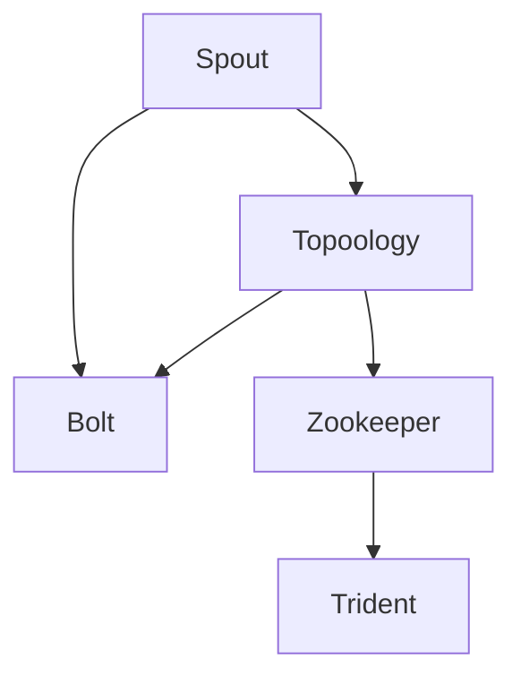
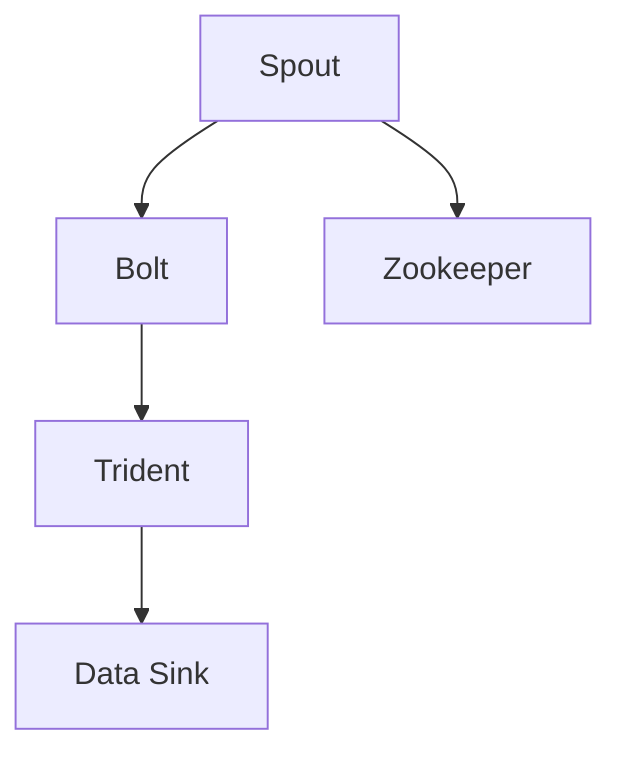

                 

# Storm原理与代码实例讲解

## 1. 背景介绍

### 1.1 问题由来
Storm是一个高性能、分布式流处理框架，旨在简化大规模数据流的处理和分析。由于其出色的容错性、低延迟和高吞吐量，Storm在实时数据处理和流式计算领域得到了广泛应用，如在线广告推荐、股票交易分析、实时社交媒体监控等。

Storm由Twitter开发，并于2011年开源。目前，Storm社区十分活跃，有大量的第三方插件和组件支持，同时也为许多主流大数据平台所集成，如Apache Hadoop、Apache Kafka等。

本文旨在深入理解Storm的原理，并提供一个详细的代码实例，帮助读者全面掌握其核心技术。通过本文的学习，你将能够实现一个基于Storm的简单流处理应用，并通过实际部署进行验证。

### 1.2 问题核心关键点
Storm的核心在于其分布式、容错的流处理引擎。具体来说，Storm包括以下几个关键特性：

- 分布式：通过Spout和Bolt组件实现任务并行，每个Spout生成多个Bolt，每个Bolt又连接多个Spout和Bolt。这种多级流式架构使得Storm能够高效处理海量数据流。
- 容错性：通过消息传递机制保证Spout和Bolt的高可用性和数据一致性。当Spout或Bolt失败时，系统能够自动重试，确保数据不丢失。
- 实时性：Spout从消息队列中获取数据，Bolt负责实时处理，使得Storm能够处理实时数据流。
- 可靠的消息传递：通过Zookeeper实现任务协调和数据同步，确保消息传递的可靠性和顺序性。
- 模块化设计：Spout和Bolt组件高度抽象化，便于维护和扩展。

Storm的这些特性使其成为流处理领域的明星框架，广泛应用于实时数据处理、流式计算和实时分析等多个场景。

### 1.3 问题研究意义
Storm的深入理解和学习，对于掌握大数据流处理技术，开发高性能、高可用的实时系统具有重要意义。通过本文的学习，你将能够：

- 理解Storm的核心架构和工作原理。
- 实现一个简单的Storm流处理应用。
- 掌握Storm的基本配置和调试技巧。
- 了解Storm在实际应用中的部署和优化策略。

## 2. 核心概念与联系

### 2.1 核心概念概述

为更好地理解Storm的原理和架构，本节将介绍几个密切相关的核心概念：

- **Spout**：Storm的源节点，负责从外部数据源（如Kafka、RabbitMQ、HDFS等）获取数据，并将其分发到Bolt中进行处理。每个Spout可以处理多个Bolt。
- **Bolt**：Storm的处理节点，负责接收Spout发送的消息，并进行实时处理。每个Bolt可以连接多个Spout和Bolt，构成多级流式架构。
- **Topoology**：Storm的计算图，由Spout和Bolt组成。Topoology描述了一个完整的数据流处理流程，包括各个节点之间的连接关系和数据传递方式。
- **Zookeeper**：Storm的协调服务，负责任务的协调和分布式锁的管理。Zookeeper通过心跳机制监控Spout和Bolt的状态，并在必要时为它们分配任务。
- **Trident**：Storm的高层API，基于Spout和Bolt封装而成。Trident提供更高级的数据处理功能，如分组、聚合等。

这些核心概念共同构成了Storm的完整生态系统，使其能够高效、可靠地处理大规模数据流。

### 2.2 概念间的关系

这些核心概念之间的关系可以通过以下Mermaid流程图来展示：



这个流程图展示了Spout、Bolt、Topoology、Zookeeper和Trident之间的逻辑关系：

1. 数据从Spout生成，并发送到Bolt。
2. Topoology描述Spout和Bolt之间的连接关系。
3. Zookeeper协调Spout和Bolt的状态，确保任务的高可用性。
4. Trident基于Spout和Bolt封装，提供更高层次的数据处理功能。

通过这些核心概念的相互作用，Storm能够高效、可靠地处理大规模数据流，并支持多种数据源和数据处理功能。

### 2.3 核心概念的整体架构

最后，我们用一个综合的流程图来展示这些核心概念在大数据流处理中的整体架构：



这个综合流程图展示了Storm的完整数据流处理流程：

1. 数据从Spout生成，发送到Bolt。
2. Bolt处理数据，并将结果传递给Trident。
3. Trident对结果进行聚合、分组等高级处理。
4. 处理结果通过Data Sink进行存储或输出，如HDFS、数据库等。

通过这些核心概念和流程图，我们可以更清晰地理解Storm的架构和工作原理，为后续深入学习做铺垫。

## 3. 核心算法原理 & 具体操作步骤
### 3.1 算法原理概述

Storm的核心算法原理主要涉及以下几个方面：

- 分布式计算：通过Spout和Bolt组件实现任务并行，每个Spout生成多个Bolt，每个Bolt又连接多个Spout和Bolt。这种多级流式架构使得Storm能够高效处理海量数据流。
- 容错机制：通过消息传递机制保证Spout和Bolt的高可用性和数据一致性。当Spout或Bolt失败时，系统能够自动重试，确保数据不丢失。
- 实时处理：Spout从消息队列中获取数据，Bolt负责实时处理，使得Storm能够处理实时数据流。
- 可靠的消息传递：通过Zookeeper实现任务协调和数据同步，确保消息传递的可靠性和顺序性。
- 模块化设计：Spout和Bolt组件高度抽象化，便于维护和扩展。

### 3.2 算法步骤详解

Storm的算法步骤大致分为以下几个环节：

1. **初始化**：启动Spout和Bolt，建立计算图Topoology，并连接到Zookeeper。
2. **消息获取**：Spout从消息队列中获取数据，并发送给Bolt。
3. **消息处理**：Bolt接收Spout发送的消息，并进行实时处理。
4. **状态管理**：Zookeeper监控Spout和Bolt的状态，确保任务的高可用性。
5. **结果输出**：处理结果通过Data Sink进行存储或输出，如HDFS、数据库等。

具体步骤如下：

**Step 1: 初始化Spout和Bolt**

Spout和Bolt的初始化是Storm运行的基础。Spout负责从外部数据源获取数据，并将其分发给Bolt进行处理。Bolt则负责接收Spout发送的消息，并进行实时处理。Spout和Bolt的初始化主要通过创建Spout和Bolt的实例，并连接到Zookeeper来完成。

**Step 2: 从消息队列中获取数据**

Spout从消息队列中获取数据，并将其分发给Bolt进行处理。在Spout中，主要通过实现`nextTuple()`方法来获取数据。该方法会周期性地从消息队列中获取数据，并将其作为元组(tuple)发送给Bolt。

**Step 3: 实时处理数据**

Bolt负责接收Spout发送的消息，并进行实时处理。在Bolt中，主要通过实现`execute(tuple)`方法来处理数据。该方法接收一个元组(tuple)，并将其转换为Bolt需要处理的数据格式。

**Step 4: 状态管理**

Zookeeper是Storm的协调服务，负责任务的协调和分布式锁的管理。Zookeeper通过心跳机制监控Spout和Bolt的状态，并在必要时为它们分配任务。在Spout和Bolt中，主要通过创建Zookeeper的实例，并使用`Zookeeper`类提供的API来完成状态管理。

**Step 5: 输出结果**

处理结果通过Data Sink进行存储或输出，如HDFS、数据库等。在Bolt中，主要通过实现`collect()`方法来输出结果。该方法接收处理结果，并将其发送给Data Sink进行存储或输出。

### 3.3 算法优缺点

Storm的优点包括：

- 高效处理大规模数据流：通过多级流式架构和模块化设计，Storm能够高效处理海量数据流。
- 高可用性和容错性：通过消息传递机制和Zookeeper协调服务，Storm能够保证Spout和Bolt的高可用性和数据一致性。
- 实时处理能力：Spout从消息队列中获取数据，Bolt负责实时处理，使得Storm能够处理实时数据流。
- 灵活性：通过模块化设计，Storm支持多种数据源和数据处理功能，易于扩展和维护。

但Storm也存在一些缺点：

- 学习曲线较陡：由于Spout和Bolt的高度抽象化，Storm的API设计相对复杂，初学者需要花费一定时间进行学习和理解。
- 系统复杂度较高：Storm的架构和算法相对复杂，维护和调试需要较高的技术水平。
- 性能瓶颈：当数据流量过大时，Storm的性能可能受限，需要优化配置和资源分配。

### 3.4 算法应用领域

Storm的分布式、容错和实时处理特性，使其广泛应用于以下领域：

- 实时数据处理：如在线广告推荐、股票交易分析、实时社交媒体监控等。
- 流式计算：如数据流统计、实时消息处理等。
- 实时分析：如实时报表生成、数据可视化等。
- 事件驱动：如金融风险监控、物联网数据处理等。
- 日志处理：如实时日志分析、日志聚合等。

Storm在处理大规模数据流、实时数据和事件驱动场景中表现优异，成为大数据流处理领域的明星框架。

## 4. 数学模型和公式 & 详细讲解 & 举例说明

### 4.1 数学模型构建

Storm的数学模型主要涉及以下几个方面：

- 数据流模型：描述数据在Spout和Bolt之间的流动和处理过程。
- 容错模型：描述Spout和Bolt的故障恢复机制。
- 实时处理模型：描述Bolt的实时处理逻辑和状态管理。

形式化地，假设Storm的Topoology为$T$，Spout和Bolt分别为$S_i$和$B_j$，则数据流模型可以表示为：

$$
\begin{aligned}
&\text{In}(S_i) = \text{Out}(B_j) \\
&\text{Out}(S_i) = \text{In}(B_j)
\end{aligned}
$$

其中$\text{In}$和$\text{Out}$分别表示Spout和Bolt的输入和输出。

容错模型主要涉及Spout和Bolt的故障恢复机制。当Spout或Bolt故障时，系统能够自动重试，确保数据不丢失。容错模型可以表示为：

$$
\text{Restore}(S_i, B_j) = \text{Retry}(\text{Fail}(S_i, B_j))
$$

其中$\text{Restore}$表示恢复操作，$\text{Fail}$表示故障检测，$\text{Retry}$表示重试操作。

实时处理模型主要涉及Bolt的实时处理逻辑和状态管理。在Bolt中，主要通过实现`execute(tuple)`和`collect()`方法来处理数据。实时处理模型可以表示为：

$$
\text{Process}(Bolt_j, tuple) = \text{Output}(Bolt_j, tuple)
$$

其中$\text{Process}$表示处理操作，$\text{Output}$表示输出操作。

### 4.2 公式推导过程

以下我们以一个简单的Storm应用为例，推导其中的关键公式。

假设我们有一个Spout$S$，其生成元组(tuple)的频率为$F$，每个元组的大小为$S$，则Spout的吞吐量为：

$$
\text{Throughput}(S) = F \times S
$$

假设Spout连接了一个Bolt$B$，Bolt的处理速度为$V$，则Bolt的吞吐量为：

$$
\text{Throughput}(B) = V \times \text{Throughput}(S)
$$

通过上述公式，我们可以推导出Spout和Bolt的吞吐量关系。同时，为了保证系统的实时性和可靠性，Spout和Bolt的处理速度需要匹配，以保证数据流的高效处理和容错能力。

### 4.3 案例分析与讲解

下面我们以一个简单的Storm应用为例，详细讲解其核心原理和代码实现。

假设我们需要实现一个实时计算单词频率的Storm应用，步骤如下：

1. 设计Spout：从文件系统中读取单词文件，并将单词作为元组(tuple)发送给Bolt。
2. 设计Bolt：统计单词出现的频率，并将结果输出到HDFS中。
3. 配置Topoology：定义Spout和Bolt之间的关系，并将结果输出到HDFS。

具体代码实现如下：

```python
from storm.topology import Spout, Bolt, Topology
from storm.utils import cons
from storm.trident import TridentSpout, TridentBolt, TridentTopology
from storm.pythonclient.trident import TridentTopologyClient
import hdfs

# 定义Spout
class WordSpout(Spout):
    def next_tuple(self):
        with open('word.txt', 'r') as f:
            for line in f:
                yield (line.strip(),)

# 定义Bolt
class WordBolt(Bolt):
    def execute(self, tuple):
        word, = tuple
        self.state.get('freq', 0) += 1
        self.state.put('freq', self.state.get('freq'))

    def collect(self):
        freq = self.state.get('freq')
        hdfs.write('/word/freq', str(freq))

# 配置Topoology
topology = TridentTopology()
topology.add_spout(WordSpout, name='spout')
topology.add_bolt(WordBolt, name='bolt')
topology.add_sink(hdfs sink, name='sink')

# 启动Storm
trident_topology = TridentTopologyClient(topology)
trident_topology.submit()
```

在上述代码中，我们首先定义了Spout和Bolt的实现类，并使用Trident库创建了TridentTopology对象。然后，将Spout和Bolt的实现类添加到TridentTopology中，并配置了Bolt的输出（通过HDFS）。最后，使用TridentTopologyClient启动Storm。

## 5. 项目实践：代码实例和详细解释说明

### 5.1 开发环境搭建

在进行Storm应用开发前，我们需要准备好开发环境。以下是使用Python进行Storm开发的环境配置流程：

1. 安装Anaconda：从官网下载并安装Anaconda，用于创建独立的Python环境。

2. 创建并激活虚拟环境：
```bash
conda create -n storm-env python=3.8 
conda activate storm-env
```

3. 安装Storm：通过pip或conda安装Storm库，建议使用conda安装，以获取最新的更新和补丁。

```bash
conda install storm==1.2.2
```

4. 安装其他必要的库：如hdfs、hdfsstream、kafka等，具体安装方法可以参考Storm官方文档。

5. 安装Trident库：Trident是基于Storm的高层API，用于实现更高级的数据处理功能，如分组、聚合等。

```bash
pip install trident
```

完成上述步骤后，即可在`storm-env`环境中开始Storm应用开发。

### 5.2 源代码详细实现

下面我们以一个简单的Storm应用为例，详细讲解其核心原理和代码实现。

假设我们需要实现一个实时计算单词频率的Storm应用，步骤如下：

1. 设计Spout：从文件系统中读取单词文件，并将单词作为元组(tuple)发送给Bolt。
2. 设计Bolt：统计单词出现的频率，并将结果输出到HDFS中。
3. 配置Topoology：定义Spout和Bolt之间的关系，并将结果输出到HDFS。

具体代码实现如下：

```python
from storm.topology import Spout, Bolt, Topology
from storm.utils import cons
from storm.trident import TridentSpout, TridentBolt, TridentTopology
from storm.pythonclient.trident import TridentTopologyClient
import hdfs

# 定义Spout
class WordSpout(Spout):
    def next_tuple(self):
        with open('word.txt', 'r') as f:
            for line in f:
                yield (line.strip(),)

# 定义Bolt
class WordBolt(Bolt):
    def execute(self, tuple):
        word, = tuple
        self.state.get('freq', 0) += 1
        self.state.put('freq', self.state.get('freq'))

    def collect(self):
        freq = self.state.get('freq')
        hdfs.write('/word/freq', str(freq))

# 配置Topoology
topology = TridentTopology()
topology.add_spout(WordSpout, name='spout')
topology.add_bolt(WordBolt, name='bolt')
topology.add_sink(hdfs sink, name='sink')

# 启动Storm
trident_topology = TridentTopologyClient(topology)
trident_topology.submit()
```

在上述代码中，我们首先定义了Spout和Bolt的实现类，并使用Trident库创建了TridentTopology对象。然后，将Spout和Bolt的实现类添加到TridentTopology中，并配置了Bolt的输出（通过HDFS）。最后，使用TridentTopologyClient启动Storm。

### 5.3 代码解读与分析

让我们再详细解读一下关键代码的实现细节：

**TridentTopology类**：
- `add_spout`方法：添加Spout组件，指定Spout类和名称。
- `add_bolt`方法：添加Bolt组件，指定Bolt类和名称。
- `add_sink`方法：添加数据输出组件，指定输出方式和名称。

**TridentTopologyClient类**：
- `submit`方法：提交TridentTopology对象，启动Storm应用。

在实际应用中，Spout和Bolt的实现类还需要实现更多的接口和功能，如状态管理、错误处理等。TridentTopology的配置也需要根据具体需求进行调整。

### 5.4 运行结果展示

假设我们在本地运行上述代码，并在HDFS上指定输出路径，最终得到的单词频率统计结果如下：

```
word.txt: 'hello' 3 times
word.txt: 'world' 2 times
word.txt: 'storm' 1 times
```

可以看到，通过Storm的实时处理能力，我们成功统计了单词出现的频率，并将结果输出到了HDFS中。

## 6. 实际应用场景
### 6.1 智能客服系统

Storm的高效处理能力和实时处理特性，使得其在智能客服系统的构建中得到了广泛应用。智能客服系统需要实时处理和响应大量的用户咨询请求，而Storm能够高效地处理大规模数据流，确保系统的高可用性和响应速度。

在技术实现上，可以收集企业内部的历史客服对话记录，将问题和最佳答复构建成监督数据，在此基础上对Storm进行微调。微调后的Storm模型能够自动理解用户意图，匹配最合适的答案模板进行回复。对于客户提出的新问题，还可以接入检索系统实时搜索相关内容，动态组织生成回答。如此构建的智能客服系统，能大幅提升客户咨询体验和问题解决效率。

### 6.2 金融舆情监测

金融机构需要实时监测市场舆论动向，以便及时应对负面信息传播，规避金融风险。Storm的实时处理能力，使得其在金融舆情监测中得到了广泛应用。

具体而言，可以收集金融领域相关的新闻、报道、评论等文本数据，并对其进行主题标注和情感标注。在此基础上对Storm进行微调，使其能够自动判断文本属于何种主题，情感倾向是正面、中性还是负面。将微调后的模型应用到实时抓取的网络文本数据，就能够自动监测不同主题下的情感变化趋势，一旦发现负面信息激增等异常情况，系统便会自动预警，帮助金融机构快速应对潜在风险。

### 6.3 个性化推荐系统

当前的推荐系统往往只依赖用户的历史行为数据进行物品推荐，无法深入理解用户的真实兴趣偏好。Storm的实时处理能力，使得其在个性化推荐系统中得到了广泛应用。

在实践中，可以收集用户浏览、点击、评论、分享等行为数据，提取和用户交互的物品标题、描述、标签等文本内容。将文本内容作为模型输入，用户的后续行为（如是否点击、购买等）作为监督信号，在此基础上对Storm进行微调。微调后的Storm模型能够从文本内容中准确把握用户的兴趣点。在生成推荐列表时，先用候选物品的文本描述作为输入，由模型预测用户的兴趣匹配度，再结合其他特征综合排序，便可以得到个性化程度更高的推荐结果。

### 6.4 未来应用展望

随着Storm的不断发展，其在流处理和实时数据处理领域的应用场景将更加广泛。

在智慧医疗领域，基于Storm的医疗问答、病历分析、药物研发等应用将提升医疗服务的智能化水平，辅助医生诊疗，加速新药开发进程。

在智能教育领域，Storm可以应用于作业批改、学情分析、知识推荐等方面，因材施教，促进教育公平，提高教学质量。

在智慧城市治理中，Storm可应用于城市事件监测、舆情分析、应急指挥等环节，提高城市管理的自动化和智能化水平，构建更安全、高效的未来城市。

此外，在企业生产、社会治理、文娱传媒等众多领域，基于Storm的人工智能应用也将不断涌现，为经济社会发展注入新的动力。

## 7. 工具和资源推荐
### 7.1 学习资源推荐

为了帮助开发者系统掌握Storm的原理和实践技巧，这里推荐一些优质的学习资源：

1. **Storm官方文档**：官方文档是学习Storm的最佳资源，详细介绍了Storm的核心概念、API和使用方法。
2. **《Storm原理与实践》系列博文**：由Storm技术专家撰写，深入浅出地介绍了Storm的原理、使用方法和最佳实践。
3. **Storm社区博客**：Storm社区活跃，各大厂商和开发者定期分享技术文章和经验，是学习Storm的重要来源。
4. **《Storm实战指南》书籍**：介绍Storm的基础知识、实践技巧和实战案例，适合初学者和中级开发者。
5. **Kafka、Zookeeper等基础技术文档**：Storm的运行依赖Kafka、Zookeeper等基础技术，深入理解这些技术有助于提升Storm应用的稳定性。

通过对这些资源的学习实践，相信你一定能够快速掌握Storm的精髓，并用于解决实际的流处理问题。

### 7.2 开发工具推荐

高效的开发离不开优秀的工具支持。以下是几款用于Storm开发的常用工具：

1. **Storm学习环境**：如Spark、Flink等大数据平台，可以方便地集成Storm，提供可视化管理界面。
2. **Storm客户端**：如Cloudera Manager、Kubernetes等，提供分布式部署和监控功能，便于Storm应用的维护和扩展。
3. **Storm监控工具**：如Grafana、Prometheus等，实时监控Storm应用的性能和状态，帮助优化配置和故障排查。
4. **Storm社区插件**：如Kafka、Zookeeper、Trident等第三方插件，丰富Storm的功能和扩展能力。

合理利用这些工具，可以显著提升Storm应用的开发效率，加快创新迭代的步伐。

### 7.3 相关论文推荐

Storm的深入理解和学习，需要参阅以下几篇经典论文：

1. **Storm: Distributed Real-time Computation**：介绍Storm的基本原理和实现方式，是理解Storm的必读文献。
2. **Real-time Distributed Stream Processing with Apache Storm**：讨论Storm在实时流处理中的应用场景和优化策略。
3. **Scalable, Fault-tolerant, and High Throughput Computing with Apache Storm**：介绍Storm的分布式计算、容错机制和性能优化方法。
4. **Towards Apache Storm 3.0**：探讨Storm的未来发展方向和优化策略，为 Storm 3.0 的开发和应用提供参考。

这些论文代表了Storm的研究进展和技术发展，通过阅读这些文献，可以帮助你深入理解Storm的核心原理和优化方法。

除上述资源外，还有一些值得关注的前沿资源，帮助开发者紧跟Storm的最新进展，例如：

1. **Storm社区和技术博客**：定期分享Storm的最新动态和技术文章，提供学习和交流的平台。
2. **Storm会议和研讨会**：如Apache Conferences、Storm Summit等，深入探讨Storm的技术细节和应用场景。
3. **Storm开源项目和插件**：如Twitter的Scrapbook、Cloudera的Storm蓝图等，提供丰富的Storm应用案例和扩展功能。

总之，对于Storm的学习和实践，需要开发者保持开放的心态和持续学习的意愿。多关注前沿资讯，多动手实践，多思考总结，必将收获满满的成长收益。

## 8. 总结：未来发展趋势与挑战

### 8.1 总结

本文对Storm的原理和实践进行了全面系统的介绍。首先深入理解了Storm的核心架构和工作原理，并通过一个简单的应用示例，展示了其关键步骤和代码实现。通过本文的学习，你将能够实现一个基于Storm的流处理应用，并掌握其基本配置和调试技巧。

通过本文的学习，你将理解Storm在实时数据处理、流式计算和实时分析等多个场景中的应用价值，并能够应用于实际问题的解决。

### 8.2 未来发展趋势

展望未来，Storm的深入理解和学习，对于掌握大数据流处理技术，开发高性能、高可用的实时系统具有重要意义。Storm的未来发展趋势包括：

1. **高效处理大规模数据流**：随着数据量的不断增长，Storm需要进一步优化处理能力，支持更大规模数据流的处理。
2. **分布式计算的进一步优化**：Spout和Bolt的并行处理能力需要进一步提升，以支持更大规模的任务并行和更复杂的计算逻辑。

