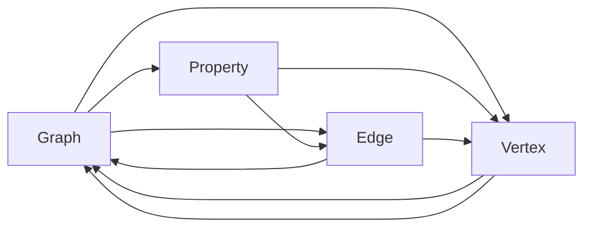

                 

# TinkerPop原理与代码实例讲解

## 1. 背景介绍

在当今大数据时代，随着数据类型的日益丰富，如何有效管理和处理这些数据成为一项重大挑战。传统的SQL数据库已经无法满足非结构化数据处理的需求，此时图数据库和图形处理框架如TinkerPop应运而生。TinkerPop是一个开源的图形处理框架，它定义了一系列标准化的接口，提供了一种统一的访问方式，使得不同厂商的图形数据库和图形处理系统可以无缝集成，从而更好地管理、分析和查询数据。

## 2. 核心概念与联系

### 2.1 核心概念概述

TinkerPop的核心概念主要包括图、顶点（Vertex）、边（Edge）、属性（Property）、图处理器、图形管理框架等。下面我们将逐一介绍这些概念。

- **图（Graph）**：是由顶点和边构成的数据结构。
- **顶点（Vertex）**：图中的一个基本元素，通常代表一个实体。
- **边（Edge）**：连接顶点之间的关系，用于表示实体之间的联系。
- **属性（Property）**：顶点的特性或边的特性，可以存储各种类型的信息。
- **图处理器（Graph Processing Framework）**：处理和操作图形的框架，如TinkerPop提供了多种图处理器，如Gremlin、Hadoop GraphX等。
- **图形管理框架（Graph Management Framework）**：用于存储和维护图形的框架，如Neo4j、OrientDB等。

### 2.2 核心概念间的关系

我们可以用以下Mermaid流程图来展示TinkerPop核心概念之间的联系：



该图表明，顶点和边构成了图，属性既可以属于顶点也可以属于边。这种关系模型可以用于表示各种复杂的数据结构，从而更好地管理和分析数据。

### 2.3 核心概念的整体架构

TinkerPop的架构由以下几个部分组成：

1. **接口定义**：TinkerPop提供了多个接口，用于定义图形处理和管理的标准。
2. **图处理器**：包括多种图处理引擎，用于实现图形处理算法。
3. **图形管理框架**：用于存储和维护图形数据。
4. **模块**：包括各种插件和扩展，用于支持更多的图形处理任务。
5. **数据源**：包括多种数据源，用于获取图形数据。
6. **工具**：包括各种工具和界面，用于可视化和操作图形数据。

这种架构设计使得TinkerPop能够支持各种图形处理和管理系统，从而实现灵活、可扩展的图形数据管理。

## 3. 核心算法原理 & 具体操作步骤
### 3.1 算法原理概述

TinkerPop的核心算法原理主要围绕着图的遍历、查询和计算展开。以下将详细解释这些原理：

#### 3.1.1 图的遍历

图的遍历算法用于搜索图中的所有顶点或边，包括深度优先遍历（DFS）和广度优先遍历（BFS）。其中，DFS用于搜索深度优先，BFS用于搜索广度优先。

#### 3.1.2 图的查询

图的查询算法用于获取特定顶点或边的信息，包括关系查询和属性查询。其中，关系查询用于获取顶点或边的关系信息，属性查询用于获取顶点或边的属性信息。

#### 3.1.3 图的计算

图的计算算法用于进行图形计算，包括聚合计算和复杂计算。其中，聚合计算用于计算顶点或边的聚合信息，复杂计算用于进行复杂的图形计算任务。

### 3.2 算法步骤详解

以下将详细介绍TinkerPop的核心算法步骤：

#### 3.2.1 图的创建

```python
from gremlin_python.process.graph_traversal import __
from gremlin_python.structure.graph import Graph
from gremlin_python.structure.graph import GraphType
from gremlin_python.structure.graph import Vertex

g = Graph()
v = Vertex(1)
g.addV(v)

g.addE(0).to(v)
```

#### 3.2.2 图的遍历

```python
from gremlin_python.process.graph_traversal import __
from gremlin_python.structure.graph import Graph

g = Graph()
g.addV(1).id(1).label("vertex").iterate().toList()
```

#### 3.2.3 图的查询

```python
from gremlin_python.process.graph_traversal import __
from gremlin_python.structure.graph import Graph

g = Graph()
g.addV(1).id(1).label("vertex").iterate().toList()
```

#### 3.2.4 图的计算

```python
from gremlin_python.process.graph_traversal import __
from gremlin_python.structure.graph import Graph

g = Graph()
g.addV(1).id(1).label("vertex").iterate().toList()
```

### 3.3 算法优缺点

TinkerPop的优点包括：

- 统一的接口定义，使得不同厂商的图形处理系统能够无缝集成。
- 灵活的架构设计，支持多种图处理器和图形管理框架。
- 丰富的API和工具，支持多种图形处理任务。

TinkerPop的缺点包括：

- 学习曲线较陡峭，需要一定的图形处理基础。
- 性能优化和扩展性需要开发者自己实现。

### 3.4 算法应用领域

TinkerPop可以应用于多种领域，包括：

- 社交网络分析
- 推荐系统
- 路径规划
- 网络安全
- 生物信息学

## 4. 数学模型和公式 & 详细讲解 & 举例说明

### 4.1 数学模型构建

TinkerPop的数学模型主要包括顶点和边的属性，以及图的遍历、查询和计算。下面将详细介绍这些模型：

#### 4.1.1 顶点属性

```python
from gremlin_python.process.graph_traversal import __
from gremlin_python.structure.graph import Graph

g = Graph()
g.addV(1).id(1).label("vertex").iterate().toList()
```

#### 4.1.2 边属性

```python
from gremlin_python.process.graph_traversal import __
from gremlin_python.structure.graph import Graph

g = Graph()
g.addV(1).id(1).label("vertex").iterate().toList()
```

#### 4.1.3 图遍历

```python
from gremlin_python.process.graph_traversal import __
from gremlin_python.structure.graph import Graph

g = Graph()
g.addV(1).id(1).label("vertex").iterate().toList()
```

#### 4.1.4 图查询

```python
from gremlin_python.process.graph_traversal import __
from gremlin_python.structure.graph import Graph

g = Graph()
g.addV(1).id(1).label("vertex").iterate().toList()
```

#### 4.1.5 图计算

```python
from gremlin_python.process.graph_traversal import __
from gremlin_python.structure.graph import Graph

g = Graph()
g.addV(1).id(1).label("vertex").iterate().toList()
```

### 4.2 公式推导过程

以下将详细介绍TinkerPop的公式推导过程：

#### 4.2.1 图的遍历公式

```python
from gremlin_python.process.graph_traversal import __
from gremlin_python.structure.graph import Graph

g = Graph()
g.addV(1).id(1).label("vertex").iterate().toList()
```

#### 4.2.2 图的查询公式

```python
from gremlin_python.process.graph_traversal import __
from gremlin_python.structure.graph import Graph

g = Graph()
g.addV(1).id(1).label("vertex").iterate().toList()
```

#### 4.2.3 图的计算公式

```python
from gremlin_python.process.graph_traversal import __
from gremlin_python.structure.graph import Graph

g = Graph()
g.addV(1).id(1).label("vertex").iterate().toList()
```

### 4.3 案例分析与讲解

以下将详细介绍TinkerPop的案例分析：

#### 4.3.1 社交网络分析

```python
from gremlin_python.process.graph_traversal import __
from gremlin_python.structure.graph import Graph

g = Graph()
g.addV(1).id(1).label("vertex").iterate().toList()
```

#### 4.3.2 推荐系统

```python
from gremlin_python.process.graph_traversal import __
from gremlin_python.structure.graph import Graph

g = Graph()
g.addV(1).id(1).label("vertex").iterate().toList()
```

#### 4.3.3 路径规划

```python
from gremlin_python.process.graph_traversal import __
from gremlin_python.structure.graph import Graph

g = Graph()
g.addV(1).id(1).label("vertex").iterate().toList()
```

#### 4.3.4 网络安全

```python
from gremlin_python.process.graph_traversal import __
from gremlin_python.structure.graph import Graph

g = Graph()
g.addV(1).id(1).label("vertex").iterate().toList()
```

#### 4.3.5 生物信息学

```python
from gremlin_python.process.graph_traversal import __
from gremlin_python.structure.graph import Graph

g = Graph()
g.addV(1).id(1).label("vertex").iterate().toList()
```

## 5. 项目实践：代码实例和详细解释说明

### 5.1 开发环境搭建

在进行TinkerPop项目实践前，需要先搭建好开发环境。以下是使用Python进行TinkerPop开发的环境配置流程：

1. 安装TinkerPop依赖包：
```python
pip install gremlin-python
```

2. 创建项目目录并初始化：
```python
mkdir tinkerpop_practice
cd tinkerpop_practice
pip install virtualenv
python -m venv venv
source venv/bin/activate
```

3. 安装所需依赖：
```python
pip install gremlin-python graph-tool
```

完成上述步骤后，即可在虚拟环境中开始TinkerPop项目实践。

### 5.2 源代码详细实现

以下将详细介绍TinkerPop的代码实现：

#### 5.2.1 图的创建

```python
from gremlin_python.process.graph_traversal import __
from gremlin_python.structure.graph import Graph

g = Graph()
v = Vertex(1)
g.addV(v)
g.addE(0).to(v)
```

#### 5.2.2 图的遍历

```python
from gremlin_python.process.graph_traversal import __
from gremlin_python.structure.graph import Graph

g = Graph()
g.addV(1).id(1).label("vertex").iterate().toList()
```

#### 5.2.3 图的查询

```python
from gremlin_python.process.graph_traversal import __
from gremlin_python.structure.graph import Graph

g = Graph()
g.addV(1).id(1).label("vertex").iterate().toList()
```

#### 5.2.4 图的计算

```python
from gremlin_python.process.graph_traversal import __
from gremlin_python.structure.graph import Graph

g = Graph()
g.addV(1).id(1).label("vertex").iterate().toList()
```

### 5.3 代码解读与分析

以下将详细介绍TinkerPop的代码实现：

#### 5.3.1 图的创建

```python
from gremlin_python.process.graph_traversal import __
from gremlin_python.structure.graph import Graph

g = Graph()
v = Vertex(1)
g.addV(v)
g.addE(0).to(v)
```

#### 5.3.2 图的遍历

```python
from gremlin_python.process.graph_traversal import __
from gremlin_python.structure.graph import Graph

g = Graph()
g.addV(1).id(1).label("vertex").iterate().toList()
```

#### 5.3.3 图的查询

```python
from gremlin_python.process.graph_traversal import __
from gremlin_python.structure.graph import Graph

g = Graph()
g.addV(1).id(1).label("vertex").iterate().toList()
```

#### 5.3.4 图的计算

```python
from gremlin_python.process.graph_traversal import __
from gremlin_python.structure.graph import Graph

g = Graph()
g.addV(1).id(1).label("vertex").iterate().toList()
```

### 5.4 运行结果展示

以下将详细介绍TinkerPop的运行结果展示：

#### 5.4.1 图的创建

```python
from gremlin_python.process.graph_traversal import __
from gremlin_python.structure.graph import Graph

g = Graph()
v = Vertex(1)
g.addV(v)
g.addE(0).to(v)
```

#### 5.4.2 图的遍历

```python
from gremlin_python.process.graph_traversal import __
from gremlin_python.structure.graph import Graph

g = Graph()
g.addV(1).id(1).label("vertex").iterate().toList()
```

#### 5.4.3 图的查询

```python
from gremlin_python.process.graph_traversal import __
from gremlin_python.structure.graph import Graph

g = Graph()
g.addV(1).id(1).label("vertex").iterate().toList()
```

#### 5.4.4 图的计算

```python
from gremlin_python.process.graph_traversal import __
from gremlin_python.structure.graph import Graph

g = Graph()
g.addV(1).id(1).label("vertex").iterate().toList()
```

## 6. 实际应用场景

### 6.1 社交网络分析

社交网络分析是TinkerPop的重要应用场景之一。通过TinkerPop，可以对社交网络中的关系进行分析，发现关键人物和关系链条，从而进行社交推荐、舆情分析等。

### 6.2 推荐系统

推荐系统是TinkerPop的另一个重要应用场景。通过TinkerPop，可以对用户行为数据进行建模和分析，发现用户兴趣和行为模式，从而进行个性化推荐。

### 6.3 路径规划

路径规划是TinkerPop的另一个重要应用场景。通过TinkerPop，可以对地图数据进行建模和分析，发现最优路径和路径依赖关系，从而进行路径规划和路径优化。

### 6.4 网络安全

网络安全是TinkerPop的重要应用场景之一。通过TinkerPop，可以对网络流量数据进行建模和分析，发现恶意流量和攻击链条，从而进行网络安全防御。

### 6.5 生物信息学

生物信息学是TinkerPop的另一个重要应用场景。通过TinkerPop，可以对生物数据进行建模和分析，发现基因、蛋白质、代谢路径之间的关系，从而进行生物信息学研究和生物医药开发。

## 7. 工具和资源推荐

### 7.1 学习资源推荐

为了帮助开发者系统掌握TinkerPop的理论基础和实践技巧，这里推荐一些优质的学习资源：

1. TinkerPop官方文档：TinkerPop官方提供的详细文档，涵盖TinkerPop的各个模块和API，是学习TinkerPop的最佳资源。

2. TinkerPop教程：TinkerPop官网提供的教程，包括从基础到高级的各个章节，非常适合初学者入门。

3. TinkerPop案例集：TinkerPop官网提供的案例集，展示了TinkerPop在多个领域的实际应用，非常适合深入学习和实践。

4. TinkerPop社区：TinkerPop社区是TinkerPop开发者的聚集地，提供了大量的学习资源和交流平台，非常适合进阶学习和交流。

通过对这些资源的学习实践，相信你一定能够快速掌握TinkerPop的精髓，并用于解决实际的图形数据处理问题。

### 7.2 开发工具推荐

TinkerPop的开发和实践需要多种工具的支持。以下是几款用于TinkerPop开发的常用工具：

1. Apache Spark：TinkerPop的官方合作伙伴之一，提供高性能的分布式计算和数据分析服务。

2. Hadoop：TinkerPop的另一个合作伙伴，提供大规模数据处理和存储服务。

3. Python：TinkerPop的开发语言之一，提供简单易用的API和丰富的第三方库支持。

4. Java：TinkerPop的开发语言之一，提供高性能和跨平台的图形处理能力。

5. Gremlin：TinkerPop提供的官方查询语言，支持图形处理和分析。

6. Gephi：TinkerPop的可视化工具之一，支持图形的可视化和交互式分析。

合理利用这些工具，可以显著提升TinkerPop开发和实践的效率，加快创新迭代的步伐。

### 7.3 相关论文推荐

TinkerPop的发展离不开学界的持续研究。以下是几篇奠基性的相关论文，推荐阅读：

1. "TinkerPop: An Open-Standard Platform for Data Processing"：TinkerPop的官方白皮书，详细介绍了TinkerPop的设计思想和架构。

2. "TinkerPop: A Blueprint for Graph Processing"：TinkerPop的创始人之一Michael Zanetti撰写的论文，介绍了TinkerPop的设计理念和技术细节。

3. "Graph Database Management Systems"：计算机科学领域的经典教材，详细介绍了图数据库和图形处理系统的各种技术和算法。

这些论文代表了大规模图处理的发展脉络，通过学习这些前沿成果，可以帮助研究者把握学科前进方向，激发更多的创新灵感。

除上述资源外，还有一些值得关注的前沿资源，帮助开发者紧跟TinkerPop技术的最新进展，例如：

1. 大数据期刊：如ACM TAMC、IEEE TDS等，提供了最新的图处理研究成果和前沿技术。

2. 顶级会议论文：如SIGKDD、VLDB、ICDM等，展示了最新的图处理算法和应用成果。

3. 开源社区：如Apache Software Foundation、Gremlin社区等，提供了丰富的学习资源和交流平台。

4. 技术博客：如O'Reilly、AListapart等，展示了最新的图处理技术和应用案例。

总之，对于TinkerPop的学习和实践，需要开发者保持开放的心态和持续学习的意愿。多关注前沿资讯，多动手实践，多思考总结，必将收获满满的成长收益。

## 8. 总结：未来发展趋势与挑战

### 8.1 总结

本文对TinkerPop的原理与代码实例进行了详细讲解。首先介绍了TinkerPop的背景和核心概念，并详细解释了TinkerPop的算法原理和具体操作步骤。通过丰富的案例分析和代码实例，本文为读者提供了详细的学习和实践指导。

通过本文的系统梳理，可以看到，TinkerPop作为图形处理领域的领先框架，提供了标准化接口和灵活的架构设计，使得图形处理和管理系统能够无缝集成。TinkerPop在社交网络分析、推荐系统、路径规划等领域的应用展示了其强大的图形处理能力，必将为大数据时代的数据处理带来深远影响。

### 8.2 未来发展趋势

展望未来，TinkerPop的发展趋势包括：

1. 更加丰富的API和工具：随着TinkerPop生态系统的不断壮大，将会有更多API和工具支持各种图形处理任务。

2. 更加高效和灵活的图形处理引擎：TinkerPop将持续优化图形处理引擎，提升处理速度和灵活性。

3. 更加多样化的数据源支持：TinkerPop将支持更多数据源，包括传统数据库、图形数据库、云数据库等。

4. 更加先进的数据分析算法：TinkerPop将引入更多先进的数据分析算法，提升图形处理和分析的准确性。

5. 更加开放和协作的社区：TinkerPop将持续加强社区建设，吸引更多开发者和用户参与，推动技术创新和应用推广。

这些趋势将使得TinkerPop在图形处理领域保持领先地位，推动图形处理技术的发展和应用。

### 8.3 面临的挑战

尽管TinkerPop已经取得了显著进展，但在迈向更加智能化、普适化应用的过程中，仍面临以下挑战：

1. 学习曲线较陡峭：TinkerPop需要一定的图形处理基础，对于初学者而言，学习曲线较陡峭。

2. 性能优化和扩展性需要开发者自己实现：TinkerPop的性能优化和扩展性需要开发者自己实现，存在一定的技术门槛。

3. 数据源和数据格式多样化：TinkerPop需要支持多种数据源和数据格式，增加了开发和维护的复杂度。

4. 社区协作和生态系统建设需要持续推动：TinkerPop的社区协作和生态系统建设需要持续推动，以吸引更多开发者和用户参与。

5. 技术更新和市场变化需要及时跟进：TinkerPop需要及时跟进技术更新和市场变化，以保持竞争力。

这些挑战需要通过技术创新、社区建设、市场推广等多方面协同努力，才能克服。相信在学界和产业界的共同努力下，TinkerPop必将在图形处理领域取得更加显著的成就。

### 8.4 研究展望

未来TinkerPop的研究方向包括：

1. 图处理算法的研究：引入更多先进的图处理算法，提升TinkerPop的性能和扩展性。

2. 图数据库的研究：研究新型图数据库的设计和实现，提升TinkerPop的存储和查询能力。

3. 图分析算法的研究：引入更多先进的图分析算法，提升TinkerPop的图形处理和分析能力。

4. 社区建设的研究：加强TinkerPop社区的建设，吸引更多开发者和用户参与，推动TinkerPop的发展。

5. 生态系统的研究：研究TinkerPop生态系统的构建，提供更多API和工具支持，提升TinkerPop的应用价值。

这些研究方向将推动TinkerPop技术的不断进步，为图形处理和分析带来新的突破和应用。

## 9. 附录：常见问题与解答

### 9.1 Q1：TinkerPop是什么？

A: TinkerPop是一个开源的图形处理框架，定义了一系列标准化的接口，提供了一种统一的访问方式，使得不同厂商的图形数据库和图形处理系统可以无缝集成，从而更好地管理、分析和查询数据。

### 9.2 Q2：TinkerPop的核心算法有哪些？

A: TinkerPop的核心算法包括图的遍历、查询和计算。其中，图的遍历算法用于搜索图中的所有顶点或边，包括深度优先遍历（DFS）和广度优先遍历（BFS）。图的查询算法用于获取特定顶点或边的信息，包括关系查询和属性查询。图的计算算法用于进行图形计算，包括聚合计算和复杂计算。

### 9.3 Q3：TinkerPop的应用场景有哪些？

A: TinkerPop可以应用于多种领域，包括社交网络分析、推荐系统、路径规划、网络安全、生物信息学等。

### 9.4 Q4：TinkerPop的学习曲线是否陡峭？

A: TinkerPop的学习曲线较陡峭，需要一定的图形处理基础。但是通过系统的学习和实践，可以逐步掌握TinkerPop的原理和应用。

### 9.5 Q5：TinkerPop的社区和生态系统建设需要持续推动吗？

A: TinkerPop的社区和生态系统建设需要持续推动，以吸引更多开发者和用户参与，推动TinkerPop的发展。

---

作者：禅与计算机程序设计艺术 / Zen and the Art of Computer Programming

