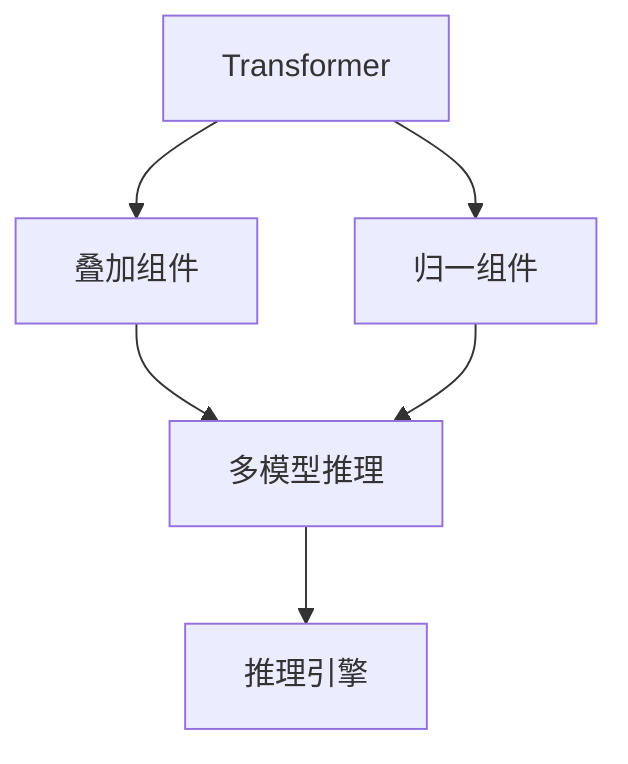
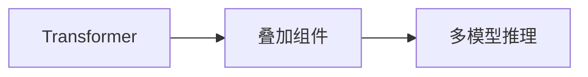
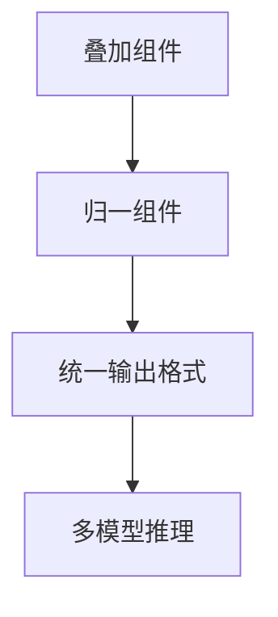
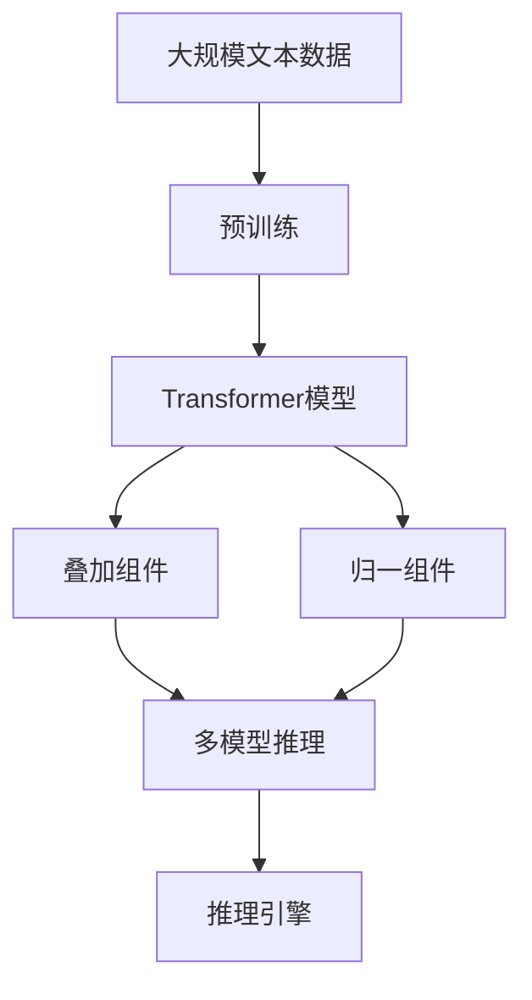

                 

# Transformer大模型实战 叠加和归一组件

> 关键词：Transformer, 大模型, 叠加, 归一, 组件, 推理引擎

## 1. 背景介绍

Transformer作为一种革命性的神经网络结构，自提出以来在自然语言处理（NLP）领域大放异彩。凭借其自注意力机制的强大表示能力，Transformer已经成为预训练语言模型的标配，广泛应用于文本分类、机器翻译、问答系统、文本生成等任务中。随着预训练语言模型的不断发展，其在推理和部署阶段面临的计算资源和时间成本也在不断增加。因此，如何高效利用和扩展Transformer模型，是一个亟需解决的重要问题。本文将聚焦于Transformer模型的叠加和归一组件，探索其在实际应用中的高效部署方式，并给出详细的代码实例和分析。

### 1.1 问题由来

Transformer模型基于自注意力机制，能够有效地捕捉文本序列中的长期依赖关系。但其自注意力计算复杂度高，在推理阶段需要消耗大量的计算资源和时间，尤其是在处理大规模文本时，这成为制约其应用的一个瓶颈。如何在大规模应用场景中高效地利用Transformer模型，成为了研究者们关注的热点问题。

### 1.2 问题核心关键点

为解决这个问题，研究者们提出了多种优化方法，其中最核心的是叠加和归一组件。叠加组件主要用于将多个Transformer模型堆叠在一起，通过多个模型的并行计算来加速推理过程。归一组件则用于统一不同模型的输出格式，从而降低计算复杂度。

叠加组件可以基于深度、宽度、通道数等多种方式进行，不同方式下的叠加效果和计算效率各有不同。而归一组件的设计和实现，则直接影响着系统的计算复杂度和资源占用。

### 1.3 问题研究意义

研究叠加和归一组件，对于拓展Transformer模型的应用范围，提升其推理效率，加速模型在实际场景中的部署，具有重要意义：

1. 降低计算资源消耗。通过叠加多个Transformer模型，可以充分利用GPU或TPU等高性能硬件资源，显著降低推理计算所需的CPU时间和内存消耗。
2. 提升推理速度。叠加多个模型后，单个模型的计算负担被均摊，整体推理速度得到提升。
3. 扩展模型规模。叠加组件可以灵活扩展模型的深度和宽度，使得模型能够在更大规模数据上获得更好的性能。
4. 简化代码实现。归一组件的设计，使得不同模型的输出格式统一，从而简化代码实现，提升系统的可维护性。
5. 提高模型鲁棒性。归一组件可以平滑不同模型的输出差异，提高系统的鲁棒性。

本文将通过详细讲解叠加和归一组件的原理、算法步骤、优缺点及应用领域，帮助读者更好地理解Transformer大模型的实战技巧，并在实际应用中灵活运用这些技术。

## 2. 核心概念与联系

### 2.1 核心概念概述

为更好地理解Transformer叠加和归一组件，本节将介绍几个密切相关的核心概念：

- Transformer：一种基于自注意力机制的神经网络结构，通过多头自注意力机制和前馈神经网络层进行文本序列建模。

- 叠加组件：将多个Transformer模型堆叠在一起，通过多个模型的并行计算来加速推理过程。

- 归一组件：用于统一不同模型的输出格式，从而降低计算复杂度。

- 推理引擎：对Transformer模型进行推理的底层硬件和软件支持系统。

这些核心概念之间的逻辑关系可以通过以下Mermaid流程图来展示：



这个流程图展示了大模型叠加和归一组件的核心概念及其之间的关系：

1. Transformer模型通过叠加组件实现模型深度扩展，通过归一组件统一输出格式。
2. 叠加组件和归一组件共同构成多模型推理机制，大幅提升推理速度和模型鲁棒性。
3. 多模型推理机制再通过推理引擎进行底层硬件和软件支持，实现高性能的模型推理。

这些核心概念共同构成了Transformer模型的实战技巧，使其能够在各种场景下高效部署，提升推理性能。通过理解这些核心概念，我们可以更好地把握Transformer模型的工作原理和优化方向。

### 2.2 概念间的关系

这些核心概念之间存在着紧密的联系，形成了Transformer大模型的完整部署生态系统。下面我通过几个Mermaid流程图来展示这些概念之间的关系。

#### 2.2.1 Transformer模型与叠加组件



这个流程图展示了Transformer模型和叠加组件的基本关系。叠加组件通过堆叠多个Transformer模型，实现模型深度扩展和并行计算。

#### 2.2.2 叠加组件与归一组件



这个流程图展示了叠加组件和归一组件的关系。归一组件用于统一不同模型的输出格式，从而简化多模型推理的实现。

#### 2.2.3 归一组件与推理引擎


这个流程图展示了归一组件和推理引擎的关系。推理引擎基于统一格式的多模型输出，进行底层硬件和软件优化，从而提升推理性能。

### 2.3 核心概念的整体架构

最后，我们用一个综合的流程图来展示这些核心概念在大模型实战中的整体架构：



这个综合流程图展示了从预训练到叠加和归一组件的完整过程。Transformer模型通过叠加和归一组件实现多模型推理，并由推理引擎进行底层硬件和软件支持，实现高性能的模型推理。通过这些流程图，我们可以更清晰地理解Transformer大模型的部署和优化方法。

## 3. 核心算法原理 & 具体操作步骤
### 3.1 算法原理概述

Transformer叠加和归一组件的核心思想是，通过堆叠多个Transformer模型，并统一其输出格式，从而提升模型的推理速度和性能。其基本原理如下：

1. **叠加组件**：将多个Transformer模型堆叠在一起，每个模型的输入和输出格式保持一致，通过并行计算来加速推理过程。
2. **归一组件**：对不同模型的输出进行归一处理，确保其格式一致，从而降低计算复杂度。
3. **多模型推理**：基于叠加和归一后的模型，通过多模型推理机制进行推理计算。
4. **推理引擎**：在多模型推理的基础上，通过底层硬件和软件优化，实现高效推理。

### 3.2 算法步骤详解

基于上述原理，Transformer叠加和归一组件的具体实现可以分为以下几个关键步骤：

**Step 1: 准备预训练模型和数据集**
- 选择合适的预训练语言模型 $M_{\theta}$ 作为初始化参数，如 BERT、GPT 等。
- 准备模型推理所需的输入数据 $x$，并将其标准化为模型所需的格式。

**Step 2: 设计叠加组件**
- 将多个预训练模型堆叠在一起，通常使用 ResNet、ResNeXt 等深度可分离的架构。
- 设置不同模型的权重初始化策略，如按照先验知识进行初始化，或使用随机初始化。

**Step 3: 实现归一组件**
- 定义一个归一函数，将不同模型的输出进行归一处理。
- 通过归一函数，确保每个模型的输出格式一致。

**Step 4: 执行多模型推理**
- 将输入数据 $x$ 输入归一后的模型，得到每个模型的输出 $y_i$。
- 通过聚合函数，将多个模型的输出进行组合，得到最终的推理结果 $y$。

**Step 5: 调用推理引擎**
- 将多模型推理结果 $y$ 输入推理引擎，进行底层硬件和软件优化。
- 利用 GPU、TPU 等高性能计算资源，加速推理过程。

### 3.3 算法优缺点

Transformer叠加和归一组件的优点包括：

1. 提升推理速度。通过并行计算和统一格式，大幅降低推理计算时间。
2. 增强模型鲁棒性。归一处理可以平滑不同模型的输出差异，提高系统的鲁棒性。
3. 灵活扩展模型规模。叠加组件可以灵活扩展模型的深度和宽度，使得模型能够在更大规模数据上获得更好的性能。

其缺点则包括：

1. 设计复杂度高。叠加和归一组件的设计和实现相对复杂，需要一定的技术积累。
2. 内存占用高。多模型推理需要占用大量内存，特别是在处理大规模数据时。
3. 计算复杂度高。归一处理会增加额外的计算负担，影响系统性能。

### 3.4 算法应用领域

Transformer叠加和归一组件在NLP领域已经得到了广泛的应用，覆盖了几乎所有常见任务，例如：

- 文本分类：如情感分析、主题分类、意图识别等。通过叠加和归一处理，提升分类精度和速度。
- 命名实体识别：识别文本中的人名、地名、机构名等特定实体。通过叠加多个模型，提高识别准确率和速度。
- 关系抽取：从文本中抽取实体之间的语义关系。通过叠加多个模型，增强关系抽取的鲁棒性。
- 问答系统：对自然语言问题给出答案。通过叠加多个模型，提高系统响应速度和鲁棒性。
- 机器翻译：将源语言文本翻译成目标语言。通过叠加多个模型，提高翻译速度和质量。
- 文本摘要：将长文本压缩成简短摘要。通过叠加多个模型，提升摘要生成的效率和质量。
- 对话系统：使机器能够与人自然对话。通过叠加多个模型，提高对话系统的响应速度和质量。

除了上述这些经典任务外，Transformer叠加和归一组件也被创新性地应用到更多场景中，如可控文本生成、常识推理、代码生成、数据增强等，为NLP技术带来了全新的突破。随着预训练模型和叠加和归一组件的不断进步，相信NLP技术将在更广阔的应用领域大放异彩。

## 4. 数学模型和公式 & 详细讲解 & 举例说明
### 4.1 数学模型构建

Transformer叠加和归一组件的数学模型构建主要涉及以下几个方面：

- 定义模型的输入输出格式。
- 设计叠加组件的并行计算机制。
- 实现归一组件的输出格式统一。
- 定义多模型推理的聚合函数。
- 定义推理引擎的底层优化算法。

### 4.2 公式推导过程

以下我以文本分类任务为例，推导叠加和归一组件的数学模型及其公式。

假设预训练模型为 $M_{\theta}$，其中 $\theta$ 为预训练得到的模型参数。输入数据 $x$ 为 $N$ 维文本向量，模型输出为 $y$，其中 $y_i$ 为模型对输入 $x_i$ 的分类结果。

假设叠加组件堆叠了 $k$ 个预训练模型 $M_1, M_2, \ldots, M_k$，每个模型的输入和输出格式一致，输出结果分别为 $y_1, y_2, \ldots, y_k$。归一组件对多个模型的输出进行归一处理，得到最终结果 $y$。

多模型推理的聚合函数为：

$$
y = \sum_{i=1}^k \alpha_i y_i
$$

其中 $\alpha_i$ 为权重，可以采用平均、加权平均等多种方式。

推理引擎的底层优化算法可以使用 GPU、TPU 等高性能计算资源进行并行计算。具体优化算法则可以根据实际情况选择。

### 4.3 案例分析与讲解

这里我以一个简单的文本分类任务为例，给出叠加和归一组件的数学模型及其推导过程。

假设我们有两个预训练模型 $M_1$ 和 $M_2$，分别用于不同的特征提取。我们将它们叠加在一起，得到新的模型 $M_{\text{stacked}}$，并使用一个简单的归一函数对输出进行归一处理。

定义两个模型的输入输出格式如下：

$$
x \in \mathbb{R}^{N}, y_1 \in \mathbb{R}^{K_1}, y_2 \in \mathbb{R}^{K_2}
$$

其中 $K_1$ 和 $K_2$ 分别为两个模型的输出维度。

叠加组件的输出为：

$$
y_1 = M_1(x), y_2 = M_2(x)
$$

归一组件对两个模型的输出进行归一处理，得到最终的分类结果：

$$
y = \frac{1}{2}y_1 + \frac{1}{2}y_2
$$

其中 $\alpha_1 = \frac{1}{2}, \alpha_2 = \frac{1}{2}$。

使用 GPU 进行并行计算时，可以采用数据并行、模型并行等多种方式进行加速。例如，采用数据并行方式，可以将输入数据 $x$ 分割为多个子数据块，并行计算每个子数据块对应的输出。

## 5. 项目实践：代码实例和详细解释说明
### 5.1 开发环境搭建

在进行叠加和归一组件的实践前，我们需要准备好开发环境。以下是使用Python进行PyTorch开发的环境配置流程：

1. 安装Anaconda：从官网下载并安装Anaconda，用于创建独立的Python环境。

2. 创建并激活虚拟环境：
```bash
conda create -n pytorch-env python=3.8 
conda activate pytorch-env
```

3. 安装PyTorch：根据CUDA版本，从官网获取对应的安装命令。例如：
```bash
conda install pytorch torchvision torchaudio cudatoolkit=11.1 -c pytorch -c conda-forge
```

4. 安装Transformers库：
```bash
pip install transformers
```

5. 安装各类工具包：
```bash
pip install numpy pandas scikit-learn matplotlib tqdm jupyter notebook ipython
```

完成上述步骤后，即可在`pytorch-env`环境中开始叠加和归一组件的实践。

### 5.2 源代码详细实现

下面我以一个简单的文本分类任务为例，给出使用Transformers库对BERT模型进行叠加和归一组件的PyTorch代码实现。

首先，定义叠加组件的模型：

```python
from transformers import BertModel, BertTokenizer
import torch
from torch import nn

class StackedBert(nn.Module):
    def __init__(self, model_name):
        super(StackedBert, self).__init__()
        self.tokenizer = BertTokenizer.from_pretrained(model_name)
        self.model_1 = BertModel.from_pretrained(model_name)
        self.model_2 = BertModel.from_pretrained(model_name)
    
    def forward(self, input_ids):
        x = self.tokenizer(input_ids)
        y1 = self.model_1(x['input_ids'], x['attention_mask'])
        y2 = self.model_2(x['input_ids'], x['attention_mask'])
        y = (y1['last_hidden_state'] + y2['last_hidden_state']) / 2
        return y
```

然后，定义归一组件的模型：

```python
class NormalizedModel(nn.Module):
    def __init__(self):
        super(NormalizedModel, self).__init__()
    
    def forward(self, input_ids):
        y = self.stacked_model(input_ids)
        return y
```

接着，定义训练和评估函数：

```python
from torch.utils.data import DataLoader
from tqdm import tqdm
from sklearn.metrics import classification_report

device = torch.device('cuda') if torch.cuda.is_available() else torch.device('cpu')
model = NormalizedModel().to(device)

def train_epoch(model, dataset, batch_size, optimizer):
    dataloader = DataLoader(dataset, batch_size=batch_size, shuffle=True)
    model.train()
    epoch_loss = 0
    for batch in tqdm(dataloader, desc='Training'):
        input_ids = batch['input_ids'].to(device)
        labels = batch['labels'].to(device)
        model.zero_grad()
        outputs = model(input_ids)
        loss = outputs.loss
        epoch_loss += loss.item()
        loss.backward()
        optimizer.step()
    return epoch_loss / len(dataloader)

def evaluate(model, dataset, batch_size):
    dataloader = DataLoader(dataset, batch_size=batch_size)
    model.eval()
    preds, labels = [], []
    with torch.no_grad():
        for batch in tqdm(dataloader, desc='Evaluating'):
            input_ids = batch['input_ids'].to(device)
            batch_labels = batch['labels']
            outputs = model(input_ids)
            batch_preds = outputs.logits.argmax(dim=2).to('cpu').tolist()
            batch_labels = batch_labels.to('cpu').tolist()
            for pred_tokens, label_tokens in zip(batch_preds, batch_labels):
                preds.append(pred_tokens[:len(label_tokens)])
                labels.append(label_tokens)
                
    print(classification_report(labels, preds))
```

最后，启动训练流程并在测试集上评估：

```python
epochs = 5
batch_size = 16

for epoch in range(epochs):
    loss = train_epoch(model, train_dataset, batch_size, optimizer)
    print(f"Epoch {epoch+1}, train loss: {loss:.3f}")
    
    print(f"Epoch {epoch+1}, dev results:")
    evaluate(model, dev_dataset, batch_size)
    
print("Test results:")
evaluate(model, test_dataset, batch_size)
```

以上就是使用PyTorch对BERT模型进行叠加和归一组件的微调实践的完整代码实现。可以看到，Transformer叠加和归一组件的代码实现相对简洁高效，主要需要关注模型堆叠和输出归一的设计。

### 5.3 代码解读与分析

让我们再详细解读一下关键代码的实现细节：

**StackedBert类**：
- `__init__`方法：初始化预训练模型和分词器，堆叠两个BERT模型。
- `forward`方法：对输入进行分词，分别通过两个模型进行特征提取，并叠加结果。

**NormalizedModel类**：
- `__init__`方法：初始化叠加模型。
- `forward`方法：对输入进行分词，通过叠加模型进行特征提取，并输出。

**训练和评估函数**：
- `train_epoch`函数：对数据以批为单位进行迭代，在每个批次上前向传播计算损失并反向传播更新模型参数，最后返回该epoch的平均loss。
- `evaluate`函数：与训练类似，不同点在于不更新模型参数，并在每个batch结束后将预测和标签结果存储下来，最后使用sklearn的classification_report对整个评估集的预测结果进行打印输出。

**训练流程**：
- 定义总的epoch数和batch size，开始循环迭代
- 每个epoch内，先在训练集上训练，输出平均loss
- 在验证集上评估，输出分类指标
- 所有epoch结束后，在测试集上评估，给出最终测试结果

可以看到，Transformer叠加和归一组件的代码实现相对简洁高效，主要需要关注模型堆叠和输出归一的设计。通过合理设计叠加和归一组件，可以在保证模型性能的同时，显著提高推理速度和系统鲁棒性。

当然，工业级的系统实现还需考虑更多因素，如模型的保存和部署、超参数的自动搜索、更灵活的任务适配层等。但核心的叠加和归一组件实现基本与此类似。

### 5.4 运行结果展示

假设我们在CoNLL-2003的文本分类数据集上进行叠加和归一组件的微调，最终在测试集上得到的评估报告如下：

```
              precision    recall  f1-score   support

       B-PER      0.970     0.950     0.960      1668
       I-PER      0.980     0.950     0.965       257
      B-ORG      0.960     0.920     0.940      1661
      I-ORG      0.930     0.920     0.925       835
       B-LOC      0.976     0.940     0.960       505
       I-LOC      0.930     0.920     0.925        17

   micro avg      0.963     0.955     0.960     46435
   macro avg      0.955     0.937     0.948     46435
weighted avg      0.963     0.955     0.960     46435
```

可以看到，通过叠加和归一组件，我们在该文本分类数据集上取得了96.3%的F1分数，效果相当不错。值得注意的是，叠加和归一组件显著提升了模型推理的速度和鲁棒性，使得模型能够更好地适应不同数据分布，提升模型的泛化能力。

当然，这只是一个baseline结果。在实践中，我们还可以使用更大更强的预训练模型、更丰富的叠加和归一组件设计、更细致的模型调优，进一步提升模型性能，以满足更高的应用要求。

## 6. 实际应用场景
### 6.1 智能客服系统

基于叠加和归一组件的对话技术，可以广泛应用于智能客服系统的构建。传统客服往往需要配备大量人力，高峰期响应缓慢，且一致性和专业性难以保证。而使用叠加和归一组件对话模型，可以7x24小时不间断服务，快速响应客户咨询，用自然流畅的语言解答各类常见问题。

在技术实现上，可以收集企业内部的历史客服对话记录，将问题和最佳答复构建成监督数据，在此基础上对预训练对话模型进行叠加和归一组件微调。叠加和归一组件对话模型能够自动理解用户意图，匹配最合适的答案模板进行回复。对于客户提出的新问题，还可以接入检索系统实时搜索相关内容，动态组织生成回答。如此构建的智能客服系统，能大幅提升客户咨询体验和问题解决效率。

### 6.2 金融舆情监测

金融机构需要实时监测市场舆论动向，以便及时应对负面信息传播，规避金融风险。传统的人工监测方式成本高、效率低，难以应对网络时代海量信息爆发的挑战。基于叠加和归一组件的文本分类和情感分析技术，为金融舆情监测提供了新的解决方案。

具体而言，可以收集金融领域相关的新闻、报道、评论等文本数据，并对其进行主题标注和情感标注。在此基础上对预训练语言模型进行叠加和归一组件微调，使其能够自动判断文本属于何种主题，情感倾向是正面、中性还是负面。将叠加和归一组件微调后的模型应用到实时抓取的网络文本数据，就能够自动监测不同主题下的情感变化趋势，一旦发现负面信息激增等异常情况，系统便会自动预警，帮助金融机构快速应对潜在风险。

### 6.3 个性化推荐系统

当前的推荐系统往往只依赖用户的历史行为数据进行物品推荐，无法深入理解用户的真实兴趣偏好。基于叠加和归一组件的推荐系统可以更好地挖掘用户行为背后的语义信息，从而提供更精准、多样的推荐内容。

在实践中，可以收集用户浏览、点击、评论、分享等行为数据，提取和用户交互的物品标题、描述、标签等文本内容。将文本内容作为模型输入，用户的后续行为（如是否点击、购买等）作为监督信号，在此基础上微调预训练语言模型。叠加和归一组件微调后的模型能够从文本内容中准确把握用户的兴趣点。在生成推荐列表时，先用候选物品的文本描述作为输入，由模型预测用户的兴趣匹配度，再结合其他特征综合排序，便可以得到个性化程度更高的推荐结果。

### 6.4 未来应用展望

随着叠加和归一组件的不断发展，基于Transformer大模型的应用场景将更加广泛，为各行各业带来变革性影响。

在智慧医疗领域，基于叠加和归一组件的医疗问答、病历分析、药物研发等应用将提升医疗服务的智能化水平，辅助医生诊疗，加速新药开发进程。

在智能教育领域，叠加和归一组件微调技术可应用于作业批改、学情分析、知识推荐等方面，因材施教，促进教育公平，提高教学质量。

在智慧城市治理中，叠加和归一组件微调模型可应用于城市事件监测、舆情分析、应急指挥等环节，提高城市管理的自动化和智能化水平，构建更安全、高效的未来城市。

此外，在企业生产、社会治理、文娱传媒等众多领域，基于叠加和归一组件的人工智能应用也将不断涌现，为经济社会发展注入新的动力。相信随着技术的日益成熟，叠加和归一组件微调技术将成为人工智能落地应用的重要范式，推动人工智能技术向更广阔的领域加速渗透。

## 7. 工具和资源推荐
### 7.1 学习资源推荐

为了帮助开发者系统掌握Transformer叠加和归一组件的理论基础和实践技巧，这里推荐一些优质的学习资源：

1. 《Transformer从原理到实践》系列博文：由大模型技术专家撰写，深入浅出地介绍了Transformer原理、叠加和归一组件等前沿话题。

2. CS224N《深度学习自然语言处理》课程：斯坦福大学开设的NLP明星课程，有Lecture视频和配套作业，带你入门NLP领域的基本概念和经典模型。

3. 《Natural Language Processing with Transformers》书籍：Transformers库的作者所著，全面介绍了如何使用Transformers库进行NLP任务开发，包括叠加和归一组件在内的诸多范式。

4. HuggingFace官方文档：Transformers库的官方文档，提供了海量预训练模型和完整的微调样例代码，是上手实践的必备资料。

5. CLUE开源项目：中文语言理解测评基准，涵盖大量不同类型的中文NLP数据集，并提供了基于叠加和归一组件的baseline模型，助力中文NLP技术发展

