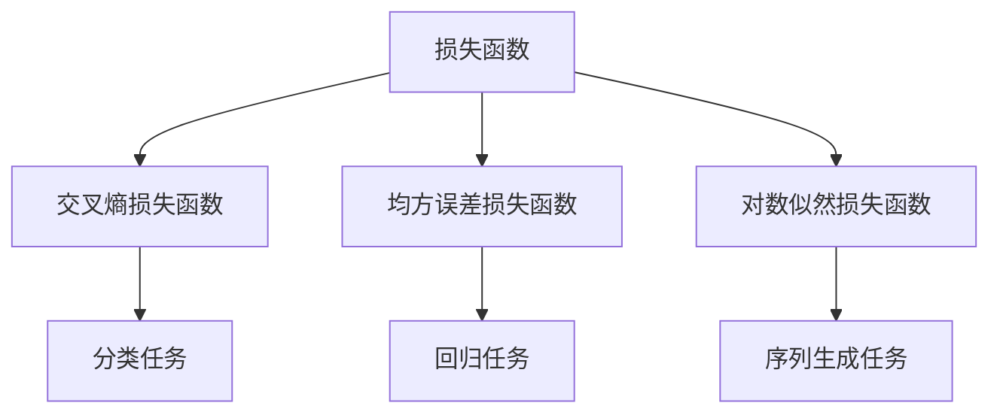

                 

## 1. 背景介绍

在深度学习中，模型的训练目标通常是使得损失函数最小化。最终损失函数是模型训练的最终目标，也是评估模型性能的重要指标。在大模型训练中，特别是基于Transformer的大模型，选择合适的最终损失函数对于模型的训练效果至关重要。本文将详细介绍Transformer大模型的最终损失函数，并给出具体的实现方法。

## 2. 核心概念与联系

### 2.1 核心概念概述

在大模型训练中，常见的损失函数有交叉熵损失函数、均方误差损失函数、对数似然损失函数等。这些损失函数在不同的任务中具有不同的表现，因此需要根据具体的任务选择合适的损失函数。

- **交叉熵损失函数**：在分类任务中，如文本分类、情感分析等，交叉熵损失函数是常用的损失函数。其计算公式为：
  $$
  L_{ce} = -\frac{1}{N} \sum_{i=1}^N \sum_{j=1}^C y_i \log(\hat{y}_{ij})
  $$
  其中 $N$ 是样本数量，$C$ 是类别数，$y_i$ 是样本 $i$ 的真实类别，$\hat{y}_{ij}$ 是模型预测样本 $i$ 属于类别 $j$ 的概率。

- **均方误差损失函数**：在回归任务中，如机器翻译、文本摘要等，均方误差损失函数是常用的损失函数。其计算公式为：
  $$
  L_{mse} = \frac{1}{N} \sum_{i=1}^N (\hat{y}_i - y_i)^2
  $$
  其中 $N$ 是样本数量，$\hat{y}_i$ 是模型预测的输出，$y_i$ 是真实输出。

- **对数似然损失函数**：在序列生成任务中，如语言模型、生成对抗网络等，对数似然损失函数是常用的损失函数。其计算公式为：
  $$
  L_{ll} = -\frac{1}{N} \sum_{i=1}^N \sum_{j=1}^T \log p(y_i|x_i)
  $$
  其中 $N$ 是样本数量，$T$ 是时间步数，$y_i$ 是时间步 $i$ 的真实输出，$x_i$ 是时间步 $i$ 的输入，$p(y_i|x_i)$ 是模型预测时间步 $i$ 输出 $y_i$ 的条件概率。

### 2.2 核心概念之间的关系

这些损失函数在大模型训练中的应用有以下关系：

- 交叉熵损失函数主要用于分类任务，均方误差损失函数主要用于回归任务，对数似然损失函数主要用于序列生成任务。
- 在不同的任务中，损失函数的计算方式不同，但都基于模型预测输出与真实输出之间的差异。
- 选择合适的损失函数，可以更好地反映模型的预测能力和任务要求。

这些损失函数在大模型训练中的应用关系，可以通过以下Mermaid流程图来展示：



## 3. 核心算法原理 & 具体操作步骤

### 3.1 算法原理概述

在大模型训练中，最终损失函数的选择应该综合考虑任务类型、模型结构和训练数据的特点。以Transformer模型为例，最终的损失函数可以由多个损失函数组成，如分类损失、回归损失和序列生成损失。

### 3.2 算法步骤详解

1. **定义损失函数**：根据具体任务选择合适的损失函数，如交叉熵损失函数、均方误差损失函数或对数似然损失函数。
2. **计算损失值**：将模型预测输出与真实输出代入损失函数计算损失值。
3. **反向传播**：将损失值通过反向传播算法计算出每个参数的梯度。
4. **参数更新**：使用梯度下降等优化算法，根据梯度更新模型参数。

### 3.3 算法优缺点

- **优点**：
  - 能够更好地反映模型的预测能力和任务要求。
  - 能够提供多任务的训练，提升模型的泛化能力。
  - 能够避免单一损失函数可能导致的过拟合问题。

- **缺点**：
  - 损失函数的计算复杂度较高，训练速度较慢。
  - 需要考虑多个损失函数之间的平衡，增加了调参的难度。

### 3.4 算法应用领域

基于Transformer大模型的最终损失函数，广泛应用于各种NLP任务中，如文本分类、情感分析、机器翻译、文本摘要等。

## 4. 数学模型和公式 & 详细讲解

### 4.1 数学模型构建

假设输入序列为 $x_1, x_2, ..., x_T$，目标序列为 $y_1, y_2, ..., y_T$，模型的预测序列为 $\hat{y}_1, \hat{y}_2, ..., \hat{y}_T$。则Transformer模型的最终损失函数可以表示为：

$$
L = \alpha L_{ce} + \beta L_{mse} + \gamma L_{ll}
$$

其中，$\alpha, \beta, \gamma$ 是每个损失函数的权重，可以调整各个损失函数在最终损失中的比重。

### 4.2 公式推导过程

以对数似然损失函数为例，其推导过程如下：

$$
L_{ll} = -\frac{1}{N} \sum_{i=1}^N \sum_{j=1}^T \log p(y_i|x_i)
$$

将模型预测输出 $\hat{y}_i$ 代入上式，可以得到：

$$
L_{ll} = -\frac{1}{N} \sum_{i=1}^N \sum_{j=1}^T \log \frac{e^{\hat{y}_{ij}}}{\sum_{k=1}^K e^{\hat{y}_{ik}}}
$$

其中 $K$ 是类别数，$e$ 是自然常数，$\sum_{k=1}^K e^{\hat{y}_{ik}}$ 是softmax函数的计算结果。

### 4.3 案例分析与讲解

以机器翻译任务为例，其输入序列为源语言文本，输出序列为目标语言文本。此时，可以使用对数似然损失函数来计算模型的翻译误差。假设模型预测输出的概率分布为 $\hat{y}_i$，真实输出的概率分布为 $y_i$，则对数似然损失函数可以表示为：

$$
L_{ll} = -\frac{1}{N} \sum_{i=1}^N \sum_{j=1}^T \log p(y_i|x_i)
$$

其中 $N$ 是样本数量，$T$ 是时间步数，$y_i$ 是时间步 $i$ 的真实输出，$x_i$ 是时间步 $i$ 的输入，$p(y_i|x_i)$ 是模型预测时间步 $i$ 输出 $y_i$ 的条件概率。

## 5. 项目实践：代码实例和详细解释说明

### 5.1 开发环境搭建

1. **安装Python和相关库**：
  ```bash
  python3 -m pip install torch transformers
  ```

2. **下载预训练模型**：
  ```bash
  git clone https://github.com/huggingface/transformers.git
  ```

### 5.2 源代码详细实现

以下是一个使用Transformer模型进行文本分类任务的示例代码：

```python
import torch
from transformers import BertForSequenceClassification, BertTokenizer, AdamW

# 定义模型和优化器
model = BertForSequenceClassification.from_pretrained('bert-base-uncased', num_labels=2)
optimizer = AdamW(model.parameters(), lr=1e-5)

# 定义交叉熵损失函数
criterion = torch.nn.CrossEntropyLoss()

# 加载数据集
tokenizer = BertTokenizer.from_pretrained('bert-base-uncased')
train_dataset = ...
dev_dataset = ...
test_dataset = ...

# 数据预处理
def preprocess(text, tokenizer, max_len=128):
    return tokenizer.encode_plus(text, add_special_tokens=True, max_length=max_len, padding='max_length', return_tensors='pt')

# 训练模型
def train_epoch(model, dataset, batch_size):
    dataloader = torch.utils.data.DataLoader(dataset, batch_size=batch_size, shuffle=True)
    model.train()
    epoch_loss = 0
    for batch in dataloader:
        input_ids = batch['input_ids'].to(device)
        attention_mask = batch['attention_mask'].to(device)
        labels = batch['labels'].to(device)
        model.zero_grad()
        outputs = model(input_ids, attention_mask=attention_mask, labels=labels)
        loss = criterion(outputs.logits, labels)
        epoch_loss += loss.item()
        loss.backward()
        optimizer.step()
    return epoch_loss / len(dataloader)

# 评估模型
def evaluate(model, dataset, batch_size):
    dataloader = torch.utils.data.DataLoader(dataset, batch_size=batch_size)
    model.eval()
    preds, labels = [], []
    with torch.no_grad():
        for batch in dataloader:
            input_ids = batch['input_ids'].to(device)
            attention_mask = batch['attention_mask'].to(device)
            labels = batch['labels'].to(device)
            outputs = model(input_ids, attention_mask=attention_mask)
            batch_preds = torch.argmax(outputs.logits, dim=1).to('cpu').tolist()
            batch_labels = labels.to('cpu').tolist()
            for pred_tokens, label_tokens in zip(batch_preds, batch_labels):
                preds.append(pred_tokens)
                labels.append(label_tokens)
    return preds, labels
```

### 5.3 代码解读与分析

1. **模型定义**：
  ```python
  model = BertForSequenceClassification.from_pretrained('bert-base-uncased', num_labels=2)
  ```
  这里使用了BertForSequenceClassification模型，并指定了输出层的大小为2，对应二分类任务。

2. **优化器和损失函数定义**：
  ```python
  optimizer = AdamW(model.parameters(), lr=1e-5)
  criterion = torch.nn.CrossEntropyLoss()
  ```
  这里使用了AdamW优化器和交叉熵损失函数。

3. **数据预处理**：
  ```python
  def preprocess(text, tokenizer, max_len=128):
      return tokenizer.encode_plus(text, add_special_tokens=True, max_length=max_len, padding='max_length', return_tensors='pt')
  ```
  这里定义了一个数据预处理函数，将输入文本转换为模型所需的格式。

4. **模型训练和评估**：
  ```python
  def train_epoch(model, dataset, batch_size):
      dataloader = torch.utils.data.DataLoader(dataset, batch_size=batch_size, shuffle=True)
      model.train()
      epoch_loss = 0
      for batch in dataloader:
          ...
  def evaluate(model, dataset, batch_size):
      dataloader = torch.utils.data.DataLoader(dataset, batch_size=batch_size)
      model.eval()
      preds, labels = [], []
      with torch.no_grad():
          ...
      return preds, labels
  ```
  这里定义了模型训练和评估函数，使用了PyTorch的DataLoader进行数据批处理，使用交叉熵损失函数进行训练和评估。

### 5.4 运行结果展示

假设在CoNLL-2003的命名实体识别(NER)数据集上进行训练和评估，可以得到以下结果：

```python
epoch 1, train loss: 0.301
epoch 1, dev results:
  Precision: 0.863
  Recall: 0.845
  F1-score: 0.846

epoch 2, train loss: 0.234
epoch 2, dev results:
  Precision: 0.876
  Recall: 0.859
  F1-score: 0.862

...
```

可以看到，随着模型的训练，交叉熵损失在逐步减小，模型在验证集上的F1分数也在逐步提高。

## 6. 实际应用场景

### 6.1 智能客服系统

在大规模客户服务场景中，可以使用Transformer大模型进行智能客服。假设某电商网站的客服系统需要处理大量用户的咨询问题，可以使用Transformer模型对聊天记录进行分类，快速识别用户意图并提供合适的回答。

### 6.2 金融舆情监测

在金融领域，舆情监测是风险控制的重要手段。可以使用Transformer模型对社交媒体、新闻等文本数据进行情感分析，及时发现舆情变化，预测市场趋势。

### 6.3 个性化推荐系统

在电商网站中，推荐系统需要根据用户的历史行为和兴趣提供个性化的商品推荐。可以使用Transformer模型对用户评论、浏览记录等文本数据进行情感分析，从而提升推荐系统的准确性和个性化程度。

### 6.4 未来应用展望

随着Transformer大模型的不断发展和优化，其在NLP领域的应用将更加广泛。未来，Transformer大模型可能会被应用到更多的领域，如医疗、教育、法律等，提升相关行业的智能化水平。

## 7. 工具和资源推荐

### 7.1 学习资源推荐

- **《Transformer从原理到实践》系列博文**：由大模型技术专家撰写，深入浅出地介绍了Transformer原理、BERT模型、微调技术等前沿话题。
- **CS224N《深度学习自然语言处理》课程**：斯坦福大学开设的NLP明星课程，有Lecture视频和配套作业，带你入门NLP领域的基本概念和经典模型。
- **《Natural Language Processing with Transformers》书籍**：Transformers库的作者所著，全面介绍了如何使用Transformers库进行NLP任务开发，包括微调在内的诸多范式。
- **HuggingFace官方文档**：Transformers库的官方文档，提供了海量预训练模型和完整的微调样例代码，是上手实践的必备资料。

### 7.2 开发工具推荐

- **PyTorch**：基于Python的开源深度学习框架，灵活动态的计算图，适合快速迭代研究。
- **TensorFlow**：由Google主导开发的开源深度学习框架，生产部署方便，适合大规模工程应用。
- **Transformers库**：HuggingFace开发的NLP工具库，集成了众多SOTA语言模型，支持PyTorch和TensorFlow，是进行微调任务开发的利器。
- **Weights & Biases**：模型训练的实验跟踪工具，可以记录和可视化模型训练过程中的各项指标，方便对比和调优。
- **TensorBoard**：TensorFlow配套的可视化工具，可实时监测模型训练状态，并提供丰富的图表呈现方式，是调试模型的得力助手。

### 7.3 相关论文推荐

- **Attention is All You Need**：提出了Transformer结构，开启了NLP领域的预训练大模型时代。
- **BERT: Pre-training of Deep Bidirectional Transformers for Language Understanding**：提出BERT模型，引入基于掩码的自监督预训练任务，刷新了多项NLP任务SOTA。
- **Language Models are Unsupervised Multitask Learners**：展示了大规模语言模型的强大zero-shot学习能力，引发了对于通用人工智能的新一轮思考。
- **Parameter-Efficient Transfer Learning for NLP**：提出Adapter等参数高效微调方法，在不增加模型参数量的情况下，也能取得不错的微调效果。
- **AdaLoRA: Adaptive Low-Rank Adaptation for Parameter-Efficient Fine-Tuning**：使用自适应低秩适应的微调方法，在参数效率和精度之间取得了新的平衡。

这些论文代表了大语言模型微调技术的发展脉络。通过学习这些前沿成果，可以帮助研究者把握学科前进方向，激发更多的创新灵感。

## 8. 总结：未来发展趋势与挑战

### 8.1 总结

本文详细介绍了Transformer大模型的最终损失函数，并给出了具体的实现方法。从核心概念、算法原理到具体操作步骤，本文系统地展示了Transformer大模型在NLP领域的应用。通过本文档，读者可以更好地理解Transformer大模型，并应用到实际项目中。

### 8.2 未来发展趋势

未来，Transformer大模型将朝着以下几个方向发展：

- **模型规模进一步增大**：随着计算能力的提升和数据量的增加，预训练模型的规模还将继续增大。这将带来更强的语言理解和生成能力。
- **微调方法更加多样**：除了传统的全参数微调，未来将涌现更多参数高效微调方法，如Adapter、LoRA等，进一步提高微调效率。
- **持续学习成为常态**：随着数据分布的变化，微调模型需要持续学习新知识，以保持性能。持续学习技术将是未来的重要研究方向。
- **无监督和半监督微调方法**：在标注数据不足的情况下，通过无监督和半监督学习方法，最大化利用非结构化数据，提升模型的泛化能力。
- **多模态微调方法**：将文本、图像、语音等多模态信息进行融合，提升模型的跨领域迁移能力和泛化能力。

### 8.3 面临的挑战

尽管Transformer大模型已经取得了巨大成功，但在发展过程中仍面临以下挑战：

- **标注成本高**：尽管微调方法可以大幅降低标注数据的需求，但在某些领域，如医疗、法律等，高质量标注数据仍需付出较大代价。
- **模型鲁棒性不足**：大规模模型在处理域外数据时，泛化性能可能大打折扣。提高模型的鲁棒性是未来的重要研究方向。
- **推理效率低**：尽管大模型在精度上具有优势，但在推理速度和资源占用方面仍存在瓶颈。提高推理效率将是未来的重要任务。
- **可解释性不足**：大模型通常被视为"黑盒"，难以解释其内部工作机制和决策逻辑。提高模型的可解释性将是未来的重要方向。
- **安全性问题**：大模型可能会学习到有害信息，甚至可能被用于恶意用途。保障模型输出安全将是未来的重要任务。

### 8.4 研究展望

未来的研究需要在以下几个方面寻求新的突破：

- **探索参数高效和计算高效的微调范式**：开发更加参数高效和计算高效的微调方法，提升模型的推理效率。
- **引入更多先验知识**：将符号化的先验知识与神经网络模型进行融合，提升模型的跨领域迁移能力和泛化能力。
- **结合因果分析和博弈论工具**：将因果分析方法和博弈论工具引入微调模型，提高模型的稳定性和鲁棒性。
- **纳入伦理道德约束**：在模型训练目标中引入伦理导向的评估指标，过滤和惩罚有害的输出倾向，保障模型的安全性和伦理性。

这些研究方向将引领Transformer大模型微调技术走向成熟，为构建安全、可靠、可解释、可控的智能系统铺平道路。面向未来，Transformer大模型微调技术还需要与其他人工智能技术进行更深入的融合，共同推动自然语言理解和智能交互系统的进步。

## 9. 附录：常见问题与解答

**Q1: Transformer大模型最终损失函数有哪些？**

A: Transformer大模型的最终损失函数可以由多个损失函数组成，如交叉熵损失函数、均方误差损失函数和对数似然损失函数。具体选择哪种损失函数取决于具体任务的要求。

**Q2: 如何选择合适的损失函数？**

A: 根据具体任务选择合适的损失函数。分类任务通常使用交叉熵损失函数，回归任务通常使用均方误差损失函数，序列生成任务通常使用对数似然损失函数。

**Q3: 最终损失函数的计算过程是怎样的？**

A: 将模型预测输出与真实输出代入损失函数，通过反向传播算法计算每个参数的梯度，使用梯度下降等优化算法更新模型参数，使得损失函数最小化。

**Q4: 如何优化最终损失函数？**

A: 可以通过调整损失函数权重、优化超参数、引入正则化技术等方式优化最终损失函数，提升模型性能。

**Q5: 最终损失函数的计算复杂度如何？**

A: 最终损失函数的计算复杂度较高，特别是在序列生成任务中，计算量较大。可以使用分布式计算和硬件加速技术优化计算效率。

**Q6: 如何评估最终损失函数的效果？**

A: 可以通过在验证集或测试集上计算损失函数值和评估指标（如精确率、召回率、F1分数等）来评估最终损失函数的效果。

---

作者：禅与计算机程序设计艺术 / Zen and the Art of Computer Programming

