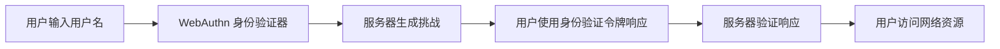

                 

# WebAuthn 的优势

> 关键词：WebAuthn, 双因素身份验证, 身份认证, 用户友好, 安全

## 1. 背景介绍

在数字化时代，身份验证是用户获得网络资源访问权限的首要步骤。传统身份验证方式依赖于用户名和密码，但这种方式存在很多安全隐患。随着网络安全需求的日益提升，越来越多的用户和企业开始寻求更安全、更便捷的身份认证方式。WebAuthn（Web 身份验证）技术应运而生，为互联网提供了更强大的身份认证解决方案。

WebAuthn 旨在提供一种标准化的身份验证方式，使得用户在访问各种网络资源时，只需通过单个身份验证令牌（如智能卡、移动设备、生物识别等）进行一次身份验证，即可在多个网站上重复使用，避免了繁琐的用户名和密码输入。

## 2. 核心概念与联系

### 2.1 核心概念概述

WebAuthn 的核心概念包括身份验证器（Authenticator）、注册（Registration）、认证（Authentication）和挑战响应（Challenge-Response）等。

- **身份验证器（Authenticator）**：用于存储用户身份验证令牌（如智能卡、移动设备、生物识别）。
- **注册（Registration）**：用户在服务器端注册身份验证令牌，以便在后续访问时使用。
- **认证（Authentication）**：用户使用身份验证令牌进行身份验证，访问网络资源。
- **挑战响应（Challenge-Response）**：服务器生成一个随机挑战，用户使用其身份验证令牌进行响应，完成身份验证。

这些概念之间存在着密切的联系，构成了WebAuthn身份验证的完整流程。以下是一个简化的WebAuthn身份验证流程图：



### 2.2 概念间的关系

WebAuthn 身份验证技术通过结合身份验证器、注册、认证和挑战响应等概念，实现了一种高效、安全的身份认证方式。具体来说：

- **身份验证器**：作为存储用户身份验证令牌的工具，是 WebAuthn 身份验证的基础。
- **注册**：在服务器端注册身份验证令牌，使得用户在后续访问时能够快速验证身份。
- **认证**：通过挑战响应机制，用户使用其身份验证令牌进行身份验证，完成对网络资源的访问。
- **挑战响应**：通过挑战和响应的方式，保障了身份验证的安全性，防止第三方攻击。

这些概念相互协作，构成了一个完整且安全的身份验证系统。

## 3. WebAuthn 的核心算法原理 & 具体操作步骤

### 3.1 算法原理概述

WebAuthn 的算法原理主要包括用户注册、挑战响应和认证等三个步骤。以下是对这些步骤的详细解释：

1. **用户注册**：用户使用身份验证器向服务器注册身份验证令牌，服务器生成一个注册凭据，并将注册信息存储在服务器端。
2. **挑战响应**：用户使用身份验证器生成挑战响应，服务器验证该响应，确认用户身份。
3. **认证**：用户在访问网络资源时，使用身份验证器进行身份验证，完成对资源的访问。

### 3.2 算法步骤详解

以下是 WebAuthn 身份验证的详细操作步骤：

**步骤1：用户注册**
- 用户打开网页，输入用户名。
- 网页向服务器发送注册请求，包括用户名和身份验证器的信息。
- 服务器生成注册凭据（Registration ID 和 Public Key），并存储在服务器端。

**步骤2：挑战响应**
- 用户输入用户名，网页向服务器发送认证请求。
- 服务器生成一个随机挑战（Challenge），并发送给用户。
- 用户使用身份验证器生成响应（Signature），并将响应发送回服务器。
- 服务器验证该响应，确认用户身份。

**步骤3：认证**
- 用户使用身份验证器生成响应，服务器验证该响应，确认用户身份。
- 用户访问网络资源，完成对资源的访问。

### 3.3 算法优缺点

WebAuthn 具有以下优点：

- **双因素身份验证**：结合了密码和身份验证器两种身份验证方式，提高了身份验证的安全性。
- **用户友好**：只需要使用一次身份验证，即可在多个网站上重复使用，提高了用户的使用体验。
- **标准化**：基于 WebAuthn 标准，不同平台和设备之间的兼容性更好。

但 WebAuthn 也存在以下缺点：

- **依赖硬件**：身份验证器需要支持硬件设备（如智能卡、移动设备），部分用户可能无法使用。
- **复杂性**：技术实现较为复杂，需要考虑兼容性、安全性等多方面因素。

### 3.4 算法应用领域

WebAuthn 技术已经广泛应用于以下领域：

- **金融领域**：银行、支付平台等使用 WebAuthn 进行身份验证，提高金融交易的安全性。
- **电子商务**：电商平台使用 WebAuthn 进行用户注册和身份验证，保障用户账户的安全。
- **在线服务**：社交媒体、云服务提供商等使用 WebAuthn 进行用户身份验证，提高服务安全性。
- **政府服务**：政府网站使用 WebAuthn 进行公民身份验证，提高政府服务的可信赖度。

## 4. 数学模型和公式 & 详细讲解 & 举例说明

### 4.1 数学模型构建

WebAuthn 的数学模型包括公钥加密和挑战响应等几个关键部分。以下是对这些数学模型的详细解释：

**公钥加密模型**

公钥加密模型基于 RSA 加密算法，用于生成和验证用户身份验证令牌。

- **密钥生成**：用户身份验证器生成一对公钥和私钥，将公钥发送给服务器。
- **注册请求**：用户将公钥、私钥等信息发送给服务器。
- **服务器存储**：服务器存储用户公钥和注册凭据。

**挑战响应模型**

挑战响应模型基于数字签名算法，用于验证用户身份。

- **挑战生成**：服务器生成一个随机挑战，发送给用户。
- **用户响应**：用户使用身份验证器生成响应，包括挑战值和私钥。
- **服务器验证**：服务器使用用户公钥验证响应，确认用户身份。

### 4.2 公式推导过程

以下是对 WebAuthn 核心算法公式的详细推导：

**公钥加密公式**

设用户身份验证器生成了一对公钥和私钥，分别为 $(pub_{user}, priv_{user})$。

- **密钥生成公式**：
  $$
  (pub_{user}, priv_{user}) = (RSA(pub_{auth}), RSA^{-1}(priv_{auth}))
  $$
  其中 $RSA$ 为 RSA 加密算法，$RSA^{-1}$ 为 RSA 解密算法，$pub_{auth}$ 为身份验证器公钥，$priv_{auth}$ 为身份验证器私钥。

- **注册请求公式**：
  $$
  req = \{ pub_{user}, priv_{user} \}
  $$
  其中 $req$ 为注册请求。

**挑战响应公式**

设服务器生成一个随机挑战 $challenge$，用户使用身份验证器生成响应 $response$。

- **挑战生成公式**：
  $$
  challenge = RNG()
  $$
  其中 $RNG$ 为随机数生成函数。

- **用户响应公式**：
  $$
  response = \{ pub_{user}, challenge, priv_{user} \}
  $$
  其中 $response$ 为用户响应，$priv_{user}$ 为用户私钥。

- **服务器验证公式**：
  $$
  \begin{aligned}
  &\text{验证} \{ pub_{user}, challenge, sig \} \\
  &\text{其中} \\
  &sig = RSA^{-1}(priv_{user}, pub_{auth}, challenge)
  \end{aligned}
  $$
  其中 $sig$ 为数字签名，$pub_{auth}$ 为身份验证器公钥，$RSA^{-1}$ 为 RSA 解密算法。

### 4.3 案例分析与讲解

以下是一个具体的 WebAuthn 身份验证案例：

**场景**：用户 A 注册了 WebAuthn 身份验证器，用于访问银行账户。

**注册步骤**：
1. 用户 A 在银行网站上输入用户名和密码，并选择一个身份验证器。
2. 银行网站向身份验证器发送注册请求，包括用户名和挑战。
3. 身份验证器生成公钥和私钥，将公钥发送给银行网站。
4. 银行网站生成注册凭据，并将公钥和注册信息存储在服务器端。

**认证步骤**：
1. 用户 A 再次访问银行网站，输入用户名和密码。
2. 银行网站生成随机挑战，并向用户发送挑战。
3. 用户 A 使用身份验证器生成响应，将响应发送给银行网站。
4. 银行网站使用用户 A 的公钥验证响应，确认其身份。
5. 用户 A 访问银行账户，完成身份验证。

## 5. 项目实践：代码实例和详细解释说明

### 5.1 开发环境搭建

为了实现 WebAuthn 身份验证，需要以下开发环境：

1. **Node.js**：使用 Node.js 进行后端服务器开发。
2. **FIDO2 WebAuthn API**：支持 WebAuthn 标准的浏览器或移动设备。
3. **FIDO2 Credential API**：用于处理身份验证器的请求和响应。

### 5.2 源代码详细实现

以下是一个简单的 WebAuthn 身份验证代码实现：

```javascript
const { WebAuthn } = require('webauthn');

const server = new WebAuthn.Server({
  credentialStorage: new Map(),
  logger: (msg) => console.log(msg)
});

server.on('getCredentials', async (request) => {
  const cred = await server.getCredential(request);
  return cred;
});

server.on('register', async (request) => {
  const cred = await server.register(request);
  return cred;
});

server.on('authenticate', async (request) => {
  const cred = await server.authenticate(request);
  return cred;
});

server.listen(8080);
```

**代码解读与分析**

- **WebAuthn 模块**：使用 WebAuthn 模块进行身份验证器的处理。
- **FIDO2 WebAuthn API**：使用 FIDO2 WebAuthn API 进行浏览器端的身份验证。
- **FIDO2 Credential API**：使用 FIDO2 Credential API 进行身份验证器的注册和认证。

### 5.3 运行结果展示

在开发环境搭建完成后，可以通过浏览器或移动设备进行身份验证。以下是一个简单的身份验证流程：

**步骤1：注册身份验证器**
- 用户打开银行网站，输入用户名和密码。
- 网站向身份验证器发送注册请求，包括用户名和挑战。
- 用户选择身份验证器，生成公钥和私钥，将公钥发送给网站。
- 网站生成注册凭据，并将公钥和注册信息存储在服务器端。

**步骤2：进行身份验证**
- 用户再次访问银行网站，输入用户名和密码。
- 网站生成随机挑战，并向用户发送挑战。
- 用户选择身份验证器，生成响应，将响应发送给网站。
- 网站使用用户私钥验证响应，确认其身份。
- 用户访问银行账户，完成身份验证。

## 6. 实际应用场景

WebAuthn 技术已经广泛应用于以下领域：

### 6.1 金融领域

**场景**：用户登录银行账户，进行交易操作。

**流程**：用户使用 WebAuthn 身份验证器进行身份验证，验证通过后，用户可以访问银行账户，进行交易操作。

### 6.2 电子商务

**场景**：用户登录电商平台，购买商品。

**流程**：用户使用 WebAuthn 身份验证器进行身份验证，验证通过后，用户可以访问电商平台，进行购物操作。

### 6.3 在线服务

**场景**：用户登录社交媒体，进行信息发布。

**流程**：用户使用 WebAuthn 身份验证器进行身份验证，验证通过后，用户可以访问社交媒体，进行信息发布。

### 6.4 政府服务

**场景**：用户登录政府网站，进行服务申请。

**流程**：用户使用 WebAuthn 身份验证器进行身份验证，验证通过后，用户可以访问政府网站，进行服务申请。

## 7. 工具和资源推荐

### 7.1 学习资源推荐

为了掌握 WebAuthn 技术，可以参考以下学习资源：

1. **WebAuthn 官方文档**：WebAuthn 官方文档提供了完整的技术规范和实现示例。
2. **FIDO Alliance 文档**：FIDO Alliance 提供了 WebAuthn 技术标准的详细文档。
3. **FIDO2 实战指南**：FIDO2 实战指南提供了 WebAuthn 技术的实现案例和最佳实践。
4. **WebAuthn 教程**：WebAuthn 教程提供了 WebAuthn 技术的详细讲解和代码示例。

### 7.2 开发工具推荐

为了实现 WebAuthn 身份验证，可以使用以下开发工具：

1. **Node.js**：使用 Node.js 进行后端服务器开发。
2. **FIDO2 WebAuthn API**：支持 WebAuthn 标准的浏览器或移动设备。
3. **FIDO2 Credential API**：用于处理身份验证器的请求和响应。

### 7.3 相关论文推荐

以下几篇相关论文值得推荐：

1. **WebAuthn 标准文档**：WebAuthn 标准文档详细介绍了 WebAuthn 技术的规范和实现方法。
2. **FIDO2 标准文档**：FIDO2 标准文档介绍了 FIDO2 技术的规范和实现方法。
3. **WebAuthn 安全分析**：WebAuthn 安全分析文章分析了 WebAuthn 技术的安全性。
4. **FIDO2 安全性研究**：FIDO2 安全性研究文章分析了 FIDO2 技术的安全性。

## 8. 总结：未来发展趋势与挑战

### 8.1 研究成果总结

WebAuthn 技术已经成为互联网身份验证的主流解决方案。通过结合公钥加密和挑战响应等技术，WebAuthn 实现了高效、安全的身份验证方式。WebAuthn 技术已经被广泛应用于金融、电子商务、在线服务等多个领域。

### 8.2 未来发展趋势

WebAuthn 技术在未来将继续发展，其趋势如下：

1. **标准化普及**：WebAuthn 技术将逐步成为互联网身份验证的主流标准，得到广泛应用。
2. **多平台支持**：WebAuthn 技术将支持更多的平台和设备，提高其普及率。
3. **安全性增强**：WebAuthn 技术将不断提升安全性，防止身份验证漏洞。
4. **用户体验优化**：WebAuthn 技术将不断优化用户体验，提高用户满意度。

### 8.3 面临的挑战

WebAuthn 技术在推广应用的过程中，还面临以下挑战：

1. **兼容性问题**：不同平台和设备的兼容性问题需要进一步解决。
2. **安全性问题**：WebAuthn 技术的安全性问题需要进一步研究。
3. **用户接受度**：用户对 WebAuthn 技术的接受度需要进一步提高。

### 8.4 研究展望

未来的研究可以从以下几个方面展开：

1. **标准化推进**：进一步推进 WebAuthn 技术的标准化进程，提高其普及率。
2. **安全性提升**：提升 WebAuthn 技术的安全性，防止身份验证漏洞。
3. **用户体验优化**：优化 WebAuthn 技术的使用体验，提高用户满意度。
4. **新应用场景**：探索 WebAuthn 技术的新应用场景，推动其发展。

## 9. 附录：常见问题与解答

**Q1：WebAuthn 是否支持多因素身份验证？**

A：WebAuthn 支持多因素身份验证，结合密码和身份验证器进行身份验证，提高了身份验证的安全性。

**Q2：WebAuthn 是否依赖硬件设备？**

A：WebAuthn 依赖硬件设备，如智能卡、移动设备等。部分用户可能无法使用，需要开发者进行兼容性处理。

**Q3：WebAuthn 的认证流程是否复杂？**

A：WebAuthn 的认证流程相对复杂，需要考虑兼容性和安全性等多方面因素。开发者需要仔细设计认证流程，确保其稳定性和安全性。

**Q4：WebAuthn 是否支持跨平台认证？**

A：WebAuthn 支持跨平台认证，不同平台和设备之间的兼容性较好。开发者需要根据具体平台进行开发和测试。

**Q5：WebAuthn 的性能如何？**

A：WebAuthn 的性能较好，能够在保证安全性的前提下，提供快速、便捷的身份验证方式。开发者需要根据具体需求进行优化和调参。

作者：禅与计算机程序设计艺术 / Zen and the Art of Computer Programming

