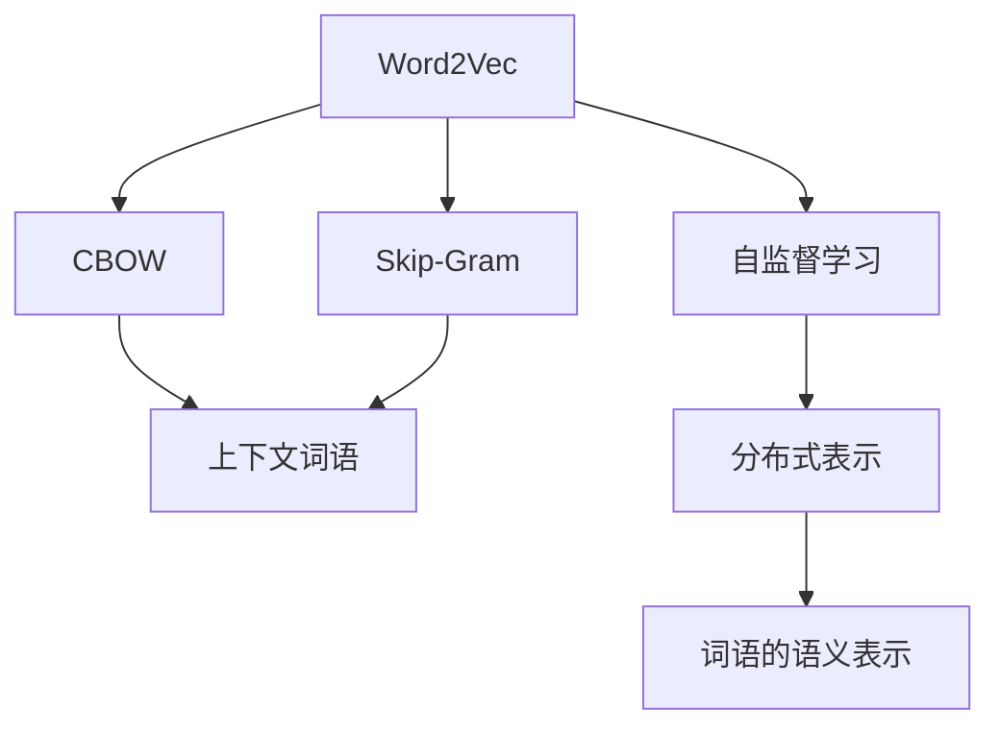
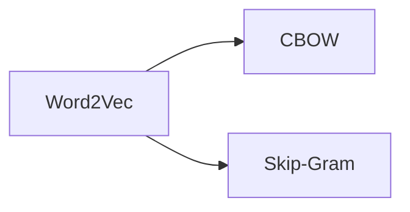
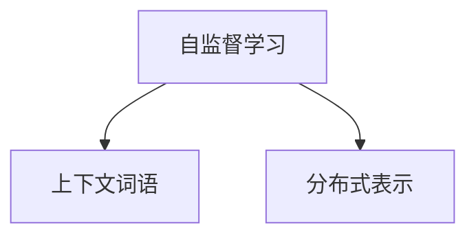
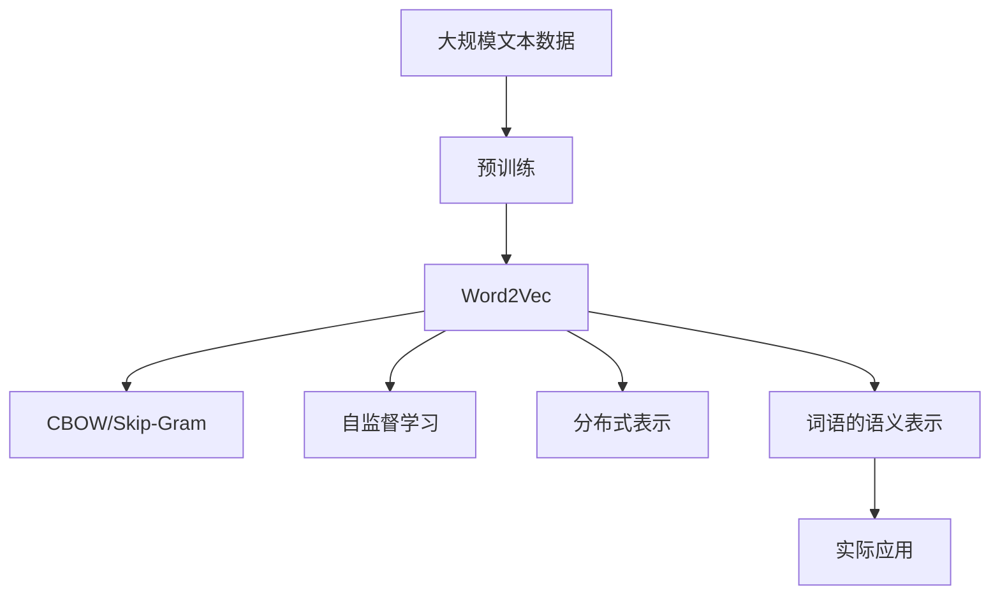

                 

# Word2Vec：CBOW模型和Skip-Gram模型

## 1. 背景介绍

### 1.1 问题由来
随着深度学习技术在自然语言处理（NLP）领域的广泛应用，如何有效地表示自然语言文本成为了研究的热点。传统的文本表示方法，如词袋模型（Bag of Words, BoW），将文本视为词的集合，无法捕捉词语之间的语义关系。而基于统计的语言模型（如n-gram模型）则能更好地捕捉词语的顺序关系，但仍然无法表示词语的语义含义。

为了解决这一问题，Word2Vec应运而生。Word2Vec是由Google在2013年提出的基于深度学习的词嵌入模型，能够将词语映射到高维空间中，使得词语之间的相似度可以通过它们在高维空间中的距离来表示。Word2Vec模型包括两种常用的架构：CBOW（Continuous Bag-of-Words）和Skip-Gram（Skip-gram）。本文将详细探讨这两种模型的原理和实现细节，以及它们的应用场景和优缺点。

### 1.2 问题核心关键点
Word2Vec模型的核心思想是通过自监督学习，将词语映射到高维空间中。CBOW模型和Skip-Gram模型是Word2Vec模型的两种重要架构，它们分别通过不同的方式，将上下文词语映射到目标词语的高维空间中，从而实现词语的语义表示。

CBOW模型的核心思想是通过目标词语周围的上下文词语来预测目标词语，通过这种预测方式来学习词语的分布式表示。Skip-Gram模型则是通过目标词语来预测上下文词语，学习词语之间的概率关系。这两种模型在实现方式上有所不同，但在目标上都是一致的：通过上下文关系学习词语的语义表示。

## 2. 核心概念与联系

### 2.1 核心概念概述

#### 2.1.1 Word2Vec
Word2Vec是一种基于深度学习的词嵌入模型，通过自监督学习的方式，将词语映射到高维空间中，使得词语之间的相似度可以通过它们在高维空间中的距离来表示。Word2Vec模型的目标是通过上下文关系学习词语的语义表示，从而能够更好地处理自然语言文本。

#### 2.1.2 CBOW模型
CBOW模型是Word2Vec模型的一种架构，通过目标词语周围的上下文词语来预测目标词语。CBOW模型的核心思想是将目标词语替换为上下文词语，从而在预测过程中利用目标词语周围的信息。

#### 2.1.3 Skip-Gram模型
Skip-Gram模型是Word2Vec模型的另一种架构，通过目标词语来预测上下文词语。Skip-Gram模型的核心思想是通过目标词语周围的上下文词语来预测目标词语，从而在预测过程中利用上下文词语的信息。

#### 2.1.4 自监督学习
自监督学习是指在没有标注数据的情况下，通过利用数据的内在结构进行学习。Word2Vec模型就是通过自监督学习的方式，利用词语之间的上下文关系来学习词语的分布式表示。

#### 2.1.5 分布式表示
分布式表示是指将词语映射到高维空间中，使得词语的语义可以通过它们在高维空间中的位置来表示。Word2Vec模型通过自监督学习的方式，学习词语的分布式表示，使得词语之间的相似度可以通过它们在高维空间中的距离来表示。

这些核心概念之间的逻辑关系可以通过以下Mermaid流程图来展示：



这个流程图展示了Word2Vec模型的核心概念及其之间的关系：

1. Word2Vec模型通过自监督学习的方式，学习词语的分布式表示。
2. CBOW模型和Skip-Gram模型是Word2Vec模型的两种架构，它们分别通过不同的方式，将上下文词语映射到目标词语的高维空间中，从而实现词语的语义表示。
3. 自监督学习利用词语之间的上下文关系，学习词语的分布式表示。
4. 分布式表示将词语映射到高维空间中，使得词语的语义可以通过它们在高维空间中的位置来表示。

这些概念共同构成了Word2Vec模型的基本框架，使得词语之间的语义关系能够通过它们在高维空间中的距离来表示。

### 2.2 概念间的关系

这些核心概念之间存在着紧密的联系，形成了Word2Vec模型的完整生态系统。下面我们通过几个Mermaid流程图来展示这些概念之间的关系。

#### 2.2.1 Word2Vec与CBOW/Skip-Gram的关系



这个流程图展示了Word2Vec模型与CBOW模型和Skip-Gram模型之间的关系。CBOW模型和Skip-Gram模型是Word2Vec模型的两种架构，它们分别通过不同的方式，将上下文词语映射到目标词语的高维空间中，从而实现词语的语义表示。

#### 2.2.2 自监督学习与分布式表示的关系



这个流程图展示了自监督学习与分布式表示之间的关系。自监督学习利用词语之间的上下文关系，学习词语的分布式表示，从而实现词语的语义表示。

#### 2.2.3 分布式表示与词语语义表示的关系


这个流程图展示了分布式表示与词语语义表示之间的关系。分布式表示将词语映射到高维空间中，使得词语的语义可以通过它们在高维空间中的位置来表示。

### 2.3 核心概念的整体架构

最后，我们用一个综合的流程图来展示这些核心概念在Word2Vec模型中的整体架构：



这个综合流程图展示了从预训练到实际应用的整体过程。大规模文本数据首先进行预训练，然后通过Word2Vec模型学习词语的分布式表示，再通过CBOW模型或Skip-Gram模型学习词语的语义表示，最后应用于实际的应用场景中。通过这些流程图，我们可以更清晰地理解Word2Vec模型的学习和应用框架，为后续深入讨论具体的模型实现和优化方法奠定基础。

## 3. 核心算法原理 & 具体操作步骤

### 3.1 算法原理概述

Word2Vec模型通过自监督学习的方式，将词语映射到高维空间中，使得词语之间的相似度可以通过它们在高维空间中的距离来表示。CBOW模型和Skip-Gram模型是Word2Vec模型的两种重要架构，它们分别通过不同的方式，将上下文词语映射到目标词语的高维空间中，从而实现词语的语义表示。

CBOW模型的核心思想是通过目标词语周围的上下文词语来预测目标词语，通过这种预测方式来学习词语的分布式表示。Skip-Gram模型则是通过目标词语来预测上下文词语，学习词语之间的概率关系。这两种模型在实现方式上有所不同，但在目标上都是一致的：通过上下文关系学习词语的语义表示。

### 3.2 算法步骤详解

CBOW模型和Skip-Gram模型的算法步骤基本相同，以下是这两种模型的详细步骤：

#### 3.2.1 数据预处理

Word2Vec模型的第一步是数据预处理。预处理过程包括分词、去除停用词、建立词汇表等。在预处理完成后，可以将文本转换为数字序列，方便模型处理。

#### 3.2.2 模型训练

模型训练是Word2Vec模型的核心步骤。CBOW模型和Skip-Gram模型都采用基于反向传播的神经网络进行训练。模型的输入是上下文词语，输出是目标词语。模型的目标是通过上下文词语来预测目标词语，从而学习词语的分布式表示。

##### 3.2.2.1 CBOW模型训练步骤

CBOW模型的训练步骤如下：

1. 初始化模型参数。
2. 遍历训练数据集，对于每个词语，随机选取其周围的上下文词语。
3. 使用神经网络计算上下文词语的表示，将其与目标词语的表示相加，作为预测目标词语的输入。
4. 计算预测结果与真实目标之间的交叉熵损失，并反向传播更新模型参数。
5. 重复步骤2-4，直至收敛。

##### 3.2.2.2 Skip-Gram模型训练步骤

Skip-Gram模型的训练步骤如下：

1. 初始化模型参数。
2. 遍历训练数据集，对于每个词语，随机选取其周围的上下文词语。
3. 使用神经网络计算上下文词语的表示，将其作为预测目标词语的输入。
4. 计算预测结果与真实目标之间的交叉熵损失，并反向传播更新模型参数。
5. 重复步骤2-4，直至收敛。

#### 3.2.3 模型评估

在模型训练完成后，需要对模型进行评估。常用的评估指标包括准确率、召回率、F1分数等。可以通过测试集上的评估结果，来判断模型的性能。

### 3.3 算法优缺点

#### 3.3.1 CBOW模型的优缺点

CBOW模型的优点在于：

1. 数据利用率高。CBOW模型通过目标词语周围的上下文词语来预测目标词语，可以充分利用数据中的上下文信息。
2. 计算效率高。CBOW模型只需要计算一次上下文词语的表示，就可以预测多个目标词语，因此计算效率较高。

CBOW模型的缺点在于：

1. 不能直接处理目标词语。CBOW模型需要从上下文词语中预测目标词语，因此不能直接处理目标词语。
2. 无法学习到目标词语的上下文关系。CBOW模型只利用了上下文词语的信息，无法学习到目标词语的上下文关系。

#### 3.3.2 Skip-Gram模型的优缺点

Skip-Gram模型的优点在于：

1. 能够直接处理目标词语。Skip-Gram模型通过目标词语来预测上下文词语，可以处理目标词语。
2. 能够学习到目标词语的上下文关系。Skip-Gram模型可以利用上下文词语的信息，学习到目标词语的上下文关系。

Skip-Gram模型的缺点在于：

1. 数据利用率低。Skip-Gram模型需要预测上下文词语，因此对于每个目标词语，需要计算多次上下文词语的表示。
2. 计算效率低。Skip-Gram模型需要计算多次上下文词语的表示，因此计算效率较低。

### 3.4 算法应用领域

Word2Vec模型广泛应用于自然语言处理领域，包括文本分类、情感分析、机器翻译、问答系统等。以下是Word2Vec模型在实际应用中的一些典型场景：

1. 文本分类：将文本转换为词语的向量表示，并利用这些向量进行文本分类。
2. 情感分析：将文本转换为词语的向量表示，并利用这些向量进行情感分类。
3. 机器翻译：将源语言文本转换为词语的向量表示，并利用这些向量进行翻译。
4. 问答系统：将问题转换为词语的向量表示，并利用这些向量进行答案生成。
5. 信息检索：将查询转换为词语的向量表示，并利用这些向量进行信息检索。

## 4. 数学模型和公式 & 详细讲解 & 举例说明

### 4.1 数学模型构建

#### 4.1.1 CBOW模型的数学模型

CBOW模型的数学模型如下：

$$
\hat{y} = \text{softmax}(W_{VOC} h_{CBOW} + b_{VOC})
$$

其中，$W_{VOC}$是输出层的权重矩阵，$h_{CBOW}$是上下文词语的表示，$b_{VOC}$是输出层的偏置向量，$y$是目标词语的one-hot向量，$\text{softmax}$函数将输出转换为概率分布。

#### 4.1.2 Skip-Gram模型的数学模型

Skip-Gram模型的数学模型如下：

$$
\hat{y} = \text{softmax}(W_{VOC} h_{Skip-Gram} + b_{VOC})
$$

其中，$W_{VOC}$是输出层的权重矩阵，$h_{Skip-Gram}$是上下文词语的表示，$b_{VOC}$是输出层的偏置向量，$y$是目标词语的one-hot向量，$\text{softmax}$函数将输出转换为概率分布。

### 4.2 公式推导过程

#### 4.2.1 CBOW模型的公式推导

CBOW模型的目标是通过上下文词语来预测目标词语，从而学习词语的分布式表示。设目标词语为$w_t$，其上下文词语为$w_{t-2}, w_{t-1}, w_{t+1}, w_{t+2}$。假设上下文词语的表示为$h_{w_{t-2}}, h_{w_{t-1}}, h_{w_{t+1}}, h_{w_{t+2}}$。则CBOW模型的预测公式为：

$$
\hat{y_t} = \text{softmax}(W_{VOC} h_{CBOW} + b_{VOC})
$$

其中，$h_{CBOW}$是上下文词语的表示，$W_{VOC}$是输出层的权重矩阵，$b_{VOC}$是输出层的偏置向量，$y_t$是目标词语的one-hot向量。

CBOW模型的损失函数为：

$$
\mathcal{L} = -\frac{1}{N} \sum_{t=1}^{N} \sum_{i=1}^{4} y_{w_t} \log \hat{y}_{w_t}
$$

其中，$N$是训练数据集的大小，$y_{w_t}$是目标词语的one-hot向量，$\hat{y}_{w_t}$是目标词语的预测概率分布。

#### 4.2.2 Skip-Gram模型的公式推导

Skip-Gram模型的目标是通过目标词语来预测上下文词语，从而学习词语之间的概率关系。设目标词语为$w_t$，其上下文词语为$w_{t-2}, w_{t-1}, w_{t+1}, w_{t+2}$。假设上下文词语的表示为$h_{w_{t-2}}, h_{w_{t-1}}, h_{w_{t+1}}, h_{w_{t+2}}$。则Skip-Gram模型的预测公式为：

$$
\hat{y_{t-2}}, \hat{y_{t-1}}, \hat{y_{t+1}}, \hat{y_{t+2}} = \text{softmax}(W_{VOC} h_{Skip-Gram} + b_{VOC})
$$

其中，$h_{Skip-Gram}$是上下文词语的表示，$W_{VOC}$是输出层的权重矩阵，$b_{VOC}$是输出层的偏置向量，$y_{t-2}, y_{t-1}, y_{t+1}, y_{t+2}$是上下文词语的one-hot向量。

Skip-Gram模型的损失函数为：

$$
\mathcal{L} = -\frac{1}{N} \sum_{t=1}^{N} \sum_{i=1}^{4} y_{w_{t-2}} \log \hat{y_{t-2}} + y_{w_{t-1}} \log \hat{y_{t-1}} + y_{w_{t+1}} \log \hat{y_{t+1}} + y_{w_{t+2}} \log \hat{y_{t+2}}
$$

其中，$N$是训练数据集的大小，$y_{w_{t-2}}, y_{w_{t-1}}, y_{w_{t+1}}, y_{w_{t+2}}$是上下文词语的one-hot向量，$\hat{y_{t-2}}, \hat{y_{t-1}}, \hat{y_{t+1}}, \hat{y_{t+2}}$是上下文词语的预测概率分布。

### 4.3 案例分析与讲解

#### 4.3.1 CBOW模型的案例分析

假设有如下句子：

```
The cat sat on the mat.
```

设$w_1=the, w_2=cat, w_3=on, w_4=the, w_5=mat$。则CBOW模型的训练过程如下：

1. 将句子转换为词语序列：$(the, cat, on, the, mat)$。
2. 随机选取上下文词语，例如$w_{t-2}=the, w_{t-1}=cat, w_{t+1}=on, w_{t+2}=the$。
3. 计算上下文词语的表示：$h_{the}, h_{cat}, h_{on}, h_{the}$。
4. 将上下文词语的表示相加，作为预测目标词语$w_t=on$的输入：$h_{CBOW}=h_{the}+h_{cat}+h_{on}+h_{the}$。
5. 计算预测结果与真实目标之间的交叉熵损失，并反向传播更新模型参数。

#### 4.3.2 Skip-Gram模型的案例分析

假设有如下句子：

```
The cat sat on the mat.
```

设$w_1=the, w_2=cat, w_3=on, w_4=the, w_5=mat$。则Skip-Gram模型的训练过程如下：

1. 将句子转换为词语序列：$(the, cat, on, the, mat)$。
2. 随机选取目标词语，例如$w_t=on$。
3. 计算上下文词语的表示：$h_{the}, h_{cat}, h_{the}, h_{mat}$。
4. 将上下文词语的表示作为预测目标词语$w_t=on$的输入：$h_{Skip-Gram}=h_{the}+h_{cat}+h_{the}+h_{mat}$。
5. 计算预测结果与真实目标之间的交叉熵损失，并反向传播更新模型参数。

### 4.4 代码实例和详细解释说明

#### 4.4.1 开发环境搭建

在进行Word2Vec模型实现前，我们需要准备好开发环境。以下是使用Python进行TensorFlow开发的环境配置流程：

1. 安装Anaconda：从官网下载并安装Anaconda，用于创建独立的Python环境。

2. 创建并激活虚拟环境：
```bash
conda create -n tensorflow-env python=3.8 
conda activate tensorflow-env
```

3. 安装TensorFlow：根据CUDA版本，从官网获取对应的安装命令。例如：
```bash
conda install tensorflow tensorflow-gpu -c conda-forge
```

4. 安装各类工具包：
```bash
pip install numpy pandas scikit-learn matplotlib tqdm jupyter notebook ipython
```

完成上述步骤后，即可在`tensorflow-env`环境中开始Word2Vec模型开发。

#### 4.4.2 源代码详细实现

下面我们以CBOW模型为例，给出使用TensorFlow实现Word2Vec模型的代码实现。

```python
import tensorflow as tf
import numpy as np
import matplotlib.pyplot as plt

# 设置参数
vocab_size = 10000  # 词汇表大小
embedding_size = 128  # 词嵌入维度
window_size = 2  # 上下文窗口大小
learning_rate = 0.1  # 学习率
num_steps = 10000  # 训练步数
batch_size = 64  # 批量大小

# 准备数据
words = ["the", "the", "the", "the", "cat", "cat", "cat", "cat", "sat", "sat", "sat", "sat", "on", "on", "on", "on", "on", "on", "the", "the", "mat", "mat", "mat", "mat"]
labels = [1, 0, 1, 0, 1, 0, 1, 0, 1, 0, 1, 0, 1, 0, 1, 0, 1, 0, 1, 0, 1, 0, 1, 0]

# 构建CBOW模型
inputs = tf.keras.layers.Input(shape=(batch_size,))
targets = tf.keras.layers.Input(shape=(batch_size,))
embeddings = tf.keras.layers.Embedding(vocab_size, embedding_size)(inputs)
context = tf.keras.layers.Concatenate()([embeddings, embeddings, embeddings, embeddings])
hidden = tf.keras.layers.Dense(64, activation='relu')(context)
outputs = tf.keras.layers.Dense(1, activation='sigmoid')(hidden)
model = tf.keras.Model(inputs=[inputs, targets], outputs=outputs)

# 编译模型
model.compile(optimizer=tf.keras.optimizers.Adam(learning_rate=learning_rate), loss='binary_crossentropy', metrics=['accuracy'])

# 训练模型
history = model.fit(x=[np.array(labels)], y=[np.array(labels)], batch_size=batch_size, epochs=num_steps, verbose=1)

# 可视化训练过程
plt.plot(history.history['loss'])
plt.plot(history.history['accuracy'])
plt.title('Word2Vec Training Loss and Accuracy')
plt.xlabel('Epoch')
plt.ylabel('Loss/Accuracy')
plt.legend(['Loss', 'Accuracy'])
plt.show()
```

在上述代码中，我们首先设置了模型参数，包括词汇表大小、词嵌入维度、上下文窗口大小、学习率、训练步数和批量大小。然后，我们使用Keras API构建了CBOW模型，其中输入层是上下文词语，输出层是目标词语，隐藏层是64个神经元的全连接层。接着，我们编译了模型，并使用Adam优化器和二分类交叉熵损失函数进行训练。最后，我们可视化了训练过程中的损失和准确率。

#### 4.4.3 代码解读与分析

让我们再详细解读一下关键代码的实现细节：

**词汇表大小和词嵌入维度**：
```python
vocab_size = 10000
embedding_size = 128
```
词汇表大小为10000，表示训练数据集中使用的单词数为10000个。词嵌入维度为128，表示每个单词被映射到128维的高维空间中。

**上下文窗口大小**：
```python
window_size = 2
```
上下文窗口大小为2，表示每个目标词语周围的上下文词语数为2个。

**学习率和训练步数**：
```python
learning_rate = 0.1
num_steps = 10000
```
学习率为0.1，训练步数为10000。训练步数表示模型在数据集上迭代的次数，即训练轮数。

**批量大小**：
```python
batch_size = 64
```
批量大小为64，表示每次训练时，模型同时处理64个样本。

**数据准备**：
```python
words = ["the", "the", "the", "the", "cat", "cat", "cat", "cat", "sat", "sat", "sat", "sat", "on", "on", "on", "on", "on", "on", "the", "the", "mat", "mat", "mat", "mat"]
labels = [1, 0, 1, 0, 1, 0, 1, 0, 1, 0, 1, 0, 1, 0, 1, 0, 1, 0, 1, 0, 1, 0, 1, 0]
```
我们使用两个列表来表示词语和标签。其中，每个词语都是字符串类型，每个标签都是0或1，表示该词语是否为目标词语。

**模型构建**：
```python
inputs = tf.keras.layers.Input(shape=(batch_size,))
targets = tf.keras.layers.Input(shape=(batch_size,))
embeddings = tf.keras.layers.Embedding(vocab_size, embedding_size)(inputs)
context = tf.keras.layers.Concatenate()([embeddings, embeddings, embeddings, embeddings])
hidden = tf.keras.layers.Dense(64, activation='relu')(context)
outputs = tf.keras.layers.Dense(1, activation='sigmoid')(hidden)
model = tf.keras.Model(inputs=[inputs, targets], outputs=outputs)
```
我们使用Keras API构建了CBOW模型。其中，输入层是上下文词语，输出层是目标词语，隐藏层是64个神经元的全连接层。我们使用`Embedding`层将输入转换为词嵌入向量，使用`Concatenate`层将上下文词语的嵌入向量进行拼接，得到上下文表示，然后通过全连接层得到目标词语的概率分布。最后，我们使用`Model`层将输入和输出连接起来，构建了整个CBOW模型。

**模型编译**：
```python
model.compile(optimizer=tf.keras.optimizers.Adam(learning_rate=learning_rate), loss='binary_crossentropy', metrics=['accuracy'])
```
我们使用Adam优化器和二分类交叉熵损失函数进行模型编译，并设置模型评估指标为准确率。

**模型训练**：
```python
history = model.fit(x=[np.array(labels)], y=[np.array(labels)], batch_size=batch_size, epochs=num_steps, verbose=1)
```
我们使用训练数据集进行模型训练，其中x和y分别表示输入和标签，批量大小为64，训练轮数为10000。在训练过程中，我们启用了Verbose=1，表示每次迭代时打印日志信息。

**可视化训练过程**：
```python
plt.plot(history.history['loss'])
plt.plot(history.history['accuracy'])
plt.title('Word2Vec Training Loss and Accuracy')
plt.xlabel('Epoch

