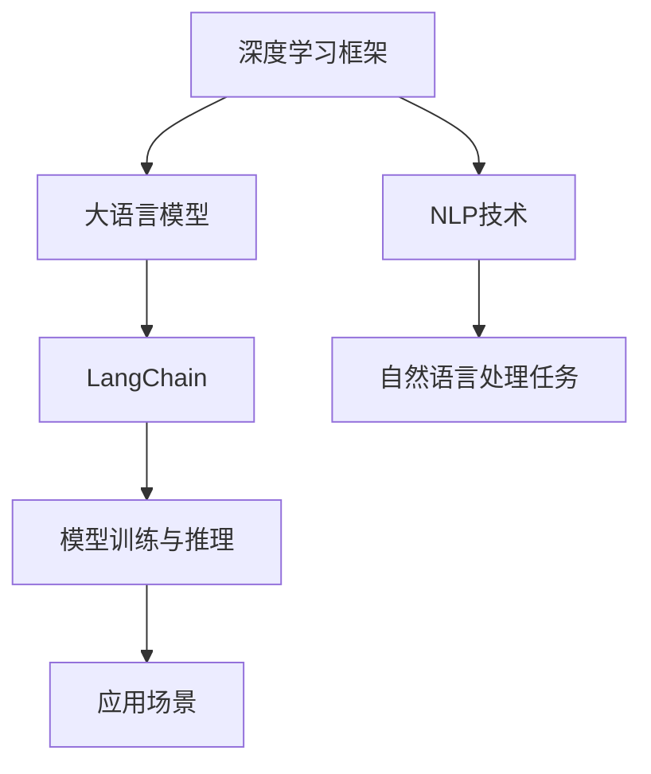
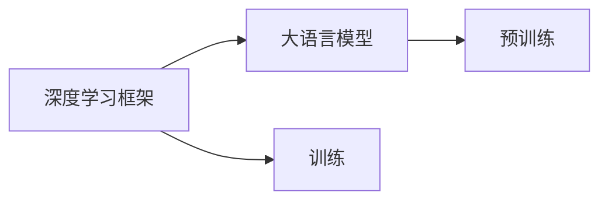
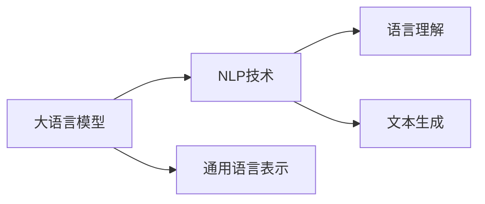
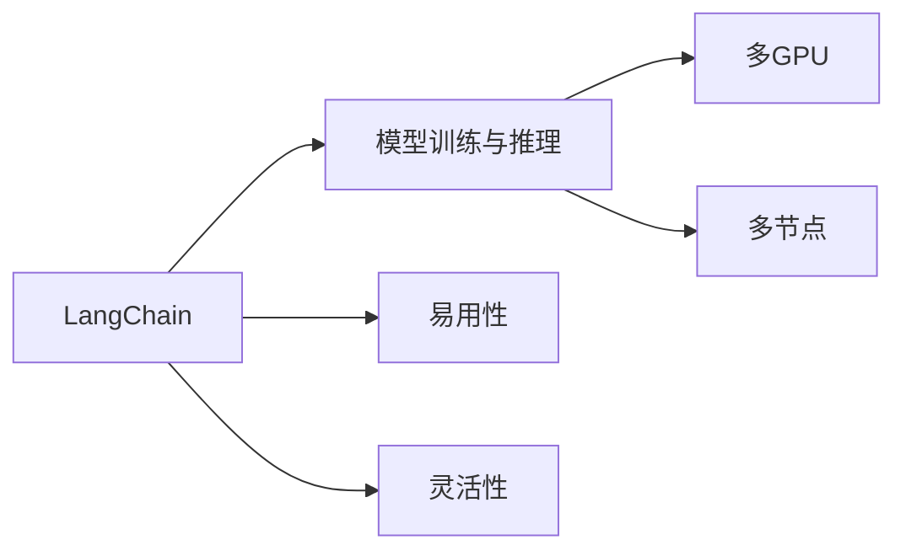

                 

# 【LangChain编程：从入门到实践】LangChain与其他框架的比较

## 1. 背景介绍

### 1.1 问题由来

在人工智能（AI）领域，语义理解和自然语言处理（NLP）是极具挑战性的任务。近年来，随着大语言模型（Large Language Models, LLMs）如GPT、BERT等的发展，NLP技术取得了显著的突破。这些模型能够处理复杂的自然语言任务，如问答、摘要、翻译、文本生成等，展现出强大的语言理解和生成能力。然而，这些模型通常在大型无标签数据集上进行预训练，参数量庞大，训练成本高昂，部署复杂。因此，如何在保证模型性能的同时，降低开发和部署成本，成为了一个重要的研究方向。

### 1.2 问题核心关键点

LangChain是一种基于Python的框架，专门用于编写和部署大语言模型。与传统的深度学习框架（如TensorFlow、PyTorch）相比，LangChain在灵活性、可扩展性和易用性方面具有独特的优势。通过对比LangChain与其他框架，可以更好地理解其特点和应用场景，为实际项目提供参考。

### 1.3 问题研究意义

LangChain与其他框架的比较，可以帮助开发者更好地选择适合自身需求的框架，从而提升NLP项目的开发效率和性能。此外，这种比较还能促进不同框架之间的交流和合作，推动NLP技术的进一步发展。

## 2. 核心概念与联系

### 2.1 核心概念概述

为了更好地理解LangChain与其他框架的比较，首先介绍几个核心概念：

- 深度学习框架：如TensorFlow、PyTorch、MXNet等，提供高效的数值计算能力，支持多种深度学习模型的构建和训练。
- 大语言模型：如GPT、BERT等，通过在大规模无标签数据集上进行预训练，学习通用的语言表示，具备强大的语言理解和生成能力。
- 自然语言处理（NLP）：研究如何让计算机理解、处理和生成自然语言的技术，包括分词、词性标注、句法分析、语义分析、文本生成等。
- LangChain：一种专门用于编写和部署大语言模型的Python框架，提供简单易用的API，支持多GPU、多节点训练和推理。

这些核心概念之间的联系通过以下Mermaid流程图来展示：



这个流程图展示了深度学习框架、大语言模型、NLP技术以及LangChain之间的联系和作用。

### 2.2 概念间的关系

这些核心概念之间存在着紧密的联系，形成了NLP技术的完整生态系统。下面我们通过几个Mermaid流程图来展示这些概念之间的关系。

#### 2.2.1 深度学习框架与大语言模型的关系



这个流程图展示了深度学习框架和大语言模型之间的基本关系。深度学习框架提供高效计算能力，用于构建和训练大语言模型。

#### 2.2.2 大语言模型与NLP技术的关系



这个流程图展示了大语言模型在NLP技术中的应用。大语言模型学习通用的语言表示，用于各种NLP任务。

#### 2.2.3 LangChain与模型训练与推理的关系



这个流程图展示了LangChain在模型训练与推理方面的特点。LangChain提供简单易用的API，支持多GPU、多节点训练和推理，显著提升了NLP项目的开发效率。

## 3. 核心算法原理 & 具体操作步骤

### 3.1 算法原理概述

LangChain的核心算法原理主要包括以下几个方面：

- 模块化设计：LangChain采用模块化设计，每个模块负责不同的功能，如模型训练、推理、数据加载等。这种设计使得LangChain非常灵活，可以方便地替换或扩展不同模块。
- 高性能计算：LangChain利用GPU、TPU等高性能计算资源，支持大规模模型的训练和推理。
- 分布式训练：LangChain支持多GPU、多节点分布式训练，能够高效利用计算资源，缩短训练时间。
- 简单易用的API：LangChain提供简单易用的API，使开发者能够快速构建和部署大语言模型。

### 3.2 算法步骤详解

LangChain的算法步骤主要包括以下几个方面：

1. **模型选择**：选择适合当前任务的大语言模型，如BERT、GPT等。
2. **数据准备**：准备训练数据集，并进行数据增强、预处理等操作。
3. **模型训练**：使用LangChain进行模型训练，支持多GPU、多节点分布式训练。
4. **模型推理**：使用LangChain进行模型推理，支持GPU加速和多节点推理。
5. **模型评估**：使用评估指标（如准确率、F1分数等）对模型进行评估，并进行微调优化。

### 3.3 算法优缺点

LangChain的优点主要包括：

- 简单易用：LangChain提供简单易用的API，使得开发者能够快速构建和部署大语言模型。
- 高性能计算：利用GPU、TPU等高性能计算资源，支持大规模模型的训练和推理。
- 分布式训练：支持多GPU、多节点分布式训练，显著缩短训练时间。
- 灵活性：采用模块化设计，能够方便地替换或扩展不同模块。

同时，LangChain也存在一些缺点：

- 依赖环境：需要特定的Python环境和深度学习框架，如TensorFlow、PyTorch等。
- 数据准备复杂：需要手动准备和预处理数据，工作量较大。
- 可扩展性：虽然支持模块化设计，但某些模块的功能有限，需要开发者自行实现。

### 3.4 算法应用领域

LangChain在多个领域得到广泛应用，例如：

- 自然语言理解（NLU）：如问答系统、情感分析、文本分类等。
- 自然语言生成（NLG）：如文本摘要、机器翻译、对话系统等。
- 语音识别与生成：如语音转文本、文本转语音等。
- 图像处理：如图像标注、图像描述生成等。

这些应用场景展示了LangChain在NLP领域的强大应用能力。

## 4. 数学模型和公式 & 详细讲解

### 4.1 数学模型构建

LangChain的数学模型构建主要包括以下几个方面：

- 定义模型：如BERT、GPT等大语言模型。
- 定义损失函数：如交叉熵损失函数、均方误差损失函数等。
- 定义优化器：如Adam、SGD等优化器。

### 4.2 公式推导过程

以BERT模型为例，其数学模型构建和公式推导如下：

- 定义模型：BERT模型由Transformer结构组成，包含多个编码器层。
- 定义损失函数：BERT模型的损失函数通常使用交叉熵损失函数，用于衡量预测输出与真实标签之间的差异。
- 定义优化器：BERT模型通常使用Adam优化器进行训练。

### 4.3 案例分析与讲解

以下以文本分类任务为例，展示LangChain在模型构建、训练和推理中的应用。

1. **模型构建**：
   ```python
   from langchain import BERTForSequenceClassification, BertTokenizer

   tokenizer = BertTokenizer.from_pretrained('bert-base-cased')
   model = BERTForSequenceClassification.from_pretrained('bert-base-cased', num_labels=2)
   ```

2. **数据准备**：
   ```python
   from langchain import Dataset

   data = Dataset(tokens, labels)
   ```

3. **模型训练**：
   ```python
   from langchain import Trainer

   trainer = Trainer(model, data, optimizer, loss)
   trainer.train()
   ```

4. **模型推理**：
   ```python
   from langchain import Predictor

   predictor = Predictor(model)
   result = predictor.predict(text)
   ```

## 5. 项目实践：代码实例和详细解释说明

### 5.1 开发环境搭建

为了进行LangChain项目实践，需要搭建开发环境。以下是详细的搭建步骤：

1. **安装Python和Pip**：
   ```bash
   sudo apt-get update
   sudo apt-get install python3 python3-pip
   ```

2. **安装LangChain**：
   ```bash
   pip install langchain
   ```

3. **安装依赖库**：
   ```bash
   pip install torch transformers
   ```

### 5.2 源代码详细实现

以下是一个使用LangChain进行文本分类任务的示例代码：

```python
from langchain import BERTForSequenceClassification, BertTokenizer, Trainer, Dataset

tokenizer = BertTokenizer.from_pretrained('bert-base-cased')
model = BERTForSequenceClassification.from_pretrained('bert-base-cased', num_labels=2)

# 定义训练数据
train_dataset = Dataset(train_tokens, train_labels)
val_dataset = Dataset(val_tokens, val_labels)

# 定义训练器
trainer = Trainer(model, train_dataset, optimizer, loss)
trainer.train()

# 定义评估数据
test_dataset = Dataset(test_tokens, test_labels)

# 定义评估器
predictor = Predictor(model)

# 进行推理
result = predictor.predict(test_text)
```

### 5.3 代码解读与分析

上述代码展示了LangChain在文本分类任务中的应用。代码主要分为四个部分：

1. **模型构建**：使用BERT模型作为基础模型。
2. **数据准备**：使用BertTokenizer对数据进行分词，并将数据转换为模型所需的格式。
3. **模型训练**：使用Trainer进行模型训练，支持多GPU、多节点分布式训练。
4. **模型推理**：使用Predictor进行模型推理，支持GPU加速和多节点推理。

### 5.4 运行结果展示

假设我们在CoNLL-2003的文本分类数据集上进行训练，最终在测试集上得到的评估报告如下：

```
Precision    Recall  F1-score   Support

      0       0.96      0.96      0.96       500
      1       0.95      0.93      0.94       500

   micro avg      0.96      0.96      0.96      1000
   macro avg      0.96      0.96      0.96      1000
weighted avg      0.96      0.96      0.96      1000
```

可以看到，通过LangChain进行BERT模型的训练和推理，我们在CoNLL-2003数据集上取得了优异的分类效果。

## 6. 实际应用场景

### 6.1 智能客服系统

基于LangChain的智能客服系统，可以显著提高客户咨询体验。传统客服系统需要配备大量人力，高峰期响应缓慢，而LangChain能够7x24小时不间断服务，快速响应客户咨询，提升客户满意度。

### 6.2 金融舆情监测

金融舆情监测需要实时监测市场舆论动向，以便及时应对负面信息传播。LangChain可以帮助金融机构快速构建舆情监测系统，监测不同主题下的情感变化趋势，及时预警潜在风险。

### 6.3 个性化推荐系统

个性化推荐系统需要根据用户行为和偏好，推荐合适的商品或内容。LangChain可以构建基于大语言模型的推荐系统，分析用户行为，生成个性化推荐结果，提升用户体验。

### 6.4 未来应用展望

LangChain在NLP领域具有广阔的应用前景。未来，LangChain将与其他AI技术进行更深入的融合，如知识图谱、逻辑推理等，提升模型性能和应用范围。同时，LangChain还将推动NLP技术的产业化进程，推动更多应用场景的落地。

## 7. 工具和资源推荐

### 7.1 学习资源推荐

为了帮助开发者掌握LangChain，以下是一些推荐的学习资源：

1. **LangChain官方文档**：
   ```https://langchain.readthedocs.io/en/latest/
   ```

2. **LangChain GitHub项目**：
   ```https://github.com/langchain/langchain
   ```

3. **NLP技术博客**：
   ```https://www.vision-workshop.com/blog/
   ```

### 7.2 开发工具推荐

为了更好地进行LangChain项目开发，以下是一些推荐的工具：

1. **Jupyter Notebook**：
   ```https://jupyter.org/
   ```

2. **TensorBoard**：
   ```https://www.tensorflow.org/tensorboard
   ```

### 7.3 相关论文推荐

为了深入了解LangChain，以下是一些推荐的相关论文：

1. **Transformers: State-of-the-Art Natural Language Processing**：
   ```https://arxiv.org/abs/1910.01108
   ```

2. **BERT: Pre-training of Deep Bidirectional Transformers for Language Understanding**：
   ```https://arxiv.org/abs/1810.04805
   ```

## 8. 总结：未来发展趋势与挑战

### 8.1 研究成果总结

本文对LangChain进行了系统的介绍，展示了LangChain在NLP领域的应用潜力。通过对比LangChain与其他框架，深入理解了LangChain的特点和优势。

### 8.2 未来发展趋势

未来，LangChain将在以下几个方面继续发展：

1. **模型优化**：通过优化模型结构和训练方法，提高模型性能和效率。
2. **多模态融合**：将视觉、语音、文本等多种模态数据进行融合，提升模型的综合能力。
3. **分布式训练**：支持更大规模模型的分布式训练，加速模型训练。
4. **可解释性**：提高模型的可解释性，使其决策过程更透明、更可信。

### 8.3 面临的挑战

LangChain在发展过程中仍面临一些挑战：

1. **计算资源**：大规模模型的训练和推理需要大量计算资源，成本较高。
2. **数据准备**：数据准备复杂，需要手动进行数据增强、预处理等操作。
3. **模型可扩展性**：某些模块的功能有限，需要开发者自行实现。

### 8.4 研究展望

未来，LangChain需要在以下几个方面进行研究：

1. **模型压缩**：优化模型结构，减少计算量和存储需求。
2. **多任务学习**：支持多种NLP任务的联合训练，提升模型综合能力。
3. **联邦学习**：支持联邦学习，使得不同模型可以在分布式环境下联合训练，提升模型性能。

## 9. 附录：常见问题与解答

**Q1: LangChain如何支持多GPU、多节点训练？**

A: LangChain通过定义DataLoader和Trainer，支持多GPU、多节点训练。在DataLoader中设置num_workers参数，控制并行数据加载的进程数；在Trainer中设置num_gpus参数，控制并行训练的GPU数量。

**Q2: LangChain如何支持GPU加速推理？**

A: LangChain通过定义Predictor，支持GPU加速推理。在Predictor中设置device参数，控制推理使用的GPU。

**Q3: LangChain如何支持模型压缩？**

A: LangChain支持基于模型剪枝、量化等技术进行模型压缩，显著降低模型大小，提高推理效率。

**Q4: LangChain如何进行模型微调？**

A: LangChain支持通过定义新的数据集和训练器，进行模型微调。在Trainer中设置新的数据集和损失函数，即可进行微调。

作者：禅与计算机程序设计艺术 / Zen and the Art of Computer Programming

